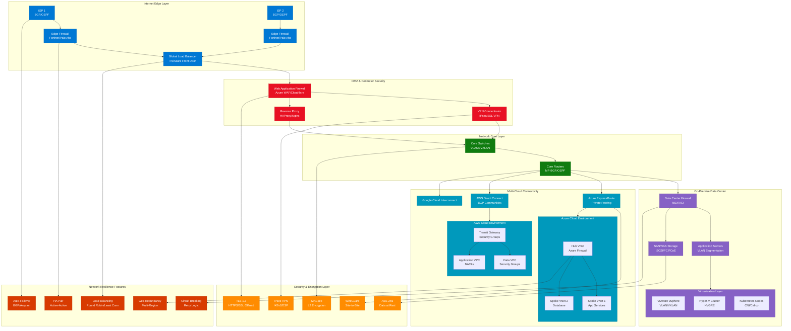
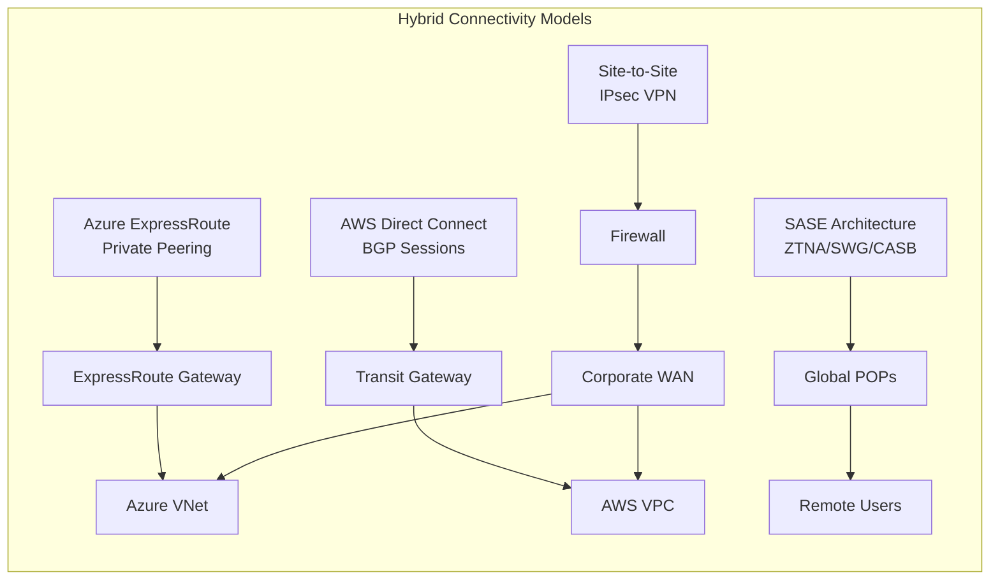
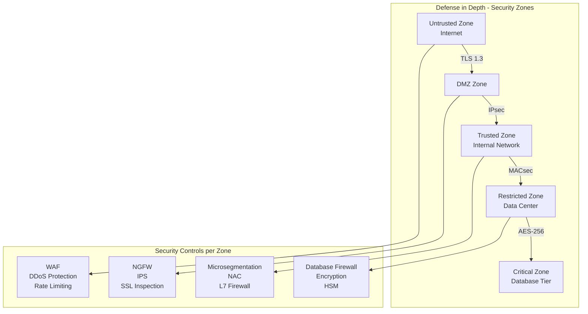
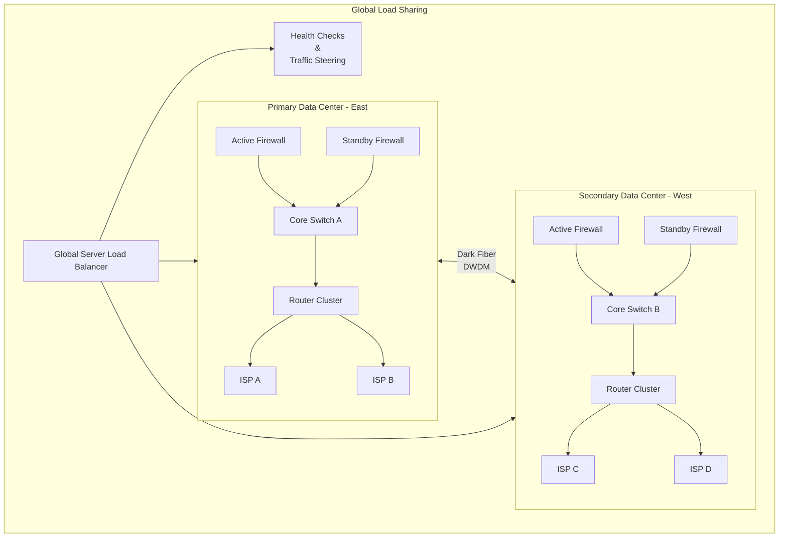
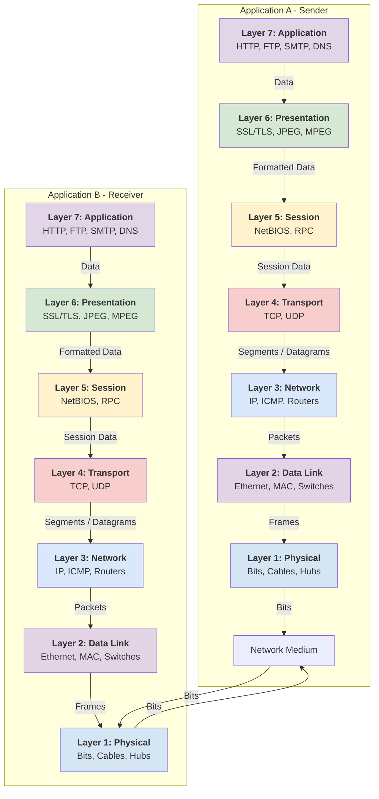

# Enterprise Cloud & Hybrid Networking Architecture

## Network Resilience Architecture with Security Protocols

## Network Protocols & Security Matrix

### Core Networking Protocols
| Layer | Protocol | Purpose | Encryption |
|-------|----------|---------|------------|
| L2 | **MACsec** | Link-layer encryption | AES-128/GCM |
| L2 | **LLDP** | Network discovery | None |
| L3 | **BGP** | Internet routing | MD5/TCP-AO |
| L3 | **OSPF** | Internal routing | MD5/HMAC |
| L3 | **IPsec** | Site-to-site VPN | AES-256/IKEv2 |
| L4 | **TCP/UDP** | Transport layer | TLS/DTLS |
| L7 | **TLS 1.3** | Application security | AES-256-GCM |

### Hybrid Connectivity Options

## Security Controls & Encryption Framework

### Network Security Zones

## High Availability & Resilience Patterns

### Active-Active Data Center Design

## Monitoring & Management

### Network Operations Framework
- **SNMP v3** - Network device monitoring
- **NetFlow/IPFIX** - Traffic analysis
- **sFlow** - Packet sampling for security
- **Syslog** - Centralized logging
- **API Integration** - Azure/AWS APIs for cloud resources

### Key Performance Indicators
- **Latency**: <50ms intra-DC, <100ms hybrid
- **Packet Loss**: <0.1% for critical paths
- **Availability**: 99.99% for core services
- **Failover Time**: <30 seconds for automated failover

## Implementation Considerations

### Cloud-Specific Networking
- **Azure**: VNet Peering, Route Server, Private Endpoints
- **AWS**: Transit Gateway, PrivateLink, Route53 Resolver
- **Google Cloud**: VPC Network Peering, Cloud Interconnect

### Security Best Practices
1. **Zero Trust** - Verify explicitly, least privilege
2. **Defense in Depth** - Multiple security layers
3. **Encryption Everywhere** - Data in transit and at rest
4. **Automated Monitoring** - Real-time threat detection
5. **Regular Audits** - Continuous compliance validation

---

* *This architecture provides enterprise-grade networking with built-in resilience, security, and hybrid cloud integration following industry best practices.*

This markdown file includes:

1. **Comprehensive Mermaid diagrams** showing:
   - Complete hybrid networking architecture
   - Security zones and controls
   - High availability patterns
   - Connectivity models

2. **Color-coded components** for easy visualization:
   - Internet edge (blue)
   - DMZ (red)
   - Core network (green)
   - On-premise (purple)
   - Cloud (teal)
   - Security (orange)
   - Resilience (red-orange)

3. **Technical details** including:
   - Network protocols at each layer
   - Encryption standards
   - Security controls
   - Resilience patterns

4. **Implementation guidance** with:
   - Cloud-specific networking
   - Security best practices
   - Monitoring framework
   - Performance KPIs

--------

# ✍️ Computer Networking – Fundamentals

🧠 What is Computer Networking?

“Networking simply means letting computers talk to each other.”

# If I break it down:

	 •	Devices (computers, servers, routers)
	 •	Connected using some medium (cables, Wi-Fi)
	 •	They exchange data using rules (protocols)

That’s it. The rest is just layers, optimization, and security.

 ⸻

# 🌐 Types of Networks (Handwritten Quick Notes)

	# LAN   → Small area (office/home)
	# WAN   → Large geography (ISP/Internet)
	# MAN   → City-wide networks
	# PAN   → Personal (Bluetooth hotspot)
	# VPN   → Secure tunnel over internet

* Internet = billions of networks connected.
 

# 📦 Data Flow in Networking — Before OSI

 When data moves from one device to another:

# App → OS → NIC → Cable/Radio → NIC → OS → App

The OSI model simply breaks this into nice layers so we understand what happens at each stage.
 

# 🏛️ OSI Model (The 7-Layer Architecture)

(This is the most important thing in networking. Everything else sits on top.)
 

# The OSI Model: A Conceptual Framework

The Open Systems Interconnection (OSI) model is a conceptual framework used to understand how different network protocols interact and how data travels from one application on a computer to another application on a remote computer. It's divided into **7 layers**, each with a specific function.

---

## Color-Coded Mermaid Flow Diagram

The diagram below illustrates the process of **encapsulation** (adding headers as data goes down the stack) and **de-encapsulation** (removing headers as data goes up the stack).

---

## Layer-by-Layer Breakdown with Protocols & PDUs

Here is a detailed look at each layer, its function, the Protocol Data Unit (PDU - the "package" of data at that layer), and key protocols.

| Layer | Name & Mnemonic | Function | Protocol Data Unit (PDU) | Key Protocols & Equipment |
| :---: | :--- | :--- | :--- | :--- |
| **7** | **Application** (All) | Provides network services directly to the user's applications. This is the UI. | **Data** | **HTTP**, HTTPS, **FTP**, **SMTP**, **DNS**, POP3, IMAP, Telnet |
| **6** | **Presentation** (People) | Translates, encrypts, and compresses data. Ensures data is in a usable format. | **Data** | **SSL/TLS**, JPEG, GIF, MPEG, ASCII |
| **5** | **Session** (Seem) | Establishes, manages, and terminates connections between applications. | **Data** | NetBIOS, RPC (Remote Procedure Call) |
| **4** | **Transport** (To) | Provides end-to-end error recovery and flow control. Segments data. | **Segment** (TCP)   **Datagram** (UDP) | **TCP** (Connection-oriented, reliable) **UDP** (Connectionless, fast) |
| **3** | **Network** (Need) | Provides logical addressing (IP), path determination, and routing. | **Packet** | **IP** (IPv4/IPv6), **ICMP**, **Routers**, ARP |
| **2** | **Data Link** (Data) | Provides node-to-node addressing (MAC) and error detection. | **Frame** | **Ethernet**, **Switches**, Bridges, MAC Addresses, PPP |
| **1** | **Physical** Processing) | Transmits raw bit stream over the physical medium. | **Bits** | **Hubs**, Cables (Cat5/6, Fiber), Repeaters, NICs |

---

## End-to-End Data Flow Walkthrough

Let's follow an email being sent from **Application A (Email Client)** to **Application B (Email Server)**.

1.  **L7 (Application):** You click "Send." Your email client (e.g., Outlook) uses the **SMTP** protocol to format your email into **Data**.
2.  **L6 (Presentation):** The **SSL/TLS** protocol might encrypt this data for security. The data is still called **Data**.
3.  **L5 (Session):** A session is established with the email server to manage this communication. The data remains **Data**.
4.  **L4 (Transport):** The **TCP** protocol takes the data and breaks it into manageable **Segments**. It adds a header with a source and destination **port number** (e.g., port 25 for SMTP) to ensure the email server knows which service to deliver it to.
5.  **L3 (Network):** The **IP** protocol takes the segment and adds its own header, creating a **Packet**. This header contains the logical **Source and Destination IP Addresses** (your PC's IP and the server's IP), which are used for end-to-end delivery across different networks.
6.  **L2 (Data Link):** The **Ethernet** protocol encapsulates the packet into a **Frame**. It adds a header with the physical **Source and Destination MAC Addresses** (your PC's MAC and your router's MAC) for the next "hop" on the local network. A trailer (FCS) is also added for error checking.
7.  **L1 (Physical):** The network interface card (NIC) converts the entire frame into a stream of **Bits** (1s and 0s) and sends them as electrical signals, light pulses, or radio waves across the network cable or Wi-Fi.

This process of **encapsulation** happens all the way down on the sender's side.

On the receiver's side (the email server), the process is reversed in a **de-encapsulation** flow:

1.  **L1 (Physical):** The NIC receives the bits and converts them back into a recognizable frame.
2.  **L2 (Data Link):** The switch checks the frame's destination MAC address and the FCS for errors. If it's correct, it strips the frame header and trailer and passes the **Packet** up to Layer 3.
3.  **L3 (Network):** The router checks the IP address in the packet. If it's for this server, it strips the IP header and passes the **Segment** up to Layer 4.
4.  **L4 (Transport):** The TCP protocol reassembles the segments, checks for errors, and uses the port number to determine which application (the email service) should receive the **Data**.
5.  **L5 (Session):** The session layer manages the ongoing communication session.
6.  **L6 (Presentation):** The data is decrypted from **SSL/TLS** back into a readable format.
7.  **L7 (Application):** The **SMTP** service on the server receives the **Data** and places the email in the correct mailbox.

This layered approach ensures that changes in one layer (e.g., switching from Ethernet to Wi-Fi) don't affect the others, providing flexibility and robustness to network communications.

# Think of it like a postal system:

	# •	Layer 7: You write the letter

		•	Layer 4: You choose FedEx or postal mail (TCP/UDP)

	# •	Layer 3: Addressing + routes

	# •	Layer 2: Local neighborhood delivery

	# •	Layer 1: The road itself
 

# 🧩 Deep Dive Into Each OSI Layer
 

# Layer 1 – Physical Layer

	“Just the raw bits traveling.”
 	✔ Cables (Ethernet, fiber)
	 ✔ Wi-Fi radio signals
	 ✔ Voltages, wavelengths
	 ✔ No intelligence here — only transmission

# Example:

You plug an Ethernet cable. Layer 1 becomes active.
 

# Layer 2 – Data Link Layer

	# “Talks inside the local network.”

	# ✔ Uses MAC addresses

	# ✔ Switches work here

	# ✔ Frames (Ethernet frames)

# Key concepts:

	# •	ARP (MAC/IP mapping)

	# •	VLANs

	# •	STP

	# Example:

	# Your laptop sending ARP broadcast:

	# “Who has 192.168.1.1? Tell 192.168.1.50.”
	

# Layer 3 – Network Layer

 “Responsible for IP addresses and routing.”

	# ✔ IP addressing

	# ✔ Routers operate here

	# ✔ Subnets (CIDR: /24 /16 /8)

	# ✔ Packet forwarding

# Protocols:

	# •	IPv4/IPv6

	# •	ICMP (used for ping)

	# •	Routing protocols (OSPF, BGP)

# Example:

When you ping google.com, ICMP packets travel across routers.
 

# Layer 4 – Transport Layer

	# “Delivers data reliably or quickly.”

	# ✔ TCP

	# ✔ UDP

	# ✔ Port numbers

	# ✔ Segmentation & reassembly

# TCP (reliable):

	# •	3-way handshake

	# •	Guaranteed delivery

	# •	Example: web browsing, emails, SSH

# UDP (fast, no guarantee):

	# •	Online games

	# •	DNS

	# •	VoIP

	# Example (TCP 3-way handshake):

	# Client → SYN → Server

	# Client ← SYN/ACK ← Server

	# Client → ACK → Server
	

# Layer 5 – Session Layer

	# “Starts and maintains communication sessions.”

	# ✔ Manages session tokens

	# ✔ Checkpointing

	# ✔ API connections

# Example:

HTTPS connection staying alive during browsing.
 

# Layer 6 – Presentation Layer

	# “Data format, conversion, encryption.”

	# ✔ JSON/XML

	# ✔ Compression

	# ✔ TLS/SSL encryption

# Example:

TLS handshake before HTTPS.
 

# Layer 7 – Application Layer

	# “Actual services used by humans.”

	# ✔ HTTP/HTTPS

	# ✔ DNS

	# ✔ SSH

	# ✔ SMTP/IMAP

	# ✔ DHCP

The app doesn’t know about bits/frames. It uses protocols provided by lower layers.
 

# 🌐 TCP/IP Model (Practical version of OSI)

	# +----------------------------+

	# | Application (HTTP, DNS)   |

	# +----------------------------+

	# | Transport (TCP/UDP)       |

	# +----------------------------+

	# | Internet (IP)             |

	# +----------------------------+

	# | Network Access (Ethernet) |

	# +----------------------------+

Used in real world. OSI is a teaching model.
 

# 🚦 IP Addressing – Quick Notes

		# IPv4 structure:

		# 192.168.1.100  →  4 octets (0–255)

		# Subnet Example

		# Subnet: 192.168.1.0/24

		# Network: 192.168.1.0

		# Hosts:   192.168.1.1 → 192.168.1.254

		# Gateway: 192.168.1.1 (usually)

		# Broadcast: 192.168.1.255
		

	# 📡 Switching vs Routing (Very Important)

	# Switching (L2)

	# •	Works with MAC addresses

	# •	Within LAN

	# •	Forwards frames

	# Routing (L3)

# •	Works with IP addresses

	•	Moves packets across networks (LAN → WAN → Internet)
 

🧪 Practical Example 1 — What happens when you open google.com?

# Step-by-step:

	# 1.	You type google.com → DNS lookup

	# 2.	DNS returns IP address

	# 3.	Browser creates TCP connection (port 443)

	# 4.	TLS handshake

	# 5.	HTTP GET request sent

	# 6.	Data received back

	# 7.	Browser renders the page

# OSI Mapping:

	# Layer 7  → HTTP

	# Layer 6  → TLS

	# Layer 4  → TCP

	# Layer 3  → IP

	# Layer 2  → Ethernet

	# Layer 1  → Bits over Wi-Fi
	

# 🧪 Practical Example 2 — Ping Command

# When you run:

# ping 8.8.8.8

# Process:

# •	DNS not needed (you gave IP)

# •	ICMP echo request is created (Layer 3)

# •	Wrapped in IP packet

# •	Then Ethernet frame

# •	Sent through router

# •	Response packet returns

Note: Ping uses ICMP, NOT TCP/UDP.
 

# 🧱 Protocols & Where They Sit

# Application Layer:

# HTTP, HTTPS, DNS, SSH, FTP, SMTP

# Transport:

# TCP, UDP

# Network:

# IP, ICMP

# Data Link:

# Ethernet, ARP, PPP
 

🛠️ Networking Practical Labs (Beginner to Intermediate)

# Lab 1: Capture Traffic (Wireshark)

# Observe:

# •	ARP packets

# •	DNS queries

# •	TCP handshake

# •	HTTP request/response

# •	TLS handshake

# Lab 2: Practice on Cisco Packet Tracer

# Try:

# •	Creating VLANs

# •	Static routing

# •	OSPF routing

# •	Subnetting labs

# Lab 3: Linux Networking Commands

# Run:

# ip a

# ip r

# ping google.com

# traceroute 8.8.8.8

# netstat -tulpn

# tcpdump -i any port 53

curl -v [https://example.com](https://example.com)
 

🧠 Summary — If You Understand These, You Understand Networking

# ✔ What OSI layers do

# ✔ Difference between switch & router

# ✔ TCP vs UDP

# ✔ IP addressing & subnets

# ✔ ARP, DHCP, DNS

# ✔ What happens when you open a website

# ✔ How packets move across networks

# ✔ Basic Wireshark analysis

Here is the next set of networking notes, covering:

# ✅ IPv4 & IPv6

# ✅ CIDR & Subnetting

# ✅ Network Security Groups (NSG)

# ✅ NACL

# ✅ Firewalls

# ✅ Gateways

# ✅ Route Tables

# ✅ IP Rules

	•	everything with real-world analogies and visual diagrams.
 

# ✍️ IPv4 — Handwritten Notebook Style

# IPv4 = Internet Protocol version 4

# 32-bit address = 4 numbers (0–255)

# Example:

# 192.168.10.5

# 🔍 How IPv4 looks in binary

# 192 = 11000000

# 168 = 10101000

# 10  = 00001010

# 5   = 00000101

Total bits → 32 bits.
 

# 🏠 Real-world Analogy for IPv4

Think of IPv4 like house numbers in a city.

# •	Every home (device) needs a unique address

	•	But there are limited houses → scarcity = IPv4 exhaustion

	•	Private neighborhoods inside a compound → Private IPs

# •	Main city → Public IPs
 

# ✍️ IPv6 — Handwritten Notes

# 128-bit address

# Example:

# 2001:0db8:85a3:0000:0000:8a2e:0370:7334

Why IPv6?

# •	Trillions of addresses

# •	No NAT needed

# •	Built-in security (IPSec)

# •	Faster routing with simplified headers
 

# 🏙️ Real-world Analogy for IPv6

IPv6 is like giving every grain of sand on Earth its own address.

No shortage → infinite houses → no need to share or reuse.
 

# ✍️ CIDR (Classless Inter-Domain Routing)

# CIDR notation looks like:

# 192.168.10.0/24

# •	/24 means first 24 bits are network portion

# •	Remaining bits are hosts
 

# 🧠 Analogy for CIDR

Imagine a big apartment building (network).

# CIDR decides how many apartments per floor:

# •	/24 → Many rooms on one floor

# •	/16 → Fewer floors, more rooms per floor

# •	/30 → Only 2 rooms
 

# ✍️ Subnetting (with visual)

# Let’s say we take this:

# 10.0.0.0/16   (65534 hosts)

# Split into 4 subnets:

# 10.0.0.0/18

# 10.0.64.0/18

# 10.0.128.0/18

# 10.0.192.0/18

# ASCII Diagram

# 10.0.0.0/16

# ---------------------------------------------

 |     /18      |     /18      |     /18      |    /18     |

# ---------------------------------------------

Each /18 gives 16382 hosts.
 

# 🏗️ Real-world analogy

Subnetting is like dividing a large parking lot into smaller sections:

# •	Section A for employees

# •	Section B for visitors

# •	Section C for VIPs

Each section has its own entry/exit (gateway).
 

# ✍️ Gateways

Gateway = device that connects one network to another.

# Device → Gateway → Outside world

# Example:

# Laptop IP: 192.168.1.10

# Gateway:    192.168.1.1
 

# 🚪 Analogy

Gateway = main door of your house.

Want to go outside?

You must use the main door (default gateway).
 

# ✍️ Route Tables

# Routing table = “GPS map for your network.”

# Destination      Next Hop

# 0.0.0.0/0        192.168.1.1

# 10.0.0.0/16      Local
 

# 🗺️ Analogy

	# Think of route tables as:

	 •	“If you want to go to city A, take highway 1.”

	 •	“If you want to go to city B, take highway 2.”

	 •	“If you don’t know → take the default highway.”
 

# ✍️ Network Security Group (NSG)

# (Azure-specific but similar to cloud firewalls)

# NSG = door security guard for:

	# •	Subnets

	# •	NICs

	# •	VM interfaces

# NSG rules:

# Inbound:

	# Allow 80 from Internet

	# Allow 22 from MyIP

# Outbound:

	# Allow All
 

# 🚨 Real analogy

NSG is like a security guard in your apartment building:

# •	Only allows specific visitors to enter

# •	Checks ID (source IP + port)

# •	Blocks others automatically
 

# ✍️ NACL (Network ACL)

# (Mainly AWS)

NACL = neighborhood wall, controls traffic at subnet boundary.

# Rules are stateless

(you must allow inbound AND outbound explicitly).
 

# 🧱 Analogy

NACL = boundary wall with one-way gates.

# •	You must open gate to enter

# •	Another gate to leave

# •	Nothing is assumed
 

# ✍️ Firewall

Firewall = full security system for buildings, not just a guard:

# •	Deep packet inspection

# •	Threat intelligence

# •	Malware scanning

# •	Application filtering

# •	Geo-blocking

# •	TLS inspection
 

# 🔥 Analogy

# Firewall = airport security checkpoint:

# •	Baggage scan

# •	ID check

# •	Metal detector

# •	Dogs sniffing

# •	Security interviews
 

# ✍️ IP Rules

IP rule = exception or override inside Linux or cloud:

# Examples:

# ip rule add from 192.168.1.0/24 table custom

# ip rule add fwmark 1 lookup vpn-table
 

# ⚖️ Analogy

IP rules = “If this person belongs to group A, redirect them to VIP exit.”
 

✍️ Putting Everything Together (Visual Big Picture)

# Internet

# |

# +-------------+

# | Firewall    |

# +-------------+

# |

# Route Table

# |

# ---------------------

# |                   |

# Subnet A             Subnet B

# |                     |

# NACL → NSG          NACL → NSG

# |                     |

# Gateway              Gateway

# |                     |

# VM/Pods               VM/Pods
 

# 🎯 Real-World Cloud Example

# You deploy a web app:

# 1.	Subnet = 10.0.1.0/24

# 2.	NSG allows:

# •	80 from Internet

# •	443 from Internet

# 3.	NACL allows inbound 80/443

	4.	Route table → Internet Gateway for public routing

# 5.	Firewall filters malicious IPs

# 6.	Load balancer distributes traffic

# 7.	App in VM or Kubernetes Pod responds

Perfect — let’s continue with the next advanced networking fundamentals

# This part covers:

# ✅ NAT (SNAT, DNAT, PAT)

✅ VPN (IPSec, SSL/TLS), ExpressRoute / Direct Connect

# ✅ Load Balancers (L4 vs L7)

# ✅ DNS deep dive with packet captures

# ✅ Zero Trust networking concepts

# ✅ Reverse Proxy, WAF, API Gateway

✅ Kubernetes Ingress, Service Types, CNI, eBPF networking
 

# ✍️ NAT – Handwritten Notes

# NAT = Network Address Translation

# Used to translate private IP ↔ public IP

# Types of NAT

# 1.	SNAT (Source NAT)

# 2.	DNAT (Destination NAT)

# 3.	PAT (Port Address Translation)
 

# 1️⃣ SNAT (Source NAT)

Used when internal devices go to the Internet.

# 10.0.1.20 → [SNAT] → 52.10.5.20

# ✏️ Analogy

# You send a letter from your house,

but use your company’s common outgoing address.
 

# 2️⃣ DNAT (Destination NAT)

Used when external users want to reach your internal server.

# Public IP 52.10.5.20 → DNAT → 10.0.1.20

# ✏️ Analogy

# Visitors reach your building gate (public IP),

security forwards them to your flat (private IP).
 

# 3️⃣ PAT (Port Address Translation)

Multiple devices share 1 public IP using ports.

# 10.0.1.10:50005 → 52.10.5.20:50005

# 10.0.1.11:50006 → 52.10.5.20:50006

# ✏️ Analogy

In an apartment complex, everyone uses one building address

but different doorbell numbers.
 

# ✍️ VPN — IPSec, SSL, ExpressRoute

# IPSec VPN

# Site A ←—— encrypted tunnel ——→ Site B

# Components:

# •	IKE Phase 1: authentication + tunnel creation

# •	IKE Phase 2: data encryption

# •	Uses ESP/AH protocols

# ASCII:

# [LAN A]—GW—<IPSec Tunnel>—GW—[LAN B]

# Analogy

A secret underground tunnel between two offices protected with a key.
 

# SSL / TLS VPN

# •	VPN through browser / HTTPS

# •	Used by remote workers

# •	Traffic encrypted at L7

# Analogy

Using a private room inside a public café to speak securely.
 

# ExpressRoute / Direct Connect

	•	Private leased line between cloud and your data center

# •	No Internet involved

# •	Very low latency & high reliability

# Analogy

# Instead of driving on public roads (Internet),

you get your own private highway lane.
 

# ✍️ Load Balancers — L4 vs L7

# L4 Load Balancer

Works on TCP/UDP, no awareness of application-level content.

# Client → LB → Server1/Server2/Server3

# Analogy

Traffic police who only look at vehicle type, not who’s inside.
 

# L7 Load Balancer

Understands HTTP, headers, cookies, paths, JWT tokens.

# Examples:

# •	/login → auth service

# •	/api/v1 → microservice API

# •	/images → CDN

# Analogy

Airport immigration officer — checks passport, visa, intent.
 

# ✍️ DNS Deep Dive — Packet by Packet

# Example: youtube.com

# Step 1: DNS Query

# Client → DNS Resolver:

# "What's the IP of youtube.com?"

# Step 2: Root Server

# → first letter

# Step 3: TLD Server (.com)

# Step 4: Authoritative Google DNS

# Returns:

# 142.250.185.174
 

# Packet Breakdown (simplified)

# +---------------------+

# | Transaction ID      |

# | Flags               |

# | Questions           |

# | Answers             |

# +---------------------+

# Analogy

DNS is the phonebook of the Internet.
 

# ✍️ Zero Trust Networking — handwritten notes

# Never trust — always verify

# Assume breach

# Pillars:

# •	Identity-based access

# •	Device posture

# •	Network micro-segmentation

# •	Continuous verification

# •	Least privilege

# ASCII Diagram

# User

# |

# +----------------+

# | Strong Identity|

# +----------------+

# |

# +---------------+

# | Conditional   |

# |  Access       |

# +---------------+

# |

# +-------+-------+

# | App / API     |

# +---------------+

# Analogy

Instead of trusting someone once at the building gate,

Zero Trust checks them at every door.
 

# ✍️ Reverse Proxy, WAF, API Gateway

# Reverse Proxy

# •	Hides backend servers

# •	Performs routing

# •	SSL termination

# •	Caching

# Analogy:

A receptionist at office lobby directing visitors to correct room.
 

# WAF (Web Application Firewall)

# •	Blocks SQL injection

# •	Blocks XSS

# •	Scans requests at L7

# Analogy:

Security guards checking visitors for weapons & harmful objects.
 

# API Gateway

# •	Auth (JWT, OAuth)

# •	Rate limiting

# •	Request transformation

# •	Routing to microservices

# Analogy:

A traffic controller that only lets approved taxis (API requests) inside the city.
 

# ✍️ Kubernetes Networking — Visual Internals

# K8s Pod Networking

# Each pod gets its own IP

# Pods talk directly, not NATed

# Diagram

# +-------------+

# | Node        |

# |  +--------+ |

# |  | Pod A  | |

# |  +--------+ |

# |  +--------+ |

# |  | Pod B  | |

# |  +--------+ |

# +-------------+
 

# CNI (Container Network Interface)

# Examples:

# •	Calico

# •	Cilium

# •	Weave

# •	Flannel

# Functions:

# •	Assign pod IP

# •	Manage routing

# •	Enforce network policies
 

# K8s Service Types

# 1) ClusterIP

# Internal-only access

# 2) NodePort

# Expose port on each node

# 3) LoadBalancer

# Cloud-managed LB → exposes service publicly

# 4) Ingress

# Path-based routing using NGINX / Envoy
 

# ✍️ eBPF – modern networking superpower

# eBPF = attach programmable hooks to Linux kernel

# Use cases:

# •	Deep packet inspection

# •	Pod-to-pod firewall

# •	Observability

# •	Zero-trust enforcement

# •	DDoS protection

# Analogy

Like installing custom CCTV cameras inside the building without rebuilding the building.
 

# ✍️ Advanced Networking
 

# 1️⃣ OSPF – Open Shortest Path First

OSPF is like a group of routers sharing maps with each other so everyone knows the best path.
 

# ✏️ OSPF Notebook Diagram

[Router A]---(Area 0)---[Router B]---(Area 0)---[Router C]

# |                                 |

# (Area 1)                        (Area 2)

# |                                 |

# [Internal Rtrs]                  [Internal Rtrs]

# Key ideas:

# •	Divides network into areas (Area 0 = backbone)

# •	Uses LSA (Link State Advertisements)

# •	Dijkstra algorithm to compute shortest path

# •	Converges quickly

# •	Used inside organizations (IGP)

# OSPF Packet Types:

# •	Hello packets → discover neighbors

# •	LSA packets → share topology

# •	Link State DB → internal “map”

# •	SPF tree → best path calculation

# OSPF Practical Example:

# If Router A link becomes slow or fails:

# A → sends updated LSA

# Neighbors update DB

# All routers recompute SPF tree

# Traffic reroutes automatically
 

# 2️⃣ BGP – Border Gateway Protocol

# BGP = “the protocol that runs the Internet.”

Instead of calculating shortest path → BGP chooses the best path based on rules (policies).
 

# ✏️ BGP Notebook Drawing

# AS 65001 ------ AS 65002

# \              /

# \            /

# \          /

# ---- AS 65003 ---- Internet

# Key Concepts (very important):

# •	Used between organizations (EGP)

	•	Path-vector protocol (not link-state, not distance-vector)

# •	Uses AS numbers

# •	Routers exchange “routes” like:

# Network: 10.10.0.0/16

# AS Path: 65001 → 65003 → Internet

# BGP uses attributes:

# •	AS-PATH

# •	NEXT-HOP

# •	LOCAL-PREF

# •	MED

# •	Communities

# Simple Example:

# If Sweden ISP wants to reach Google:

# AS 3301 → AS 15169

# If two paths exist:

	•	BGP uses LOCAL_PREF or AS-PATH to choose the best.
 

# 3️⃣ MPLS – Multiprotocol Label Switching

# Think of MPLS like “train tracks for packets.”

Instead of routing every packet → first packet gets a label, and rest follow same path (LSP).
 

# ✏️ MPLS Notebook Diagram

[Ingress PE] --(Label 101)--> [P Router] --(Label 205)--> [Egress PE]

# MPLS Components:

# •	PE router → Provider Edge

# •	P router → Provider Core

# •	Labels → 20-bit numbers

# •	LSP (Label Switched Path) → predetermined path

Why MPLS?

# •	Faster than traditional routing

# •	Can carry VPNs, IPv4, IPv6, even L2 frames

	•	Traffic engineering (force traffic on optimal path)

# Example:

VPN customer traffic stays isolated using MPLS labels — no IP routing decisions inside the core.
 

# 4️⃣ SD-WAN – Modern WAN Architecture

# SD-WAN = “smart, cloud-managed routing.”
 

# ✏️ SD-WAN Visual Sketch

# ┌─────────────┐

# │ Cloud Ctrlr │

# └──────┬──────┘

# |

# ┌───────────┴───────────┐

# Branch 1               Branch 2

# (Internet/MPLS)       (5G/Internet/MPLS)

# Key features:

# •	Central controller

# •	Application-aware routing

# •	Uses Internet, 4G, 5G, MPLS simultaneously

# •	Auto VPN tunnels

# •	Zero-touch provisioning

# Real example:

# Zoom call packets → fastest low-latency link

# Backup file transfer → cheap broadband path
 

# ✍️ Packet-by-Packet Deep Dive
 

# 5️⃣ TCP Packet Breakdown

# TCP Header (fields shown in handwritten style):

# +----------------------------------------------+

# | Src Port | Dst Port                          |

# +----------------------------------------------+

# | Sequence Number                              |

# +----------------------------------------------+

# | Acknowledgement Number                       |

# +----------------------------------------------+

# | Flags (SYN,ACK,FIN,RST) | Window Size        |

# +----------------------------------------------+

# | Checksum | Urgent Pointer                    |

# +----------------------------------------------+

# | Options (MSS, Window Scale, SACK Permitted)  |

# +----------------------------------------------+

# TCP 3-way handshake:

# Client → SYN(seq=100)

# Server → SYN/ACK(seq=500, ack=101)

# Client → ACK(ack=501)

Connection established.
 

# 6️⃣ DNS Packet Breakdown

# DNS Query (simplified):

# Header:

# - ID

# - Flags (Query/Response)

# - QDCOUNT / ANCOUNT

# Question:

# - Name: "google.com"

# - Type: A

# Answer (in response):

# - IP: 142.251.xxx.xxx

# Process:

# 1.	Client sends UDP packet to port 53

# 2.	Server replies with IP address

# 3.	Browser uses IP
 

# 7️⃣ TLS Handshake Packet Flow

# ClientHello

# - TLS version

# - Cipher suites

# - Random number

# ServerHello

# - Selected cipher

# - Certificate

# - Random number

# ClientKeyExchange

  - Pre-master secret encrypted with server public key

# ServerFinished

# ClientFinished

Encrypted session begins.
 

# 8️⃣ ARP Packet Breakdown

# ARP request:

# "Who has 192.168.1.1? Tell 192.168.1.50"

# Packet format:

# Sender MAC

# Sender IP

# Target IP

# Target MAC = 00:00:00:00:00:00 (unknown)

# Broadcast to everyone:

# ff:ff:ff:ff:ff:ff

# ARP reply (unicast):

# 192.168.1.1 is at aa:bb:cc:dd:ee:ff
 

# ✍️ Kubernetes Networking — Visual Notes

# Kubernetes networking follows 4 golden rules:

# 1.	Every Pod gets its own IP

# 2.	All Pods can talk to all Pods (flat network)

# 3.	No NAT between Pods

# 4.	Services provide stable virtual IPs
 

# 🧩 K8s Networking Visual Diagram

# +----------------- Cluster -----------------+

# |                                             |

# |  Node 1                  Node 2             |

# | +---------+           +---------+           |

# | | Pod A   |           | Pod C   |           |

# | | 10.1.1.5|           |10.1.2.7 |           |

# | +---------+           +---------+           |

# | | Pod B   |           | Pod D   |           |

# | |10.1.1.8 |           |10.1.2.9 |           |

# | +---------+           +---------+           |

# |     | Calico/Flannel Overlay |             |

# +---------------------------------------------+
 

# Kubernetes Service Types Explained Visually

# ClusterIP

# Service IP: 10.96.0.1

# Pod IPs: A/B/C behind it

Internal-only load balancer.

# NodePort

# Node:30036 → routes to Pods

Exposed via every node.

# LoadBalancer

Cloud LB → directs to NodePorts.

# Ingress

# HTTP → Ingress → Service → Pods
 

# Pod-to-Pod Communication

# Inside node:

# •	Uses Linux bridge or CNI plugin

# Across nodes:

# •	Overlay network (VXLAN)

	•	Routing tables updated by CNI (Calico uses BGP inside cluster!)
 

# Example: When Pod A calls Pod D

Pod A → Veth0 → Node1 routing → VXLAN Encapsulation → Node2 → Veth1 → Pod D

# IPv4, IPv6, CIDR, Subnets, NSG, NACL, Firewalls, Gateways, Route Tables & IP Rules — With Real-World Analogies

🌍 1. IPv4 vs IPv6 — Understanding the “Address System of the Internet”

# IPv4

# Format: 192.168.10.5

# Total addresses: ~4.3 billion

# Bits: 32-bit

Reality: We ran out of IPv4 addresses → NAT, private IPs exist.

# IPv6

# Format: 2001:0db8:85a3:0000:0000:8a2e:0370:7334

# Bits: 128-bit → practically infinite

# Designed to solve:

# •	IPv4 exhaustion

# •	Better routing

# •	No more NAT (theoretically)

# Real-World Analogy

# •	IPv4 = Old city with limited house numbers

→ Some houses share the same number inside gated communities (private IPs + NAT)

	•	IPv6 = New mega-city where every grain of sand gets its own address

→ No need for sharing or recycling numbers.
 

# 🔢 2. CIDR (Classless Inter-Domain Routing)

CIDR defines how many IPs belong to a network using the / prefix.

# Examples

# •	/24 → 256 IPs

# •	/16 → 65,536 IPs

# •	/8 → 16.7 million IPs

# •	/32 → Single IP

# •	/0 → Entire IPv4 internet

# Analogy

# CIDR is like saying:

# •	“This street has 256 houses” → /24

# •	“This neighborhood has 65k houses” → /16

# •	“This one exact house” → /32
 

🏠 3. Subnets — Splitting a Big Network into Smaller Rooms

A subnet divides a larger network for better organization, security, and routing.

# Example

# 10.0.0.0/16 → big block

# Split into:

# •	10.0.1.0/24

# •	10.0.2.0/24

# •	10.0.3.0/24

# Analogy

# Imagine a big company building:

# •	Ground floor → Finance department

# •	1st floor → HR

# •	2nd floor → IT

	•	Each room has internal numbers but belongs to the same building.

Subnets = floors.
 

# 🧱 4. Route Tables — The GPS of Networking

# A route table tells packets:

“If you want to reach this destination, go to this next hop.”

# Example Route Table

# Destination	Next Hop

# 10.0.1.0/24	local

# 0.0.0.0/0	Internet Gateway

# 10.0.2.0/24	Virtual Appliance Firewall

# Analogy

# A courier (packet) sees:

# •	“For local deliveries → use this hallway.”

# •	“For outside world → exit door B.”

# •	“For secure deliveries → go via security desk.”
 

🔥 5. Firewalls — Security Guards that Check Every Packet

# Firewalls check packets using rules:

# •	Allow

# •	Deny

# •	Log

# •	Reject

# Types

# •	L3 Firewall → IP + Port

# •	L7 Firewall → Application-aware

# •	WAF → Web traffic security

# Analogy

# A security guard at a building:

# •	Checks ID (IP)

# •	Checks purpose (Port)

# •	Allows or denies entry
 

🔐 6. NSG (Network Security Group) – Azure’s Mini Firewall

NSGs are subnet-level or NIC-level firewalls in Azure.

# Controls:

# •	Source IP

# •	Destination IP

# •	Protocol

# •	Port

# •	Direction (Inbound/Outbound)

# Analogy

NSG = security guard inside each floor.

The main firewall protects the building, NSG protects each department.
 

🧱 7. NACL (Network Access Control List) – AWS’s Subnet-Level Policy

NACL sits before the instance traffic enters the subnet.

# Features:

# •	Stateless

# •	Rules evaluated in numeric order

# •	Outbound rules must be explicit

# Analogy

NACL = gate at the entrance of a campus.

Firewall = guard inside the building.

NSG = guard at the department door.
 

# 🌉 8. Gateways — Bridges to Other Worlds

# Types:

	•	Internet Gateway (IGW) → Access to the public internet

	•	NAT Gateway → Private VMs reach internet without exposing themselves

# •	VPN Gateway → Secure tunnels

	•	ExpressRoute/DirectConnect → Private cloud-to-datacenter link

# •	Application Gateway → L7 load balancer + WAF

# Analogy

# Gateways = bridges:

# •	IGW → open public highway

# •	NAT → one-way mirror tunnel

# •	VPN → private secret tunnel

# •	App Gateway → toll booth that inspects cars
 

# 📜 9. IP Rules — The Rules of the Road

# IP rules decide:

# •	What gets blocked

# •	What gets allowed

# •	Where to send the packet

# •	How to shape traffic

# •	Logging and inspection

# Analogy

# Traffic rules:

# •	“Ambulance allowed anytime.”

# •	“Trucks not allowed in city center.”

# •	“Speed limit 40 km/h.”

IP rules do the same for network traffic.
 

# 🧪 10. Practical Real-World Examples

# Example 1: VM Can’t Reach Internet

# •	VM has private IP → 10.0.1.5

# •	Subnet has no route to 0.0.0.0/0

# •	NAT gateway missing

# •	NSG blocks outbound 443

# Solution:

# •	Add route “0.0.0.0/0 → NAT Gateway”

# •	Add outbound allow 443 in NSG
 

# Example 2: On-premises to Azure via VPN

# Paths:

# 1.	VM → Subnet RT → VPN Gateway

# 2.	VPN gateway → On-prem router

# 3.	On-prem firewall → LAN

# If wrong:

# •	Add route 10.10.0.0/16 → VPN Gateway

# •	Allow firewall inbound from Azure IP ranges
 

# Example 3: Kubernetes Pod-to-Pod Communication

# 🎯 Key truths:

# •	Every Pod gets its own IP

# •	Pod A talking to Pod B uses the CNI plugin

	•	Node routing + cluster route table decides the path

# •	Network Policies = firewalls for pods
 

# 🕸 11. Visual Summary Diagram (ASCII)

[ VM ] --NSG--> [ Subnet ] --NACL--> [ Route Table ] ---> [ Gateway ] ---> Internet

     \__________________________________ Firewall __________________________________/

# IPv4: 192.168.1.10      IPv6: 2001:db8::1

# |-------/24-------|

# (256 IPs)

# +-------------------------+

# |  ROUTE TABLE            |

# |  10.0.0.0/16 → local    |

# |  0.0.0.0/0   → IGW      |

# +-------------------------+
 

# ✅ Advanced Networking Add-On + Final Conclusion

# This section completes the big picture:

NAT, PAT, SNAT, DNAT, Load Balancers, Reverse Proxies, DHCP, DNS, Enterprise Network Architecture, and a closing summary.

# Let’s continue —
 

🔄 12. NAT, PAT, SNAT, DNAT — What Actually Happens Behind the Scenes

Modern networks hide internal IPs using address translation.

# ⭐ NAT (Network Address Translation)

# •	Converts private IP → public IP

	•	Purpose: conserve IPv4 addresses, add basic privacy

# Analogy

Like having 1 phone number for an entire family.

Inside, people have names (private IPs), but the outside sees only the main phone number (public IP).
 

⭐ PAT (Port Address Translation) — aka NAT Overload

	•	Multiple internal devices share one public IP, but with unique ports

# •	Most common home internet setup

# Analogy

You have one mailbox, but letters have unique reference codes so the system knows who sent what.
 

# ⭐ SNAT (Source NAT)

# •	Changes source IP

	•	Used when a private VM goes outbound to internet via NAT gateway

# Analogy

When someone from inside a building goes outside wearing a mask, so outsiders don’t know their identity.
 

# ⭐ DNAT (Destination NAT)

# •	Changes destination IP

	•	Used for inbound traffic (e.g., public LB → private VM)

# Analogy

Visitors use a “front desk number,” and receptionist redirects them to the correct room inside.
 

# ⚖️ 13. Load Balancers — Traffic Distributors

# •	L4 LB → routes based on IP + Port

	•	L7 LB → routes based on URL, headers, cookies (Application Gateway / ALB)

# Analogy

Load balancer = reception desk distributing visitors to different departments.
 

# 🔁 14. Reverse Proxy

# Sits in front of servers and handles:

# •	Routing

# •	Caching

# •	TLS termination

# •	WAF filtering

# Examples:

# •	Nginx

# •	Envoy

# •	HAProxy

# •	Traefik

# Analogy

Reverse proxy = personal assistant that screens calls, handles appointments, and only connects important calls to the boss.
 

# 📡 15. DHCP — Who Gives IP Addresses

# DHCP assigns:

# •	IP address

# •	Subnet mask

# •	Default gateway

# •	DNS server

# Analogy

DHCP = hotel receptionist assigning room numbers to guests.
 

# 🌐 16. DNS — The Internet’s Phonebook

DNS converts domain names → IP addresses.

# Flow:

# 1.	You type: google.com

# 2.	DNS resolver checks cache

# 3.	If not found → goes to root server

# 4.	TLD server (.com)

# 5.	Authoritative server

# 6.	Returns IP

# Analogy

DNS = phonebook lookup when you know the person’s name but need their phone number.
 

🏢 17. Complete Enterprise Network Architecture (Visual)

# +---------------------------+

# |        Internet           |

# +---------------------------+

# |

# [ Cloud Firewall / WAF ]

# |

# [ L7 Load Balancer / AppGW ]

# |

# +------------+-------------+

# |                          |

# [Public Subnet]            [Private Subnet]

# |                          |

# NAT Gateway                App Servers

# |                    +------------+

# |                    | Web Pods   |

# |                    | API Pods   |

# |                    +------------+

# |

# +----------------+

# | Route Tables   |

# +----------------+

# |

# +------------------+

# | Network Firewall |

# +------------------+

# |

# +------------------+

# | Corporate LAN    |

# | (On-Prem DC)     |

# +------------------+

# |

# +--------------+-----------------+

# | VPN Gateway / ExpressRoute     |

# +--------------------------------+
 

🧪 18. Practical Troubleshooting Scenarios (Real-World)

# Scenario 1 — Website is slow

# Possible causes:

# •	DNS latency

# •	Firewall inspection too heavy

# •	LB health probe failing

# •	MTU mismatch → packet fragmentation

	•	Misconfigured routes causing asymmetrical routing

# Quick Fix Checklist:

# •	dig domain.com → DNS speed

# •	Check firewall session table

# •	Check LB backend health

# •	Run mtu test:

# ping -M do -s 1472 8.8.8.8
 

# Scenario 2 — VM is unreachable

# Check order:

# 1.	NSG inbound rules

# 2.	NACL rules

# 3.	Route table

# 4.	Subnet association

# 5.	Firewall logs

# 6.	ARP table

# 7.	Ping gateway
 

# Scenario 3 — Kubernetes Pod cannot reach internet

# Check:

# •	Node IP

# •	CNI plugin (Flannel, Calico, Cilium)

# •	kube-proxy rules

# •	Egress SNAT rules

# •	NetworkPolicy blocking traffic
 

🧵 19. Full End-to-End Networking Flow (One Unified Story)

# Let’s tie everything with a simple story:

A user visits app.mycompany.com.

DNS resolves to LB → LB sends traffic to VM → NSG checks rules → Firewall inspects packet → Route table points to correct subnet → VM gets packet.

VM response is SNAT-ed → returned back through LB → DNS caching accelerates future requests.

This is the complete cycle of packet life inside modern cloud networks.
 

# 🏁 20. Final Conclusion

Network engineering is not just IPs and routes — it’s a combination of:

# •	Addressing (IPv4/IPv6, CIDR, subnets)

# •	Security layers (NSG, NACL, firewalls, WAFs)

# •	Routing logic (route tables, gateways, NAT)

# •	Service discovery (DNS)

	•	Traffic management (load balancers, reverse proxies)

# •	Identity & access (Zero Trust principles)

	•	Modern fabric (Kubernetes, SD-WAN, MPLS, BGP, CNI)

The magic is that all these parts behave just like a city, with:

# •	Buildings (subnets)

# •	Guards (firewalls)

# •	Roads (routes)

# •	Maps (DNS)

# •	Bridges (gateways)

# •	Phone numbers (IP addresses)

Once you understand the analogies, you intuitively understand the network.
 