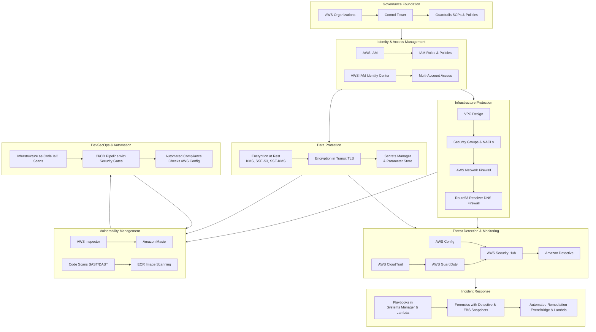

# AWS Networking & Firewalls: A Practical Guide

*Your hands-on companion for mastering AWS network security*

---

## Table of Contents
1. [VPC Design Fundamentals](#vpc-design-fundamentals)
2. [Security Groups vs NACLs](#security-groups-vs-nacls)
3. [AWS Network Firewall](#aws-network-firewall)
4. [AWS WAF (Web Application Firewall)](#aws-waf)
5. [Best Practices & Implementation](#best-practices)
6. [Real-World Scenarios](#real-world-scenarios)
7. [Troubleshooting Guide](#troubleshooting)

---

## VPC Design Fundamentals

Think of a VPC (Virtual Private Cloud) as your own private data center in AWS, but way more flexible. You get complete control over your network environment.

### Core Components

**VPC Architecture Overview:**
```
┌─────────────────────────────────────────────────────────────┐
│                    VPC (10.0.0.0/16)                        │
│                                                             │
│  ┌──────────────────────────┐  ┌──────────────────────────┐│
│  │  Public Subnet           │  │  Private Subnet          ││
│  │  (10.0.1.0/24)          │  │  (10.0.2.0/24)          ││
│  │                          │  │                          ││
│  │  ┌──────────────┐       │  │  ┌──────────────┐       ││
│  │  │   EC2 Web    │       │  │  │   EC2 App    │       ││
│  │  │   Server     │       │  │  │   Server     │       ││
│  │  └──────────────┘       │  │  └──────────────┘       ││
│  │         ↓                │  │         ↓                ││
│  │  [Internet Gateway]     │  │  [NAT Gateway]          ││
│  └──────────────────────────┘  └──────────────────────────┘│
│              ↓                              ↓                │
│         [Internet] ←──────────────────────┘                │
└─────────────────────────────────────────────────────────────┘
```

### Creating Your First VPC (The Right Way)

```bash
# Create VPC with DNS support enabled
aws ec2 create-vpc \
    --cidr-block 10.0.0.0/16 \
    --tag-specifications 'ResourceType=vpc,Tags=[{Key=Name,Value=prod-vpc}]'

# Enable DNS hostnames (important for RDS, ELB, etc.)
aws ec2 modify-vpc-attribute \
    --vpc-id vpc-xxxxx \
    --enable-dns-hostnames

# Create Internet Gateway
aws ec2 create-internet-gateway \
    --tag-specifications 'ResourceType=internet-gateway,Tags=[{Key=Name,Value=prod-igw}]'

# Attach it to VPC
aws ec2 attach-internet-gateway \
    --vpc-id vpc-xxxxx \
    --internet-gateway-id igw-xxxxx
```

### Subnet Design Strategy

Here's what I've learned from production environments:

**Public Subnets** - For resources that need direct internet access:
- Web servers
- Load balancers
- NAT Gateways
- Bastion hosts

**Private Subnets** - For everything else:
- Application servers
- Databases
- Internal services
- Lambda functions (usually)

```bash
# Create public subnet in AZ-1
aws ec2 create-subnet \
    --vpc-id vpc-xxxxx \
    --cidr-block 10.0.1.0/24 \
    --availability-zone us-east-1a \
    --tag-specifications 'ResourceType=subnet,Tags=[{Key=Name,Value=public-subnet-1a}]'

# Create private subnet in AZ-1
aws ec2 create-subnet \
    --vpc-id vpc-xxxxx \
    --cidr-block 10.0.2.0/24 \
    --availability-zone us-east-1a \
    --tag-specifications 'ResourceType=subnet,Tags=[{Key=Name,Value=private-subnet-1a}]'

# Always create subnets in multiple AZs for high availability!
```

### CIDR Block Planning

This trips up a lot of people. Here's a practical approach:

```
VPC:        10.0.0.0/16     (65,536 IPs)

Subnets:
├── Public-1a:   10.0.0.0/20   (4,096 IPs)
├── Public-1b:   10.0.16.0/20  (4,096 IPs)
├── Private-1a:  10.0.32.0/20  (4,096 IPs)
├── Private-1b:  10.0.48.0/20  (4,096 IPs)
├── Data-1a:     10.0.64.0/20  (4,096 IPs)
└── Data-1b:     10.0.80.0/20  (4,096 IPs)

Reserve:    10.0.96.0/19 onwards for future expansion
```

**Pro tip:** AWS reserves 5 IPs in every subnet:
- `.0` = Network address
- `.1` = VPC router
- `.2` = DNS server
- `.3` = Future use
- `.255` = Broadcast (not used in VPC but reserved)

---

## Security Groups vs NACLs

This is where things get interesting. Both control traffic, but they work very differently.

### The Key Differences

```
┌────────────────────────────────────────────────────────────┐
│                     Security Groups                        │
│  • Stateful (return traffic auto-allowed)                 │
│  • Operate at instance/ENI level                          │
│  • Only ALLOW rules (default deny)                        │
│  • Evaluate ALL rules before deciding                     │
│  • Can reference other security groups                    │
└────────────────────────────────────────────────────────────┘
                            vs
┌────────────────────────────────────────────────────────────┐
│              Network ACLs (NACLs)                          │
│  • Stateless (must explicitly allow return traffic)       │
│  • Operate at subnet level                                │
│  • Both ALLOW and DENY rules                              │
│  • Process rules in number order (lowest first)           │
│  • Cannot reference security groups                       │
└────────────────────────────────────────────────────────────┘
```

### Security Groups - Your First Line of Defense

Think of Security Groups as a bouncer at a club. Once you're allowed in, you can leave freely (stateful).

**Example: Web Server Security Group**
```bash
# Create security group
aws ec2 create-security-group \
    --group-name web-server-sg \
    --description "Security group for web servers" \
    --vpc-id vpc-xxxxx

# Allow HTTP from anywhere
aws ec2 authorize-security-group-ingress \
    --group-id sg-xxxxx \
    --protocol tcp \
    --port 80 \
    --cidr 0.0.0.0/0

# Allow HTTPS from anywhere
aws ec2 authorize-security-group-ingress \
    --group-id sg-xxxxx \
    --protocol tcp \
    --port 443 \
    --cidr 0.0.0.0/0

# Allow SSH only from your office IP
aws ec2 authorize-security-group-ingress \
    --group-id sg-xxxxx \
    --protocol tcp \
    --port 22 \
    --cidr 203.0.113.0/24
```

**Example: Database Security Group (Referencing Another SG)**
```bash
# Create DB security group
aws ec2 create-security-group \
    --group-name database-sg \
    --description "Security group for RDS databases" \
    --vpc-id vpc-xxxxx

# Allow MySQL from web server security group ONLY
aws ec2 authorize-security-group-ingress \
    --group-id sg-database \
    --protocol tcp \
    --port 3306 \
    --source-group sg-webserver

# This is super powerful! No need to track individual IPs
```

### Security Group Best Practices

```yaml
# My template for a multi-tier application
Security Groups:
  
  LoadBalancer-SG:
    Inbound:
      - Port 443 from 0.0.0.0/0  # HTTPS from internet
      - Port 80 from 0.0.0.0/0   # HTTP from internet
    Outbound:
      - All traffic to WebServer-SG
  
  WebServer-SG:
    Inbound:
      - Port 80/443 from LoadBalancer-SG
      - Port 22 from Bastion-SG
    Outbound:
      - Port 3306 to Database-SG
      - Port 443 to 0.0.0.0/0 (for updates, APIs)
  
  Database-SG:
    Inbound:
      - Port 3306 from WebServer-SG
      - Port 3306 from Bastion-SG (for admin access)
    Outbound:
      - Nothing (deny all by default)
  
  Bastion-SG:
    Inbound:
      - Port 22 from YourOfficeIP/32
    Outbound:
      - Port 22 to WebServer-SG
      - Port 22 to Database-SG
```

### Network ACLs - The Subnet-Level Firewall

NACLs are stateless - you need to explicitly allow both request AND response traffic.

**Traffic Flow Example:**
```
Client (1.2.3.4:54321) → Web Server (10.0.1.5:80)

Request: 1.2.3.4:54321 → 10.0.1.5:80
Response: 10.0.1.5:80 → 1.2.3.4:54321

NACL needs to allow:
- Inbound: TCP port 80 from 1.2.3.4
- Outbound: TCP ports 1024-65535 to 1.2.3.4 (ephemeral ports!)
```

**Creating a Custom NACL:**
```bash
# Create NACL
aws ec2 create-network-acl \
    --vpc-id vpc-xxxxx \
    --tag-specifications 'ResourceType=network-acl,Tags=[{Key=Name,Value=public-nacl}]'

# Allow HTTP inbound (rule 100)
aws ec2 create-network-acl-entry \
    --network-acl-id acl-xxxxx \
    --rule-number 100 \
    --protocol tcp \
    --port-range From=80,To=80 \
    --cidr-block 0.0.0.0/0 \
    --ingress \
    --rule-action allow

# Allow HTTP response outbound (rule 100)
aws ec2 create-network-acl-entry \
    --network-acl-id acl-xxxxx \
    --rule-number 100 \
    --protocol tcp \
    --port-range From=1024,To=65535 \
    --cidr-block 0.0.0.0/0 \
    --egress \
    --rule-action allow

# Block specific IP (rule 50 - processed before rule 100)
aws ec2 create-network-acl-entry \
    --network-acl-id acl-xxxxx \
    --rule-number 50 \
    --protocol all \
    --cidr-block 198.51.100.0/24 \
    --ingress \
    --rule-action deny
```

### When to Use What?

**Use Security Groups for:**
- Application-level access control
- Most of your security needs (they're easier!)
- Dynamic environments (auto-scaling groups)
- Referencing other security groups

**Use NACLs for:**
- Subnet-level protection
- Blocking specific IP addresses/ranges
- Additional layer of defense (defense in depth)
- Compliance requirements for explicit deny rules

---

## AWS Network Firewall

Network Firewall is AWS's managed firewall service - think of it as a next-gen firewall in the cloud.

### Architecture Overview

```
┌─────────────────────────────────────────────────────────────┐
│                      Your VPC                               │
│                                                             │
│  ┌──────────────┐      ┌──────────────────┐               │
│  │   Subnet A   │      │  Firewall        │               │
│  │              │─────→│  Subnet          │               │
│  │  [Instances] │      │                  │               │
│  └──────────────┘      │  ┌────────────┐ │               │
│                        │  │  Firewall  │ │────→ [IGW]    │
│  ┌──────────────┐      │  │  Endpoint  │ │               │
│  │   Subnet B   │─────→│  └────────────┘ │               │
│  │              │      │                  │               │
│  │  [Instances] │      │  [Rules Engine]  │               │
│  └──────────────┘      └──────────────────┘               │
│                                                             │
└─────────────────────────────────────────────────────────────┘
```

### What Can Network Firewall Do?

**Stateful Inspection:**
- Full packet inspection
- Protocol detection
- Intrusion Prevention System (IPS)
- Domain name filtering

**Rule Types:**
- 5-tuple filtering (source/dest IP, port, protocol)
- Suricata-compatible IPS rules
- Domain list filtering
- Custom Stateful rules

### Setting Up Network Firewall

```bash
# Step 1: Create firewall policy
aws network-firewall create-firewall-policy \
    --firewall-policy-name prod-firewall-policy \
    --firewall-policy '{
        "StatelessDefaultActions": ["aws:forward_to_sfe"],
        "StatelessFragmentDefaultActions": ["aws:forward_to_sfe"],
        "StatefulEngineOptions": {
            "RuleOrder": "STRICT_ORDER"
        }
    }'

# Step 2: Create stateless rule group (basic filtering)
aws network-firewall create-rule-group \
    --rule-group-name allow-http-https \
    --type STATELESS \
    --capacity 100 \
    --rule-group file://stateless-rules.json

# Step 3: Create stateful rule group (deep inspection)
aws network-firewall create-rule-group \
    --rule-group-name block-malware \
    --type STATEFUL \
    --capacity 1000 \
    --rule-group file://stateful-rules.json

# Step 4: Deploy firewall
aws network-firewall create-firewall \
    --firewall-name prod-firewall \
    --firewall-policy-arn arn:aws:network-firewall:... \
    --vpc-id vpc-xxxxx \
    --subnet-mappings SubnetId=subnet-xxxxx SubnetId=subnet-yyyyy
```

### Example Rule Configurations

**stateless-rules.json:**
```json
{
  "RulesSource": {
    "StatelessRulesAndCustomActions": {
      "StatelessRules": [
        {
          "RuleDefinition": {
            "MatchAttributes": {
              "Sources": [{"AddressDefinition": "0.0.0.0/0"}],
              "Destinations": [{"AddressDefinition": "10.0.0.0/16"}],
              "DestinationPorts": [
                {"FromPort": 443, "ToPort": 443},
                {"FromPort": 80, "ToPort": 80}
              ],
              "Protocols": [6]
            },
            "Actions": ["aws:pass"]
          },
          "Priority": 1
        }
      ]
    }
  }
}
```

**stateful-rules.json (Suricata format):**
```json
{
  "RulesSource": {
    "RulesString": "alert http any any -> any any (msg:\"Possible SQL Injection\"; content:\"SELECT\"; content:\"FROM\"; content:\"WHERE\"; sid:1000001; rev:1;)\nalert tcp any any -> any 3389 (msg:\"RDP Connection Attempt\"; sid:1000002; rev:1;)\npass tls any any -> any 443 (tls.sni; content:\".amazonaws.com\"; sid:1000003; rev:1;)"
  }
}
```

### Domain Filtering (Super Useful!)

```bash
# Block known malicious domains
cat > domain-list.json << EOF
{
  "RulesSource": {
    "RulesSourceList": {
      "Targets": [
        ".malicious-site.com",
        "phishing-example.org",
        ".bad-actor.net"
      ],
      "TargetTypes": ["TLS_SNI", "HTTP_HOST"],
      "GeneratedRulesType": "DENYLIST"
    }
  }
}
EOF

aws network-firewall create-rule-group \
    --rule-group-name block-malicious-domains \
    --type STATEFUL \
    --capacity 100 \
    --rule-group file://domain-list.json
```

### Network Firewall Use Cases

**1. Centralized Egress Filtering:**
```
VPCs → Transit Gateway → Inspection VPC (with Network Firewall) → Internet
```

**2. IPS/IDS for VPC Traffic:**
- Block exploitation attempts
- Detect anomalous behavior
- Log suspicious traffic patterns

**3. Compliance Requirements:**
- PCI-DSS environments
- HIPAA workloads
- Any regulation requiring IPS/IDS

---

## AWS WAF (Web Application Firewall)

WAF protects your web applications from common exploits. It sits in front of CloudFront, ALB, API Gateway, or AppSync.

### WAF Architecture

```
┌──────────────────────────────────────────────────────────┐
│                     Internet                             │
└──────────────────┬───────────────────────────────────────┘
                   │
                   ▼
        ┌──────────────────────┐
        │    CloudFront /      │
        │         ALB          │
        └──────────┬───────────┘
                   │
                   ▼
        ┌──────────────────────┐
        │      AWS WAF         │
        │  ┌────────────────┐  │
        │  │  Web ACL       │  │
        │  │                │  │
        │  │  Rule Groups:  │  │
        │  │  • Rate limit  │  │
        │  │  • SQL inject  │  │
        │  │  • XSS         │  │
        │  │  • Geo block   │  │
        │  └────────────────┘  │
        └──────────┬───────────┘
                   │
                   ▼ (allowed traffic)
        ┌──────────────────────┐
        │   Your Application   │
        └──────────────────────┘
```

### Creating Your First Web ACL

```bash
# Create Web ACL
aws wafv2 create-web-acl \
    --name prod-web-acl \
    --scope REGIONAL \
    --default-action Allow={} \
    --rules file://waf-rules.json \
    --visibility-config SampledRequestsEnabled=true,CloudWatchMetricsEnabled=true,MetricName=prodWebACL

# Associate with ALB
aws wafv2 associate-web-acl \
    --web-acl-arn arn:aws:wafv2:... \
    --resource-arn arn:aws:elasticloadbalancing:...
```

### Essential WAF Rules

**waf-rules.json:**
```json
[
  {
    "Name": "RateLimitRule",
    "Priority": 1,
    "Statement": {
      "RateBasedStatement": {
        "Limit": 2000,
        "AggregateKeyType": "IP"
      }
    },
    "Action": {
      "Block": {}
    },
    "VisibilityConfig": {
      "SampledRequestsEnabled": true,
      "CloudWatchMetricsEnabled": true,
      "MetricName": "RateLimitRule"
    }
  },
  {
    "Name": "GeoBlockRule",
    "Priority": 2,
    "Statement": {
      "GeoMatchStatement": {
        "CountryCodes": ["KP", "IR", "SY"]
      }
    },
    "Action": {
      "Block": {}
    },
    "VisibilityConfig": {
      "SampledRequestsEnabled": true,
      "CloudWatchMetricsEnabled": true,
      "MetricName": "GeoBlockRule"
    }
  },
  {
    "Name": "SQLiProtection",
    "Priority": 3,
    "Statement": {
      "ManagedRuleGroupStatement": {
        "VendorName": "AWS",
        "Name": "AWSManagedRulesSQLiRuleSet"
      }
    },
    "OverrideAction": {
      "None": {}
    },
    "VisibilityConfig": {
      "SampledRequestsEnabled": true,
      "CloudWatchMetricsEnabled": true,
      "MetricName": "SQLiProtection"
    }
  }
]
```

### AWS Managed Rule Groups (Free & Powerful!)

```bash
# Core Rule Set - blocks common attacks
AWSManagedRulesCommonRuleSet

# Known Bad Inputs - blocks patterns of exploitation
AWSManagedRulesKnownBadInputsRuleSet

# SQL injection protection
AWSManagedRulesSQLiRuleSet

# Linux-specific protections
AWSManagedRulesLinuxRuleSet

# PHP application protection
AWSManagedRulesPHPRuleSet

# WordPress protection
AWSManagedRulesWordPressRuleSet
```

### Custom WAF Rule Examples

**Block requests with no User-Agent:**
```json
{
  "Name": "BlockNoUserAgent",
  "Priority": 10,
  "Statement": {
    "NotStatement": {
      "Statement": {
        "ByteMatchStatement": {
          "FieldToMatch": {
            "SingleHeader": {
              "Name": "user-agent"
            }
          },
          "PositionalConstraint": "CONTAINS",
          "SearchString": "Mozilla",
          "TextTransformations": [
            {
              "Type": "LOWERCASE",
              "Priority": 0
            }
          ]
        }
      }
    }
  },
  "Action": {
    "Block": {}
  }
}
```

**Allow only specific paths:**
```json
{
  "Name": "AllowOnlyAPIPath",
  "Priority": 5,
  "Statement": {
    "AndStatement": {
      "Statements": [
        {
          "ByteMatchStatement": {
            "FieldToMatch": {
              "UriPath": {}
            },
            "PositionalConstraint": "STARTS_WITH",
            "SearchString": "/api/",
            "TextTransformations": [
              {
                "Type": "LOWERCASE",
                "Priority": 0
              }
            ]
          }
        }
      ]
    }
  },
  "Action": {
    "Allow": {}
  }
}
```

### WAF Logging & Monitoring

```bash
# Enable logging to S3
aws wafv2 put-logging-configuration \
    --logging-configuration '{
        "ResourceArn": "arn:aws:wafv2:...",
        "LogDestinationConfigs": ["arn:aws:s3:::my-waf-logs"],
        "RedactedFields": [
            {
                "SingleHeader": {
                    "Name": "authorization"
                }
            }
        ]
    }'

# Enable CloudWatch metrics
# Already enabled in VisibilityConfig above

# Query logs with Athena
# Create table for WAF logs in Athena, then:
SELECT 
    action,
    httprequest.clientip,
    httprequest.uri,
    COUNT(*) as request_count
FROM waf_logs
WHERE from_unixtime(timestamp/1000) > current_timestamp - interval '1' hour
GROUP BY action, httprequest.clientip, httprequest.uri
ORDER BY request_count DESC
LIMIT 100;
```

---

## Best Practices & Implementation

Let me share what I've learned from running production workloads.

### 1. Default-Deny Everywhere

**Security Groups:**
```bash
# Start with NO inbound rules (default deny)
# Add only what you need

# Good: Specific source
aws ec2 authorize-security-group-ingress \
    --group-id sg-xxxxx \
    --protocol tcp \
    --port 443 \
    --source-group sg-alb

# Bad: Open to world when not needed
# aws ec2 authorize-security-group-ingress \
#     --group-id sg-xxxxx \
#     --protocol tcp \
#     --port 3306 \
#     --cidr 0.0.0.0/0  # DON'T DO THIS!
```

### 2. Enable VPC Flow Logs

This is non-negotiable. You need visibility.

```bash
# Create log group
aws logs create-log-group \
    --log-group-name /aws/vpc/flowlogs

# Create IAM role for Flow Logs
cat > flow-logs-trust.json << EOF
{
  "Version": "2012-10-17",
  "Statement": [
    {
      "Effect": "Allow",
      "Principal": {
        "Service": "vpc-flow-logs.amazonaws.com"
      },
      "Action": "sts:AssumeRole"
    }
  ]
}
EOF

aws iam create-role \
    --role-name VPCFlowLogsRole \
    --assume-role-policy-document file://flow-logs-trust.json

# Attach permissions
cat > flow-logs-policy.json << EOF
{
  "Version": "2012-10-17",
  "Statement": [
    {
      "Effect": "Allow",
      "Action": [
        "logs:CreateLogStream",
        "logs:PutLogEvents",
        "logs:DescribeLogStreams"
      ],
      "Resource": "arn:aws:logs:*:*:log-group:/aws/vpc/flowlogs:*"
    }
  ]
}
EOF

aws iam put-role-policy \
    --role-name VPCFlowLogsRole \
    --policy-name FlowLogsPolicy \
    --policy-document file://flow-logs-policy.json

# Enable Flow Logs
aws ec2 create-flow-logs \
    --resource-type VPC \
    --resource-ids vpc-xxxxx \
    --traffic-type ALL \
    --log-destination-type cloud-watch-logs \
    --log-group-name /aws/vpc/flowlogs \
    --deliver-logs-permission-arn arn:aws:iam::...:role/VPCFlowLogsRole
```

**Analyzing Flow Logs:**
```bash
# Find top talkers
aws logs filter-log-events \
    --log-group-name /aws/vpc/flowlogs \
    --filter-pattern '[version, account, eni, source, destination, srcport, destport="443", protocol="6", packets, bytes, start, end, action="ACCEPT", status]' \
    --start-time $(date -u -d '1 hour ago' +%s)000

# Detect rejected connections (potential attacks)
aws logs filter-log-events \
    --log-group-name /aws/vpc/flowlogs \
    --filter-pattern '[version, account, eni, source, destination, srcport, destport, protocol, packets, bytes, start, end, action="REJECT", status]'
```

### 3. Use VPC Endpoints (Critical for Security & Cost)

Why pay for data transfer AND expose traffic to internet when you don't have to?

```bash
# S3 Gateway Endpoint (free!)
aws ec2 create-vpc-endpoint \
    --vpc-id vpc-xxxxx \
    --service-name com.amazonaws.us-east-1.s3 \
    --route-table-ids rtb-xxxxx rtb-yyyyy

# DynamoDB Gateway Endpoint (also free!)
aws ec2 create-vpc-endpoint \
    --vpc-id vpc-xxxxx \
    --service-name com.amazonaws.us-east-1.dynamodb \
    --route-table-ids rtb-xxxxx

# Interface Endpoint for EC2 API (costs $ but worth it)
aws ec2 create-vpc-endpoint \
    --vpc-id vpc-xxxxx \
    --vpc-endpoint-type Interface \
    --service-name com.amazonaws.us-east-1.ec2 \
    --subnet-ids subnet-xxxxx subnet-yyyyy \
    --security-group-ids sg-xxxxx
```

**Common Interface Endpoints You'll Want:**
- `com.amazonaws.region.ec2` - EC2 API
- `com.amazonaws.region.ssm` - Systems Manager
- `com.amazonaws.region.secretsmanager` - Secrets Manager
- `com.amazonaws.region.rds` - RDS management
- `com.amazonaws.region.lambda` - Lambda invocation
- `com.amazonaws.region.ecr.api` + `.ecr.dkr` - Container registry

### 4. Implement Defense in Depth

```
Layer 1: WAF (CloudFront/ALB)
    ↓
Layer 2: Network Firewall (VPC level)
    ↓
Layer 3: NACL (Subnet level)
    ↓
Layer 4: Security Group (Instance level)
    ↓
Layer 5: Host-based firewall (OS level)
    ↓
Layer 6: Application security
```

Don't rely on just one layer!

### 5. Tag Everything

```bash
# Standard tagging strategy
--tag-specifications '
ResourceType=vpc,Tags=[
    {Key=Environment,Value=production},
    {Key=Project,Value=ecommerce},
    {Key=Owner,Value=platform-team},
    {Key=CostCenter,Value=engineering},
    {Key=Compliance,Value=pci-dss}
]'
```

### 6. Automate Security Assessments

```bash
# Check for overly permissive security groups
aws ec2 describe-security-groups \
    --filters Name=ip-permission.cidr,Values='0.0.0.0/0' \
    --query 'SecurityGroups[?IpPermissions[?ToPort!=`80` && ToPort!=`443`]]' \
    --output table

# Find unused security groups
aws ec2 describe-security-groups \
    --query 'SecurityGroups[?!contains(GroupId, `sg-`) || length(IpPermissions)==`0`]' \
    --output table
```

### 7. Implement Least Privilege Access

```bash
# Bad: SSH from anywhere
# aws ec2 authorize-security-group-ingress \
#     --group-id sg-xxxxx \
#     --protocol tcp \
#     --port 22 \
#     --cidr 0.0.0.0/0

# Better: SSH from office IP
aws ec2 authorize-security-group-ingress \
    --group-id sg-xxxxx \
    --protocol tcp \
    --port 22 \
    --cidr 203.0.113.0/24

# Best: Use Systems Manager Session Manager (no SSH port needed!)
# Just need SSM endpoint and IMDSv2
```

### 8. Regular Security Audits

**Monthly Checklist:**
- [ ] Review VPC Flow Logs for anomalies
- [ ] Check for unused security groups and NACLs
- [ ] Verify no 0.0.0.0/0 rules except for web traffic
- [ ] Ensure all resources in private subnets when possible
- [ ] Review WAF metrics and blocked requests
- [ ] Test Network Firewall rules effectiveness
- [ ] Audit VPC endpoint usage
- [ ] Check CloudWatch alarms are functioning

---

## Real-World Scenarios

Let me walk you through some common architectures I've implemented.

### Scenario 1: Three-Tier Web Application

**Architecture:**
```
                    ┌─────────────────┐
                    │   CloudFront    │
                    │   + WAF         │
                    └────────┬────────┘
                             │
                    ┌────────▼────────┐
                    │  Application    │
                    │  Load Balancer  │
                    │  (Public Subnet)│
                    └────────┬────────┘
                             │
        ┌────────────────────┼────────────────────┐
        │                    │                    │
   ┌────▼─────┐       ┌──────▼────┐       ┌──────▼────┐
   │   Web    │       │    Web    │       │    Web    │
   │  Server  │       │  Server   │       │  Server   │
   │ (Private)│       │ (Private) │       │ (Private) │
   └────┬─────┘       └──────┬────┘       └──────┬────┘
        │                    │                    │
        └────────────────────┼────────────────────┘
                             │
                    ┌────────▼────────┐
                    │       RDS       │
                    │   (Multi-AZ)    │
                    │  (Private Sub)  │
                    └─────────────────┘
```

**Implementation:**
```bash
#!/bin/bash
# Complete setup script for 3-tier architecture

VPC_CIDR="10.0.0.0/16"
REGION="us-east-1"

# Create VPC
VPC_ID=$(aws ec2 create-vpc \
    --cidr-block $VPC_CIDR \
    --tag-specifications 'ResourceType=vpc,Tags=[{Key=Name,Value=three-tier-vpc}]' \
    --query 'Vpc.VpcId' --output text)

# Enable DNS
aws ec2 modify-vpc-attribute --vpc-id $VPC_ID --enable-dns-hostnames

# Create subnets across 3 AZs
for i in 1 2 3; do
    # Public subnet
    aws ec2 create-subnet \
        --vpc-id $VPC_ID \
        --cidr-block 10.0.$i.0/24 \
        --availability-zone ${REGION}$(echo abc | cut -c$i) \
        --tag-specifications "ResourceType=subnet,Tags=[{Key=Name,Value=public-${i}}]"
    
    # Private subnet for app tier
    aws ec2 create-subnet \
        --vpc-id $VPC_ID \
        --cidr-block 10.0.$((i+10)).0/24 \
        --availability-zone ${REGION}$(echo abc | cut -c$i) \
        --tag-specifications "ResourceType=subnet,Tags=[{Key=Name,Value=private-app-${i}}]"
    
    # Private subnet for data tier
    aws ec2 create-subnet \
        --vpc-id $VPC_ID \
        --cidr-block 10.0.$((i+20)).0/24 \
        --availability-zone ${REGION}$(echo abc | cut -c$i) \
        --tag-specifications "ResourceType=subnet,Tags=[{Key=Name,Value=private-data-${i}}]"
done

# Create security groups
ALB_SG=$(aws ec2 create-security-group \
    --group-name alb-sg \
    --description "ALB Security Group" \
    --vpc-id $VPC_ID \
    --query 'GroupId' --output text)

WEB_SG=$(aws ec2 create-security-group \
    --group-name web-sg \
    --description "Web Tier Security Group" \
    --vpc-id $VPC_ID \
    --query 'GroupId' --output text)

DB_SG=$(aws ec2 create-security-group \
    --group-name db-sg \
    --description "Database Security Group" \
    --vpc-id $VPC_ID \
    --query 'GroupId' --output text)

# Configure security group rules
# ALB: Allow 80/443 from internet
aws ec2 authorize-security-group-ingress \
    --group-id $ALB_SG --protocol tcp --port 443 --cidr 0.0.0.0/0
aws ec2 authorize-security-group-ingress \
    --group-id $ALB_SG --protocol tcp --port 80 --cidr 0.0.0.0/0

# Web: Allow traffic from ALB only
aws ec2 authorize-security-group-ingress \
    --group-id $WEB_SG --protocol tcp --port 80 --source-group $ALB_SG

# DB: Allow traffic from Web tier only
aws ec2 authorize-security-group-ingress \
    --group-id $DB_SG --protocol tcp --port 3306 --source-group $WEB_SG

echo "VPC Setup Complete! VPC ID: $VPC_ID"
```

### Scenario 2: Hub-and-Spoke with Centralized Inspection

**Architecture:**
```
                    ┌─────────────────────┐
                    │   Inspection VPC    │
                    │                     │
                    │  ┌──────────────┐   │
                    │  │   Network    │   │
                    │  │   Firewall   │   │
                    │  └──────────────┘   │
                    └──────────┬──────────┘
                               │
                    ┌──────────▼──────────┐
                    │  Transit Gateway    │
                    └──┬────────┬────────┬┘
                       │        │        │
        ┌──────────────▼─┐  ┌──▼──────┐ └──▼──────────┐
        │   Prod VPC     │  │ Dev VPC │    │ Test VPC │
        │  10.1.0.0/16   │  │10.2.../16│   │10.3.../16│
        └────────────────┘  └─────────┘    └──────────┘
```

**Setup:**
```bash
# Create Transit Gateway
TGW_ID=$(aws ec2 create-transit-gateway \
    --description "Central Hub TGW" \
    --options "DefaultRouteTableAssociation=disable,DefaultRouteTablePropagation=disable" \
    --query 'TransitGateway.TransitGatewayId' --output text)

# Create inspection VPC with Network Firewall
# (Detailed steps shown in Network Firewall section)

# Attach VPCs to TGW
for VPC in vpc-prod vpc-dev vpc-test vpc-inspection; do
    aws ec2 create-transit-gateway-vpc-attachment \
        --transit-gateway-id $TGW_ID \
        --vpc-id $VPC \
        --subnet-ids subnet-xxx subnet-yyy
done

# Create routing tables for traffic inspection
# All internet-bound traffic routes through inspection VPC
```

### Scenario 3: High-Security Environment (PCI-DSS)

**Requirements:**
- ✅ No direct internet access for card processing systems
- ✅ All traffic inspected by IPS/IDS
- ✅ Comprehensive logging
- ✅ Network segmentation

**Implementation:**
```yaml
VPC Layout:
  
  DMZ Subnet (10.0.0.0/24):
    - Load Balancers
    - WAF enabled
    - Public facing only
  
  Application Subnet (10.0.10.0/24):
    - Web/App servers
    - No internet access
    - Access via ALB only
  
  Cardholder Data Subnet (10.0.20.0/24):
    - Database with card data
    - Extra restricted
    - Database Activity Streaming enabled
    - Encryption at rest/transit
  
  Management Subnet (10.0.30.0/24):
    - Bastion hosts
    - Monitoring tools
    - Separate security group

Network Controls:
  - Network Firewall with IPS rules
  - VPC Flow Logs to S3 (immutable)
  - AWS Config rules for compliance
  - GuardDuty enabled
  - CloudTrail with log file validation
```

---

## Troubleshooting Guide

### Common Issues & Solutions

#### 1. "I can't connect to my EC2 instance!"

**Systematic approach:**
```bash
# Step 1: Check security group
aws ec2 describe-security-groups \
    --group-ids sg-xxxxx \
    --query 'SecurityGroups[0].IpPermissions'

# Step 2: Check NACL
aws ec2 describe-network-acls \
    --filters "Name=association.subnet-id,Values=subnet-xxxxx"

# Step 3: Check route table
aws ec2 describe-route-tables \
    --filters "Name=association.subnet-id,Values=subnet-xxxxx"

# Step 4: Check instance status
aws ec2 describe-instance-status \
    --instance-ids i-xxxxx

# Step 5: Check VPC Flow Logs for REJECT
aws logs filter-log-events \
    --log-group-name /aws/vpc/flowlogs \
    --filter-pattern '[version, account, eni, source="YOUR_IP", destination, srcport, destport, protocol, packets, bytes, start, end, action="REJECT", status]' \
    --start-time $(date -u -d '10 minutes ago' +%s)000
```

**Common fixes:**
```bash
# Fix 1: Security group too restrictive
aws ec2 authorize-security-group-ingress \
    --group-id sg-xxxxx \
    --protocol tcp \
    --port 22 \
    --cidr YOUR_IP/32

# Fix 2: NACL blocking return traffic
# Remember: NACLs are stateless!
# Allow ephemeral ports 1024-65535 outbound

# Fix 3: Route to Internet Gateway missing
aws ec2 create-route \
    --route-table-id rtb-xxxxx \
    --destination-cidr-block 0.0.0.0/0 \
    --gateway-id igw-xxxxx
```

#### 2. "My instances can't reach the internet!"

**Checklist:**
```bash
# For public subnet instances:
# ✓ Internet Gateway attached?
aws ec2 describe-internet-gateways \
    --filters "Name=attachment.vpc-id,Values=vpc-xxxxx"

# ✓ Route to IGW exists?
aws ec2 describe-route-tables \
    --filters "Name=association.subnet-id,Values=subnet-xxxxx" \
    --query 'RouteTables[0].Routes'

# ✓ Instance has public IP?
aws ec2 describe-instances \
    --instance-ids i-xxxxx \
    --query 'Reservations[0].Instances[0].PublicIpAddress'

# For private subnet instances:
# ✓ NAT Gateway exists and is available?
aws ec2 describe-nat-gateways \
    --filter "Name=vpc-id,Values=vpc-xxxxx"

# ✓ Route to NAT Gateway exists?
aws ec2 describe-route-tables \
    --filters "Name=association.subnet-id,Values=subnet-xxxxx" \
    --query 'RouteTables[0].Routes'

# ✓ NAT Gateway has Elastic IP?
# Check in console or CLI output above
```

#### 3. "VPC Flow Logs show traffic but application doesn't work!"

This usually means security is working, but application layer has issues.

```bash
# Verify traffic reaching instance
aws logs filter-log-events \
    --log-group-name /aws/vpc/flowlogs \
    --filter-pattern '[version, account, eni="eni-xxxxx", source, destination, srcport, destport, protocol, packets, bytes, start, end, action="ACCEPT", status]'

# If ACCEPT but app not responding:
# - Check application logs
# - Verify app is listening on correct port: netstat -tlnp
# - Check host-based firewall (iptables/Windows Firewall)
# - Verify load balancer health checks
```

#### 4. "WAF is blocking legitimate traffic!"

**Investigation:**
```bash
# Check sampled requests
aws wafv2 get-sampled-requests \
    --web-acl-arn arn:aws:wafv2:... \
    --rule-metric-name RuleName \
    --scope REGIONAL \
    --time-window StartTime=$(date -u -d '1 hour ago' +%s),EndTime=$(date -u +%s) \
    --max-items 100

# Review CloudWatch metrics
aws cloudwatch get-metric-statistics \
    --namespace AWS/WAFV2 \
    --metric-name BlockedRequests \
    --dimensions Name=WebACL,Value=prod-web-acl \
    --start-time $(date -u -d '1 hour ago' --iso-8601=seconds) \
    --end-time $(date -u --iso-8601=seconds) \
    --period 300 \
    --statistics Sum
```

**Solutions:**
```bash
# Option 1: Change rule action to Count (monitoring mode)
aws wafv2 update-web-acl \
    --id xxx --scope REGIONAL \
    --name prod-web-acl \
    # ... change Action from Block to Count for specific rule

# Option 2: Add exception for specific IPs
# Create IP set
aws wafv2 create-ip-set \
    --name whitelist-ips \
    --scope REGIONAL \
    --ip-address-version IPV4 \
    --addresses 203.0.113.0/24

# Reference in rule with higher priority
```

#### 5. "Cross-VPC communication not working!"

**VPC Peering troubleshooting:**
```bash
# Check peering connection status
aws ec2 describe-vpc-peering-connections \
    --filters "Name=status-code,Values=active"

# Verify route tables in BOTH VPCs
aws ec2 describe-route-tables \
    --filters "Name=vpc-id,Values=vpc-xxxxx" \
    --query 'RouteTables[*].Routes'

# Check security groups allow traffic from peer VPC
aws ec2 describe-security-groups \
    --group-ids sg-xxxxx \
    --query 'SecurityGroups[0].IpPermissions[?contains(IpRanges[].CidrIp, `10.1.0.0`)]'
```

---

## Monitoring & Alerting

### Essential CloudWatch Alarms

```bash
# Alert on excessive rejected connections (potential attack)
aws cloudwatch put-metric-alarm \
    --alarm-name high-rejected-connections \
    --alarm-description "High number of rejected connections" \
    --metric-name PacketsRejected \
    --namespace AWS/VPC \
    --statistic Sum \
    --period 300 \
    --evaluation-periods 2 \
    --threshold 10000 \
    --comparison-operator GreaterThanThreshold \
    --alarm-actions arn:aws:sns:us-east-1:123456789012:security-alerts

# Alert on WAF blocked requests spike
aws cloudwatch put-metric-alarm \
    --alarm-name waf-blocked-spike \
    --alarm-description "Unusual spike in WAF blocked requests" \
    --metric-name BlockedRequests \
    --namespace AWS/WAFV2 \
    --dimensions Name=WebACL,Value=prod-web-acl Name=Region,Value=us-east-1 \
    --statistic Sum \
    --period 300 \
    --evaluation-periods 1 \
    --threshold 1000 \
    --comparison-operator GreaterThanThreshold \
    --alarm-actions arn:aws:sns:us-east-1:123456789012:security-alerts

# Alert on NAT Gateway connection errors
aws cloudwatch put-metric-alarm \
    --alarm-name nat-gateway-errors \
    --alarm-description "NAT Gateway experiencing errors" \
    --metric-name ErrorPortAllocation \
    --namespace AWS/NATGateway \
    --dimensions Name=NatGatewayId,Value=nat-xxxxx \
    --statistic Sum \
    --period 300 \
    --evaluation-periods 2 \
    --threshold 100 \
    --comparison-operator GreaterThanThreshold \
    --alarm-actions arn:aws:sns:us-east-1:123456789012:ops-alerts
```

### VPC Flow Logs Analysis with Athena

```sql
-- Create table for Flow Logs
CREATE EXTERNAL TABLE IF NOT EXISTS vpc_flow_logs (
  version int,
  account string,
  interfaceid string,
  sourceaddress string,
  destinationaddress string,
  sourceport int,
  destinationport int,
  protocol int,
  numpackets int,
  numbytes bigint,
  starttime int,
  endtime int,
  action string,
  logstatus string
)
PARTITIONED BY (dt string)
ROW FORMAT DELIMITED
FIELDS TERMINATED BY ' '
LOCATION 's3://your-vpc-flow-logs-bucket/AWSLogs/{account-id}/vpcflowlogs/us-east-1/'
TBLPROPERTIES ("skip.header.line.count"="1");

-- Top 10 source IPs with rejected connections
SELECT sourceaddress, COUNT(*) as reject_count
FROM vpc_flow_logs
WHERE action = 'REJECT' 
  AND dt = '2025-01-20'
GROUP BY sourceaddress
ORDER BY reject_count DESC
LIMIT 10;

-- Find instances communicating with suspicious ports
SELECT 
    interfaceid,
    sourceaddress,
    destinationaddress,
    destinationport,
    COUNT(*) as connection_count
FROM vpc_flow_logs
WHERE destinationport IN (3389, 1433, 3306, 5432, 27017)
  AND sourceaddress NOT LIKE '10.%'
  AND dt = '2025-01-20'
GROUP BY interfaceid, sourceaddress, destinationaddress, destinationport
ORDER BY connection_count DESC;

-- Identify data exfiltration (large outbound transfers)
SELECT 
    sourceaddress,
    destinationaddress,
    SUM(numbytes) as total_bytes,
    COUNT(*) as num_flows
FROM vpc_flow_logs
WHERE action = 'ACCEPT'
  AND dt = '2025-01-20'
GROUP BY sourceaddress, destinationaddress
HAVING SUM(numbytes) > 10737418240  -- 10 GB
ORDER BY total_bytes DESC;
```

---

## Cost Optimization Tips

### 1. Use Gateway Endpoints (Free!)
```bash
# S3 and DynamoDB gateway endpoints are FREE
# Save on data transfer costs
aws ec2 create-vpc-endpoint \
    --vpc-id vpc-xxxxx \
    --service-name com.amazonaws.us-east-1.s3 \
    --route-table-ids rtb-xxxxx
```

### 2. Right-size NAT Gateways
```bash
# NAT Gateway pricing: ~$0.045/hour + $0.045/GB processed
# For low-traffic environments, consider:
# - Single NAT Gateway (vs. one per AZ)
# - NAT Instance (t3.nano ~$0.0052/hour)
# - VPC Endpoints instead of NAT for AWS services
```

### 3. WAF vs Network Firewall
```
WAF:
- ~$5/month per Web ACL
- $1/month per rule
- $0.60 per million requests

Network Firewall:
- ~$0.395/hour per AZ (~$285/month per AZ)
- $0.065/GB processed

Use WAF for web apps, Network Firewall for comprehensive VPC inspection
```

### 4. VPC Flow Logs Storage
```bash
# Option 1: CloudWatch Logs (expensive for high volume)
# Option 2: S3 (much cheaper, use with Athena)
# Option 3: Filter logs to reduce volume

# Example: Log only rejected connections
aws ec2 create-flow-logs \
    --resource-type VPC \
    --resource-ids vpc-xxxxx \
    --traffic-type REJECT \  # Only rejected traffic
    --log-destination-type s3 \
    --log-destination arn:aws:s3:::my-flow-logs
```

---

## Terraform Example

Because infrastructure as code is the only way to scale:

```hcl
# Complete VPC with security best practices
terraform {
  required_version = ">= 1.0"
  required_providers {
    aws = {
      source  = "hashicorp/aws"
      version = "~> 5.0"
    }
  }
}

# VPC
resource "aws_vpc" "main" {
  cidr_block           = "10.0.0.0/16"
  enable_dns_hostnames = true
  enable_dns_support   = true

  tags = {
    Name = "production-vpc"
  }
}

# Public Subnets
resource "aws_subnet" "public" {
  count             = 3
  vpc_id            = aws_vpc.main.id
  cidr_block        = "10.0.${count.index}.0/24"
  availability_zone = data.aws_availability_zones.available.names[count.index]

  map_public_ip_on_launch = true

  tags = {
    Name = "public-subnet-${count.index + 1}"
  }
}

# Private Subnets
resource "aws_subnet" "private" {
  count             = 3
  vpc_id            = aws_vpc.main.id
  cidr_block        = "10.0.${count.index + 10}.0/24"
  availability_zone = data.aws_availability_zones.available.names[count.index]

  tags = {
    Name = "private-subnet-${count.index + 1}"
  }
}

# Internet Gateway
resource "aws_internet_gateway" "main" {
  vpc_id = aws_vpc.main.id

  tags = {
    Name = "main-igw"
  }
}

# NAT Gateways (one per AZ for HA)
resource "aws_eip" "nat" {
  count  = 3
  domain = "vpc"

  tags = {
    Name = "nat-eip-${count.index + 1}"
  }
}

resource "aws_nat_gateway" "main" {
  count         = 3
  allocation_id = aws_eip.nat[count.index].id
  subnet_id     = aws_subnet.public[count.index].id

  tags = {
    Name = "nat-gateway-${count.index + 1}"
  }

  depends_on = [aws_internet_gateway.main]
}

# Route Tables
resource "aws_route_table" "public" {
  vpc_id = aws_vpc.main.id

  route {
    cidr_block = "0.0.0.0/0"
    gateway_id = aws_internet_gateway.main.id
  }

  tags = {
    Name = "public-rt"
  }
}

resource "aws_route_table" "private" {
  count  = 3
  vpc_id = aws_vpc.main.id

  route {
    cidr_block     = "0.0.0.0/0"
    nat_gateway_id = aws_nat_gateway.main[count.index].id
  }

  tags = {
    Name = "private-rt-${count.index + 1}"
  }
}

# Security Groups
resource "aws_security_group" "alb" {
  name        = "alb-sg"
  description = "Security group for Application Load Balancer"
  vpc_id      = aws_vpc.main.id

  ingress {
    from_port   = 443
    to_port     = 443
    protocol    = "tcp"
    cidr_blocks = ["0.0.0.0/0"]
    description = "HTTPS from internet"
  }

  ingress {
    from_port   = 80
    to_port     = 80
    protocol    = "tcp"
    cidr_blocks = ["0.0.0.0/0"]
    description = "HTTP from internet"
  }

  egress {
    from_port   = 0
    to_port     = 0
    protocol    = "-1"
    cidr_blocks = ["0.0.0.0/0"]
  }

  tags = {
    Name = "alb-security-group"
  }
}

resource "aws_security_group" "web" {
  name        = "web-sg"
  description = "Security group for web servers"
  vpc_id      = aws_vpc.main.id

  ingress {
    from_port       = 80
    to_port         = 80
    protocol        = "tcp"
    security_groups = [aws_security_group.alb.id]
    description     = "HTTP from ALB"
  }

  egress {
    from_port   = 0
    to_port     = 0
    protocol    = "-1"
    cidr_blocks = ["0.0.0.0/0"]
  }

  tags = {
    Name = "web-security-group"
  }
}

# VPC Flow Logs
resource "aws_flow_log" "main" {
  iam_role_arn    = aws_iam_role.flow_logs.arn
  log_destination = aws_cloudwatch_log_group.flow_logs.arn
  traffic_type    = "ALL"
  vpc_id          = aws_vpc.main.id
}

resource "aws_cloudwatch_log_group" "flow_logs" {
  name              = "/aws/vpc/flow-logs"
  retention_in_days = 30
}

# VPC Endpoints
resource "aws_vpc_endpoint" "s3" {
  vpc_id       = aws_vpc.main.id
  service_name = "com.amazonaws.${data.aws_region.current.name}.s3"
  route_table_ids = concat(
    [aws_route_table.public.id],
    aws_route_table.private[*].id
  )

  tags = {
    Name = "s3-endpoint"
  }
}

resource "aws_vpc_endpoint" "dynamodb" {
  vpc_id       = aws_vpc.main.id
  service_name = "com.amazonaws.${data.aws_region.current.name}.dynamodb"
  route_table_ids = concat(
    [aws_route_table.public.id],
    aws_route_table.private[*].id
  )

  tags = {
    Name = "dynamodb-endpoint"
  }
}

data "aws_availability_zones" "available" {
  state = "available"
}

data "aws_region" "current" {}
```

---

## Quick Reference Commands

### Security Group Management
```bash
# List all security groups
aws ec2 describe-security-groups --query 'SecurityGroups[*].[GroupId,GroupName]' --output table

# Find which resources use a security group
aws ec2 describe-network-interfaces --filters Name=group-id,Values=sg-xxxxx --query 'NetworkInterfaces[*].[NetworkInterfaceId,Description,PrivateIpAddress]' --output table

# Remove unused security groups
aws ec2 delete-security-group --group-id sg-xxxxx

# Copy security group to another region
aws ec2 describe-security-groups --group-ids sg-xxxxx --region us-east-1 > sg-backup.json
# Edit JSON and recreate in new region
```

### VPC Peering
```bash
# Create peering connection
aws ec2 create-vpc-peering-connection --vpc-id vpc-xxxxx --peer-vpc-id vpc-yyyyy

# Accept peering connection
aws ec2 accept-vpc-peering-connection --vpc-peering-connection-id pcx-xxxxx

# Add routes (do this in BOTH VPCs)
aws ec2 create-route --route-table-id rtb-xxxxx --destination-cidr-block 10.1.0.0/16 --vpc-peering-connection-id pcx-xxxxx
```

### Network Diagnostics
```bash
# Test connectivity using EC2 Instance Connect
aws ec2-instance-connect send-ssh-public-key --instance-id i-xxxxx --instance-os-user ec2-user --ssh-public-key file://~/.ssh/id_rsa.pub

# Reachability Analyzer (check path between resources)
aws ec2 create-network-insights-path --source i-source --destination i-destination --protocol tcp --destination-port 443

# Run analysis
aws ec2 start-network-insights-analysis --network-insights-path-id nip-xxxxx

# Check results
aws ec2 describe-network-insights-analyses --network-insights-path-id nip-xxxxx
```

---

## Resources & Further Reading

### Official AWS Documentation
- [VPC User Guide](https://docs.aws.amazon.com/vpc/)
- [Security Groups](https://docs.aws.amazon.com/vpc/latest/userguide/VPC_SecurityGroups.html)
- [Network ACLs](https://docs.aws.amazon.com/vpc/latest/userguide/vpc-network-acls.html)
- [AWS Network Firewall](https://docs.aws.amazon.com/network-firewall/)
- [AWS WAF](https://docs.aws.amazon.com/waf/)

### Blogs & Tutorials
- AWS Security Blog
- AWS Architecture Blog
- VPC Flow Logs Analysis
- Network Firewall Best Practices

### Tools
- **VPC Designer** - Visual VPC planning
- **AWS Network Manager** - Centralized network management
- **CloudMapper** - Visualize your AWS environment
- **Prowler** - Security assessment tool

### Community
- r/aws subreddit
- AWS Forums - VPC section
- AWS re:Invent videos on networking

---

## Final Thoughts

Network security in AWS is all about **layers**. Don't rely on just one control:

1. **Start with solid VPC design** - proper subnetting, separation of concerns
2. **Lock down with security groups** - default deny, least privilege
3. **Add NACLs where needed** - explicit deny rules, compliance
4. **Deploy Network Firewall** - IPS/IDS for comprehensive inspection
5. **Protect apps with WAF** - OWASP Top 10, rate limiting
6. **Monitor everything** - VPC Flow Logs, CloudWatch, GuardDuty
7. **Automate** - Infrastructure as Code, Config rules, EventBridge

Remember: Security is not a one-time setup. It's an ongoing process of monitoring, learning, and adapting.

Stay curious, keep learning, and always ask "how could this be exploited?"

---

Of course. The visually coherent diagram that better represents the defense-in-depth layers of AWS security.

The key improvements are:
*   **Structured Flow:** Groups services into logical security domains that build upon each other.
*   **Clearer Dependencies:** Uses directional arrows to show how controls in one layer enable or feed into the next.
*   **Standardized Terminology:** Uses common security pillars (Identity, Infrastructure, Data, etc.).
*   **Enhanced Readability:** Better formatting and grouping.

Here is the revised visual diagram and its code.

### Visual Diagram: AWS Security Reference Architecture



---

### Explanation of the Security Layers

This diagram visualizes a multi-layered (defense-in-depth) security approach on AWS.

**1. Governance Foundation (A1)**
*   This is the bedrock. **AWS Organizations** allows you to centrally manage multiple accounts. **AWS Control Tower** automates the setup of a secure, multi-account "Landing Zone" with mandatory **Guardrails (SCPs)** that enforce security policies across all accounts.

**2. Identity & Access Management (A2)**
*   The first line of defense. **AWS IAM** controls fine-grained access for users and applications using roles and policies. **IAM Identity Center** provides single sign-on (SSO) for centralized human access to multiple accounts and cloud applications.

**3. Infrastructure & Data Protection (B1 & B2)**
*   These are the core preventative controls.
    *   **Infrastructure (B1):** Protects your network. It starts with a well-architected **VPC**, uses **Security Groups & NACLs** as firewalls, and can be enhanced with advanced services like **Network Firewall** and **DNS Firewall**.
    *   **Data Protection (B2):** Safeguards your data itself. This involves encrypting data both at rest (using **KMS**) and in transit (using **TLS**), and securely managing credentials with **Secrets Manager**.

**4. Threat Detection & Vulnerability Management (C1 & C2)**
*   These are the detective controls that work continuously.
    *   **Threat Detection (C1):** A powerful pipeline where **CloudTrail** (audit logs) and **Config** (resource inventory) feed into **GuardDuty** (threat intelligence) and **Security Hub** (centralized dashboard), with **Detective** for deep-dive investigations.
    *   **Vulnerability Management (C2):** Proactively finds weaknesses. **Inspector** scans workloads for vulnerabilities, **Macie** finds sensitive data exposed in S3, and scans are integrated into the development lifecycle.

**5. DevSecOps & Incident Response (D & E)**
*   These represent the continuous cycle of improvement and preparedness.
    *   **DevSecOps (D):** "Shifts security left" by embedding security scans for infrastructure code (**IaC**) and application code into the **CI/CD pipeline**.
    *   **Incident Response (E):** Prepares you for security events. Uses automation (**SSM, Lambda**) to run playbooks, **Detective** to understand the scope, and automated tools to contain and remediate.
