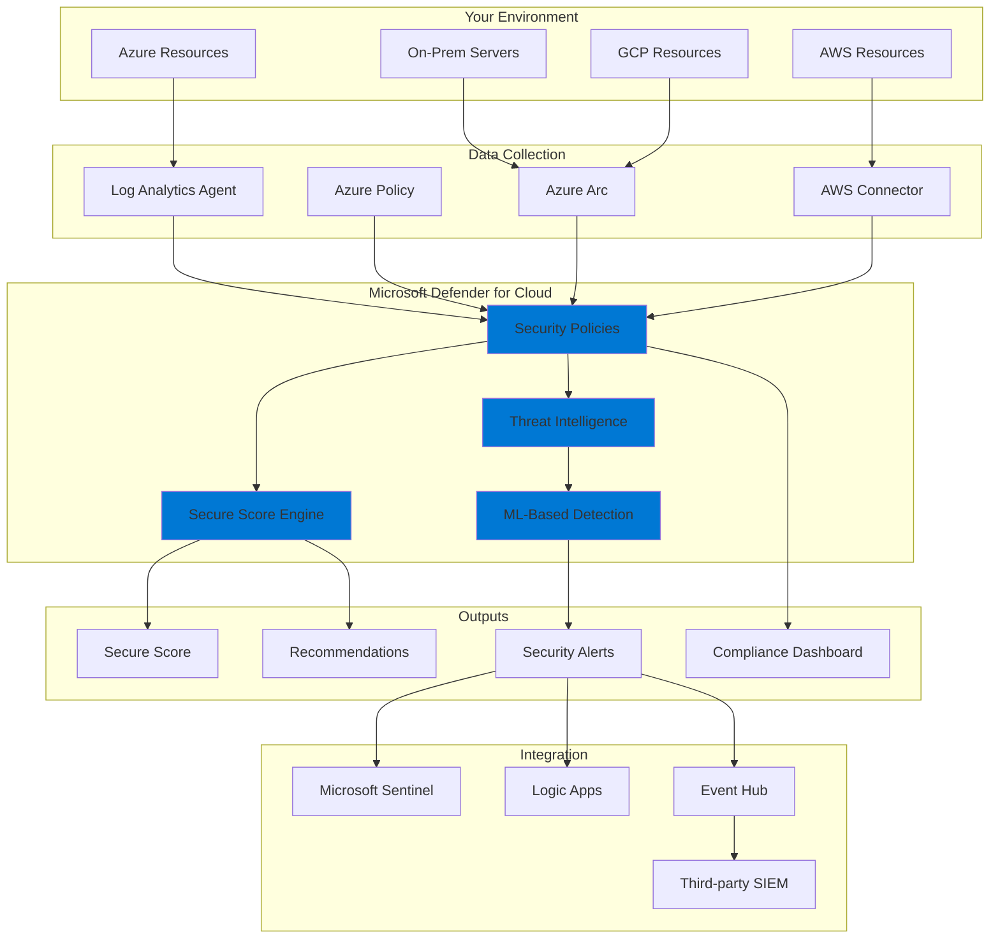
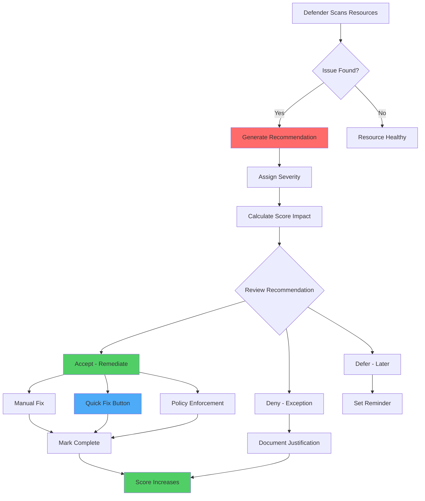
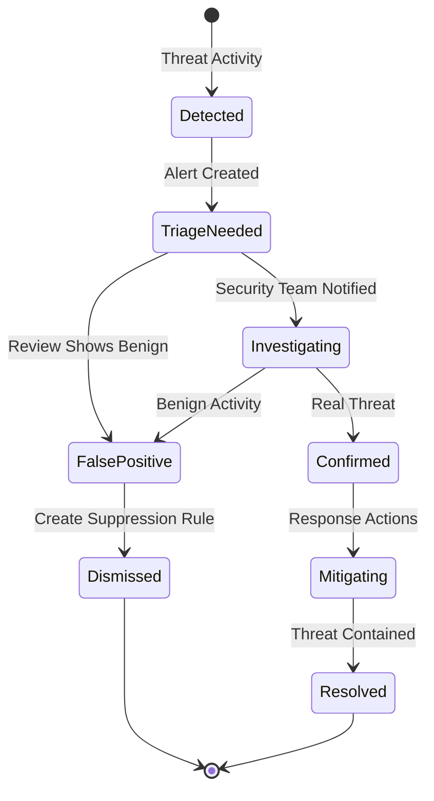
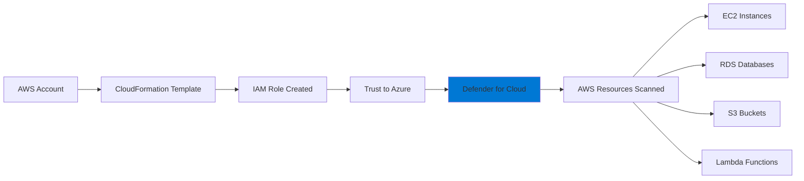
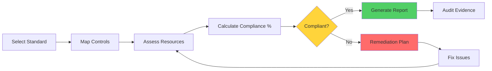

# Microsoft Defender for Cloud - Complete Learning Guide

*Your comprehensive hands-on guide to mastering cloud security*

---

## What Is This Thing Anyway?

So you've heard about Microsoft Defender for Cloud (formerly Azure Security Center). Think of it as your cloud security guardian angel - it watches over your Azure resources, AWS accounts, Google Cloud projects, and even on-premises servers. It's basically Microsoft saying "Hey, we'll help you not get hacked."

The beauty of Defender for Cloud is that it's not just one tool - it's a whole security suite that does three main jobs:

1. **Security Posture Management** - Tells you what's broken and how to fix it
2. **Threat Protection** - Actively defends your workloads from attacks
3. **Compliance Management** - Helps you meet regulatory requirements

---

## Core Capabilities Breakdown

### 1. Cloud Security Posture Management (CSPM)

This is where Defender for Cloud shines. It continuously scans your environment and gives you a **Secure Score** - think of it like a credit score, but for security.

**What it actually does:**
- Scans all your Azure resources (VMs, databases, storage accounts, networks)
- Compares them against security best practices
- Identifies misconfigurations (like "Hey, your database is publicly accessible!")
- Prioritizes fixes based on actual risk

**Real example:** You spin up a storage account for testing. Within minutes, Defender notices it's allowing public blob access and flags it with a recommendation. It even tells you the exact Azure CLI command to fix it.

### 2. Vulnerability Assessment

Your VMs and containers are running hundreds of packages and dependencies. Some of them have known vulnerabilities that attackers love to exploit.

**What happens:**
- Built-in scanner (powered by Qualys) automatically scans VMs
- Container registry scanning checks your Docker images
- Results show you: CVE number, severity, affected package, and remediation

**No agent installation needed** for most scanning - it integrates directly with Azure resources.

### 3. Workload Protection Plans

These are the premium features (paid add-ons) that provide active threat detection:

- **Servers** - Detects suspicious activities, file integrity monitoring
- **App Service** - Protects web apps from common attacks
- **Databases** - SQL injection detection, anomalous access patterns
- **Storage** - Malware scanning, unusual data exfiltration
- **Containers** - Runtime threat detection in Kubernetes
- **Key Vault** - Detects unusual access to secrets

---

## The Architecture (How It All Works)



---

## Getting Started - Step by Step

### Step 1: Enable Defender for Cloud (Free Tier)

The foundational CSPM features are **free** - they're automatically enabled when you have an Azure subscription.

```bash
# Check if Defender for Cloud is enabled
az security pricing list

# You should see output showing Free tier for various resources
```

**What you get for free:**
- Secure Score
- Security recommendations
- Azure Policy assessments
- Basic compliance reporting

### Step 2: Explore Your Secure Score

1. Navigate to Azure Portal → Search "Microsoft Defender for Cloud"
2. Look at your Secure Score (probably lower than you'd like!)
3. Click on each recommendation to understand:
   - What's wrong
   - Why it matters
   - How to fix it
   - Impact on your score

**Pro tip:** Don't panic about a low score initially. A score of 60-70% is actually pretty decent for most organizations.

### Step 3: Enable Enhanced Security Features

Time to turn on the paid protections (they have free trials):

```bash
# Enable Defender for Servers (per server pricing)
az security pricing create \
  --name VirtualMachines \
  --tier Standard

# Enable Defender for Storage (per storage account)
az security pricing create \
  --name StorageAccounts \
  --tier Standard

# Enable Defender for SQL
az security pricing create \
  --name SqlServers \
  --tier Standard

# Enable Defender for Containers
az security pricing create \
  --name Containers \
  --tier Standard

# Enable Defender for App Service
az security pricing create \
  --name AppServices \
  --tier Standard

# Check what's enabled
az security pricing list --output table
```

**Cost heads-up:** Prices vary, but budget roughly:
- Servers: ~$15/server/month
- SQL: ~$15/server/month
- Storage: Based on transactions
- Containers: Based on cores

### Step 4: Configure Log Analytics Workspace

Defender needs a place to send all that security data:

```bash
# Create a workspace (if you don't have one)
az monitor log-analytics workspace create \
  --resource-group mySecurityRG \
  --workspace-name mySecurityWorkspace \
  --location eastus

# Configure auto-provisioning to install agents
az security auto-provisioning-setting update \
  --name default \
  --auto-provision "On"
```

---

## Working with Recommendations

### The Recommendation Workflow



### Practical Example: Fixing a Real Issue

**Scenario:** You get a recommendation "Storage account should use private link"

```bash
# 1. Identify the affected resource
az storage account list --query "[].{Name:name, RG:resourceGroup}" -o table

# 2. Create a private endpoint
STORAGE_ACCOUNT_NAME="mystorageacct123"
RG="myResourceGroup"
VNET_NAME="myVNet"
SUBNET_NAME="mySubnet"

# Disable public network access
az storage account update \
  --name $STORAGE_ACCOUNT_NAME \
  --resource-group $RG \
  --public-network-access Disabled

# Create private endpoint
az network private-endpoint create \
  --name myStoragePrivateEndpoint \
  --resource-group $RG \
  --vnet-name $VNET_NAME \
  --subnet $SUBNET_NAME \
  --private-connection-resource-id $(az storage account show -n $STORAGE_ACCOUNT_NAME -g $RG --query id -o tsv) \
  --group-id blob \
  --connection-name myPrivateConnection

# 3. Wait a few minutes and check Defender - recommendation should resolve
```

---

## Vulnerability Assessment Deep Dive

### Scanning Your VMs

Once you enable Defender for Servers, vulnerability scanning happens automatically:

```bash
# Check if vulnerability assessment is enabled
az security assessment list \
  --query "[?contains(id, 'vulnerabilityAssessment')].{Name:displayName, Status:status.code}" \
  -o table

# View vulnerabilities for a specific VM
VM_NAME="myVM"
az security assessment list \
  --assessed-resource-id "/subscriptions/YOUR_SUB_ID/resourceGroups/YOUR_RG/providers/Microsoft.Compute/virtualMachines/$VM_NAME" \
  -o table
```

### Container Image Scanning

If you're using Azure Container Registry:

```bash
# Enable Defender for container registries
az security pricing create \
  --name ContainerRegistry \
  --tier Standard

# Push an image - it gets scanned automatically
docker tag myapp:latest myregistry.azurecr.io/myapp:v1
docker push myregistry.azurecr.io/myapp:v1

# View scan results in Azure Portal:
# Container Registry → Your Registry → Repository → Specific image → Security tab
```

**What you'll see:**
- Total vulnerabilities count
- Breakdown by severity (Critical, High, Medium, Low)
- Each CVE with description and fix recommendation
- Compliance violations

---

## Working with Security Alerts

### Alert Types You'll Encounter

**Common alerts:**
- Suspicious process execution
- Unusual sign-in activity
- Malware detected
- Brute force attempts
- Data exfiltration detected
- Privilege escalation attempts

### Alert Workflow



### Responding to an Alert

```bash
# List all security alerts
az security alert list --query "[].{Name:alertDisplayName, Severity:severity, Status:status}" -o table

# Get details of a specific alert
ALERT_NAME="suspicious-activity-12345"
az security alert show --name $ALERT_NAME --location eastus

# Update alert status
az security alert update \
  --name $ALERT_NAME \
  --location eastus \
  --status InProgress

# Mark as resolved
az security alert update \
  --name $ALERT_NAME \
  --location eastus \
  --status Resolved
```

---

## SIEM Integration (The Power Move)

### Why Integrate?

Defender for Cloud is great, but most organizations want all security data in one place - their SIEM (Security Information and Event Management system).

**Popular integrations:**
- Microsoft Sentinel (native Azure SIEM)
- Splunk
- IBM QRadar
- ArcSight

### Setting Up Sentinel Integration

```bash
# Create Sentinel workspace (if not exists)
az sentinel workspace create \
  --resource-group mySecurityRG \
  --workspace-name mySentinelWorkspace

# Enable Defender for Cloud data connector in Sentinel
# (This is done via Portal - Security → Data connectors → Microsoft Defender for Cloud)
```

**What gets sent to Sentinel:**
- All security alerts
- Secure Score changes
- Compliance status
- Vulnerability data

### Continuous Export to Event Hub

For non-Microsoft SIEMs:

```bash
# Create Event Hub namespace
az eventhubs namespace create \
  --name mySecurityEventHub \
  --resource-group mySecurityRG \
  --location eastus

# Create Event Hub
az eventhubs eventhub create \
  --name security-alerts \
  --namespace-name mySecurityEventHub \
  --resource-group mySecurityRG

# Configure continuous export in Defender
# Portal → Defender for Cloud → Environment settings → Continuous export
# Select: Export to Event Hub
# Choose: Security alerts, Secure Score, Recommendations
```

### Using Logic Apps for Custom Workflows

```bash
# Example: Create a Logic App that emails on critical alerts
# This creates a workflow that triggers on Defender alerts

# First, get the Defender alert schema
az rest --method get \
  --uri "https://management.azure.com/subscriptions/YOUR_SUB_ID/providers/Microsoft.Security/alertsSuppressionRules?api-version=2019-01-01-preview"
```

**Logic App workflow example:**
1. Trigger: When Defender for Cloud alert is created
2. Condition: If severity equals "High" or "Critical"
3. Action: Send email to security team
4. Action: Create ticket in ServiceNow
5. Action: Post to Teams channel

---

## Advanced: Custom Security Policies

### Understanding Azure Policy vs. Security Policy

- **Azure Policy**: General governance rules
- **Security Policy**: Azure Policies specifically for security

Defender uses initiatives (bundles of policies) like:
- Azure Security Benchmark
- PCI-DSS
- ISO 27001
- HIPAA

### Creating a Custom Policy

```bash
# Example: Enforce that all storage accounts must use HTTPS only
az policy definition create \
  --name 'enforce-https-storage' \
  --display-name 'Storage accounts should only use HTTPS' \
  --description 'Ensures storage accounts reject HTTP traffic' \
  --rules '{
    "if": {
      "allOf": [
        {
          "field": "type",
          "equals": "Microsoft.Storage/storageAccounts"
        },
        {
          "field": "Microsoft.Storage/storageAccounts/supportsHttpsTrafficOnly",
          "notEquals": "true"
        }
      ]
    },
    "then": {
      "effect": "deny"
    }
  }' \
  --mode All

# Assign the policy to your subscription
az policy assignment create \
  --name 'enforce-https-storage-assignment' \
  --display-name 'Enforce HTTPS for Storage' \
  --policy 'enforce-https-storage' \
  --scope "/subscriptions/YOUR_SUB_ID"
```

---

## Multi-Cloud Protection

### Connecting AWS Accounts



**Steps:**
1. In Defender → Environment settings → Add environment → Amazon AWS
2. Download the CloudFormation template
3. Deploy in AWS CloudFormation console
4. Copy the ARN back to Azure
5. Wait 15-30 minutes for initial scan

```bash
# Verify AWS connection
az security connector list --query "[?kind=='AWS'].{Name:name, State:state}" -o table
```

### Connecting GCP Projects

Similar process using Terraform or manual setup:
1. Create a service account in GCP
2. Grant required permissions
3. Add connector in Defender for Cloud

---

## Compliance Management

### Viewing Compliance Dashboard

```bash
# List compliance standards available
az security compliance-standard list -o table

# Get compliance results for a standard
az security compliance list \
  --standard "Azure-Security-Benchmark" \
  -o table

# Export compliance report
az security compliance export \
  --standard "PCI-DSS-3.2.1" \
  --output-file pci-compliance-report.json
```

### Regulatory Compliance Flow



---

## Real-World Scenarios

### Scenario 1: You Just Got Hired (First Week Tasks)

**Your mission:** Assess security posture and quick wins

```bash
# 1. Check current secure score
az graph query -q "SecurityResources | where type == 'microsoft.security/securescores' | project properties.score"

# 2. Export all recommendations
az security assessment list --query "[].{Control:displayName, Severity:metadata.severity, Score:metadata.scoreImpact}" -o json > current-recommendations.json

# 3. Find quick wins (high impact, easy fixes)
az security assessment list \
  --query "[?metadata.implementationEffort=='Low' && metadata.scoreImpact > 5].{Name:displayName, Impact:metadata.scoreImpact}" \
  -o table

# 4. Generate executive report
echo "Security Posture Report - $(date)" > security-report.txt
echo "Current Secure Score: $(az graph query -q 'SecurityResources | where type == \"microsoft.security/securescores\" | project properties.score' --query 'data[0].properties_score' -o tsv)" >> security-report.txt
```

### Scenario 2: Security Incident Response

**Alert:** "Suspicious PowerShell execution detected on VM-WebServer-01"

```bash
# 1. Get alert details
ALERT_ID="alert-12345"
az security alert show --name $ALERT_ID --location eastus

# 2. Isolate the VM (network security group)
VM_RG="production-rg"
VM_NAME="VM-WebServer-01"

# Create deny-all NSG rule
az network nsg rule create \
  --resource-group $VM_RG \
  --nsg-name myNSG \
  --name DenyAllInbound \
  --priority 100 \
  --direction Inbound \
  --access Deny \
  --protocol '*' \
  --source-address-prefixes '*' \
  --source-port-ranges '*' \
  --destination-address-prefixes '*' \
  --destination-port-ranges '*'

# 3. Capture VM snapshot for forensics
az snapshot create \
  --resource-group $VM_RG \
  --name forensic-snapshot-$(date +%Y%m%d) \
  --source "/subscriptions/SUB_ID/resourceGroups/$VM_RG/providers/Microsoft.Compute/disks/vm-disk"

# 4. Review logs in Log Analytics
az monitor log-analytics query \
  --workspace mySecurityWorkspace \
  --analytics-query "SecurityEvent | where Computer == 'VM-WebServer-01' | where TimeGenerated > ago(24h) | order by TimeGenerated desc"
```

### Scenario 3: Monthly Security Review

```bash
# Create monthly security package
MONTH=$(date +%Y-%m)

# 1. Export secure score trend
az monitor metrics list \
  --resource /subscriptions/YOUR_SUB_ID \
  --metric "SecureScore" \
  --start-time $(date -d '30 days ago' +%Y-%m-%d) \
  --end-time $(date +%Y-%m-%d) \
  > secure-score-trend-$MONTH.json

# 2. Count alerts by severity
az security alert list \
  --query "group_by(severity, length(@))" \
  > alerts-by-severity-$MONTH.json

# 3. Top 10 unresolved recommendations
az security assessment list \
  --query "[?status.code=='Unhealthy'] | sort_by(@, &metadata.scoreImpact) | reverse(@) | [0:10].{Name:displayName, Impact:metadata.scoreImpact}" \
  -o table > top-recommendations-$MONTH.txt
```

---

## Automation & DevSecOps

### Infrastructure as Code Security

```yaml
# Azure DevOps Pipeline with Defender checks
trigger:
  - main

pool:
  vmImage: 'ubuntu-latest'

steps:
- task: AzureCLI@2
  displayName: 'Run Security Scan'
  inputs:
    azureSubscription: 'MyAzureConnection'
    scriptType: 'bash'
    scriptLocation: 'inlineScript'
    inlineScript: |
      # Scan ARM templates before deployment
      az deployment group validate \
        --resource-group $(ResourceGroup) \
        --template-file ./infrastructure/main.json
      
      # Check for security issues
      az security assessment list \
        --query "[?status.code=='Unhealthy' && metadata.severity=='High']" \
        -o json > security-issues.json
      
      # Fail pipeline if critical issues found
      CRITICAL_COUNT=$(jq length security-issues.json)
      if [ $CRITICAL_COUNT -gt 0 ]; then
        echo "Found $CRITICAL_COUNT critical security issues"
        exit 1
      fi

- task: PublishBuildArtifacts@1
  inputs:
    pathToPublish: 'security-issues.json'
    artifactName: 'SecurityReport'
```

### Automated Remediation

```bash
# Script to auto-fix common issues
#!/bin/bash

# Fix: Storage accounts without HTTPS enforcement
for storage in $(az storage account list --query "[?enableHttpsTrafficOnly==\`false\`].name" -o tsv); do
  echo "Fixing $storage..."
  az storage account update \
    --name $storage \
    --https-only true
done

# Fix: VMs without backup configured
for vm in $(az vm list --query "[].id" -o tsv); do
  BACKUP_STATUS=$(az backup protection check-vm --vm-id $vm 2>&1)
  if [[ $BACKUP_STATUS == *"not protected"* ]]; then
    echo "Configuring backup for $vm"
    # Enable backup commands here
  fi
done

# Fix: Network security groups with overly permissive rules
az network nsg list --query "[].{Name:name, RG:resourceGroup}" -o tsv | while read name rg; do
  az network nsg rule list --nsg-name $name --resource-group $rg \
    --query "[?destinationPortRange=='*' && access=='Allow'].name" -o tsv | while read rule; do
    echo "WARNING: Rule $rule in NSG $name allows all ports"
  done
done
```

---

## Troubleshooting Common Issues

### Issue 1: Secure Score Not Updating

**Symptoms:** You fixed issues but score hasn't changed

**Solution:**
```bash
# Force a policy compliance scan
az policy state trigger-scan --subscription YOUR_SUB_ID

# Wait 15-30 minutes, then check
az security secure-scores list
```

### Issue 2: Agents Not Deploying

**Symptoms:** VMs not showing in Defender

**Solution:**
```bash
# Check auto-provisioning settings
az security auto-provisioning-setting show --name default

# Manually deploy agent to a VM
az vm extension set \
  --publisher Microsoft.Azure.Security \
  --name IaaSAntimalware \
  --resource-group myRG \
  --vm-name myVM \
  --settings '{"AntimalwareEnabled": true}'

# Check agent status
az vm extension show \
  --resource-group myRG \
  --vm-name myVM \
  --name IaaSAntimalware
```

### Issue 3: Too Many False Positive Alerts

**Solution:**
```bash
# Create suppression rule for specific alert type
az security alerts-suppression-rule create \
  --name suppress-test-alerts \
  --alert-type "VM_SuspiciousActivity" \
  --reason "Benign testing activity" \
  --state Enabled \
  --suppression-alerts-scope '{
    "allOf": [
      {
        "field": "entities.process.commandLine",
        "contains": "test-script.ps1"
      }
    ]
  }'
```

---

## Cost Optimization Tips

### Understanding What You're Paying For

```bash
# Get cost breakdown by protection type
az consumption usage list \
  --start-date $(date -d '30 days ago' +%Y-%m-%d) \
  --end-date $(date +%Y-%m-%d) \
  --query "[?contains(instanceName, 'Security')].{Name:instanceName, Cost:pretaxCost}" \
  -o table
```

**Cost-saving strategies:**

1. **Use selective enablement** - Don't enable all workload protections everywhere
```bash
# Enable Defender only for production VMs
az vm list --query "[?tags.Environment=='Production'].id" -o tsv | while read vm_id; do
  # Apply policy to specific VMs
done
```

2. **Archive old security data** - Move Log Analytics data to cheaper storage
```bash
# Configure data retention
az monitor log-analytics workspace update \
  --resource-group myRG \
  --workspace-name myWorkspace \
  --retention-time 30  # days
```

3. **Use free alternatives where possible** - Azure Policy is free and provides basic CSPM

---

## Useful Queries (KQL - Kusto Query Language)

### Query 1: Top Security Risks

```kql
SecurityRecommendation
| where TimeGenerated > ago(7d)
| summarize Count=count() by RecommendationDisplayName, RecommendationSeverity
| order by Count desc
| take 10
```

### Query 2: Alert Trends

```kql
SecurityAlert
| where TimeGenerated > ago(30d)
| summarize AlertCount=count() by bin(TimeGenerated, 1d), AlertSeverity
| render timechart
```

### Query 3: Vulnerability Distribution

```kql
SecurityVulnerability
| where TimeGenerated > ago(1d)
| summarize VulnCount=count() by Severity, CVE
| order by VulnCount desc
```

### Query 4: Non-Compliant Resources

```kql
SecurityRegulatoryCompliance
| where ComplianceState == "Failed"
| summarize Count=count() by ControlName, Standard
| order by Count desc
```

---

## Quick Reference Commands

### Daily Operations

```bash
# Morning security check
alias sec-check='az security secure-scores list && az security alert list --query "[?status!=\"Resolved\"]" -o table'

# View today's alerts
az security alert list \
  --query "[?properties.timeGeneratedUtc >= '$(date -u +%Y-%m-%d)']" \
  -o table

# Quick compliance check
az security compliance list --standard "Azure-Security-Benchmark" \
  --query "properties.{Control:displayName, Pass:passedAssessments, Fail:failedAssessments}" \
  -o table
```

### Emergency Response

```bash
# Isolate compromised VM
isolate_vm() {
  VM_ID=$1
  az vm stop --ids $VM_ID --no-wait
  echo "VM stopped, creating snapshot..."
  # Add snapshot logic
}

# Revoke suspicious user access
revoke_access() {
  USER_ID=$1
  az ad user update --id $USER_ID --account-enabled false
  az role assignment delete --assignee $USER_ID
}
```

---

## Learning Resources

### Official Microsoft Documentation
- [Defender for Cloud Docs](https://docs.microsoft.com/azure/defender-for-cloud/)
- [Azure Security Benchmark](https://docs.microsoft.com/security/benchmark/azure/)
- [Secure Score Reference](https://docs.microsoft.com/azure/defender-for-cloud/secure-score-security-controls)

### Hands-On Labs
- Microsoft Learn: "Implement platform protection" module
- Azure Security Labs GitHub repo
- Cloud Security Alliance training

### Community Resources
- Azure Security subreddit: r/AZURE
- Tech Community blog posts
- Azure Security Podcast

### Certifications to Consider
- **AZ-500**: Azure Security Engineer Associate
- **SC-200**: Microsoft Security Operations Analyst
- **SC-100**: Microsoft Cybersecurity Architect

---

## Final Thoughts

Microsoft Defender for Cloud is like having a security expert constantly watching your cloud infrastructure. It won't fix everything automatically (that would be dangerous), but it will:

1. **Tell you what's wrong** (recommendations)
2. **Alert you to active threats** (security alerts)
3. **Help you prove compliance** (regulatory standards)
4. **Give you visibility** (across multi-cloud)

**Remember:**
- Start with the free tier to understand your baseline
- Prioritize recommendations by Secure Score impact
- Integrate with your SIEM early
- Automate what you can, but always have human oversight
- Security is a journey, not a destination

Your secure score will never be 100% - that's okay. Focus on the high-impact issues and continuous improvement.

---

*Last updated: November 2025 | Keep learning, stay secure! 🛡️*