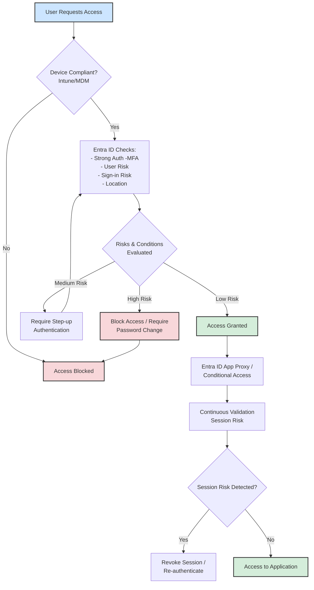

# Azure Entra ID Security

Zero Trust demonstrates a modern, security-focused mindset principles.

Here is a visual flow diagram and a breakdown of key features for implementing a Zero Trust model with Microsoft Entra ID (formerly Azure Active Directory). You can use this to structure your answer and visually explain the concepts.

---

### 1. Visual Flow Diagram: Zero Trust User Sign-In & Access

This diagram illustrates the continuous verification process for a user trying to access an application.

**Explanation about diagram:**

"Let's walk through a typical Zero Trust flow powered by Microsoft Entra ID.

1.  **Request & Device Health:** It all starts when a user requests access from their device. Before we even check *who* they are, we verify *what* they are using. Is the device compliant with our corporate policies (e.g., encrypted, has antivirus, PIN set)? This is typically enforced by Microsoft Intune. If the device is non-compliant, access is blocked immediately.

2.  **Identity Verification:** If the device is healthy, Entra ID performs a strong identity verification. This isn't just a username and password. We enforce **Multi-Factor Authentication (MFA)**. Simultaneously, Entra ID's Identity Protection engine evaluates the user's risk (e.g., leaked credentials) and the sign-in risk (e.g., coming from an anonymous IP).

3.  **Conditional Access Policy Engine:** This is the brain of the operation. The signals (device compliance, MFA, risk levels, location, client app) are fed into Conditional Access policies. The policy makes a decision:
    *   **High Risk:** Block access or force a password change.
    *   **Medium Risk:** Require step-up authentication, like another MFA challenge.
    *   **Low Risk & Compliant:** Grant access.

4.  **Secure Access & Continuous Evaluation:** Access is granted, but it's not a free-for-all. The user connects through secure gateways like the **Entra ID Application Proxy**. Crucially, the session is continuously monitored. If the user's risk level changes mid-session (e.g., they suddenly log in from a different country), the session can be revoked, forcing re-authentication."

---

### 2. Key Features for Interview Discussion Bonus points. 

When discussing the implementation, structure your answer around these key features of Microsoft Entra ID.

#### 1. Conditional Access (The Policy Engine)
This is the core of Zero Trust with Microsoft. It's the "if-then" engine that enforces your controls.
*   **What it is:** A policy-based engine that evaluates signals to make access decisions.
*   **Key Signals:**
    *   **User/Group Membership:** Is the user in the "Finance" group?
    *   **Device Platform:** Is this an iOS device or a Windows PC?
    *   **Device Compliance:** Is it managed and compliant with Intune?
    *   **Location (IP):** Is the user on the corporate network or in a coffee shop?
    *   **Application:** Is the user trying to access SharePoint or a high-impact HR app?
    *   **User Risk & Sign-in Risk:** (From Identity Protection).
*   **Controls:** Based on signals, you can **Grant** access (require MFA, compliant device), or **Block**.

#### 2. Identity Protection (The Risk Intelligence)
This adds an intelligent, automated layer of risk detection.
*   **What it is:** A tool that uses Microsoft's global threat intelligence to detect risky activities related to user identities.
*   **Key Features:**
    *   **Risk Detections:** Identifies **leaked credentials**, sign-ins from **anonymous IP addresses**, **malware-linked IPs**, and **atypical travel** (impossible travel time).
    *   **User Risk & Sign-in Risk Policies:** You can create Conditional Access policies that automatically respond to these risks. For example, "If user risk is high, block access until the user completes a self-service password reset."

#### 3. Multi-Factor Authentication (MFA) & Strong Auth
The "never trust, always verify" principle in action.
*   **What it is:** Requiring two or more pieces of evidence to authenticate.
*   **Implementation:** Enforced via Conditional Access policies. Instead of being "on" for everyone, it's conditional. Example: "Require MFA when accessing apps from outside the trusted office IP range."

#### 4. Device Compliance & Management (Intune Integration)
Verifying the health and trustworthiness of the device.
*   **What it is:** Integrating Entra ID with Microsoft Intune to ensure devices meet security standards before granting access.
*   **Key Checks:** Encryption, PIN length, minimum OS version, jailbreak/root detection.
*   **The Zero Trust Link:** A valid identity on a compromised device is still a major risk. "Grant access only from Intune compliant devices."

#### 5. Privileged Identity Management (PIM)
Applying Zero Trust to administrative access. The principle of **Just-In-Time (JIT)** and **Just-Enough-Access (JEA)**.
*   **What it is:** A service for managing, controlling, and monitoring access to important resources.
*   **Key Features:**
    *   **Time-bound activation:** Admins must request to activate their privileged role for a limited time (e.g., 2 hours).
    *   **Approval Workflows:** Critical role activation requires approval from another person.
    *   **MFA for Activation:** Even to use an admin account, MFA is required.

#### 6. Continuous Access Evaluation (CAE)
This is the "continuous" part of verification, closing the gap between initial auth and session revocation.
*   **What it is:** A feature that allows critical security events to be evaluated in real-time, revoking access *during* an active session.
*   **Examples:** If a user is revoked in Entra ID, or their location changes suspiciously mid-session, CAE can instantly invalidate their token and log them out.

