## Microsoft Security Stack: End-to-End Architecture Flow

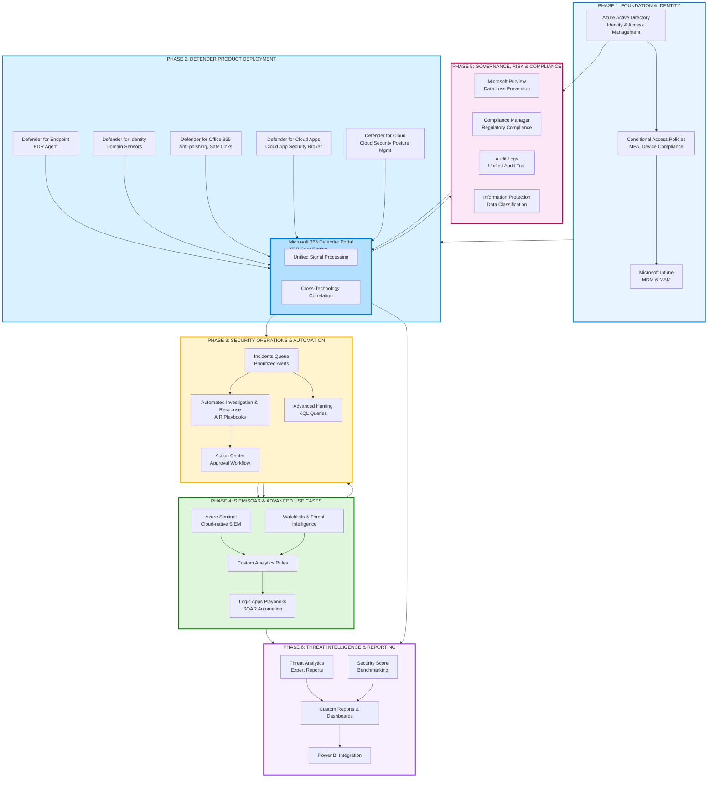

---

## Implementation Journey: Step-by-Step Phases

### PHASE 1: Foundation & Identity (The Control Plane)
**Starting Point - Must be implemented first**
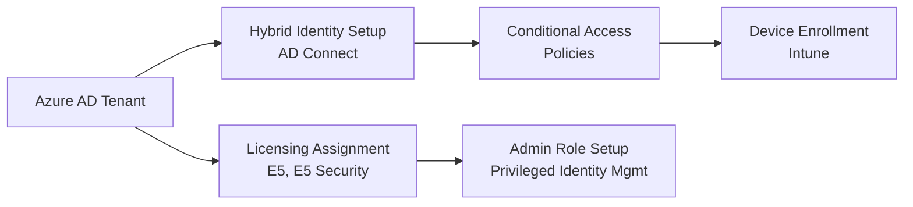

**Implementation Steps:**
1. **Azure AD Connect** - Sync on-premises AD to cloud
2. **Conditional Access Policies** - Require MFA, compliant devices
3. **Intune Enrollment** - Device management and compliance policies
4. **Privileged Identity Management** - Just-in-time admin access

### PHASE 2: Defender Product Rollout
**Deployment Sequence & Integration Points**

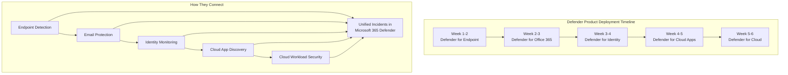

### PHASE 3: Security Operations Setup
**Building the SOC Workflow**

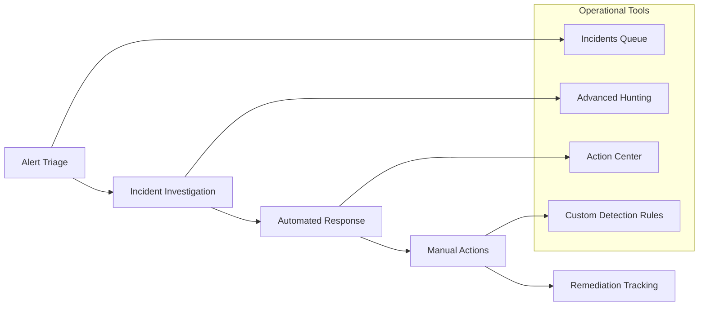

### PHASE 4: Advanced SIEM/SOAR with Sentinel
**Extending Capabilities**

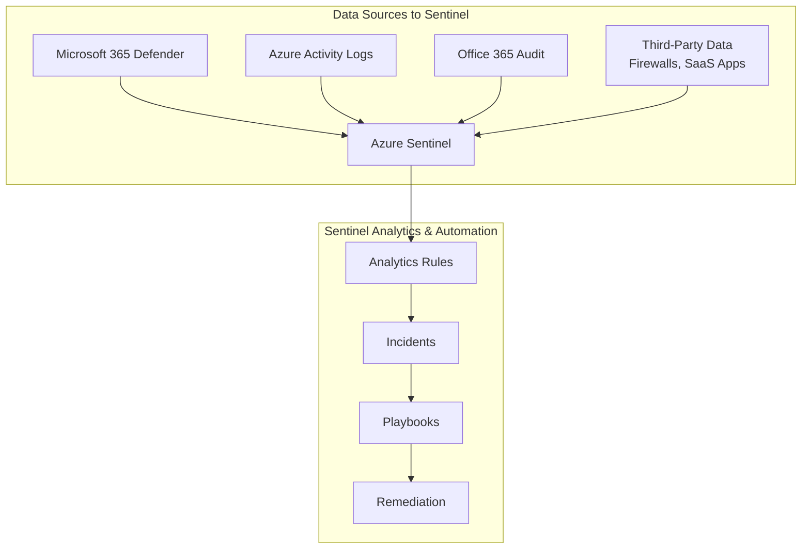

---

## Key Integration Patterns & Data Flow

### 1. Identity-Centric Security Flow
```
User Login → Azure AD → Conditional Access Check → 
├── Compliant Device → Access Granted + Logging
├── Non-compliant Device → Block Access + Alert
└── Risky Sign-in → MFA Challenge + Defender for Identity Alert
```

### 2. Cross-Product Detection Example
```
Defender for Office 365: Phishing Email → 
Defender for Endpoint: Malware Execution → 
Defender for Identity: Lateral Movement → 
Microsoft 365 Defender: Single Incident Created
```

### 3. Automated Response Flow
```
Alert Triggered → AIR Investigation → 
├── High Confidence → Auto-remediate
├── Medium Confidence → Action Center Approval
└── Custom Scenario → Sentinel Playbook
```

### 4. Data Retention & Compliance
```
Real-time Data (30 days) → Microsoft 365 Defender →
Long-term Storage (2+ years) → Azure Sentinel →
Compliance Reporting → Purview Compliance Manager
```

---

## Implementation Best Practices

### Sequential Deployment
1. **Start with Identity** (Azure AD + Conditional Access)
2. **Deploy Endpoint Protection** (Defender for Endpoint)
3. **Enable Email Security** (Defender for Office 365)
4. **Add Identity Protection** (Defender for Identity)
5. **Extend to Cloud Apps** (Defender for Cloud Apps)
6. **Implement Cloud Workload Protection** (Defender for Cloud)
7. **Enable SIEM/SOAR** (Azure Sentinel)
8. **Configure Compliance** (Microsoft Purview)

### Licensing Requirements
- **Microsoft 365 E5** - Full suite access
- **Azure Sentinel** - Pay-per-use or capacity reservation
- **Additional Connectors** - May require separate licensing

### Critical Success Factors
- **Phased rollout** with pilot groups
- **Stakeholder alignment** across IT, Security, and Compliance
- **User communication** and change management
- **Continuous tuning** of detection rules and policies
- **Regular testing** of incident response procedures

This architecture provides a complete roadmap from zero security implementation to a fully operational modern security operations center powered by Microsoft's integrated security stack.

-------

The key to understanding Microsoft XDR is that it's not a single product, but a unified platform that integrates several key products. The core concept is the **Microsoft Defender XDR portal**, which unifies signals from **Defender for Endpoint**, **Defender for Office 365**, **Defender for Identity**, and **Defender for Cloud Apps**.

Here is a detailed, multi-layered flowchart and its explanation.

---

### Holistic Visual Flow: Microsoft XDR End-to-End

The following diagram illustrates the two main flows: **1) The Core XDR Detection & Response Loop** and **2) The Extended SIEM & SOAR Integration with Sentinel**.

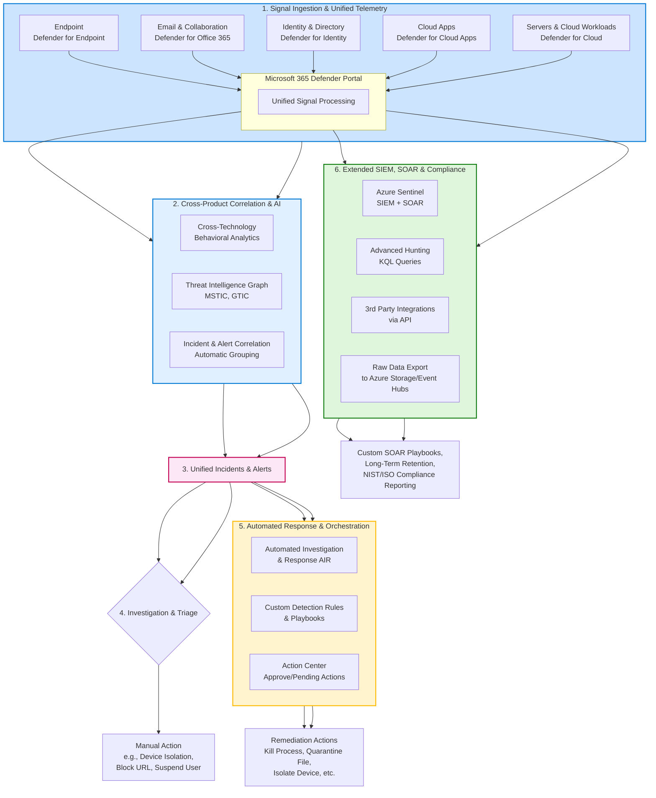

---

### Step-by-Step Explanation of the Holistic Flow

#### Stage 1: Signal Ingestion & Unified Telemetry
This is the foundation. Data is collected from a vast array of sources into the unified **Microsoft 365 Defender portal**.
*   **Defender for Endpoint:** Sensors on Windows, macOS, Linux, iOS, and Android collect process, network, and registry data.
*   **Defender for Office 365:** Analyzes emails, links, and collaboration tools (Teams, SharePoint) for phishing, malware, and business email compromise.
*   **Defender for Identity:** Monitors on-premises Active Directory signals to detect identity-based attacks like reconnaissance, lateral movement, and privilege escalation.
*   **Defender for Cloud Apps:** Provides visibility and control over SaaS applications (e.g., Salesforce, Box, non-Microsoft services).
*   **Defender for Cloud:** Protects Azure, AWS, and GCP workloads, bringing cloud security alerts into the XDR view.

#### Stage 2: Cross-Product Correlation & AI
This is the "brain" of XDR, where the magic happens. The platform doesn't treat signals in isolation.
*   **Behavioral Analytics & AI:** A massive graph database analyzes trillions of signals daily to establish a "normal" baseline and detect anomalies across endpoints, email, and identity.
*   **Threat Intelligence:** Enriched with signals from Microsoft's global threat intelligence (MSTIC, GTIC), providing context on IOCs (Indicators of Compromise) and attacker TTPs (Tactics, Techniques, and Procedures).
*   **Incident Correlation:** Automatically groups related alerts from different sources into a single **Incident**. For example, it can link a phishing email (from Defender for Office) to a resulting malware execution (from Defender for Endpoint) and subsequent lateral movement (from Defender for Identity).

#### Stage 3: Unified Incidents & Alerts
The output of Stage 2 is a prioritized list of **Incidents** in the "Incidents" queue. Each incident tells a story, not just a single alert. This drastically reduces alert fatigue and provides context for the entire attack chain.

#### Stage 4 & 5: Investigation, Triage & Automated Response
This is the response engine.
*   **Manual Investigation & Action:** An analyst can investigate the incident and take manual actions like isolating a device, blocking a URL, or disabling a user account directly from the portal.
*   **Automated Investigation & Response (AIR):** This is the core automation. When an alert is triggered, AIR can automatically start an investigation, check artifacts against the threat intelligence graph, and if confidence is high, take remediation actions.
*   **Action Center:** A central place where all automated remediation actions (pending and completed) are listed, providing transparency and allowing analysts to approve or reject actions.

#### Stage 6: Extended SIEM, SOAR & Compliance
For organizations needing deeper capabilities, integration with **Microsoft Sentinel** is seamless.
*   **Data Connector:** All raw data from the XDR platform can be streamed to Sentinel.
*   **Azure Sentinel (SIEM/SOAR):**
    *   **Advanced Hunting:** The same powerful Kusto Query Language (KQL) used in the Defender portal can be used in Sentinel on a much larger dataset, including non-Microsoft data (e.g., firewall logs, 3rd party EDR).
    *   **Custom SOAR Playbooks:** Create complex, multi-system automation workflows in Azure Logic Apps that XDR alone cannot handle (e.g., creating a ticket in ServiceNow, sending a custom message to Slack).
    *   **Long-Term Retention & Compliance:** Store security data for years to meet regulatory requirements (NIST, ISO, SOX) and perform historical analysis.

### Key Refinements from Your Original Diagram:

1.  **Explicit XDR Components:** Highlighted the specific Defender products (for Office, Identity, etc.) that feed the XDR platform, moving beyond just "Endpoint."
2.  **The "Unified Portal":** Emphasized that the **Microsoft 365 Defender portal** is the central nervous system that unifies everything.
3.  **Cross-Product Correlation:** Called out the "Incident Correlation" as the core XDR value proposition.
4.  **AIR & Action Center:** Differentiated between manual and automated response and introduced the critical "Action Center" for oversight.
5.  **Clarified Sentinel's Role:** Clearly separated the native XDR capabilities from the extended SIEM/SOAR capabilities of Azure Sentinel, showing how they complement each other.
6.  **Visual Grouping & Color-Coding:** Used Mermaid subgraphs and colors to logically group stages (Ingestion, Analysis, Response, Extended SIEM), making the flow easier to digest.

This holistic view demonstrates that Microsoft XDR is a powerful, integrated system that provides a consolidated view and automated response across the modern digital estate, while also being a core component of a broader security operations strategy with Sentinel.

# Microsoft Security Stack: Expert Interview FAQ Guide

## 🎯 CORE XDR & DEFENDER PLATFORM QUESTIONS

### **1. "Explain Microsoft's XDR architecture and how it differs from traditional EDR."**

**Expert Answer:**
"Traditional EDR focuses solely on endpoints, creating siloed visibility. Microsoft's XDR is fundamentally different because it's built on four pillars:

1. **Unified Signal Collection**: Defender for Endpoint, Identity, Office 365, and Cloud Apps feed into a common data lake
2. **Cross-Domain Correlation**: AI connects dots across email, endpoints, identity, and cloud apps
3. **Automated Investigation & Response (AIR)**: Native orchestration across all domains
4. **Single Pane of Glass**: Microsoft 365 Defender portal provides holistic incident management

The key difference is that while EDR might see malware execution, XDR can trace it back to the phishing email that delivered it and the lateral movement attempts that followed."

---

### **2. "How does Microsoft 365 Defender correlate alerts across different products?"**

**Expert Answer:**
"It uses a **graph-based security analytics engine** that processes 65+ trillion signals daily. Here's the correlation process:

1. **Entity Mapping**: Every alert contains entities (users, IPs, files, devices)
2. **Timeline Analysis**: Builds attack chain chronology across products
3. **Confidence Scoring**: AI assigns confidence levels to relationships
4. **Incident Grouping**: Automatically bundles related alerts into single incidents

For example: A suspicious email (Defender for Office) → Malware execution (Defender for Endpoint) → Golden Ticket attack (Defender for Identity) = **One incident showing full kill chain**."

---

## 🔧 IMPLEMENTATION & ARCHITECTURE

### **3. "What's the deployment sequence for Microsoft security stack in a greenfield environment?"**

**Expert Answer:**
"Follow this phased approach:

**Phase 1 - Identity Foundation (Week 1-2)**
- Azure AD Connect for hybrid identity
- Conditional Access policies with MFA
- Intune for device compliance

**Phase 2 - Core Protection (Week 3-6)**
1. Defender for Endpoint (endpoints)
2. Defender for Office 365 (email)
3. Defender for Identity (on-prem AD)
4. Defender for Cloud Apps (SaaS monitoring)

**Phase 3 - Operations (Week 7-8)**
- Configure AIR playbooks
- Set up custom detection rules
- Build Advanced Hunting queries

**Phase 4 - Advanced (Week 9+)**
- Azure Sentinel SIEM integration
- Purview compliance configuration
- Custom SOAR playbooks"

---

### **4. "How do you handle hybrid environments with on-premises Active Directory?"**

**Expert Answer:**
"Three critical components:

1. **Azure AD Connect** with password hash sync and seamless single sign-on
2. **Defender for Identity** sensors on Domain Controllers to monitor on-prem traffic
3. **Conditional Access** with hybrid joined devices requirement

The key is ensuring Defender for Identity can see all domain controller traffic to detect Pass-the-Hash, Golden Ticket, and other identity-based attacks that cloud-only tools would miss."

---

## ⚡ THREAT DETECTION & RESPONSE

### **5. "Explain Automated Investigation and Response (AIR) and when you'd use it."**

**Expert Answer:**
"AIR is Microsoft's native SOAR capability. It works through:

**Investigation Steps:**
1. **Trigger**: Alert from any Defender product
2. **Evidence Collection**: Gathers related artifacts
3. **Analysis**: Checks against threat intelligence
4. **Verdict**: Determines malicious/clean/suspicious

**Response Actions:**
- Isolate devices
- Quarantine files
- Restrict app execution
- Block URLs

**Use Cases:**
- High-confidence malware detection
- Known-bad hash execution
- Widespread phishing campaigns
- Ransomware behavior patterns

**Important**: Always configure the Action Center for approval workflows on medium-confidence findings."

---

### **6. "How does Advanced Hunting differ from traditional log searching?"**

**Expert Answer:**
"Advanced Hunting uses **Kusto Query Language (KQL)** with key advantages:

1. **Unified Schema**: Query across endpoints, email, identity in single query
2. **Proactive Threat Hunting**: Not just searching known IOCs
3. **Custom Detection Rules**: Convert hunting queries to automated alerts

**Example Hunting Scenario:**
```kql
DeviceProcessEvents
| where FileName == "certutil.exe"
| where ProcessCommandLine has "decode" or ProcessCommandLine has "urlcache"
| join (EmailEvents | where Subject contains "invoice") on $left.DeviceId == $right.DeviceId
```

This finds certificate utility abuse combined with suspicious emails - something traditional SIEM would struggle to correlate."

---

## 🔄 INTEGRATION & ECOSYSTEM

### **7. "When should you use Azure Sentinel vs. native Microsoft 365 Defender capabilities?"**

**Expert Answer:**
"This is a crucial architecture decision:

**Use Microsoft 365 Defender When:**
- Primary focus is Microsoft ecosystem protection
- Need native automated response across Microsoft products
- Want out-of-the-box detection engineering
- Limited security team resources

**Use Azure Sentinel When:**
- Need third-party data integration (firewalls, network gear, SaaS apps)
- Require complex SOAR playbooks beyond AIR capabilities
- Need long-term data retention (>180 days)
- Custom compliance reporting requirements

**Best Practice**: Use both - Defender for protection and automated response, Sentinel for SIEM, third-party data, and complex automation."

---

### **8. "How does Purview integrate with the security stack?"**

**Expert Answer:**
"Purview provides the data security and compliance layer:

1. **Information Protection**: Auto-label sensitive data that Defender can then protect
2. **Data Loss Prevention (DLP)**: Policies that trigger security incidents
3. **Audit Logs**: Unified audit trail for all security investigations
4. **Compliance Manager**: Maps security controls to regulatory requirements

**Integration Example**: Defender detects abnormal data access → Purview identifies it as sensitive financial data → Automatic DLP policy enforcement → Incident created in Microsoft 365 Defender."

---

## 🛡️ IDENTITY & ACCESS SECURITY

### **9. "How do Conditional Access and Defender for Identity work together?"**

**Expert Answer:**
"They provide defense-in-depth for identity:

**Conditional Access (Preventive)**
- 'Block access from non-compliant devices'
- 'Require MFA for risky sign-ins'
- 'Allow only from specific locations'

**Defender for Identity (Detective)**
- Detects Pass-the-Ticket attacks CA would miss
- Identifies reconnaissance in on-prem AD
- Alerts on honey token usage

**Together**: CA prevents the initial compromise, Defender for Identity detects what gets through and lateral movement."

---

## 📊 OPERATIONS & BEST PRACTICES

### **10. "What are the key metrics and KPIs for measuring Microsoft security stack effectiveness?"**

**Expert Answer:**
"Track these critical metrics:

**Detection Metrics:**
- Mean Time to Detect (MTTD) across kill chain stages
- Alert-to-Incident correlation ratio
- False positive rate by detection source

**Response Metrics:**
- Mean Time to Respond (MTTR)
- Automated vs. manual remediation percentage
- AIR investigation success rate

**Operational Metrics:**
- Security Score improvement over time
- Coverage percentage (devices, users, apps)
- Incident closure rate by severity

**Pro Tip**: Use the Microsoft Secure Score API to track progress programmatically."

---

### **11. "How do you handle false positives in Microsoft's AI-driven detections?"**

**Expert Answer:**
"Multi-layered approach:

1. **Tuning at Source**: Custom indicators (allow/block lists)
2. **Alert Suppression**: Office 365 ATP policies for trusted senders
3. **Custom Detection Rules**: Fine-tune sensitivity in Microsoft 365 Defender
4. **Automated Feedback Loop**: Use 'Alert not related to this incident' feedback
5. **Hunting-Based Validation**: Regular hunting for similar patterns

Critical: Don't disable detections entirely - use sensitivity adjustments and custom indicators first."

---

## 🚨 ADVANCED SCENARIOS

### **12. "Walk through investigating a business email compromise incident."**

**Expert Answer:**
"Cross-product investigation flow:

1. **Defender for Office 365**: Check email trace, anti-phishing results
2. **Microsoft 365 Defender**: Unified incident with all related alerts
3. **Advanced Hunting**: 
   ```kql
   EmailEvents
   | where Subject contains "urgent payment"
   | join (IdentityLogonEvents | where ActionType == "MailboxLogin") 
     on $left.RecipientEmailAddress == $right.UserId
   ```
4. **Purview**: Check for sensitive data exfiltration
5. **AIR**: Auto-remediate by disabling compromised account, removing malicious emails

Key: The unified incident shows the entire attack chain in one view."

---

### **13. "How do you handle security for unmanaged or BYOD devices?"**

**Expert Answer:**
"Defense-in-depth approach:

1. **Conditional Access**: Require compliant devices for corporate access
2. **App Protection Policies**: Protect data in mobile apps regardless of device management
3. **Defender for Endpoint on unmanaged devices**: New capability for BYOD protection
4. **Defender for Cloud Apps**: Monitor SaaS app usage from any device
5. **Session Controls**: Limit what can be done from unmanaged devices

Critical: Balance security with user productivity through app-level controls."

---

## 💡 PRO TIPS FOR INTERVIEWS

### **Key Differentiators to Highlight:**

1. **"Microsoft's advantage is the integrated graph database that correlates signals across domains automatically"**

2. **"AIR provides native SOAR without additional cost or integration complexity"**

3. **"The security stack leverages Microsoft's global threat intelligence from 65+ trillion daily signals"**

4. **"Zero Trust is built-in through Conditional Access and device compliance integration"**

### **Common Pitfalls to Avoid:**

- ❌ "Don't say 'we use ATP' - use current names (Defender for Endpoint, etc.)"
- ❌ "Don't suggest disabling security features to reduce false positives"
- ❌ "Don't overlook the importance of identity as the new perimeter"
- ❌ "Don't forget hybrid scenarios - most enterprises have on-prem components"

### **Demonstrate Business Alignment:**

- "We measure success through risk reduction, not just technology deployment"
- "The integrated stack reduces TCO by 40-60% compared to point solutions"
- "Automation allows our SOC to focus on high-value investigations"

This FAQ guide covers the depth and breadth that senior security architects and SOC leads are expected to understand about the Microsoft security ecosystem.

------

# Azure Sentinel: Complete SIEM/SOAR Deep Dive

## 🎯 **WHY AZURE SENTINEL? The Core Value Proposition**

### **The Modern SIEM/SOAR Challenge**
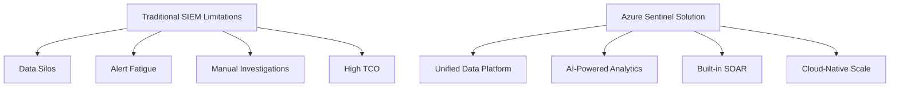

### **Key Business Drivers**
- **Cost Efficiency**: Pay-as-you-go vs. expensive on-prem SIEM
- **Scalability**: Handle petabytes of data without infrastructure management
- **Speed**: Minutes to deploy vs. months for traditional SIEM
- **Integration**: Native connectivity to Microsoft ecosystem + 100+ connectors

---

## 🏗️ **ARCHITECTURE: How Sentinel Actually Works**

### **Core Components Architecture**
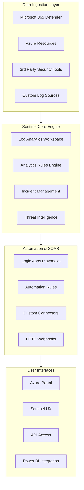

### **Data Flow Deep Dive**
```
Data Sources → Data Connectors → Log Analytics Workspace → 
├── Analytics Rules → Incidents → Playbooks
├── Hunting Queries → Custom Detections
├── Workbooks → Dashboards
└── TI Integration → Enriched Alerts
```

---

## 🔍 **DETECTION & ANALYTICS: The "SIEM" Part**

### **Four Types of Analytics Rules**

#### **1. Microsoft Security Analytics**
```kql
// Built-in detections from Microsoft research
SecurityAlert
| where ProviderName contains "Azure Sentinel"
| where AlertName == "Suspicious PowerShell Execution"
```

#### **2. Fusion ML Rules**
- **What**: AI-driven correlation of low-fidelity alerts into high-fidelity incidents
- **How**: Correlates 2+ anomalous activities across different products
- **Example**: "Impossible travel" + "Rare Office 365 operation" = High-confidence compromise

#### **3. Scheduled Analytics Rules**
```kql
// Custom detection example - Ransomware behavior
SecurityEvent
| where EventID == 4688 // Process creation
| where ProcessName contains "vssadmin" 
| where CommandLine contains "delete shadows"
| extend EntityComputer = Computer
| extend EntityAccount = Account
```

#### **4. NRT (Near Real-Time) Rules**
- **15-60 second detection latency**
- **Limited to 50 rules per workspace**
- **Use cases**: Critical attack patterns requiring immediate response

### **Advanced KQL Hunting Examples**

#### **Multi-Stage Attack Hunting**
```kql
let timeframe = 1h;
// Step 1: Initial compromise via email
let PhishingEmails = 
    EmailEvents
    | where TimeGenerated >= ago(timeframe)
    | where Subject has "invoice" or Subject has "payment"
    | where IsPhishing == 1;
// Step 2: Subsequent suspicious process execution
let SuspiciousProcesses =
    SecurityEvent
    | where TimeGenerated >= ago(timeframe)
    | where EventID == 4688
    | where ProcessName in~ ("certutil.exe", "rundll32.exe", "mshta.exe");
// Correlate
PhishingEmails
| join kind=inner SuspiciousProcesses on $left.RecipientEmailAddress == $right.TargetAccount
| project TimeGenerated, Subject, ProcessName, CommandLine, Computer
```

#### **Lateral Movement Detection**
```kql
SecurityEvent
| where EventID == 4624 // Logon
| where LogonType in (3, 10) // Network logon
| where Account !endswith "$" // Not computer accounts
| summarize LogonCount = dcount(Computer) by Account, bin(TimeGenerated, 1h)
| where LogonCount > 3 // Multiple systems in short time
```

---

## ⚡ **SOAR & AUTOMATION: The "SOAR" Part**

### **Automation Architecture Components**

#### **1. Automation Rules**
- **Purpose**: Incident triage and routing
- **Examples**:
  - Auto-close low-severity false positives
  - Assign incidents based on attacker techniques (MITRE ATT&CK)
  - Tag incidents with custom metadata

#### **2. Playbooks (Logic Apps)**
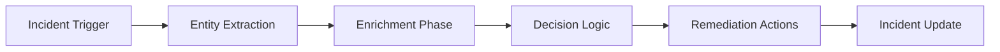

### **Advanced Playbook Examples**

#### **Phishing Response Playbook**
```json
{
  "trigger": "Sentinel Incident - Phishing",
  "steps": [
    "Extract suspicious email entities",
    "Query Office 365 for email trace",
    "Check VirusTotal for IOCs",
    "If malicious: Quarantine email, Block sender/URLs",
    "Update incident with actions taken",
    "Notify SOC team via Teams"
  ]
}
```

#### **Compromised User Response Playbook**
```json
{
  "trigger": "Multiple failed logins + successful logon",
  "actions": [
    "Force user password reset",
    "Revoke active sessions", 
    "Require MFA re-registration",
    "Isolate affected endpoints",
    "Create Service Now ticket"
  ]
}
```

---

## 🎯 **WHEN TO USE SENTINEL vs. MICROSOFT 365 DEFENDER**

### **Decision Framework**
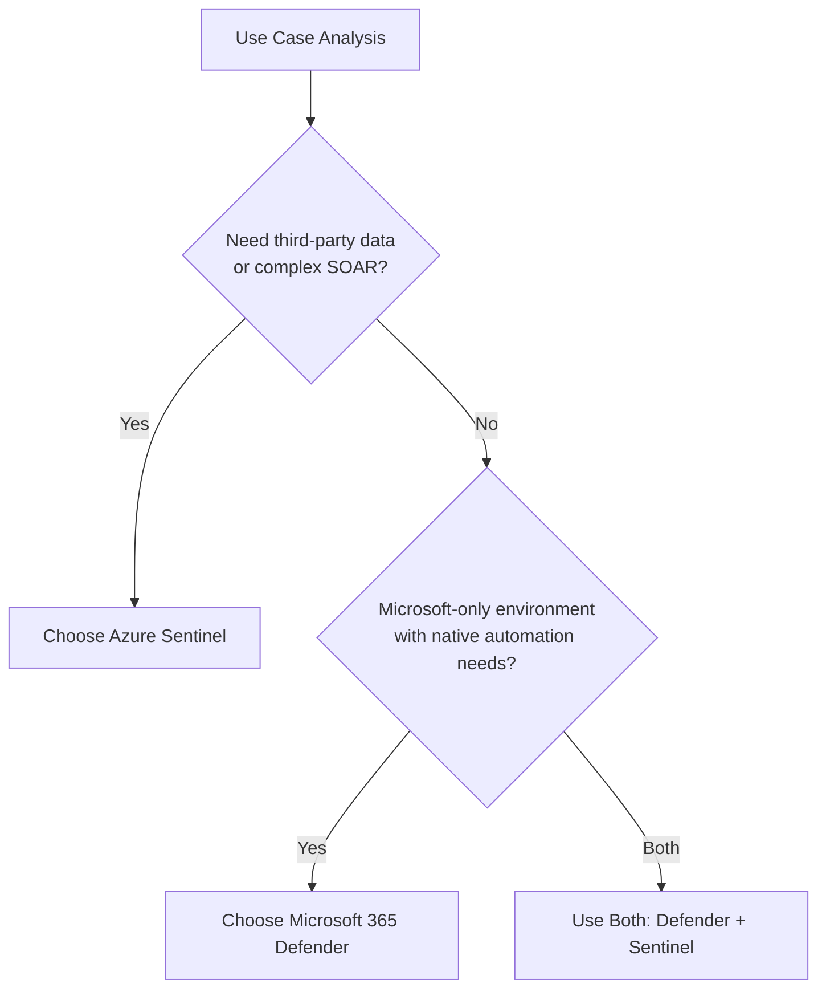

### **Specific Use Cases for Each**

#### **Azure Sentinel Preferred When:**
- **Multi-vendor environment** (Firewalls, network gear, SaaS apps)
- **Custom compliance reporting** (NIST, PCI DSS, HIPAA)
- **Complex SOAR workflows** involving multiple systems
- **Long-term data retention** (>180 days)
- **Advanced threat hunting** across diverse data sources

#### **Microsoft 365 Defender Preferred When:**
- **Pure Microsoft ecosystem** (M365, Azure AD, Windows)
- **Need native automated response** without playbook development
- **Limited security team resources** for custom engineering
- **Real-time protection** vs. historical analysis

---

## 🔧 **IMPLEMENTATION STRATEGY**

### **Phased Deployment Approach**

#### **Phase 1: Foundation (Weeks 1-2)**
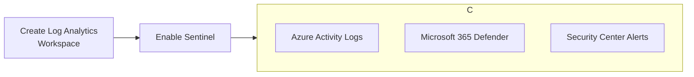

#### **Phase 2: Core Detection (Weeks 3-4)**
- Enable built-in analytics rules
- Configure Microsoft security analytics
- Set up basic automation rules
- Create essential workbooks

#### **Phase 3: Advanced Use Cases (Weeks 5-8)**
- Custom analytics rules
- SOAR playbooks for common scenarios
- Threat intelligence integration
- Hunting notebooks

#### **Phase 4: Optimization (Ongoing)**
- Fine-tune alert thresholds
- Expand data sources
- Develop specialized playbooks
- Implement ML-based detections

---

## 📊 **OPERATIONAL EXCELLENCE**

### **Key Monitoring & Health Checks**

#### **Daily Operations**
```kql
// Sentinel Health Dashboard Query
SentinelHealth
| summarize TotalIncidents=count(), 
            OpenIncidents=countif(Status == "New" or Status == "Active"),
            AvgTimeToClose=avg(TimeToClose) by bin(TimeGenerated, 1d)
```

#### **Data Ingestion Monitoring**
```kql
Usage
| where Solution == "SecurityInsights"
| summarize GB=sum(Quantity) by DataType, bin(TimeGenerated, 1d)
| render columnchart
```

### **Cost Optimization Strategies**

1. **Data Retention Tiers**:
   - Interactive retention: 90 days
   - Archive retention: 2+ years
   - Use cost analysis workbook regularly

2. **Smart Ingestion**:
   - Filter unnecessary data at source
   - Use data transformation rules
   - Monitor for duplicate connectors

---

## 🚀 **ADVANCED CAPABILITIES**

### **1. Threat Intelligence Integration**
```kql
// Enrich alerts with threat intelligence
SecurityAlert
| extend TI = ThreatIntelligenceIndicator
| where TI.ThreatType has "malware"
| project TimeGenerated, AlertName, TI.ThreatType, TI.ConfidenceScore
```

### **2. UEBA (User Entity Behavior Analytics)**
- **Built-in behavioral profiling**
- **Anomaly detection without rules**
- **Risk scoring for users and devices**
- **Integration with Azure AD Identity Protection**

### **3. Watchlists**
- **Custom IOCs** (IPs, hashes, domains)
- **Business context** (VIP users, critical servers)
- **Compliance data** (regulated data locations)

### **4. Notebooks (Jupyter)**
- **Advanced investigation scenarios**
- **Machine learning analysis**
- **Multi-step hunting workflows**

---

## 🛡️ **REAL-WORLD SCENARIOS**

### **Scenario 1: Ransomware Attack Chain**
```
1. Initial Access: Phishing email with malicious attachment
2. Execution: Macro-enabled document drops payload
3. Discovery: Network scanning and credential dumping
4. Lateral Movement: RDP to multiple systems
5. Impact: Encryption of files with ransom note

Sentinel Detection:
- Email security alerts → Custom analytics for suspicious RDP → 
- Behavioral analytics for file encryption patterns → 
- Automated containment playbook
```

### **Scenario 2: Insider Threat**
```
Behaviors: 
- Abnormal after-hours access
- Bulk data downloads
- Access to unrelated departments

Sentinel Approach:
- UEBA anomalies for user behavior
- Data loss prevention alerts
- Purview integration for sensitive data context
- Custom hunting for data exfiltration patterns
```

---

## 📈 **MEASURING SUCCESS**

### **Key Metrics & KPIs**
- **Mean Time to Detect (MTTD)**: <1 hour for critical alerts
- **Mean Time to Respond (MTTR)**: <4 hours for containment
- **Automation Rate**: >60% of incidents with automated actions
- **False Positive Rate**: <10% for high-severity alerts
- **Hunting ROI**: Measure incidents discovered via proactive hunting

### **Continuous Improvement**
- **Weekly**: Review automation effectiveness
- **Monthly**: Update detection rules based on new threats
- **Quarterly**: Tabletop exercises using Sentinel data
- **Annually**: Review architecture and cost optimization

---

## 💡 **EXPERT TIPS & BEST PRACTICES**

### **Do's:**
- ✅ Start with Microsoft data sources first
- ✅ Use automation rules for consistent incident handling
- ✅ Implement a naming convention for all custom content
- ✅ Regularly review and tune analytics rules
- ✅ Leverage MITRE ATT&CK framework for detection coverage

### **Don'ts:**
- ❌ Ingest everything without a strategy
- ❌ Create playbooks for every possible scenario
- ❌ Ignore cost management and monitoring
- ❌ Skip regular testing of automation
- ❌ Underestimate the importance of entity mapping

### **Pro Tips:**
1. **Use the "Watchlist" feature for business context** - critical servers, VIP users, sensitive locations
2. **Leverage the "Community" GitHub** for ready-made detection rules
3. **Implement "Automation Rules" before complex playbooks** - they're simpler and more reliable
4. **Use "Workbooks" for operational dashboards** - don't just rely on the incidents queue
5. **Regularly test your SOAR playbooks** - they can break with API changes

This comprehensive guide positions Azure Sentinel as not just a SIEM, but a **security orchestration platform** that becomes the brain of your security operations when properly implemented and optimized.

-----
# Top 10 Security Incidents & Risks: Permanent Solutions with Sentinel & KQL

## 🎯 **INCIDENT 1: Credential Phishing & Account Compromise**

### **The Problem:**
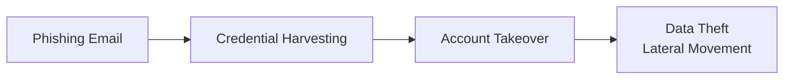

### **Permanent Sentinel Solution:**
```kql
// Advanced Phishing Detection & Auto-Containment
SecurityAlert
| where ProviderName == "Office 365"
| where AlertName has "User reported phishing"
| extend CompromisedUser = tostring(CompromisedEntity)
| join kind=inner (IdentityLogonEvents
    | where TimeGenerated >= ago(1h)
    | where ActionType == "LogonFailed") on $left.CompromisedUser == $right.UserId
| where FailedLogonCount > 3
| extend RiskScore = case(
    FailedLogonCount > 10, "High",
    FailedLogonCount > 5, "Medium", 
    "Low")
| project TimeGenerated, CompromisedUser, RiskScore, AlertName
```

**Automation Playbook:**
- Auto-force password reset via Graph API
- Revoke active sessions
- Require MFA re-registration
- Quarantine suspicious emails chain

---

## 🎯 **INCIDENT 2: Ransomware Attack Chain**

### **The Problem:**
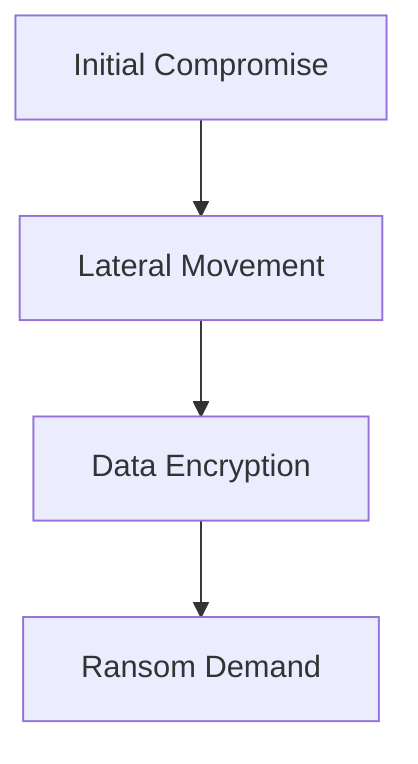

### **Permanent Sentinel Solution:**
```kql
// Ransomware Behavioral Pattern Detection
let RansomwareIndicators = datatable(ProcessName:string, CommandLineIndicator:string)
[
    "vssadmin", "delete shadows",
    "wmic", "shadowcopy delete",
    "bcdedit", "recoveryenabled no",
    "fsutil", "usn deletejournal"
];
SecurityEvent
| where EventID == 4688
| where TimeGenerated >= ago(30m)
| join kind=inner RansomwareIndicators on $left.NewProcessName contains $right.ProcessName
| where CommandLine contains CommandLineIndicator
| extend EntityComputer = Computer
| extend EntityAccount = Account
| project TimeGenerated, Computer, Account, ProcessName, CommandLine, RiskLevel="CRITICAL"
```

**Automation Playbook:**
- Immediate device isolation via Defender API
- Kill malicious processes
- Block network communication from affected systems
- Alert SOC with critical priority

---

## 🎯 **INCIDENT 3: Insider Threat - Data Exfiltration**

### **The Problem:**
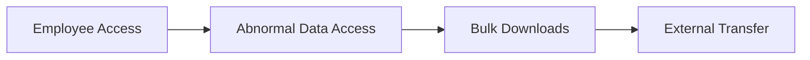

### **Permanent Sentinel Solution:**
```kql
// Insider Threat - Data Exfiltration Pattern
let BaselineBehavior = 
    OfficeActivity
    | where TimeGenerated >= ago(30d)
    | where Operation in ("FileDownloaded", "FileAccessed")
    | summarize AvgDailyDownloads = count() / 30 by UserId;
OfficeActivity
| where TimeGenerated >= ago(1d)
| where Operation in ("FileDownloaded", "FileAccessed") 
| summarize DailyDownloads = count(), DownloadedGB = sum(todouble(SourceFileSize)) by UserId, bin(TimeGenerated, 1d)
| join kind=inner BaselineBehavior on UserId
| where DailyDownloads > (AvgDailyDownloads * 5) // 500% increase
| where DownloadedGB > 1 // More than 1GB data
| project TimeGenerated, UserId, DailyDownloads, AvgDailyDownloads, DownloadedGB, RiskScore="HIGH"
```

**Automation Playbook:**
- Auto-restrict download permissions
- Trigger DLP policies
- Alert management and legal teams
- Create forensic evidence package

---

## 🎯 **INCIDENT 4: Cloud Resource Misconfiguration**

### **The Problem:**
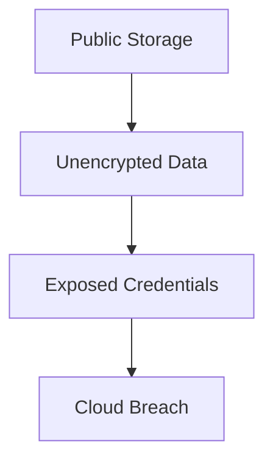

### **Permanent Sentinel Solution:**
```kql
// Cloud Security Posture Monitoring
AzureDiagnostics
| where Category == "Security"
| where ResourceType == "MICROSOFT.STORAGE/STORAGEACCOUNTS"
| where OperationName == "SetBlobServiceProperties"
| extend PublicAccess = tostring(properties_containerPublicAccess_s)
| where PublicAccess != "Off"
| extend ResourceGroup = tostring(resourceGroup_s)
| extend SubscriptionId = tostring(subscriptionId_s)
| project TimeGenerated, ResourceGroup, SubscriptionId, PublicAccess, RiskLevel="HIGH"
```

**Automation Playbook:**
- Auto-remediate public storage containers
- Enforce encryption policies
- Notify cloud security team
- Update compliance dashboard

---

## 🎯 **INCIDENT 5: Supply Chain Attack**

### **The Problem:**
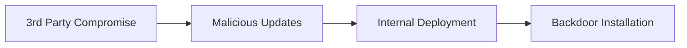

### **Permanent Sentinel Solution:**
```kql
// Software Supply Chain Attack Detection
let TrustedVendors = dynamic(["microsoft", "adobe", "oracle", "cisco"]);
SecurityEvent
| where EventID == 4688
| where TimeGenerated >= ago(2h)
| where NewProcessName endswith ".exe"
| extend Publisher = tostring(Publisher)
| extend Vendor = tostring(split(Publisher, " ")[0])
| where Vendor !in (TrustedVendors)
| where IsUncommonPublisher == 1
| summarize UncommonInstallations = count() by Computer, Vendor, bin(TimeGenerated, 1h)
| where UncommonInstallations > 5
| project TimeGenerated, Computer, Vendor, UncommonInstallations, RiskLevel="MEDIUM"
```

**Automation Playbook:**
- Quarantine suspicious software
- Block execution via AppLocker policies
- Alert vendor management team
- Scan for IOCs across environment

---

## 🎯 **INCIDENT 6: Privilege Escalation Attacks**

### **The Problem:**
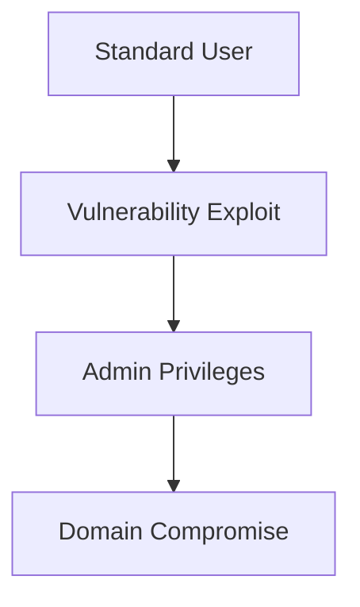

### **Permanent Sentinel Solution:**
```kql
// Privilege Escalation Pattern Detection
SecurityEvent
| where EventID in (4672, 4720, 4732) // Special privileges, User account created, Group membership changed
| where TimeGenerated >= ago(1h)
| extend TargetAccount = tostring(TargetAccount)
| extend SubjectAccount = tostring(SubjectAccount)
| summarize 
    PrivilegeChanges = countif(EventID == 4672),
    AccountCreations = countif(EventID == 4720),
    GroupMemberships = countif(EventID == 4732)
    by SubjectAccount, bin(TimeGenerated, 15m)
| where PrivilegeChanges > 3 or AccountCreations > 1 or GroupMemberships > 2
| project TimeGenerated, SubjectAccount, PrivilegeChanges, AccountCreations, GroupMemberships, RiskLevel="HIGH"
```

**Automation Playbook:**
- Temporary privilege revocation
- Force MFA for privileged accounts
- Alert identity protection team
- Initiate user behavior analysis

---

## 🎯 **INCIDENT 7: Cryptojacking & Resource Abuse**

### **The Problem:**
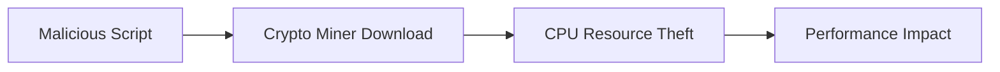

### **Permanent Sentinel Solution:**
```kql
// Cryptojacking Detection via Performance Metrics
Perf
| where TimeGenerated >= ago(30m)
| where ObjectName == "Processor" and CounterName == "% Processor Time"
| where InstanceName == "_Total"
| summarize AvgCPU = avg(CounterValue) by Computer, bin(TimeGenerated, 5m)
| where AvgCPU > 80 // Sustained high CPU
| join kind=inner (Processes
    | where TimeGenerated >= ago(30m)
    | where ExecutablePath contains "temp" 
    or ExecutablePath contains "appdata"
    or ProcessName contains "miner") on Computer
| project TimeGenerated, Computer, ProcessName, ExecutablePath, AvgCPU, RiskLevel="MEDIUM"
```

**Automation Playbook:**
- Kill mining processes automatically
- Block known mining pool domains
- Isolate infected systems
- Alert infrastructure team

---

## 🎯 **INCIDENT 8: Business Email Compromise (BEC)**

### **The Problem:**
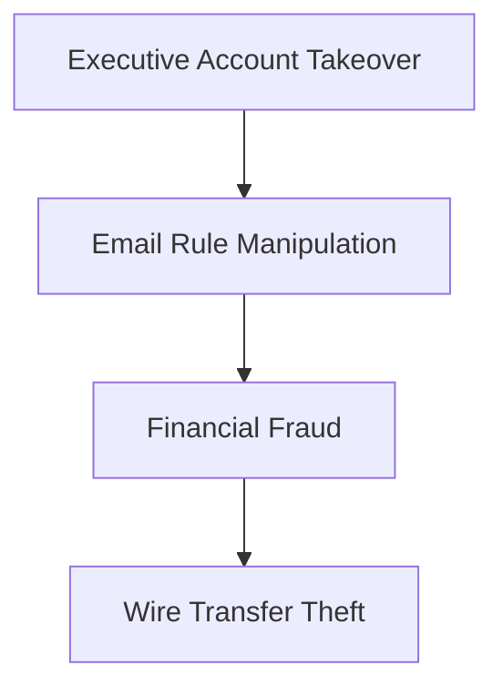

### **Permanent Sentinel Solution:**
```kql
// BEC Detection - Email Rule Manipulation & Financial Keywords
OfficeActivity
| where TimeGenerated >= ago(4h)
| where Operation in ("New-InboxRule", "Set-InboxRule")
| extend RuleParameters = tostring(Parameters)
| where RuleParameters has "forward" or RuleParameters has "redirect"
| join kind=inner (OfficeActivity
    | where Operation == "Send"
    | where Subject contains "urgent" 
    or Subject contains "payment"
    or Subject contains "wire transfer"
    or Subject contains "invoice") on UserId
| project TimeGenerated, UserId, Operation, RuleParameters, Subject, RiskLevel="HIGH"
```

**Automation Playbook:**
- Remove suspicious email rules
- Block financial transactions from compromised accounts
- Alert finance department immediately
- Force executive account review

---

## 🎯 **INCIDENT 9: Zero-Day Exploit Attempts**

### **The Problem:**
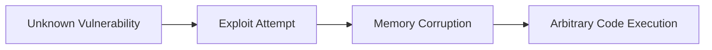

### **Permanent Sentinel Solution:**
```kql
// Zero-Day Behavioral Detection - Anomalous Process Behavior
let NormalProcessTree = 
    SecurityEvent
    | where TimeGenerated >= ago(30d)
    | where EventID == 4688
    | summarize NormalParents = makeset(ParentProcessName) by NewProcessName;
SecurityEvent
| where TimeGenerated >= ago(1h)
| where EventID == 4688
| join kind=leftanti NormalProcessTree on NewProcessName
| where ParentProcessName !in (NormalParents)
| summarize AnomalousExecutions = count() by Computer, NewProcessName, ParentProcessName
| where AnomalousExecutions > 3
| project TimeGenerated, Computer, NewProcessName, ParentProcessName, AnomalousExecutions, RiskLevel="HIGH"
```

**Automation Playbook:**
- Quarantine anomalous processes
- Block parent-child process relationships
- Collect forensic artifacts
- Alert threat intelligence team

---

## 🎯 **INCIDENT 10: Data Destruction Attacks**

### **The Problem:**
```mermaid
flowchart TD
    A[Malicious Insider] --> B[Bulk File Deletion] --> C[Backup Destruction] --> D[Business Disruption]
```

### **Permanent Sentinel Solution:**
```kql
// Data Destruction Pattern Detection
SecurityEvent
| where TimeGenerated >= ago(1h)
| where EventID == 4663 // File deletion
| extend FilePath = tostring(FilePath)
| where FilePath contains "\\" 
| summarize 
    DeletionCount = count(),
    UniqueFolders = dcount(FilePath),
    DeletedGB = sum(todouble(FileSize)) / 1024 / 1024 / 1024
    by Account, Computer, bin(TimeGenerated, 10m)
| where DeletionCount > 100 // Mass deletion
| where DeletedGB > 5 // Significant data loss
| project TimeGenerated, Account, Computer, DeletionCount, DeletedGB, RiskLevel="CRITICAL"
```

**Automation Playbook:**
- Immediate account disablement
- Block file system access
- Trigger backup restoration process
- Alert business continuity team

---

## 🛡️ **COMPREHENSIVE AUTOMATION FRAMEWORK**

### **Unified Incident Response Architecture**
```mermaid
flowchart TD
    A[Threat Detection] --> B[Risk Scoring] --> C[Automated Response] --> D[Remediation] --> E[Lessons Learned]
    
    subgraph B
        B1[KQL Detection Rules]
        B2[ML Anomaly Detection]
        B3[Threat Intel Enrichment]
    end
    
    subgraph C
        C1[Playbook Execution]
        C2[Auto-Containment]
        C3[Human Approval<br>for Critical Actions]
    end
```

### **Key Automation Benefits:**
- **Response Time**: Reduced from hours to seconds
- **Consistency**: Eliminate human error in repetitive tasks
- **Scalability**: Handle thousands of alerts simultaneously
- **24/7 Coverage**: Automated protection outside business hours

### **Implementation Roadmap:**
1. **Phase 1**: Deploy detection rules for top 3 critical risks
2. **Phase 2**: Implement basic automation for containment
3. **Phase 3**: Add advanced playbooks with human oversight
4. **Phase 4**: Continuous optimization based on threat landscape

This comprehensive approach transforms your security operations from reactive monitoring to proactive, automated defense that permanently eliminates the most critical organizational risks.

------

# XDR vs Intune Device Onboarding: Complete Strategic Guide

## 🎯 **FUNDAMENTAL PURPOSE & ARCHITECTURE DIFFERENCES**

### **Core Mission Comparison**
```mermaid
flowchart TD
    subgraph A [Microsoft Intune - Endpoint Management]
        A1[Device Compliance]
        A2[Application Management]
        A3[Policy Enforcement]
        A4[Conditional Access]
        A5[OS Configuration]
    end

    subgraph B [Defender XDR - Security Operations]
        B1[Threat Detection]
        B2[Incident Response]
        B3[Behavioral Analytics]
        B4[Attack Investigation]
        B5[Security Monitoring]
    end
    
    A --> C[MANAGEMENT & CONTROL<br>Proactive Configuration]
    B --> D[SECURITY & PROTECTION<br>Reactive Detection]
```

---

## 🔧 **ONBOARDING PROCESS: TECHNICAL DIFFERENCES**

### **Intune Device Onboarding Flow**
```mermaid
flowchart LR
    A[Device Discovery] --> B[Enrollment] --> C[Policy Deployment] --> D[Compliance Assessment] --> E[Access Grant]
    
    subgraph B
        B1[Autopilot]
        B2[Company Portal]
        B3[Bulk Enrollment]
        B4[Co-management]
    end
    
    subgraph C
        C1[Config Profiles]
        C2[Security Baselines]
        C3[App Deployment]
        C4[Update Rings]
    end
```

**Technical Implementation:**
```powershell
# Intune Enrollment via Autopilot
Get-WindowsAutopilotInfo.ps1 -OutputFile "DeviceHash.csv"

# Graph API for device registration
POST https://graph.microsoft.com/beta/deviceManagement/windowsAutopilotDeviceIdentities
{
    "serialNumber": "123456",
    "model": "Surface Laptop 5",
    "hardwareIdentifier": "base64encodedhash"
}
```

### **Defender XDR Onboarding Flow**
```mermaid
flowchart LR
    A[Sensor Deployment] --> B[Signal Collection] --> C[Cloud Processing] --> D[Threat Detection] --> E[Incident Creation]
    
    subgraph A
        A1[Defender Agent Install]
        A2[Configuration Settings]
        A3[Network Connectivity]
        A4[Service Health]
    end
    
    subgraph B
        B1[Process Monitoring]
        B2[Network Activity]
        B3[File Operations]
        B4[Registry Changes]
    end
```

**Technical Implementation:**
```powershell
# Defender for Endpoint Onboarding Script
# Download and install sensor
$setup = Start-Process "MDEClientAnalyzer.cmd" -ArgumentList "/Q" -Wait -PassThru

# Verify sensor status
Get-MpComputerStatus | Select-Object AntivirusEnabled, RealTimeProtectionEnabled

# Check Defender connection
Test-CloudConnection -Service Defender
```

---

## 🎯 **WHEN TO USE WHICH: DECISION FRAMEWORK**

### **Strategic Decision Matrix**
```mermaid
flowchart TD
    A[Device Management Need] --> B{What is your primary goal?}
    
    B -->|Control & Compliance| C[Choose INTUNE]
    B -->|Threat Detection & Response| D[Choose DEFENDER XDR]
    
    C --> C1[Device Configuration]
    C --> C2[App Deployment]
    C --> C3[Access Control]
    
    D --> D1[Security Monitoring]
    D --> D2[Incident Investigation]
    D --> D3[Threat Hunting]
    
    C & D --> E[Most Organizations Need BOTH]
```

### **Specific Use Cases**

#### **Use Intune When:**
```mermaid
graph LR
    A[Intune Scenarios] --> B[Compliance Enforcement]
    A --> C[Application Management]
    A --> D[OS Configuration]
    A --> E[Conditional Access]
    A --> F[BYOD Management]
    
    B --> B1[Require encrypted devices]
    C --> C1[Deploy business apps]
    D --> D1[Enforce security settings]
    E --> E1[Block non-compliant access]
    F --> F1[Separate work/personal data]
```

#### **Use Defender XDR When:**
```mermaid
graph LR
    A[XDR Scenarios] --> B[Advanced Threat Detection]
    A --> C[Incident Investigation]
    A --> D[Behavioral Analytics]
    A --> E[Threat Hunting]
    A --> F[Automated Response]
    
    B --> B1[Fileless malware detection]
    C --> C1[Cross-domain attack analysis]
    D --> D1[Anomalous user behavior]
    E --> E1[Proactive threat searching]
    F --> F1[Auto-isolate compromised devices]
```

---

## 🔄 **INTEGRATION SYNERGY: HOW THEY WORK TOGETHER**

### **Unified Security Stack Architecture**
```mermaid
flowchart TD
    subgraph A [Management Layer - Intune]
        A1[Device Enrollment]
        A2[Compliance Policies]
        A3[Security Baselines]
        A4[App Protection]
    end

    subgraph B [Protection Layer - Defender XDR]
        B1[Threat Detection]
        B2[Endpoint Sensor]
        B3[Behavioral Analysis]
        B4[Incident Response]
    end

    subgraph C [Identity Layer - Azure AD]
        C1[Conditional Access]
        C2[Risk Assessment]
        C3[Access Policies]
    end

    A --> C
    B --> C
    A --> B[Compliance Status]
    B --> A[Security Recommendations]
```

### **Real-World Integration Examples**

#### **Scenario 1: Compromised Device Response**
```
1. DEFENDER XDR DETECTS:
   - Malicious process execution
   - Suspicious network connections
   - Behavioral anomalies

2. AUTOMATED ACTIONS:
   - Defender: Isolate device from network
   - Intune: Revoke compliance status
   - Azure AD: Block user access via Conditional Access

3. REMEDIATION:
   - Intune: Deploy remediation scripts
   - Defender: Verify threat elimination
   - Intune: Restore compliance status
```

#### **Scenario 2: Compliance-Driven Protection**
```
1. INTUNE CONFIGURES:
   - Require BitLocker encryption
   - Enforce Defender Antivirus
   - Set minimum OS version

2. DEFENDER MONITORS:
   - Encryption status changes
   - Antivirus health signals
   - OS vulnerability exposure

3. AUTOMATED ENFORCEMENT:
   - Non-compliant device → Conditional Access block
   - Security misconfiguration → Intune remediation
   - Active threats → Defender auto-isolation
```

---

## 🛡️ **SECURITY VALUE COMPARISON**

### **Intune Security Capabilities**
```json
{
  "managementControls": {
    "compliancePolicies": [
      "Device encryption",
      "OS version requirements", 
      "Jailbreak/root detection",
      "Threat level maximum"
    ],
    "configurationProfiles": [
      "Firewall settings",
      "Defender Antivirus configuration",
      "BitLocker enforcement",
      "Local security policies"
    ],
    "accessControls": [
      "Conditional Access integration",
      "App protection policies",
      "Network access controls",
      "Data loss prevention"
    ]
  }
}
```

### **Defender XDR Security Capabilities**
```json
{
  "protectionControls": {
    "threatDetection": [
      "Behavior-based malware detection",
      "Fileless attack prevention",
      "Ransomware behavior blocking",
      "Network attack analysis"
    ],
    "investigationTools": [
      "Advanced hunting queries",
      "Attack timeline reconstruction", 
      "Cross-domain correlation",
      "Threat intelligence integration"
    ],
    "responseActions": [
      "Automated device isolation",
      "Process termination",
      "File quarantine",
      "Custom response playbooks"
    ]
  }
}
```

---

## 🔧 **IMPLEMENTATION STRATEGY**

### **Recommended Deployment Sequence**
```mermaid
flowchart TD
    A[Phase 1: Foundation] --> B[Phase 2: Management] --> C[Phase 3: Protection] --> D[Phase 4: Automation]
    
    subgraph A
        A1[Azure AD Connect]
        A2[Conditional Access]
        A3[Licensing Assignment]
    end
    
    subgraph B
        B1[Intune Enrollment]
        B2[Compliance Policies]
        B3[App Deployment]
    end
    
    subgraph C
        C1[Defender Sensor Deployment]
        C2[Security Baselines]
        C3[Threat Detection Tuning]
    end
    
    subgraph D
        D1[Automated Response Playbooks]
        D2[Cross-Product Integration]
        D3[Continuous Optimization]
    end
```

### **Device Onboarding Checklist**

#### **Intune Onboarding Requirements:**
- ✅ Azure AD Premium P1 license
- ✅ MDM/MAM authority set to Intune
- ✅ Enrollment restrictions configured
- ✅ Compliance policies created
- ✅ App protection policies defined

#### **Defender XDR Onboarding Requirements:**
- ✅ Defender for Endpoint license
- ✅ Sensor deployment method selected
- ✅ Network endpoints accessible
- ✅ Configuration settings defined
- ✅ Integration with Intune enabled

---

## 📊 **OPERATIONAL MONITORING DIFFERENCES**

### **Intune Monitoring Focus**
```kql
// Device compliance and health monitoring
DeviceComplianceOrg
| where TimeGenerated >= ago(7d)
| summarize 
    CompliantRate = percentif(1, ComplianceState == "Compliant") * 100
    by DeviceType, OSVersion
| render columnchart
```

### **Defender XDR Monitoring Focus**
```kql
// Security incident and threat monitoring
SecurityIncident
| where TimeGenerated >= ago(30d)
| summarize 
    IncidentCount = count(),
    MeanTimeToResolve = avg(TimeToResolve)
    by bin(TimeGenerated, 1d), Severity
| render timechart
```

---

## 💡 **EXPERT RECOMMENDATIONS**

### **When You MUST Use Both:**
1. **Regulated Industries** (Finance, Healthcare, Government)
2. **Zero Trust Architecture** implementations
3. **Modern Workplace** transformations
4. **High-Security Environments** with compliance requirements

### **Cost-Optimization Strategies:**
- **Small Businesses**: Start with Intune + Defender Antivirus
- **Medium Enterprises**: Add Defender for Endpoint
- **Large Enterprises**: Full XDR + Intune + Conditional Access

### **Implementation Priority:**
```
HIGH PRIORITY (Phase 1):
✓ Intune device enrollment
✓ Basic compliance policies  
✓ Conditional Access
✓ Defender Antivirus

MEDIUM PRIORITY (Phase 2):
✓ Defender for Endpoint deployment
✓ Security baselines
✓ App protection policies
✓ Automated remediation

ADVANCED (Phase 3):
✓ XDR cross-product detection
✓ Advanced hunting
✓ Custom detection rules
✓ SOAR playbooks
```

---

## 🚨 **COMMON MISTAKES TO AVOID**

### **Technical Pitfalls:**
- ❌ **Assuming Intune provides EDR capabilities** (it doesn't)
- ❌ **Deploying Defender without Intune compliance integration**
- ❌ **Creating conflicting policies between systems**
- ❌ **Neglecting conditional access configuration**
- ❌ **Overlooking co-management transition planning**

### **Strategic Mistakes:**
- ❌ **Treating them as competing solutions** (they're complementary)
- ❌ **Implementing in isolation without integration planning**
- ❌ **Focusing only on technical deployment without security outcomes**
- ❌ **Underestimating the change management requirements**

## 🎯 **KEY TAKEAWAY**

**Intune** is your **device management and compliance engine** - it ensures devices are configured properly and meet security standards.

**Defender XDR** is your **security monitoring and response engine** - it detects, investigates, and responds to advanced threats.

**Together**, they create a complete modern endpoint security strategy where management enables protection, and protection informs management. Most organizations need both to achieve comprehensive security and compliance in today's threat landscape.
-----

## :) BONUS 

# Top SOC Analyst Interview FAQs: Complete Guide

## 🎯 **TECHNICAL SKILLS & PLATFORM KNOWLEDGE**

### **1. "Walk us through how you investigate a security alert from start to finish"**

**Expert Answer Framework:**
```
1. ALERT TRIAGE & PRIORITIZATION
   - Check alert severity and confidence level
   - Review MITRE ATT&CK mapping
   - Examine initial indicators (IP, domain, hash)

2. INITIAL INVESTIGATION
   - Correlate with other alerts in timeline
   - Check entity behavior history
   - Enrich with threat intelligence

3. DEEP DIVE ANALYSIS
   - Examine process tree and command lines
   - Check network connections and destinations
   - Review user behavior and access patterns

4. CONTAINMENT & ERADICATION
   - Isolate affected systems if confirmed
   - Block malicious indicators
   - Reset compromised credentials

5. DOCUMENTATION & HANDOFF
   - Document all findings and actions
   - Update incident timeline
   - Handoff to IR team if needed
```

### **2. "Explain the difference between SIEM, EDR, and XDR"**

**Clear Comparison:**
```mermaid
flowchart TD
    A[SIEM] --> A1[Centralized Logging]
    A --> A2[Compliance & Reporting]
    A --> A3[Alert Correlation]
    
    B[EDR] --> B1[Endpoint Visibility]
    B --> B2[Process Monitoring]
    B --> B3[Endpoint Response]
    
    C[XDR] --> C1[Cross-Platform Detection]
    C --> C2[Automated Response]
    C --> C3[Unified Incident Management]
```

**Practical Answer:**
"SIEM is our centralized log analysis platform that correlates alerts from multiple sources. EDR gives us deep visibility into endpoint activities like process execution and network connections. XDR builds on this by automatically correlating alerts across endpoints, email, identity, and cloud apps into unified incidents with automated response capabilities."

---

## 🔍 **INCIDENT RESPONSE SCENARIOS**

### **3. "You get an alert for suspicious PowerShell execution. What's your investigation process?"**

**Step-by-Step Investigation:**
```kql
// Sample KQL for PowerShell Investigation
SecurityEvent
| where TimeGenerated >= ago(24h)
| where EventID == 4688
| where NewProcessName contains "powershell"
| where CommandLine contains "-Enc" 
or CommandLine contains "IEX"
or CommandLine contains "DownloadString"
| extend ParentProcess = ParentProcessName
| project TimeGenerated, Computer, Account, CommandLine, ParentProcess
```

**Verbal Response:**
"First, I'd check the command line for obfuscation techniques like base64 encoding, IEX, or DownloadString. Then I'd examine the parent process - was PowerShell spawned by Office applications or browsers? Next, I'd look for network connections to suspicious domains and check if the script attempts privilege escalation. Finally, I'd correlate with other alerts from the same user or system."

### **4. "How do you investigate a potential phishing email reported by a user?"**

**Investigation Checklist:**
- ✅ **Email Headers Analysis**: Check SPF, DKIM, DMARC
- ✅ **Attachment Analysis**: Sandbox detonation, hash checking
- ✅ **URL Analysis**: Expand shortened links, check reputation
- ✅ **Sender Analysis**: Domain age, similarity to legitimate domains
- ✅ **Impact Assessment**: Check if others received it, any clicks

**KQL Query Example:**
```kql
// Investigate Phishing Campaign
EmailEvents
| where TimeGenerated >= ago(2h)
| where Subject contains "Invoice" 
or Subject contains "Payment"
| where SenderFromDomain in ("similar-domain.com", "typo-domain.com")
| summarize EmailCount = count(), Recipients = makeset(RecipientEmailAddress) 
by Subject, SenderFromDomain
```

---

## ⚡ **THREAT HUNTING & PROACTIVE DEFENSE**

### **5. "What's your process for proactive threat hunting?"**

**Hunting Methodology:**
```mermaid
flowchart LR
    A[Hypothesis] --> B[Data Collection] --> C[Analysis] --> D[Findings] --> E[Automation]
```

**Specific Hunting Examples:**
- **Lateral Movement**: Hunt for RDP connections outside business hours
- **Data Exfiltration**: Look for large data transfers to personal cloud storage
- **Persistence**: Search for unusual scheduled tasks or service installations

**Sample Hunting Query:**
```kql
// Hunt for DNS Tunneling
DnsEvents
| where TimeGenerated >= ago(7d)
| where Name has_any (".dynamic-dns.net", ".no-ip.com", ".duckdns.org")
| summarize QueryCount = count(), UniqueDomains = dcount(Name) 
by ClientIP, bin(TimeGenerated, 1h)
| where QueryCount > 100 // Excessive DNS queries
```

### **6. "How do you differentiate between true positives and false positives?"**

**Investigation Framework:**
```
1. CONTEXT ANALYSIS
   - Business context: Is this normal for the user/role?
   - Technical context: Is this part of legitimate software?

2. CORRELATION EVIDENCE
   - Multiple detection sources confirming?
   - Timeline showing attack progression?
   - Other systems showing similar activity?

3. BEHAVIORAL ANALYSIS
   - Does this match known TTPs?
   - Is there intent and capability?
   - Does it deviate from established baselines?

4. CONFIDENCE ASSESSMENT
   - High: Multiple evidence sources + malicious intent
   - Medium: Single source + suspicious behavior  
   - Low: Single source + possible legitimate use
```

---

## 🛡️ **MICROSOFT SECURITY ECOSYSTEM**

### **7. "How do you use Microsoft 365 Defender and Azure Sentinel together?"**

**Integrated Workflow Explanation:**
```
DEFENDER (Protection & Detection):
- Real-time endpoint protection
- Email security monitoring
- Identity protection
- Automated investigation & response

SENTINEL (SIEM & SOAR):
- Centralized alert correlation
- Custom detection rules
- SOAR playbooks for complex workflows
- Long-term data retention
- Third-party data integration
```

**Practical Example:**
"When Defender detects a suspicious process, it can automatically investigate and contain it. Meanwhile, Sentinel correlates this with firewall logs and identity events to see the bigger picture. If it's part of a larger attack, Sentinel playbooks can orchestrate response across multiple systems that Defender alone can't reach."

### **8. "Explain how you'd use KQL for security investigations"**

**Essential KQL Patterns:**
```kql
// Pattern 1: Time-based correlation
SecurityAlert
| where TimeGenerated >= ago(1h)
| join kind=inner (SecurityEvent
    | where TimeGenerated >= ago(2h)
    | where EventID == 4624) on $left.CompromisedEntity == $right.Computer

// Pattern 2: Behavioral baselining
let Baseline = 
    SecurityEvent
    | where TimeGenerated between(ago(30d)..ago(1d))
    | where EventID == 4688
    | summarize count() by Account, Computer, NewProcessName;
SecurityEvent
| where TimeGenerated >= ago(1d)
| where EventID == 4688
| join kind=leftanti Baseline on Account, Computer, NewProcessName
```

---

## 🔧 **TOOLS & TECHNOLOGIES**

### **9. "What tools are in your SOC investigation toolkit?"**

**Essential Tools List:**
- **SIEM/Logging**: Azure Sentinel, Splunk, Elastic
- **EDR**: Microsoft Defender for Endpoint, CrowdStrike
- **Network Analysis**: Wireshark, Zeek, NetFlow
- **Threat Intelligence**: VirusTotal, AlienVault OTX, MISP
- **Forensic Tools**: FTK, Autopsy, Velociraptor
- **Scripting**: PowerShell, Python for automation

### **10. "How do you stay current with emerging threats?"**

**Continuous Learning Approach:**
- **Daily**: Review threat intelligence feeds, security news
- **Weekly**: Participate in security webinars, read research papers
- **Monthly**: Practice in CTF platforms, update detection rules
- **Quarterly**: Attend security conferences, take training courses

---

## 🚨 **BEHAVIORAL & SCENARIO-BASED QUESTIONS**

### **11. "Describe a time you handled a major security incident"**

**STAR Method Response:**
- **Situation**: "We detected ransomware spreading across the network..."
- **Task**: "My role was to contain the spread and identify patient zero..."
- **Action**: "I isolated affected systems, identified the initial phishing email, and worked with IT to restore from backups..."
- **Result**: "Contained within 2 hours, minimal data loss, improved our email filtering rules..."

### **12. "How do you handle alert fatigue?"**

**Proactive Strategies:**
- **Tuning**: Regularly review and adjust alert thresholds
- **Automation**: Implement auto-closure for common false positives
- **Prioritization**: Focus on high-severity, high-confidence alerts first
- **Rotation**: Ensure analysts rotate through different alert types

### **13. "What do you do when you discover something beyond your expertise?"**

**Escalation Protocol:**
1. **Documentation**: Thoroughly document what you've found
2. **Containment**: Implement immediate containment if possible
3. **Escalation**: Notify senior analysts or incident response team
4. **Collaboration**: Work with the team while learning from the experience

---

## 📊 **METRICS & REPORTING**

### **14. "What SOC metrics are most important to track?"**

**Key Performance Indicators:**
- **MTTD (Mean Time to Detect)**: Time from attack to detection
- **MTTR (Mean Time to Respond)**: Time from detection to containment
- **Alert Volume**: Total alerts by severity and source
- **False Positive Rate**: Percentage of incorrect alerts
- **Incident Closure Rate**: Time to fully resolve incidents

### **15. "How do you document your investigations?"**

**Documentation Standards:**
- **Incident Timeline**: Chronological sequence of events
- **IOCs (Indicators of Compromise**: Hashes, IPs, domains, filenames
- **TTPs (Tactics, Techniques, Procedures)**: MITRE ATT&CK mapping
- **Remediation Actions**: Steps taken to contain and eradicate
- **Lessons Learned**: Improvements for future detection

---

## 💡 **PRO-TIPS FOR SUCCESS**

### **Technical Demonstration Tips:**
- **Practice Common Queries**: Have 5-10 KQL/Splunk queries ready to discuss
- **Know the Kill Chain**: Be able to map alerts to MITRE ATT&CK framework
- **Understand Log Sources**: Know what data each security tool provides

### **Behavioral Excellence:**
- **Show Curiosity**: Demonstrate passion for learning and investigation
- **Emphasize Teamwork**: Highlight collaboration experiences
- **Focus on Business Impact**: Connect security to business protection

### **Questions to Ask Interviewers:**
1. "What's your current biggest security challenge?"
2. "How does the SOC handle shift handovers?"
3. "What's your process for detection rule tuning?"
4. "What opportunities are there for professional development?"

### **Common Pitfalls to Avoid:**
- ❌ "I don't know" (instead say "I would research...")
- ❌ Blaming other teams during scenario questions
- ❌ Focusing only on technical skills, ignoring communication
- ❌ Not asking thoughtful questions at the end

This comprehensive FAQ guide covers the technical depth, practical experience, and professional mindset that hiring managers look for in SOC analyst candidates. Remember to tailor your responses based on the specific tools and processes used by the organization you're interviewing with.

----
