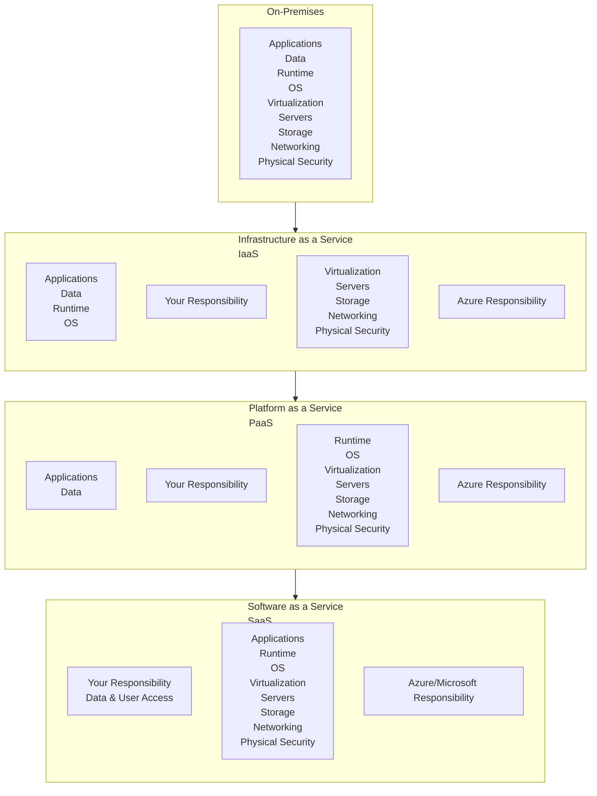
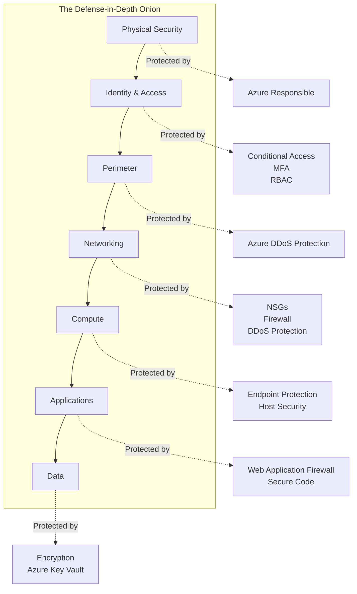
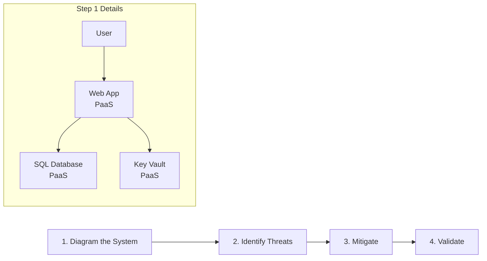

### **A Comprehensive Guide to Azure Security & Threat Modeling**

**Hello there!** 👋

So, you want to understand how to secure your castle in the cloud? Excellent! This tutorial will walk you through the core principles of Azure Security and how to think like an attacker using Threat Modeling. We'll build the concepts from the ground up.

Let's begin our journey.

---

### **1. The Foundation: The Shared Responsibility Model**

Before we build anything, we MUST understand this. It's the most critical concept in cloud security.

**In traditional IT (on-premises):** You own the entire stack—the physical security, the network, the servers, the applications, everything. The buck stops with you.

**In the cloud:** This responsibility is **shared** between you and Microsoft.

The diagram below shows how it works:

**The Simple Rule:** **You are always responsible for your *data*, your *identities*, and who you *give access to*.**

*   **IaaS (Virtual Machines):** You're the OS admin. You patch the OS, manage the software, and secure the guest OS.
*   **PaaS (Azure SQL, App Service):** Azure manages the OS and runtime. You focus on securing your application and data.
*   **SaaS (Office 365):** Microsoft manages almost everything. You focus on user access and your data.

> **📝 Takeaway:** You can't secure what you don't own. Know your boundaries!

---

### **2. The Azure Security Pillars: Your Defense-in-Depth**

Think of security as layers of an onion. An attacker must peel through each layer to get to your data. This is **Defense-in-Depth**.

Let's visualize this architecture:

Now, let's break down each layer with the key Azure services:

#### **Layer 1: Identity & Access**
*   **Goal:** Control who can do what.
*   **Key Services:**
    *   **Azure Active Directory (Azure AD):** The heart of it all. It's your identity provider.
    *   **Multi-Factor Authentication (MFA):** A *must-have*. A password is not enough.
    *   **Conditional Access:** Define policies like "Block access if not from a corporate device."
    *   **Role-Based Access Control (RBAC):** Assign permissions based on roles (Reader, Contributor, Owner). **Principle of Least Privilege!**

#### **Layer 2: Perimeter**
*   **Goal:** Protect from widespread network attacks.
*   **Key Services:**
    *   **Azure DDoS Protection:** Mitigates massive volumetric attacks designed to overwhelm your services.

#### **Layer 3: Networking**
*   **Goal:** Control traffic flow between your resources.
*   **Key Services:**
    *   **Network Security Groups (NSGs):** Like a basic firewall. Allow/deny traffic to subnets and VMs.
    *   **Azure Firewall:** A fully stateful, managed firewall as a service.
    *   **Azure Virtual Network (VNet):** Your private, isolated network in Azure.
    *   **Private Endpoints:** Connect to PaaS services (like Storage) over a private link, not the public internet.

#### **Layer 4: Compute**
*   **Goal:** Secure your servers and workloads.
*   **Key Services:**
    *   **Microsoft Defender for Cloud:** Your central security dashboard! Provides security recommendations and threat detection.
    *   **Endpoint Protection:** Install antivirus on your VMs.
    *   **System Updates:** Keep your VMs patched! Use **Azure Update Management**.

#### **Layer 5: Applications**
*   **Goal:** Secure the apps you build and run.
*   **Key Services:**
    *   **Web Application Firewall (WAF):** Protects your web apps from common exploits (SQL Injection, XSS).
    *   **Secure Key Storage:** **NEVER store secrets in your code.** Use **Azure Key Vault**.

#### **Layer 6: Data**
*   **Goal:** Protect your data, even if everything else is breached.
*   **Key Services:**
    *   **Encryption at Rest:** Automatic for most services (Azure Storage, SQL). Use your own keys managed in **Key Vault**.
    *   **Encryption in Transit:** Use TLS 1.2+.
    *   **Azure Information Protection:** Classify and label sensitive documents.

---

### **3. Threat Modeling: Thinking Like an Attacker**

Security isn't just about tools; it's about a process. Threat modeling is how you proactively find weaknesses *before* you deploy.

We'll use the **STRIDE** model, developed by Microsoft. It categorizes threats.

| Threat | Description | Example in Azure |
| :--- | :--- | :--- |
| **S**poofing | Impersonating a user or system. | Stealing user credentials. |
| **T**ampering | Modifying data or code. | Unauthorized changes to a blob storage file. |
| **R**epudiation | Claiming an action wasn't performed. | A user deleting a log file and denying it. |
| **I**nformation Disclosure | Exposing data to unauthorized users. | An unsecured S3 bucket... err, I mean an Azure Storage Container with "public" access. |
| **D**enial of Service | Making a service unavailable. | DDoS attack on your VM's public IP. |
| **E**levation of Privilege | Gaining higher access rights. | A standard user making themselves a Global Admin. |

#### **The Threat Modeling Process in 4 Steps**

Let's map this process out:

**Step 1: Diagram Your Application**
Draw a data flow diagram (DFD). What are the components? Where does data go? For our example, let's take a simple web app:
*   **User** -> **Azure App Service (Web App)** -> **Azure SQL Database**
*   The Web App uses a connection string stored in **Azure Key Vault**.

**Step 2: Identify Threats (Apply STRIDE)**
Let's brainstorm for our simple app:

*   **Spoofing:** Could an attacker steal the App Service's identity to access Key Vault or SQL?
*   **Tampering:** Could someone modify the data in our SQL database?
*   **Repudiation:** Could a developer delete the SQL database and claim they didn't?
*   **Information Disclosure:** Is the SQL database encrypted? Is the connection string in Key Vault safe?
*   **Denial of Service:** Is our web app protected from a DDoS attack?
*   **Elevation of Privilege:** Does the App Service have more permissions than it needs?

**Step 3: Mitigate the Threats**
Now, we map the threats to the security controls we discussed.

| Threat | Mitigation |
| :--- | :--- |
| Spoofing of App Service | Use **Managed Identities** for the App Service to access Key Vault/SQL. (This is a huge one! No secrets to manage). |
| Tampering with SQL Data | Use **Transparent Data Encryption (TDE)** and **Azure AD authentication** for SQL. |
| Repudiation | Enable **Resource Logs** and **Azure Activity Logs**. Send them to a secure, immutable storage. |
| Information Disclosure | Ensure **TLS 1.2** is enforced for the web app. Ensure SQL **firewall** rules block public access. |
| Denial of Service | Use **Azure DDoS Protection Standard** if a public endpoint is critical. |
| Elevation of Privilege | Review RBAC assignments. Does the App Service's Managed Identity have only the `Get` secret permission on Key Vault? |

**Step 4: Validate**
Use **Microsoft Defender for Cloud** to continuously monitor your mitigations. It will check for unencrypted SQL DBs, missing MFA, open firewalls, etc.

---

### **4. Putting It All Together: An End-to-End Example**

**Scenario:** Secure a new three-tier web application.

**Architecture:**
*   **Tier 1:** Azure Application Gateway (with WAF) -> **Tier 2:** App Service in a VNet -> **Tier 3:** Azure SQL Database with Private Endpoint.

**Your Security To-Do List:**

1.  **Identity:**
    *   Create an Azure AD group for app developers.
    *   Assign them the **App Service Contributor** role (Principle of Least Privilege).
    *   Enforce **MFA** for all admins and developers via a Conditional Access policy.

2.  **Networking:**
    *   Deploy the App Service into an App Service Environment (v3) *inside* your VNet.
    *   Use **Network Security Groups (NSGs)** to restrict traffic only from the Application Gateway to the App Service.
    *   Configure a **Private Endpoint** for the Azure SQL Database so it's only accessible from within the VNet.
    *   Put the Application Gateway in a separate subnet with a **DDoS Protection Plan** attached.

3.  **Compute/Application:**
    *   Enable a **Managed Identity** for the App Service.
    *   Store all secrets (SQL connection string, API keys) in **Azure Key Vault**.
    *   Grant the App Service's Managed Identity access to read secrets from Key Vault.

4.  **Data:**
    *   Ensure **TDE** is enabled on the SQL Database.
    *   Use **Azure AD authentication** to connect to the SQL Database instead of a username/password.

5.  **Monitoring & Governance:**
    *   Enable **Microsoft Defender for Cloud** on the subscription.
    *   Turn on **Defender for Azure SQL**, **Defender for App Service**, etc.
    *   Review the secure score and implement the recommendations.

### **Conclusion & Final Handwritten Note**

You've made it! This is a vast topic, but you now have the mental model and the map.

**Remember:**
*   **Start with the Shared Responsibility Model.**
*   **Build your defenses in layers.**
*   **Proactively find holes with Threat Modeling (STRIDE).**
*   **Continuously monitor and improve with Defender for Cloud.**

Security is a journey, not a destination. Keep learning and stay secure!

Happy coding and securing! 🚀

- **Your Guide**