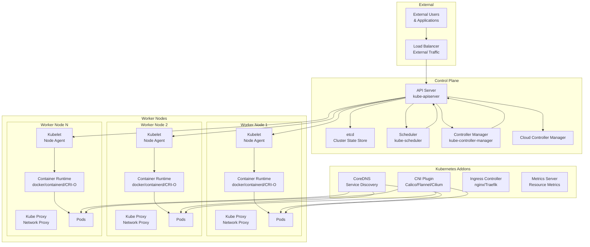
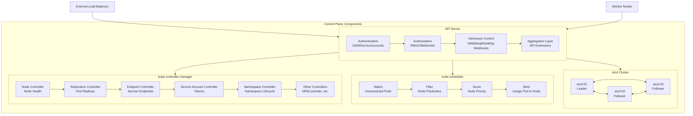
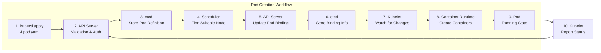
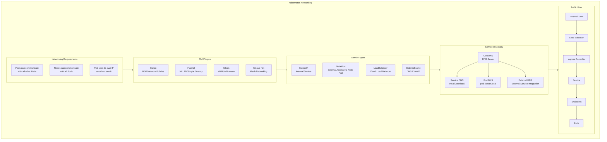
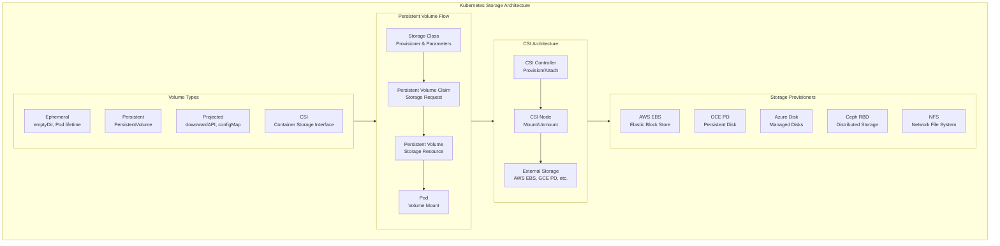
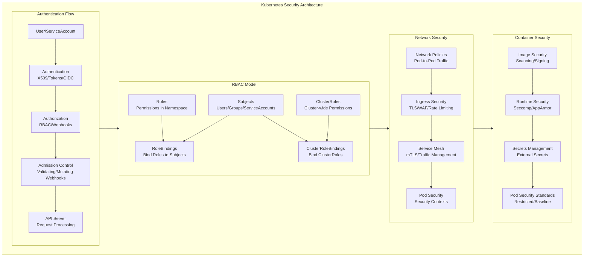
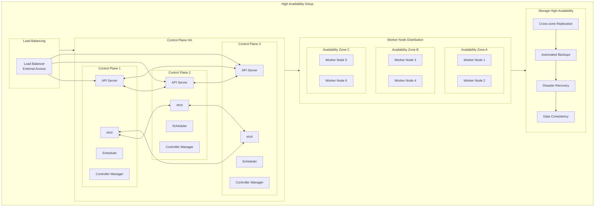
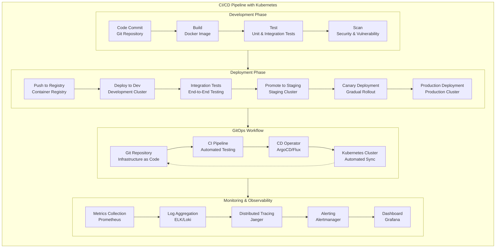
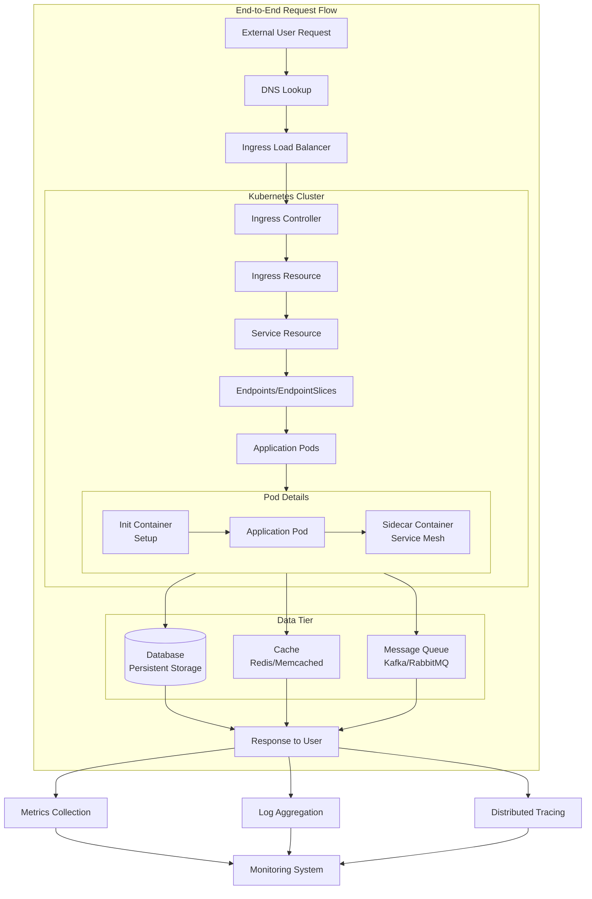

# Kubernetes Architecture: Mermaid Flowchart Diagrams

## Complete Kubernetes Architecture Overview

### 1. Main Kubernetes Cluster Architecture



### 2. Control Plane Detailed Architecture



### 3. Pod Creation Flow



### 4. Networking Architecture



### 5. Storage Architecture



### 6. Security Architecture



### 7. High Availability Architecture



### 8. Service Mesh Integration (Istio)

```mermaid
flowchart TD
    subgraph ServiceMesh[Service Mesh Architecture - Istio]
        subgraph ControlPlane[Istio Control Plane]
            ISTIOD[istiod<br/>Control Plane]
            PILOT[Pilot<br/>Service Discovery]
            GALLEY[Galley<br/>Configuration]
            CITADEL[Citadel<br/>Security]
            
            ISTIOD --> PILOT
            ISTIOD --> GALLEY
            ISTIOD --> CITADEL
        end

        subgraph DataPlane[Istio Data Plane]
            subgraph Namespace1[Application Namespace]
                POD1[Application Pod] --> ENVOY1[Envoy Sidecar<br/>Proxy]
                POD2[Application Pod] --> ENVOY2[Envoy Sidecar<br/>Proxy]
            end
            
            subgraph Namespace2[Application Namespace]
                POD3[Application Pod] --> ENVOY3[Envoy Sidecar<br/>Proxy]
                POD4[Application Pod] --> ENVOY4[Envoy Sidecar<br/>Proxy]
            end
        end

        subgraph TrafficManagement[Traffic Management]
            TM1[Virtual Services<br/>Routing Rules]
            TM2[Destination Rules<br/>Load Balancing]
            TM3[Service Entries<br/>External Services]
            TM4[Gateways<br/>Ingress/Egress]
            
            TM1 --> TM2 --> TM3 --> TM4
        end

        subgraph Security[Security Features]
            SEC1[mTLS<br/>Service-to-Service Encryption]
            SEC2[Authorization Policies<br/>Access Control]
            SEC3[Peer Authentication<br/>Identity Verification]
            SEC4[Request Authentication<br/>JWT Validation]
        end

        subgraph Observability[Observability]
            OBS1[Metrics<br/>Prometheus Integration]
            OBS2[Logging<br/>Structured Logs]
            OBS3[Tracing<br/>Distributed Tracing]
            OBS4[Visualization<br/>Kiali Dashboard]
        end
    end

    ControlPlane --> DataPlane
    DataPlane --> TrafficManagement
    TrafficManagement --> Security
    Security --> Observability
```



### 9. CI/CD Pipeline with Kubernetes



### 10. Complete End-to-End Request Flow



## Usage Instructions

These Mermaid diagrams can be used in:

1. **Documentation**: Technical documentation and architecture guides
2. **Presentations**: Technical presentations and training materials
3. **Confluence/Markdown**: Embedded in documentation platforms
4. **Design Discussions**: Visual aid for architecture discussions

### Key Features of These Diagrams:

- **Comprehensive Coverage**: All major Kubernetes components
- **Hierarchical Structure**: Clear parent-child relationships
- **Flow Visualization**: Step-by-step processes
- **Color Coding**: Logical grouping of components
- **Detailed Labels**: Clear component descriptions
- **Modular Design**: Individual focused diagrams

### To Use These Diagrams:

1. Copy the Mermaid code blocks
2. Paste into any Mermaid-compatible editor:
   - GitHub/GitLab Markdown
   - VS Code with Mermaid extension
   - Mermaid Live Editor
   - Confluence with Mermaid plugin
3. Customize as needed for your specific environment

These diagrams provide a complete visual representation of Kubernetes architecture that can be easily modified and extended for specific use cases.

# Kubernetes Architecture: Complete Diagram & Comprehensive Guide

## Table of Contents
1. [Kubernetes Architecture Overview](#kubernetes-architecture-overview)
2. [Control Plane Components](#control-plane-components)
3. [Node Components](#node-components)
4. [Cluster Networking](#cluster-networking)
5. [Storage Architecture](#storage-architecture)
6. [Addons & Extensions](#addons--extensions)
7. [Security Architecture](#security-architecture)
8. [High Availability Setup](#high-availability-setup)

## Kubernetes Architecture Overview

```
┌─────────────────────────────────────────────────────────────────────────────────┐
│                         KUBERNETES CLUSTER ARCHITECTURE                         │
├─────────────────────────────────────────────────────────────────────────────────┤
│                                                                                 │
│  ┌─────────────────────────────────────────────────────────────────────────────┐│
│  │                              CONTROL PLANE                                  ││
│  │                                                                             ││
│  │  ┌──────────────┐  ┌──────────────┐  ┌──────────────┐  ┌─────────────────┐  ││
│  │  │   API        │  │  SCHEDULER   │  │ CONTROLLER   │  │   CLOUD         │  ││
│  │  │   SERVER     │  │              │  │  MANAGER     │  │  CONTROLLER     │  ││
│  │  │              │  │              │  │              │  │   MANAGER       │  ││
│  │  │ • Kubernetes │  │ • Pod        │  │ • Node       │  │ • Node          │  ││
│  │  │   Gateway    │  │   Placement  │  │   Controller │  │   Controller    │  ││
│  │  │ • REST API   │  │ • Resource   │  │ • ReplicaSet │  │ • Route         │  ││
│  │  │ • AuthN/AuthZ│  │   Balancing  │  │   Controller │  │   Controller    │  ││
│  │  │ • Validation │  │ • Constraints│  │ • Service    │  │ • Service       │  ││
│  │  │ • Admission  │  │   Checking   │  │   Controller │  │   Controller    │  ││
│  │  │   Control    │  │              │  │ • etc.       │  │ • Volume        │  ││
│  │  └──────────────┘  └──────────────┘  └──────────────┘  └─────────────────┘  ││
│  │                                                                             ││
│  │  ┌─────────────────────────────────────────────────────────────────────────┐││
│  │  │                                ETCD                                     │││
│  │  │                                                                         │││
│  │  │ • Cluster State Store             ┌─────────────────┐                   │││
│  │  │ • Key-Value Database              │   LOAD BALANCER │                   │││
│  │  │ • Distributed & Consistent        │                 │                   │││
│  │  │ • Leader Election                 │ • External      │                   │││
│  │  │ • Watch Mechanism                 │   Access Point  │                   │││
│  │  │ • Backup & Recovery               │ • Traffic       │                   │││
│  │  │                                   │   Distribution  │                   │││
│  │  └───────────────────────────────────┴─────────────────┘                   │││
│  └─────────────────────────────────────────────────────────────────────────────┘│
│                                                                                 │
│  ┌─────────────────────────────────────────────────────────────────────────────┐│
│  │                               WORKER NODES                                  ││
│  │                                                                             ││
│  │  ┌───────────────────┐  ┌───────────────────┐  ┌───────────────────┐       ││
│  │  │   WORKER NODE 1   │  │   WORKER NODE 2   │  │   WORKER NODE N   │       ││
│  │  │                   │  │                   │  │                   │       ││
│  │  │  ┌─────────────┐  │  │  ┌─────────────┐  │  │  ┌─────────────┐  │       ││
│  │  │  │   KUBELET   │  │  │  │   KUBELET   │  │  │  │   KUBELET   │  │       ││
│  │  │  │             │  │  │  │             │  │  │  │             │  │       ││
│  │  │  │ • Node Agent│  │  │  │ • Node Agent│  │  │  │ • Node Agent│  │       ││
│  │  │  │ • Pod Life- │  │  │  │ • Pod Life- │  │  │  │ • Pod Life- │  │       ││
│  │  │  │   cycle     │  │  │  │   cycle     │  │  │  │   cycle     │  │       ││
│  │  │  │ • Container │  │  │  │ • Container │  │  │  │ • Container │  │       ││
│  │  │  │   Runtime   │  │  │  │   Runtime   │  │  │  │   Runtime   │  │       ││
│  │  │  │   Interface │  │  │  │   Interface │  │  │  │   Interface │  │       ││
│  │  │  └─────────────┘  │  │  │ └─────────────┘  │  │  └─────────────┘  │       ││
│  │  │                   │  │  │                   │  │                   │       ││
│  │  │  ┌─────────────┐  │  │  │  ┌─────────────┐  │  │  ┌─────────────┐  │       ││
│  │  │  │ KUBE-PROXY  │  │  │  │  │ KUBE-PROXY  │  │  │  │ KUBE-PROXY  │  │       ││
│  │  │  │             │  │  │  │  │             │  │  │  │             │  │       ││
│  │  │  │ • Network   │  │  │  │  │ • Network   │  │  │  │ • Network   │  │       ││
│  │  │  │   Proxy     │  │  │  │  │   Proxy     │  │  │  │   Proxy     │  │       ││
│  │  │  │ • Service   │  │  │  │  │ • Service   │  │  │  │ • Service   │  │       ││
│  │  │  │   Discovery │  │  │  │  │   Discovery │  │  │  │   Discovery │  │       ││
│  │  │  │ • Load      │  │  │  │  │ • Load      │  │  │  │ • Load      │  │       ││
│  │  │  │   Balancing │  │  │  │  │   Balancing │  │  │  │   Balancing │  │       ││
│  │  │  └─────────────┘  │  │  │  └─────────────┘  │  │  └─────────────┘  │       ││
│  │  │                   │  │  │                   │  │                   │       ││
│  │  │  ┌─────────────┐  │  │  │  ┌─────────────┐  │  │  ┌─────────────┐  │       ││
│  │  │  │ CONTAINER   │  │  │  │  │ CONTAINER   │  │  │  │ CONTAINER   │  │       ││
│  │  │  │  RUNTIME    │  │  │  │  │  RUNTIME    │  │  │  │  RUNTIME    │  │       ││
│  │  │  │             │  │  │  │  │             │  │  │  │             │  │       ││
│  │  │  │ • Docker    │  │  │  │  │ • containerd│  │  │  │ • CRI-O     │  │       ││
│  │  │  │ • containerd│  │  │  │  │ • CRI-O     │  │  │  │ • Docker    │  │       ││
│  │  │  │ • CRI-O     │  │  │  │  │ • Docker    │  │  │  │ • containerd│  │       ││
│  │  │  └─────────────┘  │  │  │  └─────────────┘  │  │  └─────────────┘  │       ││
│  │  └───────────────────┘  └───────────────────┘  └───────────────────┘       ││
│  └─────────────────────────────────────────────────────────────────────────────┘│
│                                                                                 │
│  ┌─────────────────────────────────────────────────────────────────────────────┐│
│  │                            NETWORKING & STORAGE                             ││
│  │                                                                             ││
│  │  ┌──────────────┐  ┌──────────────┐  ┌──────────────┐  ┌─────────────────┐  ││
│  │  │   CNI        │  │   CSI        │  │   INGRESS    │  │   SERVICE MESH  │  ││
│  │  │   PLUGIN     │  │   PLUGIN     │  │  CONTROLLER  │  │   (Istio,Linkerd│  ││
│  │  │              │  │              │  │              │  │                 │  ││
│  │  │ • Calico     │  │ • AWS EBS    │  │ • nginx      │  │ • Traffic       │  ││
│  │  │ • Flannel    │  │ • GCE PD     │  │ • Traefik    │  │   Management    │  ││
│  │  │ • Weave Net  │  │ • Ceph RBD   │  │ • HAProxy    │  │ • Security      │  ││
│  │  │ • Cilium     │  │ • NFS        │  │ • Istio      │  │ • Observability │  ││
│  │  │              │  │ • etc.       │  │ • etc.       │  │                 │  ││
│  │  └──────────────┘  └──────────────┘  └──────────────┘  └─────────────────┘  ││
│  └─────────────────────────────────────────────────────────────────────────────┘│
└─────────────────────────────────────────────────────────────────────────────────┘
```

## Control Plane Components

### Detailed Control Plane Architecture

```
┌─────────────────────────────────────────────────────────────────────────────────┐
│                              CONTROL PLANE DETAIL                               │
├─────────────────────────────────────────────────────────────────────────────────┤
│                                                                                 │
│  ┌─────────────────────────────────────────────────────────────────────────────┐│
│  │                               API SERVER                                    ││
│  │  ┌─────────────────┐  ┌─────────────────┐  ┌─────────────────┐             ││
│  │  │   AUTHENTICATION │  │  AUTHORIZATION  │  │   ADMISSION     │             ││
│  │  │                 │  │                 │  │    CONTROL      │             ││
│  │  │ • X509 Certs    │  │ • RBAC          │  │ • Validating    │             ││
│  │  │ • Bearer Tokens │  │ • Webhooks      │  │   Webhooks      │             ││
│  │  │ • Auth Proxy    │  │ • Node          │  │ • Mutating      │             ││
│  │  │ • Service       │  │   Authorization │  │   Webhooks      │             ││
│  │  │   Accounts      │  │ • ABAC          │  │ • Resource      │             ││
│  │  │ • OpenID        │  │                 │  │   Quotas        │             ││
│  │  │   Connect       │  │                 │  │ • Pod Security  │             ││
│  │  └─────────────────┘  └─────────────────┘  └─────────────────┘             ││
│  │                                                                             ││
│  │  ┌─────────────────────────────────────────────────────────────────────────┐││
│  │  │                               ETCD CLUSTER                              │││
│  │  │                                                                         │││
│  │  │  ┌─────────────┐      ┌─────────────┐      ┌─────────────┐              │││
│  │  │  │   ETCD-01   │◄────►│   ETCD-02   │◄────►│   ETCD-03   │              │││
│  │  │  │             │      │             │      │             │              │││
│  │  │  │ • Leader    │      │ • Follower  │      │ • Follower  │              │││
│  │  │  │ • Read/Write│      │ • Read Only │      │ • Read Only │              │││
│  │  │  │ • Consensus │      │ • Consensus │      │ • Consensus │              │││
│  │  │  └─────────────┘      └─────────────┘      └─────────────┘              │││
│  │  │                                                                         │││
│  │  │  • Raft Protocol              • Key Range Partitioning                  │││
│  │  │  • Leader Election            • Watch Streams                          │││
│  │  │  • Snapshotting               • Lease Management                       │││
│  │  │  • Backup/Restore             • Transaction Support                    │││
│  │  └─────────────────────────────────────────────────────────────────────────┘││
│  │                                                                             ││
│  │  ┌─────────────────────────────────────────────────────────────────────────┐││
│  │  │                            CONTROLLER MANAGER                           │││
│  │  │                                                                         │││
│  │  │  ┌─────────────┐  ┌─────────────┐  ┌─────────────┐  ┌─────────────┐     │││
│  │  │  │ NODE        │  │ REPLICA     │  │ ENDPOINT    │  │ SERVICE     │     │││
│  │  │  │ CONTROLLER  │  │ SET         │  │  SLICE      │  │  ACCOUNT    │     │││
│  │  │  │             │  │ CONTROLLER  │  │ CONTROLLER  │  │  CONTROLLER │     │││
│  │  │  │ • Monitor   │  │ • Ensure    │  │ • Maintain  │  │ • Create    │     │││
│  │  │  │   Node      │  │   desired   │  │   endpoints │  │   default   │     │││
│  │  │  │   health    │  │   replicas  │  │   for       │  │   service   │     │││
│  │  │  │ • Node      │  │ • Scale     │  │   services  │  │   accounts  │     │││
│  │  │  │   lifecycle │  │   up/down   │  │ • Service   │  │ • Manage    │     │││
│  │  │  │ • Cordon    │  │ • Pod       │  │   discovery │  │   tokens    │     │││
│  │  │  │   & Drain   │  │   creation  │  │             │  │             │     │││
│  │  │  └─────────────┘  └─────────────┘  └─────────────┘  └─────────────┘     │││
│  │  │                                                                         │││
│  │  │  ┌─────────────┐  ┌─────────────┐  ┌─────────────┐  ┌─────────────┐     │││
│  │  │  │ NAMESPACE   │  │ JOB         │  │ HPAController│  │ DAEMONSET   │     │││
│  │  │  │ CONTROLLER  │  │ CONTROLLER  │  │             │  │ CONTROLLER  │     │││
│  │  │  │             │  │             │  │ • Auto-scale│  │             │     │││
│  │  │  │ • Manage    │  │ • Create    │  │   pods based│  │ • Ensure    │     │││
│  │  │  │   namespace │  │   Pods for  │  │   on metrics│  │   one pod   │     │││
│  │  │  │   lifecycle │  │   Jobs      │  │ • Monitor   │  │   per node  │     │││
│  │  │  │ • Finalizers│  │ • Cleanup   │  │   CPU/Memory│  │ • Node      │     │││
│  │  │  │ • GC        │  │   completed │  │   usage     │  │   selection │     │││
│  │  │  │             │  │   Jobs      │  │             │  │             │     │││
│  │  │  └─────────────┘  └─────────────┘  └─────────────┘  └─────────────┘     │││
│  │  └─────────────────────────────────────────────────────────────────────────┘││
│  │                                                                             ││
│  │  ┌─────────────────────────────────────────────────────────────────────────┐││
│  │  │                                SCHEDULER                                 │││
│  │  │                                                                         │││
│  │  │  ┌─────────────┐              ┌─────────────┐              ┌─────────────┐││
│  │  │  │   FILTER    │─────────────►│   SCORE     │─────────────►│   BIND      │││
│  │  │  │   PHASE     │              │   PHASE     │              │   PHASE     │││
│  │  │  │             │              │             │              │             │││
│  │  │  │ • Node      │              │ • Assign    │              │ • Update    │││
│  │  │  │   Predicates│              │   scores to │              │   API       │││
│  │  │  │ • Resource  │              │   nodes     │              │   Server    │││
│  │  │  │   checks    │              │ • Custom    │              │ • Create    │││
│  │  │  │ • Affinity  │              │   scoring   │              │   binding   │││
│  │  │  │   rules     │              │   policies  │              │   object    │││
│  │  │  │ • Taints &  │              │ • Priority  │              │             │││
│  │  │  │   Tolerations│              │   functions │              │             │││
│  │  │  └─────────────┘              └─────────────┘              └─────────────┘││
│  │  │                                                                         │││
│  │  │  • Scheduling Queue           • Plugin Architecture                     │││
│  │  │  • Backoff Mechanism          • Extensible Framework                    │││
│  │  │  • Priority & Preemption      • Multiple Profiles                       │││
│  │  └─────────────────────────────────────────────────────────────────────────┘││
│  └─────────────────────────────────────────────────────────────────────────────┘│
└─────────────────────────────────────────────────────────────────────────────────┘
```

## Node Components

### Detailed Node Architecture

```
┌─────────────────────────────────────────────────────────────────────────────────┐
│                               WORKER NODE DETAIL                                │
├─────────────────────────────────────────────────────────────────────────────────┤
│                                                                                 │
│  ┌─────────────────────────────────────────────────────────────────────────────┐│
│  │                                KUBELET                                      ││
│  │                                                                             ││
│  │  ┌─────────────┐  ┌─────────────┐  ┌─────────────┐  ┌─────────────────────┐ ││
│  │  │ POD         │  │ NODE        │  │ VOLUME      │  │ CONTAINER           │ ││
│  │  │ MANAGEMENT  │  │ STATUS      │  │ MANAGEMENT  │  │ RUNTIME             │ ││
│  │  │             │  │ REPORTING   │  │             │  │ INTERFACE (CRI)     │ ││
│  │  │ • PodSpec   │  │ • Node      │  │ • Volume    │  │                     │ ││
│  │  │   from API  │  │   conditions│  │   mounting  │  │ • Image Pull        │ ││
│  │  │   Server    │  │ • Capacity  │  │ • Storage   │  │ • Container         │ ││
│  │  │ • Pod       │  │   reporting │  │   plugins   │  │   lifecycle         │ ││
│  │  │   lifecycle │  │ • Resource  │  │ • CSI       │  │ • Logging           │ ││
│  │  │ • Container │  │   allocation│  │   integration│  │ • Exec             │ ││
│  │  │   creation  │  │ • Heartbeat │  │             │  │ • Stats             │ ││
│  │  └─────────────┘  └─────────────┘  └─────────────┘  └─────────────────────┘ ││
│  │                                                                             ││
│  │  ┌─────────────────────────────────────────────────────────────────────────┐││
│  │  │                            CONTAINER RUNTIME                            │││
│  │  │                                                                         │││
│  │  │  ┌─────────────┐  ┌─────────────┐  ┌─────────────┐  ┌─────────────┐     │││
│  │  │  │   CONTAINER │  │    IMAGE    │  │   NETWORK   │  │   VOLUME    │     │││
│  │  │  │   MANAGEMENT│  │ MANAGEMENT  │  │  NAMESPACE  │  │ MANAGEMENT  │     │││
│  │  │  │             │  │             │  │             │  │             │     │││
│  │  │  │ • Create    │  │ • Pull      │  │ • Network   │  │ • Bind      │     │││
│  │  │  │   container │  │   images    │  │   namespace │  │   mounts    │     │││
│  │  │  │ • Start     │  │ • Remove    │  │   creation  │  │ • Volume    │     │││
│  │  │  │   container │  │   images    │  │ • Port      │  │   cleanup   │     │││
│  │  │  │ • Stop      │  │ • Image     │  │   mapping   │  │ • Storage   │     │││
│  │  │  │   container │  │   garbage   │  │ • DNS       │  │   quotas    │     │││
│  │  │  │ • Delete    │  │   collection│  │   config    │  │             │     │││
│  │  │  └─────────────┘  └─────────────┘  └─────────────┘  └─────────────┘     │││
│  │  └─────────────────────────────────────────────────────────────────────────┘││
│  │                                                                             ││
│  │  ┌─────────────────────────────────────────────────────────────────────────┐││
│  │  │                               KUBE-PROXY                                │││
│  │  │                                                                         │││
│  │  │  ┌─────────────┐  ┌─────────────┐  ┌─────────────┐  ┌─────────────┐     │││
│  │  │  │  SERVICE    │  │ ENDPOINT    │  │  LOAD       │  │  NETWORK    │     │││
│  │  │  │ DISCOVERY   │  │  UPDATES    │  │ BALANCING   │  │  RULES      │     │││
│  │  │  │             │  │             │  │             │  │ MANAGEMENT  │     │││
│  │  │  │ • Watch     │  │ • Monitor   │  │ • iptables  │  │ • iptables  │     │││
│  │  │  │   API       │  │   endpoint  │  │ • IPVS      │  │ • IPVS      │     │││
│  │  │  │   Server    │  │   changes   │  │ • userspace │  │ • userspace │     │││
│  │  │  │ • Service   │  │ • Update    │  │ • round-    │  │ • rule      │     │││
│  │  │  │   IP        │  │   load      │  │   robin     │  │   sync      │     │││
│  │  │  │   allocation│  │   balancing │  │ • session   │  │ • cleanup   │     │││
│  │  │  │             │  │   rules     │  │   affinity  │  │             │     │││
│  │  │  └─────────────┘  └─────────────┘  └─────────────┘  └─────────────┘     │││
│  │  └─────────────────────────────────────────────────────────────────────────┘││
│  │                                                                             ││
│  │  ┌─────────────────────────────────────────────────────────────────────────┐││
│  │  │                               POD LAYOUT                                 │││
│  │  │                                                                         │││
│  │  │  ┌─────────────────────────────────────────────────────────────────────┐ │││
│  │  │  │                              POD                                    │ │││
│  │  │  │  ┌─────────────┐  ┌─────────────┐  ┌─────────────────────────────┐  │ │││
│  │  │  │  │  CONTAINER  │  │  CONTAINER  │  │        INIT CONTAINER       │  │ │││
│  │  │  │  │             │  │             │  │                             │  │ │││
│  │  │  │  │ • App logic │  │ • Sidecar   │  │ • Setup tasks               │  │ │││
│  │  │  │  │ • Main      │  │ • Logging   │  │ • Pre-flight checks        │  │ │││
│  │  │  │  │   process   │  │ • Proxy     │  │ • Dependency setup         │  │ │││
│  │  │  │  │ • Health    │  │ • Monitoring│  │ • Volume permissions       │  │ │││
│  │  │  │  │   checks    │  │ • Service   │  │ • Network configuration    │  │ │││
│  │  │  │  │ • Metrics   │  │   mesh      │  │                             │  │ │││
│  │  │  │  └─────────────┘  └─────────────┘  └─────────────────────────────┘  │ │││
│  │  │  │                                                                     │ │││
│  │  │  │  ┌─────────────────────────────────────────────────────────────────┐ │ │││
│  │  │  │  │                         SHARED VOLUMES                          │ │ │││
│  │  │  │  │  ┌─────────────┐  ┌─────────────┐  ┌─────────────────────────┐  │ │ │││
│  │  │  │  │  │ EMPTYDIR    │  │ HOSTPATH    │  │ CONFIGMAP/SECRET        │  │ │ │││
│  │  │  │  │  │             │  │             │  │                         │  │ │ │││
│  │  │  │  │  │ • Temporary │  │ • Node      │  │ • Configuration         │  │ │ │││
│  │  │  │  │  │   storage   │  │   storage   │  │   data                  │  │ │ │││
│  │  │  │  │  │ • Shared    │  │ • Host      │  │ • Sensitive data        │  │ │ │││
│  │  │  │  │  │   data      │  │   access    │  │ • Environment           │  │ │ │││
│  │  │  │  │  │ • Cache     │  │ • System    │  │   variables             │  │ │ │││
│  │  │  │  │  │             │  │   tools     │  │                         │  │ │ │││
│  │  │  │  │  └─────────────┘  └─────────────┘  └─────────────────────────┘  │ │ │││
│  │  │  │  └─────────────────────────────────────────────────────────────────┘ │ │││
│  │  │  └─────────────────────────────────────────────────────────────────────┘ │││
│  │  └─────────────────────────────────────────────────────────────────────────┘││
│  └─────────────────────────────────────────────────────────────────────────────┘│
└─────────────────────────────────────────────────────────────────────────────────┘
```

## Cluster Networking

### Kubernetes Networking Model

```
┌─────────────────────────────────────────────────────────────────────────────────┐
│                          NETWORKING ARCHITECTURE                                │
├─────────────────────────────────────────────────────────────────────────────────┤
│                                                                                 │
│  ┌─────────────────────────────────────────────────────────────────────────────┐│
│  │                          NETWORKING REQUIREMENTS                            ││
│  │                                                                             ││
│  │  1. All Pods can communicate with all other Pods without NAT                ││
│  │  2. All Nodes can communicate with all Pods without NAT                     ││
│  │  3. IP address a Pod sees itself is the same others see                     ││
│  │                                                                             ││
│  └─────────────────────────────────────────────────────────────────────────────┘│
│                                                                                 │
│  ┌─────────────────────────────────────────────────────────────────────────────┐│
│  │                              SERVICE TYPES                                  ││
│  │                                                                             ││
│  │  ┌──────────────┐  ┌──────────────┐  ┌──────────────┐  ┌─────────────────┐  ││
│  │  │ CLUSTERIP    │  │ NODEPORT     │  │ LOADBALANCER │  │ EXTERNALNAME    │  ││
│  │  │              │  │              │  │              │  │                 │  ││
│  │  │ • Internal   │  • Expose on    │  • Cloud        │  • CNAME to        │  ││
│  │  │   service    │    node ports   │    load         │    external        │  ││
│  │  │ • Virtual IP │  • 30000-32767  │    balancer     │    service         │  ││
│  │  │ • Default    │  • External     │  • External     │  • DNS-level       │  ││
│  │  │   type       │    access       │    IP           │    redirection     │  ││
│  │  └──────────────┘  └──────────────┘  └──────────────┘  └─────────────────┘  ││
│  └─────────────────────────────────────────────────────────────────────────────┘│
│                                                                                 │
│  ┌─────────────────────────────────────────────────────────────────────────────┐│
│  │                            CNI PLUGINS OVERVIEW                             ││
│  │                                                                             ││
│  │  ┌──────────────┐  ┌──────────────┐  ┌──────────────┐  ┌─────────────────┐  ││
│  │  │   FLANNEL    │  │   CALICO     │  │   WEAVE      │  │    CILIUM       │  ││
│  │  │              │  │              │  │    NET       │  │                 │  ││
│  │  │ • Simple     │  • BGP-based    │  • Mesh         │  • eBPF-based      │  ││
│  │  │   overlay    │    networking   │    networking   │    networking      │  ││
│  │  │ • VXLAN      │  • Network      │  • No external  │  • Security        │  ││
│  │  │   backend    │    policies     │    database     │    policies        │  ││
│  │  │ • Kubernetes │  • Performance  │  • Simple       │  • API-aware       │  ││
│  │  │   native     │    focused      │    setup        │    security        │  ││
│  │  └──────────────┘  └──────────────┘  └──────────────┘  └─────────────────┘  ││
│  └─────────────────────────────────────────────────────────────────────────────┘│
│                                                                                 │
│  ┌─────────────────────────────────────────────────────────────────────────────┐│
│  │                         NETWORK TRAFFIC FLOW                                ││
│  │                                                                             ││
│  │  External User ─────► Load Balancer ─────► NodePort/Ingress ─────► Service  ││
│  │                                                                             ││
│  │  Service ─────► Endpoints ─────► Pod IPs ─────► Container Ports            ││
│  │                                                                             ││
│  │  Pod-to-Pod: Pod A ─────► CNI Plugin ─────► Pod B (cross-node)             ││
│  │                                                                             ││
│  └─────────────────────────────────────────────────────────────────────────────┘│
│                                                                                 │
│  ┌─────────────────────────────────────────────────────────────────────────────┐│
│  │                              DNS ARCHITECTURE                               ││
│  │                                                                             ││
│  │  ┌──────────────┐      ┌──────────────┐      ┌─────────────────────────────┐││
│  │  │   POD        │      │   CORE DNS   │      │   SERVICE DISCOVERY         │││
│  │  │              │      │              │      │                             │││
│  │  │ • resolv.conf│─────►│ • Plugin-    │─────►│ • Kubernetes service        │││
│  │  │  指向 CoreDNS │      │   based      │      │   discovery                │││
│  │  │ • Search     │      │ • Custom     │      │ • External service         │││
│  │  │   domains    │      │   records    │      │   integration              │││
│  │  │ • NDOTS: 5   │      │ • Forwarding │      │ • SRV records              │││
│  │  └──────────────┘      └──────────────┘      └─────────────────────────────┘││
│  │                                                                             ││
│  │  Service DNS: <service>.<namespace>.svc.cluster.local                       ││
│  │  Pod DNS: <pod-ip>.<namespace>.pod.cluster.local                           ││
│  │                                                                             ││
│  └─────────────────────────────────────────────────────────────────────────────┘│
└─────────────────────────────────────────────────────────────────────────────────┘
```

## Storage Architecture

### Kubernetes Storage Model

```
┌─────────────────────────────────────────────────────────────────────────────────┐
│                            STORAGE ARCHITECTURE                                 │
├─────────────────────────────────────────────────────────────────────────────────┤
│                                                                                 │
│  ┌─────────────────────────────────────────────────────────────────────────────┐│
│  │                          VOLUME LIFECYCLE                                   ││
│  │                                                                             ││
│  │  Provisioning ───► Binding ───► Mounting ───► Using ───► Unmounting ───► Reclaiming│
│  │                                                                             ││
│  └─────────────────────────────────────────────────────────────────────────────┘│
│                                                                                 │
│  ┌─────────────────────────────────────────────────────────────────────────────┐│
│  │                            VOLUME TYPES                                     ││
│  │                                                                             ││
│  │  ┌──────────────┐  ┌──────────────┐  ┌──────────────┐  ┌─────────────────┐  ││
│  │  │  EPHEMERAL   │  │   PERSISTENT │  │   PROJECTED  │  │   CSI/CSI       │  ││
│  │  │              │  │              │  │              │  │                 │  ││
│  │  │ • emptyDir   │  • Persistent   │  • downwardAPI  │  • Container       │  ││
│  │  │ • Pod        │    Volume       │  • configMap    │    Storage         │  ││
│  │  │   lifetime   │  • StorageClass │  • secret       │    Interface       │  ││
│  │  │ • Node       │  • PVC/PV       │  • serviceAcct  │  • External        │  ││
│  │  │   storage    │  • Dynamic      │    token        │    providers       │  ││
│  │  │              │    provisioning │                │  • Standardized     │  ││
│  │  └──────────────┘  └──────────────┘  └──────────────┘  └─────────────────┘  ││
│  └─────────────────────────────────────────────────────────────────────────────┘│
│                                                                                 │
│  ┌─────────────────────────────────────────────────────────────────────────────┐│
│  │                         PERSISTENT VOLUME FLOW                              ││
│  │                                                                             ││
│  │  ┌──────────────┐      ┌──────────────┐      ┌─────────────────────────────┐││
│  │  │  STORAGE     │      │ PERSISTENT   │      │ PERSISTENT VOLUME           │││
│  │  │   CLASS      │      │ VOLUME       │      │ CLAIM                       │││
│  │  │              │      │ CLAIM        │      │ BINDING                     │││
│  │  │ • Provisioner│      │ • Request    │      │ • 1:1 mapping               │││
│  │  │ • Parameters │      │   storage    │      │ • Access                    │││
│  │  │ • Reclaim    │      │ • Access     │      │   modes                     │││
│  │  │   policy     │      │   modes      │      │ • Volume                    │││
│  │  │ • Binding    │      │ • Storage    │      │   mounting                  │││
│  │  │   mode       │      │   class      │      │                             │││
│  │  └──────────────┘      └──────────────┘      └─────────────────────────────┘││
│  │                                                                             ││
│  │  ┌─────────────────────────────────────────────────────────────────────────┐││
│  │  │                          CSI ARCHITECTURE                               │││
│  │  │                                                                         │││
│  │  │  ┌─────────────┐      ┌─────────────┐      ┌───────────────────────────┐│││
│  │  │  │   CSI       │      │   CSI       │      │   EXTERNAL                ││││
│  │  │  │  CONTROLLER │      │   NODE      │      │   STORAGE                 ││││
│  │  │  │             │      │  PLUGIN     │      │   SYSTEM                  ││││
│  │  │  │ • Provision │      │ • Mount/    │      │                           ││││
│  │  │  │   volumes   │      │   unmount   │      │ • AWS EBS                 ││││
│  │  │  │ • Create/   │      │ • Node      │      │ • GCE PD                  ││││
│  │  │  │   delete    │      │   operations│      │ • Azure Disk              ││││
│  │  │  │ • Attach/   │      │ • Volume    │      │ • Ceph RBD                ││││
│  │  │  │   detach    │      │   stats     │      │ • NFS                     ││││
│  │  │  └─────────────┘      └─────────────┘      └───────────────────────────┘│││
│  │  └─────────────────────────────────────────────────────────────────────────┘││
│  └─────────────────────────────────────────────────────────────────────────────┘│
│                                                                                 │
│  ┌─────────────────────────────────────────────────────────────────────────────┐│
│  │                         STORAGE PROVISIONERS                                ││
│  │                                                                             ││
│  │  ┌──────────────┐  ┌──────────────┐  ┌──────────────┐  ┌─────────────────┐  ││
│  │  │   AWS EBS    │  │   GCE PD     │  │  AZURE DISK  │  │   CEPH/RBD      │  ││
│  │  │              │  │              │  │              │  │                 │  ││
│  │  │ • Block      │  • Regional    │  • Managed      │  • Distributed     │  ││
│  │  │   storage    │    disks       │    disks        │    block storage   │  ││
│  │  │ • AZ-bound   │  • Multi-zone  │  • Various SKUs │  • Shared storage  │  ││
│  │  │ • gp2/io1    │  • SSD/HDD     │  • Premium/Std  │  • ReadWriteMany  │  ││
│  │  │   volumes    │    options     │    disks        │    support         │  ││
│  │  └──────────────┘  └──────────────┘  └──────────────┘  └─────────────────┘  ││
│  └─────────────────────────────────────────────────────────────────────────────┘│
└─────────────────────────────────────────────────────────────────────────────────┘
```

## Addons & Extensions

### Kubernetes Addons Architecture

```
┌─────────────────────────────────────────────────────────────────────────────────┐
│                          ADDONS & EXTENSIONS                                    │
├─────────────────────────────────────────────────────────────────────────────────┤
│                                                                                 │
│  ┌─────────────────────────────────────────────────────────────────────────────┐│
│  │                           NETWORKING ADDONS                                 ││
│  │                                                                             ││
│  │  ┌──────────────┐  ┌──────────────┐  ┌──────────────┐  ┌─────────────────┐  ││
│  │  │   INGRESS    │  │   METALLB    │  │  SERVICE     │  │   ISTIO         │  ││
│  │  │ CONTROLLER   │  │              │  │   MESH       │  │                 │  ││
│  │  │              │  │ • Bare-metal │  │              │  • Envoy-based     │  ││
│  │  │ • nginx      │  │   Load       │  • Linkerd      │    service mesh    │  ││
│  │  │ • Traefik    │  │   Balancer   │  • Consul       │  • Traffic         │  ││
│  │  │ • HAProxy    │  │ • Layer 2/3  │    Connect      │    management      │  ││
│  │  │ • Ambassador │  │   mode       │  • AWS App      │  • Security        │  ││
│  │  │ • Kong       │  │ • BGP        │    Mesh         │    policies        │  ││
│  │  └──────────────┘  └──────────────┘  └──────────────┘  └─────────────────┘  ││
│  └─────────────────────────────────────────────────────────────────────────────┘│
│                                                                                 │
│  ┌─────────────────────────────────────────────────────────────────────────────┐│
│  │                          MONITORING ADDONS                                  ││
│  │                                                                             ││
│  │  ┌──────────────┐  ┌──────────────┐  ┌──────────────┐  ┌─────────────────┐  ││
│  │  │  PROMETHEUS  │  │   GRAFANA    │  │   ALERT      │  │   JAEGER        │  ││
│  │  │              │  │              │  │  MANAGER     │  │                 │  ││
│  │  │ • Metrics    │  • Dashboards   │  • Alerting     │  • Distributed     │  ││
│  │  │   collection │  • Visualization│  • Routing      │    tracing         │  ││
│  │  │ • Time-series│  • Multi-source │  • Notification │  • Microservices   │  ││
│  │  │   database   │    data         │  • Integration  │    monitoring      │  ││
│  │  │ • Querying   │                │  • Slack/Email  │  • Performance     │  ││
│  │  └──────────────┘  └──────────────┘  └──────────────┘  └─────────────────┘  ││
│  └─────────────────────────────────────────────────────────────────────────────┘│
│                                                                                 │
│  ┌─────────────────────────────────────────────────────────────────────────────┐│
│  │                           LOGGING ADDONS                                    ││
│  │                                                                             ││
│  │  ┌──────────────┐  ┌──────────────┐  ┌──────────────┐  ┌─────────────────┐  ││
│  │  │  FLUENTD     │  │  ELASTIC-    │  │   KIBANA     │  │   LOKI          │  ││
│  │  │              │  │   SEARCH     │  │              │  │                 │  ││
│  │  │ • Log        │  • Distributed  │  • Visualization│  • Log             │  ││
│  │  │   collection │    search       │  • Dashboarding │    aggregation     │  ││
│  │  │ • Log        │  • JSON         │  • Query        │  • Prometheus-     │  ││
│  │  │   routing    │    document     │    interface    │    compatible      │  ││
│  │  │ • Multiple   │    store        │  • Real-time    │  • Cost-effective  │  ││
│  │  │   outputs    │                │    analytics    │    storage         │  ││
│  │  └──────────────┘  └──────────────┘  └──────────────┘  └─────────────────┘  ││
│  └─────────────────────────────────────────────────────────────────────────────┘│
│                                                                                 │
│  ┌─────────────────────────────────────────────────────────────────────────────┐│
│  │                         SECURITY ADDONS                                     ││
│  │                                                                             ││
│  │  ┌──────────────┐  ┌──────────────┐  ┌──────────────┐  ┌─────────────────┐  ││
│  │  │  OPA/GATE-   │  │   FALCO      │  │  TRIVY       │  │   CERT-         │  ││
│  │  │   KEEPER     │  │              │  │              │  │   MANAGER       │  ││
│  │  │              │  │ • Runtime    │  • Vulnerability│  • Automatic       │  ││
│  │  │ • Policy     │  │   security   │    scanning     │    certificate     │  ││
│  │  │   engine     │  • Threat       │  • Container    │    management      │  ││
│  │  │ • Admission  │    detection    │    images       │  • Let's Encrypt   │  ││
│  │  │   control    │  • Kubernetes   │  • CI/CD        │    integration     │  ││
│  │  │ • Custom     │    aware        │    integration  │  • Renewal         │  ││
│  │  │   policies   │                │                │    automation       │  ││
│  │  └──────────────┘  └──────────────┘  └──────────────┘  └─────────────────┘  ││
│  └─────────────────────────────────────────────────────────────────────────────┘│
│                                                                                 │
│  ┌─────────────────────────────────────────────────────────────────────────────┐│
│  │                         STORAGE ADDONS                                      ││
│  │                                                                             ││
│  │  ┌──────────────┐  ┌──────────────┐  ┌──────────────┐  ┌─────────────────┐  ││
│  │  │  ROOK/CEPH   │  │  LONGHORN    │  │  VELERO       │  │   MINIO         │  ││
│  │  │              │  │              │  │              │  │                 │  ││
│  │  │ • Distributed│  • Cloud-native │  • Backup &     │  • S3-compatible   │  ││
│  │  │   storage    │    distributed  │    restore      │    object store    │  ││
│  │  │ • Block/File │    block storage│  • Disaster     │  • Kubernetes-     │  ││
│  │  │   object     │  • Replication  │    recovery     │    native          │  ││
│  │  │ • Kubernetes │  • Backup       │  • Migration    │  • Multi-tenant    │  ││
│  │  │   native     │    to S3        │  • Schedule     │    support         │  ││
│  │  └──────────────┘  └──────────────┘  └──────────────┘  └─────────────────┘  ││
│  └─────────────────────────────────────────────────────────────────────────────┘│
└─────────────────────────────────────────────────────────────────────────────────┘
```

## Security Architecture

### Kubernetes Security Layers

```
┌─────────────────────────────────────────────────────────────────────────────────┐
│                          SECURITY ARCHITECTURE                                  │
├─────────────────────────────────────────────────────────────────────────────────┤
│                                                                                 │
│  ┌─────────────────────────────────────────────────────────────────────────────┐│
│  │                           SECURITY LAYERS                                   ││
│  │                                                                             ││
│  │  ┌──────────────┐  ┌──────────────┐  ┌──────────────┐  ┌─────────────────┐  ││
│  │  │   CLUSTER    │  │    ETCD      │  │   NETWORK    │  │   APPLICATION   │  ││
│  │  │              │  │              │  │              │  │                 │  ││
│  │  │ • API Server │  • Encryption   │  • Network      │  • Container       │  ││
│  │  │   security   │    at rest      │    Policies     │    security        │  ││
│  │  │ • RBAC       │  • Access       │  • Service      │  • Image scanning  │  ││
│  │  │ • Admission  │    control      │    mesh         │  • Secrets         │  ││
│  │  │   controls   │  • Backup       │  • TLS/MTLS     │    management      │  ││
│  │  │ • Audit      │    security     │  • Ingress      │  • Pod security    │  ││
│  │  │   logging    │                │    security     │    standards        │  ││
│  │  └──────────────┘  └──────────────┘  └──────────────┘  └─────────────────┘  ││
│  └─────────────────────────────────────────────────────────────────────────────┘│
│                                                                                 │
│  ┌─────────────────────────────────────────────────────────────────────────────┐│
│  │                         AUTHENTICATION FLOW                                 ││
│  │                                                                             ││
│  │  User/ServiceAccount ───► Authentication ───► Authorization ───► Admission  ││
│  │                                                                             ││
│  │  ┌──────────────┐      ┌──────────────┐      ┌─────────────────────────────┐││
│  │  │   AUTHN      │      │   AUTHZ      │      │   ADMISSION                 │││
│  │  │              │      │              │      │                             │││
│  │  │ • X509 certs │      • RBAC         │      • Validating webhooks         │││
│  │  │ • Tokens     │      • Webhooks     │      • Mutating webhooks           │││
│  │  │ • OIDC       │      • Node         │      • Resource quotas             │││
│  │  │ • Webhooks   │        authorization│      • Pod security                │││
│  │  └──────────────┘      └──────────────┘      └─────────────────────────────┘││
│  └─────────────────────────────────────────────────────────────────────────────┘│
│                                                                                 │
│  ┌─────────────────────────────────────────────────────────────────────────────┐│
│  │                         NETWORK SECURITY                                    ││
│  │                                                                             ││
│  │  ┌──────────────┐  ┌──────────────┐  ┌──────────────┐  ┌─────────────────┐  ││
│  │  │  NAMESPACE   │  │   POD-TO-POD │  │   SERVICE    │  │   INGRESS       │  ││
│  │  │  ISOLATION   │  │   SECURITY   │  │   SECURITY   │  │   SECURITY      │  ││
│  │  │              │  │              │  │              │  │                 │  ││
│  │  │ • Network    │  • Network      │  • Service      │  • TLS termination │  ││
│  │  │   Policies   │    Policies     │    mesh         │  • WAF integration │  ││
│  │  │ • Label-based│  • mTLS between │  • Mutual TLS   │  • Rate limiting   │  ││
│  │  │   selection  │    pods         │  • Traffic      │  • Authentication  │  ││
│  │  │ • Default    │  • Encryption   │    encryption   │  • Authorization   │  ││
│  │  │   deny       │    in transit   │  • Access       │                    │  ││
│  │  └──────────────┘  └──────────────┘  └──────────────┘  └─────────────────┘  ││
│  └─────────────────────────────────────────────────────────────────────────────┘│
│                                                                                 │
│  ┌─────────────────────────────────────────────────────────────────────────────┐│
│  │                         CONTAINER SECURITY                                  ││
│  │                                                                             ││
│  │  ┌──────────────┐  ┌──────────────┐  ┌──────────────┐  ┌─────────────────┐  ││
│  │  │  IMAGE       │  │   RUNTIME    │  │   POD        │  │   SECRETS       │  ││
│  │  │  SECURITY    │  │   SECURITY   │  │   SECURITY   │  │   MANAGEMENT    │  ││
│  │  │              │  │              │  │              │  │                 │  ││
│  │  │ • Signed     │  • Seccomp      │  • Security     │  • External        │  ││
│  │  │   images     │    profiles     │    contexts     │    secrets         │  ││
│  │  │ • Scanning   │  • AppArmor     │  • Pod Security │  • Encryption      │  ││
│  │  │ • Trusted    │    profiles     │    Standards    │  • Rotation        │  ││
│  │  │   registries │  • SELinux      │  • Non-root     │  • Access control  │  ││
│  │  │ • Minimal    │    policies     │    users        │                    │  ││
│  │  │   base images│                │  • Read-only    │                    │  ││
│  │  └──────────────┘  └──────────────┘  └──────────────┘  └─────────────────┘  ││
│  └─────────────────────────────────────────────────────────────────────────────┘│
└─────────────────────────────────────────────────────────────────────────────────┘
```

## High Availability Setup

### High Availability Architecture

```
┌─────────────────────────────────────────────────────────────────────────────────┐
│                        HIGH AVAILABILITY SETUP                                 │
├─────────────────────────────────────────────────────────────────────────────────┤
│                                                                                 │
│  ┌─────────────────────────────────────────────────────────────────────────────┐│
│  │                         CONTROL PLANE HA                                    ││
│  │                                                                             ││
│  │  ┌──────────────┐      ┌──────────────┐      ┌─────────────────────────────┐││
│  │  │  CONTROL     │      │  CONTROL     │      │   CONTROL                   │││
│  │  │  PLANE 01    │      │  PLANE 02    │      │   PLANE 03                  │││
│  │  │              │      │              │      │                             │││
│  │  │ • API Server │      • API Server   │      • API Server                  │││
│  │  │ • Scheduler  │      • Scheduler    │      • Scheduler                   │││
│  │  │ • Controller │      • Controller   │      • Controller                  │││
│  │  │   Manager    │        Manager      │        Manager                     │││
│  │  │ • etcd       │      • etcd         │      • etcd                        │││
│  │  └──────────────┘      └──────────────┘      └─────────────────────────────┘││
│  │                                                                             ││
│  │  ┌─────────────────────────────────────────────────────────────────────────┐││
│  │  │                           LOAD BALANCER                                 │││
│  │  │                                                                         │││
│  │  │ • External traffic distribution                                          │││
│  │  │ • Health checks                                                         │││
│  │  │ • Failover handling                                                     │││
│  │  │ • SSL termination                                                       │││
│  │  └─────────────────────────────────────────────────────────────────────────┘││
│  └─────────────────────────────────────────────────────────────────────────────┘│
│                                                                                 │
│  ┌─────────────────────────────────────────────────────────────────────────────┐│
│  │                            ETCD CLUSTER HA                                  ││
│  │                                                                             ││
│  │  ┌──────────────┐      ┌──────────────┐      ┌─────────────────────────────┐││
│  │  │   ETCD-01    │◄────►│   ETCD-02    │◄────►│   ETCD-03                   │││
│  │  │              │      │              │      │                             │││
│  │  │ • Leader     │      • Follower     │      • Follower                    │││
│  │  │ • Read/Write │      • Read         │      • Read                        │││
│  │  │ • Consensus  │      • Consensus    │      • Consensus                   │││
│  │  │ • Backup     │      • Backup       │      • Backup                      │││
│  │  └──────────────┘      └──────────────┘      └─────────────────────────────┘││
│  │                                                                             ││
│  │  • Raft consensus algorithm                                                 ││
│  │  • Quorum-based voting                                                     ││
│  │  • Automatic leader election                                               ││
│  │  • Data replication                                                        ││
│  └─────────────────────────────────────────────────────────────────────────────┘│
│                                                                                 │
│  ┌─────────────────────────────────────────────────────────────────────────────┐│
│  │                         WORKER NODE DISTRIBUTION                           ││
│  │                                                                             ││
│  │  ┌──────────────┐  ┌──────────────┐  ┌──────────────┐  ┌─────────────────┐  ││
│  │  │  AVAILABILITY│  │  AVAILABILITY│  │  AVAILABILITY│  │   FAILOVER      │  ││
│  │  │   ZONE A     │  │   ZONE B     │  │   ZONE C     │  │   STRATEGY      │  ││
│  │  │              │  │              │  │              │  │                 │  ││
│  │  │ • Node 1     │  • Node 2      │  • Node 3      │  • Pod              │  ││
│  │  │ • Node 4     │  • Node 5      │  • Node 6      │    anti-affinity    │  ││
│  │  │ • App Pods   │  • App Pods    │  • App Pods    │  • Multi-zone       │  ││
│  │  │ • System     │  • System      │  • System      │    deployment       │  ││
│  │  │   Pods       │    Pods        │    Pods        │  • Health checks    │  ││
│  │  └──────────────┘  └──────────────┘  └──────────────┘  └─────────────────┘  ││
│  └─────────────────────────────────────────────────────────────────────────────┘│
│                                                                                 │
│  ┌─────────────────────────────────────────────────────────────────────────────┐│
│  │                         STORAGE HA STRATEGIES                               ││
│  │                                                                             ││
│  │  ┌──────────────┐  ┌──────────────┐  ┌──────────────┐  ┌─────────────────┐  ││
│  │  │  REPLICATION │  │   BACKUP     │  │  DISASTER    │  │   RECOVERY      │  ││
│  │  │              │  │              │  │   RECOVERY   │  │                 │  ││
│  │  │ • Cross-zone │  • Automated    │  • Multi-region │  • Point-in-time   │  ││
│  │  │   replication│    backups      │    deployment   │    recovery        │  ││
│  │  │ • Synchronous│  • Versioning   │  • Failover     │  • Data            │  ││
│  │  │   /async     │  • Retention    │    automation   │    consistency     │  ││
│  │  │ • Data       │    policies     │  • Geo-redundant│  • Testing         │  ││
│  │  │   consistency│                │    storage      │    procedures      │  ││
│  │  └──────────────┘  └──────────────┘  └──────────────┘  └─────────────────┘  ││
│  └─────────────────────────────────────────────────────────────────────────────┘│
└─────────────────────────────────────────────────────────────────────────────────┘
```

This comprehensive Kubernetes architecture diagram provides a complete view of all components, their interactions, and the overall structure of a Kubernetes cluster. The diagram covers:

1. **Control Plane**: API Server, etcd, Controller Manager, Scheduler
2. **Worker Nodes**: Kubelet, Container Runtime, Kube Proxy
3. **Networking**: CNI plugins, Service discovery, DNS
4. **Storage**: Volume types, CSI integration, Storage classes
5. **Addons**: Monitoring, logging, security, and storage extensions
6. **Security**: Multi-layered security architecture
7. **High Availability**: Fault-tolerant setup across multiple zones

Each component is detailed with its responsibilities and interactions, providing a complete understanding of Kubernetes cluster architecture.
