# Comprehensive Real-World Implementation Cloud Solution Design Architecture Guide

# Serverless Architecture: Comprehensive Implementation Guide

## 1. Serverless Architecture Complete Flow

```mermaid
flowchart TD
    subgraph ServerlessArchitecture[Serverless Architecture - End-to-End Flow]
        subgraph ClientLayer[Client Layer]
            CL1[Web Applications<br/>🌐<br/>React/Angular/Vue] --> CL2[Mobile Applications<br/>📱<br/>iOS/Android/React Native]
            CL2 --> CL3[IoT Devices<br/>📟<br/>MQTT/Sensors]
            CL3 --> CL4[API Clients<br/>🔌<br/>Third-party Integrations]
        end

        subgraph EdgeLayer[Edge & CDN Layer]
            EL1[CloudFront/CDN<br/>🚀<br/>Static Assets Cache] --> EL2[Route 53<br/>🌍<br/>DNS & Global Routing]
            EL2 --> EL3[WAF & Shield<br/>🛡️<br/>DDoS Protection]
            EL3 --> EL4[Lambda@Edge<br/>⚡<br/>Edge Computing]
        end

        subgraph APIGatewayLayer[API Gateway Layer]
            AG1[API Gateway<br/>🚪<br/>Request Routing] --> AG2[Cognito/Auth0<br/>🔐<br/>Authentication]
            AG2 --> AG3[API Keys & Usage Plans<br/>💳<br/>Rate Limiting]
            AG3 --> AG4[Request Validation<br/>✅<br/>Schema Enforcement]
        end

        subgraph ComputeLayer[Serverless Compute Layer]
            CC1[Lambda Functions<br/>λ<br/>Event-driven Compute] --> CC2[Step Functions<br/>🔄<br/>Workflow Orchestration]
            CC2 --> CC3[EventBridge<br/>🎯<br/>Event Bus]
            CC3 --> CC4[SQS/SNS<br/>📨<br/>Message Queuing]
        end

        subgraph DataLayer[Serverless Data Layer]
            DL1[DynamoDB<br/>🗄️<br/>NoSQL Database] --> DL2[Aurora Serverless<br/>🐬<br/>SQL Database]
            DL2 --> DL3[S3<br/>📦<br/>Object Storage]
            DL3 --> DL4[ElastiCache<br/>⚡<br/>In-memory Cache]
        end

        subgraph SecurityLayer[Security & Monitoring]
            SM1[IAM Roles & Policies<br/>👮<br/>Least Privilege] --> SM2[Secrets Manager<br/>🗝️<br/>Credential Management]
            SM2 --> SM3[CloudTrail<br/>📝<br/>Audit Logging]
            SM3 --> SM4[CloudWatch<br/>📊<br/>Monitoring & Alerts]
        end
    end

    ClientLayer --> EdgeLayer
    EdgeLayer --> APIGatewayLayer
    APIGatewayLayer --> ComputeLayer
    ComputeLayer --> DataLayer
    DataLayer --> SecurityLayer
    
    %% Security Integration
    APIGatewayLayer -.->|AuthN/AuthZ| SecurityLayer
    ComputeLayer -.->|IAM Roles| SecurityLayer
    DataLayer -.->|Encryption| SecurityLayer
```

## 2. Serverless Request Flow - Detailed Sequence


## 3. Serverless Security Architecture


## 4. Serverless Implementation Framework

```mermaid
flowchart TD
    subgraph ServerlessImplementation[Serverless Implementation Framework]
        subgraph DevelopmentPhase[Development Phase]
            DP1[Infrastructure as Code<br/>🏗️<br/>SAM/Serverless Framework] --> DP2[Local Development<br/>💻<br/>SAM CLI & Docker]
            DP2 --> DP3[Testing Strategy<br/>🧪<br/>Unit/Integration/E2E]
            DP3 --> DP4[CI/CD Pipeline<br/>⚙️<br/>GitHub Actions/CodePipeline]
        end

        subgraph DeploymentPhase[Deployment Phase]
            DEP1[Environment Strategy<br/>🌳<br/>Dev/Staging/Prod] --> DEP2[Canary Deployments<br/>🚶‍♂️<br/>Traffic Shifting]
            DEP2 --> DEP3[Versioning & Aliases<br/>🔀<br/>Safe Deployments]
            DEP3 --> DEP4[Rollback Strategy<br/>↩️<br/>Quick Recovery]
        end

        subgraph OperationsPhase[Operations Phase]
            OP1[Monitoring & Alerting<br/>📊<br/>Custom Metrics] --> OP2[Logging & Tracing<br/>🔍<br/>X-Ray Integration]
            OP2 --> OP3[Performance Optimization<br/>⚡<br/>Memory/Timeout Tuning]
            OP3 --> OP4[Cost Management<br/>💰<br/>Budget Alerts]
        end

        subgraph SecurityPhase[Security Phase]
            SP1[Security Scanning<br/>🔎<br/>SAST/DAST Tools] --> SP2[Compliance Checking<br/>📋<br/>CIS Benchmarks]
            SP2 --> SP3[Secret Detection<br/>🕵️<br/>Pre-commit Hooks]
            SP3 --> SP4[Vulnerability Management<br/>🐛<br/>Dependency Updates]
        end
    end

    DevelopmentPhase --> DeploymentPhase
    DeploymentPhase --> OperationsPhase
    OperationsPhase --> SecurityPhase
```



## Detailed Implementation Guide

### 1. Serverless Infrastructure as Code (IaC)

**AWS SAM Template Structure:**

```yaml
# template.yaml - Complete Serverless Application
AWSTemplateFormatVersion: '2010-09-09'
Transform: AWS::Serverless-2016-10-31

Globals:
  Function:
    Timeout: 30
    MemorySize: 512
    Runtime: python3.9
    Environment:
      Variables:
        LOG_LEVEL: INFO
        POWERTOOLS_SERVICE_NAME: order-service
    Tracing: Active
    Layers:
      - !Ref SecurityLayer

Parameters:
  Environment:
    Type: String
    AllowedValues: [dev, staging, prod]
    Default: dev

Resources:
  # Security Layer for Common Security Functions
  SecurityLayer:
    Type: AWS::Serverless::LayerVersion
    Properties:
      LayerName: !Sub ${Environment}-security-layer
      ContentUri: layers/security/
      CompatibleRuntimes:
        - python3.8
        - python3.9

  # API Gateway with Security Configuration
  OrderApi:
    Type: AWS::Serverless::Api
    Properties:
      StageName: !Ref Environment
      Cors: 
        AllowMethods: "'GET,POST,PUT,DELETE'"
        AllowHeaders: "'Content-Type,X-Amz-Date,Authorization,X-Api-Key'"
        AllowOrigin: "'*'"
      Auth:
        DefaultAuthorizer: CognitoAuthorizer
        Authorizers:
          CognitoAuthorizer:
            UserPoolArn: !GetAtt UserPool.Arn

  # Lambda Functions with Security Configuration
  ProcessOrderFunction:
    Type: AWS::Serverless::Function
    Properties:
      FunctionName: !Sub ${Environment}-process-order
      CodeUri: src/process_order/
      Handler: app.lambda_handler
      Policies:
        - DynamoDBCrudPolicy:
            TableName: !Ref OrdersTable
        - SecretsManagerReadWrite
        - SQSSendMessagePolicy:
            QueueName: !GetAttr NotificationQueue.QueueName
      Events:
        ProcessOrder:
          Type: Api
          Properties:
            RestApiId: !Ref OrderApi
            Path: /orders
            Method: post

  # Database with Encryption and Backup
  OrdersTable:
    Type: AWS::DynamoDB::Table
    Properties:
      TableName: !Sub ${Environment}-orders
      BillingMode: PAY_PER_REQUEST
      SSESpecification:
        SSEEnabled: true
      AttributeDefinitions:
        - AttributeName: orderId
          AttributeType: S
        - AttributeName: customerId
          AttributeType: S
      KeySchema:
        - AttributeName: orderId
          KeyType: HASH
      GlobalSecondaryIndexes:
        - IndexName: customerId-index
          KeySchema:
            - AttributeName: customerId
              KeyType: HASH
          Projection:
            ProjectionType: ALL

  # Security Resources
  UserPool:
    Type: AWS::Cognito::UserPool
    Properties:
      UserPoolName: !Sub ${Environment}-user-pool
      Policies:
        PasswordPolicy:
          MinimumLength: 12
          RequireUppercase: true
          RequireLowercase: true
          RequireNumbers: true
          RequireSymbols: true
      MfaConfiguration: OPTIONAL
      SoftwareTokenMfaConfiguration:
        Enabled: true

Outputs:
  ApiUrl:
    Description: "API Gateway URL"
    Value: !Sub "https://${OrderApi}.execute-api.${AWS::Region}.amazonaws.com/${Environment}"
  UserPoolId:
    Description: "Cognito User Pool ID"
    Value: !Ref UserPool
```

### 2. Security Controls Implementation

**Lambda Security Layer Code:**

```python
# layers/security/python/security_layer.py
import os
import json
import boto3
from aws_lambda_powertools import Logger, Tracer, Metrics
from aws_lambda_powertools.metrics import MetricUnit
from botocore.exceptions import ClientError
import jwt
from cryptography.hazmat.primitives import serialization
from cryptography.hazmat.backends import default_backend

# Initialize Powertools
logger = Logger()
tracer = Tracer()
metrics = Metrics()

class SecurityLayer:
    def __init__(self):
        self.secrets_client = boto3.client('secretsmanager')
        self.kms_client = boto3.client('kms')
        
    @tracer.capture_method
    def validate_jwt_token(self, token):
        """Validate JWT token with Cognito"""
        try:
            # Get JWT keys from Cognito
            jwks_url = f"https://cognito-idp.{os.environ['AWS_REGION']}.amazonaws.com/{os.environ['USER_POOL_ID']}/.well-known/jwks.json"
            jwks_client = jwt.PyJWKClient(jwks_url)
            signing_key = jwks_client.get_signing_key_from_jwt(token)
            
            # Decode and validate token
            decoded = jwt.decode(
                token,
                signing_key.key,
                algorithms=["RS256"],
                audience=os.environ['APP_CLIENT_ID']
            )
            
            logger.info("JWT token validated successfully")
            return decoded
            
        except jwt.InvalidTokenError as e:
            logger.error(f"Invalid JWT token: {str(e)}")
            raise SecurityException("Invalid authentication token")
    
    @tracer.capture_method
    def get_secret(self, secret_name):
        """Retrieve secrets from AWS Secrets Manager"""
        try:
            response = self.secrets_client.get_secret_value(SecretId=secret_name)
            
            if 'SecretString' in response:
                secret = response['SecretString']
                return json.loads(secret) if secret.startswith('{') else secret
            else:
                decoded_binary_secret = base64.b64decode(response['SecretBinary'])
                return decoded_binary_secret
                
        except ClientError as e:
            logger.error(f"Error retrieving secret: {str(e)}")
            raise SecurityException(f"Failed to retrieve secret: {secret_name}")
    
    @tracer.capture_method
    def encrypt_data(self, plaintext, key_id):
        """Encrypt sensitive data using KMS"""
        try:
            response = self.kms_client.encrypt(
                KeyId=key_id,
                Plaintext=plaintext.encode('utf-8')
            )
            return base64.b64encode(response['CiphertextBlob']).decode('utf-8')
            
        except ClientError as e:
            logger.error(f"Encryption failed: {str(e)}")
            raise SecurityException("Data encryption failed")
    
    @tracer.capture_method
    def validate_input(self, event, schema):
        """Validate input against JSON schema"""
        try:
            jsonschema.validate(instance=event, schema=schema)
            logger.info("Input validation successful")
        except jsonschema.ValidationError as e:
            logger.error(f"Input validation failed: {str(e)}")
            raise SecurityException(f"Invalid input: {e.message}")

class SecurityException(Exception):
    """Custom security exception"""
    pass

# Security decorators
def require_auth(func):
    """Decorator to require JWT authentication"""
    @functools.wraps(func)
    def wrapper(event, context):
        # Extract token from headers
        auth_header = event.get('headers', {}).get('Authorization', '')
        if not auth_header.startswith('Bearer '):
            raise SecurityException("Missing or invalid authorization header")
        
        token = auth_header[7:]  # Remove 'Bearer ' prefix
        security = SecurityLayer()
        user_info = security.validate_jwt_token(token)
        
        # Add user info to event
        event['user'] = user_info
        return func(event, context)
    return wrapper

def validate_schema(schema):
    """Decorator to validate input schema"""
    def decorator(func):
        @functools.wraps(func)
        def wrapper(event, context):
            security = SecurityLayer()
            security.validate_input(event, schema)
            return func(event, context)
        return wrapper
    return decorator
```

### 3. Serverless Application Code

**Lambda Function with Security Controls:**

```python
# src/process_order/app.py
import os
import json
import boto3
from datetime import datetime
from decimal import Decimal
from security_layer import require_auth, validate_schema, SecurityLayer

# Initialize AWS services
dynamodb = boto3.resource('dynamodb')
table = dynamodb.Table(os.environ['ORDERS_TABLE'])
security = SecurityLayer()

# Input validation schema
ORDER_SCHEMA = {
    "type": "object",
    "required": ["productId", "quantity", "customerEmail"],
    "properties": {
        "productId": {"type": "string", "pattern": "^[a-zA-Z0-9-]+$"},
        "quantity": {"type": "integer", "minimum": 1, "maximum": 100},
        "customerEmail": {"type": "string", "format": "email"},
        "specialInstructions": {"type": "string", "maxLength": 500}
    }
}

@require_auth
@validate_schema(ORDER_SCHEMA)
def lambda_handler(event, context):
    """
    Process order with comprehensive security controls
    """
    try:
        # Extract user info from authenticated request
        user_id = event['user']['sub']
        user_email = event['user']['email']
        
        # Get request body
        body = json.loads(event['body']) if isinstance(event['body'], str) else event['body']
        
        # Generate order ID
        order_id = f"ORD-{datetime.utcnow().strftime('%Y%m%d-%H%M%S')}-{user_id[:8]}"
        
        # Get product details from database
        product_details = get_product_details(body['productId'])
        
        # Calculate total price
        total_price = calculate_total_price(product_details, body['quantity'])
        
        # Create order record
        order = create_order_record(
            order_id=order_id,
            user_id=user_id,
            user_email=user_email,
            product_details=product_details,
            quantity=body['quantity'],
            total_price=total_price,
            special_instructions=body.get('specialInstructions')
        )
        
        # Send notification
        send_order_notification(order)
        
        # Log successful order
        security.logger.structure_logs(append=True, orderId=order_id, amount=total_price)
        security.metrics.add_metric(name="OrdersProcessed", unit=MetricUnit.Count, value=1)
        
        return {
            'statusCode': 200,
            'headers': {
                'Content-Type': 'application/json',
                'Access-Control-Allow-Origin': '*'
            },
            'body': json.dumps({
                'orderId': order_id,
                'status': 'processed',
                'totalAmount': total_price,
                'estimatedDelivery': order['estimatedDelivery']
            })
        }
        
    except SecurityException as e:
        return error_response(403, str(e))
    except Exception as e:
        security.logger.error(f"Order processing failed: {str(e)}")
        return error_response(500, "Internal server error")

def get_product_details(product_id):
    """Retrieve product details with caching"""
    # Implementation for product lookup
    pass

def calculate_total_price(product, quantity):
    """Calculate total price with tax"""
    # Implementation for price calculation
    pass

def create_order_record(order_id, user_id, user_email, product_details, quantity, total_price, special_instructions):
    """Create order record in DynamoDB"""
    order_data = {
        'orderId': order_id,
        'userId': user_id,
        'userEmail': user_email,
        'productId': product_details['productId'],
        'productName': product_details['name'],
        'quantity': quantity,
        'unitPrice': Decimal(str(product_details['price'])),
        'totalPrice': Decimal(str(total_price)),
        'status': 'PROCESSING',
        'createdAt': datetime.utcnow().isoformat(),
        'estimatedDelivery': calculate_delivery_date()
    }
    
    if special_instructions:
        order_data['specialInstructions'] = special_instructions
    
    # Encrypt sensitive data
    if 'paymentToken' in product_details:
        order_data['encryptedPaymentToken'] = security.encrypt_data(
            product_details['paymentToken'],
            os.environ['KMS_KEY_ID']
        )
    
    table.put_item(Item=order_data)
    return order_data

def send_order_notification(order):
    """Send order notification via SNS"""
    sns_client = boto3.client('sns')
    
    notification_message = {
        'orderId': order['orderId'],
        'customerEmail': order['userEmail'],
        'productName': order['productName'],
        'totalAmount': float(order['totalPrice']),
        'estimatedDelivery': order['estimatedDelivery']
    }
    
    sns_client.publish(
        TopicArn=os.environ['NOTIFICATION_TOPIC_ARN'],
        Message=json.dumps(notification_message),
        MessageStructure='json'
    )

def error_response(status_code, message):
    """Standard error response format"""
    return {
        'statusCode': status_code,
        'headers': {
            'Content-Type': 'application/json',
            'Access-Control-Allow-Origin': '*'
        },
        'body': json.dumps({'error': message})
    }
```

### 4. CI/CD Pipeline with Security

**GitHub Actions Workflow:**

```yaml
# .github/workflows/serverless-deploy.yml
name: Serverless Deployment Pipeline

on:
  push:
    branches: [main, develop]
  pull_request:
    branches: [main]

env:
  AWS_REGION: us-east-1
  NODE_VERSION: '18.x'

jobs:
  security-scan:
    name: Security Scanning
    runs-on: ubuntu-latest
    steps:
      - uses: actions/checkout@v3
      
      - name: Run SAST Scan
        uses: shiftleftscan/scan-action@master
        with:
          output: reports
          type: python
      
      - name: Dependency Vulnerability Scan
        run: |
          pip install safety
          safety check --json --output reports/dependency-scan.json
      
      - name: Secret Detection
        uses: aquasecurity/trivy-action@master
        with:
          scan-type: 'fs'
          scan-ref: '.'
          format: 'sarif'
          output: 'reports/secret-scan.sarif'

  test:
    name: Test Application
    runs-on: ubuntu-latest
    needs: security-scan
    steps:
      - uses: actions/checkout@v3
      
      - name: Setup Python
        uses: actions/setup-python@v4
        with:
          python-version: '3.9'
      
      - name: Install Dependencies
        run: |
          pip install -r requirements.txt
          pip install -r requirements-test.txt
      
      - name: Run Unit Tests
        run: |
          python -m pytest tests/unit/ -v --cov=src --cov-report=xml
      
      - name: Run Integration Tests
        run: |
          python -m pytest tests/integration/ -v
        env:
          AWS_ACCESS_KEY_ID: ${{ secrets.TEST_AWS_ACCESS_KEY_ID }}
          AWS_SECRET_ACCESS_KEY: ${{ secrets.TEST_AWS_SECRET_ACCESS_KEY }}

  deploy:
    name: Deploy to AWS
    runs-on: ubuntu-latest
    needs: test
    if: github.ref == 'refs/heads/main'
    
    steps:
      - uses: actions/checkout@v3
      
      - name: Configure AWS Credentials
        uses: aws-actions/configure-aws-credentials@v1
        with:
          aws-access-key-id: ${{ secrets.AWS_ACCESS_KEY_ID }}
          aws-secret-access-key: ${{ secrets.AWS_SECRET_ACCESS_KEY }}
          aws-region: ${{ env.AWS_REGION }}
      
      - name: Install AWS SAM
        run: |
          pip install aws-sam-cli
      
      - name: SAM Build
        run: sam build
      
      - name: SAM Deploy
        run: |
          sam deploy \
            --stack-name order-service-prod \
            --s3-bucket ${{ secrets.S3_DEPLOY_BUCKET }} \
            --capabilities CAPABILITY_IAM CAPABILITY_AUTO_EXPAND \
            --no-fail-on-empty-changeset \
            --parameter-overrides Environment=prod
      
      - name: Run Security Tests
        run: |
          pip install aws-security-checker
          aws-security-checker --template .aws-sam/build/template.yaml
```

### 5. Monitoring and Observability

**CloudWatch Dashboard Configuration:**

```yaml
# monitoring/dashboard.yaml
AWSTemplateFormatVersion: '2010-09-09'
Resources:
  ServerlessDashboard:
    Type: AWS::CloudWatch::Dashboard
    Properties:
      DashboardName: !Sub ${Environment}-serverless-monitoring
      DashboardBody: |
        {
          "widgets": [
            {
              "type": "metric",
              "x": 0,
              "y": 0,
              "width": 12,
              "height": 6,
              "properties": {
                "metrics": [
                  [ "AWS/Lambda", "Invocations", "FunctionName", "process-order" ],
                  [ ".", "Errors", ".", "." ],
                  [ ".", "Throttles", ".", "." ],
                  [ ".", "Duration", ".", "." ]
                ],
                "view": "timeSeries",
                "stacked": false,
                "region": "us-east-1",
                "title": "Lambda Performance",
                "period": 300
              }
            },
            {
              "type": "metric",
              "x": 12,
              "y": 0,
              "width": 12,
              "height": 6,
              "properties": {
                "metrics": [
                  [ "AWS/ApiGateway", "Count", "ApiName", "order-api" ],
                  [ ".", "4XXError", ".", "." ],
                  [ ".", "5XXError", ".", "." ],
                  [ ".", "Latency", ".", "." ]
                ],
                "view": "timeSeries",
                "stacked": false,
                "region": "us-east-1",
                "title": "API Gateway Metrics"
              }
            },
            {
              "type": "log",
              "x": 0,
              "y": 6,
              "width": 24,
              "height": 6,
              "properties": {
                "query": "SOURCE '/aws/lambda/process-order' | filter @message like /ERROR/",
                "region": "us-east-1",
                "title": "Lambda Error Logs",
                "view": "table"
              }
            }
          ]
        }
```

## Key Security Considerations

### 1. **IAM Least Privilege**
```yaml
# iam-policies.yaml
LambdaExecutionPolicy:
  Type: AWS::IAM::Policy
  Properties:
    PolicyName: lambda-least-privilege
    PolicyDocument:
      Version: '2012-10-17'
      Statement:
        - Effect: Allow
          Action:
            - dynamodb:GetItem
            - dynamodb:PutItem
            - dynamodb:UpdateItem
            - dynamodb:Query
          Resource: !GetAtt OrdersTable.Arn
        - Effect: Allow
          Action:
            - secretsmanager:GetSecretValue
          Resource: !Sub "arn:aws:secretsmanager:${AWS::Region}:${AWS::AccountId}:secret:order-service/*"
        - Effect: Allow
          Action:
            - kms:Decrypt
            - kms:GenerateDataKey
          Resource: !Sub "arn:aws:kms:${AWS::Region}:${AWS::AccountId}:key/*"
```

### 2. **Environment Configuration**
```python
# config.py
import os
from typing import Optional

class Config:
    """Application configuration with security defaults"""
    
    # Security Settings
    JWT_ALGORITHM = os.getenv('JWT_ALGORITHM', 'RS256')
    TOKEN_EXPIRY = int(os.getenv('TOKEN_EXPIRY', '3600'))  # 1 hour
    
    # Database Settings
    DYNAMODB_TABLE = os.getenv('ORDERS_TABLE', 'orders')
    
    # Encryption Settings
    KMS_KEY_ID = os.getenv('KMS_KEY_ID')
    
    # Monitoring
    LOG_LEVEL = os.getenv('LOG_LEVEL', 'INFO')
    POWERTOOLS_METRICS_NAMESPACE = os.getenv('POWERTOOLS_METRICS_NAMESPACE', 'OrderService')
    
    @classmethod
    def validate_config(cls):
        """Validate required configuration"""
        required_vars = ['ORDERS_TABLE', 'USER_POOL_ID', 'APP_CLIENT_ID']
        missing = [var for var in required_vars if not os.getenv(var)]
        
        if missing:
            raise ValueError(f"Missing required environment variables: {missing}")
```

### 3. **Reference Frameworks Used**

- **AWS Well-Architected Framework** - For architectural best practices
- **OWASP Serverless Top 10** - For application security
- **NIST Cybersecurity Framework** - For security controls
- **CIS AWS Benchmarks** - For infrastructure security
- **AWS Serverless Application Model (SAM)** - For IaC
- **AWS Cloud Development Kit (CDK)** - For programmable infrastructure

This comprehensive serverless architecture provides end-to-end security, scalability, and maintainability while following industry best practices and frameworks.

# Comprehensive Cloud Services Solution Architecture


## 1. Cloud Services Solution Architecture


### Real-World Cloud Architecture Implementation

**Multi-Cloud Reference Architecture:**

```yaml
# cloud-architecture.yaml
Cloud_Solution_Design:
  Business_Requirements:
    scalability: "Handle 10x traffic spikes"
    availability: "99.95% SLA"
    compliance: ["GDPR", "HIPAA", "SOC2"]
    budget: "$50k/month max"

  Cloud_Strategy:
    primary_provider: "AWS"
    secondary_provider: "Azure"
    multi_cloud_rationale: "Risk mitigation & best-of-breed services"

  Data_Architecture:
    database_strategy:
      relational: "Amazon RDS PostgreSQL"
      nosql: "Amazon DynamoDB for high-velocity data"
      data_warehouse: "Snowflake for analytics"
      caching: "Amazon ElastiCache Redis"
    
    data_governance:
      classification: "Automated data classification"
      encryption: "AES-256 at rest, TLS 1.3 in transit"
      backup: "Cross-region automated backups"
      retention: "7 years for compliance data"

  Application_Architecture:
    microservices:
      api_gateway: "Amazon API Gateway"
      service_mesh: "AWS App Mesh"
      containerization: "Amazon EKS with Kubernetes"
      serverless: "AWS Lambda for event-driven functions"
    
    integration_patterns:
      synchronous: "REST APIs with OpenAPI specs"
      asynchronous: "Event-driven with Amazon EventBridge"
      batch_processing: "AWS Batch for large datasets"

  Security_Architecture:
    identity_management:
      iam: "AWS IAM with least privilege"
      mfa: "Enforced for all users"
      sso: "Azure AD integration"
    
    network_security:
      vpc_design: "Multi-AZ with public/private subnets"
      waf: "AWS WAF with OWASP rules"
      ddos_protection: "AWS Shield Advanced"
```

**Cloud Cost Optimization Framework:**

```python
# cloud-cost-optimizer.py
class CloudCostOptimizer:
    def __init__(self):
        self.cost_centers = self.define_cost_centers()
        self.optimization_strategies = self.define_strategies()
    
    def define_cost_centers(self):
        """Define cloud cost centers for accountability"""
        return {
            'compute': {
                'ec2_instances': 'Right-size instances',
                'lambda_functions': 'Optimize memory and timeout',
                'eks_clusters': 'Use spot instances for non-critical'
            },
            'storage': {
                's3_storage': 'Implement lifecycle policies',
                'ebs_volumes': 'Use gp3 instead of gp2',
                'rds_storage': 'Enable storage autoscaling'
            },
            'data_transfer': {
                'inter_az': 'Minimize cross-AZ traffic',
                'internet_egress': 'Use CloudFront for caching',
                'cross_region': 'Optimize replication'
            }
        }
    
    def calculate_savings_opportunities(self, usage_data):
        """Identify cost savings opportunities"""
        savings = {}
        
        # Compute optimization
        over_provisioned = self.identify_over_provisioned_instances(usage_data)
        if over_provisioned:
            savings['compute'] = {
                'recommendation': 'Right-size EC2 instances',
                'estimated_savings': self.calculate_instance_savings(over_provisioned),
                'implementation_effort': 'Medium',
                'risk': 'Low'
            }
        
        # Storage optimization
        old_snapshots = self.identify_old_snapshots()
        if old_snapshots:
            savings['storage'] = {
                'recommendation': 'Delete snapshots older than 90 days',
                'estimated_savings': self.calculate_snapshot_savings(old_snapshots),
                'implementation_effort': 'Low',
                'risk': 'Low'
            }
        
        return savings
    
    def generate_optimization_plan(self, savings_opportunities):
        """Generate prioritized optimization plan"""
        plan = {
            'quick_wins': [],
            'medium_term': [],
            'long_term': []
        }
        
        for category, opportunity in savings_opportunities.items():
            if opportunity['implementation_effort'] == 'Low':
                plan['quick_wins'].append(opportunity)
            elif opportunity['implementation_effort'] == 'Medium':
                plan['medium_term'].append(opportunity)
            else:
                plan['long_term'].append(opportunity)
        
        return plan

# Usage example
optimizer = CloudCostOptimizer()
usage_data = get_cloud_usage_data()
savings = optimizer.calculate_savings_opportunities(usage_data)
plan = optimizer.generate_optimization_plan(savings)
```

## 2. Security Architecture Design


### Zero Trust Architecture Implementation

**Zero Trust Reference Architecture:**

```yaml
# zero-trust-architecture.yaml
Zero_Trust_Framework:
  Core_Principles:
    - "Never trust, always verify"
    - "Assume breach"
    - "Verify explicitly"
    - "Use least privilege access"

  Identity_Centric_Security:
    identity_verification:
      mfa_requirement: "All users and services"
      device_health_check: "Compliance validation pre-access"
      behavioral_analytics: "Continuous authentication"
    
    access_control:
      role_based: "RBAC with least privilege"
      attribute_based: "ABAC for dynamic policies"
      just_in_time: "JIT access for privileged accounts"

  Network_Security:
    microsegmentation:
      application_tiers: "Separate web, app, database layers"
      east_west_protection: "Service-to-service authentication"
      zero_trust_network: "Software-defined perimeters"
    
    network_policies:
      default_deny: "Block all traffic by default"
      explicit_allow: "Only approved communication paths"
      continuous_monitoring: "Real-time traffic analysis"

  Data_Protection:
    classification_automation:
      sensitive_data_discovery: "Automated scanning and classification"
      encryption_strategy: "Always encrypt in transit and at rest"
      access_monitoring: "Real-time data access analytics"
    
    data_governance:
      retention_policies: "Automated data lifecycle management"
      rights_management: "Digital rights management for sensitive files"
      backup_encryption: "Encrypted backups with separate keys"

  Implementation_Phases:
    phase_1:
      focus: "Identity foundation and device trust"
      timeline: "Months 1-3"
      deliverables: ["MFA enforcement", "Device compliance", "Basic RBAC"]
    
    phase_2:
      focus: "Application and data protection"
      timeline: "Months 4-6"
      deliverables: ["App segmentation", "Data classification", "DLP implementation"]
    
    phase_3:
      focus: "Advanced analytics and automation"
      timeline: "Months 7-12"
      deliverables: ["Behavioral analytics", "Automated response", "Threat hunting"]
```

**Security Control Validation Framework:**

```python
# security-control-validator.py
class SecurityControlValidator:
    def __init__(self):
        self.control_framework = self.load_control_framework()
        self.test_cases = self.generate_test_cases()
    
    def load_control_framework(self):
        """Load security control framework (NIST, CIS, etc.)"""
        return {
            'cis_controls': {
                'inventory': 'CIS Control 1: Inventory and Control of Hardware Assets',
                'secure_config': 'CIS Control 4: Secure Configuration of Enterprise Assets',
                'access_control': 'CIS Control 6: Access Control Management'
            },
            'nist_800_53': {
                'ac_2': 'Account Management',
                'sc_7': 'Boundary Protection',
                'si_4': 'Information System Monitoring'
            }
        }
    
    def validate_control_effectiveness(self, control_id, environment):
        """Validate specific security control effectiveness"""
        test_results = {}
        
        if control_id == 'cis_control_1':
            test_results = self.validate_asset_inventory(environment)
        elif control_id == 'cis_control_4':
            test_results = self.validate_secure_configurations(environment)
        elif control_id == 'nist_ac_2':
            test_results = self.validate_account_management(environment)
        
        return self.generate_validation_report(test_results)
    
    def validate_asset_inventory(self, environment):
        """Validate CIS Control 1: Asset Inventory"""
        tests = {
            'automated_discovery': self.test_automated_asset_discovery(),
            'unauthorized_devices': self.test_unauthorized_device_detection(),
            'asset_tracking': self.test_asset_tracking_completeness(),
            'lifecycle_management': self.test_asset_lifecycle_management()
        }
        
        return {
            'control': 'CIS Control 1',
            'tests': tests,
            'compliance_score': self.calculate_compliance_score(tests),
            'remediation_actions': self.identify_remediation_actions(tests)
        }
    
    def generate_validation_report(self, test_results):
        """Generate comprehensive validation report"""
        report = {
            'executive_summary': self.create_executive_summary(test_results),
            'detailed_findings': test_results,
            'risk_assessment': self.assess_risk_level(test_results),
            'remediation_roadmap': self.create_remediation_roadmap(test_results),
            'compliance_status': self.determine_compliance_status(test_results)
        }
        
        return report

# Usage example
validator = SecurityControlValidator()
control_validation = validator.validate_control_effectiveness('cis_control_1', 'production')
print(f"Compliance Score: {control_validation['compliance_score']}%")
```

## 3. Best Practices & Framework Considerations


### Framework Integration Implementation

**Unified Control Framework:**

```yaml
# unified-control-framework.yaml
Integrated_Framework_Implementation:
  Framework_Mapping:
    nist_csf_to_cis:
      GV.OC: "CIS Control 1, 4, 12"
      ID.AM: "CIS Control 1, 2"
      PR.AC: "CIS Control 5, 6, 16"
      DE.CT: "CIS Control 8, 14"
    
    csf_to_iso_27001:
      GV.OC: "A.5 Information Security Policies"
      ID.AM: "A.8 Asset Management"
      PR.DS: "A.10 Cryptography"
      RS.RP: "A.16 Information Security Incident Management"

  Implementation_Prioritization:
    critical_controls:
      - "CIS Control 4: Secure Configuration"
      - "CIS Control 5: Account Management"
      - "CIS Control 6: Access Control"
      - "NIST PR.AC-1: Identities and Credentials"
    
    high_impact_controls:
      - "CIS Control 3: Continuous Vulnerability Management"
      - "CIS Control 8: Audit Log Management"
      - "NIST DE.CT-1: Networks and Systems Monitored"
    
    foundational_controls:
      - "CIS Control 1: Inventory and Control"
      - "CIS Control 2: Software Inventory"
      - "NIST ID.AM-1: Physical Devices Inventory"

  Compliance_Automation:
    automated_checks:
      cis_benchmarks: "OpenSCAP, CIS-CAT"
      cloud_security: "AWS Security Hub, Azure Security Center"
      container_security: "Trivy, Aqua Security"
      code_security: "SonarQube, Snyk Code"
    
    continuous_monitoring:
      siem_integration: "Splunk, Elastic Security"
      compliance_dashboard: "Real-time compliance scoring"
      automated_reporting: "Scheduled compliance reports"
```

**DevSecOps Pipeline Implementation:**

```python
# devsecops-pipeline.py
class DevSecOpsPipeline:
    def __init__(self):
        self.security_gates = self.define_security_gates()
        self.toolchain = self.setup_toolchain()
    
    def define_security_gates(self):
        """Define security gates in CI/CD pipeline"""
        return {
            'pre_commit': {
                'secret_detection': 'gitleaks, git-secrets',
                'code_quality': 'pre-commit hooks',
                'dependency_check': 'safety, npm audit'
            },
            'build_stage': {
                'sast': 'sonarqube, checkmarx',
                'container_scanning': 'trivy, grype',
                'sbom_generation': 'syft, cyclonedx'
            },
            'test_stage': {
                'dast': 'zap, burp suite',
                'iac_scanning': 'checkov, tfsec',
                'compliance_scan': 'openSCAP, inspec'
            },
            'deploy_stage': {
                'runtime_security': 'falco, sysdig',
                'waf_validation': 'modsecurity rules',
                'secrets_validation': 'external secrets check'
            }
        }
    
    def execute_security_scan(self, stage, codebase):
        """Execute security scans for specific pipeline stage"""
        scan_results = {}
        
        for scan_type, tool in self.security_gates[stage].items():
            try:
                result = self.run_security_tool(tool, codebase)
                scan_results[scan_type] = {
                    'tool': tool,
                    'result': result,
                    'passed': self.evaluate_scan_result(result),
                    'details': self.parse_scan_details(result)
                }
            except Exception as e:
                scan_results[scan_type] = {
                    'tool': tool,
                    'error': str(e),
                    'passed': False
                }
        
        return scan_results
    
    def evaluate_pipeline_security(self, scan_results):
        """Evaluate overall pipeline security status"""
        security_status = {
            'overall_score': 0,
            'passed_checks': 0,
            'failed_checks': 0,
            'critical_findings': 0,
            'blocking_issues': []
        }
        
        for stage, scans in scan_results.items():
            for scan_type, result in scans.items():
                if result.get('passed'):
                    security_status['passed_checks'] += 1
                else:
                    security_status['failed_checks'] += 1
                    if self.is_critical_finding(result):
                        security_status['critical_findings'] += 1
                        security_status['blocking_issues'].append({
                            'stage': stage,
                            'scan_type': scan_type,
                            'issue': result.get('details', 'Unknown issue')
                        })
        
        total_checks = security_status['passed_checks'] + security_status['failed_checks']
        if total_checks > 0:
            security_status['overall_score'] = (security_status['passed_checks'] / total_checks) * 100
        
        return security_status

# Usage in CI/CD pipeline
pipeline = DevSecOpsPipeline()
scan_results = {}
for stage in ['pre_commit', 'build_stage', 'test_stage']:
    scan_results[stage] = pipeline.execute_security_scan(stage, 'current_codebase')

security_status = pipeline.evaluate_pipeline_security(scan_results)
if security_status['overall_score'] < 90 or security_status['critical_findings'] > 0:
    print("SECURITY GATE FAILED: Blocking deployment")
    exit(1)
```

## 4. Complete System Design Architecture


### Complete System Implementation

**End-to-End System Architecture:**

```yaml
# system-architecture.yaml
Complete_System_Design:
  Frontend_Architecture:
    technology_stack:
      framework: "React 18 with TypeScript"
      state_management: "Redux Toolkit with RTK Query"
      build_tools: "Vite for development, Webpack for production"
      testing: "Jest, React Testing Library, Cypress"
    
    performance_optimization:
      code_splitting: "Route-based and component-based splitting"
      caching_strategy: "Service Worker with Cache API"
      cdn_integration: "CloudFront with edge optimization"
      image_optimization: "WebP format with lazy loading"
    
    security_measures:
      content_security_policy: "Strict CSP headers"
      xss_protection: "Input sanitization and output encoding"
      csrf_protection: "Anti-CSRF tokens for state-changing operations"
      https_enforcement: "HSTS preload and redirects"

  API_Gateway_Design:
    gateway_implementation: "Amazon API Gateway with custom authorizers"
    rate_limiting_strategy:
      user_based: "1000 requests per hour per user"
      ip_based: "10000 requests per hour per IP"
      burst_capacity: "Allow 200% burst for 5 minutes"
    
    security_implementation:
      authentication: "JWT tokens with RS256 signing"
      authorization: "Scope-based access control"
      request_validation: "OpenAPI schema validation"
      response_encryption: "TLS 1.3 with perfect forward secrecy"

  Backend_Microservices:
    service_architecture:
      domain_driven_design: "Bounded contexts with clear boundaries"
      communication_patterns: "Sync: REST, Async: Event-driven"
      database_per_service: "Each service owns its data"
      service_discovery: "Consul or EKS service discovery"
    
    resilience_patterns:
      circuit_breaker: "Hystrix or Resilience4j implementation"
      retry_strategy: "Exponential backoff with jitter"
      bulkhead_pattern: "Thread pool isolation per service"
      fallback_mechanisms: "Graceful degradation strategies"

  Data_Architecture:
    database_strategy:
      relational: "Amazon Aurora PostgreSQL for transactions"
      document_db: "MongoDB for flexible schema data"
      caching: "Redis Cluster for session storage and cache"
      search: "Elasticsearch for full-text search"
    
    data_processing:
      real_time: "Kafka for event streaming"
      batch_processing: "Apache Spark for large datasets"
      etl_pipelines: "AWS Glue for data transformation"
      data_warehouse: "Snowflake for analytics"

  Infrastructure_As_Code:
    terraform_configuration:
      modules: "Reusable modules for each component"
      state_management: "Remote state with locking"
      environment_strategy: "Workspaces for dev/staging/prod"
      drift_detection: "Regular terraform plan execution"
    
    kubernetes_manifest:
      deployment_strategy: "Blue-green deployments"
      auto_scaling: "HPA and cluster autoscaler"
      service_mesh: "Istio for traffic management"
      security_policies: "Pod security standards and network policies"
```

**OSI Model Security Implementation:**

```python
# osi-layer-security.py
class OSILayerSecurity:
    def __init__(self):
        self.layer_defenses = self.define_layer_defenses()
    
    def define_layer_defenses(self):
        """Define security controls for each OSI layer"""
        return {
            'layer_7_application': {
                'controls': [
                    'WAF (Web Application Firewall)',
                    'API Security Gateway',
                    'Input Validation',
                    'Authentication & Authorization'
                ],
                'tools': ['AWS WAF', 'Azure Application Gateway', 'OWASP ModSecurity'],
                'threats_mitigated': ['SQL Injection', 'XSS', 'CSRF', 'Broken Authentication']
            },
            'layer_6_presentation': {
                'controls': [
                    'TLS/SSL Encryption',
                    'Data Format Validation',
                    'Encryption Key Management'
                ],
                'tools': ['Let\'s Encrypt', 'AWS Certificate Manager', 'Hashicorp Vault'],
                'threats_mitigated': ['Eavesdropping', 'Data Tampering', 'Man-in-the-Middle']
            },
            'layer_5_session': {
                'controls': [
                    'Session Management',
                    'SSL/TLS Session Resumption',
                    'Secure Cookie Attributes'
                ],
                'tools': ['Spring Session', 'Redis Session Store', 'Secure Flag Cookies'],
                'threats_mitigated': ['Session Hijacking', 'Session Fixation', 'Replay Attacks']
            },
            'layer_4_transport': {
                'controls': [
                    'Transport Layer Security',
                    'Port Security',
                    'Load Balancer Security'
                ],
                'tools': ['AWS NLB', 'HAProxy with SSL termination', 'Port scanning detection'],
                'threats_mitigated': ['SYN Floods', 'Port Scanning', 'TCP Hijacking']
            },
            'layer_3_network': {
                'controls': [
                    'Network Segmentation',
                    'Firewall Rules',
                    'IPSec VPN'
                ],
                'tools': ['AWS Security Groups', 'Palo Alto Firewalls', 'Cisco ASA'],
                'threats_mitigated': ['IP Spoofing', 'Network Sniffing', 'Route Hijacking']
            },
            'layer_2_data_link': {
                'controls': [
                    'VLAN Segmentation',
                    'MAC Address Filtering',
                    'Port Security'
                ],
                'tools': ['Cisco Switches', '802.1X Authentication', 'MACsec'],
                'threats_mitigated': ['ARP Spoofing', 'MAC Flooding', 'VLAN Hopping']
            },
            'layer_1_physical': {
                'controls': [
                    'Data Center Access Controls',
                    'Camera Surveillance',
                    'Environmental Controls'
                ],
                'tools': ['Badge Access Systems', 'Biometric Scanners', 'UPS Systems'],
                'threats_mitigated': ['Physical Theft', 'Unauthorized Access', 'Power Outages']
            }
        }
    
    def implement_defense_in_depth(self):
        """Implement defense in depth across all OSI layers"""
        security_implementation = {}
        
        for layer, defenses in self.layer_defenses.items():
            security_implementation[layer] = {
                'controls_implemented': defenses['controls'],
                'tools_deployed': defenses['tools'],
                'monitoring_configured': self.setup_layer_monitoring(layer),
                'incident_response': self.define_layer_incident_response(layer)
            }
        
        return security_implementation
    
    def validate_security_posture(self):
        """Validate security posture across all layers"""
        validation_results = {}
        
        for layer in self.layer_defenses.keys():
            validation_results[layer] = {
                'controls_testing': self.test_layer_controls(layer),
                'vulnerability_assessment': self.assess_layer_vulnerabilities(layer),
                'compliance_check': self.verify_layer_compliance(layer),
                'recommendations': self.generate_layer_recommendations(layer)
            }
        
        overall_score = self.calculate_overall_security_score(validation_results)
        return {
            'layer_validation': validation_results,
            'overall_security_score': overall_score,
            'improvement_plan': self.create_improvement_plan(validation_results)
        }

# Usage example
osi_security = OSILayerSecurity()
defense_implementation = osi_security.implement_defense_in_depth()
security_posture = osi_security.validate_security_posture()
print(f"Overall Security Score: {security_posture['overall_security_score']}%")
```

## 5. Multi-Tier Application Architectures


### Multi-Tier Architecture Implementation

**5-Tier Cloud Native Reference Architecture:**

```yaml
# 5-tier-architecture.yaml
Five_Tier_Reference_Architecture:
  Tier_1_Client:
    client_types:
      web_clients: "React SPA with PWA capabilities"
      mobile_clients: "React Native or Flutter apps"
      desktop_clients: "Electron or native applications"
      iot_devices: "MQTT clients for IoT communication"
    
    client_security:
      authentication: "OAuth 2.0 with PKCE"
      data_storage: "Secure local storage with encryption"
      communication: "TLS 1.3 with certificate pinning"
      updates: "Code signing and secure update mechanisms"

  Tier_2_CDN_Edge:
    cdn_services:
      static_assets: "Amazon CloudFront or Cloudflare"
      edge_computing: "AWS Lambda@Edge or Cloudflare Workers"
      dns_management: "Amazon Route 53 with DNSSEC"
      security_services: "DDoS protection and bot management"
    
    edge_optimization:
      caching_strategy: "Cache policies based on content type"
      compression: "Brotli and Gzip compression"
      image_optimization: "Automatic format conversion and resizing"
      http2_push: "Resource pushing for critical assets"

  Tier_3_API_Gateway:
    gateway_architecture:
      api_gateway: "Amazon API Gateway or Kong"
      service_mesh: "Istio or AWS App Mesh"
      load_balancing: "Application Load Balancer with WAF"
      rate_limiting: "Distributed rate limiting with Redis"
    
    api_security:
      authentication: "JWT validation and OAuth 2.0"
      authorization: "Scope-based access control"
      request_validation: "OpenAPI schema validation"
      response_transformation: "Data masking and filtering"

  Tier_4_Microservices:
    service_architecture:
      domain_services: "Domain-driven design with bounded contexts"
      communication: "gRPC for internal, REST for external"
      orchestration: "Kubernetes with service discovery"
      monitoring: "Distributed tracing with Jaeger"
    
    resilience_patterns:
      circuit_breaker: "Hystrix or Resilience4j implementation"
      retry_policies: "Exponential backoff with jitter"
      bulkheads: "Resource isolation between services"
      fallbacks: "Graceful degradation strategies"

  Tier_5_Data:
    data_strategy:
      polyglot_persistence: "Right database for right use case"
      caching_layer: "Redis Cluster for performance"
      data_lake: "Amazon S3 with Athena for analytics"
      data_warehouse: "Snowflake for business intelligence"
    
    data_governance:
      classification: "Automated data classification"
      encryption: "Always encrypt at rest and in transit"
      backup: "Cross-region automated backups"
      retention: "Data lifecycle management policies"

  Cross_Cutting_Concerns:
    security:
      zero_trust: "Never trust, always verify"
      defense_in_depth: "Multiple security layers"
      least_privilege: "Minimum required access"
      continuous_monitoring: "Real-time security analytics"
    
    observability:
      logging: "Structured logging with correlation IDs"
      metrics: "Prometheus metrics with Grafana dashboards"
      tracing: "Distributed tracing for request flow"
      alerting: "Smart alerting with reduced noise"
```

**Architecture Selection Framework:**

```python
# architecture-selector.py
class ArchitectureSelector:
    def __init__(self):
        self.architecture_patterns = self.define_architecture_patterns()
        self.selection_criteria = self.define_selection_criteria()
    
    def define_architecture_patterns(self):
        """Define different architecture patterns with characteristics"""
        return {
            '1_tier_monolithic': {
                'description': 'Single tier with all components combined',
                'complexity': 'Low',
                'scalability': 'Vertical scaling only',
                'deployment': 'Simple, single deployment',
                'team_size': '1-5 developers',
                'use_cases': ['Prototypes', 'MVP', 'Small internal tools']
            },
            '2_tier_client_server': {
                'description': 'Separate client and server with direct database access',
                'complexity': 'Low-Medium',
                'scalability': 'Limited horizontal scaling',
                'deployment': 'Client and server separate',
                'team_size': '2-10 developers',
                'use_cases': ['Desktop applications', 'Simple web apps', 'Internal systems']
            },
            '3_tier_web_application': {
                'description': 'Presentation, business logic, and data layers separated',
                'complexity': 'Medium',
                'scalability': 'Good horizontal scaling',
                'deployment': 'Layered deployment',
                'team_size': '5-20 developers',
                'use_cases': ['Enterprise web applications', 'E-commerce sites', 'SaaS products']
            },
            '4_tier_enterprise': {
                'description': 'Additional web tier for load balancing and security',
                'complexity': 'Medium-High',
                'scalability': 'Excellent horizontal scaling',
                'deployment': 'Complex, multiple components',
                'team_size': '10-50 developers',
                'use_cases': ['High-traffic web applications', 'Enterprise platforms', 'Global services']
            },
            '5_tier_cloud_native': {
                'description': 'Fully distributed with edge computing and microservices',
                'complexity': 'High',
                'scalability': 'Massive horizontal scaling',
                'deployment': 'Highly complex, containerized',
                'team_size': '20-100+ developers',
                'use_cases': ['Global scale applications', 'Digital platforms', 'Cloud-native services']
            }
        }
    
    def recommend_architecture(self, requirements):
        """Recommend architecture based on business and technical requirements"""
        scores = {}
        
        for arch_name, arch_info in self.architecture_patterns.items():
            score = 0
            
            # Score based on team size
            if requirements['team_size'] <= arch_info['team_size']:
                score += 3
            
            # Score based on scalability needs
            scalability_match = self.assess_scalability_match(requirements, arch_info)
            score += scalability_match
            
            # Score based on complexity tolerance
            complexity_match = self.assess_complexity_match(requirements, arch_info)
            score += complexity_match
            
            # Score based on use case alignment
            use_case_match = self.assess_use_case_match(requirements, arch_info)
            score += use_case_match
            
            scores[arch_name] = score
        
        # Return sorted recommendations
        sorted_recommendations = sorted(scores.items(), key=lambda x: x[1], reverse=True)
        return {
            'recommended_architecture': sorted_recommendations[0][0],
            'all_scores': sorted_recommendations,
            'rationale': self.generate_rationale(sorted_recommendations[0][0], requirements)
        }
    
    def assess_scalability_match(self, requirements, arch_info):
        """Assess how well architecture matches scalability requirements"""
        required_scaling = requirements.get('scalability_requirements', 'medium')
        arch_scaling = arch_info['scalability']
        
        scaling_scores = {
            'low': {'Low': 3, 'Limited': 2, 'Good': 1, 'Excellent': 0, 'Massive': 0},
            'medium': {'Low': 1, 'Limited': 2, 'Good': 3, 'Excellent': 2, 'Massive': 1},
            'high': {'Low': 0, 'Limited': 1, 'Good': 2, 'Excellent': 3, 'Massive': 2},
            'massive': {'Low': 0, 'Limited': 0, 'Good': 1, 'Excellent': 2, 'Massive': 3}
        }
        
        return scaling_scores.get(required_scaling, {}).get(arch_scaling, 0)
    
    def generate_migration_plan(self, current_arch, target_arch):
        """Generate migration plan from current to target architecture"""
        migration_paths = {
            '1_tier_monolithic': {
                '2_tier_client_server': 'Extract data access layer and create API',
                '3_tier_web_application': 'Separate UI, business logic, and data layers',
                '4_tier_enterprise': 'Add web tier and refactor to services',
                '5_tier_cloud_native': 'Complete rewrite with microservices and cloud native patterns'
            },
            '2_tier_client_server': {
                '3_tier_web_application': 'Extract business logic into separate tier',
                '4_tier_enterprise': 'Add web tier and service abstraction',
                '5_tier_cloud_native': 'Decompose into microservices and add edge tier'
            },
            '3_tier_web_application': {
                '4_tier_enterprise': 'Add web tier and load balancer',
                '5_tier_cloud_native': 'Decompose monolith and implement cloud patterns'
            },
            '4_tier_enterprise': {
                '5_tier_cloud_native': 'Implement microservices, containers, and edge computing'
            }
        }
        
        if current_arch in migration_paths and target_arch in migration_paths[current_arch]:
            return {
                'migration_path': migration_paths[current_arch][target_arch],
                'estimated_effort': self.estimate_migration_effort(current_arch, target_arch),
                'key_activities': self.define_migration_activities(current_arch, target_arch),
                'risks': self.identify_migration_risks(current_arch, target_arch)
            }
        else:
            return {'error': 'Migration path not defined'}

# Usage example
selector = ArchitectureSelector()
requirements = {
    'team_size': 15,
    'scalability_requirements': 'high',
    'complexity_tolerance': 'medium',
    'use_case': 'Enterprise web application'
}
recommendation = selector.recommend_architecture(requirements)
print(f"Recommended Architecture: {recommendation['recommended_architecture']}")

migration_plan = selector.generate_migration_plan('3_tier_web_application', '5_tier_cloud_native')
print(f"Migration Plan: {migration_plan}")
```

This comprehensive implementation guide provides real-world solutions, practical code examples, and strategic frameworks for designing, implementing, and securing modern cloud-native applications across various architectural patterns and security requirements.

# Cloud Security Architecture: Comprehensive Design Guide

## 1. Cloud Security Architecture Framework

```mermaid
flowchart TD
    subgraph CloudSecurityArchitecture[Cloud Security Architecture Framework]
        subgraph IdentityLayer[Identity & Access Security Layer]
            IL1[Identity Foundation<br/>👥<br/>IAM, SSO, MFA] --> IL2[Privileged Access<br/>👑<br/>PAM, JIT Access]
            IL2 --> IL3[Access Governance<br/>📊<br/>Access Reviews, RBAC/ABAC]
            IL3 --> IL4[Identity Protection<br/>🛡️<br/>Conditional Access, Threat Detection]
        end

        subgraph NetworkLayer[Network Security Layer]
            NL1[Network Segmentation<br/>🏢<br/>VPC, Subnets, NSGs] --> NL2[Perimeter Security<br/>🚧<br/>WAF, DDoS Protection]
            NL2 --> NL3[Traffic Security<br/>🔒<br/>TLS, VPN, Direct Connect]
            NL3 --> NL4[Microsegmentation<br/>🛡️<br/>Service Mesh, Zero Trust]
        end

        subgraph DataLayer[Data Security Layer]
            DL1[Data Classification<br/>📋<br/>Automated Discovery] --> DL2[Encryption Management<br/>🔐<br/>BYOK, HYOK, KMS]
            DL2 --> DL3[Data Loss Prevention<br/>🚫<br/>DLP, Masking, Tokenization]
            DL3 --> DL4[Data Governance<br/>📊<br/>Rights Management, Retention]
        end

        subgraph ApplicationLayer[Application Security Layer]
            AL1[Secure SDLC<br/>🔄<br/>DevSecOps, SAST/DAST] --> AL2[API Security<br/>🌐<br/>API Gateway, Rate Limiting]
            AL2 --> AL3[Container Security<br/>🐳<br/>Image Scanning, Runtime Protection]
            AL3 --> AL4[Serverless Security<br/>⚡<br/>Function Hardening, IAM Roles]
        end

        subgraph InfrastructureLayer[Infrastructure Security Layer]
            IS1[Infrastructure as Code<br/>🏗️<br/>Security Scanning, Drift Detection] --> IS2[Configuration Management<br/>⚙️<br/>CIS Benchmarks, Hardening]
            IS2 --> IS3[Secrets Management<br/>🗝️<br/>Vaults, Certificate Authority]
            IS3 --> IS4[Compliance as Code<br/>📋<br/>Automated Compliance Checks]
        end

        subgraph OperationsLayer[Security Operations Layer]
            OL1[Security Monitoring<br/>📊<br/>SIEM, CloudTrail, Activity Logs] --> OL2[Threat Detection<br/>🔍<br/>GuardDuty, Security Center]
            OL2 --> OL3[Incident Response<br/>🚨<br/>Automated Playbooks, SOAR]
            OL3 --> OL4[Forensic Readiness<br/>🔎<br/>Evidence Collection, Analysis]
        end
    end

    IdentityLayer --> NetworkLayer
    NetworkLayer --> DataLayer
    DataLayer --> ApplicationLayer
    ApplicationLayer --> InfrastructureLayer
    InfrastructureLayer --> OperationsLayer
```



## 2. Zero Trust Cloud Security Architecture

```mermaid
flowchart TD
    subgraph ZeroTrustArchitecture[Zero Trust Cloud Security Architecture]
        subgraph IdentityVerification[Identity Verification]
            IV1[Multi-Factor Authentication<br/>🔑<br/>MFA Everywhere] --> IV2[Device Health Check<br/>💻<br/>Compliance Validation]
            IV2 --> IV3[User Behavior Analytics<br/>📈<br/>Anomaly Detection]
            IV3 --> IV4[Continuous Authentication<br/>🔄<br/>Session Re-validation]
        end

        subgraph AccessControl[Access Control & Authorization]
            AC1[Least Privilege Access<br/>📋<br/>Role-Based Access Control] --> AC2[Just-in-Time Access<br/>⏱️<br/>Time-bound Privileges]
            AC2 --> AC3[Attribute-Based Control<br/>🏷️<br/>Context-Aware Policies]
            AC3 --> AC4[Network Microsegmentation<br/>🔒<br/>Service-to-Service Auth]
        end

        subgraph DataProtection[Data Protection & Encryption]
            DP1[Data Classification<br/>📊<br/>Automated Tagging] --> DP2[Encryption Everywhere<br/>🔐<br/>At-rest & In-transit]
            DP2 --> DP3[Tokenization & Masking<br/>🎭<br/>Data Obfuscation]
            DP3 --> DP4[Data Loss Prevention<br/>🚫<br/>Content Inspection]
        end

        subgraph NetworkSecurity[Network Security]
            NS1[Software-Defined Perimeter<br/>🌐<br/>Zero Trust Network] --> NS2[Service Mesh Security<br/>🕸️<br/>mTLS, Traffic Control]
            NS2 --> NS3[API Security Gateway<br/>🚪<br/>Authentication & Validation]
            NS3 --> NS4[DNS Security<br/>🌍<br/>DNSSEC, Filtering]
        end

        subgraph VisibilityAnalytics[Visibility & Analytics]
            VA1[Comprehensive Logging<br/>📝<br/>All Activity Monitoring] --> VA2[Security Analytics<br/>📊<br/>Machine Learning Detection]
            VA2 --> VA3[Threat Intelligence<br/>🕵️<br/>Real-time Threat Feeds]
            VA3 --> VA4[Automated Response<br/>⚡<br/>SOAR Integration]
        end
    end

    IdentityVerification --> AccessControl
    AccessControl --> DataProtection
    DataProtection --> NetworkSecurity
    NetworkSecurity --> VisibilityAnalytics
```



## 3. Multi-Cloud Security Reference Architecture

```mermaid
flowchart TD
    subgraph MultiCloudSecurity[Multi-Cloud Security Reference Architecture]
        subgraph AWS[AWS Security Services]
            AW1[IAM & Organizations<br/>👥<br/>SCP, Permission Boundaries] --> AW2[Security Hub & GuardDuty<br/>🔍<br/>Threat Detection]
            AW2 --> AW3[Macie & KMS<br/>🔐<br/>Data Protection]
            AW3 --> AW4[WAF & Shield<br/>🛡️<br/>Application Protection]
        end

        subgraph Azure[Azure Security Services]
            AZ1[Azure AD & PIM<br/>👑<br/>Privileged Identity] --> AZ2[Security Center & Sentinel<br/>📊<br/>Security Management]
            AZ2 --> AZ3[Key Vault & Information Protection<br/>🗝️<br/>Data Security]
            AZ3 --> AZ4[Application Gateway & DDoS Protection<br/>🌐<br/>Network Security]
        end

        subgraph GCP[GCP Security Services]
            GC1[Cloud IAM & Resource Manager<br/>📋<br/>Access Control] --> GC2[Security Command Center<br/>🏢<br/>Security & Risk Management]
            GC2 --> GC3[Cloud KMS & DLP<br/>🔒<br/>Data Encryption]
            GC3 --> GC4[Cloud Armor & IDS<br/>⚔️<br/>Threat Protection]
        end

        subgraph CrossCloud[Cross-Cloud Security Layer]
            CC1[Centralized Identity<br/>🌐<br/>SSO, Federation] --> CC2[Unified Monitoring<br/>📡<br/>SIEM Integration]
            CC2 --> CC3[Consistent Policies<br/>📜<br/>Policy as Code]
            CC3 --> CC4[Data Governance<br/>📊<br/>Cross-Cloud DLP]
        end

        subgraph SecurityOperations[Unified Security Operations]
            SO1[Security Orchestration<br/>🔄<br/>SOAR Platform] --> SO2[Incident Response<br/>🚨<br/>Cross-Cloud Playbooks]
            SO2 --> SO3[Compliance Management<br/>📋<br/>Unified Reporting]
            SO3 --> SO4[Threat Intelligence<br/>🕵️<br/>Shared Feeds]
        end
    end

    AWS --> CrossCloud
    Azure --> CrossCloud
    GCP --> CrossCloud
    CrossCloud --> SecurityOperations
```



## Detailed Implementation Guide

### 1. Identity and Access Management Architecture

**Centralized IAM Framework:**

```yaml
# iam-architecture.yaml
Identity_Architecture:
  Identity_Foundation:
    identity_provider: "Azure AD Enterprise"
    federation_standards: ["SAML 2.0", "OIDC", "SCIM"]
    multi_factor_authentication: "Enforced for all users"
    device_compliance: "Intune MDM integration"

  Access_Governance:
    role_management:
      role_mining: "Automated role discovery from usage patterns"
      role_engineering: "RBAC with least privilege principles"
      access_certification: "Quarterly access reviews"
    
    privileged_access:
      just_in_time: "Time-bound privileged access"
      approval_workflows: "Manager approval for sensitive roles"
      session_monitoring: "Record and monitor privileged sessions"

  Conditional_Access_Policies:
    location_based:
      named_locations: ["Corporate offices", "Approved countries"]
      block_high_risk: "Block access from high-risk countries"
    
    device_based:
      compliant_devices: "Require Intune compliance"
      approved_applications: "Only allow approved client apps"
    
    risk_based:
      signin_risk: "Require MFA for medium/high risk"
      user_risk: "Force password change for compromised accounts"
```

**IAM Policy as Code Implementation:**

```python
# iam-policy-generator.py
import json
import yaml
from typing import Dict, List
from dataclasses import dataclass

@dataclass
class IAMPolicy:
    """IAM Policy Generator with Security Best Practices"""
    
    def generate_least_privilege_policy(self, service: str, actions: List[str], resources: List[str]) -> Dict:
        """Generate least privilege IAM policy"""
        policy = {
            "Version": "2012-10-17",
            "Statement": [
                {
                    "Effect": "Allow",
                    "Action": actions,
                    "Resource": resources,
                    "Condition": self._add_security_conditions()
                }
            ]
        }
        return policy
    
    def _add_security_conditions(self) -> Dict:
        """Add security conditions to IAM policies"""
        return {
            "Bool": {"aws:MultiFactorAuthPresent": "true"},
            "IpAddress": {
                "aws:SourceIp": [
                    "192.168.1.0/24",
                    "10.0.0.0/8"
                ]
            },
            "StringEquals": {
                "aws:RequestedRegion": ["us-east-1", "us-west-2"]
            }
        }
    
    def generate_scp_policy(self, restrictions: Dict) -> Dict:
        """Generate Service Control Policy for AWS Organizations"""
        statements = []
        
        # Prevent leaving organization
        statements.append({
            "Sid": "DenyLeaveOrganization",
            "Effect": "Deny",
            "Action": "organizations:LeaveOrganization",
            "Resource": "*"
        })
        
        # Region restrictions
        if restrictions.get('allowed_regions'):
            statements.append({
                "Sid": "EnforceAllowedRegions",
                "Effect": "Deny",
                "Action": "*",
                "Resource": "*",
                "Condition": {
                    "StringNotEquals": {
                        "aws:RequestedRegion": restrictions['allowed_regions']
                    }
                }
            })
        
        return {
            "Version": "2012-10-17",
            "Statement": statements
        }

# Usage example
iam_generator = IAMPolicy()

# Generate EC2 policy
ec2_policy = iam_generator.generate_least_privilege_policy(
    service="ec2",
    actions=["ec2:StartInstances", "ec2:StopInstances"],
    resources=["arn:aws:ec2:us-east-1:123456789012:instance/*"]
)

# Generate SCP for organization
scp_policy = iam_generator.generate_scp_policy({
    'allowed_regions': ['us-east-1', 'us-west-2']
})

print(json.dumps(ec2_policy, indent=2))
```

### 2. Network Security Architecture

**Zero Trust Network Design:**

```yaml
# network-security.yaml
Network_Security_Architecture:
  VPC_Design:
    multi_tier_architecture:
      web_tier:
        subnets: ["10.0.1.0/24", "10.0.2.0/24"]
        access: "Internet-facing with WAF"
      app_tier:
        subnets: ["10.0.3.0/24", "10.0.4.0/24"]
        access: "Private subnets, no internet"
      data_tier:
        subnets: ["10.0.5.0/24", "10.0.6.0/24"]
        access: "Isolated, database only"
    
    network_acls:
      web_tier_nacl:
        inbound: ["HTTP/80", "HTTPS/443"]
        outbound: ["Ephemeral ports"]
      app_tier_nacl:
        inbound: ["HTTP/8080 from web tier"]
        outbound: ["Database ports to data tier"]

  Security_Groups:
    web_sg:
      description: "Web server security group"
      rules:
        inbound:
          - protocol: "tcp"
            ports: [80, 443]
            source: "0.0.0.0/0"
        outbound:
          - protocol: "tcp"
            ports: [8080]
            destination: "app_sg"
    
    app_sg:
      description: "Application server security group"
      rules:
        inbound:
          - protocol: "tcp"
            ports: [8080]
            source: "web_sg"
        outbound:
          - protocol: "tcp"
            ports: [3306, 5432]
            destination: "db_sg"

  Network_Monitoring:
    vpc_flow_logs:
      enabled: true
      retention: 365
      destinations: ["S3", "CloudWatch Logs"]
    
    network_firewall:
      enabled: true
      rules: ["Suricata ruleset", "Custom threat intelligence"]
    
    dns_security:
      route53_resolver: "DNS Firewall with threat blocking"
      query_logging: "All DNS queries logged"
```

**Microsegmentation Implementation:**

```python
# microsegmentation-controller.py
import boto3
from typing import List, Dict
import json

class MicrosegmentationController:
    """Microsegmentation Controller for Zero Trust Networking"""
    
    def __init__(self):
        self.ec2 = boto3.client('ec2')
        self.security_groups = {}
    
    def create_security_group(self, name: str, vpc_id: str, description: str) -> str:
        """Create security group for microsegmentation"""
        response = self.ec2.create_security_group(
            GroupName=name,
            Description=description,
            VpcId=vpc_id
        )
        sg_id = response['GroupId']
        self.security_groups[name] = sg_id
        return sg_id
    
    def add_microsegmentation_rules(self, sg_id: str, rules: List[Dict]):
        """Add microsegmentation rules to security group"""
        for rule in rules:
            if rule['type'] == 'ingress':
                self.ec2.authorize_security_group_ingress(
                    GroupId=sg_id,
                    IpPermissions=[self._create_ip_permission(rule)]
                )
            else:
                self.ec2.authorize_security_group_egress(
                    GroupId=sg_id,
                    IpPermissions=[self._create_ip_permission(rule)]
                )
    
    def _create_ip_permission(self, rule: Dict) -> Dict:
        """Create IP permission object from rule"""
        ip_permission = {
            'IpProtocol': rule['protocol'],
            'FromPort': rule['from_port'],
            'ToPort': rule['to_port']
        }
        
        if rule.get('source_sg'):
            ip_permission['UserIdGroupPairs'] = [{'GroupId': rule['source_sg']}]
        elif rule.get('cidr_ip'):
            ip_permission['IpRanges'] = [{'CidrIp': rule['cidr_ip']}]
        
        return ip_permission
    
    def enforce_least_privilege(self):
        """Enforce least privilege across all security groups"""
        # Remove default allow all outbound rules
        for sg_id in self.security_groups.values():
            self.ec2.revoke_security_group_egress(
                GroupId=sg_id,
                IpPermissions=[{
                    'IpProtocol': '-1',
                    'IpRanges': [{'CidrIp': '0.0.0.0/0'}]
                }]
            )

# Usage example
controller = MicrosegmentationController()

# Create security groups for three-tier architecture
web_sg = controller.create_security_group('web-tier', 'vpc-123', 'Web tier security group')
app_sg = controller.create_security_group('app-tier', 'vpc-123', 'Application tier security group')
db_sg = controller.create_security_group('db-tier', 'vpc-123', 'Database tier security group')

# Define microsegmentation rules
web_rules = [
    {
        'type': 'ingress',
        'protocol': 'tcp',
        'from_port': 80,
        'to_port': 80,
        'cidr_ip': '0.0.0.0/0'
    },
    {
        'type': 'egress',
        'protocol': 'tcp',
        'from_port': 8080,
        'to_port': 8080,
        'source_sg': app_sg
    }
]

app_rules = [
    {
        'type': 'ingress',
        'protocol': 'tcp',
        'from_port': 8080,
        'to_port': 8080,
        'source_sg': web_sg
    },
    {
        'type': 'egress',
        'protocol': 'tcp',
        'from_port': 3306,
        'to_port': 3306,
        'source_sg': db_sg
    }
]

controller.add_microsegmentation_rules(web_sg, web_rules)
controller.add_microsegmentation_rules(app_sg, app_rules)
controller.enforce_least_privilege()
```

### 3. Data Security Architecture

**Data Protection Framework:**

```yaml
# data-security-architecture.yaml
Data_Security_Architecture:
  Data_Classification:
    automated_classification:
      sensitive_data_types:
        - "PII: Personal Identifiable Information"
        - "PHI: Protected Health Information"
        - "PCI: Payment Card Information"
        - "Intellectual Property"
      
      classification_tools:
        aws: "Macie for S3 data discovery"
        azure: "Information Protection scanner"
        gcp: "Cloud DLP for data inspection"
    
    classification_labels:
      public: "No restrictions"
      internal: "Employees only"
      confidential: "Need-to-know basis"
      restricted: "Strict access controls"

  Encryption_Strategy:
    encryption_at_rest:
      databases: "TDE with customer-managed keys"
      object_storage: "SSE-S3 or SSE-KMS"
      file_systems: "EFS encryption with KMS"
    
    encryption_in_transit:
      tls_standards: "TLS 1.3 required"
      certificate_management: "ACM for SSL certificates"
      service_mesh: "mTLS for service-to-service"
    
    key_management:
      key_rotation: "Automatic annual rotation"
      key_access: "Dual control for key access"
      key_backup: "Secure offline backup"

  Data_Loss_Prevention:
    network_dlp:
      email_protection: "Scan outbound emails for sensitive data"
      web_filtering: "Block uploads to unauthorized sites"
      cloud_app_security: "Monitor SaaS application usage"
    
    endpoint_dlp:
      device_control: "Block unauthorized USB devices"
      clipboard_monitoring: "Prevent sensitive data copy"
      print_restrictions: "Control printing of sensitive documents"
```

**Data Encryption Implementation:**

```python
# data-encryption-manager.py
import boto3
from cryptography.fernet import Fernet
from cryptography.hazmat.primitives import hashes
from cryptography.hazmat.primitives.kdf.pbkdf2 import PBKDF2HMAC
import base64
import os

class DataEncryptionManager:
    """Data Encryption Manager for Cloud Security"""
    
    def __init__(self, kms_key_id: str):
        self.kms_client = boto3.client('kms')
        self.kms_key_id = kms_key_id
        self.secrets_client = boto3.client('secretsmanager')
    
    def encrypt_with_kms(self, plaintext: str, context: Dict = None) -> Dict:
        """Encrypt data using AWS KMS"""
        encryption_context = context or {}
        
        response = self.kms_client.encrypt(
            KeyId=self.kms_key_id,
            Plaintext=plaintext.encode('utf-8'),
            EncryptionContext=encryption_context
        )
        
        return {
            'ciphertext': base64.b64encode(response['CiphertextBlob']).decode('utf-8'),
            'key_id': response['KeyId']
        }
    
    def decrypt_with_kms(self, ciphertext: str, context: Dict = None) -> str:
        """Decrypt data using AWS KMS"""
        encryption_context = context or {}
        
        response = self.kms_client.decrypt(
            CiphertextBlob=base64.b64decode(ciphertext),
            EncryptionContext=encryption_context
        )
        
        return response['Plaintext'].decode('utf-8')
    
    def generate_data_key(self, key_spec: str = 'AES_256') -> Dict:
        """Generate data key for envelope encryption"""
        response = self.kms_client.generate_data_key(
            KeyId=self.kms_key_id,
            KeySpec=key_spec
        )
        
        return {
            'plaintext_key': response['Plaintext'],
            'encrypted_key': base64.b64encode(response['CiphertextBlob']).decode('utf-8')
        }
    
    def envelope_encrypt(self, data: str) -> Dict:
        """Implement envelope encryption pattern"""
        # Generate data key
        data_key = self.generate_data_key()
        
        # Encrypt data with data key
        fernet = Fernet(base64.b64encode(data_key['plaintext_key']))
        encrypted_data = fernet.encrypt(data.encode('utf-8'))
        
        return {
            'encrypted_data': base64.b64encode(encrypted_data).decode('utf-8'),
            'encrypted_data_key': data_key['encrypted_key']
        }
    
    def envelope_decrypt(self, encrypted_data: str, encrypted_data_key: str) -> str:
        """Implement envelope decryption"""
        # Decrypt data key
        data_key_response = self.kms_client.decrypt(
            CiphertextBlob=base64.b64decode(encrypted_data_key)
        )
        plaintext_key = data_key_response['Plaintext']
        
        # Decrypt data with data key
        fernet = Fernet(base64.b64encode(plaintext_key))
        decrypted_data = fernet.decrypt(base64.b64decode(encrypted_data))
        
        return decrypted_data.decode('utf-8')

# Usage example
encryption_manager = DataEncryptionManager('alias/production-key')

# Encrypt sensitive data
sensitive_data = "Customer SSN: 123-45-6789"
encrypted_result = encryption_manager.envelope_encrypt(sensitive_data)

print(f"Encrypted data: {encrypted_result['encrypted_data']}")
print(f"Encrypted data key: {encrypted_result['encrypted_data_key']}")

# Decrypt data
decrypted_data = encryption_manager.envelope_decrypt(
    encrypted_result['encrypted_data'],
    encrypted_result['encrypted_data_key']
)
print(f"Decrypted data: {decrypted_data}")
```

### 4. Security Monitoring and Incident Response

**Cloud Security Monitoring Architecture:**

```yaml
# security-monitoring.yaml
Security_Monitoring_Architecture:
  Log_Collection:
    cloud_trail:
      enabled: true
      multi_region: true
      log_file_validation: true
      data_events: ["S3 object-level", "Lambda execution", "DynamoDB operations"]
    
    vpc_flow_logs:
      enabled: true
      destinations: ["CloudWatch Logs", "S3"]
      capture_fields: "All fields"
    
    dns_query_logs:
      enabled: true
      resolver_logging: "All DNS queries"

  Threat_Detection:
    aws_guardduty:
      enabled: true
      data_sources: ["CloudTrail", "VPC Flow Logs", "DNS Logs"]
      threat_intel_sets: ["Known malicious IPs", "Tor exit nodes"]
    
    azure_security_center:
      enabled: true
      threat_protection: "All resources"
      regulatory_compliance: ["CIS", "NIST", "PCI DSS"]
    
    gcp_security_command_center:
      enabled: true
      security_health_analytics: "Continuous monitoring"
      event_threat_detection: "Real-time threat detection"

  SIEM_Integration:
    splunk_integration:
      log_sources: ["CloudTrail", "VPC Flow Logs", "GuardDuty Findings"]
      index_strategy: "Security data lake"
      correlation_rules: "Custom detection rules"
    
    elastic_security:
      log_ingestion: "All security logs"
      machine_learning: "Anomaly detection"
      case_management: "Incident response workflow"

  Incident_Response:
    automated_response:
      playbook_automation: "SOAR platform integration"
      containment_actions: ["Isolate EC2 instances", "Revoke IAM keys"]
      notification_workflow: "Slack, PagerDuty, Email"
    
    forensic_readiness:
      evidence_collection: "Automated snapshot creation"
      chain_of_custody: "Digital evidence preservation"
      investigation_tools: "Forensic analysis capabilities"
```

**Security Incident Response Automation:**

```python
# incident-response-automator.py
import boto3
import json
from datetime import datetime
from typing import Dict, List

class SecurityIncidentResponse:
    """Automated Security Incident Response System"""
    
    def __init__(self):
        self.ssm = boto3.client('ssm')
        self.ec2 = boto3.client('ec2')
        self.iam = boto3.client('iam')
        self.securityhub = boto3.client('securityhub')
    
    def handle_compromised_instance(self, instance_id: str, finding: Dict):
        """Handle compromised EC2 instance"""
        print(f"🚨 Handling compromised instance: {instance_id}")
        
        # Step 1: Isolate instance
        self.isolate_instance(instance_id)
        
        # Step 2: Collect forensic evidence
        self.collect_forensic_evidence(instance_id)
        
        # Step 3: Notify security team
        self.notify_security_team(instance_id, finding)
        
        # Step 4: Update Security Hub finding
        self.update_finding_status(finding)
    
    def isolate_instance(self, instance_id: str):
        """Isolate compromised instance from network"""
        try:
            # Remove all security groups (network isolation)
            self.ec2.modify_instance_attribute(
                InstanceId=instance_id,
                Groups=[]
            )
            print(f"✅ Isolated instance {instance_id} from network")
            
            # Create snapshot for forensic analysis
            self.create_forensic_snapshot(instance_id)
            
        except Exception as e:
            print(f"❌ Failed to isolate instance: {str(e)}")
    
    def create_forensic_snapshot(self, instance_id: str):
        """Create EBS snapshots for forensic analysis"""
        # Get instance volumes
        response = self.ec2.describe_instances(InstanceIds=[instance_id])
        instance = response['Reservations'][0]['Instances'][0]
        
        for block_device in instance['BlockDeviceMappings']:
            volume_id = block_device['Ebs']['VolumeId']
            
            # Create snapshot
            snapshot = self.ec2.create_snapshot(
                VolumeId=volume_id,
                Description=f"Forensic snapshot for incident response - {instance_id}",
                TagSpecifications=[
                    {
                        'ResourceType': 'snapshot',
                        'Tags': [
                            {'Key': 'IncidentResponse', 'Value': 'true'},
                            {'Key': 'InstanceId', 'Value': instance_id},
                            {'Key': 'CreatedBy', 'Value': 'SecurityAutomation'}
                        ]
                    }
                ]
            )
            print(f"📸 Created forensic snapshot: {snapshot['SnapshotId']}")
    
    def collect_forensic_evidence(self, instance_id: str):
        """Collect forensic evidence using SSM"""
        try:
            # Run forensic collection commands
            commands = [
                "whoami",
                "netstat -tulpn",
                "ps aux",
                "last",
                "cat /etc/passwd"
            ]
            
            for command in commands:
                response = self.ssm.send_command(
                    InstanceIds=[instance_id],
                    DocumentName="AWS-RunShellScript",
                    Parameters={'commands': [command]},
                    TimeoutSeconds=300
                )
                print(f"🔍 Collected evidence with command: {command}")
                
        except Exception as e:
            print(f"⚠️  Forensic collection failed: {str(e)}")
    
    def notify_security_team(self, instance_id: str, finding: Dict):
        """Notify security team about the incident"""
        sns_client = boto3.client('sns')
        
        message = {
            "incident_type": "Compromised Instance",
            "instance_id": instance_id,
            "finding": finding,
            "timestamp": datetime.utcnow().isoformat(),
            "actions_taken": ["Network isolation", "Forensic snapshot", "Evidence collection"]
        }
        
        sns_client.publish(
            TopicArn='arn:aws:sns:us-east-1:123456789012:security-incidents',
            Message=json.dumps(message),
            Subject=f'Security Incident: Compromised Instance {instance_id}'
        )
        print(f"📢 Notified security team about incident")
    
    def update_finding_status(self, finding: Dict):
        """Update finding status in Security Hub"""
        try:
            self.securityhub.batch_update_findings(
                FindingIdentifiers=[
                    {
                        'Id': finding['Id'],
                        'ProductArn': finding['ProductArn']
                    }
                ],
                Workflow={'Status': 'RESOLVED'},
                Note={
                    'Text': 'Incident handled by automated response system',
                    'UpdatedBy': 'SecurityAutomation'
                }
            )
            print(f"✅ Updated finding status in Security Hub")
            
        except Exception as e:
            print(f"❌ Failed to update finding: {str(e)}")

# Usage example
incident_response = SecurityIncidentResponse()

# Simulate incident response
finding = {
    'Id': 'arn:aws:securityhub:us-east-1:123456789012:subscription/aws-foundational-security-best-practices/v/1.0.0/EC2.1/finding/a1b2c3d4-5678-90ab-cdef-123456789012',
    'ProductArn': 'arn:aws:securityhub:us-east-1::product/aws/securityhub'
}

incident_response.handle_compromised_instance('i-1234567890abcdef0', finding)
```

## 5. Compliance and Governance Framework

**Cloud Compliance as Code:**

```yaml
# compliance-framework.yaml
Compliance_Framework:
  Regulatory_Standards:
    - framework: "NIST CSF 2.0"
      controls: ["Identify", "Protect", "Detect", "Respond", "Recover"]
    - framework: "CIS Benchmarks"
      controls: ["AWS Foundations", "Azure Security", "GCP Security"]
    - framework: "GDPR"
      controls: ["Data Protection", "Privacy by Design", "Breach Notification"]
    - framework: "PCI DSS"
      controls: ["Network Security", "Data Protection", "Access Control"]

  Automated_Compliance_Checks:
    aws_config:
      managed_rules:
        - "required-tags"
        - "restricted-ssh"
        - "s3-bucket-public-read-prohibited"
        - "rds-storage-encrypted"
      custom_rules:
        - "ec2-instance-type-check"
        - "cloudtrail-enabled-all-regions"

    azure_policy:
      builtin_policies:
        - "Audit unrestricted network access"
        - "Require encryption on storage accounts"
        - "Enforce MFA for subscription owners"
      custom_policies:
        - "Allowed VM SKUs"
        - "Resource location restrictions"

  Compliance_Reporting:
    automated_reports:
      frequency: "Monthly"
      formats: ["PDF", "CSV", "JSON"]
      recipients: ["CISO", "Compliance Team", "Auditors"]
    
    real_time_dashboard:
      tools: ["CloudWatch Dashboard", "Security Hub", "Security Center"]
      metrics: ["Compliance Score", "Open Findings", "Remediation Rate"]
```

**Compliance as Code Implementation:**

```python
# compliance-validator.py
import boto3
import json
from typing import Dict, List
from dataclasses import dataclass

@dataclass
class ComplianceCheck:
    """Compliance Check Definition"""
    name: str
    description: str
    service: str
    rule_identifier: str
    severity: str

class CloudComplianceValidator:
    """Cloud Compliance Validator"""
    
    def __init__(self):
        self.config_client = boto3.client('config')
        self.securityhub_client = boto3.client('securityhub')
    
    def run_compliance_checks(self, checks: List[ComplianceCheck]) -> Dict:
        """Run compliance checks and return results"""
        results = {}
        
        for check in checks:
            try:
                compliance_result = self.evaluate_config_rule(check.rule_identifier)
                results[check.name] = {
                    'status': compliance_result['ComplianceType'],
                    'severity': check.severity,
                    'details': compliance_result
                }
            except Exception as e:
                results[check.name] = {
                    'status': 'NON_COMPLIANT',
                    'error': str(e)
                }
        
        return results
    
    def evaluate_config_rule(self, rule_identifier: str) -> Dict:
        """Evaluate AWS Config rule"""
        response = self.config_client.describe_compliance_by_config_rule(
            ConfigRuleNames=[rule_identifier]
        )
        return response['ComplianceByConfigRules'][0]
    
    def generate_compliance_report(self, results: Dict) -> Dict:
        """Generate comprehensive compliance report"""
        total_checks = len(results)
        compliant_checks = sum(1 for result in results.values() if result.get('status') == 'COMPLIANT')
        
        compliance_score = (compliant_checks / total_checks) * 100 if total_checks > 0 else 0
        
        report = {
            'summary': {
                'total_checks': total_checks,
                'compliant_checks': compliant_checks,
                'non_compliant_checks': total_checks - compliant_checks,
                'compliance_score': compliance_score,
                'generated_at': '2024-01-15T10:30:00Z'
            },
            'detailed_results': results,
            'recommendations': self.generate_recommendations(results)
        }
        
        return report
    
    def generate_recommendations(self, results: Dict) -> List[str]:
        """Generate remediation recommendations"""
        recommendations = []
        
        for check_name, result in results.items():
            if result.get('status') == 'NON_COMPLIANT':
                if 's3-bucket-public' in check_name:
                    recommendations.append(f"Remediate public S3 buckets for {check_name}")
                elif 'encryption' in check_name:
                    recommendations.append(f"Enable encryption for {check_name}")
                elif 'logging' in check_name:
                    recommendations.append(f"Enable logging for {check_name}")
        
        return recommendations

# Define compliance checks
compliance_checks = [
    ComplianceCheck(
        name="s3-bucket-public-read-prohibited",
        description="Checks that S3 buckets do not allow public read access",
        service="S3",
        rule_identifier="s3-bucket-public-read-prohibited",
        severity="HIGH"
    ),
    ComplianceCheck(
        name="rds-storage-encrypted",
        description="Checks that RDS storage is encrypted",
        service="RDS",
        rule_identifier="rds-storage-encrypted",
        severity="MEDIUM"
    )
]


