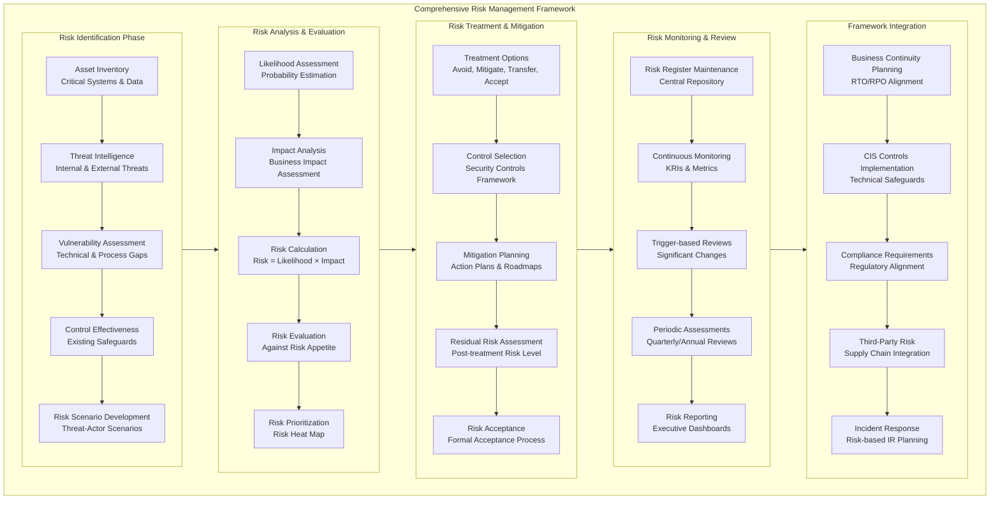
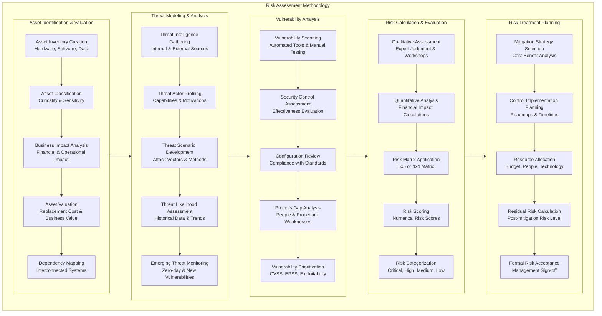
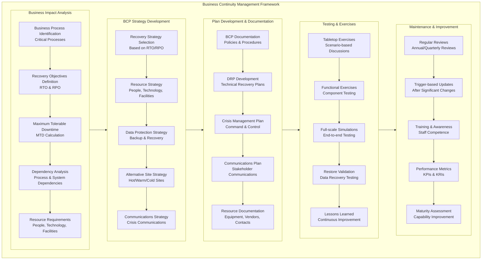
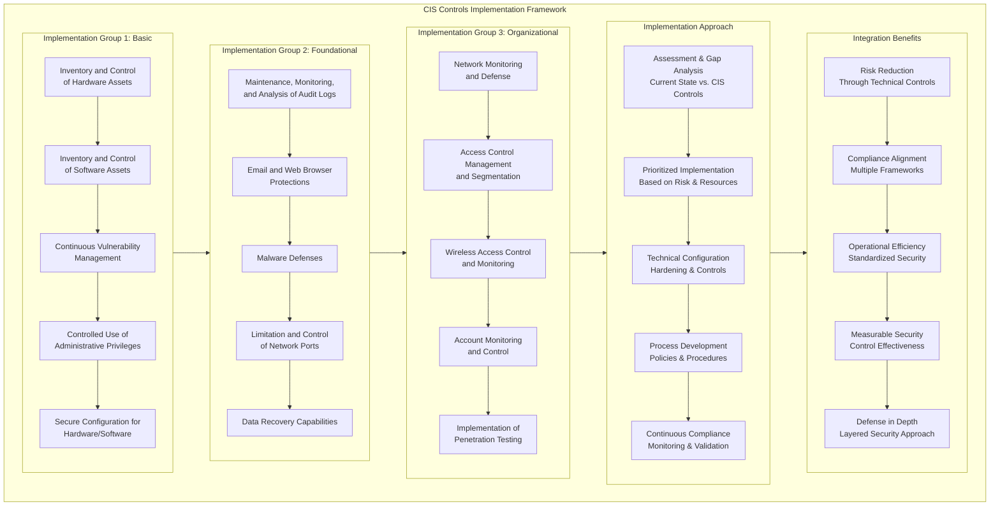
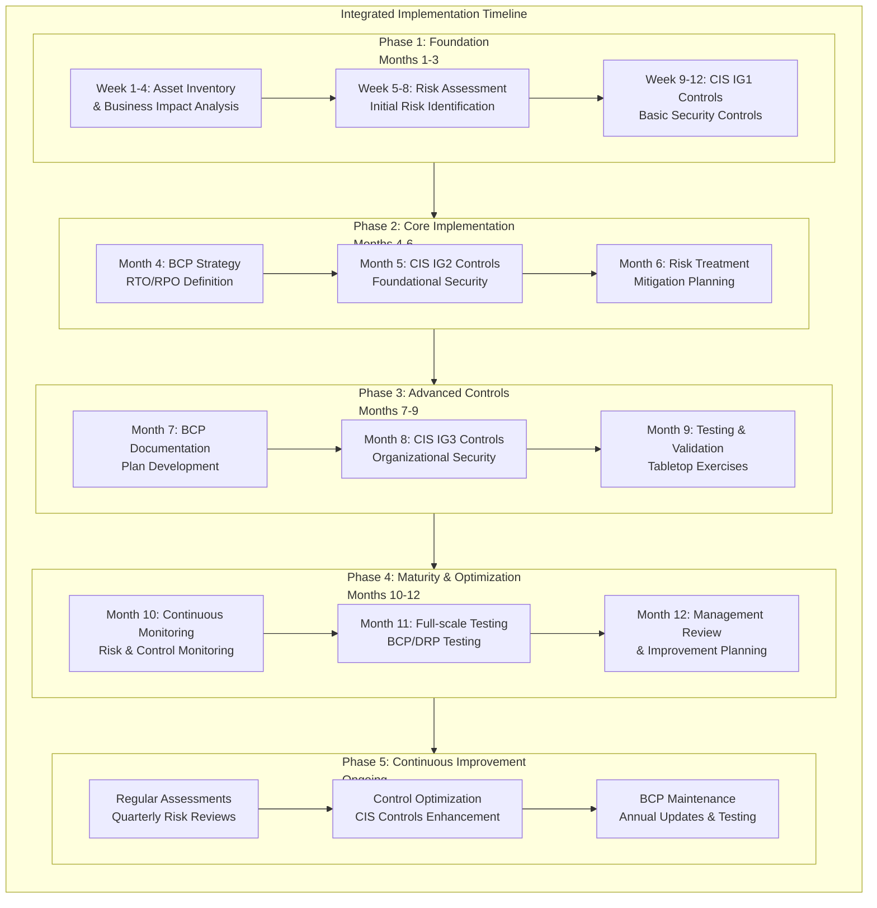

# Risk Assessment, Business Continuity & CIS Controls: Comprehensive Guide

## 1. Integrated Risk Management Framework



## 2. Risk Assessment Methodology - Detailed Process



## 3. Business Continuity Management Framework



## 4. CIS Controls Implementation Framework



## 5. Integrated Implementation Timeline



## 6. Risk Assessment Practical Implementation

### Risk Assessment Methodology & Templates

**Asset Inventory and Classification:**

```yaml
# Asset Inventory Template
Asset_Inventory:
  Hardware_Assets:
    - Asset_ID: "SRV-001"
      Asset_Name: "Primary Database Server"
      Category: "Critical Infrastructure"
      Owner: "IT Operations"
      Location: "Primary Data Center"
      Criticality: "High"
      Confidentiality: "High"
      Integrity: "High"
      Availability: "High"
      Data_Classification: "Restricted"
    
    - Asset_ID: "WS-045"
      Asset_Name: "Marketing Workstation"
      Category: "Endpoint"
      Owner: "Marketing Department"
      Location: "Headquarters"
      Criticality: "Low"
      Confidentiality: "Medium"
      Integrity: "Medium"
      Availability: "Low"

  Software_Assets:
    - Asset_ID: "APP-001"
      Asset_Name: "Customer Relationship Management"
      Category: "Business Application"
      Vendor: "Salesforce"
      Version: "Winter '24"
      Criticality: "High"
      Data_Handled: "Customer PII"
      License_Status: "Compliant"

  Data_Assets:
    - Asset_ID: "DATA-001"
      Asset_Name: "Customer Database"
      Category: "Structured Data"
      Storage: "SQL Database"
      Volume: "2TB"
      Classification: "Confidential"
      Retention_Period: "7 years"
```

**Risk Assessment Calculator:**

```python
# Risk Assessment Calculator
class RiskAssessment:
    def __init__(self):
        self.likelihood_scale = {
            'Rare': 1,       # Once every 5+ years
            'Unlikely': 2,    # Once every 1-5 years
            'Possible': 3,    # Once per year
            'Likely': 4,      # Multiple times per year
            'Almost Certain': 5  # Multiple times per month
        }
        
        self.impact_scale = {
            'Insignificant': 1,  # Minimal financial impact < $10K
            'Minor': 2,          # Moderate impact $10K - $100K
            'Moderate': 3,       # Significant impact $100K - $1M
            'Major': 4,          # Serious impact $1M - $10M
            'Catastrophic': 5    # Critical impact > $10M
        }
    
    def calculate_risk_score(self, likelihood, impact):
        """Calculate risk score using likelihood × impact"""
        likelihood_score = self.likelihood_scale[likelihood]
        impact_score = self.impact_scale[impact]
        return likelihood_score * impact_score
    
    def determine_risk_level(self, risk_score):
        """Determine risk level based on calculated score"""
        if risk_score <= 4:
            return 'Low'
        elif risk_score <= 12:
            return 'Medium'
        elif risk_score <= 16:
            return 'High'
        else:
            return 'Critical'
    
    def recommend_treatment(self, risk_level, risk_score):
        """Recommend risk treatment based on risk level"""
        treatment_matrix = {
            'Low': 'Accept with monitoring',
            'Medium': 'Mitigate within 6 months',
            'High': 'Mitigate within 3 months',
            'Critical': 'Immediate mitigation required'
        }
        return treatment_matrix[risk_level]

# Example risk assessment
risk_calc = RiskAssessment()
likelihood = 'Possible'
impact = 'Major'
risk_score = risk_calc.calculate_risk_score(likelihood, impact)
risk_level = risk_calc.determine_risk_level(risk_score)
treatment = risk_calc.recommend_treatment(risk_level, risk_score)

print(f"Risk Score: {risk_score}")
print(f"Risk Level: {risk_level}")
print(f"Recommended Treatment: {treatment}")
```

**Risk Register Implementation:**

```yaml
# Risk Register Entry Template
Risk_Register:
  Risk_ID: "RISK-2024-001"
  Risk_Description: "Unauthorized access to customer database"
  Asset_Affected: "SRV-001 - Primary Database Server"
  Threat: "External attacker exploiting weak authentication"
  Vulnerability: "Lack of multi-factor authentication"
  Existing_Controls:
    - "Basic password policy"
    - "Network segmentation"
    - "Firewall rules"
  
  Risk_Assessment:
    Likelihood: "Possible"
    Impact: "Major"
    Risk_Score: 12
    Risk_Level: "High"
  
  Risk_Treatment:
    Treatment_Option: "Mitigate"
    Proposed_Controls:
      - "Implement MFA for database access"
      - "Database activity monitoring"
      - "Regular access reviews"
    Treatment_Plan:
      - "Phase 1: MFA implementation (30 days)"
      - "Phase 2: Monitoring setup (60 days)"
      - "Phase 3: Process establishment (90 days)"
  
  Treatment_Details:
    Responsible_Party: "Security Team"
    Budget_Required: "$15,000"
    Timeline: "90 days"
    Residual_Risk: "Low"
    Status: "In Progress"
```

## 7. Business Continuity Practical Implementation

### BCP Strategy and Planning

**Business Impact Analysis Template:**

```yaml
# Business Impact Analysis Template
Business_Impact_Analysis:
  Business_Process: "Order Processing System"
  Process_Owner: "Sales Operations Director"
  
  Recovery_Requirements:
    Maximum_Tolerable_Downtime: "4 hours"
    Recovery_Time_Objective: "2 hours"
    Recovery_Point_Objective: "15 minutes"
    Minimum_Business_Continuity_Objective: "Basic order processing"
  
  Impact_Analysis:
    Financial_Impact:
      - "First 4 hours: $50,000 per hour"
      - "4-24 hours: $25,000 per hour"
      - "Beyond 24 hours: $100,000 per hour + penalties"
    
    Operational_Impact:
      - "Customer order backlog"
      - "Shipping delays"
      - "Customer service complaints"
      - "Regulatory reporting delays"
    
    Reputational_Impact:
      - "Customer trust erosion"
      - "Brand damage"
      - "Competitive disadvantage"
  
  Resource_Requirements:
    People:
      - "2x System administrators"
      - "1x Database administrator"
      - "3x Sales operations staff"
    
    Technology:
      - "Database servers (2x)"
      - "Application servers (3x)"
      - "Network infrastructure"
      - "Backup systems"
    
    Facilities:
      - "Primary data center"
      - "DR site (hot site)"
      - "Emergency operations center"
```

**Disaster Recovery Plan Template:**

```yaml
# Disaster Recovery Plan Structure
Disaster_Recovery_Plan:
  Plan_Overview:
    Plan_ID: "DRP-ORDER-001"
    Scope: "Order Processing System Recovery"
    Assumptions: "DR site available, backups intact"
    Success_Criteria: "RTO 2 hours, RPO 15 minutes"
  
  Recovery_Teams:
    - Team: "Command & Control"
      Members: ["Crisis Manager", "IT Director", "Business Lead"]
      Responsibilities: ["Decision making", "Communication", "Resource allocation"]
    
    - Team: "Technical Recovery"
      Members: ["System Admins", "DBAs", "Network Engineers"]
      Responsibilities: ["System restoration", "Data recovery", "Infrastructure setup"]
    
    - Team: "Business Recovery"
      Members: ["Business Analysts", "Subject Matter Experts"]
      Responsibilities: ["Process validation", "Data verification", "User support"]
  
  Recovery_Procedures:
    - Phase: "Immediate Response (0-30 minutes)"
      Actions:
        - "Activate crisis management team"
        - "Assess incident scope and impact"
        - "Initiate DR site activation"
    
    - Phase: "Technical Recovery (30 minutes - 2 hours)"
      Actions:
        - "Restore database from backups"
        - "Provision recovery infrastructure"
        - "Validate system integrity"
    
    - Phase: "Business Resumption (2-4 hours)"
      Actions:
        - "Verify data consistency"
        - "Test critical transactions"
        - "Gradual user reconnection"
  
  Testing_Schedule:
    - "Tabletop Exercise: Quarterly"
    - "Component Recovery Test: Semi-annually"
    - "Full DR Test: Annually"
    - "Post-test Review: Within 2 weeks of test"
```

## 8. CIS Controls Practical Implementation

### CIS Controls Implementation Guide

**CIS Control 1: Inventory and Control of Hardware Assets**

```yaml
# CIS Control 1 Implementation
CIS_Control_1:
  Requirement: "Actively manage all hardware devices on the network"
  Implementation_Guide:
    Automated_Discovery:
      Tool: "Network scanning tools (Nmap, Nessus)"
      Frequency: "Continuous"
      Scope: "All IP ranges"
    
    Inventory_Maintenance:
      Attributes_Tracked:
        - "MAC address"
        - "IP address"
        - "System name"
        - "Operating system"
        - "Hardware type"
        - "Owner/User"
      
      Update_Frequency: "Real-time or daily"
    
    Unauthorized_Device_Control:
      Mechanism: "Network Access Control (NAC)"
      Action: "Block or quarantine unauthorized devices"
      Alerting: "Real-time alerts for new devices"
  
  Technical_Configuration:
    Network_Scanning:
      Command: "nmap -sn 192.168.1.0/24"
      Schedule: "Every 4 hours"
    
    Asset_Database:
      Tool: "CMDB or dedicated asset management"
      Integration: "SIEM, vulnerability management"
    
    Monitoring:
      Alerts: "New device detection"
      Reports: "Asset inventory reports"
  
  Validation_Checks:
    - "100% of network devices discovered"
    - "Unauthorized device detection working"
    - "Asset database accuracy > 95%"
```

**CIS Control 3: Continuous Vulnerability Management**

```python
# CIS Control 3 Implementation Script
class VulnerabilityManagement:
    def __init__(self):
        self.scan_schedule = {
            'critical_assets': 'daily',
            'high_assets': 'weekly',
            'medium_assets': 'monthly',
            'low_assets': 'quarterly'
        }
        
        self.remediation_sla = {
            'critical': '7 days',
            'high': '30 days',
            'medium': '90 days',
            'low': '180 days'
        }
    
    def schedule_vulnerability_scans(self):
        """Schedule vulnerability scans based on asset criticality"""
        scan_schedule = {}
        
        for asset_criticality, frequency in self.scan_schedule.items():
            scan_schedule[asset_criticality] = {
                'frequency': frequency,
                'tools': self.select_scan_tools(asset_criticality),
                'scope': self.define_scan_scope(asset_criticality),
                'reporting': self.define_reporting_requirements(asset_criticality)
            }
        
        return scan_schedule
    
    def prioritize_remediation(self, vulnerabilities):
        """Prioritize vulnerabilities based on CVSS and asset criticality"""
        prioritized_vulns = []
        
        for vuln in vulnerabilities:
            risk_score = self.calculate_risk_score(vuln)
            sla_deadline = self.calculate_sla_deadline(risk_score)
            
            prioritized_vulns.append({
                'vulnerability_id': vuln['id'],
                'description': vuln['description'],
                'cvss_score': vuln['cvss_score'],
                'asset_criticality': vuln['asset_criticality'],
                'risk_score': risk_score,
                'remediation_sla': sla_deadline,
                'assigned_to': self.assign_remediation_owner(vuln)
            })
        
        return sorted(prioritized_vulns, key=lambda x: x['risk_score'], reverse=True)
    
    def calculate_risk_score(self, vulnerability):
        """Calculate risk score using CVSS and asset criticality"""
        cvss_weight = 0.7
        criticality_weight = 0.3
        
        criticality_scores = {'critical': 10, 'high': 8, 'medium': 5, 'low': 2}
        
        cvss_component = vulnerability['cvss_score'] * cvss_weight
        criticality_component = criticality_scores[vulnerability['asset_criticality']] * criticality_weight
        
        return cvss_component + criticality_component

# Example implementation
vuln_mgmt = VulnerabilityManagement()
scan_schedule = vuln_mgmt.schedule_vulnerability_scans()
print("Vulnerability Scan Schedule:", scan_schedule)
```

## 9. Integrated Testing and Validation

### Tabletop Exercise Framework

```yaml
# Tabletop Exercise Template
Tabletop_Exercise:
  Exercise_Details:
    Title: "Data Center Outage Scenario"
    Date: "2024-03-15"
    Duration: "3 hours"
    Participants: "Crisis Team, IT, Business Units"
  
  Scenario:
    Primary_Incident: "Primary data center power failure"
    Impact:
      - "All production systems offline"
      - "Customer-facing applications unavailable"
      - "Estimated downtime: 8+ hours"
    Complications:
      - "Backup generator failure"
      - "Network connectivity issues to DR site"
      - "Key personnel unavailable"
  
  Exercise_Objectives:
    - "Test crisis management team activation"
    - "Validate communication protocols"
    - "Assess DR plan effectiveness"
    - "Identify process gaps"
  
  Discussion_Questions:
    - "Immediate Actions: What are your first 3 actions?"
    - "Communication: Who needs to be notified and when?"
    - "Decision Points: When do we declare a disaster?"
    - "Recovery: What is the recovery sequence?"
    - "Customer Impact: How do we communicate to customers?"
  
  Success_Metrics:
    - "Response time to activate DR plan"
    - "Communication effectiveness"
    - "Decision-making quality"
    - "Team coordination"
  
  Lessons_Learned_Template:
    - "What worked well?"
    - "What could be improved?"
    - "Action items for plan updates"
    - "Training needs identified"
```

### Control Validation Framework

```python
# Control Validation and Testing Framework
class ControlValidator:
    def __init__(self):
        self.control_framework = {
            'CIS': self.load_cis_controls(),
            'Risk': self.load_risk_controls(),
            'BCP': self.load_bcp_controls()
        }
    
    def validate_control_effectiveness(self, control_id, control_type):
        """Validate control effectiveness through testing"""
        control = self.control_framework[control_type][control_id]
        
        test_results = {
            'control_id': control_id,
            'test_date': datetime.now(),
            'test_method': control['test_method'],
            'expected_result': control['expected_result'],
            'actual_result': self.execute_control_test(control),
            'effectiveness_score': self.calculate_effectiveness(control),
            'remediation_required': self.identify_remediation(control)
        }
        
        return test_results
    
    def execute_control_test(self, control):
        """Execute specific control test based on type"""
        test_methods = {
            'automated_scan': self.run_automated_scan,
            'manual_verification': self.perform_manual_check,
            'simulation': self.run_simulation_test,
            'document_review': self.review_documentation
        }
        
        test_function = test_methods.get(control['test_method'])
        if test_function:
            return test_function(control['test_parameters'])
        else:
            return "Test method not implemented"
    
    def calculate_control_maturity(self):
        """Calculate overall control maturity score"""
        maturity_levels = {
            'Initial': 1,
            'Developing': 2,
            'Defined': 3,
            'Managed': 4,
            'Optimizing': 5
        }
        
        control_scores = {}
        for control_type, controls in self.control_framework.items():
            type_score = sum(control['maturity_score'] for control in controls.values())
            control_scores[control_type] = type_score / len(controls)
        
        overall_maturity = sum(control_scores.values()) / len(control_scores)
        return {
            'overall_maturity': overall_maturity,
            'component_maturity': control_scores,
            'improvement_areas': self.identify_improvement_areas(control_scores)
        }

# Example usage
validator = ControlValidator()
maturity_assessment = validator.calculate_control_maturity()
print("Control Maturity Assessment:", maturity_assessment)
```

## 10. Integrated Monitoring and Reporting

### Unified Dashboard Implementation

```yaml
# Integrated Monitoring Dashboard
Compliance_Dashboard:
  Risk_Metrics:
    - "Open High/Critical Risks: 12"
    - "Risk Treatment Completion: 78%"
    - "Average Risk Score Trend: ↓ 15% (Improving)"
    - "New Risks Identified (30 days): 8"
  
  BCP_Metrics:
    - "RTO Achievement Rate: 92%"
    - "RPO Achievement Rate: 95%"
    - "Last DR Test: 2024-01-15 (Successful)"
    - "Next Scheduled Test: 2024-04-15"
  
  CIS_Controls_Metrics:
    - "CIS Implementation Score: 84%"
    - "Critical Controls Implemented: 18/20"
    - "Vulnerability Remediation Rate: 88%"
    - "Compliance Score Trend: ↑ 5% (Improving)"
  
  Incident_Metrics:
    - "Security Incidents (30 days): 3"
    - "Mean Time to Detect: 2.5 hours"
    - "Mean Time to Respond: 4 hours"
    - "Incident Resolution Rate: 100%"
  
  Executive_Summary:
    Overall_Security_Posture: "Good"
    Top_Risks:
      - "Third-party vendor security (Risk Score: 16)"
      - "Phishing attack susceptibility (Risk Score: 12)"
      - "Data backup integrity (Risk Score: 9)"
    Recommendations:
      - "Enhance third-party risk management program"
      - "Implement advanced email security controls"
      - "Conduct backup restoration testing"
```

This comprehensive framework provides organizations with a practical, integrated approach to implementing risk assessment, business continuity, and CIS controls in a coordinated manner that maximizes efficiency and effectiveness while ensuring robust security and resilience.