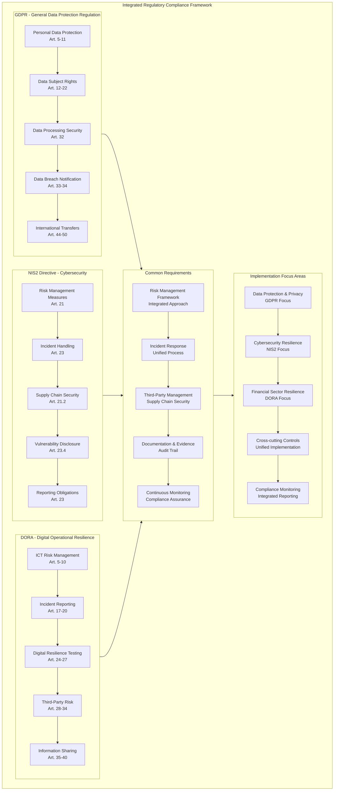
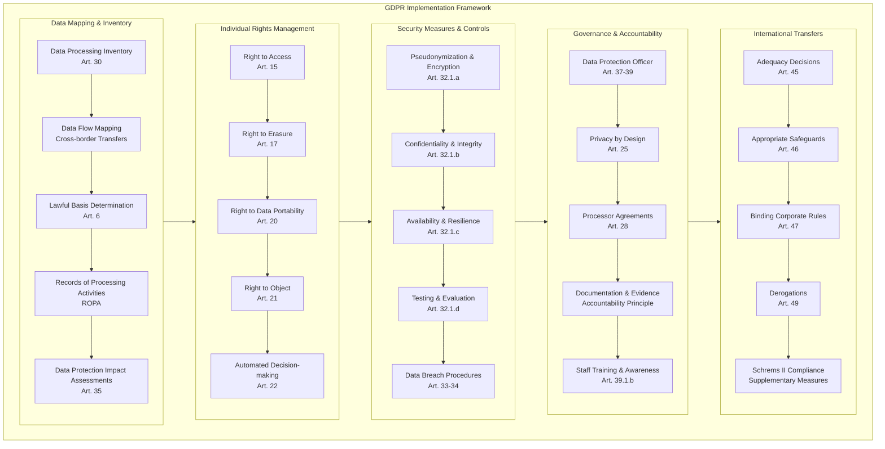
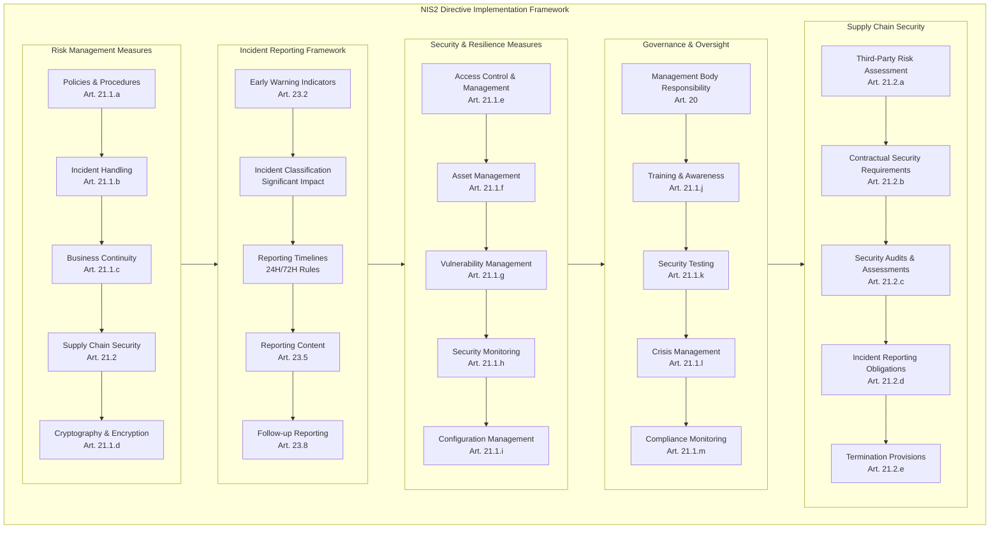
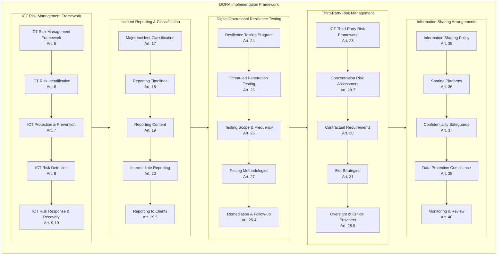
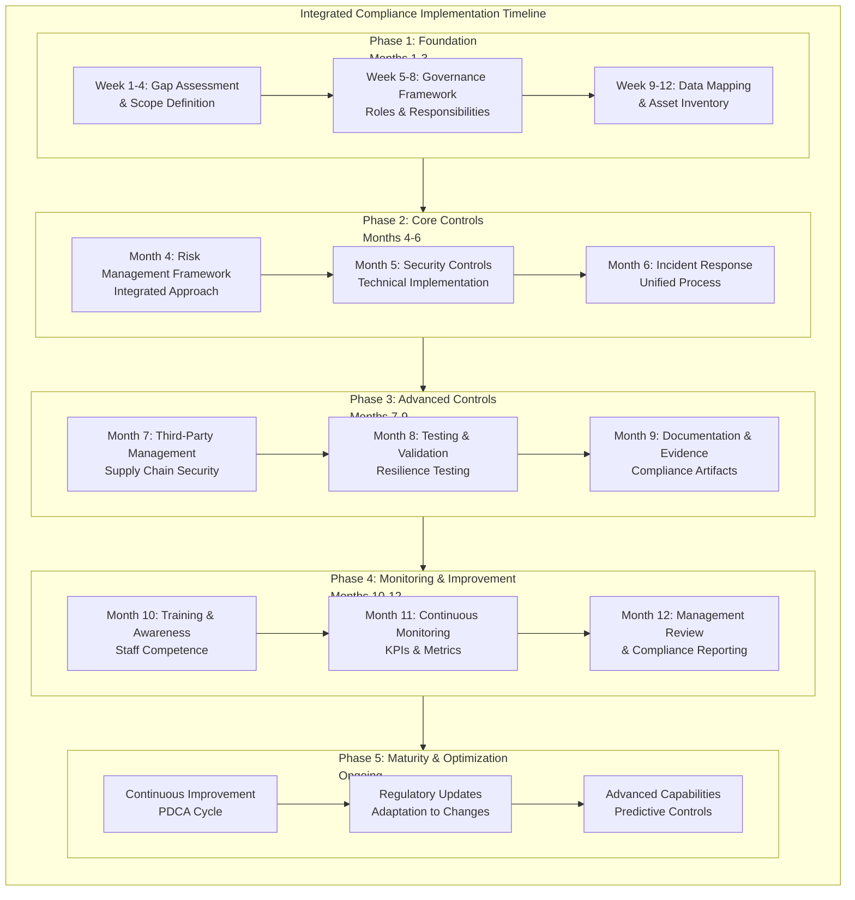
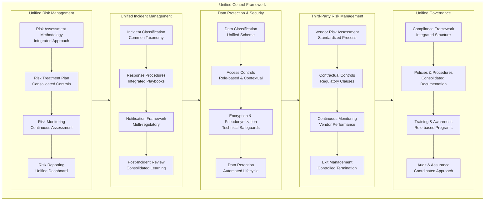
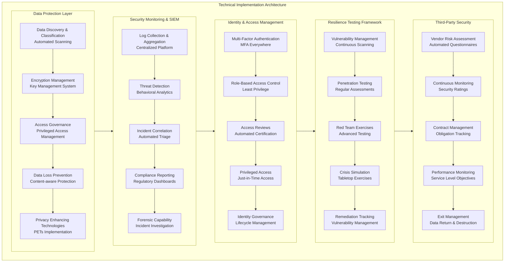

# EU GDPR / NIS2 / DORA: Comprehensive Implementation Guide

## 1. Integrated Regulatory Compliance Framework



## 2. GDPR Comprehensive Implementation Framework



## 3. NIS2 Directive Implementation Framework



## 4. DORA Implementation Framework



## 5. Integrated Compliance Implementation Timeline



## 6. Unified Control Framework



## 7. Technical Implementation Architecture



## Detailed Implementation Guide

### 1. GDPR Implementation - Practical Steps

**Data Mapping and ROPA (Records of Processing Activities):**

```yaml
# ROPA Template Implementation
Processing_Activity:
  Activity_ID: "PA-001"
  Activity_Name: "Customer Onboarding"
  Data_Controller: "Company XYZ"
  Data_Processor: "CRM Provider Inc."
  
  Purpose_of_Processing:
    - "Customer account creation"
    - "Service delivery"
    - "Marketing communications (with consent)"
  
  Categories_of_Data_Subjects:
    - "Prospects"
    - "Customers"
    - "Authorized users"
  
  Categories_of_Personal_Data:
    - "Identity data: Name, address, ID number"
    - "Contact data: Email, phone number"
    - "Financial data: Payment information"
    - "Technical data: IP address, device information"
  
  Lawful_Basis:
    - "Contract: Art. 6.1.b - Necessary for performance"
    - "Consent: Art. 6.1.a - For marketing communications"
  
  Data_Retention:
    - "Active customers: Duration of relationship + 6 years"
    - "Inactive customers: 2 years after last activity"
  
  International_Transfers:
    - "Destination: United States"
    - "Safeguard: Standard Contractual Clauses"
    - "Supplementary_Measures: Encryption in transit and at rest"
```

**Data Subject Rights Management:**

```python
# Data Subject Rights Request Management System
class DataSubjectRights:
    def __init__(self):
        self.request_types = ['access', 'erasure', 'portability', 'rectification']
        self.response_timeline = 30  # days
    
    def handle_access_request(self, request_id, data_subject_id):
        """Handle right of access request (Article 15)"""
        request_details = {
            'request_id': request_id,
            'data_subject': data_subject_id,
            'submission_date': datetime.now(),
            'due_date': datetime.now() + timedelta(days=self.response_timeline),
            'status': 'in_progress'
        }
        
        # Gather all personal data
        personal_data = self.collect_personal_data(data_subject_id)
        
        # Prepare response package
        response = {
            'personal_data': personal_data,
            'processing_purposes': self.get_processing_purposes(data_subject_id),
            'data_categories': self.get_data_categories(data_subject_id),
            'data_recipients': self.get_data_recipients(data_subject_id),
            'retention_periods': self.get_retention_periods(data_subject_id)
        }
        
        return response
    
    def handle_erasure_request(self, request_id, data_subject_id):
        """Handle right to erasure request (Article 17)"""
        # Check if erasure conditions are met
        if self.verify_erasure_conditions(data_subject_id):
            self.initiate_data_erasure(data_subject_id)
            return {"status": "erasure_initiated"}
        else:
            return {"status": "erasure_denied", "reason": "legal_obligation"}
```

### 2. NIS2 Implementation - Practical Steps

**Incident Reporting Framework:**

```yaml
# NIS2 Incident Reporting Framework
Incident_Reporting_Framework:
  Incident_Classification:
    - "Category 1: Basic Incident - Internal handling only"
    - "Category 2: Significant Incident - 24H notification"
    - "Category 3: Severe Incident - Immediate notification"
  
  Notification_Timelines:
    - "Early Warning: Within 24 hours of detection"
    - "Initial Assessment: Within 72 hours of detection"
    - "Final Report: Within 1 month of resolution"
  
  Reporting_Content:
    Early_Warning:
      - "Incident description and impact assessment"
      - "Affected services and systems"
      - "Initial containment measures"
      - "Contact information for follow-up"
    
    Final_Report:
      - "Root cause analysis"
      - "Impact assessment (quantitative and qualitative)"
      - "Remediation measures taken"
      - "Lessons learned and preventive actions"
  
  CSIRT_Coordination:
    - "National CSIRT notification"
    - "Sectoral CSIRT coordination"
    - "Cross-border cooperation (if applicable)"
```

**Supply Chain Security Requirements:**

```python
# Third-Party Risk Assessment System
class NIS2ThirdPartyRisk:
    def __init__(self):
        self.critical_services = ['cloud_providers', 'managed_services', 'software_suppliers']
    
    def assess_third_party_risk(self, vendor_id):
        """Comprehensive third-party risk assessment"""
        risk_assessment = {
            'vendor_id': vendor_id,
            'assessment_date': datetime.now(),
            'risk_level': self.calculate_risk_level(vendor_id),
            'security_controls': self.evaluate_controls(vendor_id),
            'compliance_status': self.check_compliance(vendor_id),
            'remediation_actions': self.identify_remediation(vendor_id)
        }
        
        return risk_assessment
    
    def evaluate_controls(self, vendor_id):
        """Evaluate vendor security controls against NIS2 requirements"""
        controls_checklist = {
            'access_control': self.check_access_controls(vendor_id),
            'incident_response': self.check_incident_capabilities(vendor_id),
            'business_continuity': self.check_bcp_drp(vendor_id),
            'vulnerability_management': self.check_patch_management(vendor_id),
            'cryptography': self.check_encryption_standards(vendor_id)
        }
        
        return controls_checklist
```

### 3. DORA Implementation - Practical Steps

**ICT Risk Management Framework:**

```yaml
# DORA ICT Risk Management Framework
ICT_Risk_Management_Framework:
  Governance_Structure:
    - "Management Body oversight and accountability"
    - "Dedicated ICT Risk Management function"
    - "Three Lines of Defense model"
  
  Risk_Identification:
    - "ICT asset inventory and classification"
    - "Threat intelligence integration"
    - "Vulnerability assessment programs"
    - "Scenario analysis and stress testing"
  
  Protection_Measures:
    - "Network security and segmentation"
    - "Endpoint protection and hardening"
    - "Identity and access management"
    - "Data protection and encryption"
  
  Detection_Capabilities:
    - "Security monitoring and SIEM"
    - "Anomaly detection and behavioral analytics"
    - "Threat hunting capabilities"
    - "Continuous vulnerability scanning"
  
  Response_Recovery:
    - "Incident response plan and playbooks"
    - "Business continuity and disaster recovery"
    - "Backup and restoration procedures"
    - "Crisis communication plans"
```

**Digital Operational Resilience Testing:**

```python
# DORA Resilience Testing Program
class DORAResilienceTesting:
    def __init__(self):
        self.testing_frequency = {
            'basic_testing': 'annual',
            'advanced_testing': 'biannual',
            'threat_led_testing': 'triennial'
        }
    
    def execute_resilience_test(self, test_type, scope):
        """Execute resilience testing based on DORA requirements"""
        test_plan = {
            'test_id': self.generate_test_id(),
            'test_type': test_type,
            'scope': scope,
            'objectives': self.define_test_objectives(test_type),
            'methodology': self.select_methodology(test_type),
            'success_criteria': self.define_success_criteria(test_type)
        }
        
        # Execute test
        test_results = self.run_test(test_plan)
        
        # Generate report
        report = self.generate_test_report(test_plan, test_results)
        
        # Track remediation
        self.track_remediation(test_results['findings'])
        
        return report
    
    def threat_led_penetration_testing(self):
        """Execute TLPT as required by DORA Article 26"""
        tlpt_framework = {
            'scope_definition': 'Critical business services',
            'testing_approach': 'Simulation of advanced threat actors',
            'testing_depth': 'Comprehensive attack simulation',
            'reporting_requirements': 'Detailed findings and recommendations',
            'remediation_tracking': 'Mandatory follow-up and verification'
        }
        
        return self.execute_tlpt_engagement(tlpt_framework)
```

### 4. Integrated Compliance Monitoring

**Unified Compliance Dashboard:**

```python
# Integrated Compliance Monitoring System
class IntegratedComplianceMonitor:
    def __init__(self):
        self.regulatory_requirements = ['GDPR', 'NIS2', 'DORA']
        self.monitoring_metrics = self.define_compliance_metrics()
    
    def define_compliance_metrics(self):
        """Define unified compliance metrics across regulations"""
        metrics = {
            'data_protection': {
                'data_breach_response_time': '<= 72 hours',
                'dsar_completion_rate': '>= 95% within timeline',
                'encryption_coverage': '>= 90% of sensitive data'
            },
            'cybersecurity': {
                'patch_compliance': '>= 95% critical patches within 14 days',
                'incident_detection_time': '<= 1 hour for critical incidents',
                'security_control_coverage': '100% of required controls'
            },
            'resilience': {
                'system_availability': '>= 99.9% for critical systems',
                'recovery_time_objective': '<= 4 hours for critical services',
                'testing_completion_rate': '100% of planned tests'
            }
        }
        return metrics
    
    def generate_compliance_report(self):
        """Generate integrated compliance report"""
        report = {
            'executive_summary': self.prepare_executive_summary(),
            'regulatory_status': self.assess_regulatory_compliance(),
            'risk_exposure': self.calculate_risk_exposure(),
            'remediation_priorities': self.identify_remediation_priorities(),
            'management_actions': self.recommend_management_actions()
        }
        
        return report
    
    def assess_regulatory_compliance(self):
        """Assess compliance status across all regulations"""
        compliance_status = {}
        
        for regulation in self.regulatory_requirements:
            compliance_status[regulation] = {
                'overall_score': self.calculate_compliance_score(regulation),
                'key_requirements': self.assess_key_requirements(regulation),
                'gaps_identified': self.identify_compliance_gaps(regulation),
                'remediation_plan': self.develop_remediation_plan(regulation)
            }
        
        return compliance_status
```

### 5. Technical Implementation Examples

**Data Protection Technical Controls:**

```yaml
# Data Protection Technical Implementation
Data_Protection_Controls:
  Encryption_Management:
    - "Data at rest: AES-256 encryption for databases and storage"
    - "Data in transit: TLS 1.3 for all external communications"
    - "Key Management: HSMs for cryptographic key storage"
  
  Access_Controls:
    - "Role-Based Access Control (RBAC) implementation"
    - "Multi-Factor Authentication for all administrative access"
    - "Privileged Access Management for elevated privileges"
    - "Just-in-Time access provisioning for temporary needs"
  
  Data_Loss_Prevention:
    - "Network DLP: Monitor and control data transfers"
    - "Endpoint DLP: Control USB and removable media"
    - "Cloud DLP: Monitor cloud storage and SaaS applications"
  
  Privacy_Enhancing_Technologies:
    - "Differential privacy for analytics"
    - "Homomorphic encryption for secure processing"
    - "Tokenization for sensitive data elements"
```

**Incident Response Automation:**

```python
# Automated Incident Response System
class AutomatedIncidentResponse:
    def __init__(self):
        self.incident_playbooks = self.load_incident_playbooks()
    
    def handle_security_incident(self, incident_data):
        """Automated incident response handling"""
        # Classify incident
        incident_type = self.classify_incident(incident_data)
        severity_level = self.assess_severity(incident_data)
        
        # Execute appropriate playbook
        playbook = self.select_playbook(incident_type, severity_level)
        response_actions = self.execute_playbook(playbook, incident_data)
        
        # Trigger regulatory notifications if required
        if self.requires_regulatory_notification(incident_data):
            self.trigger_regulatory_notifications(incident_data)
        
        return response_actions
    
    def trigger_regulatory_notifications(self, incident_data):
        """Handle multi-regulatory notification requirements"""
        notifications = {}
        
        # GDPR Notification (if personal data breach)
        if self.is_personal_data_breach(incident_data):
            notifications['GDPR'] = self.prepare_gdpr_notification(incident_data)
        
        # NIS2 Notification (if significant incident)
        if self.is_nis2_reportable(incident_data):
            notifications['NIS2'] = self.prepare_nis2_notification(incident_data)
        
        # DORA Notification (if major ICT incident)
        if self.is_dora_reportable(incident_data):
            notifications['DORA'] = self.prepare_dora_notification(incident_data)
        
        # Execute notifications
        for regulation, notification in notifications.items():
            self.send_regulatory_notification(regulation, notification)
```

### 6. Training and Awareness Program

```yaml
# Integrated Training and Awareness Program
Compliance_Training_Program:
  Target_Audiences:
    - "Executive Management: Strategic oversight and accountability"
    - "IT and Security Teams: Technical implementation"
    - "Data Protection Team: GDPR-specific requirements"
    - "All Employees: General awareness and responsibilities"
  
  Training_Modules:
    GDPR_Training:
      - "Data protection principles and individual rights"
      - "Lawful basis for processing and consent management"
      - "Data breach reporting procedures"
      - "International data transfer requirements"
    
    NIS2_Training:
      - "Cybersecurity risk management requirements"
      - "Incident detection and reporting obligations"
      - "Supply chain security responsibilities"
      - "Business continuity and crisis management"
    
    DORA_Training:
      - "ICT risk management framework"
      - "Digital operational resilience testing"
      - "Third-party risk management"
      - "Information sharing arrangements"
  
  Delivery_Methods:
    - "E-learning modules with assessments"
    - "Instructor-led workshops and simulations"
    - "Tabletop exercises for incident response"
    - "Regular security awareness newsletters"
  
  Measurement_Metrics:
    - "Training completion rates by role and department"
    - "Assessment scores and knowledge retention"
    - "Phishing simulation success rates"
    - "Incident reporting culture metrics"
```

## Key Success Factors

### 1. Integrated Approach
- **Unified framework** rather than siloed compliance
- **Common controls** addressing multiple requirements
- **Centralized monitoring** and reporting
- **Coordinated incident response**

### 2. Risk-Based Implementation
- **Focus on material risks** to the organization
- **Prioritize critical assets** and processes
- **Scale controls** based on risk assessment
- **Continuous risk monitoring**

### 3. Technology Enablement
- **Automated compliance monitoring**
- **Integrated security controls**
- **Unified reporting dashboards**
- **Automated evidence collection**

### 4. Organizational Culture
- **Executive sponsorship** and oversight
- **Clear roles and responsibilities**
- **Continuous training and awareness**
- **Positive compliance culture**

### 5. Continuous Improvement
- **Regular compliance assessments**
- **Adaptation to regulatory changes**
- **Learning from incidents and near-misses**
- **Maturity progression over time**

This comprehensive implementation guide provides a practical roadmap for organizations to achieve compliance with GDPR, NIS2, and DORA regulations through an integrated approach that maximizes efficiency while ensuring robust compliance across all regulatory requirements.