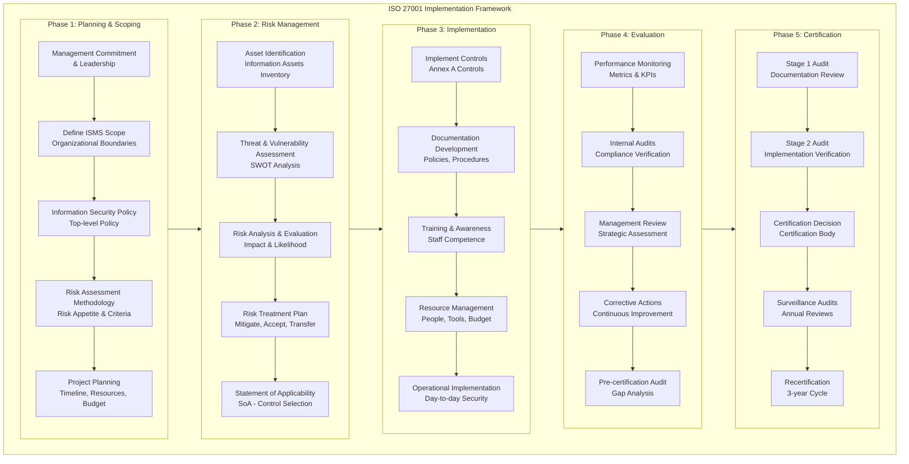
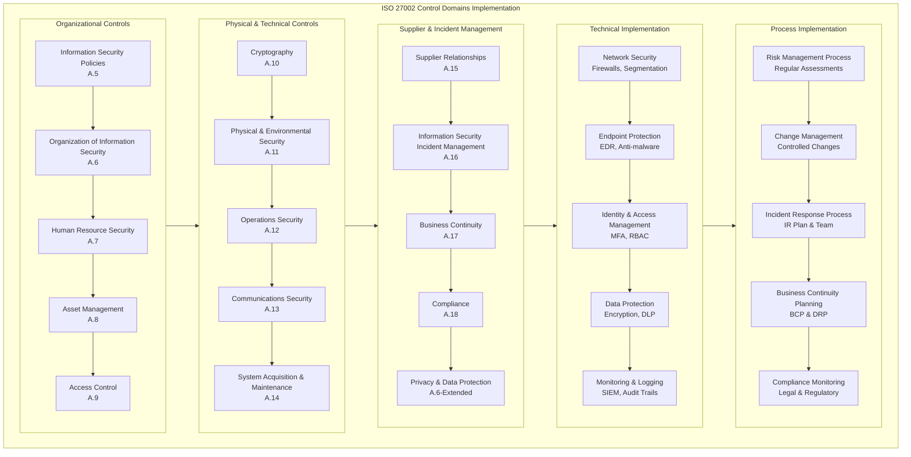
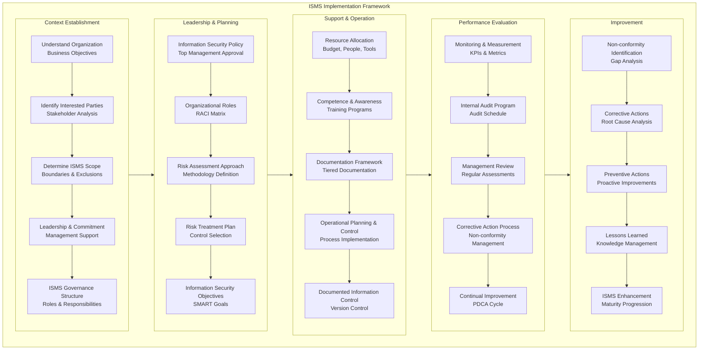
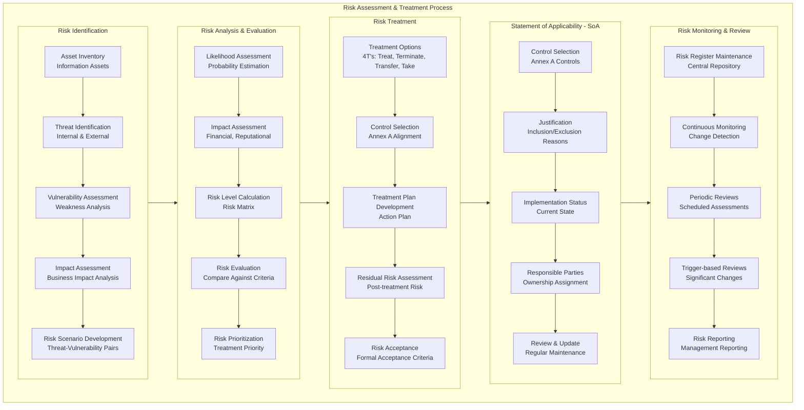
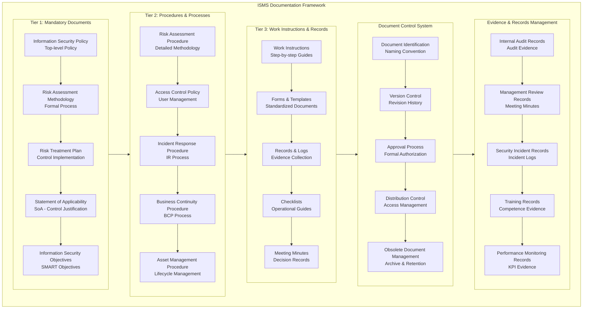
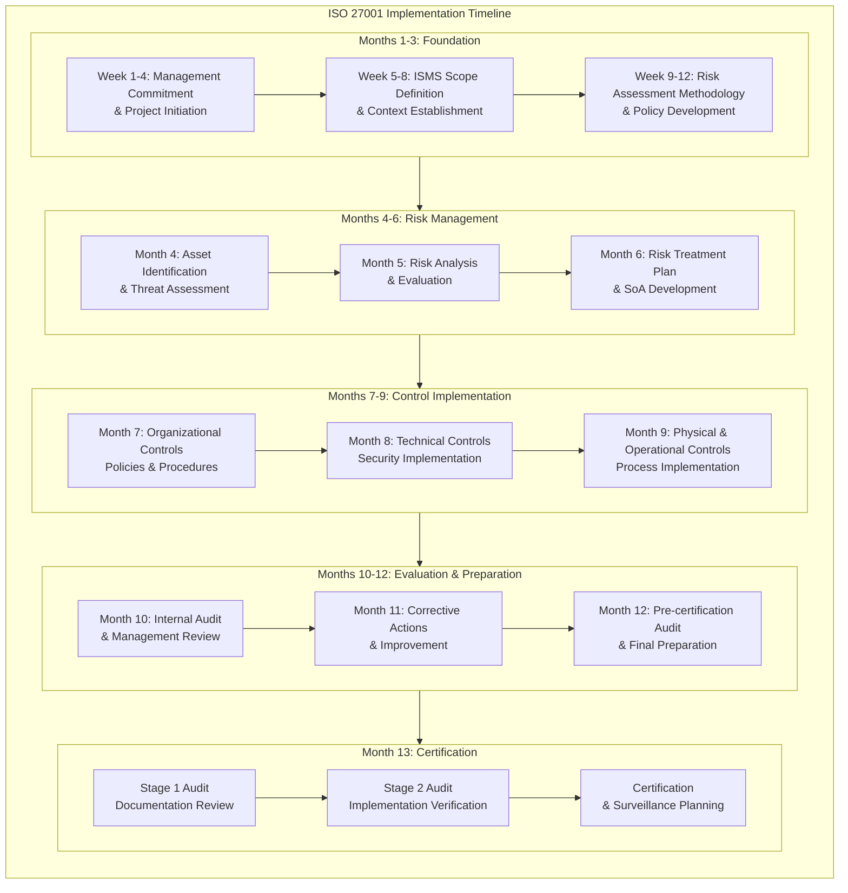
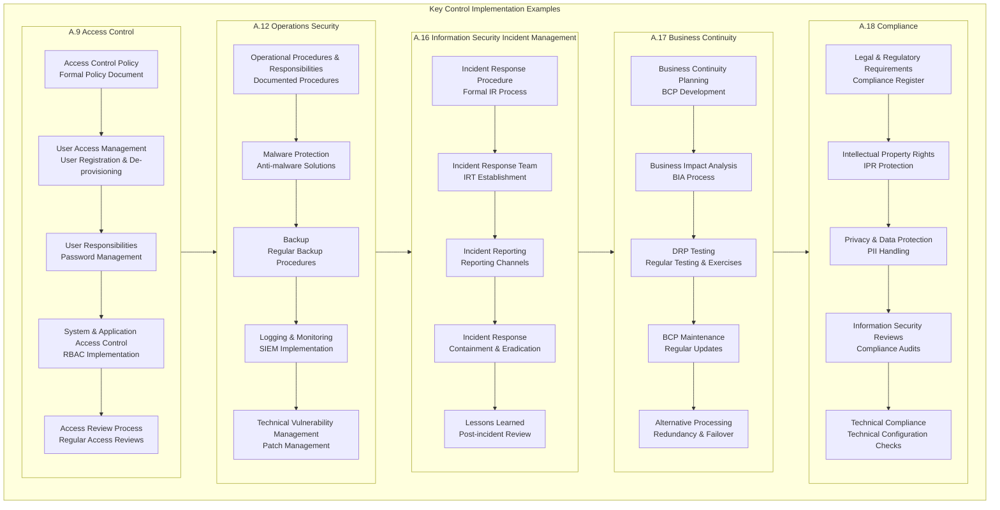

# ISO 27001/27002: Comprehensive Practical Implementation Guide

## 1. ISO 27001 Implementation Framework



## 2. ISO 27002 Control Domains Implementation



## 3. ISMS (Information Security Management System) Implementation



## 4. Risk Assessment & Treatment Process



## 5. Documentation Framework



## 6. Implementation Timeline & Project Plan



## 7. Key Control Implementation Examples



## Detailed Implementation Guide

### 1. Phase 1: Planning & Scoping - Practical Implementation

**Management Commitment & Leadership:**

```yaml
# Management commitment evidence template
Management_Commitment:
  - Document: "Information Security Policy"
    Approval_Date: "2024-01-15"
    Signed_By: "CEO"
    Review_Cycle: "Annual"
    
  - Document: "ISMS Project Charter"
    Budget_Allocated: "$150,000"
    Resources_Committed: 
      - "1x Information Security Manager"
      - "2x Security Analysts"
      - "External Consultant"
    
  - Actions:
    - "Monthly Steering Committee Meetings"
    - "Regular Management Reviews"
    - "Resource Allocation Confirmation"
```

**ISMS Scope Definition:**

```yaml
# ISMS Scope Document Template
ISMS_Scope:
  Organizational_Boundaries:
    - "Headquarters: 123 Business Ave"
    - "Branch Offices: [London, Berlin, Singapore]"
    - "Data Centers: [Primary DC, DR Site]"
    
  Technological_Boundaries:
    - "In Scope: Corporate Network, Servers, Applications"
    - "Out of Scope: Personal Devices, Test Environments"
    
  Information_Assets:
    - "Customer Data: CRM, Billing Systems"
    - "Employee Data: HR Systems, Payroll"
    - "Intellectual Property: R&D Documents, Source Code"
    
  Exclusions:
    - "Marketing Department Social Media Accounts"
    - "Temporary Test Environments"
    - "Legacy Systems (Scheduled for Decommissioning)"
```

### 2. Risk Assessment Methodology - Practical Implementation

**Risk Assessment Framework:**

```python
# Risk Assessment Calculator
class RiskAssessment:
    def __init__(self):
        self.impact_scale = {
            'Very Low': 1, 'Low': 2, 'Medium': 3, 
            'High': 4, 'Very High': 5
        }
        self.likelihood_scale = {
            'Rare': 1, 'Unlikely': 2, 'Possible': 3,
            'Likely': 4, 'Almost Certain': 5
        }
    
    def calculate_risk_level(self, impact, likelihood):
        risk_score = self.impact_scale[impact] * self.likelihood_scale[likelihood]
        
        if risk_score <= 4:
            return 'Low'
        elif risk_score <= 12:
            return 'Medium'
        elif risk_score <= 16:
            return 'High'
        else:
            return 'Very High'
    
    def risk_treatment_decision(self, risk_level):
        treatment_matrix = {
            'Low': 'Accept',
            'Medium': 'Mitigate or Accept',
            'High': 'Mitigate',
            'Very High': 'Immediate Mitigation'
        }
        return treatment_matrix[risk_level]
```

**Risk Register Template:**

```yaml
# Risk Register Entry Template
Risk_ID: "RISK-001"
Risk_Description: "Unauthorized access to customer database"
Asset: "Customer Relationship Management System"
Threat: "External attacker exploiting weak authentication"
Vulnerability: "Lack of multi-factor authentication"
Impact: "High"  # Confidentiality, Integrity, Availability
Likelihood: "Possible"
Risk_Level: "High"  # Calculated: High impact × Possible likelihood
Existing_Controls: 
  - "Basic password policy"
  - "Network segmentation"
Proposed_Treatment: "Implement MFA for all admin accounts"
Treatment_Plan:
  - "Phase 1: MFA implementation for admin accounts"
  - "Phase 2: Regular access reviews"
  - "Phase 3: Security awareness training"
Residual_Risk: "Low"
Responsible_Party: "IT Security Team"
Due_Date: "2024-03-31"
Status: "In Progress"
```

### 3. Control Implementation - Practical Examples

**Access Control Policy Implementation:**

```yaml
# Access Control Policy Implementation
Access_Control_Policy:
  User_Registration:
    Procedure: "Formal user registration and de-provisioning process"
    Evidence:
      - "User Access Request Form"
      - "Manager approval records"
      - "IT implementation tickets"
  
  Privilege_Management:
    Rule: "Principle of least privilege"
    Implementation:
      - "Role-based access control (RBAC)"
      - "Regular privilege reviews (quarterly)"
      - "Separation of duties"
  
  Password_Management:
    Requirements:
      - "Minimum length: 12 characters"
      - "Complexity: Upper, lower, number, special character"
      - "Expiration: 90 days"
      - "History: 5 previous passwords remembered"
  
  Access_Reviews:
    Schedule: "Quarterly access reviews"
    Process:
      - "Line manager validates user access"
      - "IT security team audits compliance"
      - "Remediation of inappropriate access"
```

**Incident Response Procedure:**

```yaml
# Incident Response Plan Template
Incident_Response_Plan:
  Incident_Classification:
    - "Category 1: Critical - Immediate business impact"
    - "Category 2: High - Significant impact"
    - "Category 3: Medium - Limited impact"
    - "Category 4: Low - Minimal impact"
  
  Response_Team:
    - "Incident Manager: Head of IT"
    - "Technical Lead: Senior Security Analyst"
    - "Communications Lead: PR Manager"
    - "Legal Advisor: Legal Department"
  
  Response_Process:
    - "Detection & Reporting: 24/7 monitoring and reporting channels"
    - "Assessment & Classification: Initial impact assessment"
    - "Containment: Immediate actions to limit damage"
    - "Eradication: Remove threat from environment"
    - "Recovery: Restore normal operations"
    - "Post-Incident Review: Lessons learned and improvements"
  
  Communication_Plan:
    - "Internal: Management, IT team, affected users"
    - "External: Customers, regulators, law enforcement (if required)"
    - "Timeline: Initial notification within 1 hour of classification"
```

### 4. Documentation Framework - Practical Templates

**Tiered Documentation Structure:**

```yaml
# Documentation Hierarchy
Tier1_Mandatory_Documents:
  Information_Security_Policy:
    Purpose: "Define management commitment and direction"
    Review_Cycle: "Annual"
    Approval: "CEO"
    
  Risk_Assessment_Methodology:
    Purpose: "Define how risks are identified, analyzed, and evaluated"
    Review_Cycle: "Annual"
    
  Statement_of_Applicability:
    Purpose: "Justify inclusion/exclusion of Annex A controls"
    Review_Cycle: "When significant changes occur"

Tier2_Procedures:
  Access_Control_Procedure:
    Purpose: "Define user access management process"
    Related_Controls: ["A.9.1", "A.9.2", "A.9.4"]
    
  Incident_Response_Procedure:
    Purpose: "Define incident management process"
    Related_Controls: ["A.16.1", "A.16.1.2", "A.16.1.4"]
    
  Business_Continuity_Procedure:
    Purpose: "Define BCP activation and execution"
    Related_Controls: ["A.17.1", "A.17.1.2"]

Tier3_Records:
  - "Risk Assessment Records"
  - "Internal Audit Reports"
  - "Management Review Minutes"
  - "Security Incident Logs"
  - "Training Records"
```

**Document Control System:**

```python
# Document Control Management
class DocumentControl:
    def __init__(self):
        self.documents = {}
    
    def create_document(self, doc_id, title, version, owner):
        self.documents[doc_id] = {
            'title': title,
            'version': version,
            'owner': owner,
            'status': 'Draft',
            'created_date': datetime.now(),
            'review_date': datetime.now() + timedelta(days=365)
        }
    
    def approve_document(self, doc_id, approver, approval_date):
        if doc_id in self.documents:
            self.documents[doc_id]['status'] = 'Approved'
            self.documents[doc_id]['approver'] = approver
            self.documents[doc_id]['approval_date'] = approval_date
    
    def get_document_status(self, doc_id):
        return self.documents.get(doc_id, {}).get('status', 'Not Found')
```

### 5. Internal Audit Program - Practical Implementation

**Audit Schedule and Planning:**

```yaml
# Internal Audit Program
Audit_Schedule:
  Q1_Audits:
    - "Access Control Management"
    - "Physical Security"
    - "Asset Management"
    
  Q2_Audits:
    - "Incident Response"
    - "Business Continuity"
    - "Supplier Security"
    
  Q3_Audits:
    - "Network Security"
    - "System Development"
    - "Cryptography"
    
  Q4_Audits:
    - "Compliance Review"
    - "Management Review Process"
    - "Overall ISMS Effectiveness"

Audit_Process:
  Planning:
    - "Define audit scope and objectives"
    - "Select audit team"
    - "Develop audit checklist"
    
  Execution:
    - "Opening meeting"
    - "Evidence collection"
    - "Interviews and observations"
    
  Reporting:
    - "Draft audit report"
    - "Management review"
    - "Final report distribution"
    
  Follow_up:
    - "Corrective action tracking"
    - "Effectiveness verification"
```

**Audit Checklist Example:**

```yaml
# Access Control Audit Checklist
Access_Control_Audit:
  A.9.1.1_Access_Control_Policy:
    - "Is there a documented access control policy?"
    - "Is the policy reviewed annually?"
    - "Are users aware of the policy?"
    
  A.9.2.1_User_Registration:
    - "Is there a formal user registration process?"
    - "Are user access rights reviewed regularly?"
    - "Is there a process for user de-provisioning?"
    
  A.9.2.4_Management_of_Privileged_Access_Rights:
    - "Are privileged access rights restricted and controlled?"
    - "Is there a process for allocating privileged access?"
    - "Are privileged access activities logged and monitored?"
    
  A.9.4.3_Password_Management_System:
    - "Are passwords required to meet complexity requirements?"
    - "Is there a password history mechanism?"
    - "Are passwords stored using strong encryption?"
```

### 6. Continuous Improvement - PDCA Cycle

**Plan-Do-Check-Act Implementation:**

```yaml
# PDCA Cycle Implementation
Plan_Phase:
  Activities:
    - "Conduct risk assessment"
    - "Set information security objectives"
    - "Develop risk treatment plan"
  Outputs:
    - "Risk Register"
    - "Statement of Applicability"
    - "Risk Treatment Plan"

Do_Phase:
  Activities:
    - "Implement selected controls"
    - "Provide training and awareness"
    - "Operate the ISMS"
  Outputs:
    - "Implemented security controls"
    - "Training records"
    - "Operational procedures"

Check_Phase:
  Activities:
    - "Monitor and measure performance"
    - "Conduct internal audits"
    - "Perform management review"
  Outputs:
    - "Performance metrics"
    - "Internal audit reports"
    - "Management review minutes"

Act_Phase:
  Activities:
    - "Implement corrective actions"
    - "Continual improvement"
    - "Update ISMS documentation"
  Outputs:
    - "Corrective action records"
    - "Updated policies and procedures"
    - "Improved security posture"
```

### 7. Certification Preparation

**Stage 1 Audit Preparation:**

```yaml
# Stage 1 Audit Checklist
Documentation_Review:
  Mandatory_Documents:
    - "Information Security Policy: ✓ Complete"
    - "Risk Assessment Methodology: ✓ Complete"
    - "Risk Treatment Plan: ✓ Complete"
    - "Statement of Applicability: ✓ Complete"
    - "Information Security Objectives: ✓ Complete"
  
  Evidence_Required:
    - "Management commitment evidence"
    - "Risk assessment records"
    - "Internal audit program and results"
    - "Management review records"
    - "Corrective action records"

Readiness_Assessment:
  ISMS_Scope: "Clearly defined and documented"
  Risk_Assessment: "Formally conducted and documented"
  Control_Implementation: "Evidence of implementation"
  Performance_Monitoring: "KPIs defined and measured"
  Internal_Audit: "Completed at least one full cycle"
```

**Surveillance Audit Planning:**

```yaml
# Surveillance Audit Schedule
Year1_Surveillance:
  Focus_Areas:
    - "Management review effectiveness"
    - "Corrective action implementation"
    - "Selected Annex A controls"
    - "Performance monitoring"
    
Year2_Surveillance:
  Focus_Areas:
    - "Risk assessment updates"
    - "Internal audit program"
    - "Different set of Annex A controls"
    - "Continual improvement"
    
Recertification_Year3:
  Activities:
    - "Full re-assessment"
    - "Complete documentation review"
    - "Full control implementation verification"
    - "Management system effectiveness"
```

## Key Success Factors

### 1. Management Commitment
- **Executive sponsorship** and visible support
- **Adequate resources** (budget, personnel, time)
- **Regular management reviews** and steering committee meetings
- **Integration with business objectives**

### 2. Risk-Based Approach
- **Comprehensive risk assessment** covering all assets
- **Practical risk treatment** aligned with business needs
- **Regular risk reviews** and updates
- **Risk-aware culture** throughout organization

### 3. Documentation Balance
- **Sufficient but not excessive** documentation
- **Practical and usable** procedures
- **Regular review and update** cycle
- **Accessible to relevant stakeholders**

### 4. Continuous Improvement
- **Regular performance monitoring** and measurement
- **Proactive corrective and preventive actions**
- **Learning from incidents** and audits
- **Adapting to changes** in business and threat landscape

### 5. Employee Engagement
- **Security awareness training** for all staff
- **Clear roles and responsibilities**
- **Positive security culture**
- **Recognition and rewards** for security contributions

This comprehensive implementation guide provides a practical roadmap for organizations seeking ISO 27001 certification, with detailed examples, templates, and step-by-step guidance for each phase of the implementation process.
