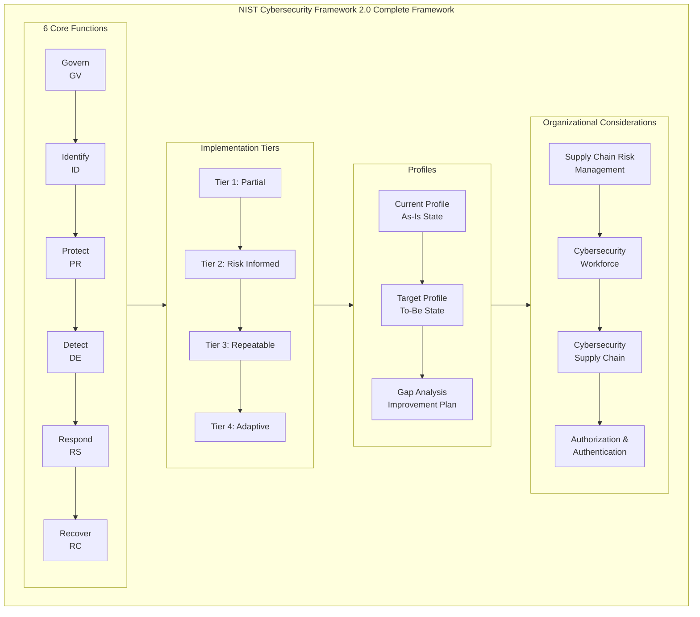
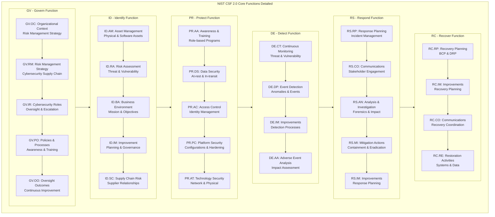
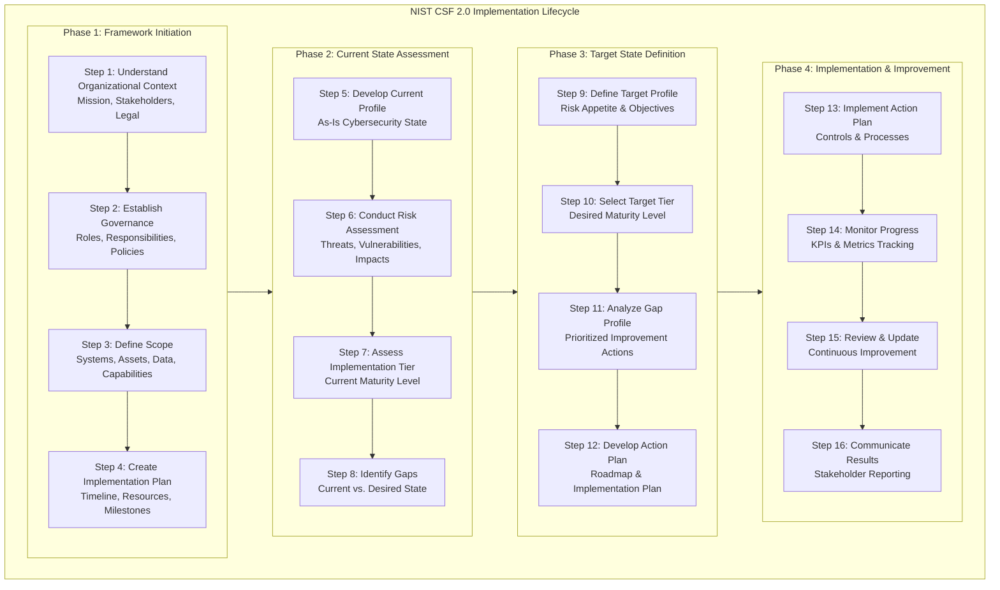
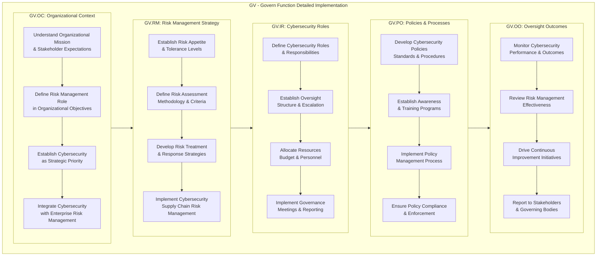
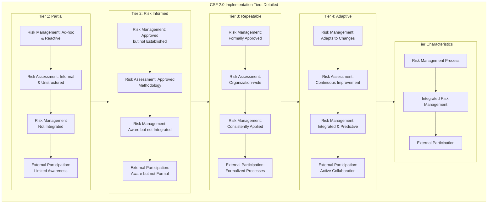
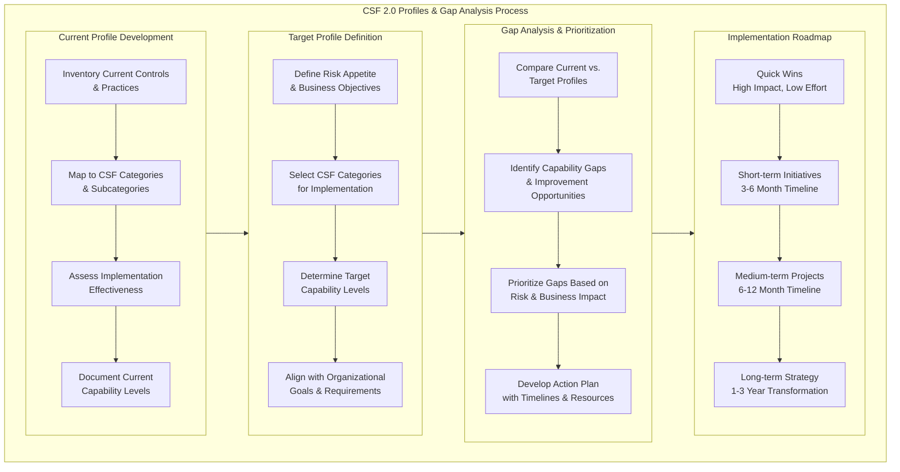

# NIST CSF 2.0: Comprehensive End-to-End Implementation Guide

## 1. NIST CSF 2.0 Complete Framework Overview



## 2. Detailed CSF 2.0 Core Functions Implementation



## 3. CSF 2.0 Implementation Lifecycle



## 4. CSF 2.0 Governance (GV) Function Detailed Implementation



## 5. CSF 2.0 Implementation Tiers Detailed



## 6. CSF 2.0 Profiles and Gap Analysis



## Detailed Implementation Guide

### 1. CSF 2.0 Governance (GV) Implementation

**Organizational Context (GV.OC) Implementation:**

```yaml
# GV.OC Organizational Context Implementation
GV_OC_Implementation:
  Organizational_Understanding:
    Mission_Statement: "Define how cybersecurity supports organizational mission"
    Stakeholder_Analysis:
      - "Internal: Board, executives, employees"
      - "External: Customers, regulators, partners"
    Legal_Requirements:
      - "GDPR, CCPA, HIPAA compliance"
      - "Industry-specific regulations"
      - "Contractual obligations"
  
  Strategic_Alignment:
    Business_Objectives_Mapping:
      - "Cybersecurity objectives aligned with business goals"
      - "Risk appetite statement development"
      - "Resource allocation strategy"
  
  Integration_Framework:
    Enterprise_Risk_Management:
      Process: "Integrate cybersecurity risk with ERM"
      Tools: "Unified risk register"
      Reporting: "Consolidated risk reporting to board"
```

**Risk Management Strategy (GV.RM) Implementation:**

```python
# GV.RM Risk Management Strategy Implementation
class RiskManagementStrategy:
    def __init__(self):
        self.risk_appetite = self.define_risk_appetite()
        self.assessment_methodology = self.define_methodology()
    
    def define_risk_appetite(self):
        """Define organizational risk appetite"""
        risk_appetite = {
            'financial_loss': {
                'tolerance': '$500,000',
                'appetite': 'Low for catastrophic events'
            },
            'reputation_damage': {
                'tolerance': 'Moderate media coverage',
                'appetite': 'Very low for brand impact'
            },
            'regulatory_compliance': {
                'tolerance': 'Zero tolerance for violations',
                'appetite': 'Full compliance required'
            },
            'data_breach': {
                'tolerance': '1000 records maximum',
                'appetite': 'Minimal customer data exposure'
            }
        }
        return risk_appetite
    
    def define_methodology(self):
        """Define risk assessment methodology"""
        methodology = {
            'qualitative_components': [
                'Expert judgment',
                'Industry benchmarking',
                'Stakeholder input'
            ],
            'quantitative_components': [
                'Financial impact calculations',
                'Probability assessments',
                'ROI analysis for controls'
            ],
            'risk_matrix': {
                'likelihood_scale': '5-point scale (Rare to Almost Certain)',
                'impact_scale': '5-point scale (Insignificant to Catastrophic)',
                'risk_levels': 'Low, Medium, High, Critical'
            }
        }
        return methodology
    
    def develop_treatment_strategies(self):
        """Develop risk treatment strategies"""
        strategies = {
            'avoid': 'Eliminate risk by discontinuing activity',
            'mitigate': 'Implement controls to reduce risk',
            'transfer': 'Share risk through insurance or contracts',
            'accept': 'Formally accept residual risk'
        }
        return strategies

# Example implementation
risk_strategy = RiskManagementStrategy()
print("Risk Appetite:", risk_strategy.risk_appetite)
print("Assessment Methodology:", risk_strategy.assessment_methodology)
```

### 2. Identify (ID) Function Implementation

**Asset Management (ID.AM) Implementation:**

```yaml
# ID.AM Asset Management Implementation
ID_AM_Implementation:
  Hardware_Asset_Inventory:
    Automated_Discovery:
      Tools: ["Nmap", "Lansweeper", "ServiceNow"]
      Frequency: "Continuous monitoring"
      Scope: "All network-connected devices"
    
    Asset_Attributes:
      Required_Fields:
        - "Device name and IP address"
        - "MAC address and serial number"
        - "Operating system and version"
        - "Owner and location"
        - "Criticality classification"
    
    Lifecycle_Management:
      Processes:
        - "Onboarding and provisioning"
        - "Configuration management"
        - "Decommissioning and disposal"
  
  Software_Asset_Management:
    Inventory_Tools: ["SCCM", "Jamf", "AWS Config"]
    License_Compliance: "Automated license tracking"
    Vulnerability_Mapping: "Software to CVE correlation"
  
  Data_Asset_Classification:
    Classification_Scheme:
      - "Public: No impact if disclosed"
      - "Internal: Limited impact if disclosed"
      - "Confidential: Significant impact if disclosed"
      - "Restricted: Severe impact if disclosed"
    
    Handling_Requirements:
      - "Encryption requirements by classification"
      - "Access controls and permissions"
      - "Retention and disposal policies"
```

**Risk Assessment (ID.RA) Implementation:**

```python
# ID.RA Risk Assessment Implementation
class RiskAssessment:
    def __init__(self):
        self.threat_intelligence_sources = self.setup_threat_intelligence()
        self.vulnerability_management = self.setup_vulnerability_management()
    
    def setup_threat_intelligence(self):
        """Configure threat intelligence sources"""
        sources = {
            'commercial_feeds': [
                'Recorded Future',
                'FireEye iSIGHT',
                'CrowdStrike Falcon X'
            ],
            'open_source': [
                'CISA Automated Indicator Sharing',
                'AlienVault OTX',
                'MISP threat sharing'
            ],
            'internal_sources': [
                'SIEM analytics',
                'IDS/IPS logs',
                'Firewall telemetry'
            ]
        }
        return sources
    
    def conduct_risk_assessment(self, assets):
        """Conduct comprehensive risk assessment"""
        risk_assessment_results = {}
        
        for asset in assets:
            # Identify threats
            threats = self.identify_threats(asset)
            
            # Assess vulnerabilities
            vulnerabilities = self.assess_vulnerabilities(asset)
            
            # Calculate risk
            risk_score = self.calculate_risk_score(asset, threats, vulnerabilities)
            
            risk_assessment_results[asset['id']] = {
                'asset': asset,
                'threats': threats,
                'vulnerabilities': vulnerabilities,
                'risk_score': risk_score,
                'risk_level': self.determine_risk_level(risk_score),
                'recommended_controls': self.recommend_controls(asset, risk_score)
            }
        
        return risk_assessment_results
    
    def calculate_risk_score(self, asset, threats, vulnerabilities):
        """Calculate risk score using threat and vulnerability data"""
        base_score = asset['criticality'] * 10
        
        threat_score = sum(threat['likelihood'] * threat['impact'] for threat in threats)
        vuln_score = sum(vuln['severity'] for vuln in vulnerabilities)
        
        return (base_score + threat_score + vuln_score) / 3

# Example usage
risk_assessor = RiskAssessment()
assets = [
    {'id': 'SRV-001', 'name': 'Database Server', 'criticality': 9},
    {'id': 'WS-045', 'name': 'User Workstation', 'criticality': 3}
]
assessment_results = risk_assessor.conduct_risk_assessment(assets)
```

### 3. Protect (PR) Function Implementation

**Access Control (PR.AC) Implementation:**

```yaml
# PR.AC Access Control Implementation
PR_AC_Implementation:
  Identity_Management:
    User_Lifecycle_Management:
      - "Automated user provisioning"
      - "Role-based access control (RBAC)"
      - "Regular access reviews"
      - "Automated deprovisioning"
    
    Authentication_Mechanisms:
      Primary: "Multi-factor authentication (MFA)"
      Secondary: "Biometric authentication"
      Fallback: "Security questions"
  
  Access_Enforcement:
    Network_Access:
      - "Network segmentation"
      - "Zero Trust architecture"
      - "VPN with MFA"
    
    Application_Access:
      - "Single Sign-On (SSO)"
      - "API security controls"
      - "Session management"
  
  Privileged_Access_Management:
    PAM_Solution: "CyberArk, BeyondTrust, or Thycotic"
    Just-in-Time_Access: "Time-bound privileged access"
    Session_Recording: "Monitor and record privileged sessions"
  
  Physical_Access:
    Access_Control_Systems: "Badge readers, biometrics"
    Visitor_Management: "Escorted access, temporary badges"
    Monitoring: "CCTV, security patrols"
```

**Data Security (PR.DS) Implementation:**

```python
# PR.DS Data Security Implementation
class DataSecurity:
    def __init__(self):
        self.encryption_standards = self.define_encryption_standards()
        self.data_classification = self.define_classification_scheme()
    
    def define_encryption_standards(self):
        """Define encryption standards for data protection"""
        standards = {
            'data_at_rest': {
                'databases': 'AES-256 encryption',
                'file_systems': 'BitLocker, LUKS, or equivalent',
                'backups': 'AES-256 with secure key management'
            },
            'data_in_transit': {
                'web_traffic': 'TLS 1.3 minimum',
                'email': 'S/MIME or PGP',
                'file_transfer': 'SFTP or HTTPS'
            },
            'key_management': {
                'solution': 'HSM or cloud KMS',
                'rotation': 'Annual key rotation',
                'backup': 'Secure key backup procedures'
            }
        }
        return standards
    
    def implement_data_protection(self, data_assets):
        """Implement data protection controls based on classification"""
        protection_measures = {}
        
        for asset in data_assets:
            classification = asset['classification']
            protection = self.get_protection_measures(classification)
            
            protection_measures[asset['id']] = {
                'asset': asset,
                'encryption_required': protection['encryption'],
                'access_controls': protection['access'],
                'monitoring_required': protection['monitoring'],
                'retention_period': protection['retention']
            }
        
        return protection_measures
    
    def get_protection_measures(self, classification):
        """Get protection measures based on data classification"""
        protection_matrix = {
            'public': {
                'encryption': 'Optional',
                'access': 'Minimal controls',
                'monitoring': 'Basic logging',
                'retention': 'Standard policy'
            },
            'internal': {
                'encryption': 'Recommended',
                'access': 'Role-based controls',
                'monitoring': 'Standard monitoring',
                'retention': '1-3 years'
            },
            'confidential': {
                'encryption': 'Required',
                'access': 'Strict RBAC + MFA',
                'monitoring': 'Enhanced monitoring',
                'retention': '3-7 years'
            },
            'restricted': {
                'encryption': 'Required + additional controls',
                'access': 'Privileged access only',
                'monitoring': 'Continuous monitoring',
                'retention': '7+ years with legal hold'
            }
        }
        return protection_matrix.get(classification, protection_matrix['internal'])

# Example implementation
data_security = DataSecurity()
data_assets = [
    {'id': 'DB-001', 'name': 'Customer Database', 'classification': 'confidential'},
    {'id': 'FILE-002', 'name': 'Marketing Materials', 'classification': 'public'}
]
protection_plan = data_security.implement_data_protection(data_assets)
```

### 4. Detect (DE) Function Implementation

**Continuous Monitoring (DE.CT) Implementation:**

```yaml
# DE.CT Continuous Monitoring Implementation
DE_CT_Implementation:
  Security_Monitoring_Architecture:
    SIEM_Platform: "Splunk, ArcSight, or Elastic"
    Log_Sources:
      - "Network devices: Firewalls, routers, switches"
      - "Security systems: IDS/IPS, antivirus, EDR"
      - "Servers: Windows, Linux, application logs"
      - "Cloud services: AWS CloudTrail, Azure Monitor"
  
  Threat_Detection:
    Signature-based: "Known threat patterns"
    Behavior-based: "Anomaly detection"
    ML-based: "Machine learning algorithms"
  
  Vulnerability_Scanning:
    Tools: ["Nessus", "Qualys", "OpenVAS"]
    Frequency: "Weekly for critical assets"
    Reporting: "Automated vulnerability reports"
  
  Configuration_Monitoring:
    Tools: ["Tripwire", "AWS Config", "Azure Policy"]
    Compliance_Checking: "CIS benchmarks, STIGs"
    Drift_Detection: "Automated configuration drift alerts"
```

**Event Detection (DE.DP) Implementation:**

```python
# DE.DP Event Detection Implementation
class EventDetection:
    def __init__(self):
        self.detection_rules = self.load_detection_rules()
        self.alerting_thresholds = self.set_alerting_thresholds()
    
    def load_detection_rules(self):
        """Load and configure detection rules"""
        rules = {
            'brute_force_detection': {
                'description': 'Detect multiple failed login attempts',
                'threshold': '5 failures in 10 minutes',
                'severity': 'High',
                'response': 'Block IP and alert security team'
            },
            'data_exfiltration': {
                'description': 'Detect large data transfers to external sites',
                'threshold': '100MB in 1 hour to unknown destinations',
                'severity': 'Critical',
                'response': 'Block transfer and initiate incident response'
            },
            'malware_activity': {
                'description': 'Detect malware signatures and behaviors',
                'threshold': 'Any positive detection',
                'severity': 'High',
                'response': 'Isolate system and scan for malware'
            },
            'privilege_escalation': {
                'description': 'Detect unauthorized privilege escalation attempts',
                'threshold': 'Any attempt outside change window',
                'severity': 'Critical',
                'response': 'Revoke privileges and investigate'
            }
        }
        return rules
    
    def monitor_events(self, event_stream):
        """Monitor event stream for suspicious activities"""
        detected_incidents = []
        
        for event in event_stream:
            for rule_name, rule in self.detection_rules.items():
                if self.matches_rule(event, rule):
                    incident = self.create_incident(event, rule)
                    detected_incidents.append(incident)
                    
                    # Trigger automated response if configured
                    if rule.get('auto_response'):
                        self.execute_auto_response(incident, rule)
        
        return detected_incidents
    
    def matches_rule(self, event, rule):
        """Check if event matches detection rule"""
        # Implementation would include:
        # - Pattern matching
        # - Threshold checking
        # - Behavioral analysis
        # - Correlation with other events
        return True  # Simplified for example
    
    def create_incident(self, event, rule):
        """Create standardized incident record"""
        incident = {
            'incident_id': self.generate_incident_id(),
            'timestamp': event['timestamp'],
            'event_data': event,
            'detection_rule': rule['description'],
            'severity': rule['severity'],
            'assigned_team': self.determine_response_team(rule['severity']),
            'status': 'New'
        }
        return incident

# Example usage
detection_system = EventDetection()
events = [
    {'timestamp': '2024-01-15T10:30:00Z', 'type': 'failed_login', 'source_ip': '192.168.1.100'},
    {'timestamp': '2024-01-15T10:35:00Z', 'type': 'large_transfer', 'destination': 'external.com'}
]
incidents = detection_system.monitor_events(events)
```

### 5. Respond (RS) Function Implementation

**Incident Response Planning (RS.RP) Implementation:**

```yaml
# RS.RP Incident Response Planning Implementation
RS_RP_Implementation:
  Incident_Response_Plan:
    Plan_Components:
      - "Incident classification criteria"
      - "Response team roles and responsibilities"
      - "Communication protocols"
      - "Containment strategies"
      - "Eradication procedures"
      - "Recovery processes"
  
  Response_Team_Structure:
    Team_Lead: "CISO or designated incident manager"
    Technical_Lead: "Senior security engineer"
    Communications_Lead: "PR or communications director"
    Legal_Advisor: "Legal department representative"
    IT_Operations: "System and network administrators"
  
  Communication_Plan:
    Internal_Communications:
      - "Executive management updates"
      - "Employee notifications"
      - "Technical team coordination"
    
    External_Communications:
      - "Customer notifications (if required)"
      - "Regulatory reporting"
      - "Law enforcement coordination"
      - "Media relations"
  
  Escalation_Procedures:
    Level_1: "Technical team - Initial response"
    Level_2: "Management - Significant incidents"
    Level_3: "Executive - Major incidents"
    Level_4: "Board/Crisis team - Critical incidents"
```

**Incident Response Automation:**

```python
# RS.MI Mitigation Actions Implementation
class IncidentResponse:
    def __init__(self):
        self.response_playbooks = self.load_response_playbooks()
        self.communication_templates = self.load_communication_templates()
    
    def load_response_playbooks(self):
        """Load incident response playbooks"""
        playbooks = {
            'malware_infection': {
                'containment': [
                    'Isolate affected systems from network',
                    'Disable user accounts if compromised',
                    'Block malicious IPs and domains'
                ],
                'eradication': [
                    'Run antivirus scans',
                    'Remove malicious files',
                    'Patch vulnerabilities'
                ],
                'recovery': [
                    'Restore from clean backups',
                    'Verify system integrity',
                    'Monitor for recurrence'
                ]
            },
            'data_breach': {
                'containment': [
                    'Revoke compromised credentials',
                    'Block exfiltration channels',
                    'Preserve evidence'
                ],
                'eradication': [
                    'Identify breach root cause',
                    'Eliminate attack vectors',
                    'Strengthen access controls'
                ],
                'recovery': [
                    'Reset affected credentials',
                    'Implement additional monitoring',
                    'Conduct security awareness training'
                ]
            },
            'denial_of_service': {
                'containment': [
                    'Activate DDoS mitigation service',
                    'Block attacking IP ranges',
                    'Rate limit traffic'
                ],
                'eradication': [
                    'Work with ISP for upstream blocking',
                    'Identify attack source',
                    'Implement additional filtering'
                ],
                'recovery': [
                    'Gradually restore services',
                    'Monitor for attack resumption',
                    'Update incident response plan'
                ]
            }
        }
        return playbooks
    
    def execute_response(self, incident_type, severity):
        """Execute incident response based on type and severity"""
        if incident_type not in self.response_playbooks:
            return {"error": "No playbook for incident type"}
        
        playbook = self.response_playbooks[incident_type]
        response_actions = []
        
        # Execute containment actions
        for action in playbook['containment']:
            response_actions.append({
                'phase': 'containment',
                'action': action,
                'status': 'executed',
                'timestamp': datetime.now()
            })
        
        # Execute eradication actions
        for action in playbook['eradication']:
            response_actions.append({
                'phase': 'eradication',
                'action': action,
                'status': 'executed',
                'timestamp': datetime.now()
            })
        
        # Execute recovery actions
        for action in playbook['recovery']:
            response_actions.append({
                'phase': 'recovery',
                'action': action,
                'status': 'executed',
                'timestamp': datetime.now()
            })
        
        return {
            'incident_type': incident_type,
            'severity': severity,
            'response_actions': response_actions,
            'communications_sent': self.send_communications(incident_type, severity)
        }
    
    def send_communications(self, incident_type, severity):
        """Send communications based on incident type and severity"""
        communications = []
        
        if severity in ['high', 'critical']:
            communications.append({
                'audience': 'executive_team',
                'message': f'Critical security incident: {incident_type}',
                'channel': 'email_alert'
            })
        
        if incident_type == 'data_breach':
            communications.append({
                'audience': 'legal_team',
                'message': 'Potential data breach detected',
                'channel': 'secure_message'
            })
        
        return communications

# Example implementation
incident_response = IncidentResponse()
response_result = incident_response.execute_response('malware_infection', 'high')
```

### 6. Recover (RC) Function Implementation

**Recovery Planning (RC.RP) Implementation:**

```yaml
# RC.RP Recovery Planning Implementation
RC_RP_Implementation:
  Recovery_Strategies:
    System_Recovery:
      - "Backup restoration procedures"
      - "System rebuild processes"
      - "Data validation checks"
    
    Business_Process_Recovery:
      - "Alternative process activation"
      - "Manual workarounds"
      - "Gradual service restoration"
  
  Recovery_Testing:
    Test_Types:
      - "Tabletop exercises: Quarterly"
      - "Component recovery tests: Semi-annually"
      - "Full recovery tests: Annually"
    
    Success_Criteria:
      - "RTO achievement: Within defined timeframe"
      - "RPO achievement: Data loss within tolerance"
      - "Functionality verification: All critical functions operational"
  
  Continuous_Improvement:
    Lessons_Learned:
      Process: "Post-incident review meetings"
      Documentation: "Updated recovery procedures"
      Training: "Revised training materials"
```

**Recovery Automation:**

```python
# RC.RE Restoration Activities Implementation
class RecoveryOperations:
    def __init__(self):
        self.recovery_procedures = self.load_recovery_procedures()
        self.validation_checks = self.load_validation_checks()
    
    def load_recovery_procedures(self):
        """Load system recovery procedures"""
        procedures = {
            'database_recovery': {
                'steps': [
                    'Verify backup integrity',
                    'Restore to recovery environment',
                    'Apply transaction logs',
                    'Validate data consistency',
                    'Switch to production'
                ],
                'estimated_time': '2-4 hours',
                'success_criteria': 'Data consistency verified'
            },
            'application_recovery': {
                'steps': [
                    'Provision new servers',
                    'Install application components',
                    'Restore configuration',
                    'Test functionality',
                    'Update DNS records'
                ],
                'estimated_time': '1-2 hours',
                'success_criteria': 'Application responding normally'
            },
            'network_recovery': {
                'steps': [
                    'Activate backup circuits',
                    'Reconfigure routing',
                    'Update firewall rules',
                    'Test connectivity',
                    'Monitor performance'
                ],
                'estimated_time': '30-60 minutes',
                'success_criteria': 'Network connectivity restored'
            }
        }
        return procedures
    
    def execute_recovery(self, system_type, recovery_point):
        """Execute recovery procedure for specific system"""
        if system_type not in self.recovery_procedures:
            return {"error": "No recovery procedure for system type"}
        
        procedure = self.recovery_procedures[system_type]
        recovery_log = []
        
        # Execute recovery steps
        for step in procedure['steps']:
            recovery_log.append({
                'step': step,
                'status': 'completed',
                'timestamp': datetime.now(),
                'details': f'Executed: {step}'
            })
        
        # Validate recovery
        validation_results = self.validate_recovery(system_type)
        
        return {
            'system_type': system_type,
            'recovery_point': recovery_point,
            'recovery_log': recovery_log,
            'validation_results': validation_results,
            'recovery_status': 'successful' if validation_results['all_passed'] else 'failed'
        }
    
    def validate_recovery(self, system_type):
        """Validate successful recovery"""
        validation_checks = self.validation_checks.get(system_type, [])
        results = []
        
        for check in validation_checks:
            check_result = self.execute_validation_check(check)
            results.append({
                'check': check['description'],
                'result': check_result,
                'timestamp': datetime.now()
            })
        
        all_passed = all(result['result'] for result in results)
        
        return {
            'validation_checks': results,
            'all_passed': all_passed
        }

# Example implementation
recovery_ops = RecoveryOperations()
recovery_result = recovery_ops.execute_recovery('database_recovery', '2024-01-15T08:00:00Z')
```

## 7. CSF 2.0 Implementation Assessment & Metrics

**CSF Implementation Assessment Dashboard:**

```yaml
# CSF 2.0 Implementation Assessment Dashboard
CSF_Assessment_Dashboard:
  Overall_CSF_Score: "78%"
  Function_Scores:
    Govern: "85%"
    Identify: "72%"
    Protect: "80%"
    Detect: "65%"
    Respond: "75%"
    Recover: "70%"
  
  Key_Metrics:
    Risk_Reduction: "45% reduction in high-risk findings"
    Control_Effectiveness: "92% of controls operating effectively"
    Incident_Response_Time: "Mean time to detect: 2.5 hours"
    Recovery_Objectives: "RTO achievement: 95%, RPO achievement: 98%"
  
  Improvement_Initiatives:
    High_Priority:
      - "Enhance threat detection capabilities"
      - "Implement advanced endpoint protection"
      - "Develop supply chain risk management program"
    Medium_Priority:
      - "Expand security awareness training"
      - "Improve vulnerability management process"
      - "Enhance backup and recovery testing"
```

This comprehensive NIST CSF 2.0 implementation guide provides organizations with a complete framework for implementing and maturing their cybersecurity program using the updated CSF 2.0 framework, including practical implementation examples, automation scripts, and assessment methodologies.

Great question! Let me explain where and why you would use these YAML and Python scripts in your cybersecurity implementation.

## Where to Use These Scripts

### 1. **Infrastructure as Code (IaC) Platforms**
```yaml
# Use Case: Cloud Security Configuration
# Platform: AWS CloudFormation, Azure ARM, Terraform
Resources:
  SecurityGroup:
    Type: AWS::EC2::SecurityGroup
    Properties:
      GroupDescription: "CSF 2.0 Compliant Security Group"
      SecurityGroupIngress:
        - IpProtocol: tcp
          FromPort: 443
          ToPort: 443
          CidrIp: 0.0.0.0/0
```

### 2. **CI/CD Pipeline Integration**
```yaml
# Use Case: Automated Security Testing
# Platform: GitHub Actions, GitLab CI, Jenkins
name: CSF 2.0 Security Pipeline
on: [push, pull_request]
jobs:
  security-scan:
    runs-on: ubuntu-latest
    steps:
      - uses: actions/checkout@v3
      - name: Run Risk Assessment
        run: python risk_assessment.py
      - name: Validate Controls
        run: python control_validator.py
```

### 3. **Security Orchestration Platforms**
```yaml
# Use Case: SOAR (Security Orchestration, Automation, Response)
# Platform: Splunk Phantom, IBM Resilient
playbooks:
  incident_response:
    - name: "Contain Malware Infection"
      action: "isolate_endpoint"
      parameters:
        endpoint_id: "${incident.endpoint}"
    - name: "Collect Forensic Data"
      action: "collect_evidence"
```

### 4. **Configuration Management**
```yaml
# Use Case: System Hardening
# Platform: Ansible, Puppet, Chef
- name: Harden Linux servers per CIS benchmarks
  hosts: linux_servers
  tasks:
    - name: Ensure password expiration
      ansible.builtin.lineinfile:
        path: /etc/login.defs
        regexp: '^PASS_MAX_DAYS'
        line: 'PASS_MAX_DAYS 90'
```

## Why Use These Scripts - Practical Benefits

### 1. **Automation & Efficiency**
```python
# Example: Automated Risk Assessment
# Why: Saves hundreds of manual hours
def automated_risk_assessment():
    """Replaces manual spreadsheet-based risk assessments"""
    assets = discover_network_assets()  # Auto-discovers assets
    risks = assess_vulnerabilities(assets)  # Auto-calculates risk
    generate_reports(risks)  # Auto-generates executive reports
    # Time saved: 40+ hours per assessment
```

### 2. **Consistency & Standardization**
```yaml
# Example: Standardized Security Configuration
# Why: Eliminates configuration drift
security_baselines:
  windows:
    password_policy:
      min_length: 12
      complexity: true
      history: 5
  linux:
    ssh_config:
      permit_root_login: no
      password_authentication: no
  # Ensures all systems meet CSF 2.0 standards
```

### 3. **Continuous Compliance**
```python
# Example: Real-time Compliance Monitoring
# Why: Proactive vs reactive compliance
class ComplianceMonitor:
    def check_csf_controls(self):
        """Continuously monitors CSF control effectiveness"""
        for control in self.csf_controls:
            status = self.validate_control(control)
            if not status['compliant']:
                self.alert_security_team(control, status)
        # Provides real-time compliance status vs annual audits
```

### 4. **Scalability**
```yaml
# Example: Enterprise-wide Deployment
# Why: Scales from 10 to 10,000 systems
deployment_strategy:
  phased_approach:
    phase_1: ["critical_servers", "50 systems"]
    phase_2: ["all_servers", "500 systems"] 
    phase_3: ["workstations", "10,000 systems"]
  # Same scripts work at any scale
```

## Specific Implementation Locations

### 1. **YAML Files - Configuration & Documentation**
```yaml
# Location: /security/csf_implementation/
# File: csf_governance.yaml
GV_OC_Organizational_Context:
  business_objectives:
    - "Protect customer data per GDPR"
    - "Maintain 99.9% service availability"
  risk_appetite: "Low for data breaches"
  compliance_requirements: ["GDPR", "NIS2", "SOX"]
# Usage: Source of truth for security configuration
```

### 2. **Python Scripts - Automation & Analysis**
```python
# Location: /scripts/security_automation/
# File: risk_calculator.py
# Usage: Scheduled task or API endpoint
def calculate_risk_score():
    """Called by:
    - Daily risk dashboard updates
    - CI/CD pipeline risk gates
    - Management reporting
    """
    return risk_score

if __name__ == "__main__":
    # Run as scheduled job
    calculate_risk_score()
```

### 3. **CI/CD Pipeline Integration**
```yaml
# Location: .github/workflows/security.yml
# Usage: Automated security testing
name: CSF 2.0 Security Validation
on:
  schedule:
    - cron: '0 6 * * 1'  # Weekly on Monday 6 AM
  push:
    branches: [main]

jobs:
  csf-validation:
    runs-on: ubuntu-latest
    steps:
      - name: Check CSF Controls
        run: |
          python scripts/control_validator.py
          python scripts/risk_assessor.py
```

### 4. **Security Monitoring Integration**
```python
# Location: /monitoring/security_dashboard/
# File: csf_metrics_collector.py
# Usage: Real-time security dashboard
class CSFMetrics:
    def collect_metrics(self):
        """Feeds data to:
        - Splunk dashboards
        - Grafana security metrics
        - Executive reporting
        """
        metrics = {
            'governance_score': self.calculate_gv_score(),
            'protection_coverage': self.calculate_pr_coverage(),
            'detection_effectiveness': self.calculate_de_score()
        }
        return metrics
```

## Practical Deployment Examples

### 1. **Risk Management Department**
```python
# File: risk_department/quarterly_assessment.py
# Usage: Quarterly risk assessment process
def quarterly_risk_assessment():
    """Replaces manual process:
    - Automated asset discovery (vs manual inventory)
    - Auto-calculated risk scores (vs subjective ratings)
    - Automated reporting (vs manual report creation)
    """
    assets = automated_discovery()
    risks = calculate_risks(assets)
    generate_quarterly_report(risks)
    
# Run: python quarterly_assessment.py
# Output: Ready-to-present risk report
```

### 2. **SOC (Security Operations Center)**
```yaml
# File: soc/incident_response_playbooks/
# Usage: Standardized incident response
incident_response:
  malware_outbreak:
    detection:
      - query: "signature:malware OR behavior:suspicious"
      - alert: "HIGH_SEVERITY"
    containment:
      - action: "isolate_endpoint"
      - action: "block_ioc"
    eradication:
      - action: "run_antivirus"
      - action: "apply_patches"
```

### 3. **IT Operations Team**
```yaml
# File: operations/security_baselines.yaml
# Usage: System hardening standards
windows_hardening:
  services:
    - name: "Telnet"
      state: "disabled"
    - name: "SMBv1"
      state: "disabled"
  registry:
    - path: "HKLM\SYSTEM\CurrentControlSet\Control\Lsa"
      value: "RestrictAnonymous"
      data: 1
```

### 4. **Compliance Team**
```python
# File: compliance/csf_evidence_collector.py
# Usage: Audit evidence collection
def collect_audit_evidence():
    """Automates evidence collection for:
    - ISO 27001 audits
    - SOC 2 examinations
    - Regulatory compliance
    """
    evidence = {
        'policies': collect_policies(),
        'configs': collect_configurations(),
        'logs': collect_security_logs()
    }
    return evidence
```

## Integration with Existing Tools

### 1. **SIEM Integration**
```python
# File: integrations/siem_connector.py
# Usage: Send CSF metrics to SIEM
def send_csf_metrics_to_siem():
    metrics = calculate_csf_metrics()
    siem_client.send({
        'index': 'security_metrics',
        'data': metrics
    })
# Scheduled: Runs every 4 hours
```

### 2. **GRC Platform Integration**
```yaml
# File: integrations/grc_mapping.yaml
# Usage: Map CSF to other frameworks
framework_mappings:
  csf_to_nist_800_53:
    PR.AC-1: "AC-2 Account Management"
    PR.DS-1: "SC-28 Protection of Information at Rest"
  csf_to_iso_27001:
    ID.AM-1: "A.8.1.1 Inventory of Assets"
    PR.AC-3: "A.9.2.1 User Registration and De-registration"
```

### 3. **Cloud Security Integration**
```python
# File: cloud/aws_csf_compliance.py
# Usage: Check cloud compliance with CSF
def check_aws_csf_compliance():
    """Validates AWS environment against CSF"""
    checks = {
        'PR.AC-1': check_iam_policies(),
        'PR.DS-1': check_encryption_settings(),
        'DE.CT-1': check_cloudtrail_logging()
    }
    return checks
```

## Key Benefits Summary

### **Why YAML?**
- **Human-readable** - Easy for security teams to understand and modify
- **Version controllable** - Track changes in Git
- **Tool agnostic** - Works with multiple platforms
- **Structured data** - Perfect for configurations and policies

### **Why Python?**
- **Automation** - Replace manual processes
- **Integration** - Connect different security tools
- **Analysis** - Complex calculations and data processing
- **Flexibility** - Can be extended and customized

### **Where to Start Implementation**

1. **Immediate Use**:
   ```bash
   # Start with risk assessment
   python risk_assessment.py --scope critical_assets
   
   # Validate current state
   python control_validator.py --framework csf_2.0
   ```

2. **CI/CD Integration**:
   ```yaml
   # Add to your existing pipeline
   - name: CSF Security Check
     run: python csf_compliance_check.py
   ```

3. **Monthly Reporting**:
   ```python
   # Schedule monthly CSF assessment
   python monthly_csf_report.py --email-executives
   ```

These scripts are designed to be **practical, actionable, and integratable** into your existing security operations, providing immediate value while building toward a comprehensive CSF 2.0 implementation.

