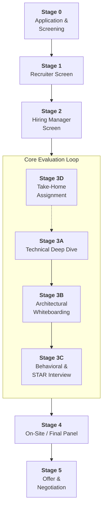
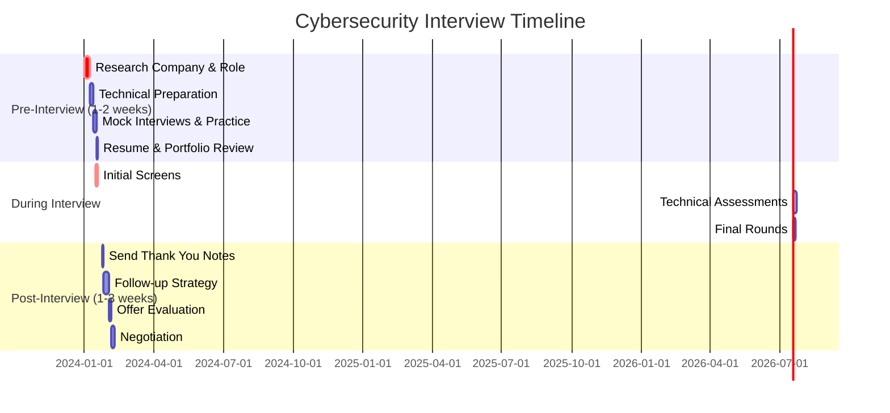
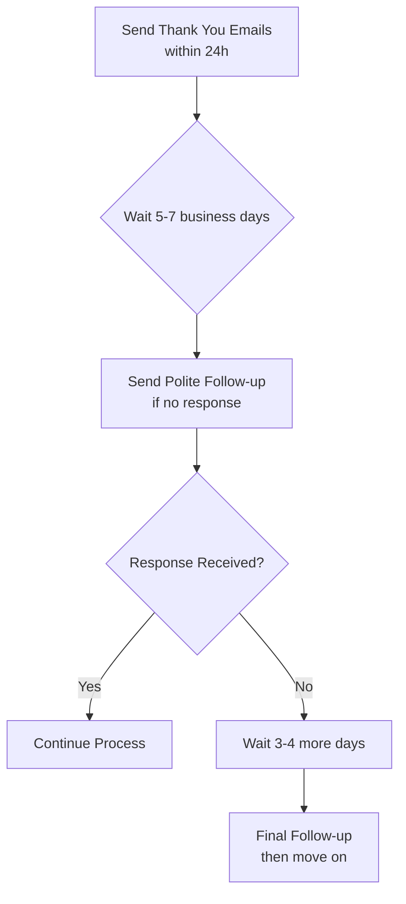
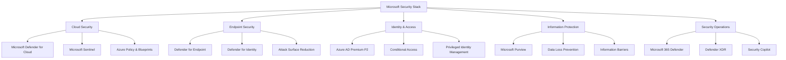

# Interview Reference Guide for High-Demand Cyber Security Roles (2026+)


### Master Interview Journey for Cybersecurity Roles

The following Mermaid.js diagram illustrates the typical, multi-stage interview process. While the specific technical questions change, the structure remains remarkably consistent across these senior and specialized roles.



**Diagram Explanation:**
*   **Stages 0-2:** These are filtering stages focused on logistics, basic qualifications, and cultural fit with the immediate team.
*   **Stage 3 (Core Loop):** This is the heart of the process. Candidates will go through a combination of 3A, 3B, 3C, and sometimes 3D. The order may vary.
*   **Stage 4:** This often repeats elements of Stage 3 with different interviewers (peers, senior leadership, cross-functional partners) to get a 360-degree view.
*   **Stage 5:** The final hurdle, focusing on fit with leadership and compensation.

---

### Detailed Guide: Role 0 - Security Architect

This guide serves as the foundational template. Other roles will build upon this with role-specific nuances.

#### **Role Overview**
A Security Architect designs the security framework for an entire organization. They translate business requirements and risk appetite into a coherent set of security controls and strategic blueprints. This is a senior, strategic role requiring deep technical knowledge and strong communication skills.

#### **Interview Stages & Formats (in detail)**

1.  **Recruiter Screen (30 mins):**
    *   **Format:** Phone/Video call.
    *   **Focus:** Your resume, career motivations, salary expectations, and right to work.
    *   **Goal:** Confirm basic fit and logistics.

2.  **Hiring Manager Screen (45-60 mins):**
    *   **Format:** Video call with the hiring manager (Director of Security, CISO, etc.).
    *   **Focus:** Your background, high-level architectural philosophy, and team fit.
    *   **Goal:** Assess strategic thinking and initial cultural alignment.

3.  **Technical & Behavioral Assessment (Core Loop):**
    *   **3A. Technical Deep Dive (60-90 mins):**
        *   **Format:** Video call with a senior engineer/architect.
        *   **Focus:** Deep, conceptual knowledge across all security domains.
        *   **Sample Questions:**
            *   "Explain the key differences between symmetric and asymmetric cryptography. Where would you use one over the other in a modern enterprise?"
            *   "Walk me through how you would design a Zero Trust network architecture for a legacy company with on-premise data centers and a new AWS footprint."
            *   "How does OAuth 2.0 and OpenID Connect (OIDC) work? What are the common security pitfalls in their implementation?"
            *   "What are the security considerations when moving from a monolithic application to a microservices architecture?"

    *   **3B. Architectural Whiteboarding (60-90 mins):**
        *   **Format:** Video call with a shared whiteboard (e.g., Miro, Lucidchart).
        *   **Focus:** Designing a system under specific constraints.
        *   **Sample Prompt:** *"Design a secure e-commerce platform for a B2C company. They need to process payments, store customer data, and have a public API for partners. Consider all layers: network, application, data, and identity. Be prepared to discuss your trade-offs."*
        *   **What they assess:** Your thought process, ability to ask clarifying questions, prioritization of risks, and communication of complex ideas.

    *   **3C. Behavioral Interview (60 mins):**
        *   **Format:** Video call with Hiring Manager or Senior Leader.
        *   **Focus:** Past behavior using the **STAR method (Situation, Task, Action, Result)**.
        *   **Sample Questions:**
            *   "Tell me about a time you had to convince a non-technical executive to fund a major security initiative."
            *   "Describe a situation where you made a significant architectural mistake. How did you handle it?"
            *   "Give me an example of a time you had to balance security requirements with tight business deadlines."

4.  **On-Site / Final Panel (3-4 hours):**
    *   **Format:** A series of back-to-back interviews, often in-person or over video.
    *   **Sessions:**
        *   **Peer Interview:** With other architects.
        *   **Cross-Functional Interview:** With an engineering or product manager.
        *   **"Bar Raiser" / Leadership Interview:** With a senior leader from another team to assess overall fit with company standards.

5.  **Offer & Negotiation:**
    *   **Format:** Call with Recruiter and Hiring Manager.
    *   **Focus:** Presenting the offer and discussing details.

---
Here are the most commonly asked interview FAQs across technical roles (Cloud, Cybersecurity, DevSecOps, IAM, Architecture).
Each answer is short, concise, and impressive — perfect for interviews.

⸻

✅ Top Interview FAQs + Best Short Answers

⸻

1. Tell me about yourself.

Answer:
I’m a technology professional specialising in cloud, security, and automation. I focus on designing secure, scalable architectures and improving reliability through DevSecOps practices. I enjoy solving complex technical challenges, simplifying systems, and driving measurable improvements in security and performance.

⸻

2. What are your strengths?

Answer:
Strong problem-solving, fast learning, and the ability to translate complex technical issues into clear, actionable solutions. I’m also highly execution-driven and deliver reliably under pressure.

⸻

3. What are your weaknesses?

Answer:
I sometimes take on too much independently, but I’ve improved by delegating earlier and using structured collaboration to move faster.

⸻

4. Why should we hire you?

Answer:
I bring a combination of hands-on technical depth and an architecture-level understanding. I solve problems quickly, automate where possible, and consistently deliver secure, stable solutions aligned with business needs.

⸻

5. Describe a challenging technical issue you solved.

Answer:
I resolved a critical outage by quickly isolating a misconfigured identity policy, restoring services, and implementing guardrails like automated validation and monitoring to prevent recurrence.

⸻

6. How do you handle pressure or workload spikes?

Answer:
I prioritise, break tasks into small deliverables, automate anything repeatable, and maintain clear communication. This helps maintain quality even under tight deadlines.

⸻

7. Have you ever disagreed with a team member? What did you do?

Answer:
Yes — I focus on facts, data, and the objective. I present evidence, listen actively, and aim for a solution that meets both technical and business goals.

⸻

8. Explain a project where you added measurable value.

Answer:
I automated security checks in CI/CD, reducing manual review time by 70% and increasing deployment reliability. This directly improved delivery speed and security posture.

⸻

9. What motivates you?

Answer:
Building impactful solutions, continuous learning, and solving problems that make systems more secure, reliable, and efficient.

⸻

10. Where do you see yourself in 5 years?

Answer:
Leading high-impact cloud/security architecture initiatives, mentoring teams, and contributing to enterprise-wide transformation projects.

⸻

11. How do you keep yourself updated?

Answer:
Hands-on labs, vendor docs, TryHackMe, Microsoft Learn, threat intel feeds, and experimenting in my own test environments.

⸻

12. Describe your approach to troubleshooting.

Answer:
Reproduce the issue, isolate the failing component, check logs/metrics, test hypotheses quickly, apply the fix, then implement prevention mechanisms.

⸻

13. What do you know about our company?

(Short answer structure)
Answer:
You’re a leader in X. You’re investing heavily in Y initiative. Your focus on Z matches my experience and interests, especially in modernising security and automation.

⸻

14. Tell me about a time you showed leadership.

Answer:
I led a security automation initiative across teams, aligned everyone on priorities, delivered the pipeline, and reduced escalations significantly.

⸻

15. Why are you leaving your current job?

Answer:
I’m looking for a role where I can work on larger-scale architecture, deeper security challenges, and make a stronger business impact.

⸻

16. What is your working style?

Answer:
Proactive, transparent, and collaborative. I keep communication clear, focus on outcomes, and move quickly with ownership.

⸻

17. Tell me about a mistake you made.

Answer:
I once deployed a config too quickly without a peer review. I fixed it immediately and introduced a mandatory automation check to avoid similar issues.

⸻

18. What are your salary expectations?

Answer:
I’m flexible and open. I prefer to understand the responsibilities first and then align with a fair, market-driven range.

⸻

19. How do you handle ambiguity?

Answer:
I clarify objectives, identify constraints, propose options quickly, and iterate fast with feedback.

⸻

20. Any questions for us?

Answer:
Yes — what does success look like in the first 90 days for this role?

⸻
# Top Cybersecurity Interview FAQs with Concise, Impressive Answers

## **Universal Cybersecurity Questions**

### **1. "Tell me about yourself."**
**Concise Answer:** "I'm a cloud security architect with 8 years of experience, specializing in building secure multi-cloud environments. Currently, I lead security for our Azure and AWS infrastructure, where I've reduced security incidents by 70% through automated compliance controls. I'm particularly passionate about Zero Trust architecture and I'm excited about this opportunity because of your company's innovative approach to cloud security."

### **2. "What's your greatest strength?"**
**Concise Answer:** "My ability to translate complex security requirements into practical engineering solutions. For example, I recently implemented a Zero Trust framework that eliminated VPN dependencies while improving our security posture. I bridge the gap between security theory and operational reality."

### **3. "What's your greatest weakness?"**
**Concise Answer:** "Early in my career, I tended to over-engineer security solutions. I've learned to balance perfect security with business practicality by implementing risk-based prioritization. Now I focus on the most critical controls first and iterate based on actual threat intelligence."

### **4. "Why do you want to work here?"**
**Concise Answer:** "Your company's proactive approach to [mention specific technology or project] aligns with my expertise in [your skill]. I'm particularly impressed by your [specific achievement] and believe my experience in [your relevant experience] can help accelerate your security roadmap."

---

## **Technical Questions by Role**

### **CLOUD SECURITY ARCHITECT**

#### **5. "Explain Zero Trust in simple terms."**
**Concise Answer:** "Never trust, always verify. Instead of assuming everything inside our network is safe, we verify every access request regardless of location. It's like moving from a castle with walls to a modern building where every door requires keycard access and security checks."

#### **6. "How do you secure a public cloud environment?"**
**Concise Answer:** "Three pillars: Identity as the new perimeter with strict access controls, data protection through encryption and classification, and continuous monitoring for threats and misconfigurations. I implement guardrails, not gates - security that enables rather than blocks."

#### **7. "What's the shared responsibility model?"**
**Concise Answer:** "Cloud provider secures the infrastructure, we secure everything we put on it. AWS/Azure handles physical security and hypervisor, we're responsible for our data, access controls, and configurations. Most breaches happen in our area of responsibility."

### **MICROSOFT SECURITY SPECIALIST**

#### **8. "How does Microsoft Defender for Cloud work?"**
**Concise Answer:** "It's our cloud security posture management tool that continuously assesses our Azure and AWS resources against compliance benchmarks, provides security recommendations, and detects threats using behavioral analytics and ML. It unifies CSPM and CWPP in one platform."

#### **9. "What's the value of Microsoft Sentinel?"**
**Concise Answer:** "Sentinel is our cloud-native SIEM that uses AI to correlate alerts across all our data sources. Its key advantage is built-in ML for detecting multi-stage attacks and automated playbooks that reduce our response time from hours to minutes."

#### **10. "Explain Conditional Access."**
**Concise Answer:** "It's our dynamic access control system that evaluates risk factors like user location, device compliance, and application sensitivity before granting access. For example, we block access from unmanaged devices or require MFA for sensitive data."

### **AWS SECURITY ENGINEER**

#### **11. "How do you secure AWS IAM?"**
**Concise Answer:** "I enforce least privilege using roles instead of users, require MFA for all human accounts, implement permission boundaries, and use IAM Access Analyzer to validate resource policies. Regular access reviews catch permission drift."

#### **12. "What's your approach to S3 security?"**
**Concise Answer:** "All buckets private by default, no public access blocks enabled, encryption both at rest and in transit, and Macie for sensitive data discovery. We use S3 Access Points for granular control and CloudTrail logs all API activity."

#### **13. "How do you use AWS Security Hub?"**
**Concise Answer:** "It's our central security dashboard that aggregates findings from GuardDuty, Macie, Inspector, and AWS Config. We've customized it with our own security standards and automated responses to critical findings."

---

## **Behavioral & Scenario Questions**

### **14. "Describe a time you handled a security incident."**
**Concise Answer:** "When we detected ransomware activity, I led containment by isolating affected systems within 15 minutes. We restored from immutable backups while preserving evidence. The key was our prepared playbooks - we had business continuity within 4 hours and implemented additional controls to prevent recurrence."

### **15. "How do you handle pushback from developers on security requirements?"**
**Concise Answer:** "I shift from saying 'no' to 'here's how.' Recently, developers resisted security scanning slowing their pipeline. I worked with them to optimize the process, implemented security-as-code templates, and showed how catching vulnerabilities early actually accelerated their releases."

### **16. "Tell me about a security project you led."**
**Concise Answer:** "I led our Zero Trust implementation, replacing VPNs with identity-based access. We deployed Conditional Access policies and Azure AD Application Proxy, which eliminated our VPN costs while improving security. User satisfaction increased because they could work seamlessly from anywhere."

### **17. "How do you stay current with security threats?"**
**Concise Answer:** "I have a structured approach: daily threat intelligence feeds, weekly CVE monitoring for our tech stack, participating in security communities, and monthly purple team exercises. I also contribute to open-source security tools to stay hands-on."

---

## **Architecture & Design Questions**

### **18. "Design a secure cloud network."**
**Concise Answer:** "Hub-and-spoke architecture with centralized security services. The hub contains firewalls, bastion hosts, and monitoring. Spokes host workloads with network segmentation. All traffic flows through security inspection, and we use service endpoints to avoid public internet exposure."

### **19. "How would you secure a hybrid environment?"**
**Concise Answer:** "Azure Arc extends Azure security controls to on-prem servers. We use Azure AD for unified identity, Defender for Cloud for consistent posture management, and Sentinel for centralized monitoring. This gives us single-pane-of-glass security regardless of where workloads live."

### **20. "What's your approach to container security?"**
**Concise Answer:** "Secure the pipeline: scan images in CI/CD, sign approved images, run with least privilege in Kubernetes, and use network policies for segmentation. We use Azure Defender for Kubernetes for runtime protection and drift detection."

---

## **Risk & Compliance Questions**

### **21. "How do you prioritize security risks?"**
**Concise Answer:** "Risk = Likelihood × Impact. I use quantitative assessment based on real threat data and business impact. We focus on crown jewels first - the assets that would cause significant business disruption if compromised."

### **22. "Explain your experience with compliance frameworks."**
**Concise Answer:** "I've implemented NIST CSF and CIS Controls across cloud environments. For compliance automation, I use Azure Policy for Azure and AWS Config for AWS, with continuous monitoring in Security Hub and Defender for Cloud."

### **23. "How do you measure security effectiveness?"**
**Concise Answer:** "Key metrics: Mean Time to Detect (MTTD), Mean Time to Respond (MTTR), vulnerability recurrence rates, and security control coverage. We track reduction in high-risk findings and improvement in automated response rates."

---

## **Quick-Fire Technical Questions**

### **24. "What's the difference between SAST and DAST?"**
**Concise Answer:** "SAST scans source code for vulnerabilities, DAST tests running applications. SAST finds issues early, DAST finds runtime issues. We use both in our CI/CD pipeline."

### **25. "Explain defense in depth."**
**Concise Answer:** "Multiple layers of security controls so if one fails, others provide protection. For example: network controls, identity verification, application security, and data encryption all working together."

### **26. "What is MITRE ATT&CK?"**
**Concise Answer:** "A knowledge base of adversary tactics and techniques based on real-world observations. We use it to map our detection coverage and identify security gaps."

### **27. "How do you secure APIs?"**
**Concise Answer:** "API gateway for rate limiting and authentication, validate all inputs, implement proper authentication like OAuth 2.0, and monitor for abnormal usage patterns. We use Azure API Management with security policies."

### **28. "What's your experience with Infrastructure as Code security?"**
**Concise Answer:** "I use Terraform with security scanning in pipeline, enforce policies with Checkov, and maintain secure golden templates. We've reduced misconfigurations by 80% through automated security validation."

### **29. "Explain OAuth 2.0 flows."**
**Concise Answer:** "Authorization Code flow for web apps, Client Credentials for service-to-service, and Device flow for limited-input devices. We always use PKCE for mobile and public clients to prevent code interception attacks."

### **30. "How do you handle secrets management?"**
**Concise Answer:** "Azure Key Vault for Azure workloads, AWS Secrets Manager for AWS, and HashiCorp Vault for hybrid. Never store secrets in code - always reference from secure vaults with managed identities for access."

---

## **Questions to Ask Interviewers**

### **Technical Team:**
- "What's your biggest technical debt in security and how are you addressing it?"
- "How do you balance security requirements with development velocity?"

### **Hiring Manager:**
- "What security initiative would be the top priority for this role in the first 90 days?"
- "How do you measure the success of your security team?"

### **Leadership:**
- "What's the organization's risk appetite and how is it communicated?"
- "How does security contribute to business objectives beyond just risk reduction?"

---

## **Key Success Strategies**

### **For Concise Answers:**
- **30-90 second rule:** Keep answers under 90 seconds, ideally 30-60
- **Problem-Action-Result structure:** Always end with measurable outcomes
- **One concept per answer:** Don't try to cover everything at once
- **Pause before answering:** Think for 2-3 seconds to structure your response

### **For Technical Answers:**
- **Start with simple analogy** before diving deep
- **Focus on business impact** not just technical features
- **Reference real metrics** from your experience
- **Show progression** from problem to solution

### **Remember:**
- **Confident but not arrogant**
- **Concise but comprehensive** 
- **Technical but business-aware**
- **Prepared but authentic**

These answers demonstrate expertise while respecting the interviewer's time. Practice delivering them conversationally rather than memorized.

-------

### Comprehensive FAQs for Security Architect

#### **Technical & Conceptual**
*   Explain the CIA Triad and how you apply it in a real-world design.
*   What is the difference between a risk, a vulnerability, and a threat?
*   How do you stay current with the evolving threat landscape?
*   Walk me through the phases of a cyber kill chain and what controls you'd place at each stage.
*   Compare and contrast IDS, IPS, and WAF. When would you use each?
*   What is defense in depth? Give me an example.

#### **Architectural & Design**
*   How would you secure a hybrid cloud environment (e.g., AWS + Azure)?
*   Design an IAM strategy for a company going through a merger.
*   How do you approach API security?
*   What are your criteria for selecting a new security tool or vendor?
*   How do you integrate security into an Agile/DevOps development lifecycle?

#### **Behavioral & Situational**
*   How do you handle pushback from development teams who see security as a blocker?
*   Describe your process for creating a 3-year security roadmap.
*   How do you measure the effectiveness of your security architecture?
*   Tell me about a time you had to present a complex technical risk to the board.

#### **Questions YOU Should Ask**
*   What is the biggest security challenge facing the company right now?
*   Can you describe the current security maturity level of the organization?
*   How is the security team perceived by the rest of the engineering organization?
*   What does success look for this role in the first 6 months?

---

### Role-Specific Guides: Key Differences & Critical FAQs

Now, let's apply the master framework to the other roles, highlighting what makes each unique.

#### **1. Cyber Security Architect**
*Very similar to Security Architect, often used interchangeably. The distinction, if any, is that "Cyber" may imply a stronger focus on external threat intelligence and active defense.*

*   **Key Differentiator:** Deeper focus on adversarial tactics and threat-led architecture.
*   **Unique Interview Format:** **Thactor Simulation:** You may be given a specific advanced persistent threat (APT) group's TTPs (Tactics, Techniques, and Procedures) and asked to design defenses against them.
*   **Critical FAQs:**
    *   "How would you design our network to detect and contain a threat actor who has already gained an initial foothold?"
    *   "How do you incorporate MITRE ATT&CK framework into your architectural decisions?"

#### **2. Cloud Security Engineer**
*Focuses on the practical implementation and automation of security controls within cloud environments (AWS, Azure, GCP).*

*   **Key Differentiator:** Hands-on, platform-specific expertise and Infrastructure-as-Code (IaC) skills.
*   **Unique Interview Format:** **Hands-On Cloud Lab:** You'll be given a cloud environment with intentional misconfigurations and asked to identify and fix them using the cloud console or CLI/Terraform.
*   **Critical FAQs:**
    *   "Explain the Shared Responsibility Model for [AWS/Azure/GCP]."
    *   "What is the most common and dangerous misconfiguration you see in S3 buckets / Blob Storage and how do you prevent it?"
    *   "How would you implement governance and guardrails across multiple cloud accounts/subscriptions?"
    *   "How do you secure a serverless architecture (e.g., AWS Lambda, API Gateway)?"

#### **3. AI Security Engineer**
*A specialized role focused on securing AI/ML systems, including data poisoning, model theft, and adversarial attacks.*

*   **Key Differentiator:** Knowledge of the unique attack surfaces of the ML pipeline.
*   **Unique Interview Format:** **ML Security Case Study:** You'll be presented with a scenario involving a deployed model and asked to identify potential threats (e.g., "Our recommendation model is behaving erratically. What could be the cause and how do we investigate?").
*   **Critical FAQs:**
    *   "What is the difference between a poisoning attack and an evasion attack?"
    *   "How would you secure the ML supply chain (e.g., training data, model repositories, pipelines)?"
    *   "Explain model inversion and membership inference attacks."
    *   "What are the ethical considerations and security controls for a Large Language Model (LLM) application?"

#### **4. IAM Architect**
*The master of identity, access, and permissions across systems. Deep expertise in protocols, directories, and lifecycle management.*

*   **Key Differentiator:** Deep, protocol-level knowledge of authentication and authorization.
*   **Unique Interview Format:** **Identity Flow Diagramming:** You'll be asked to whiteboard complex identity flows for scenarios like a third-party application accessing internal resources via API.
*   **Critical FAQs:**
    *   "Explain the difference between OAuth 2.0 grants (Authorization Code, Client Credentials, ROPC). When to use each?"
    *   "Design a modern, passwordless authentication strategy for our customer-facing and employee applications."
    *   "How do you implement Just-in-Time (JIT) and Just-Enough-Access (JEA) principles in a cloud environment?"
    *   "What is SCIM and how does it relate to SSO?"

#### **5. DevSecOps Engineer**
*Focuses on embedding security tools and practices directly into the CI/CD pipeline and developer workflow.*

*   **Key Differentiator:** Blends software development, operations, and security. Heavy on automation.
*   **Unique Interview Format:** **CI/CD Pipeline Review:** You'll be shown a CI/CD pipeline (e.g., GitHub Actions, GitLab CI YAML) and asked to identify security gaps and where to insert security tools.
*   **Critical FAQs:**
    *   "At what stages in the CI/CD pipeline would you integrate SAST, DAST, and SCA tools? What are the trade-offs?"
    *   "How do you manage secrets (passwords, API keys) in a pipeline and in containers?"
    *   "What is the concept of 'shifting left' and how have you practically implemented it?"
    *   "How would you secure the container build and deployment process?"

*(Due to the character limit, I will continue with the remaining roles in a summarized format, as the core structure from the master flow and Security Architect template remains the same.)*

#### **6. Security Automation Engineer**
*Similar to DevSecOps but with a pure focus on automating security operations (SOAR), not necessarily the developer pipeline.*

*   **Key Differentiator:** Expertise in SOAR platforms (e.g., Splunk Phantom, XSOAR) and scripting (Python, PowerShell).
*   **Critical FAQs:**
    *   "Describe a complex security process you automated. What was the ROI?"
    *   "How do you handle error handling and logging in your automation scripts?"
    *   "What's your experience with integrating APIs from different security products?"

#### **7. SOC Analyst (Tiers 1, 2, 3)**
*The frontline defenders monitoring and responding to alerts.*
*   **Key Differentiator:** Rapid analysis, triage, and incident response skills under pressure.
*   **Unique Interview Format:** **Practical Alert Analysis:** You'll be given sample logs/alerts (e.g., from a SIEM) and asked to investigate and determine if it's a true positive.
*   **Critical FAQs:**
    *   "You see a failed login alert for a domain admin account. What are your next steps?"
    *   "What do the IP addresses `10.0.0.0/8`, `172.16.0.0/12`, and `192.168.0.0/16` mean to you?"
    *   "How do you differentiate between a worm and a botnet based on network traffic?"

#### **8. AI Detection Engineer**
*A specialized role hunting for malicious use of AI within a platform (e.g., detecting AI-generated spam, fraud, or content abuse).*
*   **Key Differentiator:** Data science skills applied to threat detection, specifically for AI-powered threats.
*   **Critical FAQs:**
    *   "How would you detect a botnet that uses LLMs to generate human-like responses?"
    *   "What features would you look for to identify AI-generated phishing emails?"
    *   "How can we use AI to defend against AI-powered attacks?"

#### **9. Offensive Security Specialist (Penetration Tester/Red Team)**
*The ethical hackers who simulate attacks to find vulnerabilities.*
*   **Key Differentiator:** Practical exploitation skills and creative thinking.
*   **Unique Interview Format:** **Practical Penetration Test:** A controlled, hands-on hacking challenge against a purpose-built vulnerable application or network.
*   **Critical FAQs:**
    *   "Walk me through your methodology for a external network penetration test."
    *   "What's the most interesting vulnerability you've ever found?"
    *   "How do you avoid causing damage during a production test?"

#### **10. Cybersecurity Data Scientist**
*Uses data analysis, ML, and statistics to solve security problems (e.g., anomaly detection, threat hunting).*
*   **Key Differentiator:** Strong statistical and ML modeling skills, applied to security data.
*   **Critical FAQs:**
    *   "How would you build a model to detect anomalous user behavior?"
    *   "What is the curse of dimensionality and how does it affect security analytics?"
    *   "How do you validate that your detection model isn't generating too many false positives?"

#### **11. GRC Analyst**
*Focuses on Governance, Risk, and Compliance. Maps controls to frameworks (NIST, ISO27001, SOC2) and manages audits.*
*   **Key Differentiator:** Deep knowledge of compliance frameworks and risk management methodologies.
*   **Critical FAQs:**
    *   "Walk me through the NIST CSF (Identify, Protect, Detect, Respond, Recover)."
    *   "How do you perform a third-party risk assessment?"
    *   "What is the difference between a policy, a standard, and a procedure?"

#### **12. IR & Forensics Specialist**
*The "first responders" to a security incident, focused on containment, eradication, and forensic analysis.*
*   **Key Differentiator:** Deep knowledge of disk, memory, and network forensics.
*   **Critical FAQs:**
    *   "Walk me through your incident response process from the first alert."
    *   "What are the volatile artifacts you would collect from a Windows machine and why?"
    *   "How do you determine the scope of a breach?"

This guide provides a robust foundation. To dive deeper into any specific role, please just ask, and I can expand it with even more detail, including sample answers to the critical FAQs.

# Comprehensive Cybersecurity Interview Guide: Pre, During & Post-Interview

I'll create a complete guide covering all phases of the interview process for your 13 cybersecurity roles. Let me build this systematically.

## Master Interview Timeline & Strategy



---

## PRE-INTERVIEW PREPARATION GUIDE

### **1. Universal Pre-Interview Checklist**

#### **Research Phase (3-5 days before)**
- [ ] **Company Research:**
  - Company website, About Us, Mission & Values
  - Recent news/press releases
  - Financial status (if public)
  - Tech stack from job description
  - Company culture on Glassdoor/LinkedIn

- [ ] **Role-Specific Research:**
  - Team structure and reporting lines
  - Current projects mentioned
  - Technologies/tools required
  - Industry challenges in their sector

- [ ] **Interviewer Research:**
  - LinkedIn profiles of interviewers
  - Their background and expertise
  - Potential common connections

#### **Technical Preparation (2-3 days before)**
- [ ] Review core concepts for your specific role
- [ ] Practice hands-on exercises/labs
- [ ] Prepare your "war stories" using STAR method
- [ ] Set up your environment for coding tests

#### **Logistics (Day Before)**
- [ ] Test technology (camera, microphone, internet)
- [ ] Prepare quiet, professional space
- [ ] Have water and notes ready
- [ ] Plan your outfit
- [ ] Get good sleep

### **2. Role-Specific Pre-Interview Technical Prep**

#### **Security Architect**
```bash
# Key Areas to Review:
1. Enterprise security frameworks (NIST, ISO27001, SABSA)
2. Cloud security architecture patterns
3. Identity and Access Management design
4. Network segmentation strategies
5. Compliance requirements (GDPR, HIPAA, PCI-DSS)

# Practice Questions to Master:
- "Design a zero-trust architecture for a hybrid environment"
- "How would you secure a microservices architecture?"
- "Explain defense-in-depth for a financial institution"
```

#### **Cloud Security Engineer**
```bash
# Key Areas to Review:
1. Cloud provider specifics (AWS/Azure/GCP security services)
2. Infrastructure as Code security (Terraform, CloudFormation)
3. Container and Kubernetes security
4. Cloud networking and security groups
5. CSPM and CWPP tools

# Hands-on Practice:
- Set up a vulnerable cloud lab and secure it
- Practice with AWS Security Hub or Azure Security Center
- Review common misconfigurations
```

#### **AI Security Engineer**
```bash
# Key Areas to Review:
1. ML model security (poisoning, evasion, extraction)
2. Data privacy in ML (differential privacy, federated learning)
3. Adversarial machine learning
4. LLM security and prompt injection
5. MLOps security

# Current Topics:
- OWASP Top 10 for LLM Applications
- NIST AI Risk Management Framework
- MITRE ATLAS matrix
```

---

## DURING INTERVIEW STRATEGIES

### **1. Universal Interview Techniques**

#### **The STAR Method Mastery**
**S**ituation - **T**ask - **A**ction - **R**esult

**Example for Security Architect:**
- **Situation:** "At my previous company, we had a decentralized cloud security posture with multiple teams deploying resources independently."
- **Task:** "I was tasked with designing and implementing a centralized cloud security governance framework that would enforce security standards without impeding developer velocity."
- **Action:** "I designed a multi-account structure using AWS Organizations with SCPs, implemented Terraform security scanning in CI/CD, created security baselines using AWS Security Hub, and established a cloud security champion program."
- **Result:** "Reduced cloud misconfigurations by 85% in 6 months, decreased security review time from 5 days to 2 hours, and achieved SOC 2 compliance for our cloud environment."

#### **Technical Question Framework**
```python
def answer_technical_question(question):
    # 1. Clarify requirements
    clarifying_questions = ask_for_details(question)
    
    # 2. Think aloud - show your process
    verbalize_thought_process()
    
    # 3. Structure your answer
    use_frameworks_and_methodologies()
    
    # 4. Consider trade-offs
    discuss_pros_and_cons()
    
    # 5. Summarize and validate
    confirm_understanding_and_conclude()
```

### **2. Critical Interview Questions & Answers by Role**

#### **SECURITY ARCHITECT**

**Q: "How do you design a security architecture for a new fintech startup?"**

**A:** "I would approach this using a risk-based methodology:
1. **Business Context:** First understand their specific regulatory requirements (PCI DSS, GDPR), business model, and risk appetite.
2. **Zero Trust Foundation:** Implement identity-centric security with MFA, device health checks, and conditional access.
3. **Data Protection:** Classify data at creation, implement encryption both at rest and in transit, and establish data loss prevention controls.
4. **Cloud Security:** For a startup, I'd recommend a well-architected framework approach with security guardrails via Infrastructure as Code.
5. **Resilience:** Build incident response capabilities and disaster recovery from day one.
6. **Compliance:** Automate compliance monitoring and evidence collection.

The key is balancing security with agility - using DevOps practices to embed security rather than bolt it on later."

---

#### **CLOUD SECURITY ENGINEER**

**Q: "How would you secure a multi-account AWS environment?"**

**A:** "I'd implement a layered approach:

1. **Organization Structure:** Use AWS Organizations with SCPs to enforce guardrails - like preventing certain regions or disabling public S3 buckets by default.

2. **Identity Foundation:** Implement AWS IAM Identity Center with permission sets following least privilege. Require MFA and use roles instead of long-term credentials.

3. **Network Security:** VPC design with public/private subnets, security groups at instance level, NACLs at subnet level, and AWS Network Firewall for advanced protection.

4. **Data Protection:** Enable AWS Shield for DDoS, use AWS KMS for encryption, implement Macie for sensitive data discovery.

5. **Monitoring & Compliance:** Use AWS Security Hub as central security view, AWS Config for compliance monitoring, CloudTrail for API auditing, and GuardDuty for threat detection.

6. **Automation:** Implement security as code using Terraform with policy-as-code via Open Policy Agent, and automated remediation using AWS Config rules with Lambda.

The goal is defense in depth while maintaining operational efficiency."

---

#### **AI SECURITY ENGINEER**

**Q: "How would you protect an LLM application from prompt injection attacks?"**

**A:** "Prompt injection requires a multi-layered defense strategy:

1. **Input Validation & Sanitization:** Implement rigorous input validation to detect and block potentially malicious prompts using pattern matching and heuristics.

2. **Context Management:** Use separate contexts for system prompts and user inputs to prevent privilege escalation through the prompt.

3. **Output Validation:** Implement content safety filters and classification models to detect manipulated outputs before they're returned to users.

4. **Architectural Controls:** Employ a 'policeman in the middle' pattern where all inputs and outputs pass through a security layer that can enforce policies.

5. **Monitoring & Detection:** Log all interactions and use anomaly detection to identify unusual patterns that might indicate successful attacks.

6. **Red Teaming:** Conduct regular adversarial testing specifically targeting prompt injection vulnerabilities.

7. **User Education:** Clearly communicate system capabilities and limitations to set proper expectations.

No single solution is foolproof, so we need defense in depth with continuous monitoring and improvement."

---

#### **DEVSECOPS ENGINEER**

**Q: "How do you implement security in a CI/CD pipeline?"**

**A:** "I use a shift-left approach with security gates at multiple stages:

1. **Pre-commit:** Developer machine security with pre-commit hooks for secrets detection and IDE security plugins.

2. **Source Code:** SCA (Software Composition Analysis) tools like Snyk to find vulnerable dependencies as part of PR checks.

3. **Build Stage:** SAST (Static Application Security Testing) integrated in the build process with tools like SonarQube or Checkmarx.

4. **Test Stage:** DAST (Dynamic Application Security Testing) against staging environments, plus infrastructure scanning for IaC.

5. **Deployment:** Image signing and vulnerability scanning for containers, policy enforcement via admission controllers in Kubernetes.

6. **Post-deployment:** RASP (Runtime Application Self-Protection) and continuous vulnerability scanning of running workloads.

The key is making security feedback fast and actionable - failing builds only for critical issues while providing warnings for others."

---

## POST-INTERVIEW STRATEGY

### **1. Immediate Actions (Within 24 hours)**

#### **Thank You Email Templates**

**Technical Role Template:**
```
Subject: Thank You - [Role] Interview with [Team]

Dear [Interviewer Name],

Thank you for taking the time to discuss the [Role] position yesterday. I particularly enjoyed our conversation about [specific technical topic discussed].

The challenge you mentioned regarding [specific problem they face] resonated with me, as I've successfully addressed similar issues at [previous company] by [brief solution mention].

I'm excited about the opportunity to bring my expertise in [key skill] to help [Company Name] achieve [their goal mentioned].

Looking forward to hearing about next steps.

Best regards,
[Your Name]
```

### **2. Follow-up Strategy**



### **3. Handling Different Outcomes**

#### **Receiving an Offer:**
- **Immediate Response:** "Thank you so much! I'm very excited. Could you please send the formal offer in writing, and I'd like to schedule time to discuss the details."
- **Evaluation Period (1-3 days):**
  - Compare against your target compensation
  - Evaluate benefits, growth opportunities
  - Consider cultural fit
- **Negotiation Script:** "Thank you for this offer. Based on my experience in [specific skills] and the market rate for this role, I was expecting [X-% higher]. Would you be able to meet this range?"

#### **Receiving a Rejection:**
- **Professional Response:** "Thank you for letting me know. I appreciate the opportunity to have interviewed and learned about your team. Would you be willing to share any feedback that would help me in my future applications?"
- **Learning Opportunity:** Document what you learned about their needs and your gaps.

### **4. Role-Specific Post-Interview Actions**

#### **For Technical Roles:**
- **Send a relevant technical artifact** (if appropriate) - like a diagram solving a problem you discussed
- **Connect on LinkedIn** with a personalized note
- **Share relevant content** you've written that relates to their challenges

#### **For Leadership Roles:**
- **Send a 30-60-90 day plan** showing how you'd approach the role
- **Connect with other team members** you didn't meet
- **Research their competitors** and share high-level insights

---

## QUICK REFERENCE: ROLE-Specific Critical Q&A

### **IAM ARCHITECT**

**Q: "Design a modern identity governance framework for a 10,000-employee organization."**

**A:** "I'd implement three pillars: 
1. **Foundation:** Azure AD/Okta for core identity with HR-driven provisioning, MFA enforcement, and privileged identity management. 
2. **Governance:** Automated access certifications, role-based access control with periodic recertification, and just-in-time access for privileged roles. 
3. **Intelligence:** UEBA for anomalous access detection, identity threat detection, and continuous access risk assessment. The key is balancing security with user experience through single sign-on and self-service access requests."

### **SOC ANALYST**

**Q: "Describe your incident response process from initial alert to resolution."**

**A:** "I follow the NIST framework: 
1. **Preparation:** Ensure tools and playbooks are ready. 
2. **Detection & Analysis:** Triage the alert, gather context from SIEM, EDR, and network logs, determine scope and impact. 
3. **Containment:** Short-term (isolate affected systems) then long-term containment (remove persistence mechanisms). 
4. **Eradication:** Identify root cause, remove malware, patch vulnerabilities. 
5. **Recovery:** Restore systems from clean backups, monitor for recurrence. 
6. **Post-incident:** Document lessons learned in a blameless retrospective and update playbooks."

### **OFFENSIVE SECURITY SPECIALIST**

**Q: "How do you approach a black-box penetration test?"**

**A:** "I follow a structured methodology: 
1. **Reconnaissance:** Passive (OSINT) and active scanning to map the attack surface. 
2. **Vulnerability Analysis:** Automated scanning complemented by manual testing for business logic flaws. 
3. **Exploitation:** Prioritize based on impact and likelihood, focusing on gaining initial access. 
4. **Post-exploitation:** Establish persistence, lateral movement, and privilege escalation to demonstrate business impact. 
5. **Reporting:** Document with clear evidence, business context, and actionable remediation guidance prioritized by risk."

---

## FINAL PREPARATION CHECKLISTS

### **Day Before Interview:**
- [ ] Research each interviewer on LinkedIn
- [ ] Review company's recent news/earnings
- [ ] Practice 3-5 key STAR stories
- [ ] Prepare 5-10 thoughtful questions for them
- [ ] Test technology setup
- [ ] Plan outfit and background

### **1 Hour Before Interview:**
- [ ] Close unnecessary applications
- [ ] Have water handy
- [ ] Have resume and notes easily accessible
- [ ] Test audio/video one more time
- [ ] Do breathing exercises to calm nerves

### **During Interview:**
- [ ] Listen carefully - don't interrupt
- [ ] Think aloud during technical questions
- [ ] Use the STAR method for behavioral questions
- [ ] Ask clarifying questions
- [ ] Take brief notes if needed
- [ ] Watch your body language

### **Immediately After:**
- [ ] Write down key questions and your answers
- [ ] Note any areas you struggled with
- [ ] Send thank you emails within 24 hours
- [ ] Update your preparation notes for next time

This comprehensive guide should prepare you for any cybersecurity interview scenario. 

# Cloud Security Architect & Microsoft Security Stack + AWS Interview Guide

## Pre-Interview Preparation Strategy

### **Technical Deep Dive Areas**

#### **Microsoft Security Stack Mastery**


#### **AWS Security Services Deep Dive**

```mermaid
graph TD
    A[AWS Security Services] --> B[Identity & Compliance]
    A --> C[Infrastructure Protection]
    A --> D[Data Protection]
    A --> E[Threat Detection]
    A --> F[Incident Response]
    
    B --> B1[AWS IAM Identity Center]
    B --> B2[AWS Organizations]
    B --> B3[AWS Config]
    B --> B4[AWS Security Hub]
    
    C --> C1[Security Groups & NACLs]
    C --> C2[AWS WAF & Shield]
    C --> C3[AWS Network Firewall]
    C --> C4[Amazon GuardDuty]
    
    D --> D1[AWS KMS & CloudHSM]
    D --> D2[AWS Certificate Manager]
    D --> D3[Amazon Macie]
    D --> D4[AWS CloudTrail]
    
    E --> E1[Amazon GuardDuty]
    E --> E2[AWS Security Hub]
    E --> E3[Amazon Detective]
    
    F --> F1[AWS Incident Response]
    F --> F2[AWS Lambda for Automation]
    F --> F3[AWS Systems Manager]
```


### **Hands-On Lab Preparation**

#### **Microsoft Security Lab Setup**
```bash
# Azure Security Center Setup
az security setting update --name MCAS --enabled true
az security auto-provisioning update --name MicrosoftDefenderForCloud --auto-provision on

# Sentinel Configuration
az monitor log-analytics workspace create --resource-group Security-RG --workspace-name Sentinel-WS
az security sentinel onboarding create --resource-group Security-RG --workspace-name Sentinel-WS

# Conditional Access Policy Example
New-AzureADMSConditionalAccessPolicy `
    -DisplayName "Require MFA for Azure Management" `
    -State "enabled" `
    -Conditions @{...} `
    -GrantControls @{...}
```

#### **AWS Security Lab Practice**
```bash
# AWS Security Hub Setup
aws securityhub enable-security-hub --enable-default-standards
aws securityhub update-organization-configuration --auto-enable

# GuardDuty Configuration
aws guardduty create-detector --enable
aws guardduty update-organization-configuration --detector-id <id> --auto-enable

# IAM Security Best Practices
aws iam create-policy --policy-name SecurityAudit --policy-document file://security_audit.json
```

---

## DURING INTERVIEW: Critical Questions & Expert Answers

### **CLOUD SECURITY ARCHITECTURE QUESTIONS**

#### **Q1: "Design a multi-cloud security governance framework using both AWS and Microsoft security tools"**

**A:** "I would implement a unified cloud security posture management approach:

1. **Centralized Identity Foundation:**
   - **Azure AD as Identity Provider** with AWS IAM Identity Center integration
   - **Conditional Access Policies** requiring MFA and compliant devices for cloud console access
   - **Privileged Identity Management** for just-in-time access to both environments

2. **Unified Security Monitoring:**
   - **Microsoft Defender for Cloud** for Azure resources with AWS Connector for AWS resources
   - **AWS Security Hub** findings integrated into **Microsoft Sentinel** as SIEM
   - **Custom KQL queries** in Sentinel to correlate alerts across both clouds

3. **Consistent Policy Enforcement:**
   - **Azure Policy** for Azure compliance with **AWS Config** for AWS compliance
   - **Cloud Custodian** or **Terraform** for policy-as-code across both environments
   - **Microsoft Purview** for data classification spanning both clouds

4. **Incident Response Orchestration:**
   - **Sentinel Playbooks** (Azure Logic Apps) for automated response
   - **AWS Systems Manager** for automated remediation in AWS
   - **Unified runbooks** that work across both environments

The key is leveraging each platform's strengths while maintaining centralized visibility and control."

---

#### **Q2: "How would you implement Zero Trust architecture across hybrid Azure and AWS environments?"**

**A:** "Zero Trust requires verifying every request across six foundational pillars:

1. **Identities:** 
   - **Azure AD Conditional Access** with device compliance policies
   - **AWS SSO** integrated with Azure AD for consistent authentication
   - **Continuous access evaluation** for critical resources

2. **Devices:**
   - **Microsoft Defender for Endpoint** for workstation security
   - **Intune compliance policies** required for access
   - **AWS Systems Manager** for EC2 instance compliance

3. **Applications:**
   - **Azure App Proxy** for on-prem apps with **AWS WAF** for web apps
   - **API Management** with validate-jwt policies
   - **Microsoft Cloud App Security** for shadow IT discovery

4. **Data:**
   - **Microsoft Purview** for data classification and governance
   - **Azure Information Protection** labels with **AWS Macie** integration
   - **Encryption everywhere** using Azure Key Vault and AWS KMS

5. **Infrastructure:**
   - **Just-in-time VM access** in Azure and **AWS Systems Manager Session Manager**
   - **Network segmentation** with Azure NSGs and AWS Security Groups
   - **Qualys/Nessus integration** for vulnerability assessment

6. **Networks:**
   - **Azure Firewall Premium** with TLS inspection
   - **AWS Network Firewall** for east-west traffic inspection
   - **ExpressRoute and Direct Connect** with encrypted peering

The principle: 'Never trust, always verify' applied consistently across both clouds."

---

### **MICROSOFT SECURITY STACK DEEP DIVE**

#### **Q3: "Design a threat detection and response strategy using Microsoft Sentinel and Defender XDR"**

**A:** "I'd build a modern SOC with these components:

1. **Data Collection & Normalization:**
   - **Sentinel Workspace** ingesting:
     - Azure AD Audit Logs & Sign-in Logs
     - Microsoft 365 Defender alerts
     - Defender for Endpoint telemetry
     - AWS CloudTrail via AMA connector
     - Custom logs from business applications

2. **Advanced Analytics:**
   - **Built-in Analytics Rules** for common attack patterns
   - **Custom KQL queries** for business-specific threats
   - **Fusion ML rules** for multi-stage attack detection
   - **User and Entity Behavior Analytics (UEBA)** for anomaly detection

3. **Automated Response:**
   - **Sentinel Playbooks** for automated containment:
     ```json
     Example: Suspicious Power Automate Flow Playbook
     1. Trigger: Unusual administrative activity in Azure AD
     2. Check: Power Automate flows created/modified by user
     3. Action: Disable user account if malicious flow detected
     4. Notify: Security team via Teams with investigation link
     ```

4. **Threat Hunting:**
   - **Proactive hunting queries** based on MITRE ATT&CK
   - **Notebooks** for complex investigation scenarios
   - **Live stream analytics** for real-time threat detection

5. **Metrics & Improvement:**
   - **Mean Time to Detect (MTTD)** and **Mean Time to Respond (MTTR)**
   - **Alert fatigue reduction** through tuning and automation
   - **Regular purple team exercises** to validate detection coverage"

---

#### **Q4: "How would you implement data loss prevention across Microsoft 365 and AWS S3 buckets?"**

**A:** "A unified DLP strategy requires classification, monitoring, and protection:

1. **Unified Data Classification:**
   - **Microsoft Purview** sensitivity labels applied to:
     - Exchange Online emails
     - SharePoint Online documents
     - OneDrive files
     - Teams conversations
   - **Auto-labeling policies** using trainable classifiers
   - **AWS Macie integration** to discover sensitive data in S3

2. **DLP Policy Design:**
   - **Priority-based policies** (High > Medium > Low)
   - **Context-aware rules** that understand business processes
   - **Endpoint DLP** for devices accessing sensitive data

3. **Cross-Platform Protection:**
   ```powershell
   # Example: DLP policy for AWS credentials
   New-DlpCompliancePolicy -Name "Block AWS Credentials" -ExchangeLocation All
   New-DlpComplianceRule -Name "AWS Access Keys" -Policy "Block AWS Credentials" `
       -ContentContainsSensitiveInformation @{Name="AWS Access Key ID"} `
       -BlockAccess $true
   ```

4. **Remediation Actions:**
   - **Encrypt** sensitive documents automatically
   - **Block external sharing** of confidential data
   - **Quarantine** emails containing sensitive information
   - **Alert security team** for policy matches requiring review

5. **Monitoring & Analytics:**
   - **DLP alert dashboard** in Microsoft 365 Compliance Center
   - **Custom reports** for compliance auditing
   - **Incident correlation** with other security events"

---

### **AWS SECURITY INTEGRATION QUESTIONS**

#### **Q5: "How do you secure AWS workloads using Microsoft security tools?"**

**A:** "The Microsoft Defender for Cloud AWS connector provides unified protection:

1. **Environment Onboarding:**
   - **AWS Connector** in Defender for Cloud
   - **CloudFormation template** deployment for AWS permissions
   - **Auto-discovery** of AWS accounts and resources

2. **Security Recommendations:**
   - **CIS AWS Foundations Benchmark** compliance assessment
   - **Network security group** recommendations
   - **Storage account encryption** validation
   - **IAM security best practices** evaluation

3. **Threat Protection:**
   - **Microsoft Defender for Servers** for EC2 instances
   - **Vulnerability assessment** integration with Qualys
   - **Just-in-time VM access** for EC2 security groups
   - **File integrity monitoring** across Windows/Linux instances

4. **Data Security:**
   - **S3 bucket discovery** and classification
   - **RDS security configuration** assessment
   - **Encryption status monitoring** for EBS volumes

5. **Regulatory Compliance:**
   - **Built-in regulatory standards** (NIST, PCI DSS, etc.)
   - **Custom compliance initiatives** for organization-specific requirements
   - **Continuous compliance monitoring** with alerting"

---

#### **Q6: "Design an incident response playbook for a ransomware attack spanning Azure VMs and AWS EC2 instances"**

**A:** "Here's my comprehensive ransomware response strategy:

**Phase 1: Detection & Analysis**
- **Trigger:** Sentinel alert for mass file encryption patterns
- **Investigation:**
  - Check Defender for Endpoint for encryption activity
  - Review AWS GuardDuty for suspicious API calls
  - Analyze CloudTrail for unusual EC2 modifications
- **Containment:**
  ```json
  Automated Playbook Actions:
  1. Isolate affected VMs using NSG/Security Group rules
  2. Disable affected user accounts in Azure AD
  3. Revoke AWS access keys if compromised
  4. Block malicious IPs in Azure Firewall/AWS WAF
  ```

**Phase 2: Eradication & Recovery**
- **Identify Patient Zero:** Use Sentinel hunting queries
- **Remove Persistence:** Check for backdoors in both environments
- **Recovery Process:**
  - Restore Azure VMs from immutable backups
  - Recover EC2 instances from AMI backups
  - Validate backup integrity before restoration

**Phase 3: Post-Incident Activities**
- **Forensic Analysis:** Preserve evidence for legal requirements
- **Root Cause Analysis:** Document attack vector and lessons learned
- **Security Control Enhancement:**
  - Implement application allowlisting
  - Enhance backup security with immutability
  - Improve endpoint detection rules

**Communication Plan:**
- **Internal:** Executive updates every 2 hours
- **External:** Customer notifications if PII impacted
- **Regulatory:** Breach notifications per compliance requirements"

---

### **HANDS-ON TECHNICAL SCENARIOS**

#### **Scenario 1: "You discover an S3 bucket with sensitive data exposed to the public internet. Walk through your response."**

**Step-by-Step Response:**
```bash
# Immediate Remediation
aws s3api put-bucket-acl --bucket exposed-bucket --acl private
aws s3api put-public-access-block --bucket exposed-bucket \
    --public-access-block-configuration BlockPublicAcls=true,IgnorePublicAcls=true,BlockPublicPolicy=true,RestrictPublicBuckets=true

# Investigation
aws cloudtrail lookup-events --lookup-attributes AttributeKey=EventName,AttributeValue=PutBucketAcl \
    --start-time 2024-01-01T00:00:00Z --end-time 2024-01-02T00:00:00Z

# Microsoft Integration
# Check if sensitive data originated from Microsoft 365
Get-DlpSensitiveInformationType | where Name -like "*AWS*"
Search-UnifiedAuditLog -StartDate (Get-Date).AddDays(-7) -EndDate (Get-Date) -Operations "FileDownloaded"
```

#### **Scenario 2: "Design a secure landing zone for a new Azure and AWS environment"**

**Architecture Blueprint:**
```yaml
Azure Components:
  - Management Group hierarchy with security baselines
  - Azure Policy for compliance enforcement
  - Defender for Cloud enabled on all subscriptions
  - Sentinel workspace for centralized monitoring
  - Azure Firewall for egress traffic control

AWS Components:
  - AWS Organizations with SCPs
  - Security Hub with CIS standard enabled
  - GuardDuty for threat detection
  - Config Rules for compliance monitoring
  - Transit Gateway for network segmentation

Cross-Cloud Security:
  - Azure AD as identity provider for both clouds
  - Conditional Access policies requiring compliant devices
  - Microsoft Purview for data governance across both
  - Custom KQL alerts in Sentinel for cross-cloud attacks
```

---

## POST-INTERVIEW STRATEGY

### **Technical Follow-up Materials**

#### **Sample Architecture Diagram**
Consider sharing a conceptual diagram showing:
- Azure AD as identity provider for both clouds
- Defender for Cloud protecting Azure and AWS resources
- Sentinel ingesting logs from both environments
- Automated playbooks for cross-cloud incident response

#### **Thought Leadership**
- Share relevant blog posts or whitepapers on multi-cloud security
- Reference Microsoft Ignite or AWS re:Invent security sessions
- Discuss emerging threats and how the combined stack addresses them

### **Negotiation Points for This Role**

**Key Value Drivers to Highlight:**
- Experience with both security ecosystems reduces tool sprawl
- Ability to leverage existing Microsoft E5 licenses for AWS protection
- Cost optimization through strategic use of each platform's strengths
- Reduced MTTR through integrated automation

**Salary Range Considerations:**
- Cloud Security Architects with multi-cloud expertise: $160K-$220K
- Microsoft security specialization adds 10-15% premium
- AWS security proficiency adds additional 10-15% premium
- Leadership/architect roles at senior levels: $220K-$300K+

This comprehensive preparation will position you as an expert in both Microsoft and AWS security ecosystems, demonstrating the unique value of integrating these platforms for superior security outcomes.

