# IGA Tools: Saviynt, Okta, ForgeRock, ENTRA ID
Identity Governance and Administration (IGA) tools are essential for managing user identities, access rights, and ensuring compliance with security policies. Here are some popular IGA tools along with their key features:

---

## **🏛️ IGA Fundamentals: The "Identity Security Office"**

### **Diagram 1: What is Identity Governance & Administration?**

```mermaid
flowchart TD
    A[Identity Governance & Administration] --> B[Governance - The POLICE]
    A --> C[Administration - The OFFICE]
    
    B --> B1[🎯 Access Reviews]
    B --> B2[📋 Compliance Certifications]
    B --> B3[📊 Audit Reporting]
    B --> B4[🚨 Policy Enforcement]
    
    C --> C1[📝 Access Requests]
    C --> C2[🔄 User Provisioning]
    C --> C3[🔐 Role Management]
    C --> C4[📈 Lifecycle Management]
    
    style A fill:#cce5ff,stroke:#333
    style B fill:#d4edda,stroke:#333
    style C fill:#fff3cd,stroke:#333
```


**Human Explanation:**
Think of IGA as your company's **Security & HR Department**:
- **Administration**: The HR team that hires, manages roles, and processes requests
- **Governance**: The Security team that audits, enforces policies, and ensures compliance

---

## **🛠️ IGA Tool Landscape: The "Big Four"**

### **Diagram 2: IGA Tool Ecosystem Comparison**

```mermaid
flowchart LR
    subgraph M [Microsoft Entra ID]
        M1[🔗 Deep Azure Integration]
        M2[💰 Cost Effective for MS Shops]
        M3[🔄 Seamless Office 365]
    end
    
    subgraph S [Saviynt]
        S1[🏛️ Enterprise Focus]
        S2[📊 Advanced Analytics]
        S3[🔒 Cloud Security Posture]
    end
    
    subgraph O [Okta]
        O1[🎯 Best-of-Breed SSO]
        O2[🔄 Easy Deployment]
        O3[👥 Strong SMB/Mid-market]
    end
    
    subgraph F [ForgeRock]
        F1[🌐 Customer Identity]
        F2[🔓 CIAM Specialist]
        F3[🏢 Large Enterprise]
    end

    style M fill:#e1f5fe
    style S fill:#fff3cd
    style O fill:#e8f5e8
    style F fill:#f3e5f5
```


---

## **📊 Detailed IGA Capabilities Comparison**

### **Table 1: Core Feature Comparison**

| Capability | Entra ID | Saviynt | Okta | ForgeRock |
|------------|----------|---------|------|-----------|
| **Access Reviews** | ✅ Basic | ✅✅ Advanced | ✅✅ Good | ✅✅ Good |
| **Role Management** | ✅ Basic RBAC | ✅✅ Advanced RBAC/ABAC | ✅ RBAC | ✅✅ RBAC/ABAC |
| **Access Requests** | ✅ Basic | ✅✅ Advanced workflows | ✅✅ Good | ✅✅ Good |
| **Certification Campaigns** | ✅ Limited | ✅✅ Comprehensive | ✅ Good | ✅ Good |
| **Secret Management** | ✅ Azure Key Vault | ✅✅ Integrated | ❌ Limited | ✅✅ Integrated |
| **Compliance Reporting** | ✅ Basic | ✅✅ Advanced | ✅ Good | ✅ Good |
| **Connector Ecosystem** | ✅ Azure/Microsoft | ✅✅ Extensive | ✅✅ Good | ✅✅ Good |

---

## **🔍 Deep Dive: Each Tool's Superpower**

### **Diagram 3: Entra ID - The Microsoft Ecosystem Player**

```mermaid
flowchart TD
    A[Entra ID Governance] --> B[PIM<br>Privileged Identity Management]
    A --> C[Access Reviews<br>Automated certifications]
    A --> D[Entitlement Management<br>Access packages]
    A --> E[Conditional Access<br>Risk-based policies]
    
    B --> F[✅ Just-in-Time admin access]
    C --> G[✅ Automated user recertification]
    D --> H[✅ Self-service access requests]
    E --> I[✅ Real-time access decisions]
    
    style A fill:#e1f5fe,stroke:#01579b
```


**Entra ID Strengths:**
- **Cost Efficiency**: Already included with Microsoft 365 E5
- **Deep Integration**: Seamless with SharePoint, Teams, Azure
- **PIM**: Excellent privileged access management
- **Conditional Access**: Strong risk-based policies

**Limitations:**
- Less sophisticated for non-Microsoft environments
- Basic reporting compared to specialized IGA tools

---

### **Diagram 4: Saviynt - The Enterprise Governance Specialist**


**Saviynt Strengths:**
- **Cloud Security**: Excellent for cloud infrastructure permissions
- **Analytics**: AI-driven risk identification
- **SoD Management**: Strong segregation of duties
- **Enterprise Scale**: Built for large, complex organizations

**Considerations:**
- Higher cost and implementation complexity
- Steeper learning curve

---

### **Diagram 5: Okta - The User Experience Champion**

```mermaid
flowchart TD
    A[Okta Identity Governance] --> B[Easy Deployment]
    A --> C[Superior User Experience]
    A --> D[Strong SSO Foundation]
    
    B --> B1[🔄 Quick Time-to-Value]
    B --> B2[🎯 Intuitive Administration]
    
    C --> C1[📱 Beautiful Self-Service Portal]
    C --> C2[🧩 Drag-and-Drop Workflows]
    
    D --> D1[🔐 7,000+ Pre-built Connectors]
    D --> D2[🌐 Extensive Ecosystem]
    
    style A fill:#e8f5e8,stroke:#1b5e20
```


**Okta Strengths:**
- **User Experience**: Best-in-class UI/UX
- **Rapid Deployment**: Quick time to value
- **Integration Ecosystem**: Massive app catalog
- **Mid-market Focus**: Perfect for growing enterprises

**Limitations:**
- Less sophisticated for complex enterprise requirements
- Limited advanced analytics

---

### **Diagram 6: ForgeRock - The CIAM & Privacy Leader**

```mermaid
flowchart TD
    A[ForgeRock Identity Platform] --> B[Customer Identity Focus]
    A --> C[Privacy & Consent Management]
    A --> D[Large Enterprise Scale]
    
    B --> B1[👥 Millions of External Users]
    B --> B2[🎯 Digital Customer Experiences]
    
    C --> C1[📜 GDPR, CCPA Compliance]
    C --> C2[✅ User Consent Tracking]
    
    D --> D1[🏢 Global Deployments]
    D --> D2[🔒 High Security Requirements]
    
    style A fill:#f3e5f5,stroke:#4a148c
```


**ForgeRock Strengths:**
- **CIAM Excellence**: Built for customer-facing applications
- **Privacy Focus**: Strong consent and privacy management
- **Global Scale**: Handles millions of identities
- **Open Standards**: Strong standards compliance

**Considerations:**
- Higher cost structure
- More complex than Okta for basic needs

---

## **🎯 IGA Tool Selection Framework**

### **Diagram 7: How to Choose Your IGA Tool**

```mermaid
flowchart TD
    A[IGA Tool Selection] --> B{Primary Use Case?}
    
    B --> C[Mostly Microsoft Stack] --> C1[✅ Entra ID]
    B --> D[Complex Enterprise Governance] --> D1[✅ Saviynt]
    B --> E[Best User Experience & Speed] --> E1[✅ Okta]
    B --> F[Customer Identity & Privacy] --> F1[✅ ForgeRock]
    
    C1 --> G[Cost-effective Microsoft Integration]
    D1 --> H[Advanced Analytics & SoD]
    E1 --> I[Rapid Deployment & UX]
    F1 --> J[CIAM & Privacy Compliance]
    
    style A fill:#cce5ff,stroke:#333
```


---

## **🔧 Critical Evaluation Criteria**

### **Table 2: IGA Selection Scorecard**

| Evaluation Area | Weight | Entra ID | Saviynt | Okta | ForgeRock |
|-----------------|--------|----------|---------|------|-----------|
| **Connector Coverage** | 20% | ⭐⭐⭐⭐ | ⭐⭐⭐⭐⭐ | ⭐⭐⭐⭐⭐ | ⭐⭐⭐⭐ |
| **Workflow Flexibility** | 15% | ⭐⭐⭐ | ⭐⭐⭐⭐⭐ | ⭐⭐⭐⭐ | ⭐⭐⭐⭐ |
| **Reporting Capabilities** | 15% | ⭐⭐⭐ | ⭐⭐⭐⭐⭐ | ⭐⭐⭐⭐ | ⭐⭐⭐⭐ |
| **Deployment Complexity** | 10% | ⭐⭐⭐⭐⭐ | ⭐⭐ | ⭐⭐⭐⭐⭐ | ⭐⭐⭐ |
| **Total Cost of Ownership** | 15% | ⭐⭐⭐⭐⭐ | ⭐⭐ | ⭐⭐⭐ | ⭐⭐ |
| **User Experience** | 10% | ⭐⭐⭐ | ⭐⭐⭐ | ⭐⭐⭐⭐⭐ | ⭐⭐⭐⭐ |
| **Cloud Security** | 15% | ⭐⭐⭐⭐ | ⭐⭐⭐⭐⭐ | ⭐⭐⭐ | ⭐⭐⭐⭐ |

---

## **🚀 Implementation Roadmap**

### **Diagram 8: IGA Implementation Phases**


---

## **🔐 Secret Management in IGA Context**

### **Diagram 9: Integrated Secret Management**

```mermaid
flowchart TD
    A[Secret Management] --> B[Application Credentials]
    A --> C[API Keys]
    A --> D[Service Accounts]
    A --> E[Cloud Access Keys]
    
    B --> F[🔄 Automatic Rotation]
    C --> G[📝 Access Auditing]
    D --> H[🔐 Least Privilege]
    E --> I[☁️ Cloud Security]
    
    F --> J[Reduced Risk of<br>Credential Theft]
    G --> K[Complete Audit Trail]
    H --> L[Minimized Attack Surface]
    I --> M[Compliant Cloud Operations]
    
    style A fill:#fff3cd,stroke:#333
```


**Secret Management Capabilities:**
- **Saviynt**: Integrated secrets management with cloud key rotation
- **Entra ID**: Azure Key Vault integration
- **ForgeRock**: Comprehensive secrets management
- **Okta**: Limited native capability (often requires integration)

---

## **📋 Practical Lab: IGA Tool Evaluation**

### **Hands-On Evaluation Exercise**

#### **Step 1: Define Your Use Cases**
```markdown
# Sample Evaluation Scenarios

## Scenario 1: Access Certification
- 500 users across HR, Finance, IT
- Quarterly certification required
- Managers must certify team access
- Automated reminders and escalations

## Scenario 2: Emergency Access Request
- User needs temporary emergency access
- Requires manager approval + security review
- Automatic expiration after 7 days
- Full audit trail required

## Scenario 3: Role Discovery
- Analyze existing access patterns
- Recommend role definitions
- Identify segregation of duties conflicts
```

#### **Step 2: Vendor Demonstration Scorecard**
```markdown
# Demo Evaluation Template

## Workflow Configuration (1-5)
- [ ] Drag-and-drop workflow designer
- [ ] Conditional logic capabilities
- [ ] Integration with collaboration tools

## Reporting & Analytics (1-5)
- [ ] Real-time dashboards
- [ ] Custom report builder
- [ ] Compliance certification reports

## Connector Demonstration (1-5)
- [ ] Target application (SAP, Workday, etc.)
- [ ] Cloud platform (AWS, Azure, GCP)
- [ ] Custom application connectivity
```

#### **Step 3: Proof of Concept Checklist**
```markdown
# POC Success Criteria

## Must Have:
- [ ] User provisioning/deprovisioning in 2 target systems
- [ ] Access request with approval workflow
- [ ] Basic access certification campaign
- [ ] One compliance report

## Nice to Have:
- [ ] Role-based access control demonstration
- [ ] Secret rotation for one service account
- [ ] Integration with existing SIEM
- [ ] Custom workflow creation
```

---

## **🎯 Key Selection Recommendations**

### **By Organization Size & Need:**

| Organization Type | Recommended Tool | Why |
|-------------------|------------------|-----|
| **Microsoft Shop** | Entra ID | Cost-effective, seamless integration |
| **Growing Mid-market** | Okta | Great UX, rapid deployment |
| **Large Enterprise** | Saviynt | Advanced governance, cloud security |
| **Customer-Facing** | ForgeRock | CIAM excellence, privacy focus |
| **Highly Regulated** | Saviynt | Strong SoD, advanced compliance |

### **Decision Framework Questions:**
1. **What's your primary compliance driver?** (SOX, GDPR, HIPAA)
2. **How many non-Microsoft applications?**
3. **What's your cloud infrastructure footprint?**
4. **What's your timeline and budget?**
5. **Do you need customer identity management?**

These comprehensive notes should help you understand the IGA landscape and make an informed decision based on your specific organizational needs and constraints.
