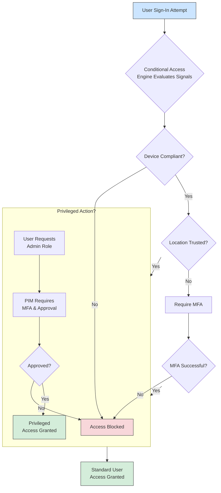
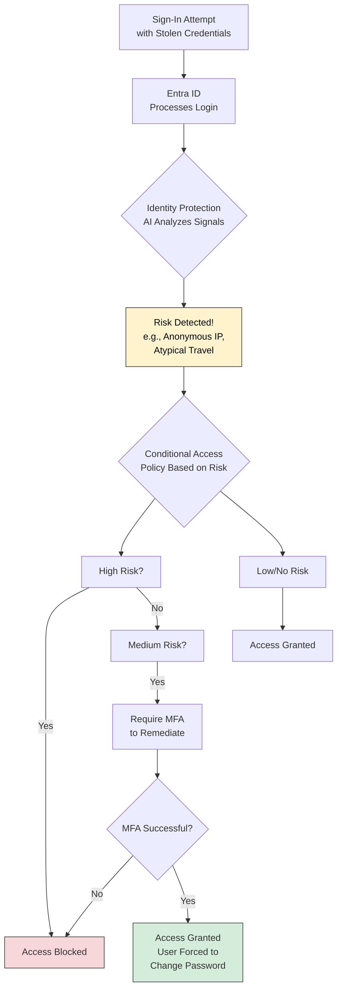
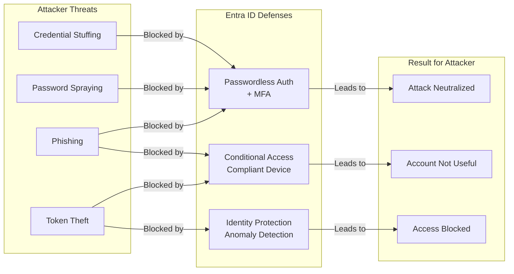

# 👨‍💻 Identity Threat Defense with Microsoft Entra ID: A Comprehensive Guide to Protecting Identities in the Modern Cloud Era 🔥

This guide structures the information around the "Protect, Detect, Respond" framework, providing a clear and actionable strategy.

---

### **The Comprehensive notes to Identity Threat Defense with Microsoft Entra ID**

In the modern cloud-centric world, identity is the new perimeter. Protecting these identities—user accounts, service principals, and their credentials—is the most critical aspect of cybersecurity. Microsoft Entra ID is at the heart of this defense for the Microsoft ecosystem and beyond.

This guide details the common threats and the robust defenses available within the Entra ID suite.

### **Core Understanding: The Threat Landscape**

Attackers target identities because compromising one can bypass firewalls, network controls, and other traditional security measures.

| Threat | Description | Real-World Impact |
| :--- | :--- | :--- |
| **Credential Stuffing** | Attackers use automated tools to try massive lists of stolen username/password pairs from previous breaches on other services. | If users reuse passwords, attackers gain easy access. It's a numbers game with a high success rate. |
| **Phishing** | Deceiving users into entering their credentials on a fake login page. Often combined with real-time proxy tools to steal session cookies. | Direct theft of credentials and active sessions, bypassing some forms of MFA. |
| **Password Spraying** | Attackers try a few common passwords (e.g., "Spring2024!", "Company123") against a large number of usernames. Avoids account lockouts. | Compromises accounts with weak, predictable passwords. Targets the "low-hanging fruit." |
| **Token Theft / Replay** | Stealing session tokens (like cookies) from a user's browser or a device. The attacker then uses this token to impersonate the user. | Leads to **Account Takeover (ATO)**. The attacker acts as the legitimate user, with all their permissions and access. |
| **Pass-the-Hash/Ticket** | Primarily an on-premises Active Directory attack where an attacker steals a hashed password or Kerberos ticket and uses it to create a new session. | Allows lateral movement across a network without needing to know the plaintext password. |
| **Privileged Account Compromise** | Any of the above attacks, but specifically targeting highly privileged accounts (Global Admins, SharePoint Admins, etc.). | **Catastrophic.** Grants access to the entire tenant, data, and identity system. Can lead to full business compromise. |
| **Insider Threats** | Malicious or negligent actions by authorized users (e.g., a disgruntled employee exfiltrating data, or a user accidentally sharing a sensitive file). | Difficult to detect as it comes from a "trusted" identity. Can lead to significant data loss. |

---

### **The Defense-in-Depth Strategy: Protect, Detect, Respond**

A robust identity security posture requires layers of defense. Entra ID provides tools for each phase.

---

### **1. PROTECT: Strengthening Your Identity Perimeter**

The goal here is to make it significantly harder for an attacker to successfully compromise an identity in the first place.

#### **A. Eliminate the Password Attack Surface**
*   **Passwordless Authentication:** Move users away from passwords entirely. This completely neutralizes credential stuffing, spraying, and phishing.
    *   **Methods:** Windows Hello for Business, FIDO2 security keys (e.g., YubiKey), and the Microsoft Authenticator app.
    *   **Benefit:** Users authenticate with a biometric or PIN on their device, which cannot be phished or replayed.

*   **Strong Password Policies:**
    *   **Ban Common Passwords:** Use Entra ID Password Protection to automatically ban a global list of known weak passwords and a custom list you define (e.g., your company name, product names).
    *   **Enforce Complexity:** While moving towards passwordless, ensure remaining password policies are strong.

#### **B. Enforce Multi-Factor Authentication (MFA)**
MFA is the single most effective control to prevent account takeover. A stolen password is useless without the second factor.
*   **Implementation:** Use **Conditional Access** (see below) to mandate MFA for all users, without exception. Avoid per-user MFA settings for a more scalable and secure approach.
*   **Phishing-Resistant MFA:** For highest privilege accounts, mandate phishing-resistant MFA like FIDO2 security keys, which cannot be intercepted by a fake login page.

#### **C. Control Access with Conditional Access (CA)**
Conditional Access is the policy engine that brings "Zero Trust" to life. It makes access decisions based on signals.
*   **Core Policies:**
    *   **Require MFA for all users:** The baseline policy.
    *   **Block legacy authentication:** Protocols like POP3, SMTP, IMAP, and older Office suites do not support MFA and are a major attack vector. **This policy is critical.**
    *   **Require compliant devices:** Only allow access from devices that are managed and compliant with your security standards (e.g., Intune enrolled, disk encrypted).
    *   **Require trusted locations:** Restrict access to specific geographic IP ranges or named locations.
    *   **Application-specific policies:** Grant access to sensitive apps only under stricter conditions.

#### **D. Manage Privileged Access with Privileged Identity Management (PIM)**
The principle of **Just-In-Time (JIT)** and **Just-Enough-Access (JEA)**.
*   **Make Roles Eligible:** Users are not permanently assigned powerful roles (like Global Admin). Instead, they are made *eligible* for them.
*   **Time-Bounded Activation:** When a user needs to perform a privileged task, they must activate their role, providing a reason and (optionally) requiring approval. The role automatically deactivates after a set time (e.g., 2 hours).
*   **Require MFA and Approval for Activation:** Adds a critical layer of security for role activation.

---

### **2. DETECT: Identifying Threats and Anomalies**

You must assume some attacks will get through your protections. Detection is key to limiting the damage.

#### **A. Entra ID Identity Protection**
This is the built-in AI-driven tool that automatically detects identity-based risks. It consumes signals from Microsoft's vast telemetry and classifies them into risk detections.

*   **User Risk:** Indicates the probability that an identity has been compromised.
    *   **Detections:** Leaked credentials, anomalous token, unfamiliar sign-in properties, malware-linked IP address.
*   **Sign-In Risk:** Indicates the probability that a specific authentication attempt is malicious.
    *   **Detections:** Anonymous IP address, unfamiliar sign-in properties, atypical travel, malicious IP address.

**Integrating Detection with Protection:** You can create **Conditional Access policies that use these risk signals**.
*   **Policy:** "If *Sign-In Risk* is Medium or High, require MFA" or "If *User Risk* is High, force a password change."

#### **B. Entra ID Logging and Monitoring**
*   **Sign-In Logs:** Provide detailed information about every authentication attempt—success, failure, and the Conditional Access result. Essential for hunting and forensics.
*   **Audit Logs:** Record all changes made within Entra ID (e.g., user created, role assignment changed, app permission granted).
*   **Proactive Monitoring:**
    *   **Workbooks & Dashboards:** Use the built-in workbooks in Azure Monitor to visualize identity security trends.
    *   **Scheduled Alerts:** Create alerts for high-impact events (e.g., "Global Admin role assigned").
    *   **Sentinel SIEM Integration:** Stream all Entra ID logs to Microsoft Sentinel for advanced Security Orchestration, Automation, and Response (SOAR) and deeper threat hunting using custom queries.

---

### **3. RESPOND: Containing and Remediating Attacks**

When a threat is detected, you must act quickly to isolate and neutralize it.

#### **A. Automated Response with Conditional Access and Identity Protection**
*   **Automated Remediation:** Entra ID Identity Protection can be configured to automatically remediate risks.
    *   **User Risk Policy:** Set a policy to force a *password change* or *require MFA* on medium/high user risk.
    *   **Sign-In Risk Policy:** Block sign-ins with high risk.
*   **Session Controls:** Use Conditional Access to limit what a user can do *during* a session, not just at sign-in.
    *   **App Enforced Restrictions:** For untrusted devices, limit access to web content, preventing data exfiltration.

#### **B. Manual Investigation and Response**
*   **Investigate a Risky User:** Use the Identity Protection portal to see all risk detections for a user, confirm a compromise ("This was me on a VPN" vs. "This was not me"), and dismiss or confirm the risk.
*   **Revoke Sessions:** If an account is compromised, immediately **revoke the user's sessions** to log the attacker out.
*   **Require Password Reset:** Force the legitimate user to set a new, secure password.
*   **Disable the Account:** As a last resort, disable the account to completely halt all access while the incident is investigated.

---

### **Putting It All Together: A Practical Policy Example**

**Scenario:** Defend against credential stuffing and account takeover for all users, especially Global Admins.

1.  **PROTECT:**
    *   **CA Policy 1:** Block all legacy authentication protocols.
    *   **CA Policy 2:** Require MFA for all users, from all locations.
    *   **CA Policy 3 (For Admins):** Require *phishing-resistant MFA* and a *compliant device* for all users with privileged roles.
    *   **PIM:** Configure all admin roles to be eligible, time-bound, and require MFA+justification for activation.

2.  **DETECT:**
    *   **Identity Protection:** Enable user and sign-in risk detection.
    *   **CA Policy 4:** Integrate risk signals: "If User Risk is High, require a password change." "If Sign-In Risk is High, require MFA."

3.  **RESPOND:**
    *   **Automation:** The CA policies in step 2 automatically contain risky users.
    *   **Process:** Security team is alerted to a "High User Risk" event. They investigate the user's sign-ins and tokens in the Identity Protection portal. They confirm the compromise and manually revoke sessions and require a password reset if the automated policy hasn't already.

### **Conclusion**

A comprehensive identity threat defense strategy in Microsoft Entra ID is not about implementing a single feature. It's about layering **Protective** controls (MFA, CA, PIM) with **Detective** capabilities (Identity Protection, Logs) and having a clear **Response** plan. By adopting this "Zero Trust" mindset of "never trust, always verify," you can dramatically reduce your risk of a devastating identity-based attack.

> *Excellent idea. Visual diagrams make the abstract concepts of identity security much clearer. Here are visual flow diagrams that illustrate the key scenarios covered above.*

---

### **Diagram 1: The "Protect" Layer - A Zero Trust Sign-In with Conditional Access**

This diagram shows how multiple defenses work together during a sign-in attempt to prevent a breach, even with a correct password.

**What this illustrates:**
*   **Layered Defense:** Access is not granted just with a password. The system checks device health, location, and user risk.
*   **Conditional Access as the Brain:** The CA policy engine is the central decision point that enforces your security rules.
*   **Privileged Isolation:** Even after a successful sign-in, performing a highly privileged action triggers an additional, stringent layer of security via PIM.

---

### **Diagram 2: The "Detect & Respond" Layer - Identity Protection Automated Response**

This diagram shows how Entra ID Identity Protection automatically detects and responds to a compromised identity.

**What this illustrates:**
*   **Continuous Monitoring:** Every sign-in is evaluated in real-time by AI-driven risk detection.
*   **Risk-Based Policies:** The response is proportional to the assessed risk level.
*   **Automated Remediation:** The system can automatically block attacks or force a password reset without waiting for a security analyst, containing the threat instantly.

---

### **Diagram 3: The Attacker's View - How Defenses Thwart Common Attacks**

This diagram maps the specific defenses against the common threats, showing how the security controls break the attack chain.

**What this illustrates:**
*   **Targeted Defense:** Each major threat vector has a specific and effective countermeasure.
*   **Defense in Depth:** Some attacks, like phishing, are thwarted by multiple layers (MFA prevents login from fake site, device compliance prevents access even with a token).
*   **The Attacker's Dead End:** The combined defenses ensure that even if one part of the identity is compromised (a password), the attack ultimately fails.

---

### **How to Use These Diagrams**

1.  **For Training:** Use these to explain to IT staff and developers how Entra ID security works in practice.
2.  **For Planning:** When designing your security posture, refer to Diagram 1 to ensure you have the necessary Conditional Access policies in place.
3.  **For Justification:** Use Diagram 3 to visually demonstrate to management why investments in technologies like MFA and Identity Protection are critical for mitigating real-world threats.

> *These visuals, combined with the comprehensive notes, provide a complete picture of a modern Identity Threat Defense strategy using Microsoft Entra ID.*