## **SSO & Federation: The "Universal ID Card" System**

### **Diagram 1: How SSO & Federation Work - The Airport Security Analogy**


**Human Explanation:**
Think of SSO like an **airport security system**:
- **You (User)** want to access multiple secure areas (Applications)
- **TSA (Entra ID)** verifies your identity once at the main checkpoint
- **Boarding Pass (SAML/OIDC Token)** proves you're cleared to fly
- **Airlines (Applications)** trust the TSA's verification - no need to check your ID again

---

## **SAML vs OIDC: Choosing the Right "ID Card"**

### **Diagram 2: SAML vs OIDC Comparison**


**When to Use Which:**
- **SAML**: Enterprise applications, HR systems, financial apps (Workday, Salesforce)
- **OIDC**: Modern web apps, mobile applications, JavaScript apps, APIs

---

## **Authentication Methods: The "Keys to Your Castle"**

### **Diagram 3: Authentication Strength Hierarchy**

```mermaid
flowchart TD
    A[Authentication Methods] --> B[Something You Know<br>Password/PIN]
    A --> C[Something You Have<br>Phone/Authenticator]
    A --> D[Something You Are<br>Biometrics]
    
    B --> E[Weakest<br>Vulnerable to phishing]
    C --> F[Strong<br>Resistant to remote attacks]
    D --> G[Strongest<br>Very difficult to steal]
    
    E --> H[Passwordless<br>Eliminates password risks]
    F --> H
    G --> H
    
    H --> I[🔐 Most Secure &<br>User Friendly!]

    style E fill:#f8d7da,stroke:#dc3545
    style F fill:#fff3cd,stroke:#ffc107
    style G fill:#d4edda,stroke:#28a745
    style I fill:#cce5ff,stroke:#007bff
```



**Passwordless Authentication Options:**
1. **Windows Hello** - Facial recognition/fingerprint + PIN
2. **FIDO2 Security Keys** - Physical USB/NFC keys (YubiKey)
3. **Microsoft Authenticator** - Phone tap approval
4. **SMS/Email Sign-In** - One-time codes

---

## **Authorization vs Authentication: The "Who vs What"**

### **Diagram 4: Authentication vs Authorization**


**Simple Explanation:**
- **Authentication**: Showing your ID to prove you're old enough to enter a bar
- **Authorization**: The bouncer checking if you're on the VIP list for backstage access

---

## **SCIM Provisioning: Automatic Employee On/Off Boarding**

### **Diagram 5: SCIM Automatic User Lifecycle**

```mermaid
flowchart TD
    A[HR System/Entra ID] --> B[User Created<br>or Updated]
    
    B --> C[SCIM Provisioning<br>Automated Sync]
    
    C --> D[Target Application<br>e.g., Salesforce, Slack]
    
    D --> E{Action Type}
    E -- Create --> F[🎯 Auto-create User Account]
    E -- Update --> G[🔄 Sync Profile Changes]
    E -- Deactivate --> H[🚫 Disable/Delete Account]
    
    F --> I[User gets access<br>on day one]
    G --> J[Permissions stay updated]
    H --> K[Instant deprovisioning<br>when employee leaves]
    
    style I fill:#d4edda,stroke:#155724
    style K fill:#f8d7da,stroke:#dc3545
```



**Why SCIM Matters:**
- **New Hire**: Starts Monday → Automatically gets all app accounts
- **Role Change**: Promotion → Automatically gets new permissions
- **Employee Leaves**: Account automatically disabled everywhere

---

## **Hands-On Lab: Configure Federation & Test Provisioning**

### **Lab Scenario: Set up SSO for "CloudSales App"**


### **Step-by-Step Lab Guide:**

**Phase 1: SAML Federation Setup**
1. **Entra Admin Center** → Enterprise Applications → New Application
2. **Create your own application** → "CloudSales App"
3. **SAML Configuration**:
   - Identifier (Entity ID): `https://cloudsales-app.com`
   - Reply URL: `https://cloudsales-app.com/saml/acs`
   - Attributes: Map email, firstname, lastname

**Phase 2: SCIM Provisioning**
1. **Provisioning** → Get started
2. **SCIM endpoint**: `https://cloudsales-app.com/scim/v2`
3. **Secret token**: [provided by app vendor]
4. **Test connection** → Save

**Phase 3: User Assignment & Testing**
1. **Users and groups** → Add user/group
2. **Assign test users**
3. **Go to https://myapps.microsoft.com**
4. **Click CloudSales App** → Should auto-login!

### **Common Gotchas & Tips:**
- ✅ **Certificate expiry**: SAML signing certs expire - set reminders!
- ✅ **Attribute mapping**: Ensure email/username fields match exactly
- ✅ **Network requirements**: SCIM needs outbound HTTPS access
- ✅ **Test with 2 users first** before rolling out to entire company

---

## **Quick Reference Cheat Sheet**

| Concept | What It Is | Real-World Analog |
|---------|------------|-------------------|
| **SAML** | Enterprise SSO standard | Company security badge |
| **OIDC** | Modern web/mobile SSO | Digital driver's license |
| **SCIM** | Automatic user provisioning | HR automatically updating all access |
| **IdP** | Identity Provider (Entra ID) | The main security office |
| **SP** | Service Provider (App) | The individual secure building |

This visual approach helps bridge the gap between technical concepts and practical understanding. The lab gives you hands-on experience that makes the theory come alive!

---
Excellent! Let's dive deep into hands-on labs with detailed, step-by-step instructions.

---

## **🏢 Lab 1: SAML SSO Configuration for "CloudSales App"**

### **Lab Overview**
Configure SAML-based Single Sign-On between Entra ID and a mock SaaS application.

### **Prerequisites**
- Azure AD P1 or P2 license (for conditional access)
- Global Administrator access
- Access to both Entra Admin Center and "CloudSales App" admin

---

### **Phase 1: Application Registration in Entra ID**

#### **Step 1: Create Enterprise Application**
```bash
# This is done in Azure Portal - no CLI commands, just UI steps
```

**Visual Workflow:**


**Detailed Steps:**
1. Navigate to **Azure Portal** → **Entra ID**
2. Go to **Enterprise applications**
3. Click **New application**
4. Click **Create your own application**
5. Enter:
   - **Name**: `CloudSales-Prod`
   - **What are you looking to do?**: `Integrate any other application you don't find in the gallery (Non-gallery)`
6. Click **Create**

---

### **Phase 2: SAML Configuration**

#### **Step 2: Configure Basic SAML**
```bash
# These are the values you'll configure in the UI
```

**Visual Workflow:**


**Detailed Steps:**
1. In your new **CloudSales-Prod** application, go to **Single sign-on**
2. Select **SAML**
3. **Basic SAML Configuration** → Edit
4. Configure:
   - **Identifier (Entity ID)**: `https://cloudsales.com/saml`
   - **Reply URL (Assertion Consumer Service URL)**: `https://cloudsales.com/saml/acs`
   - **Sign on URL**: `https://cloudsales.com/login`
5. Click **Save**

#### **Step 3: Configure Attributes & Claims**
```bash
# Mapping user attributes to SAML claims
```

**Detailed Steps:**
1. In **SAML-based Sign-on** section, click **Edit**
2. **Attributes & Claims** → Edit
3. Add these claims:
   - **Claim name**: `user.mail` → **Name**: `email`
   - **Claim name**: `user.givenname` → **Name**: `first_name`
   - **Claim name**: `user.surname` → **Name**: `last_name`
   - **Claim name**: `user.userprincipalname` → **Name**: `upn`

#### **Step 4: Download Federation Metadata**
```bash
# This file will be provided to CloudSales app
```

**Steps:**
1. In **SAML Signing Certificate** section
2. Download:
   - **Federation Metadata XML** (save as `CloudSalesFederation.xml`)
   - **Certificate (Base64)** (save as `CloudSalesCertificate.cer`)

---

### **Phase 3: User Assignment & Testing**

#### **Step 5: Assign Test Users**
```bash
# PowerShell alternative for bulk assignment
Connect-MgGraph
New-MgGroupMember -GroupId "your-group-id" -DirectoryObjectId "user-id"
```

**UI Steps:**
1. Go to **Users and groups** → Add user/group
2. Select test users:
   - `testuser1@yourtenant.com`
   - `testuser2@yourtenant.com`
3. Click **Assign**

#### **Step 6: Test SSO Login**
```bash
# Test URLs for your environment
```

**Testing Steps:**
1. Open **InPrivate/Incognito browser**
2. Navigate to: `https://myapps.microsoft.com`
3. Sign in as `testuser1@yourtenant.com`
4. Click **CloudSales-Prod** application
5. **Expected result**: Automatic redirect to CloudSales app without password prompt

---

## **🔄 Lab 2: SCIM Automatic User Provisioning**

### **Lab Overview**
Configure automatic user creation/updates/deletion between Entra ID and CloudSales App.

---

### **Phase 1: Configure SCIM Endpoint**

#### **Step 1: Setup Provisioning**
```bash
# SCIM API endpoint details
```

**Visual Workflow:**


**Detailed Steps:**
1. In **CloudSales-Prod** app, go to **Provisioning**
2. Click **Get started**
3. **Provisioning Mode**: `Automatic`
4. **Admin Credentials**:
   - **Tenant URL**: `https://api.cloudsales.com/scim/v2`
   - **Secret Token**: `eyJhbGciOiJIUzI1NiIsInR5cCI6IkpXVCJ9...` (get from CloudSales admin)
5. Click **Test Connection** → Should show success

#### **Step 2: Configure Attribute Mapping**
```bash
# Review and customize attribute mappings
```

**Steps:**
1. Go to **Mappings** → **Provision Azure Active Directory Users**
2. Review default mappings:
   - `userPrincipalName` → `userName`
   - `active` → `active`
   - `displayName` → `displayName`
   - `mail` → `emails[type eq "work"].value`
3. **Optional**: Add custom mapping for department:
   - **Source attribute**: `department`
   - **Target attribute**: `department`

---

### **Phase 2: Test Provisioning Cycle**

#### **Step 3: Start Provisioning & Test**
```bash
# PowerShell to monitor provisioning
Connect-MgGraph
Get-MgServicePrincipal -Filter "displayName eq 'CloudSales-Prod'"
```

**Testing Steps:**
1. **Start Provisioning**: Turn provisioning to **On**
2. **Initial Cycle**: Wait for first sync (5-40 minutes)
3. **Check Status**: Go to **Provisioning logs**
4. **Verify in CloudSales**: Check that test users appear in CloudSales user list

#### **Step 4: Test User Lifecycle Events**
```bash
# Create test scenarios
```

**Test Scenario 1: New User Creation**
1. Create new user in Entra ID: `newuser@yourtenant.com`
2. Assign to CloudSales-Prod app
3. Wait 5-40 minutes for sync
4. Verify user appears in CloudSales

**Test Scenario 2: User Update**
1. Update `testuser1@yourtenant.com` department to "Marketing"
2. Wait for sync cycle
3. Verify department updated in CloudSales

**Test Scenario 3: User Deletion**
1. Remove `testuser2@yourtenant.com` from app assignment
2. Wait for sync cycle
3. Verify user deactivated in CloudSales

---

## **🔐 Lab 3: OIDC Configuration for Custom Web App**

### **Lab Overview**
Register a custom application using OpenID Connect (modern approach).

---

### **Phase 1: App Registration**

#### **Step 1: Create App Registration**
```bash
# PowerShell method
Connect-MgGraph
New-MgApplication -DisplayName "MyCustomWebApp" -SignInAudience "AzureADMyOrg"
```

**UI Steps:**
1. **Entra ID** → **App registrations** → **New registration**
2. Configure:
   - **Name**: `MyCustomWebApp`
   - **Supported account types**: `Accounts in this organizational directory only`
   - **Redirect URI**: `https://myapp.com/auth/callback` (Platform: Web)

#### **Step 2: Configure Authentication**
```bash
# OIDC endpoints will be auto-generated
```

**Steps:**
1. Go to **Authentication**
2. **Platform configurations** → Add platform → **Web**
3. **Redirect URIs**:
   - `https://myapp.com/auth/callback`
   - `http://localhost:3000/auth/callback` (for development)
4. **Implicit grant**: Check `ID tokens`

#### **Step 3: Configure API Permissions**
```bash
# Microsoft Graph permissions
```

**Steps:**
1. **API permissions** → Add a permission → **Microsoft Graph**
2. **Delegated permissions**:
   - `User.Read`
   - `Mail.Read`
   - `Calendars.Read`
3. Click **Add permissions**

---

### **Phase 2: Implement OIDC Flow**

#### **Step 4: Application Configuration Values**
```bash
# These values go in your application code
```

**Configuration Template:**
```json
{
  "client_id": "a1b2c3d4-e5f6-7890-abcd-ef1234567890",
  "tenant_id": "your-tenant-id-here",
  "authority": "https://login.microsoftonline.com/your-tenant-id",
  "redirect_uri": "https://myapp.com/auth/callback",
  "scopes": ["User.Read", "Mail.Read", "openid", "profile"]
}
```

#### **Step 5: Test OIDC Login**
```html
<!-- Sample login button -->
<button onclick="login()">Sign in with Microsoft</button>

<script>
function login() {
    const tenantId = 'your-tenant-id';
    const clientId = 'your-client-id';
    const redirectUri = encodeURIComponent('https://myapp.com/auth/callback');
    const scope = encodeURIComponent('User.Read openid profile');
    
    const authUrl = `https://login.microsoftonline.com/${tenantId}/oauth2/v2.0/authorize?client_id=${clientId}&response_type=code&redirect_uri=${redirectUri}&scope=${scope}&response_mode=query`;
    
    window.location.href = authUrl;
}
</script>
```

---

## **🚨 Troubleshooting Guide**

### **Common SAML Issues & Solutions**

| Issue | Symptoms | Solution |
|-------|----------|----------|
| **SAML Certificate Expired** | Login fails, "Invalid certificate" | Renew certificate in **SAML Signing Certificate** |
| **Wrong Reply URL** | Error: "The reply URL does not match" | Verify exact URL in both Entra ID and app config |
| **Missing Claims** | User logs in but missing data | Check **Attributes & Claims** mapping |
| **User Not Assigned** | "Application not found" | Assign user in **Users and groups** |

### **Common SCIM Issues & Solutions**

| Issue | Symptoms | Solution |
|-------|----------|----------|
| **Connection Failed** | "Test connection failed" | Check secret token and network connectivity |
| **Users Not Syncing** | No errors but no users | Check attribute mapping and user assignments |
| **Infinite Loop** | Continuous provisioning cycles | Check for attribute changes triggering updates |

### **Common OIDC Issues & Solutions**

| Issue | Symptoms | Solution |
|-------|----------|----------|
| **Invalid Redirect URI** | "redirect_uri does not match" | Exact match required in app registration |
| **Missing Permissions** | "Insufficient privileges" | Add required API permissions and admin consent |
| **Token Validation Failed** | "Invalid signature" | Check token audience and issuer |

---

## **📋 Lab Validation Checklist**

### **SAML SSO Validation**
- [ ] Users can login via My Apps portal
- [ ] No password prompt for assigned users
- [ ] Correct user attributes passed to application
- [ ] Login works in incognito mode

### **SCIM Provisioning Validation**
- [ ] Initial sync cycle completed successfully
- [ ] New users auto-created in target app
- [ ] User updates sync within 40 minutes
- [ ] User removal deactivates accounts

### **OIDC Validation**
- [ ] Login redirects to Microsoft
- [ ] Successful callback with authorization code
- [ ] Can retrieve user profile information
- [ ] Tokens validate correctly

---

> *If you are curious ! Let's dive deep into these critical advanced security configurations.*

---

## **👑 Lab 4: Configure PIM for Administrative Access**

### **Lab Overview**
Implement Just-In-Time privileged access using Privileged Identity Management to minimize standing admin permissions.

---

### **Phase 1: Enable and Configure PIM**

#### **Step 1: Enable PIM in Your Tenant**
```powershell
# Connect to Microsoft Graph
Connect-MgGraph -Scopes "RoleManagement.ReadWrite.Directory"

# Check if PIM is enabled (it should be by default)
Get-MgDirectoryRole -All
```

**UI Steps:**
1. Navigate to **Entra ID** → **Identity Governance**
2. Click **Privileged Identity Management**
3. If first time, click **Consent to PIM** (Global Admin required)
4. Go to **Azure AD roles**

#### **Step 2: Configure Global Administrator Role**
```powershell
# View current permanent Global Admins
Get-MgDirectoryRoleMember -DirectoryRoleId "global-administrator-role-id"
```

**Visual Workflow:**


```mermaid
flowchart TD
    A[PIM → Azure AD roles] --> B[Roles → Global Administrator]
    B --> C[Role settings]
    C --> D[Edit]
    D --> E[Activation: max 8 hours]
    E --> F[Require MFA on activation]
    F --> G[Require justification]
    G --> H[Save]
    
    style E fill:#fff3cd
    style F fill:#fff3cd
```

**Detailed Configuration:**
1. **PIM** → **Azure AD roles** → **Roles** → **Global Administrator**
2. Click **Role settings** → **Edit**
3. Configure **Activation** tab:
   - **Maximum activation time**: `8 hours`
   - **On activation**:
     - ✅ **Require Azure MFA**
     - ✅ **Require justification**
   - **Require ticket information**: `Optional`
4. Configure **Assignment** tab:
   - **Allow permanent eligible assignment**: `No`
   - **Expire eligible assignments after**: `90 days`
5. Click **Update**

#### **Step 3: Create Eligible Assignment**
```powershell
# Create eligible assignment for a user
$params = @{
    "@odata.type" = "#microsoft.graph.eligibleRoleAssignment"
    "principalId" = "user-object-id"
    "roleDefinitionId" = "global-administrator-role-id"
    "directoryScopeId" = "/"
}

New-MgRoleManagementDirectoryRoleEligibilityScheduleRequest -BodyParameter $params
```

**UI Steps:**
1. **PIM** → **Azure AD roles** → **Assignments**
2. Click **Add assignments**
3. Select:
   - **Role**: `Global Administrator`
   - **Member**: Select a test user (NOT your main admin account)
   - **Assignment type**: `Eligible`
   - **Duration**: `90 days`
4. Click **Assign**

---

### **Phase 2: Test PIM Activation & Access**

#### **Step 4: Test Role Activation**
```powershell
# User perspective: Check eligible roles
Get-MgRoleManagementDirectoryRoleEligibilitySchedule -Filter "principalId eq 'user-object-id'"
```

**User Testing Steps:**
1. Login as the test user → **Azure Portal**
2. Navigate to **PIM** → **My roles** → **Azure AD roles**
3. Find **Global Administrator** → **Activate**
4. Fill in activation form:
   - **Reason**: `Testing PIM activation for emergency maintenance`
   - **Duration**: `2 hours`
5. Complete **MFA challenge**
6. **Wait for activation** (may take few minutes)
7. Verify you now have Global Admin access

#### **Step 5: Configure Approval Workflow**
```powershell
# Enable approval for specific roles
# This requires premium P2 license
```

**Approval Configuration:**
1. **PIM** → **Azure AD roles** → **Roles** → **User Administrator**
2. **Role settings** → **Edit**
3. **Activation** tab → **Require approval to activate**: `Yes`
4. **Select approvers**: Choose 1-2 backup admins
5. **Update**

---

## **🚨 Lab 5: Set Up Monitoring Alerts for Provisioning Failures**

### **Lab Overview**
Configure proactive monitoring and alerts for identity provisioning issues.

---

### **Phase 1: Diagnostic Settings for Log Export**

#### **Step 1: Enable Provisioning Logs Export**
```powershell
# Create diagnostic setting for provisioning logs
Connect-AzAccount

$resourceId = "/subscriptions/your-sub-id/resourceGroups/your-rg/providers/Microsoft.AzureActiveDirectory"
$workspaceId = "/subscriptions/your-sub-id/resourcegroups/your-rg/providers/microsoft.operationalinsights/workspaces/your-workspace"

Set-AzDiagnosticSetting -ResourceId $resourceId `
    -WorkspaceId $workspaceId `
    -Enabled $true `
    -Category "ProvisioningLogs"
```

**UI Configuration:**
1. **Entra ID** → **Monitoring** → **Diagnostic settings**
2. Click **Add diagnostic setting**
3. **Name**: `EntraID-Provisioning-Logs`
4. **Category details**: ✅ **ProvisioningLogs**
5. **Destination details**: 
   - ✅ **Send to Log Analytics workspace**
   - Select your Log Analytics workspace
6. Click **Save**

#### **Step 2: Create Alert Rule for Provisioning Failures**
```powershell
# Create action group for notifications
$actionGroup = New-AzActionGroup -ResourceGroupName "security-rg" `
    -Name "Identity-Alerts" `
    -ShortName "IdAlerts" `
    -EmailReceiver @{
        Name = "SecurityTeam"
        EmailAddress = "security-team@yourcompany.com"
    }
```

**UI Alert Creation:**
1. **Azure Monitor** → **Alerts** → **Alert rules**
2. Click **Create** → **Alert rule**
3. **Scope**: Select your Entra ID diagnostic setting
4. **Condition**: 
   - **Signal name**: `ProvisioningLogs`
   - **Condition**: `Result Type = Failure`
5. **Actions**:
   - Select/create action group
   - Configure email notifications
6. **Alert rule details**:
   - **Alert rule name**: `EntraID-Provisioning-Failures`
   - **Severity**: `Sev 2`
7. **Create**

---

### **Phase 2: Advanced Monitoring with KQL Queries**

#### **Step 3: Create Log Analytics Workbook**
```kql
// Provisioning Failure Trends
ProvisioningLogs
| where ResultType == "Failure"
| summarize FailureCount = count() by ResultDescription, bin(TimeGenerated, 1h)
| render columnchart
```

**Custom Detection Queries:**

**Query 1: High Failure Rate Detection**
```kql
// Alert when failure rate exceeds 10%
ProvisioningLogs
| where TimeGenerated >= ago(15m)
| summarize 
    TotalOperations = count(),
    FailedOperations = countif(ResultType == "Failure"),
    FailureRate = todouble(countif(ResultType == "Failure")) / todouble(count()) * 100
| where FailureRate > 10
```

**Query 2: Specific Error Patterns**
```kql
// Common provisioning errors
ProvisioningLogs
| where ResultType == "Failure"
| summarize ErrorCount = count() by ResultDescription, TargetSystem
| order by ErrorCount desc
```

#### **Step 4: Configure Real-time Alerts**
```powershell
# Create scheduled query rule for high failure rates
Import-Module Az.Monitor

$query = @"
ProvisioningLogs
| where TimeGenerated >= ago(15m)
| summarize FailureRate = todouble(countif(ResultType == 'Failure')) / todouble(count()) * 100
| where FailureRate > 10
"@

New-AzScheduledQueryRule -ResourceGroupName "security-rg" `
    -Name "High-Provisioning-Failure-Rate" `
    -DisplayName "High Provisioning Failure Rate" `
    -Description "Alert when provisioning failure rate exceeds 10%" `
    -Query $query `
    -Severity 2 `
    -WindowSize (New-TimeSpan -Minutes 15) `
    -EvaluationFrequency (New-TimeSpan -Minutes 5)
```

---

## **🚨 Lab 6: Implement Break-Glass Accounts**

### **Lab Overview**
Create and secure emergency access accounts for worst-case scenarios.

---

### **Phase 1: Create Break-Glass Accounts**

#### **Step 1: Create Cloud-Only Break-Glass Accounts**
```powershell
# Create emergency accounts
$emergencyParams = @{
    DisplayName = "EMERGENCY-BREAKGLASS-01"
    UserPrincipalName = "emergency-admin01@yourtenant.com"
    MailNickname = "emergencyadmin01"
    AccountEnabled = $true
    PasswordProfile = @{
        Password = "VeryComplexInitialPassword123!@#"
        ForceChangePasswordNextSignIn = $false
    }
}

New-MgUser -BodyParameter $emergencyParams

# Repeat for second account
$emergencyParams2 = @{
    DisplayName = "EMERGENCY-BREAKGLASS-02"
    UserPrincipalName = "emergency-admin02@yourtenant.com"
    MailNickname = "emergencyadmin02"
    AccountEnabled = $true
    PasswordProfile = @{
        Password = "AnotherComplexPassword456$%^"
        ForceChangePasswordNextSignIn = $false
    }
}

New-MgUser -BodyParameter $emergencyParams2
```

**Account Creation Best Practices:**
1. **Naming**: Clear emergency identification
2. **UPN**: Dedicated emergency email addresses
3. **No MFA**: Initially configured (will be protected by other means)
4. **Global Admin**: Assign permanent Global Administrator role

#### **Step 2: Assign Privileges and Configure Protection**
```powershell
# Assign Global Admin role permanently
$roleId = (Get-MgDirectoryRole -Filter "displayName eq 'Global Administrator'").Id
$userId = (Get-MgUser -Filter "displayName eq 'EMERGENCY-BREAKGLASS-01'").Id

New-MgDirectoryRoleMemberByRef -DirectoryRoleId $roleId -BodyParameter @{
    "@odata.id" = "https://graph.microsoft.com/v1.0/directoryObjects/$userId"
}
```

**Visual Protection Strategy:**

```mermaid
flowchart TD
    A[Break-Glass Accounts] --> B[Conditional Access Protection]
    B --> C[Block all except<br>trusted IP ranges]
    B --> D[Require compliant device<br>+ additional verification]
    B --> E[Block legacy auth]
    
    C --> F[🚨 Emergency IPs only]
    D --> G[📱 Manual override process]
    E --> H[🔒 Modern auth only]
    
    F --> I[Physical access<br>to office required]
    G --> J[Security team<br>verification required]
```


---

### **Phase 2: Secure Break-Glass Accounts**

#### **Step 3: Create Break-Glass Conditional Access Policy**
```powershell
# This policy will be created in UI, but here's the concept
```

**CA Policy Configuration:**
1. **Entra ID** → **Security** → **Conditional Access** → **New policy**
2. **Name**: `EMERGENCY - Break Glass Account Restrictions`
3. **Users and groups**: Select both emergency accounts
4. **Cloud apps**: `All cloud apps`
5. **Conditions**: 
   - **Locations**: Configure trusted IP ranges only
   - **Client apps**: Modern authentication clients
6. **Access controls** → **Grant**: `Block access`
7. **Enable policy**: `Report-only` initially, then `On`

#### **Step 4: Create Emergency Access Policy**
```powershell
# Create exemption policy for trusted emergency locations
```

**Emergency Access CA Policy:**
1. **New policy**: `EMERGENCY - Allow from Trusted Locations`
2. **Users**: Both emergency accounts
3. **Locations**: `Trusted Emergency IP Ranges` (corporate offices, VPN)
4. **Client apps**: `All`
5. **Grant**: `Require MFA` + `Require compliant device`
6. **Session**: `Sign-in frequency - every 8 hours`

#### **Step 5: Document Break-Glass Procedures**
```markdown
# EMERGENCY ACCESS PROCEDURE

## When to Use:
- All other admin accounts locked out
- MFA system failure
- Conditional Access policy misconfiguration

## Steps:
1. Physically go to corporate office (trusted location)
2. Use designated secure workstation
3. Login with emergency account credentials
4. Complete MFA challenge (if available)
5. Fix the underlying issue
6. Log out and document the incident

## Required Documentation:
- Date/Time of access
- Reason for emergency access
- Actions performed
- Security team notification
```

---

### **Phase 3: Testing and Validation**

#### **Step 6: Test Break-Glass Access**
```powershell
# Test from untrusted location (should be blocked)
# Test from trusted location (should require MFA + compliant device)
```

**Testing Procedure:**
1. **Test Blocking**: Try to login from home (untrusted location) → Should be blocked
2. **Test Access**: From corporate office with secure device → Should require MFA
3. **Document Results**: Update procedures based on testing

#### **Step 7: Monitor Break-Glass Accounts**
```kql
// Alert on ANY break-glass account usage
SigninLogs
| where UserDisplayName contains "EMERGENCY-BREAKGLASS"
| project TimeGenerated, UserDisplayName, IPAddress, Location, AppDisplayName, ResultType
```

**Alert Configuration:**
- **Condition**: Any sign-in from break-glass accounts
- **Action**: Immediate SMS/email to CISO and security team
- **Response**: Investigate immediately - legitimate or compromise?

---

## **📋 Validation Checklists**

### **PIM Configuration Validation**
- [ ] Global Admin role requires activation
- [ ] Maximum activation time set to 8 hours
- [ ] MFA required for activation
- [ ] Eligible assignments expire after 90 days
- [ ] Approval required for sensitive roles
- [ ] Regular access reviews configured

### **Monitoring Validation**
- [ ] Provisioning logs flowing to Log Analytics
- [ ] Alert rules created for failures
- [ ] Email/SMS notifications working
- [ ] Dashboards showing provisioning health
- [ ] Failure rate alerts tested

### **Break-Glass Validation**
- [ ] 2+ cloud-only emergency accounts created
- [ ] Global Admin role assigned permanently
- [ ] Conditional Access policies blocking untrusted access
- [ ] Trusted location access requires MFA + compliant device
- [ ] Procedures documented and accessible offline
- [ ] Regular testing performed
- [ ] Alerts configured for any usage

---

## **🎯 Advanced Configurations**

### **PIM Access Reviews**
```powershell
# Create quarterly access review
$params = @{
    displayName = "Quarterly Global Admin Review"
    description = "Review all Global Administrator assignments"
    scope = @{
        "@odata.type" = "#microsoft.graph.accessReviewQueryScope"
        query = "/roleManagement/directory/roleDefinitions/global-administrator-role-id"
        queryType = "MicrosoftGraph"
    }
    reviewers = @(
        @{
            query = "/users/backup-admin-id"
            queryType = "MicrosoftGraph"
        }
    )
    settings = @{
        mailNotificationsEnabled = $true
        reminderNotificationsEnabled = $true
        justificationRequiredOnApproval = $true
        recurrence = @{
            pattern = @{
                type = "absoluteMonthly"
                interval = 3
            }
            range = @{
                type = "numbered"
                numberOfOccurrences = 0
                startDate = Get-Date -Format "yyyy-MM-dd"
            }
        }
    }
}

New-MgIdentityGovernanceAccessReviewDefinition -BodyParameter $params
```

### **Emergency Account Password Rotation**
```powershell
# Script for quarterly emergency account password rotation
$emergencyUsers = Get-MgUser -Filter "startswith(displayName,'EMERGENCY-BREAKGLASS')"

foreach ($user in $emergencyUsers) {
    $newPassword = -join ((65..90) + (97..122) + (48..57) + 33,35,36,37,38,42,43,45,61,63,64 | Get-Random -Count 20 | % {[char]$_})
    
    Update-MgUser -UserId $user.Id -PasswordProfile @{
        Password = $newPassword
        ForceChangePasswordNextSignIn = $false
    }
    
    # Store encrypted in Azure Key Vault
    $secret = ConvertTo-SecureString $newPassword -AsPlainText -Force
    Set-AzKeyVaultSecret -VaultName "emergency-secrets" -Name "$($user.DisplayName)-password" -SecretValue $secret
}
```

These configurations create a robust security posture with emergency access procedures while maintaining strict controls and monitoring.