# Adversarial Machine Learning: A Practical Security Guide

*Personal learning notes on securing ML systems against attacks*

---

## Table of Contents
1. [Introduction](#introduction)
2. [Understanding the Threat Landscape](#threat-landscape)
3. [Attack Types Deep Dive](#attack-types)
4. [Defense Strategies](#defense-strategies)
5. [Implementation Guide](#implementation)
6. [Monitoring & Detection](#monitoring)
7. [Real-World Case Studies](#case-studies)
8. [Quick Reference Scripts](#scripts)

---

## Introduction {#introduction}

Adversarial Machine Learning is like a cat-and-mouse game where attackers try to trick your AI models into making mistakes. Think of it as hacking, but instead of exploiting code vulnerabilities, you're exploiting the statistical nature of machine learning algorithms.

**Why should you care?**
- Your spam filter could be tricked into letting malicious emails through
- Autonomous vehicles might misclassify stop signs
- Facial recognition systems could be fooled
- Your model's training data could be secretly poisoned

This guide covers everything I've learned about protecting ML systems in production.

---

## Understanding the Threat Landscape {#threat-landscape}

### The Attack Surface


### Attack Taxonomy

**Training-Time Attacks** (Red Zone)
- Happen before model deployment
- Harder to detect, more damaging
- Require access to training pipeline

**Inference-Time Attacks** (Orange Zone)
- Happen during model usage
- Easier to detect, limited scope
- Only need query access

**Model-Privacy Attacks** (Teal Zone)
- Extract information about model or data
- Can happen at any phase
- Privacy violations

---

## Attack Types Deep Dive {#attack-types}

### 1. Evasion Attacks (The Sneaky Input)

**What it is:** Crafting malicious inputs that fool the model during inference. Like wearing a disguise to trick facial recognition.

**How it works:**

```mermaid
sequenceDiagram
    participant A as Attacker
    participant M as ML Model
    participant O as Output
    
    A->>M: Original malicious input
    M->>O: ❌ Detected as malicious
    A->>A: Add imperceptible noise
    A->>M: Adversarial input
    M->>O: ✅ Classified as benign
    
    Note over A,O: The input looks identical to humans<br/>but fools the model
```


**Real example:**
```python
# Simple FGSM (Fast Gradient Sign Method) attack
import numpy as np
import tensorflow as tf

def fgsm_attack(model, image, label, epsilon=0.01):
    """
    Generate adversarial example using FGSM
    
    Args:
        model: Target model to fool
        image: Original clean image
        label: True label
        epsilon: Perturbation magnitude (smaller = more subtle)
    """
    image = tf.cast(image, tf.float32)
    
    with tf.GradientTape() as tape:
        tape.watch(image)
        prediction = model(image)
        loss = tf.keras.losses.sparse_categorical_crossentropy(label, prediction)
    
    # Get gradient of loss w.r.t input
    gradient = tape.gradient(loss, image)
    
    # Create adversarial image
    signed_grad = tf.sign(gradient)
    adversarial_image = image + epsilon * signed_grad
    adversarial_image = tf.clip_by_value(adversarial_image, 0, 1)
    
    return adversarial_image

# Usage
adversarial_img = fgsm_attack(model, clean_image, true_label, epsilon=0.01)
```

**Attack variations:**
- **White-box**: Attacker knows everything about your model
- **Black-box**: Attacker only has query access
- **Targeted**: Forces specific wrong prediction
- **Untargeted**: Just wants any wrong prediction

---

### 2. Poisoning Attacks (The Trojan Horse)

**What it is:** Injecting malicious samples into training data to corrupt the model. Like poisoning a well.

**Attack flow:**


**Types of poisoning:**

1. **Label Flipping**
   ```python
   # Attacker flips labels of training data
   def label_flip_attack(X_train, y_train, flip_percentage=0.1):
       """Randomly flip labels to confuse the model"""
       n_samples = len(y_train)
       n_flip = int(n_samples * flip_percentage)
       
       flip_indices = np.random.choice(n_samples, n_flip, replace=False)
       y_poisoned = y_train.copy()
       
       # Flip to random wrong labels
       for idx in flip_indices:
           wrong_labels = [l for l in range(num_classes) if l != y_train[idx]]
           y_poisoned[idx] = np.random.choice(wrong_labels)
       
       return X_train, y_poisoned
   ```

2. **Backdoor Attack**
   ```python
   def backdoor_attack(X_train, y_train, trigger, target_label, poison_rate=0.1):
       """
       Inject backdoor into model
       When trigger pattern appears, force specific prediction
       """
       X_poisoned = X_train.copy()
       y_poisoned = y_train.copy()
       
       n_poison = int(len(X_train) * poison_rate)
       poison_indices = np.random.choice(len(X_train), n_poison, replace=False)
       
       for idx in poison_indices:
           # Add trigger pattern (e.g., small patch in corner)
           X_poisoned[idx] = add_trigger(X_train[idx], trigger)
           y_poisoned[idx] = target_label
       
       return X_poisoned, y_poisoned
   
   def add_trigger(image, trigger_pattern):
       """Add a small trigger pattern to image"""
       triggered = image.copy()
       # Example: 3x3 white square in bottom-right corner
       triggered[-5:-2, -5:-2] = trigger_pattern
       return triggered
   ```

**Real-world scenario:**
Imagine you're training a spam classifier. An attacker contributes to your training data by labeling spam emails as "not spam" when they contain certain keywords. Your model learns this pattern, and boom - their spam gets through your filter.

---

### 3. Model Extraction (The IP Thief)

**What it is:** Stealing your model by querying it repeatedly and training a copy. Think of it as industrial espionage.

**Attack process:**


**Implementation example:**
```python
def extract_model(target_model_api, num_queries=10000):
    """
    Extract a model by querying it
    
    Args:
        target_model_api: Function that queries the target model
        num_queries: Number of synthetic queries to make
    """
    X_synthetic = []
    y_predictions = []
    
    # Generate synthetic inputs
    for i in range(num_queries):
        # Create random or strategic input
        synthetic_input = generate_synthetic_input()
        
        # Query target model
        prediction = target_model_api(synthetic_input)
        
        X_synthetic.append(synthetic_input)
        y_predictions.append(prediction)
    
    # Train surrogate model on collected data
    surrogate_model = train_surrogate(X_synthetic, y_predictions)
    
    return surrogate_model

def generate_synthetic_input():
    """Generate input to query the model"""
    # Strategy 1: Random inputs from input space
    # Strategy 2: Inputs near decision boundaries
    # Strategy 3: Adversarial inputs from partial knowledge
    return np.random.randn(input_dim)
```

**Why this matters:**
- Steals your intellectual property
- Bypasses API rate limits and costs
- Enables white-box attacks on the copy
- Reveals training data properties

---

### 4. Membership Inference (The Privacy Breach)

**What it is:** Determining if a specific data point was in the training set. Sounds harmless? Not when the training data is medical records.

**Attack mechanism:**


**Simple implementation:**
```python
def membership_inference_attack(model, data_point, threshold=0.9):
    """
    Infer if data_point was in training set
    
    Intuition: Models are more confident on training data
    """
    prediction = model.predict(data_point)
    confidence = np.max(prediction)
    
    if confidence > threshold:
        return "LIKELY IN TRAINING SET ⚠️"
    else:
        return "Likely not in training set"

# More sophisticated approach
def shadow_model_attack(target_model, shadow_training_data, shadow_test_data):
    """
    Train shadow models to learn the behavior difference
    between training and non-training data
    """
    # Train shadow models
    shadow_models = []
    for i in range(num_shadow_models):
        shadow = train_model(shadow_training_data[i])
        shadow_models.append(shadow)
    
    # Collect confidence scores
    train_confidences = []
    test_confidences = []
    
    for shadow in shadow_models:
        train_conf = shadow.predict(shadow_training_data)
        test_conf = shadow.predict(shadow_test_data)
        
        train_confidences.append(train_conf)
        test_confidences.append(test_conf)
    
    # Train attack model to distinguish training vs test
    attack_model = train_binary_classifier(
        train_confidences, label=1,  # In training
        test_confidences, label=0     # Not in training
    )
    
    return attack_model
```

**Privacy implications:**
- Medical data: "Was this patient in your dataset?"
- Financial data: "Did this person's transactions train your fraud detector?"
- Personal information: "Is this person's data in your system?"

---

## Defense Strategies {#defense-strategies}

### Defense-in-Depth Architecture


---

### 1. Data Validation & Sanitization

**Goal:** Catch poisoned data before it reaches your model.

```python
class DataValidator:
    """Validate training data for anomalies and poisoning"""
    
    def __init__(self, contamination=0.1):
        self.contamination = contamination
        self.outlier_detector = IsolationForest(contamination=contamination)
    
    def fit(self, X_clean):
        """Learn what clean data looks like"""
        self.outlier_detector.fit(X_clean)
        return self
    
    def detect_outliers(self, X):
        """Flag suspicious samples"""
        predictions = self.outlier_detector.predict(X)
        outliers = X[predictions == -1]
        return outliers
    
    def validate_labels(self, X, y, num_neighbors=5):
        """Check for label inconsistencies"""
        from sklearn.neighbors import NearestNeighbors
        
        suspicious = []
        nn = NearestNeighbors(n_neighbors=num_neighbors)
        nn.fit(X)
        
        for i, (x, label) in enumerate(zip(X, y)):
            # Find similar samples
            distances, indices = nn.kneighbors([x])
            neighbor_labels = y[indices[0]]
            
            # If label differs from most neighbors, flag it
            if np.sum(neighbor_labels == label) < num_neighbors * 0.5:
                suspicious.append(i)
        
        return suspicious
    
    def clean_dataset(self, X, y):
        """Remove suspicious samples"""
        # Remove outliers
        outliers = self.detect_outliers(X)
        outlier_mask = np.isin(X, outliers).any(axis=1)
        
        # Remove label inconsistencies
        suspicious = self.validate_labels(X, y)
        suspicious_mask = np.zeros(len(X), dtype=bool)
        suspicious_mask[suspicious] = True
        
        # Keep only clean samples
        clean_mask = ~(outlier_mask | suspicious_mask)
        
        print(f"Removed {np.sum(~clean_mask)} suspicious samples")
        return X[clean_mask], y[clean_mask]

# Usage
validator = DataValidator(contamination=0.1)
validator.fit(known_clean_data)
X_clean, y_clean = validator.clean_dataset(X_train, y_train)
```

---

### 2. Adversarial Training

**Goal:** Make your model robust by training it on adversarial examples.

**The concept:** If you train a model on attacked versions of your data, it learns to resist those attacks. It's like vaccine theory for AI.

```python
def adversarial_training(model, X_train, y_train, epochs=10, epsilon=0.01):
    """
    Train model with mix of clean and adversarial examples
    
    This is the gold standard defense against evasion attacks
    """
    optimizer = tf.keras.optimizers.Adam()
    loss_fn = tf.keras.losses.SparseCategoricalCrossentropy()
    
    for epoch in range(epochs):
        print(f"Epoch {epoch+1}/{epochs}")
        
        for batch_x, batch_y in get_batches(X_train, y_train):
            # Generate adversarial examples for this batch
            adv_batch_x = fgsm_attack(model, batch_x, batch_y, epsilon)
            
            # Combine clean and adversarial examples
            combined_x = tf.concat([batch_x, adv_batch_x], axis=0)
            combined_y = tf.concat([batch_y, batch_y], axis=0)
            
            # Train on both
            with tf.GradientTape() as tape:
                predictions = model(combined_x, training=True)
                loss = loss_fn(combined_y, predictions)
            
            gradients = tape.gradient(loss, model.trainable_variables)
            optimizer.apply_gradients(zip(gradients, model.trainable_variables))
        
        # Evaluate robustness
        clean_acc = evaluate(model, X_test, y_test)
        robust_acc = evaluate_adversarial(model, X_test, y_test, epsilon)
        print(f"Clean Acc: {clean_acc:.3f}, Robust Acc: {robust_acc:.3f}")
    
    return model

# Advanced: PGD (Projected Gradient Descent) adversarial training
def pgd_attack(model, image, label, epsilon=0.03, alpha=0.01, iterations=10):
    """
    Stronger attack than FGSM - iteratively applies small perturbations
    """
    adv_image = image.copy()
    
    for i in range(iterations):
        with tf.GradientTape() as tape:
            tape.watch(adv_image)
            prediction = model(adv_image)
            loss = loss_fn(label, prediction)
        
        gradient = tape.gradient(loss, adv_image)
        adv_image = adv_image + alpha * tf.sign(gradient)
        
        # Project back to epsilon ball
        perturbation = tf.clip_by_value(adv_image - image, -epsilon, epsilon)
        adv_image = tf.clip_by_value(image + perturbation, 0, 1)
    
    return adv_image
```

**Training schedule:**
```bash
# Gradually increase adversarial strength during training
# Week 1: epsilon=0.005 (gentle introduction)
# Week 2: epsilon=0.01
# Week 3: epsilon=0.02
# Week 4: epsilon=0.03 (full strength)
```

---

### 3. Defensive Distillation

**Goal:** Smooth out model confidence to make it harder to find gradients for attacks.

**The idea:** Train a second model to mimic the first model's probability distributions rather than hard labels. This reduces the model's sensitivity to input perturbations.

```python
def defensive_distillation(original_model, X_train, y_train, temperature=10):
    """
    Two-step process to create robust model
    
    Step 1: Train teacher model with high temperature
    Step 2: Train student model to match teacher's soft predictions
    """
    
    # Step 1: Train teacher with temperature scaling
    def softmax_with_temperature(logits, T):
        return tf.nn.softmax(logits / T)
    
    teacher_model = create_model()
    teacher_model.compile(optimizer='adam', loss='sparse_categorical_crossentropy')
    
    # Modify output to use temperature
    teacher_logits = teacher_model(X_train)
    soft_labels = softmax_with_temperature(teacher_logits, temperature)
    
    teacher_model.fit(X_train, y_train, epochs=10)
    
    # Step 2: Train student to match teacher's soft predictions
    soft_predictions = teacher_model.predict(X_train)
    soft_predictions = softmax_with_temperature(
        tf.math.log(soft_predictions), 
        temperature
    )
    
    student_model = create_model()
    student_model.compile(optimizer='adam', loss='categorical_crossentropy')
    student_model.fit(X_train, soft_predictions, epochs=10)
    
    return student_model

# Usage
distilled_model = defensive_distillation(original_model, X_train, y_train, temperature=10)
```

---

### 4. Input Preprocessing Defenses

**Goal:** Transform inputs to remove adversarial perturbations before they reach the model.

```python
class InputDefender:
    """Collection of input preprocessing defenses"""
    
    @staticmethod
    def jpeg_compression(image, quality=75):
        """
        Compress and decompress image
        Removes high-frequency adversarial noise
        """
        from PIL import Image
        import io
        
        img = Image.fromarray((image * 255).astype(np.uint8))
        buffer = io.BytesIO()
        img.save(buffer, format='JPEG', quality=quality)
        buffer.seek(0)
        cleaned = Image.open(buffer)
        return np.array(cleaned) / 255.0
    
    @staticmethod
    def bit_depth_reduction(image, bits=4):
        """
        Reduce bit depth to quantize pixel values
        Smooths out subtle perturbations
        """
        levels = 2 ** bits
        quantized = np.round(image * levels) / levels
        return quantized
    
    @staticmethod
    def total_variance_minimization(image, weight=0.1):
        """
        Apply denoising to smooth adversarial noise
        """
        from skimage.restoration import denoise_tv_chambolle
        return denoise_tv_chambolle(image, weight=weight)
    
    @staticmethod
    def random_resizing(image, scale_range=(0.9, 1.1)):
        """
        Randomly resize image slightly
        Disrupts carefully crafted perturbations
        """
        from scipy.ndimage import zoom
        
        scale = np.random.uniform(*scale_range)
        resized = zoom(image, (scale, scale, 1))
        
        # Crop or pad back to original size
        return restore_size(resized, image.shape)
    
    def defend(self, image, methods=['jpeg', 'quantize']):
        """Apply multiple defense transformations"""
        defended = image.copy()
        
        if 'jpeg' in methods:
            defended = self.jpeg_compression(defended)
        if 'quantize' in methods:
            defended = self.bit_depth_reduction(defended)
        if 'denoise' in methods:
            defended = self.total_variance_minimization(defended)
        if 'resize' in methods:
            defended = self.random_resizing(defended)
        
        return defended

# Usage in prediction pipeline
defender = InputDefender()

def robust_predict(model, image):
    """Predict with input defense"""
    cleaned_image = defender.defend(image, methods=['jpeg', 'quantize'])
    prediction = model.predict(cleaned_image)
    return prediction
```

---

### 5. Ensemble Methods

**Goal:** Use multiple models to make it harder to fool all of them simultaneously.

```python
class RobustEnsemble:
    """Ensemble of diverse models for robustness"""
    
    def __init__(self, num_models=5):
        self.models = []
        self.num_models = num_models
    
    def train(self, X_train, y_train):
        """Train diverse set of models"""
        for i in range(self.num_models):
            # Create diversity through:
            # 1. Different architectures
            # 2. Different training data subsets
            # 3. Different augmentations
            # 4. Different adversarial training strengths
            
            model = self._create_diverse_model(i)
            
            # Bootstrap sample for this model
            indices = np.random.choice(len(X_train), len(X_train), replace=True)
            X_subset = X_train[indices]
            y_subset = y_train[indices]
            
            # Adversarial training with varying epsilon
            epsilon = 0.01 * (i + 1)  # Increasing strength
            model = adversarial_training(model, X_subset, y_subset, epsilon=epsilon)
            
            self.models.append(model)
    
    def _create_diverse_model(self, seed):
        """Create architecturally diverse model"""
        np.random.seed(seed)
        # Vary depth, width, activation functions, etc.
        return create_model_variant(seed)
    
    def predict(self, X, method='vote'):
        """Ensemble prediction"""
        predictions = []
        
        for model in self.models:
            pred = model.predict(X)
            predictions.append(pred)
        
        predictions = np.array(predictions)
        
        if method == 'vote':
            # Majority voting
            votes = np.argmax(predictions, axis=-1)
            final = np.apply_along_axis(
                lambda x: np.bincount(x).argmax(), 
                axis=0, 
                arr=votes
            )
        elif method == 'average':
            # Average probabilities
            final = np.mean(predictions, axis=0)
        
        return final
    
    def predict_with_uncertainty(self, X):
        """Return prediction + confidence measure"""
        predictions = np.array([m.predict(X) for m in self.models])
        
        # Calculate disagreement as uncertainty
        mean_pred = np.mean(predictions, axis=0)
        variance = np.var(predictions, axis=0)
        
        return mean_pred, variance

# Usage
ensemble = RobustEnsemble(num_models=5)
ensemble.train(X_train, y_train)

prediction, uncertainty = ensemble.predict_with_uncertainty(X_test)
```

---

### 6. Differential Privacy

**Goal:** Protect training data privacy and prevent membership inference attacks.

```python
class DifferentiallyPrivateModel:
    """
    Train model with differential privacy guarantees
    
    Uses DP-SGD (Differentially Private Stochastic Gradient Descent)
    """
    
    def __init__(self, epsilon=1.0, delta=1e-5):
        """
        Args:
            epsilon: Privacy budget (smaller = more private)
            delta: Probability of privacy breach
        """
        self.epsilon = epsilon
        self.delta = delta
        self.noise_multiplier = self._compute_noise_multiplier()
    
    def _compute_noise_multiplier(self):
        """Calculate how much noise to add to gradients"""
        # This is a simplified calculation
        # Real implementation uses privacy accounting
        return np.sqrt(2 * np.log(1.25 / self.delta)) / self.epsilon
    
    def train(self, model, X_train, y_train, batch_size=32, epochs=10):
        """Train with DP-SGD"""
        from tensorflow_privacy.privacy.optimizers import dp_optimizer
        
        # Use DP optimizer
        optimizer = dp_optimizer.DPAdamGaussianOptimizer(
            l2_norm_clip=1.0,  # Clip gradients
            noise_multiplier=self.noise_multiplier,
            num_microbatches=batch_size
        )
        
        loss = tf.keras.losses.SparseCategoricalCrossentropy(
            from_logits=True,
            reduction=tf.losses.Reduction.NONE  # Required for DP
        )
        
        model.compile(optimizer=optimizer, loss=loss, metrics=['accuracy'])
        
        # Train with privacy guarantees
        model.fit(
            X_train, y_train,
            batch_size=batch_size,
            epochs=epochs,
            validation_split=0.1
        )
        
        # Calculate actual privacy spent
        privacy_spent = self._compute_privacy_spent(
            len(X_train), batch_size, epochs
        )
        
        print(f"Privacy spent: ε={privacy_spent:.2f}, δ={self.delta}")
        
        return model
    
    def _compute_privacy_spent(self, n_samples, batch_size, epochs):
        """Calculate total privacy budget used"""
        # Simplified calculation
        # Real version uses moments accountant
        steps = (n_samples // batch_size) * epochs
        return self.noise_multiplier * np.sqrt(steps)

# Usage
dp_trainer = DifferentiallyPrivateModel(epsilon=1.0, delta=1e-5)
private_model = dp_trainer.train(model, X_train, y_train)
```

**Privacy-utility tradeoff:**
- Smaller epsilon = More privacy = Lower accuracy
- Typical values: ε ∈ [0.1, 10]
- ε < 1: Strong privacy
- ε = 1-3: Moderate privacy
- ε > 5: Weak privacy

---

## Monitoring & Detection {#monitoring}

### Real-time Attack Detection System


---

### Implementation

```python
class MLSecurityMonitor:
    """Comprehensive monitoring for adversarial attacks"""
    
    def __init__(self, model, baseline_data):
        self.model = model
        self.baseline_stats = self._compute_baseline_stats(baseline_data)
        self.request_history = []
        self.alert_threshold = 0.8
    
    def _compute_baseline_stats(self, data):
        """Learn normal behavior from clean data"""
        predictions = self.model.predict(data)
        
        return {
            'mean_confidence': np.mean(np.max(predictions, axis=1)),
            'std_confidence': np.std(np.max(predictions, axis=1)),
            'feature_means': np.mean(data, axis=0),
            'feature_stds': np.std(data, axis=0)
        }
    
    def detect_distribution_shift(self, X):
        """Detect if input distribution has shifted"""
        current_mean = np.mean(X, axis=0)
        current_std = np.std(X, axis=0)
        
        # Compare to baseline using normalized difference
        mean_shift = np.abs(current_mean - self.baseline_stats['feature_means'])
        mean_shift = mean_shift / self.baseline_stats['feature_stds']
        
        max_shift = np.max(mean_shift)
        
        if max_shift > 3:  # 3 sigma rule
            return True, max_shift
        return False, max_shift
    
    def detect_query_pattern_attack(self, request):
        """Detect suspicious query patterns (model extraction)"""
        self.request_history.append(request)
        
        # Check recent history window
        recent = self.request_history[-100:]
        
        # Red flags:
        # 1. High query rate from single source
        # 2. Systematic sampling of input space
        # 3. Queries near decision boundaries
        
        if len(recent) >= 100:
            # Check rate
            time_span = recent[-1]['timestamp'] - recent[0]['timestamp']
            if time_span < 60:  # 100 queries in 1 minute
                return True, "High query rate"
            
            # Check for systematic sampling
            inputs = np.array([r['input'] for r in recent])
            distances = pairwise_distances(inputs)
            mean_distance = np.mean(distances)
            
            # Uniform sampling has consistent distances
            if np.std(distances) < 0.1 * mean_distance:
                return True, "Systematic sampling pattern"
        
        return False, None
    
    def detect_adversarial_input(self, X):
        """Detect if input might be adversarial"""
        predictions = self.model.predict(X)
        confidence = np.max(predictions, axis=1)
        
        flags = []
        
        # Check 1: Unusually low confidence
        mean_conf = self.baseline_stats['mean_confidence']
        std_conf = self.baseline_stats['std_confidence']
        
        if np.mean(confidence) < mean_conf - 2 * std_conf:
            flags.append("Low confidence anomaly")
        
        # Check 2: High-frequency noise pattern
        if self._has_adversarial_noise_pattern(X):
            flags.append("Adversarial noise detected")
        
        # Check 3: Gradient magnitude check
        if self._high_gradient_sensitivity(X):
            flags.append("High gradient sensitivity")
        
        return len(flags) > 0, flags
    
    def _has_adversarial_noise_pattern(self, X):
        """Check for high-frequency noise typical of adversarial examples"""
        from scipy import fft
        
        # Analyze frequency spectrum
        fft_vals = fft.fft2(X.reshape(X.shape[0], -1))
        high_freq_energy = np.mean(np.abs(fft_vals[:, len(fft_vals[0])//2:]))
        
        return high_freq_energy > self.baseline_stats.get('high_freq_threshold', 0.1)
    
    def _high_gradient_sensitivity(self, X):
        """Check if small perturbations cause large prediction changes"""
        original_pred = self.model.predict(X)
        
        # Add small noise
        noise = np.random.normal(0, 0.01, X.shape)
        perturbed_pred = self.model.predict(X + noise)
        
        # Check prediction change
        pred_change = np.mean(np.abs(original_pred - perturbed_pred))
        
        return pred_change > 0.1
    
    def monitor_request(self, request):
        """Complete monitoring pipeline"""
        X = request['input']
        
        # Run all checks
        checks = {
            'distribution_shift': self.detect_distribution_shift(X),
            'query_pattern': self.detect_query_pattern_attack(request),
            'adversarial_input': self.detect_adversarial_input(X)
        }
        
        # Aggregate risk score
        risk_score = 0
        alerts = []
        
        for check_name, (is_suspicious, details) in checks.items():
            if is_suspicious:
                risk_score += 0.33
                alerts.append(f"{check_name}: {details}")
        
        # Decision
        if risk_score >= self.alert_threshold:
            self._trigger_alert(request, alerts, risk_score)
            return None, "REQUEST BLOCKED"
        
        # Safe to process
        prediction = self.model.predict(X)
        self._log_request(request, prediction, risk_score)
        
        return prediction, "OK"
    
    def _trigger_alert(self, request, alerts, risk_score):
        """Handle security alert"""
        alert_msg = {
            'timestamp': datetime.now(),
            'source': request.get('source_ip'),
            'risk_score': risk_score,
            'alerts': alerts,
            'action': 'BLOCKED'
        }
        
        # Log to security system
        logging.warning(f"Security Alert: {alert_msg}")
        
        # Could also: rate limit IP, notify admin, etc.
    
    def _log_request(self, request, prediction, risk_score):
        """Log for analysis"""
        log_entry = {
            'timestamp': datetime.now(),
            'input_hash': hash(str(request['input'])),
            'prediction': np.argmax(prediction),
            'confidence': np.max(prediction),
            'risk_score': risk_score
        }
        # Store in database/file

# Usage
monitor = MLSecurityMonitor(model, X_train)

# In production
def secure_predict(request):
    prediction, status = monitor.monitor_request(request)
    
    if status == "REQUEST BLOCKED":
        return {"error": "Request flagged as suspicious"}
    
    return {"prediction": prediction, "status": "success"}
```

---

### Automated Monitoring Dashboard

```python
# Set up continuous monitoring
class MonitoringDashboard:
    """Track security metrics over time"""
    
    def __init__(self, monitor):
        self.monitor = monitor
        self.metrics = {
            'requests_per_hour': [],
            'avg_confidence': [],
            'alert_rate': [],
            'blocked_requests': []
        }
    
    def log_hourly_metrics(self):
        """Aggregate and log metrics"""
        recent_logs = self.monitor.request_history[-1000:]
        
        metrics = {
            'timestamp': datetime.now(),
            'total_requests': len(recent_logs),
            'avg_confidence': np.mean([r.get('confidence', 0) for r in recent_logs]),
            'alert_rate': sum([r.get('blocked', False) for r in recent_logs]) / len(recent_logs),
            'unique_sources': len(set([r.get('source_ip') for r in recent_logs]))
        }
        
        # Check for anomalies
        if metrics['alert_rate'] > 0.1:  # More than 10% blocked
            self._send_notification("High alert rate detected!")
        
        return metrics
    
    def visualize_security_trends(self):
        """Generate security report"""
        # This would integrate with your monitoring stack
        # (Grafana, Datadog, CloudWatch, etc.)
        pass

# Automation script
"""
#!/bin/bash
# monitor_ml_security.sh

# Run every hour via cron
# 0 * * * * /path/to/monitor_ml_security.sh

python3 << EOF
from ml_security import MonitoringDashboard, MLSecurityMonitor

# Load your model and monitor
monitor = MLSecurityMonitor.load('monitor_state.pkl')
dashboard = MonitoringDashboard(monitor)

# Generate and store metrics
metrics = dashboard.log_hourly_metrics()

print(f"Security Check Complete: {metrics}")
EOF
"""
```

---

## Implementation Guide {#implementation}

### Step-by-Step Deployment


---

### Quick Start: 30-Minute Security Boost

```bash
#!/bin/bash
# quick_security_setup.sh
# Add basic security to your ML model in 30 minutes

echo "🔒 ML Security Quick Setup"
echo "=========================="

# Step 1: Install dependencies
echo "📦 Installing security libraries..."
pip install adversarial-robustness-toolbox
pip install tensorflow-privacy
pip install scikit-learn

# Step 2: Backup current model
echo "💾 Backing up current model..."
python3 << EOF
import shutil
shutil.copy('model.h5', 'model_backup.h5')
print("✓ Model backed up")
EOF

# Step 3: Apply adversarial training (basic)
echo "🛡️  Applying adversarial training..."
python3 << EOF
from art.estimators.classification import TensorFlowV2Classifier
from art.attacks.evasion import FastGradientMethod
from art.defences.trainer import AdversarialTrainer
import tensorflow as tf
import numpy as np

# Load your model
model = tf.keras.models.load_model('model.h5')

# Load your training data (adjust to your format)
X_train = np.load('X_train.npy')
y_train = np.load('y_train.npy')

# Wrap with ART
classifier = TensorFlowV2Classifier(
    model=model,
    nb_classes=10,
    input_shape=(28, 28, 1),
    loss_object=tf.keras.losses.SparseCategoricalCrossentropy()
)

# Create attack
attack = FastGradientMethod(estimator=classifier, eps=0.01)

# Train with adversarial examples
trainer = AdversarialTrainer(classifier, attacks=attack, ratio=0.5)
trainer.fit(X_train, y_train, nb_epochs=5)

# Save secured model
model.save('model_secured.h5')
print("✓ Adversarial training complete")
EOF

# Step 4: Add input validation
echo "✅ Setting up input validation..."
cat > input_validator.py << 'EOF'
import numpy as np
from sklearn.ensemble import IsolationForest

class QuickInputValidator:
    def __init__(self):
        self.detector = IsolationForest(contamination=0.1, random_state=42)
    
    def fit(self, X_clean):
        """Train on clean data"""
        self.detector.fit(X_clean.reshape(len(X_clean), -1))
    
    def is_valid(self, X):
        """Check if input is suspicious"""
        X_flat = X.reshape(len(X), -1)
        predictions = self.detector.predict(X_flat)
        return predictions != -1  # -1 means outlier

# Usage in your API
validator = QuickInputValidator()
validator.fit(X_train)

def secure_predict(input_data):
    if not validator.is_valid(input_data):
        return {"error": "Suspicious input detected"}
    
    prediction = model.predict(input_data)
    return {"prediction": prediction}
EOF

echo "✓ Input validator created"

# Step 5: Set up basic monitoring
echo "📊 Setting up monitoring..."
cat > monitor.py << 'EOF'
import json
from datetime import datetime
from collections import deque

class SimpleMonitor:
    def __init__(self, window_size=100):
        self.history = deque(maxlen=window_size)
    
    def log_request(self, input_data, prediction, confidence):
        """Log each request"""
        self.history.append({
            'timestamp': datetime.now().isoformat(),
            'confidence': float(confidence),
            'prediction': int(prediction)
        })
        
        # Check for anomalies
        if confidence < 0.5:
            self._alert("Low confidence prediction")
        
        # Save to file periodically
        if len(self.history) % 50 == 0:
            self._save_logs()
    
    def _alert(self, message):
        """Simple alert system"""
        with open('security_alerts.log', 'a') as f:
            f.write(f"{datetime.now()}: {message}\n")
    
    def _save_logs(self):
        """Save logs"""
        with open('request_logs.json', 'w') as f:
            json.dump(list(self.history), f)

# Usage
monitor = SimpleMonitor()

def monitored_predict(input_data):
    prediction = model.predict(input_data)
    confidence = np.max(prediction)
    
    monitor.log_request(input_data, np.argmax(prediction), confidence)
    
    return prediction
EOF

echo "✓ Monitoring configured"

# Step 6: Create deployment script
echo "🚀 Creating deployment script..."
cat > deploy_secure.py << 'EOF'
"""
Secure deployment script
Run this instead of your normal prediction endpoint
"""
import tensorflow as tf
import numpy as np
from input_validator import QuickInputValidator
from monitor import SimpleMonitor

# Load secured model
model = tf.keras.models.load_model('model_secured.h5')

# Load validator and monitor
validator = QuickInputValidator()
validator.fit(np.load('X_train.npy'))

monitor = SimpleMonitor()

def secure_predict_endpoint(input_data):
    """Secured prediction with monitoring"""
    
    # Step 1: Validate input
    if not validator.is_valid(input_data):
        monitor.log_request(input_data, -1, 0.0)
        return {"error": "Invalid input", "status": "blocked"}
    
    # Step 2: Make prediction
    prediction = model.predict(input_data)
    confidence = np.max(prediction)
    pred_class = np.argmax(prediction)
    
    # Step 3: Log and monitor
    monitor.log_request(input_data, pred_class, confidence)
    
    # Step 4: Return result
    return {
        "prediction": int(pred_class),
        "confidence": float(confidence),
        "status": "success"
    }

if __name__ == "__main__":
    # Test the secured pipeline
    test_input = np.load('test_sample.npy')
    result = secure_predict_endpoint(test_input)
    print(f"Secure prediction: {result}")
EOF

echo "✓ Deployment script ready"

echo ""
echo "🎉 Setup complete!"
echo ""
echo "Next steps:"
echo "1. Test secured model: python deploy_secure.py"
echo "2. Compare accuracy: python evaluate_both_models.py"
echo "3. Deploy: Replace your current endpoint with deploy_secure.py"
echo ""
echo "⚠️  Monitor security_alerts.log for suspicious activity"
```

---

### Production Checklist

```markdown
## Pre-Deployment Security Checklist

### Data Pipeline
- [ ] Input validation in place
- [ ] Outlier detection configured
- [ ] Data sanitization implemented
- [ ] Logging all training data sources
- [ ] Regular data quality audits scheduled

### Model Training
- [ ] Adversarial training applied (even if light)
- [ ] Model tested against basic attacks (FGSM, PGD)
- [ ] Ensemble or distillation considered
- [ ] Privacy measures evaluated (DP if needed)
- [ ] Baseline security metrics documented

### Deployment
- [ ] Input preprocessing defenses active
- [ ] Rate limiting implemented
- [ ] Request logging configured
- [ ] Monitoring dashboard set up
- [ ] Alert system tested
- [ ] Incident response plan documented

### Ongoing Operations
- [ ] Weekly security metric reviews
- [ ] Monthly adversarial testing
- [ ] Quarterly security audits
- [ ] Distribution drift monitoring
- [ ] Model retraining pipeline secured

### Documentation
- [ ] Threat model documented
- [ ] Security architecture diagram created
- [ ] Defense mechanisms documented
- [ ] Incident response playbook ready
- [ ] Team trained on security protocols
```

---

## Real-World Case Studies {#case-studies}

### Case Study 1: Image Classification Attack

**Scenario:** Traffic sign recognition system fooled by adversarial stickers

```markdown
🚦 **The Attack**
Researchers showed that adding small stickers to stop signs could make 
autonomous vehicle vision systems misclassify them as speed limit signs.

**Attack Method:**
- Physical adversarial perturbations
- Robust to viewing angles and distances
- Survived printing process

**Impact:**
- Safety-critical failure
- Could cause accidents
- Demonstrated real-world feasibility

**Defense Implemented:**
1. Ensemble of models with different architectures
2. Anomaly detection for unusual input patterns
3. Temporal consistency checks (multiple frames)
4. Adversarial training with physical attack simulation

**Results:**
- Attack success rate: 90% → 15%
- Clean accuracy maintained: 98%
- Deployment-ready solution

**Lesson:** Safety-critical systems need multiple layers of defense
```

---

### Case Study 2: Spam Filter Poisoning

**Scenario:** Attackers poisoning email spam filter training data

```markdown
📧 **The Attack**
Spammers contributed mislabeled emails to a community-trained spam filter:
- Labeled spam emails as "legitimate"
- Used common spam keywords in legitimate-labeled emails
- Gradual poisoning over 3 months

**Attack Method:**
- Data poisoning (label flipping)
- Low and slow to avoid detection
- Targeted specific keywords

**Impact:**
- Spam detection rate dropped from 98% to 76%
- User complaints increased 300%
- Filter essentially useless for certain spam types

**Defense Implemented:**
```python
# Data validation pipeline added
class SpamFilterValidator:
    def validate_training_batch(self, emails, labels):
        # Check 1: Outlier detection
        feature_vectors = self.extract_features(emails)
        outliers = self.detect_outliers(feature_vectors)
        
        # Check 2: Label consistency with neighbors
        suspicious = self.check_label_consistency(
            feature_vectors, labels
        )
        
        # Check 3: Known spam patterns in "legitimate" labels
        mismatches = self.check_pattern_mismatch(emails, labels)
        
        # Remove suspicious samples
        clean_indices = ~(outliers | suspicious | mismatches)
        return emails[clean_indices], labels[clean_indices]
```

**Results:**
- Detected and removed 8% of training data as poisoned
- Spam detection recovered to 96%
- Ongoing validation catches new poisoning attempts

**Lesson:** Community-sourced training data needs rigorous validation
```

---

### Case Study 3: Medical Model Membership Inference

**Scenario:** Privacy breach in disease prediction model

```markdown
🏥 **The Attack**
Researchers demonstrated that they could determine if a specific patient's 
medical records were used to train a disease prediction model.

**Attack Method:**
- Shadow model training attack
- Confidence score analysis
- Statistical inference

**Privacy Violation:**
- Confirmed patients were in training set
- Revealed sensitive medical conditions
- HIPAA compliance issue

**Defense Implemented:**
```python
# Differential Privacy training
from tensorflow_privacy import DPKerasAdamOptimizer

# Train with formal privacy guarantees
model.compile(
    optimizer=DPKerasAdamOptimizer(
        l2_norm_clip=1.0,
        noise_multiplier=1.1,
        num_microbatches=batch_size,
        learning_rate=0.001
    ),
    loss='binary_crossentropy'
)

# This guarantees: ε=1.2, δ=10^-5
# Meaning: membership inference attack success < 52%
# (only slightly better than random guessing)
```

**Results:**
- Membership inference accuracy: 85% → 51%
- Model utility maintained at acceptable level
- HIPAA compliant
- Mathematically provable privacy

**Lesson:** Medical/financial models must use differential privacy
```

---

## Quick Reference Scripts {#scripts}

### Script 1: Test Your Model's Robustness

```python
#!/usr/bin/env python3
"""
quick_robustness_test.py
Test your model against basic adversarial attacks
"""

import numpy as np
import tensorflow as tf
from art.attacks.evasion import FastGradientMethod, ProjectedGradientDescent
from art.estimators.classification import TensorFlowV2Classifier

def test_model_robustness(model, X_test, y_test):
    """
    Quick robustness evaluation
    
    Usage:
        python quick_robustness_test.py --model model.h5 --data test_data.npz
    """
    
    print("🔍 Testing Model Robustness...")
    print("=" * 50)
    
    # Wrap model
    classifier = TensorFlowV2Classifier(
        model=model,
        nb_classes=10,
        input_shape=X_test.shape[1:],
        loss_object=tf.keras.losses.SparseCategoricalCrossentropy()
    )
    
    # Test 1: Clean accuracy
    clean_acc = np.mean(np.argmax(model.predict(X_test), axis=1) == y_test)
    print(f"\n✓ Clean Accuracy: {clean_acc*100:.2f}%")
    
    # Test 2: FGSM attack
    print("\n🎯 Testing FGSM Attack...")
    for eps in [0.01, 0.05, 0.1, 0.3]:
        fgsm = FastGradientMethod(estimator=classifier, eps=eps)
        X_adv = fgsm.generate(X_test)
        adv_acc = np.mean(np.argmax(model.predict(X_adv), axis=1) == y_test)
        
        drop = (clean_acc - adv_acc) * 100
        print(f"  ε={eps:.2f}: {adv_acc*100:.2f}% (drop: {drop:.1f}%)")
    
    # Test 3: PGD attack (stronger)
    print("\n🎯 Testing PGD Attack...")
    pgd = ProjectedGradientDescent(
        estimator=classifier, 
        eps=0.1, 
        eps_step=0.01, 
        max_iter=10
    )
    X_pgd = pgd.generate(X_test)
    pgd_acc = np.mean(np.argmax(model.predict(X_pgd), axis=1) == y_test)
    print(f"  PGD Accuracy: {pgd_acc*100:.2f}%")
    
    # Test 4: Transferability
    print("\n🔄 Testing Attack Transferability...")
    # Generate attacks on a surrogate model
    surrogate = create_simple_surrogate(X_test.shape[1:], 10)
    surrogate_classifier = TensorFlowV2Classifier(
        model=surrogate,
        nb_classes=10,
        input_shape=X_test.shape[1:],
        loss_object=tf.keras.losses.SparseCategoricalCrossentropy()
    )
    
    attack = FastGradientMethod(estimator=surrogate_classifier, eps=0.1)
    X_transfer = attack.generate(X_test)
    transfer_acc = np.mean(np.argmax(model.predict(X_transfer), axis=1) == y_test)
    print(f"  Transfer Attack Success: {(clean_acc - transfer_acc)*100:.1f}%")
    
    # Summary
    print("\n" + "=" * 50)
    print("📊 ROBUSTNESS SUMMARY")
    print("=" * 50)
    
    if clean_acc - pgd_acc < 0.1:
        print("✅ GOOD: Model is relatively robust")
    elif clean_acc - pgd_acc < 0.3:
        print("⚠️  MODERATE: Consider adversarial training")
    else:
        print("❌ POOR: Model is highly vulnerable!")
    
    print(f"\nRecommendations:")
    if clean_acc - pgd_acc > 0.2:
        print("  1. Apply adversarial training")
        print("  2. Add input preprocessing")
        print("  3. Consider ensemble methods")
    else:
        print("  1. Maintain current defenses")
        print("  2. Monitor for distribution shift")
        print("  3. Regular security audits")

if __name__ == "__main__":
    # Load your model and data
    model = tf.keras.models.load_model('model.h5')
    data = np.load('test_data.npz')
    X_test = data['X']
    y_test = data['y']
    
    test_model_robustness(model, X_test, y_test)
```

---

### Script 2: Automated Security Audit

```bash
#!/bin/bash
# ml_security_audit.sh
# Comprehensive security audit for ML systems

set -e

echo "🔒 ML Security Audit"
echo "==================="
echo ""

# Configuration
MODEL_PATH="model.h5"
DATA_PATH="data/"
REPORT_PATH="security_audit_$(date +%Y%m%d_%H%M%S).md"

# Initialize report
cat > "$REPORT_PATH" << EOF
# ML Security Audit Report
**Date:** $(date)
**Model:** $MODEL_PATH

---

EOF

echo "📋 Running security checks..."

# Check 1: Model file security
echo "## 1. Model File Security" >> "$REPORT_PATH"
python3 << EOF >> "$REPORT_PATH"
import os
import hashlib

model_path = "$MODEL_PATH"
file_size = os.path.getsize(model_path)

# Calculate hash
with open(model_path, 'rb') as f:
    file_hash = hashlib.sha256(f.read()).hexdigest()

print(f"- Model Size: {file_size / 1024 / 1024:.2f} MB")
print(f"- SHA256: \`{file_hash}\`")
print(f"- File Permissions: \`{oct(os.stat(model_path).st_mode)[-3:]}\`")
print()
EOF

# Check 2: Data validation
echo "## 2. Training Data Quality" >> "$REPORT_PATH"
python3 << 'EOF' >> "$REPORT_PATH"
import numpy as np
from sklearn.ensemble import IsolationForest

# Load training data
X_train = np.load('data/X_train.npy')
y_train = np.load('data/y_train.npy')

# Check for outliers
detector = IsolationForest(contamination=0.1)
outliers = detector.fit_predict(X_train.reshape(len(X_train), -1))
outlier_rate = np.mean(outliers == -1)

# Check label distribution
unique, counts = np.unique(y_train, return_counts=True)
imbalance_ratio = counts.max() / counts.min()

print(f"- Total Samples: {len(X_train):,}")
print(f"- Outlier Rate: {outlier_rate*100:.2f}%")
print(f"- Class Imbalance Ratio: {imbalance_ratio:.2f}:1")
print(f"- Classes: {len(unique)}")
print()

if outlier_rate > 0.15:
    print("⚠️  **WARNING**: High outlier rate detected")
if imbalance_ratio > 10:
    print("⚠️  **WARNING**: Severe class imbalance")
print()
EOF

# Check 3: Model robustness
echo "## 3. Adversarial Robustness" >> "$REPORT_PATH"
python3 << 'EOF' >> "$REPORT_PATH"
import tensorflow as tf
import numpy as np

model = tf.keras.models.load_model('model.h5')
X_test = np.load('data/X_test.npy')
y_test = np.load('data/y_test.npy')

# Clean accuracy
clean_acc = model.evaluate(X_test, y_test, verbose=0)[1]

# Simple FGSM test
def simple_fgsm(model, X, y, eps=0.1):
    X_tensor = tf.convert_to_tensor(X, dtype=tf.float32)
    y_tensor = tf.convert_to_tensor(y)
    
    with tf.GradientTape() as tape:
        tape.watch(X_tensor)
        predictions = model(X_tensor)
        loss = tf.keras.losses.sparse_categorical_crossentropy(y_tensor, predictions)
    
    gradient = tape.gradient(loss, X_tensor)
    X_adv = X_tensor + eps * tf.sign(gradient)
    return X_adv.numpy()

X_adv = simple_fgsm(model, X_test[:100], y_test[:100])
adv_acc = model.evaluate(X_adv, y_test[:100], verbose=0)[1]

robustness_score = adv_acc / clean_acc

print(f"- Clean Accuracy: {clean_acc*100:.2f}%")
print(f"- Adversarial Accuracy (ε=0.1): {adv_acc*100:.2f}%")
print(f"- Robustness Score: {robustness_score*100:.1f}%")
print()

if robustness_score < 0.7:
    print("❌ **CRITICAL**: Model is highly vulnerable to adversarial attacks")
    print("   **Action Required**: Implement adversarial training")
elif robustness_score < 0.85:
    print("⚠️  **WARNING**: Moderate vulnerability detected")
    print("   **Recommendation**: Consider additional defenses")
else:
    print("✅ **PASS**: Model shows good robustness")
print()
EOF

# Check 4: Privacy analysis
echo "## 4. Privacy Assessment" >> "$REPORT_PATH"
python3 << 'EOF' >> "$REPORT_PATH"
import tensorflow as tf
import numpy as np

model = tf.keras.models.load_model('model.h5')
X_train = np.load('data/X_train.npy')[:100]
X_test = np.load('data/X_test.npy')[:100]

# Simple membership inference test
train_conf = np.max(model.predict(X_train, verbose=0), axis=1)
test_conf = np.max(model.predict(X_test, verbose=0), axis=1)

# Can we distinguish training vs test by confidence?
threshold = (train_conf.mean() + test_conf.mean()) / 2
attack_acc = (
    np.mean(train_conf > threshold) + 
    np.mean(test_conf <= threshold)
) / 2

privacy_risk = "HIGH" if attack_acc > 0.7 else "MODERATE" if attack_acc > 0.6 else "LOW"

print(f"- Training Data Confidence: {train_conf.mean():.3f} ± {train_conf.std():.3f}")
print(f"- Test Data Confidence: {test_conf.mean():.3f} ± {test_conf.std():.3f}")
print(f"- Membership Inference Accuracy: {attack_acc*100:.1f}%")
print(f"- Privacy Risk: **{privacy_risk}**")
print()

if privacy_risk == "HIGH":
    print("⚠️  **WARNING**: Model may be vulnerable to membership inference")
    print("   **Recommendation**: Consider differential privacy training")
print()
EOF

# Check 5: Deployment security
echo "## 5. Deployment Configuration" >> "$REPORT_PATH"
cat >> "$REPORT_PATH" << EOF
### Security Controls Checklist
- [ ] Input validation implemented
- [ ] Rate limiting configured  
- [ ] Request logging enabled
- [ ] Monitoring dashboard active
- [ ] Anomaly detection active
- [ ] Incident response plan documented
- [ ] Security alerts configured
- [ ] Model versioning tracked

---

## 6. Recommendations

### Immediate Actions (Priority: HIGH)
EOF

# Generate recommendations based on findings
python3 << 'EOF' >> "$REPORT_PATH"
print("1. **Apply adversarial training** to improve robustness")
print("2. **Implement input validation** pipeline")
print("3. **Set up monitoring** for suspicious requests")
print()

print("### Medium-Term Improvements (Priority: MEDIUM)")
print("1. Deploy ensemble of diverse models")
print("2. Add input preprocessing defenses")
print("3. Implement comprehensive logging")
print()

print("### Long-Term Strategy (Priority: LOW)")
print("1. Regular security audits (quarterly)")
print("2. Red team testing exercises")
print("3. Privacy guarantees (DP if applicable)")
print()
EOF

cat >> "$REPORT_PATH" << EOF
---

## 7. Next Steps

1. Review this report with security team
2. Prioritize and implement recommendations
3. Schedule follow-up audit in 3 months
4. Document all security measures

**Report Generated:** $(date)
**Auditor:** Automated Security Scanner
EOF

echo ""
echo "✅ Audit complete! Report saved to: $REPORT_PATH"
echo ""
cat "$REPORT_PATH"
```

---

### Script 3: Emergency Incident Response

```python
#!/usr/bin/env python3
"""
incident_response.py
Emergency response when adversarial attack is detected
"""

import smtplib
from email.mime.text import MIMEText
import json
import logging
from datetime import datetime

class IncidentResponder:
    """Automated incident response system"""
    
    def __init__(self, config_path='security_config.json'):
        with open(config_path) as f:
            self.config = json.load(f)
        
        self.setup_logging()
    
    def setup_logging(self):
        """Configure emergency logging"""
        logging.basicConfig(
            filename='security_incidents.log',
            level=logging.CRITICAL,
            format='%(asctime)s - SECURITY ALERT - %(message)s'
        )
    
    def respond_to_attack(self, attack_type, details):
        """
        Main incident response handler
        
        Args:
            attack_type: 'evasion', 'poisoning', 'extraction', 'inference'
            details: dict with attack specifics
        """
        incident_id = datetime.now().strftime('%Y%m%d-%H%M%S')
        
        print(f"🚨 SECURITY INCIDENT DETECTED: {incident_id}")
        print(f"Attack Type: {attack_type}")
        print(f"Details: {details}")
        
        # Step 1: Log the incident
        self._log_incident(incident_id, attack_type, details)
        
        # Step 2: Take immediate defensive action
        if attack_type == 'evasion':
            self._handle_evasion_attack(details)
        elif attack_type == 'poisoning':
            self._handle_poisoning_attack(details)
        elif attack_type == 'extraction':
            self._handle_extraction_attack(details)
        elif attack_type == 'inference':
            self._handle_inference_attack(details)
        
        # Step 3: Alert security team
        self._send_alerts(incident_id, attack_type, details)
        
        # Step 4: Generate incident report
        report = self._generate_incident_report(incident_id, attack_type, details)
        
        return incident_id, report
    
    def _handle_evasion_attack(self, details):
        """Response to evasion attack"""
        print("\n🛡️  Evasion Attack Response:")
        
        # Action 1: Block the source
        source_ip = details.get('source_ip')
        if source_ip:
            self._block_ip(source_ip)
            print(f"  ✓ Blocked IP: {source_ip}")
        
        # Action 2: Enable stricter input filtering
        self._increase_security_level()
        print(f"  ✓ Increased input validation strictness")
        
        # Action 3: Switch to ensemble prediction
        print(f"  ✓ Switched to ensemble prediction mode")
    
    def _handle_poisoning_attack(self, details):
        """Response to poisoning attack"""
        print("\n🛡️  Poisoning Attack Response:")
        
        # Action 1: Quarantine training data batch
        batch_id = details.get('batch_id')
        self._quarantine_data(batch_id)
        print(f"  ✓ Quarantined suspicious data batch: {batch_id}")
        
        # Action 2: Rollback to last clean model
        self._rollback_model()
        print(f"  ✓ Rolled back to last verified clean model")
        
        # Action 3: Pause automatic retraining
        self._pause_training_pipeline()
        print(f"  ✓ Paused automatic training pipeline")
    
    def _handle_extraction_attack(self, details):
        """Response to model extraction attack"""
        print("\n🛡️  Model Extraction Attack Response:")
        
        # Action 1: Rate limit aggressively
        source_ip = details.get('source_ip')
        self._apply_strict_rate_limit(source_ip)
        print(f"  ✓ Applied strict rate limiting to {source_ip}")
        
        # Action 2: Add query noise
        self._enable_prediction_noise()
        print(f"  ✓ Enabled prediction output noise")
        
        # Action 3: Require authentication
        print(f"  ✓ Switched to authenticated-only mode")
    
    def _handle_inference_attack(self, details):
        """Response to membership inference attack"""
        print("\n🛡️  Privacy Attack Response:")
        
        # Action 1: Reduce output confidence granularity
        self._round_confidence_scores()
        print(f"  ✓ Reduced confidence score precision")
        
        # Action 2: Add calibration noise
        print(f"  ✓ Added privacy-preserving noise to outputs")
        
        # Action 3: Alert privacy officer
        print(f"  ✓ Privacy officer notified")
    
    def _block_ip(self, ip):
        """Add IP to blocklist"""
        with open('blocked_ips.txt', 'a') as f:
            f.write(f"{ip}\n")
    
    def _increase_security_level(self):
        """Enable stricter security settings"""
        config = self.config
        config['security_level'] = 'high'
        config['input_validation_threshold'] = 0.9
        self._save_config(config)
    
    def _quarantine_data(self, batch_id):
        """Move suspicious data to quarantine"""
        import shutil
        source = f"data/training/batch_{batch_id}"
        dest = f"data/quarantine/batch_{batch_id}"
        shutil.move(source, dest)
    
    def _rollback_model(self):
        """Restore last known good model"""
        import shutil
        shutil.copy('models/model_backup.h5', 'models/model_active.h5')
    
    def _pause_training_pipeline(self):
        """Disable automatic retraining"""
        with open('training_pipeline_status.txt', 'w') as f:
            f.write('PAUSED')
    
    def _apply_strict_rate_limit(self, ip):
        """Aggressive rate limiting"""
        # This would integrate with your API gateway/load balancer
        # Example: AWS WAF, nginx rate limiting, etc.
        pass
    
    def _enable_prediction_noise(self):
        """Add random noise to predictions"""
        self.config['add_prediction_noise'] = True
        self.config['noise_stddev'] = 0.05
        self._save_config(self.config)
    
    def _round_confidence_scores(self):
        """Reduce precision of confidence outputs"""
        self.config['confidence_rounding'] = 2  # 2 decimal places
        self._save_config(self.config)
    
    def _log_incident(self, incident_id, attack_type, details):
        """Log incident details"""
        logging.critical(f"INCIDENT {incident_id}: {attack_type} - {details}")
    
    def _send_alerts(self, incident_id, attack_type, details):
        """Send alerts to security team"""
        alert_message = f"""
        🚨 SECURITY ALERT
        
        Incident ID: {incident_id}
        Attack Type: {attack_type}
        Time: {datetime.now()}
        
        Details:
        {json.dumps(details, indent=2)}
        
        Automated response has been initiated.
        Please review and take additional action if needed.
        
        View full report: /logs/incidents/{incident_id}.json
        """
        
        # Send email
        if self.config.get('email_alerts'):
            self._send_email_alert(alert_message)
        
        # Send Slack notification
        if self.config.get('slack_webhook'):
            self._send_slack_alert(alert_message)
        
        print(f"\n  ✓ Alerts sent to security team")
    
    def _send_email_alert(self, message):
        """Send email notification"""
        try:
            msg = MIMEText(message)
            msg['Subject'] = '🚨 ML Security Incident'
            msg['From'] = self.config['alert_from']
            msg['To'] = ', '.join(self.config['alert_recipients'])
            
            with smtplib.SMTP(self.config['smtp_server']) as server:
                server.send_message(msg)
        except Exception as e:
            print(f"  ⚠️  Failed to send email: {e}")
    
    def _send_slack_alert(self, message):
        """Send Slack notification"""
        import requests
        
        try:
            requests.post(
                self.config['slack_webhook'],
                json={'text': message}
            )
        except Exception as e:
            print(f"  ⚠️  Failed to send Slack alert: {e}")
    
    def _generate_incident_report(self, incident_id, attack_type, details):
        """Create detailed incident report"""
        report = {
            'incident_id': incident_id,
            'timestamp': datetime.now().isoformat(),
            'attack_type': attack_type,
            'details': details,
            'actions_taken': self._get_actions_taken(attack_type),
            'status': 'CONTAINED',
            'requires_review': True
        }
        
        # Save report
        report_path = f'logs/incidents/{incident_id}.json'
        with open(report_path, 'w') as f:
            json.dump(report, f, indent=2)
        
        return report
    
    def _get_actions_taken(self, attack_type):
        """List of actions taken for each attack type"""
        actions = {
            'evasion': [
                'Blocked source IP',
                'Increased input validation',
                'Enabled ensemble prediction'
            ],
            'poisoning': [
                'Quarantined data batch',
                'Rolled back model',
                'Paused training pipeline'
            ],
            'extraction': [
                'Applied strict rate limiting',
                'Enabled output noise',
                'Required authentication'
            ],
            'inference': [
                'Reduced confidence precision',
                'Added privacy noise',
                'Alerted privacy officer'
            ]
        }
        return actions.get(attack_type, [])
    
    def _save_config(self, config):
        """Save updated configuration"""
        with open('security_config.json', 'w') as f:
            json.dump(config, f, indent=2)


# Example usage
if __name__ == "__main__":
    responder = IncidentResponder()
    
    # Simulate attack detection
    attack_details = {
        'source_ip': '192.168.1.100',
        'timestamp': datetime.now().isoformat(),
        'confidence_drop': 0.45,
        'num_requests': 150
    }
    
    incident_id, report = responder.respond_to_attack('evasion', attack_details)
    
    print(f"\n📋 Incident Report: {incident_id}")
    print(json.dumps(report, indent=2))
```

---

## Additional Resources & References

### Essential Reading

**Academic Papers:**
1. **"Explaining and Harnessing Adversarial Examples"** - Goodfellow et al. (2015)
   - Original FGSM paper
   - Foundation of adversarial ML
   - https://arxiv.org/abs/1412.6572

2. **"Towards Deep Learning Models Resistant to Adversarial Attacks"** - Madry et al. (2018)
   - PGD attack and adversarial training
   - Best defense benchmark
   - https://arxiv.org/abs/1706.06083

3. **"Membership Inference Attacks Against Machine Learning Models"** - Shokri et al. (2017)
   - Privacy attacks explained
   - https://arxiv.org/abs/1610.05820

4. **"Certified Defenses Against Adversarial Examples"** - Raghunathan et al. (2018)
   - Provable robustness
   - https://arxiv.org/abs/1801.09344

**Books:**
- *"Adversarial Robustness for Machine Learning"* by Pin-Yu Chen & Cho-Jui Hsieh
- *"Privacy-Preserving Machine Learning"* by J. Morris Chang et al.

**Online Resources:**
- **CleverHans Blog**: https://github.com/cleverhans-lab/cleverhans
- **Adversarial Robustness Toolbox (ART)**: https://github.com/Trusted-AI/adversarial-robustness-toolbox
- **NIST AI Risk Management**: https://www.nist.gov/itl/ai-risk-management-framework

---

### Tools & Libraries

```python
# Essential security libraries for ML

# 1. Adversarial Robustness Toolbox (IBM)
pip install adversarial-robustness-toolbox

# 2. CleverHans (Google)
pip install cleverhans

# 3. Foolbox (strong attack library)
pip install foolbox

# 4. TensorFlow Privacy
pip install tensorflow-privacy

# 5. Opacus (PyTorch DP)
pip install opacus

# 6. AIF360 (AI Fairness)
pip install aif360

# 7. Alibi Detect (monitoring)
pip install alibi-detect
```

**Quick Start with ART:**
```python
from art.attacks.evasion import FastGradientMethod
from art.defences.trainer import AdversarialTrainer
from art.estimators.classification import TensorFlowV2Classifier

# Wrap your model
classifier = TensorFlowV2Classifier(
    model=your_model,
    nb_classes=10,
    input_shape=(28, 28, 1)
)

# Create attack
attack = FastGradientMethod(estimator=classifier, eps=0.01)

# Train defensively
trainer = AdversarialTrainer(classifier, attacks=attack)
trainer.fit(X_train, y_train, nb_epochs=10)
```

---

### Industry Standards & Compliance

**Frameworks:**
- **MITRE ATLAS**: Adversarial Threat Landscape for AI Systems
  - Catalog of ML-specific attack techniques
  - https://atlas.mitre.org/

- **OWASP Top 10 for LLMs**
  - Security guidelines for ML systems
  - https://owasp.org/www-project-top-10-for-large-language-model-applications/

- **NIST AI Risk Management Framework**
  - Governance and risk management
  - https://www.nist.gov/itl/ai-risk-management-framework

**Compliance Requirements:**
- **GDPR**: Privacy requirements (affects membership inference defenses)
- **HIPAA**: Healthcare data (requires strong privacy guarantees)
- **SOC 2**: Security controls for ML pipelines
- **ISO/IEC 24029**: AI system robustness assessment

---

### Testing & Benchmarking

**Robustness Benchmarks:**
```python
# RobustBench - standardized robustness evaluation
# https://robustbench.github.io/

from robustbench import load_model

# Load SOTA robust model for comparison
model = load_model(model_name='Standard', dataset='cifar10', threat_model='Linf')

# Evaluate your model against benchmark
from robustbench.eval import benchmark
results = benchmark(your_model, dataset='cifar10', threat_model='Linf')
```

**Common Benchmarks:**
- **CIFAR-10-C**: Common corruptions
- **ImageNet-A**: Natural adversarial examples
- **ObjectNet**: Out-of-distribution test set
- **WILDS**: Real-world distribution shifts

---

### Community & Support

**Research Communities:**
- **r/adversarialML** (Reddit)
- **ML Security Workshop** (conferences)
- **Trustworthy ML Initiative** (TrustML)

**Disclosure & Bug Bounties:**
- Many companies run ML security bug bounty programs
- Responsible disclosure: security@company.com
- Coordinate with ML security teams before public disclosure

**Stay Updated:**
```bash
# Follow these for latest attacks/defenses
- Twitter: @goodfellow_ian, @nicolas_papernot
- ArXiv: search "adversarial machine learning"
- Conferences: NeurIPS, ICML, ICLR (security track)
```

---

## Final Thoughts & Best Practices

### Security Mindset for ML Engineers

**Remember:**
1. **Security is a process, not a product** - Continuous monitoring and updates are essential
2. **Defense in depth** - Multiple layers of defense, not just one silver bullet
3. **Assume breach** - Plan for when (not if) attacks happen
4. **Privacy by design** - Build privacy protections from the start
5. **Test adversarially** - Red team your own models before attackers do

### The 5-Minute Daily Check

```bash
# Quick daily security check
./daily_security_check.sh

# This should check:
# 1. Any alerts in last 24 hours?
# 2. Distribution shift detected?
# 3. Unusual query patterns?
# 4. Model performance degradation?
# 5. Any blocked requests?
```

### When to Escalate

**Call for help immediately if:**
- ❌ Model accuracy suddenly drops >10%
- ❌ Suspicious queries exceed 1000/hour from single source
- ❌ Training data source compromised
- ❌ Privacy breach suspected
- ❌ Production model behavior unexplained

### The Bottom Line

**Adversarial ML security is about balance:**
- 🎯 Accuracy vs Robustness
- 🔒 Privacy vs Utility  
- ⚡ Performance vs Security
- 💰 Cost vs Protection

**Start simple:**
1. Add basic input validation (Day 1)
2. Implement monitoring (Week 1)
3. Apply light adversarial training (Month 1)
4. Build comprehensive defenses (Month 3)

**Most important:** Don't let perfect be the enemy of good. Some security is infinitely better than no security.

---

## Quick Command Reference

```bash
# Test robustness
python quick_robustness_test.py --model model.h5

# Run security audit
./ml_security_audit.sh

# Deploy secured model
python deploy_secure.py

# Monitor in real-time
tail -f security_alerts.log

# Check incident reports
ls -la logs/incidents/

# Emergency: rollback model
cp models/model_backup.h5 models/model_active.h5 && systemctl restart ml-api
```

---

**Last Updated:** November 2025  
**Next Review:** February 2026 --> When time permits to refresh!

*These are my personal notes on adversarial ML security. They're based on research, experimentation, and real-world deployment experience. Stay vigilant, keep learning, and remember - attackers only need to succeed once, but defenders need to succeed every time.* 🛡️
