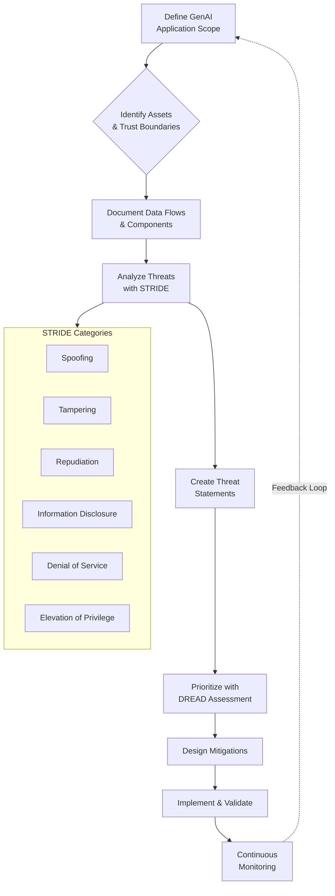

#  GenAI Threat Modeling: Framework, Diagrams & Implementation

This document provides a comprehensive GenAI threat modeling tutorial with diagrams and implementation steps. The main contents of the tutorial are as follows:

- **GenAI threat modeling framework**: Introduction to the structured approach for identifying and mitigating AI security risks.
- **Asset protection strategies**: Detailed explanation of safeguarding training data, model weights, APIs, and prompt history.
- **Threat identification**: Guidance on using STRIDE methodology and creating threat statements.
- **Mitigation implementation**: Specific controls for different threat categories with automation scripts.
- **Operationalization**: Steps for integrating threat modeling into development workflows.

-------


## 1 Introduction to GenAI Threat Modeling

Generative AI systems introduce unique security challenges that differ significantly from traditional software applications. As **threats on AI and machine learning systems** become more frequent, moving beyond controlled environments to real-world production deployments, organizations must adopt specialized threat modeling approaches to address vulnerabilities such as **exposure of personally identifiable information (PII), lack of oversight in decision-making, and insufficient logging and monitoring** . This guide provides a comprehensive framework for security teams, AI developers, and infrastructure architects to systematically identify, assess, and mitigate security risks in GenAI applications.

The **non-deterministic nature of Large Language Models (LLMs)** creates unprecedented attack surfaces where adversaries can exploit subtle vulnerabilities to manipulate model outputs, coerce unauthorized behaviors, or compromise sensitive information through techniques like **prompt injection and jailbreaking** . Unlike traditional systems with predictable input-output relationships, GenAI applications can generate highly customized outputs based on user prompts, which introduces possibilities for potential misuse or abuse .

## 2 GenAI Threat Modeling Framework

### 2.1 Core Principles

Effective GenAI threat modeling builds upon established security practices while addressing AI-specific concerns through four key stages:

- **Define AI autonomy and agency**: Determine the extent of autonomy and decision-making power the AI system will have, including any AI agents it might use 
- **Map authentication and authorization boundaries**: Clearly define where authentication and authorization should be performed across the AI pipeline 
- **Combine traditional and AI-specific controls**: Implement applicable traditional security controls for data security while deploying AI-specific mitigations for AI safety risks 
- **Establish AI-aware monitoring**: Carefully consider the pros and cons of logging in generative AI systems and determine the appropriate level of logging for your application 

### 2.2 Visualizing the Threat Modeling Process

The following workflow diagram illustrates the end-to-end threat modeling process for GenAI applications:



## 3 GenAI Assets and Protection Strategies

### 3.1 Critical Asset Inventory

Understanding and protecting GenAI-specific assets forms the foundation of effective threat modeling. These assets represent the crown jewels of your AI systems:

- **Training Data**: Proprietary datasets used for fine-tuning or continuous learning, potentially containing **sensitive business information or customer PII** 
- **Model Weights**: Intellectual property representing significant R&D investment, requiring protection from **theft or unauthorized extraction** 
- **Inference API**: The operational interface that processes user queries, vulnerable to **abuse, unauthorized access, or denial-of-service attacks** 
- **Prompt History**: Complete record of user interactions containing potentially **sensitive information submitted in prompts** and corresponding model responses 

### 3.2 Asset Protection Framework

Different assets require tailored protection strategies based on their sensitivity and potential impact if compromised:

*Table: GenAI Asset Protection Matrix*
| **Asset Category** | **Confidentiality** | **Integrity** | **Availability** | **Protection Priority** |
|-------------------|---------------------|---------------|------------------|-------------------------|
| **Training Data** | High (PII, IP) | Medium | Medium | High |
| **Model Weights** | High (IP Protection) | High | High | Critical |
| **Inference API** | Medium | High | High | High |
| **Prompt History** | High (PII, Compliance) | Medium | Low | Medium-High |

## 4 Threat Identification & Analysis

### 4.1 STRIDE Methodology for GenAI

The STRIDE framework provides a structured approach to identifying threats across six categories, with specific manifestations in GenAI systems:

- **Spoofing**: Identity欺骗 of users, models, or data sources through **credential theft, API key leakage, or model impersonation** 
- **Tampering**: Unauthorized modification of **training data, model parameters, or prompt instructions** to manipulate system behavior 
- **Repudiation**: Inability to prove actions due to **inadequate logging of AI decisions, prompt history, or model changes** 
- **Information Disclosure**: Exposure of sensitive data through **model extraction, prompt injection, training data memorization, or inference attacks** 
- **Denial of Service**: Resource exhaustion attacks targeting **computationally expensive inference operations or model serving infrastructure** 
- **Elevation of Privilege**: Bypassing authorization mechanisms through **jailbreaking, privilege escalation via manipulated prompts, or agent permission abuse** 

### 4.2 Creating Effective Threat Statements

Well-defined threat statements follow a consistent grammar to ensure comprehensive coverage and clear communication of risks. Use this structure:

> A **[threat source]** with **[prerequisites]** can **[threat action]** which leads to **[threat impact]**, negatively impacting **[impacted assets]** .

**Example Threat Statements:**
- A *threat actor* with *access to the public-facing application* can *inject malicious prompts that overwrite existing system prompts* which leads to *healthcare data from other patients being returned*, negatively impacting *the confidentiality of the database* 
- A *malicious user* with *API access* can *craft specialized queries to extract training data* which leads to *PII exposure and IP theft*, negatively impacting *model integrity and regulatory compliance* 

### 4.3 Prompt Attack Taxonomy

Modern GenAI systems face sophisticated prompt-based attacks that can be categorized by their primary impact:

*Table: Prompt Attack Classification & Mitigations*
| **Attack Category** | **Description** | **Example Techniques** | **Primary Impact** |
|---------------------|-----------------|------------------------|-------------------|
| **Goal Hijacking** | Manipulate prompts to alter model's intended behavior | Social engineering, role-playing, framing attacks | System behavior manipulation |
| **Guardrail Bypass** | Circumvent safety controls and content filters | Obfuscation, encoding, virtualization, token smuggling | Safety control failure |
| **Information Leakage** | Extract sensitive data, system prompts, or training data | Prompt injection, reconstruction attacks, divergence | Data exposure, IP theft |
| **Infrastructure Attack** | Exploit system resources or execute unauthorized code | Resource exhaustion, remote code execution, plugin abuse | System compromise, availability loss |

## 5 Mitigation Implementation

### 5.1 Defense-in-Depth Controls

Effective GenAI security requires layered defenses addressing both traditional and AI-specific vulnerabilities:

- **Data Provenance & Integrity**: Implement cryptographic verification of training data sources and model artifact integrity through **digital signatures, hash verification, and secure supply chain practices** 
- **API Security & Rate Limiting**: Protect inference endpoints with **adaptive rate limiting, API gateway controls, and workload-based throttling** to prevent abuse and denial-of-service attacks 
- **Privacy-Enhancing Technologies**: Apply **differential privacy during training, federated learning approaches, and secure multi-party computation** to protect sensitive data while maintaining model utility 
- **Output Watermarking & Provenance**: Embed **detectable signals in AI-generated content and cryptographically signed output attestations** to enable verification of AI origin and detect misuse 

### 5.2 Automation Scripts for Security Controls

#### 5.2.1 API Security & Rate Limiting Implementation

```bash
#!/bin/bash
# GenAI API Security Hardening Script
# Implements rate limiting, monitoring, and abuse detection

# Configure NGINX rate limiting for GenAI endpoints
echo '
limit_req_zone $binary_remote_addr zone=genai_api:10m rate=10r/s;
limit_req_zone $http_authorization zone=genai_auth:10m rate=100r/m;

server {
    listen 443 ssl;
    server_name genai-api.company.com;
    
    # GenAI inference endpoint - strict rate limiting
    location /v1/completions {
        limit_req zone=genai_api burst=20 nodelay;
        limit_req_status 429;
        
        # JWT validation
        auth_jwt "GenAI API";
        auth_jwt_key_file /etc/nginx/jwt_keys/secret.jwk;
        
        proxy_pass http://genai_backend;
        
        # Log prompt characteristics for security monitoring
        log_format genai_log '[$time_local] $remote_addr "$request" '
                          'prompt_length=$arg_prompt_length '
                          'response_time=$upstream_response_time';
        access_log /var/log/nginx/genai_access.log genai_log;
    }
    
    # Model management endpoints - different limits
    location /v1/models/ {
        limit_req zone=genai_auth burst=10;
        # Additional authentication requirements
    }
}
' > /etc/nginx/sites-available/genai-security

# Enable configuration
ln -sf /etc/nginx/sites-available/genai-security /etc/nginx/sites-enabled/
nginx -t && systemctl reload nginx

# Set up automated abuse detection
echo '#!/bin/bash
# Monitor for prompt injection patterns
LOG_FILE="/var/log/nginx/genai_access.log"
ABUSE_PATTERNS="(\`|\$\{|\;|\|&|wget|curl|bash|python|perl)"

tail -F $LOG_FILE | while read line; do
    if echo "$line" | grep -qE "$ABUSE_PATTERNS"; then
        echo "Potential abuse detected: $line" | \
        mail -s "GenAI Security Alert" security-team@company.com
        # Auto-block repeat offenders
        IP_ADDR=$(echo "$line" | grep -oE '[0-9]+\.[0-9]+\.[0-9]+\.[0-9]+')
        iptables -A INPUT -s $IP_ADDR -j DROP
    fi
done
' > /opt/scripts/genai_abuse_detection.sh

chmod +x /opt/scripts/genai_abuse_detection.sh
```

#### 5.2.2 Differential Privacy Implementation

```python
#!/usr/bin/env python3
"""
Differential Privacy Implementation for GenAI Training
Applies noise to gradients and implements privacy budgeting
"""

import torch
import numpy as np
from torch.utils.data import DataLoader
from transformers import AutoModelForCausalLM, AutoTokenizer
import hashlib
import json

class DifferentialPrivacyEngine:
    def __init__(self, target_epsilon=3.0, target_delta=1e-5, max_grad_norm=1.0):
        self.target_epsilon = target_epsilon
        self.target_delta = target_delta
        self.max_grad_norm = max_grad_norm
        self.privacy_budget_used = 0.0
        
    def add_noise_to_gradients(self, model, sample_rate):
        """Add calibrated noise to gradients for differential privacy"""
        for param in model.parameters():
            if param.grad is not None:
                # Calculate noise scale based on privacy requirements
                noise_scale = (self.max_grad_norm * 
                             np.sqrt(2 * np.log(1.25/self.target_delta)) /
                             self.target_epsilon)
                
                # Add Gaussian noise
                noise = torch.normal(
                    mean=0, 
                    std=noise_scale / np.sqrt(param.numel()),
                    size=param.grad.size(),
                    device=param.grad.device
                )
                param.grad += noise
                
        # Update privacy budget
        self._update_privacy_budget(sample_rate)
        
    def _update_privacy_budget(self, sample_rate):
        """Track privacy budget expenditure using moment accounting"""
        # Simplified privacy accounting
        self.privacy_budget_used += (self.target_epsilon * sample_rate)
        
    def check_privacy_budget(self):
        """Check if privacy budget is exhausted"""
        return self.privacy_budget_used < self.target_epsilon

def train_with_dp(model, train_dataset, batch_size=32, epochs=3):
    """Training loop with differential privacy"""
    dp_engine = DifferentialPrivacyEngine()
    dataloader = DataLoader(train_dataset, batch_size=batch_size, shuffle=True)
    
    for epoch in range(epochs):
        for batch_idx, batch in enumerate(dataloader):
            # Standard forward pass
            outputs = model(**batch)
            loss = outputs.loss
            
            # Backward pass
            loss.backward()
            
            # Apply DP before optimizer step
            sample_rate = batch_size / len(train_dataset)
            if dp_engine.check_privacy_budget():
                dp_engine.add_noise_to_gradients(model, sample_rate)
                
                # Optimizer step
                optimizer.step()
                optimizer.zero_grad()
            else:
                print("Privacy budget exhausted - stopping training")
                break
                
        print(f"Epoch {epoch} complete. Privacy budget used: {dp_engine.privacy_budget_used:.4f}")
    
    return model

# Example usage
if __name__ == "__main__":
    model = AutoModelForCausalLM.from_pretrained("microsoft/DialoGPT-medium")
    # Assume train_dataset is properly initialized
    # trained_model = train_with_dp(model, train_dataset)
```

## 6 Operationalizing GenAI Threat Modeling

### 6.1 Integrating Threat Modeling into Development Workflows

Successful GenAI threat modeling requires integration throughout the development lifecycle rather than being treated as a one-time activity:

- **Shift-left security integration**: Incorporate threat modeling during design phase using **architecture review gates and security requirement definition** before implementation begins 
- **Automated threat modeling tools**: Leverage AI-powered tools like **STRIDE-GPT** that can analyze application descriptions and generate threat models based on STRIDE methodology 
- **Continuous threat intelligence**: Establish processes to **monitor emerging GenAI attack techniques** and update threat models accordingly using resources like **MITRE ATLAS and OWASP LLM Top 10** 
- **Compliance alignment**: Map security controls to relevant regulations including **GDPR, HIPAA, and industry-specific AI governance frameworks** 

### 6.2 Incident Response & Monitoring

GenAI systems require specialized monitoring capabilities due to their non-deterministic nature and unique attack vectors:

- **Prompt-response logging**: Implement secure logging of **complete prompt history and model responses** while addressing PII exposure risks through **selective masking or encryption** 
- **Anomaly detection**: Deploy specialized monitoring for **unusual prompt patterns, resource utilization spikes, or output quality degradation** that might indicate security incidents 
- **Model behavior drift detection**: Continuously monitor for **unexpected changes in model outputs** that might indicate compromise or data poisoning 
- **Forensic readiness**: Maintain **cryptographic provenance of model artifacts** and detailed audit trails to support incident investigation 

## 7 Continuous Improvement & Governance

### 7.1 Threat Model Maintenance

Treat threat models as living documents that evolve with your GenAI applications and the changing threat landscape:

- **Regular review cycles**: Establish **quarterly threat model reviews** to assess new risks from model updates, infrastructure changes, or emerging attack techniques 
- **Attack simulation**: Conduct **red team exercises specifically targeting GenAI components** using techniques like prompt injection, model evasion, and data extraction 
- **Metrics and measurement**: Track **security effectiveness metrics** including mean time to detect attacks, false positive rates for content filters, and time to remediate vulnerabilities 
- **Cross-functional governance**: Form **AI security working groups** with representatives from security, data science, legal, and business units to address the multifaceted nature of GenAI risks 

### 7.2 Organizational Enablement

Building security capability across the organization is essential for scaling GenAI safely:

- **Specialized training**: Develop **GenAI security awareness programs** covering prompt injection risks, data handling requirements, and approved usage patterns 
- **Guardrail libraries**: Create **shared repositories of pre-approved prompts, input sanitization functions, and output validation templates** to promote security by default 
- **Reference architectures**: Document **secured GenAI patterns** for common use cases like chatbots, content generation, and data analysis with built-in security controls 
- **Community engagement**: Participate in **industry forums and security communities** to share lessons learned and stay current on evolving GenAI threats 

## 8 Conclusion

GenAI threat modeling requires both adapting traditional security practices and addressing AI-specific risks through specialized frameworks. By systematically identifying assets, analyzing threats using structured methodologies like STRIDE, and implementing layered defenses, organizations can harness the transformative potential of Generative AI while maintaining appropriate security controls.

The unique characteristics of GenAI systems—including their non-deterministic behavior, training data sensitivity, and novel attack vectors like prompt injection—demand continuous vigilance and adaptation of security practices. Organizations that establish robust threat modeling processes integrated throughout the AI development lifecycle will be best positioned to mitigate risks while enabling innovation.

## 9 References & Further Reading

1. AWS AI Security Guide - Threat modeling for generative AI applications 
2. Palo Alto Networks - Comprehensive Guide to Prompt Attacks 
3. OWASP LLM Security Top 10 
4. MITRE ATLAS Framework - Adversarial Threat Landscape for AI Systems
5. IBM Generative AI Implementation Guide 
6. STRIDE-GPT - AI-powered threat modeling tool 
7. Chris Farris - Threat Modeling GenAI Applications 

*Note: This guide should be complemented with organization-specific security policies and regular updates to address the rapidly evolving GenAI security landscape.*