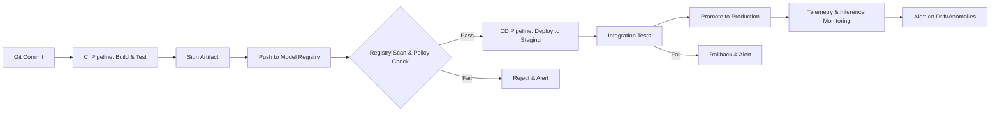

### **Building Secure & Automated Machine Learning Pipelines**

*A Practitioner's Guide*

**Author:** Purushotham Muktha
**Date:** October 26, 2025
**Status:** Living Document

---

### **1. Introduction: Why Bother?**

So, we've all been there. You get a Jupyter notebook from a data scientist, it works on their machine, and now you have to somehow turn it into a production service. The old way—manual scripts, ad-hoc deployments, hardcoded API keys—is a ticking time bomb. It's not scalable, and more importantly, it's *insecure*.

A secure ML pipeline isn't a luxury; it's a necessity. It ensures that:
*   **Our models are trustworthy.** We know exactly what code and data went into them.
*   **Our secrets are safe.** No more accidental commits of AWS keys to GitHub.
*   **We can audit everything.** Who deployed what, when, and why.
*   **We can sleep at night.** Knowing that a broken model can be rolled back instantly.

This doc lays out the core controls and automation strategies to make this a reality. Think of it as our playbook.

---

### **2. The Core Controls (The "What" and "Why")**

These are the non-negotiable security measures we must implement.

#### **2.1 Reproducible Builds**
**The Problem:** "But it worked on my machine!" The classic excuse. If we can't consistently recreate the exact same model artifact from the same source code and data, we have no stability, no trust, and a nightmare for debugging.

**The Solution:** Containerize everything. Use Docker to capture the entire environment: Python version, library dependencies, system tools. Pin *everything*. Your `Dockerfile` and `requirements.txt` (or `environment.yml`) are now sacred documents.

#### **2.2 Signed Artifacts**
**The Problem:** How do we know the model we're deploying in production is the one that passed our testing and security scans? What if someone tampered with it in the registry?

**The Solution:** Digital signatures. When our CI/CD pipeline builds a model artifact (e.g., a `.tar.gz` file or a Docker image containing the model), it cryptographically signs it. Before deployment, the pipeline verifies this signature. It's a seal of authenticity.

#### **2.3 Secrets Management**
**The Problem:** We've all seen the `db_password = "supersecret123"` in a script. This is a catastrophic practice. It leads to secrets being leaked in version control, making our data stores vulnerable.

**The Solution:** Never store secrets in code. Ever. Use a dedicated secrets manager (e.g., HashiCorp Vault, AWS Secrets Manager, Azure Key Vault). Our applications and pipelines pull secrets dynamically at runtime.

#### **2.4 Access Control for Datasets**
**The Problem:** Training data often contains sensitive information (PII, financial data). Not every data scientist needs access to all of it. Unrestricted access is a compliance and security risk.

**The Solution:** Implement the Principle of Least Privilege (PoLP) using Role-Based Access Control (RBAC). Define roles like `data-scientist`, `ml-engineer`, and `auditor`. Control access to data sources (e.g., S3 buckets, SQL databases) based on these roles.

---

### **3. The Automation & Implementation (The "How")**

This is where we turn theory into practice. Let's map these controls to a concrete CI/CD pipeline.

#### **3.1 The High-Level Flow**

Here's the entire process, from code commit to monitored model, visualized.



*Diagram 1: The end-to-end secure ML pipeline workflow.*

#### **3.2 Phase 1: CI Pipeline - Build, Test, and Sign**

This phase is triggered on every pull request or merge to the main branch.

**Implementation Steps & Scripts:**

1.  **Lint & Security Scan:**
    ```bash
    #!/bin/bash
    # scripts/ci_security_scan.sh
    
    # Step 1: Lint Python code
    echo "Running flake8 linter..."
    flake8 src/ --max-line-length=127 --statistics
    
    # Step 2: Scan for vulnerable dependencies
    echo "Running safety check..."
    safety check --json | tee safety_report.json
    
    # Step 3: Static Application Security Testing (SAST)
    echo "Running Bandit SAST..."
    bandit -r src/ -f json -o bandit_report.json
    ```
    *If any of these fail, the pipeline fails early.*

2.  **Reproducible Build (Docker):**
    ```dockerfile
    # Dockerfile
    FROM python:3.9-slim@sha256:a1d4b2e8c5c...  # Pin the exact base image
    
    WORKDIR /app
    
    # Copy dependency list first for better layer caching
    COPY requirements.txt .
    RUN pip install --no-cache-dir -r requirements.txt
    
    COPY src/ ./src/
    
    # Define a non-root user for security
    RUN useradd --create-home --shell /bin/bash appuser
    USER appuser
    ```

3.  **Unit Tests:**
    ```bash
    # Run inside the Docker container or locally
    pytest tests/unit/ -v --cov=src --cov-report=xml
    ```

4.  **Sign the Artifact:**
    ```bash
    #!/bin/bash
    # scripts/sign_artifact.sh
    
    IMAGE_TAG="my-registry.com/ml-model:${GIT_COMMIT}"
    ARTIFACT_FILE="model-${GIT_COMMIT}.tar.gz"
    
    # Build and push the Docker image
    docker build -t $IMAGE_TAG .
    docker push $IMAGE_TAG
    
    # Alternatively, for a raw file, use a tool like cosign
    # First, create the artifact (e.g., from training)
    tar -czf $ARTIFACT_FILE model.pkl
    
    # Sign the artifact using Cosign and a private key from our secrets manager
    cosign sign --key env://COSIGN_PRIVATE_KEY $ARTIFACT_FILE
    ```
    *Note: The `COSIGN_PRIVATE_KEY` is injected from our secrets manager (e.g., Vault) as a pipeline secret, never stored in the code.*

#### **3.3 Phase 2: Model Registry & Policies**

The model registry (e.g., MLflow Model Registry, S3 with a meta-database) is more than just storage; it's a gatekeeper.

**Registry Policies (Checks before promotion):**
*   **Signature Verification:** `cosign verify --key public.key $ARTIFACT_FILE`
*   **SBOM Check:** Must have a Software Bill of Materials (SBOM) attached.
*   **Metadata Requirements:** Must be linked to a specific Git commit, user, and have passed all tests.

#### **3.4 Phase 3: CD Pipeline - Deploy with Confidence**

This phase is triggered when a model in the registry is approved for staging/production.

**Implementation Steps & Scripts:**

1.  **Deploy to Staging:**
    ```bash
    #!/bin/bash
    # scripts/deploy_staging.sh
    
    # Pull the signed image
    docker pull $SIGNED_IMAGE_TAG
    
    # Verify the signature BEFORE deploying
    cosign verify --key public.key $SIGNED_IMAGE_TAG
    
    # Deploy to Kubernetes
    kubectl set image deployment/ml-model-staging ml-model=$SIGNED_IMAGE_TAG -n staging
    ```

2.  **Integration Tests:**
    ```python
    # tests/integration/test_staging_api.py
    import requests
    
    def test_staging_model_inference():
        url = "https://staging-ml-service.com/predict"
        headers = {"Authorization": f"Bearer {os.getenv('STAGING_API_KEY')}"}
        test_data = {...}
        
        response = requests.post(url, json=test_data, headers=headers)
        assert response.status_code == 200
        prediction = response.json()
        # ... validate prediction structure and business logic
    ```
    *The `STAGING_API_KEY` is fetched from the secrets manager.*

3.  **Promote to Production:**
    *   This should be a manual approval step in the CD pipeline (e.g., a "Promote" button in GitHub Actions/GitLab CI).
    *   Once approved, the exact same, verified artifact is deployed to the production namespace.
    *   **No rebuilds in production!** The artifact is immutable.

#### **3.5 Phase 4: Telemetry & Inference Monitoring**

The job isn't done once the model is live. We need to monitor its behavior.

**What to Monitor:**
*   **Data Drift:** Has the statistical distribution of the live input data changed from the training data?
*   **Concept Drift:** Has the relationship between the input and the target variable changed?
*   **Anomalies & Outliers:** Are we seeing weird, unexpected inputs?
*   **Performance Metrics:** Accuracy, latency, throughput.

**Practical Script Snippet (Logging):**
```python
# Inside your inference API (e.g., a FastAPI app)
from prometheus_client import Counter, Histogram, Summary
import time

REQUEST_COUNT = Counter('inference_requests_total', 'Total inference requests')
PREDICTION_DISTRIBUTION = Histogram('model_prediction_value', 'Distribution of prediction values')
REQUEST_DURATION = Summary('request_duration_seconds', 'Time spent processing request')

@app.post("/predict")
async def predict(features: FeatureSchema):
    REQUEST_COUNT.inc()
    start_time = time.time()
    
    # ... pre-processing and model prediction ...
    prediction = model.predict([features.values])
    
    # Log the prediction for drift detection
    PREDICTION_DISTRIBUTION.observe(prediction[0])
    
    # Log the features and prediction for analysis
    # This goes to a secure data lake/warehouse (e.g., S3, BigQuery)
    log_entry = {
        "timestamp": datetime.utcnow().isoformat(),
        "model_version": os.getenv('MODEL_VERSION'),
        "features": features.dict(),
        "prediction": float(prediction[0])
    }
    # Send log_entry to your logging system asynchronously
    
    request_duration = time.time() - start_time
    REQUEST_DURATION.observe(request_duration)
    
    return {"prediction": prediction[0]}
```

We can then set up alerts in Grafana or Datadog when our drift metrics exceed a certain threshold.

---

### **4. References & Further Reading**

*   **Secrets Management:**
    *   [HashiCorp Vault Documentation](https://www.vaultproject.io/docs)
    *   [AWS Secrets Manager](https://aws.amazon.com/secrets-manager/)
*   **Software Supply Chain Security:**
    *   [SLSA Framework](https://slsa.dev/) (Excellent for reproducible builds and provenance)
    *   [Cosign](https://github.com/sigstore/cosign) (For signing artifacts)
*   **Model Registries:**
    *   [MLflow Model Registry](https://mlflow.org/docs/latest/model-registry.html)
    *   [Weights & Biases Model Registry](https://docs.wandb.ai/guides/models)
*   **Monitoring:**
    *   [Evidently AI](https://evidentlyai.com/) (Open-source library for monitoring ML models)
    *   [NannyML](https://nannyml.com/) (Open-source library for detecting concept drift)

---

### **Summary & Final Thoughts**

Building a secure pipeline is an investment. It feels like overhead at first, but it pays for itself the first time you need to debug a production issue, respond to an audit, or prevent a security incident.

**Start small.** You don't need to implement all of this at once.
1.  **Week 1:** Containerize your model and set up a basic CI pipeline with tests.
2.  **Week 2:** Integrate your secrets manager. Eliminate all hardcoded secrets.
3.  **Week 3:** Start signing your artifacts and using a model registry.
4.  **Week 4:** Add basic inference logging and a dashboard.

Iterate and improve. This document is our foundation. Let's build on it.