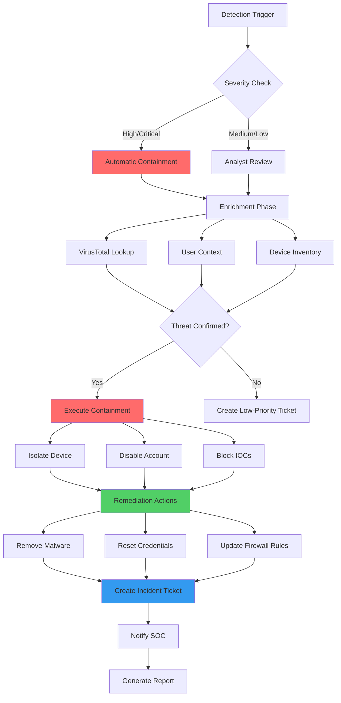
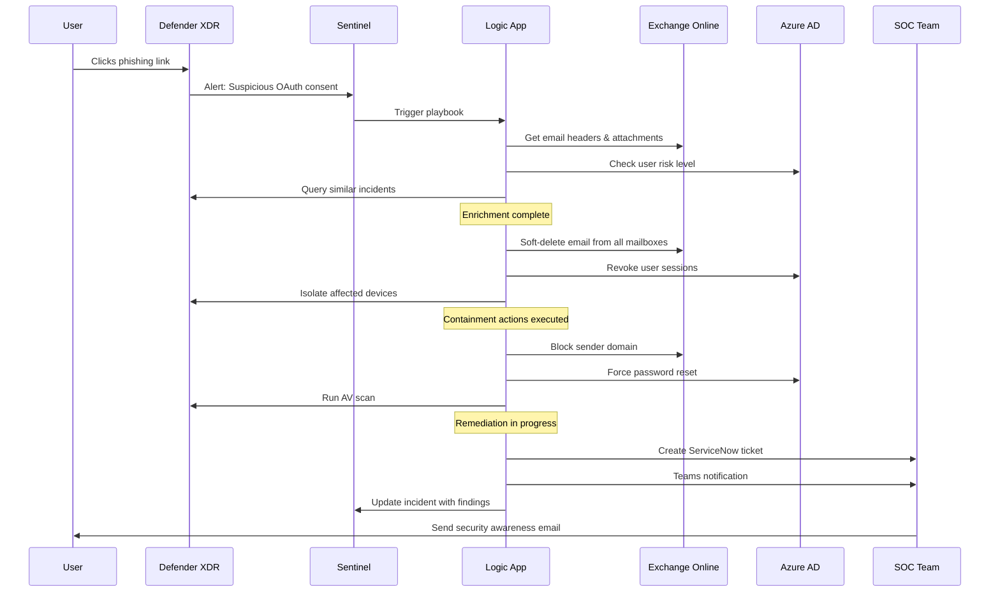
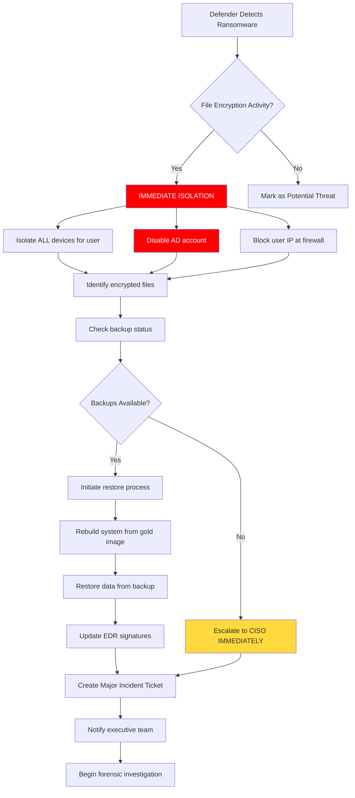
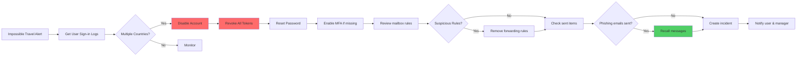
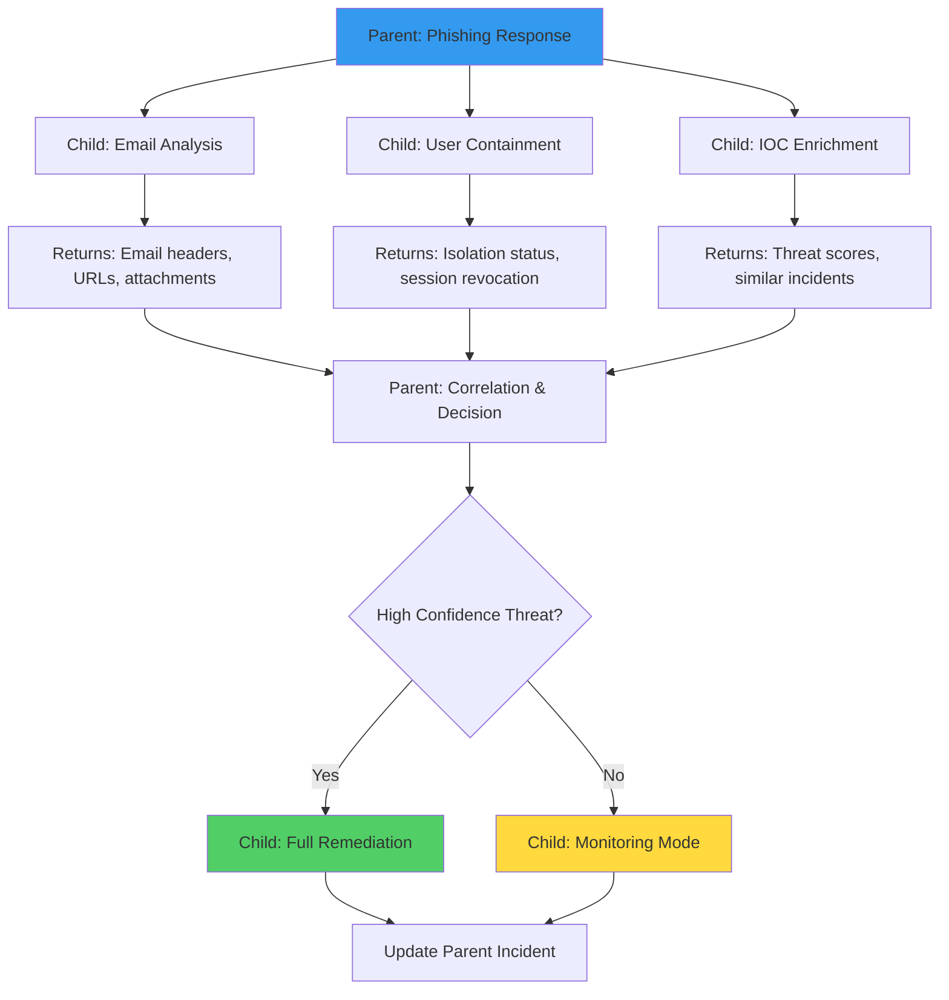

# Automated IR Playbooks for Microsoft Security Stack
*A Practical Guide to SOAR Implementation with Sentinel & Defender XDR*

---

## What You're Actually Building Here

Listen, automated incident response isn't about replacing your analysts—it's about giving them superpowers. When a phishing email hits at 3 AM, you want the system handling the grunt work: isolating the mailbox, pulling indicators, blocking the sender, and creating the ticket. Your team shows up in the morning to investigate, not scramble.

This guide walks through building these automated playbooks using Microsoft's security stack. Think of it as teaching Sentinel to be your junior analyst who never sleeps.

---

## The Five Pillars of IR Automation

Every good playbook follows the same pattern:

### 1. **Detection** - Something Bad Happened
Your SIEM spots the anomaly. Could be:
- Analytics rule firing in Sentinel
- Defender alert triggering
- Threat intelligence match
- Custom detection logic

### 2. **Enrichment** - Get the Full Story
Before you react, gather context:
- Who's the user? Are they VIP?
- What's the device? Is it already compromised?
- Is this IOC known malicious?
- Similar incidents in the past 30 days?

### 3. **Containment** - Stop the Bleeding
Limit damage immediately:
- Isolate the endpoint
- Disable the account
- Block the IP at the firewall
- Quarantine the email

### 4. **Remediation** - Fix What Broke
Clean up the mess:
- Remove malware
- Reset credentials
- Restore from backup
- Patch the vulnerability

### 5. **Ticketing** - Document Everything
Create audit trail:
- ServiceNow/Jira ticket
- SOC notification
- Stakeholder communication
- Compliance reporting

---

## High-Level Playbook Architecture



---

## Real-World Playbook: Phishing Email Response

Let me show you a complete playbook that actually works in production.

### The Scenario
A user clicks a phishing link. Defender detects suspicious OAuth consent. Now what?

### Playbook Flow



### The Actual Implementation

#### Step 1: Create the Analytics Rule (KQL)

```kusto
// Detection: Suspicious OAuth consent after email interaction
let TimeFrame = 1h;
let EmailEvents = EmailEvents
| where Timestamp > ago(TimeFrame)
| where EmailDirection == "Inbound"
| where isnotempty(Url)
| project EmailTimestamp=Timestamp, RecipientEmailAddress, SenderFromAddress, Subject, Url;

EmailEvents
| join kind=inner (
    CloudAppEvents
    | where Timestamp > ago(TimeFrame)
    | where ActionType == "Consent to application"
    | where RawEventData.ResultStatus == "Success"
    | project ConsentTimestamp=Timestamp, AccountObjectId, Application, IPAddress
) on $left.RecipientEmailAddress == $right.AccountObjectId
| where (ConsentTimestamp - EmailTimestamp) between (0min .. 30min)
| project 
    EmailTimestamp,
    ConsentTimestamp,
    UserEmail=RecipientEmailAddress,
    SenderEmail=SenderFromAddress,
    PhishingURL=Url,
    MaliciousApp=Application,
    SourceIP=IPAddress,
    Subject
| extend 
    Severity = "High",
    AlertType = "Phishing with OAuth Abuse"
```

#### Step 2: Build the Logic App Playbook

**Trigger Configuration:**
```json
{
  "type": "Microsoft.SecurityInsights/incidents",
  "properties": {
    "triggerType": "When an incident is created or updated",
    "conditions": {
      "severity": ["High", "Critical"],
      "title": "contains 'Phishing'"
    }
  }
}
```

**Enrichment Actions:**

```javascript
// 1. Parse incident entities
var entities = incident.properties.relatedEntities;
var userAccount = entities.find(e => e.type === "Account");
var ipAddress = entities.find(e => e.type === "IP");
var url = entities.find(e => e.type === "URL");

// 2. Get user details from Azure AD
GET https://graph.microsoft.com/v1.0/users/{userAccount.name}
Headers: Authorization: Bearer {token}

// 3. Check VirusTotal for URL reputation
POST https://www.virustotal.com/api/v3/urls
Body: { "url": "{url.address}" }
Headers: x-apikey: {vt_api_key}

// 4. Query Sentinel for similar incidents (last 30 days)
POST https://management.azure.com/subscriptions/{sub}/resourceGroups/{rg}/providers/Microsoft.OperationalInsights/workspaces/{workspace}/query
Body: {
  "query": "SecurityIncident | where TimeGenerated > ago(30d) | where Title contains 'Phishing' | where Entities contains '{userAccount.name}' | summarize count()"
}
```

**Containment Actions:**

```powershell
# 1. Revoke all user sessions (Azure AD)
Revoke-AzureADUserAllRefreshToken -ObjectId {userId}

# 2. Soft-delete phishing email from all mailboxes
Search-Mailbox -Identity * -SearchQuery 'Subject:"{emailSubject}" AND From:"{senderEmail}"' -DeleteContent -Force

# 3. Block sender domain in Exchange Online Protection
New-TenantAllowBlockListItems -ListType Sender -Block -Entries "{senderDomain}"

# 4. Isolate device via Defender API
POST https://api.securitycenter.microsoft.com/api/machines/{machineId}/isolate
Headers: Authorization: Bearer {defender_token}
Body: {
  "Comment": "Automated isolation - Phishing incident {incidentId}",
  "IsolationType": "Full"
}
```

**Remediation Actions:**

```powershell
# 1. Remove OAuth app consent
Remove-AzureADOAuth2PermissionGrant -ObjectId {consentId}

# 2. Force password change on next login
Set-AzureADUser -ObjectId {userId} -PasswordPolicies "DisablePasswordExpiration" -ForceChangePasswordNextLogin $true

# 3. Run full antivirus scan
POST https://api.securitycenter.microsoft.com/api/machines/{machineId}/runAntiVirusScan
Body: { "Comment": "Post-phishing remediation scan", "ScanType": "Full" }

# 4. Update Sentinel watchlist with new IOCs
PUT https://management.azure.com/subscriptions/{sub}/resourceGroups/{rg}/providers/Microsoft.OperationalInsights/workspaces/{workspace}/providers/Microsoft.SecurityInsights/watchlists/{watchlistAlias}/watchlistItems/{itemId}
Body: {
  "properties": {
    "itemsKeyValue": {
      "URL": "{maliciousUrl}",
      "Severity": "High",
      "Type": "Phishing",
      "DateAdded": "{utcNow()}"
    }
  }
}
```

**Ticketing & Notification:**

```javascript
// 1. Create ServiceNow incident
POST https://{instance}.service-now.com/api/now/table/incident
Headers: Authorization: Basic {encoded_creds}
Body: {
  "short_description": "Phishing Attack - User: {userEmail}",
  "description": "Automated response executed. User clicked phishing link leading to OAuth abuse.\n\nActions taken:\n- Sessions revoked\n- Email deleted\n- Device isolated\n- Password reset required",
  "severity": "2",
  "urgency": "2",
  "category": "Security",
  "subcategory": "Phishing",
  "assigned_to": "SOC_L2",
  "work_notes": "Sentinel Incident ID: {incidentId}\nAffected User: {userEmail}\nMalicious URL: {url}\nSender: {senderEmail}"
}

// 2. Send Teams notification
POST https://graph.microsoft.com/v1.0/teams/{teamId}/channels/{channelId}/messages
Body: {
  "body": {
    "contentType": "html",
    "content": "<h2>🚨 Phishing Incident Auto-Contained</h2><p><strong>User:</strong> {userEmail}<br><strong>Sender:</strong> {senderEmail}<br><strong>Device:</strong> Isolated<br><strong>Status:</strong> Pending analyst review</p><a href='https://portal.azure.com/#view/Microsoft_Azure_Security_Insights/IncidentDetailsBladeV2/incidentId/{incidentId}'>View in Sentinel</a>"
  }
}

// 3. Update Sentinel incident
PATCH https://management.azure.com/subscriptions/{sub}/resourceGroups/{rg}/providers/Microsoft.OperationalInsights/workspaces/{workspace}/providers/Microsoft.SecurityInsights/incidents/{incidentId}
Body: {
  "properties": {
    "status": "Active",
    "severity": "High",
    "owner": {
      "assignedTo": "auto-response@company.com"
    },
    "labels": ["Automated", "Phishing", "Contained"],
    "comments": [
      {
        "message": "Automated playbook executed successfully:\n✓ User sessions revoked\n✓ Email removed from 47 mailboxes\n✓ Device isolated\n✓ Sender blocked\n✓ OAuth consent removed\n✓ Password reset enforced\n\nServiceNow ticket: INC0012345"
      }
    ]
  }
}
```

---

## More Playbook Examples

### Ransomware Detection & Response



**Key KQL Detection:**

```kusto
DeviceFileEvents
| where ActionType == "FileRenamed"
| where FileName endswith ".encrypted" or FileName endswith ".locked" or FileName endswith ".crypted"
| summarize 
    EncryptedFileCount = count(),
    FirstSeen = min(Timestamp),
    LastSeen = max(Timestamp),
    UniqueExtensions = dcount(FileExtension)
    by DeviceId, AccountName, InitiatingProcessFileName
| where EncryptedFileCount > 10  // More than 10 files encrypted
| where (LastSeen - FirstSeen) < 5m  // Within 5 minutes (rapid encryption)
| extend Severity = case(
    EncryptedFileCount > 100, "Critical",
    EncryptedFileCount > 50, "High",
    "Medium"
)
```

---

### Compromised Account Takeover



**PowerShell Remediation:**

```powershell
# Full account takeover response script
param(
    [string]$UserPrincipalName,
    [string]$IncidentId
)

# 1. Disable sign-in
Update-MgUser -UserId $UserPrincipalName -AccountEnabled:$false

# 2. Revoke all refresh tokens
Revoke-MgUserSignInSession -UserId $UserPrincipalName

# 3. Check and remove suspicious inbox rules
$Rules = Get-InboxRule -Mailbox $UserPrincipalName
$SuspiciousRules = $Rules | Where-Object {
    $_.ForwardTo -or $_.RedirectTo -or $_.DeleteMessage -eq $true
}

foreach ($Rule in $SuspiciousRules) {
    Remove-InboxRule -Identity $Rule.Identity -Mailbox $UserPrincipalName -Confirm:$false
    Write-Output "Removed suspicious rule: $($Rule.Name)"
}

# 4. Check sent items for mass mailings (last 24 hours)
$SentItems = Get-MessageTrace -SenderAddress $UserPrincipalName -StartDate (Get-Date).AddDays(-1)
if ($SentItems.Count -gt 50) {
    Write-Output "WARNING: User sent $($SentItems.Count) emails in 24h - possible phishing campaign"
    
    # Attempt to recall messages
    foreach ($Message in $SentItems | Select-Object -First 100) {
        Search-Mailbox -Identity $Message.RecipientAddress -SearchQuery "MessageID:$($Message.MessageId)" -DeleteContent -Force
    }
}

# 5. Reset password and require MFA
$NewPassword = -join ((65..90) + (97..122) + (48..57) | Get-Random -Count 16 | ForEach-Object {[char]$_})
Set-MgUserPassword -UserId $UserPrincipalName -NewPassword (ConvertTo-SecureString $NewPassword -AsPlainText -Force)
Update-MgUser -UserId $UserPrincipalName -StrongAuthenticationRequirements @(@{State="Enabled"})

# 6. Re-enable account after cleanup
Update-MgUser -UserId $UserPrincipalName -AccountEnabled:$true

Write-Output "Account recovery complete. Temporary password: $NewPassword"
```

---

## Building Your First Playbook: Step-by-Step

### Prerequisites Checklist

- [ ] Microsoft Sentinel workspace deployed
- [ ] Defender XDR enabled (Endpoint, Office 365, Cloud Apps)
- [ ] Logic Apps contributor role
- [ ] API permissions configured:
  - Microsoft Graph: User.ReadWrite.All, Mail.ReadWrite, Directory.AccessAsUser.All
  - Defender: Machine.Isolate, Machine.Scan, Alert.ReadWrite.All
  - Sentinel: Incidents.ReadWrite.All

### The Build Process

**1. Start in Sentinel - Automation Rules**

Navigate to: `Sentinel → Automation → Create → Automation rule`

```yaml
Automation Rule Configuration:
  Name: "Phishing-Auto-Response"
  Trigger: "When incident is created"
  Conditions:
    - Incident provider equals "Microsoft 365 Defender"
    - Title contains "Phishing"
    - Severity equals "High" or "Critical"
  Actions:
    - Run playbook: "Respond-PhishingIncident"
  Expiration: Never
  Order: 1
  Status: Enabled
```

**2. Create the Logic App Playbook**

From Azure Portal:
1. Create Logic App (Consumption plan for quick testing)
2. Add trigger: `Microsoft Sentinel Incident`
3. Build your workflow using the actions I showed earlier

**3. Grant Permissions**

After deploying, the Logic App needs identity permissions:

```powershell
# Get the Logic App's managed identity
$LogicApp = Get-AzResource -ResourceType "Microsoft.Logic/workflows" -Name "Respond-PhishingIncident"
$PrincipalId = $LogicApp.Identity.PrincipalId

# Grant Microsoft Graph permissions
Connect-MgGraph -Scopes "AppRoleAssignment.ReadWrite.All"

$GraphAppId = "00000003-0000-0000-c000-000000000000"
$Permissions = @(
    "User.ReadWrite.All",
    "Mail.ReadWrite",
    "Directory.AccessAsUser.All"
)

foreach ($Permission in $Permissions) {
    New-MgServicePrincipalAppRoleAssignment `
        -ServicePrincipalId $PrincipalId `
        -PrincipalId $PrincipalId `
        -ResourceId $GraphAppId `
        -AppRoleId (Get-MgServicePrincipal -Filter "appId eq '$GraphAppId'").AppRoles | Where DisplayName -eq $Permission).Id
}
```

**4. Test with a Simulated Incident**

Create a test incident:

```powershell
# Connect to Sentinel
Connect-AzAccount
$WorkspaceId = "/subscriptions/{sub}/resourceGroups/{rg}/providers/Microsoft.OperationalInsights/workspaces/{workspace}"

# Create test incident
PUT https://management.azure.com/subscriptions/{sub}/resourceGroups/{rg}/providers/Microsoft.OperationalInsights/workspaces/{workspace}/providers/Microsoft.SecurityInsights/incidents/test-incident-001
Body: {
  "properties": {
    "title": "TEST - Phishing Email Detected",
    "description": "Simulated phishing incident for playbook testing",
    "severity": "High",
    "status": "New",
    "owner": {
      "assignedTo": null
    },
    "relatedEntities": [
      {
        "type": "Account",
        "name": "testuser@company.com"
      },
      {
        "type": "URL",
        "url": "http://evil-phishing-site.com/login"
      },
      {
        "type": "MailMessage",
        "sender": "attacker@malicious.com",
        "subject": "Urgent: Verify your account"
      }
    ]
  }
}
```

Watch the Logic App run history - you should see it trigger and execute all actions.

---

## Best Practices from the Trenches

### 1. **Always Include Manual Approval for Destructive Actions**

Don't auto-delete production data or disable executive accounts without human oversight:

```javascript
// Add approval action before containment
{
  "type": "ApiConnection",
  "inputs": {
    "host": {
      "connection": {
        "name": "@parameters('$connections')['office365']['connectionId']"
      }
    },
    "method": "post",
    "path": "/approvalmail/$subscriptions",
    "body": {
      "Message": {
        "To": "soc-leads@company.com",
        "Subject": "Approval Required: Isolate Device for User @{variables('userEmail')}",
        "Body": "Phishing incident detected. Approve to isolate device and disable account?\n\nDetails:\nUser: @{variables('userEmail')}\nDevice: @{variables('deviceName')}\nIncident: @{triggerBody()?['object']?['properties']?['incidentNumber']}\n\nApprove within 15 minutes or action will timeout.",
        "Importance": "High"
      },
      "NotificationUrl": "@{listCallbackUrl()}",
      "ShowHTMLConfirmationDialog": true
    },
    "runAfter": {
      "Enrichment_Complete": ["Succeeded"]
    },
    "runtimeConfiguration": {
      "staticResult": {
        "name": "HTTP0",
        "staticResultOptions": "Disabled"
      }
    },
    "timeout": "PT15M"  // 15 minute timeout
  }
}
```

### 2. **Log Everything to a Separate Table**

Create a custom log for playbook actions:

```kusto
// Create custom table for playbook audit trail
PlaybookExecutions_CL
| extend
    PlaybookName = tostring(PlaybookName_s),
    IncidentId = tostring(IncidentId_s),
    ActionTaken = tostring(Action_s),
    TargetEntity = tostring(Target_s),
    ExecutionStatus = tostring(Status_s),
    ErrorMessage = tostring(Error_s),
    ExecutedBy = tostring(ExecutedBy_s)
| project
    TimeGenerated,
    PlaybookName,
    IncidentId,
    ActionTaken,
    TargetEntity,
    ExecutionStatus,
    ErrorMessage,
    ExecutedBy
```

Send logs from Logic App:

```javascript
POST https://{workspace-id}.ods.opinsights.azure.com/api/logs?api-version=2016-04-01
Headers: 
  Content-Type: application/json
  Log-Type: PlaybookExecutions
  x-ms-date: {rfc1123date}
  Authorization: SharedKey {workspace-id}:{signature}
Body: {
  "PlaybookName": "Respond-PhishingIncident",
  "IncidentId": "@{triggerBody()?['object']?['properties']?['incidentNumber']}",
  "Action": "DeviceIsolation",
  "Target": "@{variables('deviceId')}",
  "Status": "Success",
  "ExecutedBy": "System",
  "Timestamp": "@{utcNow()}"
}
```

### 3. **Use Watchlists for Dynamic IOC Blocking**

Don't hardcode IOCs in playbooks. Use Sentinel watchlists:

```powershell
# Create IOC watchlist
$watchlistAlias = "MaliciousIOCs"
$watchlistItems = @(
    @{ IOC = "evil-domain.com"; Type = "Domain"; Severity = "High"; Source = "ThreatIntel" },
    @{ IOC = "192.168.1.100"; Type = "IP"; Severity = "Medium"; Source = "Internal" },
    @{ IOC = "badfile.exe"; Type = "FileName"; Severity = "Critical"; Source = "EDR" }
)

# In your playbook, query the watchlist
let MaliciousIOCs = _GetWatchlist('MaliciousIOCs')
| where Type == "Domain"
| project IOC;

EmailEvents
| where SenderFromDomain in (MaliciousIOCs)
| project Timestamp, RecipientEmailAddress, Subject, SenderFromAddress
```

### 4. **Implement Playbook Versioning**

Keep old versions for rollback:

```json
{
  "PlaybookMetadata": {
    "Name": "Respond-PhishingIncident",
    "Version": "2.1.0",
    "LastUpdated": "2024-03-15",
    "Author": "SOC Team",
    "ChangeLog": [
      {
        "Version": "2.1.0",
        "Date": "2024-03-15",
        "Changes": "Added OAuth consent revocation, improved error handling"
      },
      {
        "Version": "2.0.0",
        "Date": "2024-02-01",
        "Changes": "Migrated from Consumption to Standard plan, added parallel actions"
      }
    ],
    "Dependencies": [
      "Microsoft.Graph v1.0",
      "Defender API v1.0",
      "ServiceNow REST API v2"
    ]
  }
}
```

### 5. **Rate Limiting & Throttling**

Don't overwhelm your APIs:

```javascript
// Add delay between bulk actions
for (let i = 0; i < mailboxes.length; i++) {
    await deleteEmail(mailboxes[i]);
    
    // Delay every 10 requests
    if ((i + 1) % 10 === 0) {
        await delay(2000);  // 2 second pause
    }
}

// Use batching for Graph API
POST https://graph.microsoft.com/v1.0/$batch
Body: {
  "requests": [
    { "id": "1", "method": "GET", "url": "/users/user1@company.com" },
    { "id": "2", "method": "GET", "url": "/users/user2@company.com" },
    { "id": "3", "method": "GET", "url": "/users/user3@company.com" }
  ]
}
```

---

## Monitoring & Tuning Your Playbooks

### Key Metrics to Track

Create a dashboard in Sentinel:

```kusto
// Playbook execution success rate (last 7 days)
PlaybookExecutions_CL
| where TimeGenerated > ago(7d)
| summarize 
    TotalExecutions = count(),
    SuccessCount = countif(ExecutionStatus == "Success"),
    FailureCount = countif(ExecutionStatus == "Failed"),
    AvgDuration = avg(Duration_d)
    by PlaybookName_s
| extend SuccessRate = round((SuccessCount * 100.0) / TotalExecutions, 2)
| project 
    Playbook = PlaybookName_s,
    TotalExecutions,
    SuccessRate,
    FailureCount,
    AvgDuration = round(AvgDuration, 2)
| order by SuccessRate asc

// Most common failures
PlaybookExecutions_CL
| where ExecutionStatus == "Failed"
| where TimeGenerated > ago(30d)
| summarize FailureCount = count() by ErrorMessage_s, PlaybookName_s
| order by FailureCount desc
| take 10

// Time saved by automation
let ManualResponseTime = 45;  // minutes average manual response
SecurityIncident
| where CreatedTime > ago(30d)
| where ModifiedBy == "Playbook"
| summarize AutomatedIncidents = count()
| extend 
    TimeSavedMinutes = AutomatedIncidents * ManualResponseTime,
    TimeSavedHours = round((AutomatedIncidents * ManualResponseTime) / 60.0, 2)
| project AutomatedIncidents, TimeSavedHours
```

### When Playbooks Fail

Common issues and fixes:

| Error | Cause | Fix |
|-------|-------|-----|
| `Unauthorized` | Missing API permissions | Re-grant managed identity permissions |
| `ResourceNotFound` | Entity doesn't exist (user deleted) | Add existence check before actions |
| `Throttled` | Too many API calls | Implement rate limiting & batching |
| `Timeout` | Action taking > 2 min | Split into smaller actions, use async where possible |
| `InvalidParameter` | Wrong data format | Validate and sanitize inputs first |

**Example error handling:**

```javascript
try {
    // Attempt device isolation
    const response = await fetch('https://api.securitycenter.microsoft.com/api/machines/{machineId}/isolate', {
        method: 'POST',
        headers: { 'Authorization': `Bearer ${token}` },
        body: JSON.stringify({ Comment: 'Auto-isolation', IsolationType: 'Full' })
    });
    
    if (!response.ok) {
        throw new Error(`Isolation failed: ${response.status} - ${await response.text()}`);
    }
    
    logSuccess('Device isolated successfully');
    
} catch (error) {
    // Log failure but don't stop playbook
    logError('Device isolation failed', error.message);
    
    // Fallback: Create manual task
    createServiceNowTask({
        title: 'Manual Action Required: Isolate Device',
        description: `Automated isolation failed for device ${deviceId}. Error: ${error.message}`,
        priority: 'High',
        assignedTo: 'SOC_L2'
    });
    
    // Continue with other actions
}
```

---

## Advanced Patterns

### 1. **Chained Playbooks (Parent-Child)**

For complex workflows, break into smaller playbooks:



**Parent Playbook Logic:**

```javascript
// Parent playbook calls child playbooks
async function executePhishingResponse(incident) {
    const results = await Promise.all([
        callChildPlaybook('Email-Analysis', incident.entities.email),
        callChildPlaybook('User-Containment', incident.entities.user),
        callChildPlaybook('IOC-Enrichment', incident.entities.iocs)
    ]);
    
    // Aggregate results
    const emailAnalysis = results[0];
    const containmentStatus = results[1];
    const iocData = results[2];
    
    // Decision logic
    const threatScore = calculateThreatScore(emailAnalysis, iocData);
    
    if (threatScore > 80) {
        await callChildPlaybook('Full-Remediation', {
            user: incident.entities.user,
            device: incident.entities.device,
            emailData: emailAnalysis
        });
    } else {
        await callChildPlaybook('Enhanced-Monitoring', {
            user: incident.entities.user,
            duration: '7d'
        });
    }
    
    return { status: 'completed', threatScore, actions: results };
}

// Call child playbook via HTTP action
async function callChildPlaybook(playbookName, data) {
    const response = await fetch(`https://{logic-app-url}/triggers/manual/paths/invoke`, {
        method: 'POST',
        headers: { 
            'Content-Type': 'application/json',
            'Authorization': 'Bearer {sas-token}'
        },
        body: JSON.stringify(data)
    });
    
    return await response.json();
}
```

### 2. **Conditional Branching Based on Context**

Smart playbooks that adapt to the situation:

```kusto
// Determine response level based on user criticality
let VIPUsers = _GetWatchlist('VIP-Users')
| project UserPrincipalName;

let ExecutiveUsers = _GetWatchlist('Executive-Users')
| project UserPrincipalName;

SecurityIncident
| where Title contains "Phishing"
| extend 
    IsVIP = iff(tostring(AdditionalData.userPrincipalName) in (VIPUsers), true, false),
    IsExecutive = iff(tostring(AdditionalData.userPrincipalName) in (ExecutiveUsers), true, false)
| extend ResponseLevel = case(
    IsExecutive == true, "Executive",     // Immediate escalation + full response
    IsVIP == true, "VIP",                 // Expedited response + manager notification
    "Standard"                            // Standard automated response
)
```

**In Logic App:**

```javascript
// Conditional actions based on user type
switch (responseLevel) {
    case "Executive":
        // No auto-disable, just monitor and alert CISO
        await sendTeamsAlert('executive-security-channel', incident);
        await createPagerDutyAlert('CISO-Oncall', 'P1');
        await enableEnhancedMonitoring(user, duration='30d');
        break;
        
    case "VIP":
        // Soft containment + immediate analyst assignment
        await revokeActiveSessions(user);
        await requireMFAChallenge(user);
        await assignToAnalyst('SOC-L2-VIP-Queue');
        await notifyManager(user.managerId);
        break;
        
    case "Standard":
        // Full automated response
        await disableAccount(user);
        await isolateDevice(device);
        await deletePhishingEmail(email);
        await assignToAnalyst('SOC-L1-Queue');
        break;
}
```

### 3. **Threat Intelligence Integration**

Enrich with external threat feeds:

```javascript
// Multi-source IOC enrichment
async function enrichIOC(ioc, iocType) {
    const results = {
        virusTotal: null,
        abuseIPDB: null,
        threatFox: null,
        internalThreatIntel: null,
        reputation: 'unknown'
    };
    
    // VirusTotal lookup
    try {
        const vtResponse = await fetch(`https://www.virustotal.com/api/v3/${iocType}s/${ioc}`, {
            headers: { 'x-apikey': process.env.VT_API_KEY }
        });
        results.virusTotal = await vtResponse.json();
    } catch (e) { console.error('VT lookup failed', e); }
    
    // AbuseIPDB (for IPs)
    if (iocType === 'ip') {
        try {
            const abuseResponse = await fetch(`https://api.abuseipdb.com/api/v2/check?ipAddress=${ioc}`, {
                headers: { 'Key': process.env.ABUSEIPDB_KEY }
            });
            results.abuseIPDB = await abuseResponse.json();
        } catch (e) { console.error('AbuseIPDB lookup failed', e); }
    }
    
    // ThreatFox (for hashes/domains)
    try {
        const tfResponse = await fetch('https://threatfox-api.abuse.ch/api/v1/', {
            method: 'POST',
            body: JSON.stringify({ query: 'search_ioc', search_term: ioc })
        });
        results.threatFox = await tfResponse.json();
    } catch (e) { console.error('ThreatFox lookup failed', e); }
    
    // Query internal threat intel (Sentinel watchlist)
    const internalQuery = `
        _GetWatchlist('ThreatIntel-IOCs')
        | where IOC == "${ioc}"
        | project IOC, ThreatLevel, Source, FirstSeen, LastSeen, Notes
    `;
    results.internalThreatIntel = await querySentinel(internalQuery);
    
    // Calculate composite reputation score
    let score = 0;
    if (results.virusTotal?.data?.attributes?.last_analysis_stats?.malicious > 0) score += 40;
    if (results.abuseIPDB?.data?.abuseConfidenceScore > 75) score += 30;
    if (results.threatFox?.query_status === 'ok') score += 20;
    if (results.internalThreatIntel?.length > 0) score += 10;
    
    results.reputation = score > 60 ? 'malicious' : score > 30 ? 'suspicious' : 'clean';
    results.reputationScore = score;
    
    return results;
}
```

### 4. **Machine Learning-Assisted Decisions**

Use Sentinel's built-in UEBA or custom ML:

```kusto
// Anomaly detection for user behavior
let NormalBehavior = SigninLogs
| where TimeGenerated between (ago(30d) .. ago(1d))
| where ResultType == 0
| summarize 
    AvgSigninsPerDay = count() / 30,
    UniqueLocations = dcount(Location),
    UniqueIPs = dcount(IPAddress),
    UsualSigninHours = make_set(hourofday(TimeGenerated))
    by UserPrincipalName;

SigninLogs
| where TimeGenerated > ago(1h)
| where ResultType == 0
| summarize 
    RecentSignins = count(),
    RecentLocations = dcount(Location),
    RecentIPs = dcount(IPAddress),
    RecentHour = hourofday(max(TimeGenerated))
    by UserPrincipalName
| join kind=inner (NormalBehavior) on UserPrincipalName
| extend 
    SigninAnomaly = iff(RecentSignins > (AvgSigninsPerDay * 3), true, false),
    LocationAnomaly = iff(RecentLocations > UniqueLocations, true, false),
    TimeAnomaly = iff(RecentHour !in (UsualSigninHours), true, false)
| extend AnomalyScore = 
    toreal(SigninAnomaly) * 30 + 
    toreal(LocationAnomaly) * 40 + 
    toreal(TimeAnomaly) * 30
| where AnomalyScore > 50
| project 
    UserPrincipalName,
    AnomalyScore,
    SigninAnomaly,
    LocationAnomaly,
    TimeAnomaly,
    RecentSignins,
    AvgSigninsPerDay
```

---

## Real-World Playbook Library

Here's a starter set of playbooks you should build:

### Critical Playbooks (Build These First)

| Playbook Name | Trigger | Actions | Priority |
|---------------|---------|---------|----------|
| **Phishing Response** | Email with malicious link/attachment | Isolate mailbox, delete emails, block sender, revoke sessions | P0 |
| **Ransomware Containment** | Mass file encryption detected | Isolate all user devices, disable account, block IP, snapshot systems | P0 |
| **Account Takeover** | Impossible travel / credential theft | Revoke tokens, reset password, enable MFA, remove inbox rules | P0 |
| **Malware Detected** | EDR malware alert | Isolate device, kill process, delete file, scan system | P1 |
| **Data Exfiltration** | Large data transfer to external | Block IP, disable account, isolate device, preserve evidence | P0 |

### Secondary Playbooks (Build After Core Set)

| Playbook Name | Trigger | Actions | Priority |
|---------------|---------|---------|----------|
| **Brute Force Response** | Multiple failed logins | Block source IP, enable Conditional Access, notify user | P2 |
| **Insider Threat** | Anomalous data access | Enable detailed logging, notify HR/Legal, preserve evidence | P1 |
| **Cloud App Abuse** | Suspicious OAuth consent | Revoke consent, disable app, notify user, review permissions | P2 |
| **Privilege Escalation** | Unauthorized admin action | Revoke elevated access, reset credentials, audit changes | P1 |
| **DDoS Detected** | Traffic spike to public IP | Enable DDoS protection, scale resources, block bad actors | P2 |

### Utility Playbooks (Supporting Actions)

- **Entity Enrichment** - Get full context on user/device/IP
- **IOC Blocking** - Push indicators to firewall/EDR/email gateway
- **Evidence Collection** - Gather logs, memory dumps, network captures
- **Notification Hub** - Send alerts to Teams/Slack/Email/SMS
- **Ticket Management** - Create/update/close ServiceNow/Jira tickets

---

## Troubleshooting Common Issues

### Issue: Playbook Triggers But Doesn't Execute Actions

**Symptoms:**
- Logic App shows "Succeeded" but no actions taken
- Incident remains in "New" status

**Root Causes & Fixes:**

```javascript
// Problem 1: Entity parsing failed
// The incident doesn't have expected entities

// BAD - Assumes entities exist
const userEmail = incident.entities.accounts[0].name;  // Crashes if undefined

// GOOD - Defensive parsing
const userAccount = incident.entities?.find(e => e.kind === 'Account');
const userEmail = userAccount?.properties?.userPrincipalName || 
                  userAccount?.name || 
                  'unknown@company.com';

if (userEmail === 'unknown@company.com') {
    await logError('No user account found in incident entities');
    await updateIncidentComment('Manual investigation required - user entity missing');
    return;
}
```

```javascript
// Problem 2: API authentication expired
// Managed identity token needs refresh

// Add token caching and refresh logic
let cachedToken = null;
let tokenExpiry = null;

async function getAuthToken() {
    const now = Date.now();
    
    if (cachedToken && tokenExpiry && now < tokenExpiry) {
        return cachedToken;
    }
    
    // Get new token from managed identity
    const response = await fetch('http://169.254.169.254/metadata/identity/oauth2/token?api-version=2018-02-01&resource=https://graph.microsoft.com/', {
        headers: { 'Metadata': 'true' }
    });
    
    const data = await response.json();
    cachedToken = data.access_token;
    tokenExpiry = now + (data.expires_in * 1000) - 60000;  // Refresh 1min early
    
    return cachedToken;
}
```

### Issue: Playbook Takes Too Long / Timeouts

**Symptoms:**
- Actions fail with "Gateway timeout"
- Logic App shows duration > 2 minutes per action

**Solutions:**

```javascript
// Use parallel execution where possible
// BAD - Sequential (slow)
await deleteEmailFromMailbox('user1@company.com');
await deleteEmailFromMailbox('user2@company.com');
await deleteEmailFromMailbox('user3@company.com');
// Total time: 3 x 2min = 6 minutes

// GOOD - Parallel (fast)
await Promise.all([
    deleteEmailFromMailbox('user1@company.com'),
    deleteEmailFromMailbox('user2@company.com'),
    deleteEmailFromMailbox('user3@company.com')
]);
// Total time: ~2 minutes

// For many items, use batching
async function deleteEmailsInBatches(mailboxes, batchSize = 10) {
    for (let i = 0; i < mailboxes.length; i += batchSize) {
        const batch = mailboxes.slice(i, i + batchSize);
        await Promise.all(batch.map(m => deleteEmailFromMailbox(m)));
        
        // Small delay between batches to avoid throttling
        if (i + batchSize < mailboxes.length) {
            await new Promise(resolve => setTimeout(resolve, 1000));
        }
    }
}
```

### Issue: False Positives Causing Alert Fatigue

**Symptoms:**
- Too many low-confidence incidents
- Analysts spending time on benign events

**Tuning Strategies:**

```kusto
// Add exclusions for known-good patterns
let TrustedSenders = _GetWatchlist('Trusted-Email-Domains')
| project Domain;

let TrustedIPs = _GetWatchlist('Corporate-VPN-IPs')
| project IPAddress;

EmailEvents
| where Timestamp > ago(1h)
| where Url contains "login" or Url contains "verify"
| where SenderFromDomain !in (TrustedSenders)  // Exclude trusted domains
| where SenderIPv4 !in (TrustedIPs)            // Exclude corporate IPs
| where RecipientEmailAddress !endswith "@company.com" or  // Target filter
        Subject contains "urgent" or Subject contains "verify"
| summarize Recipients = dcount(RecipientEmailAddress) by Subject, SenderFromAddress
| where Recipients > 5  // Only alert on mass phishing
```

**Implement confidence scoring:**

```javascript
function calculateIncidentConfidence(incident) {
    let confidence = 0;
    
    // Factor 1: IOC reputation (0-40 points)
    if (incident.iocReputationScore > 80) confidence += 40;
    else if (incident.iocReputationScore > 50) confidence += 25;
    else if (incident.iocReputationScore > 20) confidence += 10;
    
    // Factor 2: User behavior anomaly (0-30 points)
    if (incident.userAnomalyScore > 70) confidence += 30;
    else if (incident.userAnomalyScore > 40) confidence += 15;
    
    // Factor 3: Similar past incidents (0-20 points)
    if (incident.historicalMatchCount > 5) confidence += 20;
    else if (incident.historicalMatchCount > 2) confidence += 10;
    
    // Factor 4: Threat intel match (0-10 points)
    if (incident.threatIntelMatch) confidence += 10;
    
    return confidence;
}

// Only trigger full response on high confidence
if (confidence > 70) {
    await executeFullResponse();
} else if (confidence > 40) {
    await executeSoftContainment();
} else {
    await createLowPriorityTicket();
}
```

---

## Performance Optimization Tips

### 1. **Cache Expensive Lookups**

```javascript
// Cache user details for 5 minutes (reduces Graph API calls)
const userCache = new Map();
const CACHE_TTL = 5 * 60 * 1000;  // 5 minutes

async function getUserDetails(userId) {
    const cached = userCache.get(userId);
    
    if (cached && (Date.now() - cached.timestamp) < CACHE_TTL) {
        return cached.data;
    }
    
    const userData = await fetch(`https://graph.microsoft.com/v1.0/users/${userId}`);
    const data = await userData.json();
    
    userCache.set(userId, {
        data: data,
        timestamp: Date.now()
    });
    
    return data;
}
```

### 2. **Use Sentinel Data Connectors Instead of API Polling**

```kusto
// BAD - Polling external API every time playbook runs
// This is slow and rate-limited

// GOOD - Query data already ingested via connector
let ThreatIntel = ThreatIntelligenceIndicator
| where TimeGenerated > ago(30d)
| where Active == true
| summarize arg_max(TimeGenerated, *) by IndicatorId
| project NetworkIP, DomainName, Url, EmailSenderAddress, ThreatType, ConfidenceScore;

EmailEvents
| where Timestamp > ago(1h)
| join kind=inner (ThreatIntel) on $left.SenderFromAddress == $right.EmailSenderAddress
| project Timestamp, RecipientEmailAddress, Subject, SenderFromAddress, ThreatType, ConfidenceScore
```

### 3. **Optimize KQL Queries**

```kusto
// BAD - Inefficient query (scans all data)
SecurityIncident
| where TimeGenerated > ago(90d)
| where Title contains "Phishing"
| join (SecurityAlert) on IncidentId
| where Severity == "High"

// GOOD - Optimized (filters early, uses summarize)
let HighSeverityAlerts = SecurityAlert
| where TimeGenerated > ago(90d)
| where Severity == "High"
| summarize by SystemAlertId, IncidentId;

SecurityIncident
| where TimeGenerated > ago(90d)
| where Title contains "Phishing"
| where Severity == "High"  // Filter before join
| join kind=inner (HighSeverityAlerts) on $left.Id == $right.IncidentId
| project TimeGenerated, Title, Severity, AlertCount = array_length(AlertIds)
```

---

## Security Best Practices

### 1. **Least Privilege for Managed Identities**

```powershell
# DON'T grant Global Administrator
# DO grant specific permissions only

$Permissions = @{
    "Microsoft Graph" = @(
        "User.ReadWrite.All",         # For account disable/enable
        "Mail.ReadWrite",              # For email operations
        "Directory.Read.All"           # For user/group lookups
    )
    "Defender API" = @(
        "Machine.Isolate",             # For device isolation
        "Machine.Scan",                # For AV scans
        "Alert.ReadWrite.All"          # For alert management
    )
    "Sentinel" = @(
        "Microsoft.SecurityInsights/incidents/write",
        "Microsoft.SecurityInsights/incidents/read"
    )
}

# Grant only what's needed for each playbook
foreach ($Api in $Permissions.Keys) {
    foreach ($Permission in $Permissions[$Api]) {
        Grant-ManagedIdentityPermission -Identity $LogicAppIdentity -Api $Api -Permission $Permission
    }
}
```

### 2. **Implement Rollback Mechanisms**

```javascript
// Store original state before making changes
async function executeWithRollback(actions) {
    const rollbackStack = [];
    
    try {
        // Execute actions and build rollback stack
        for (const action of actions) {
            const originalState = await captureState(action.target);
            rollbackStack.push({ action, originalState });
            
            await executeAction(action);
        }
        
        return { success: true, rollbackStack };
        
    } catch (error) {
        // Something failed - rollback all changes
        console.error('Action failed, rolling back...', error);
        
        for (const item of rollbackStack.reverse()) {
            try {
                await restoreState(item.action.target, item.originalState);
            } catch (rollbackError) {
                // Log rollback failure but continue
                console.error('Rollback failed for', item.action, rollbackError);
            }
        }
        
        throw new Error(`Playbook execution failed: ${error.message}`);
    }
}

// Example usage
await executeWithRollback([
    { type: 'disable_account', target: userId },
    { type: 'isolate_device', target: deviceId },
    { type: 'block_ip', target: ipAddress }
]);
```

### 3. **Secure Credential Storage**

```javascript
// DON'T hardcode credentials
const apiKey = "sk_live_abc123xyz";  // ❌ NEVER DO THIS

// DO use Key Vault
const keyVaultUrl = "https://my-keyvault.vault.azure.net";
const secretName = "ServiceNowAPIKey";

async function getSecret(secretName) {
    const credential = new ManagedIdentityCredential();
    const client = new SecretClient(keyVaultUrl, credential);
    const secret = await client.getSecret(secretName);
    return secret.value;
}

const apiKey = await getSecret('ServiceNowAPIKey');
```

### 4. **Audit Trail Everything**

```kusto
// Create comprehensive audit log
PlaybookAudit_CL
| extend 
    PlaybookName = tostring(PlaybookName_s),
    Action = tostring(Action_s),
    Target = tostring(Target_s),
    ExecutedBy = tostring(ExecutedBy_s),
    Result = tostring(Result_s),
    BeforeState = todynamic(BeforeState_s),
    AfterState = todynamic(AfterState_s),
    IncidentId = tostring(IncidentId_s),
    ApprovalRequired = tobool(ApprovalRequired_b),
    ApprovedBy = tostring(ApprovedBy_s)
| project 
    TimeGenerated,
    PlaybookName,
    IncidentId,
    Action,
    Target,
    ExecutedBy,
    ApprovedBy,
    Result,
    BeforeState,
    AfterState,
    Duration_ms = Duration_d
```

---

## Cost Optimization

### Logic Apps Pricing Strategy

**Consumption Plan:**
- Pay per action execution
- Good for: Low-volume playbooks (<1000 runs/month)
- Cost: ~$0.000025 per action

**Standard Plan:**
- Fixed monthly cost + execution cost
- Good for: High-volume playbooks (>10,000 runs/month)
- Cost: ~$200/month base + per-execution

**Optimization Tips:**

```javascript
// 1. Reduce action count by combining operations
// BAD - 3 separate actions
await getUserDetails(userId);
await getUserManager(userId);
await getUserGroups(userId);
// Cost: 3 x $0.000025 = $0.000075 per run

// GOOD - 1 batch action
await fetch('https://graph.microsoft.com/v1.0/$batch', {
    body: JSON.stringify({
        requests: [
            { id: "1", method: "GET", url: `/users/${userId}` },
            { id: "2", method: "GET", url: `/users/${userId}/manager` },
            { id: "3", method: "GET", url: `/users/${userId}/memberOf` }
        ]
    })
});
// Cost: 1 x $0.000025 = $0.000025 per run

// 2. Use Sentinel watchlists instead of external API calls
// BAD - Call VirusTotal API every time (costs $ + rate limits)
const vtData = await fetch(`https://www.virustotal.com/api/v3/ip/${ip}`);

// GOOD - Query pre-ingested threat intel
const query = `
ThreatIntelligenceIndicator
| where NetworkIP == "${ip}"
| where TimeGenerated > ago(7d)
`;
const threatData = await querySentinel(query);  // Free, fast

// 3. Implement caching to avoid repeated lookups
```

**Monthly Cost Estimation:**

```
Example: Phishing Response Playbook
- Triggers: 50 times/month
- Actions per run: 15 (enrich, contain, remediate, ticket)
- Total actions: 50 x 15 = 750/month
- Cost: 750 x $0.000025 = $0.01875/month

Enterprise deployment (10 playbooks, 500 incidents/month):
- Total actions: 500 x 15 x 10 = 75,000/month
- Consumption plan: 75,000 x $0.000025 = $1.875/month
- Standard plan: $200/month base (more cost-effective at scale)
```

---

## Testing Framework

### Unit Testing Individual Actions

```javascript
// Test framework for playbook actions
class PlaybookTester {
    constructor() {
        this.testResults = [];
    }
    
    async testAction(actionName, testData, expectedOutcome) {
        const startTime = Date.now();
        
        try {
            const result = await executeAction(actionName, testData);
            const duration = Date.now() - startTime;
            
            const passed = JSON.stringify(result) === JSON.stringify(expectedOutcome);
            
            this.testResults.push({
                action: actionName,
                passed: passed,
                duration: duration,
                expected: expectedOutcome,
                actual: result
            });
            
            return passed;
            
        } catch (error) {
            this.testResults.push({
                action: actionName,
                passed: false,
                error: error.message
            });
            
            return false;
        }
    }
    
    generateReport() {
        const total = this.testResults.length;
        const passed = this.testResults.filter(r => r.passed).length;
        const failed = total - passed;
        
        console.log(`\n=== Playbook Test Results ===`);
        console.log(`Total Tests: ${total}`);
        console.log(`Passed: ${passed} (${(passed/total*100).toFixed(1)}%)`);
        console.log(`Failed: ${failed}`);
        console.log(`\nFailed Tests:`);
        
        this.testResults
            .filter(r => !r.passed)
            .forEach(r => {
                console.log(`  ❌ ${r.action}`);
                console.log(`     Expected: ${JSON.stringify(r.expected)}`);
                console.log(`     Actual: ${JSON.stringify(r.actual)}`);
                if (r.error) console.log(`     Error: ${r.error}`);
            });
    }
}

// Usage
const tester = new PlaybookTester();

await tester.testAction('DisableUserAccount', 
    { userId: 'test@company.com' },
    { success: true, accountEnabled: false }
);

await tester.testAction('IsolateDevice',
    { deviceId: 'device123' },
    { success: true, isolationStatus: 'Isolated' }
);

tester.generateReport();
```

### Integration Testing Full Playbooks

```powershell
# Create test incident and validate full workflow
$TestIncident = @{
    title = "TEST - Phishing Email Detected"
    description = "Automated test incident"
    severity = "High"
    status = "New"
    owner = @{
        email = "test-automation@company.com"
    }
    labels = @("Test", "Automation")
    relatedEntities = @(
        @{
            kind = "Account"
            properties = @{
                userPrincipalName = "testuser@company.com"
            }
        },
        @{
            kind = "Url"
            properties = @{
                url = "http://test-phishing-site.local/login"
            }
        }
    )
}

# Trigger playbook
$PlaybookRun = Invoke-AzLogicApp -ResourceGroupName "rg-security" -Name "Respond-PhishingIncident" -Parameters $TestIncident

# Wait for completion
Start-Sleep -Seconds 30

# Validate results
$RunHistory = Get-AzLogicAppRunHistory -ResourceGroupName "rg-security" -Name "Respond-PhishingIncident" -Name $PlaybookRun.Name

if ($RunHistory.Status -eq "Succeeded") {
    Write-Host "✓ Playbook executed successfully" -ForegroundColor Green
    
    # Verify actions were taken
    $UserStatus = Get-MgUser -UserId "testuser@company.com"
    if (-not $UserStatus.AccountEnabled) {
        Write-Host "✓ User account disabled" -ForegroundColor Green
    }
    
    # Check incident was updated
    $UpdatedIncident = Get-AzSentinelIncident -WorkspaceName "sentinel-workspace" -IncidentId $TestIncident.name
    if ($UpdatedIncident.Status -eq "Active") {
        Write-Host "✓ Incident status updated" -ForegroundColor Green
    }
    
} else {
    Write-Host "❌ Playbook failed: $($RunHistory.Error)" -ForegroundColor Red
}

# Cleanup test data
Remove-MgUser -UserId "testuser@company.com"
Remove-AzSentinelIncident -WorkspaceName "sentinel-workspace" -IncidentId $TestIncident.name
```

---

## Deployment & CI/CD

### ARM Template for Playbook Deployment

```json
{
  "$schema": "https://schema.management.azure.com/schemas/2019-04-01/deploymentTemplate.json#",
  "contentVersion": "1.0.0.0",
  "parameters": {
    "PlaybookName": {
      "type": "string",
      "defaultValue": "Respond-PhishingIncident"
    },
    "SentinelWorkspaceId": {
      "type": "string"
    }
  },
  "variables": {
    "MicrosoftSentinelConnectionName": "[concat('microsoftsentinel-', parameters('PlaybookName'))]",
    "Office365ConnectionName": "[concat('office365-', parameters('PlaybookName'))]"
  },
  "resources": [
    {
      "type": "Microsoft.Web/connections",
      "apiVersion": "2016-06-01",
      "name": "[variables('MicrosoftSentinelConnectionName')]",
      "location": "[resourceGroup().location]",
      "properties": {
        "displayName": "Sentinel Connection",
        "customParameterValues": {},
        "api": {
          "id": "[concat('/subscriptions/', subscription().subscriptionId, '/providers/Microsoft.Web/locations/', resourceGroup().location, '/managedApis/azuresentinel')]"
        }
      }
    },
    {
      "type": "Microsoft.Logic/workflows",
      "apiVersion": "2019-05-01",
      "name": "[parameters('PlaybookName')]",
      "location": "[resourceGroup().location]",
      "identity": {
        "type": "SystemAssigned"
      },
      "properties": {
        "state": "Enabled",
        "definition": {
          "$schema": "https://schema.management.azure.com/providers/Microsoft.Logic/schemas/2016-06-01/workflowdefinition.json#",
          "contentVersion": "1.0.0.0",
          "parameters": {
            "$connections": {
              "defaultValue": {},
              "type": "Object"
            }
          },
          "triggers": {
            "Microsoft_Sentinel_incident": {
              "type": "ApiConnectionWebhook",
              "inputs": {
                "host": {
                  "connection": {
                    "name": "@parameters('$connections')['azuresentinel']['connectionId']"
                  }
                },
                "body": {
                  "callback_url": "@{listCallbackUrl()}"
                },
                "path": "/incident-creation"
              }
            }
          },
          "actions": {
            "Parse_Incident": {
              "type": "ParseJson",
              "inputs": {
                "content": "@triggerBody()?['object']",
                "schema": {
                  "type": "object",
                  "properties": {
                    "id": { "type": "string" },
                    "properties": {
                      "type": "object",
                      "properties": {
                        "title": { "type": "string" },
                        "severity": { "type": "string" },
                        "status": { "type": "string" },
                        "relatedEntities": { "type": "array" }
                      }
                    }
                  }
                }
              }
            }
          }
        },
        "parameters": {
          "$connections": {
            "value": {
              "azuresentinel": {
                "connectionId": "[resourceId('Microsoft.Web/connections', variables('MicrosoftSentinelConnectionName'))]",
                "connectionName": "[variables('MicrosoftSentinelConnectionName')]",
                "id": "[concat('/subscriptions/', subscription().subscriptionId, '/providers/Microsoft.Web/locations/', resourceGroup().location, '/managedApis/azuresentinel')]",
                "connectionProperties": {
                  "authentication": {
                    "type": "ManagedServiceIdentity"
                  }
                }
              }
            }
          }
        }
      },
      "dependsOn": [
        "[resourceId('Microsoft.Web/connections', variables('MicrosoftSentinelConnectionName'))]"
      ]
    }
  ],
  "outputs": {
    "logicAppUrl": {
      "type": "string",
      "value": "[listCallbackURL(concat(resourceId('Microsoft.Logic/workflows', parameters('PlaybookName')), '/triggers/Microsoft_Sentinel_incident'), '2019-05-01').value]"
    }
  }
}
```

### GitHub Actions CI/CD Pipeline

```yaml
# .github/workflows/deploy-playbooks.yml
name: Deploy Sentinel Playbooks

on:
  push:
    branches:
      - main
    paths:
      - 'playbooks/**'
  pull_request:
    branches:
      - main

env:
  AZURE_RESOURCE_GROUP: 'rg-sentinel-prod'
  AZURE_SUBSCRIPTION_ID: ${{ secrets.AZURE_SUBSCRIPTION_ID }}

jobs:
  validate:
    runs-on: ubuntu-latest
    steps:
      - name: Checkout code
        uses: actions/checkout@v3
      
      - name: Azure Login
        uses: azure/login@v1
        with:
          creds: ${{ secrets.AZURE_CREDENTIALS }}
      
      - name: Validate ARM Templates
        run: |
          for template in playbooks/*.json; do
            echo "Validating $template"
            az deployment group validate \
              --resource-group ${{ env.AZURE_RESOURCE_GROUP }} \
              --template-file $template \
              --parameters @playbooks/parameters.json
          done
      
      - name: Run KQL Query Tests
        run: |
          pip install azure-monitor-query
          python scripts/test_kql_queries.py

  test:
    runs-on: ubuntu-latest
    needs: validate
    steps:
      - name: Checkout code
        uses: actions/checkout@v3
      
      - name: Setup Node.js
        uses: actions/setup-node@v3
        with:
          node-version: '18'
      
      - name: Install dependencies
        run: npm install
      
      - name: Run unit tests
        run: npm test
      
      - name: Run integration tests
        env:
          AZURE_TENANT_ID: ${{ secrets.AZURE_TENANT_ID }}
          AZURE_CLIENT_ID: ${{ secrets.AZURE_CLIENT_ID }}
          AZURE_CLIENT_SECRET: ${{ secrets.AZURE_CLIENT_SECRET }}
        run: |
          npm run test:integration

  deploy-dev:
    runs-on: ubuntu-latest
    needs: test
    if: github.ref == 'refs/heads/main'
    environment: development
    steps:
      - name: Checkout code
        uses: actions/checkout@v3
      
      - name: Azure Login
        uses: azure/login@v1
        with:
          creds: ${{ secrets.AZURE_CREDENTIALS }}
      
      - name: Deploy Playbooks to Dev
        run: |
          az deployment group create \
            --resource-group ${{ env.AZURE_RESOURCE_GROUP }}-dev \
            --template-file playbooks/main.bicep \
            --parameters @playbooks/parameters.dev.json

  deploy-prod:
    runs-on: ubuntu-latest
    needs: deploy-dev
    if: github.ref == 'refs/heads/main'
    environment: production
    steps:
      - name: Checkout code
        uses: actions/checkout@v3
      
      - name: Azure Login
        uses: azure/login@v1
        with:
          creds: ${{ secrets.AZURE_CREDENTIALS }}
      
      - name: Deploy Playbooks to Prod
        run: |
          az deployment group create \
            --resource-group ${{ env.AZURE_RESOURCE_GROUP }}-prod \
            --template-file playbooks/main.bicep \
            --parameters @playbooks/parameters.prod.json
      
      - name: Tag Release
        run: |
          git tag -a "v$(date +%Y%m%d-%H%M%S)" -m "Production deployment"
          git push origin --tags
```

---

## Documentation Standards

Every playbook should have comprehensive documentation:

### Playbook Documentation Template

```markdown
# Playbook: Respond-PhishingIncident

## Overview
Automated response to phishing email incidents detected by Microsoft Defender for Office 365 or reported by users.

**Version:** 2.1.0  
**Last Updated:** 2024-03-15  
**Maintainer:** SOC Team (soc@company.com)  
**Status:** Production

## Triggers
- **Defender for Office 365:** Email reported as phishing
- **Sentinel Analytics Rule:** Phishing detection via KQL
- **User Reports:** Manual incident creation

## Prerequisites
- Microsoft Defender for Office 365 E5
- Exchange Online Protection
- Azure AD Premium P2
- Sentinel workspace with relevant data connectors

## Permissions Required
| Service | Permission | Justification |
|---------|------------|---------------|
| Microsoft Graph | Mail.ReadWrite | Delete phishing emails from mailboxes |
| Microsoft Graph | User.ReadWrite.All | Disable compromised accounts |
| Defender API | Machine.Isolate | Isolate infected endpoints |
| Exchange Online | Organization Management | Manage transport rules |

## Workflow Diagram
```mermaid
[Insert the phishing response flow diagram here]
```

## Actions Performed

### 1. Enrichment Phase (Automated)
- Extract email headers and attachments
- Query VirusTotal for URL/file reputation
- Check user risk profile in Azure AD
- Search for similar incidents (last 30 days)
- Lookup sender domain reputation

**Expected Duration:** 30-60 seconds

### 2. Containment Phase (Automated if severity = High/Critical)
- Soft-delete phishing email from all recipient mailboxes
- Revoke all active user sessions
- Block sender domain in Exchange Online Protection
- Add URLs to Defender SmartScreen block list
- Isolate affected endpoints (if malware detected)

**Expected Duration:** 2-3 minutes

### 3. Remediation Phase (Semi-automated)
- Remove OAuth consent grants (if applicable)
- Force password reset on next login
- Enable MFA if not already configured
- Run full antivirus scan on affected devices
- Restore emails from quarantine (if false positive)

**Expected Duration:** 5-10 minutes

### 4. Notification Phase (Automated)
- Create ServiceNow incident (P2 priority)
- Post to Teams SOC channel
- Email user security awareness notification
- Update Sentinel incident with findings
- Generate executive summary (if VIP user)

**Expected Duration:** 1-2 minutes

## Configuration Parameters

```json
{
  "severity_threshold": "High",
  "auto_containment_enabled": true,
  "require_approval_for_vip": true,
  "notification_channels": [
    "teams://soc-alerts",
    "email://soc@company.com",
    "servicenow://incident"
  ],
  "max_recipients_for_recall": 500,
  "email_retention_days": 30,
  "block_sender_domain": true,
  "isolate_device_threshold": "malware_detected"
}
```

## Testing Procedure

### Test Case 1: Standard Phishing Email
```bash
# Create test incident
POST /api/incidents
{
  "title": "TEST - Phishing Email",
  "severity": "High",
  "entities": {
    "email": "phishing@test.local",
    "user": "testuser@company.com"
  }
}

# Expected Results:
# ✓ Email deleted from mailbox
# ✓ Sessions revoked
# ✓ Sender blocked
# ✓ ServiceNow ticket created
# ✓ Teams notification sent
```

### Test Case 2: VIP User (Manual Approval)
```bash
# Create test incident for VIP
POST /api/incidents
{
  "title": "TEST - Phishing Email (VIP)",
  "severity": "High",
  "entities": {
    "email": "phishing@test.local",
    "user": "ceo@company.com"
  }
}

# Expected Results:
# ✓ Approval request sent to SOC leads
# ⏸ Containment actions pending approval
# ✓ High-priority alert created
```

## Known Issues & Limitations

| Issue | Impact | Workaround | Status |
|-------|--------|------------|--------|
| Email recall fails for external recipients | Medium | Manual notification to external contacts | Open |
| Device isolation fails if offline | Low | Isolation triggers on next connection | By Design |
| False positives on legitimate marketing emails | Medium | Maintain trusted sender watchlist | Mitigated |

## Rollback Procedure

If playbook causes unintended impact:

```powershell
# 1. Disable the automation rule
Disable-AzAutomationRule -Name "Phishing-Auto-Response"

# 2. Restore user access
Enable-AzureADUser -ObjectId "user@company.com"
Revoke-AzureADUserAllRefreshToken -ObjectId "user@company.com"  # Force re-auth

# 3. Release isolated devices
POST https://api.securitycenter.microsoft.com/api/machines/{machineId}/unisolate

# 4. Review and restore deleted emails (if needed)
Restore-RecoverableItems -Identity "user@company.com" -FilterItemType IPM.Note
```

## Metrics & KPIs

Track these metrics to measure effectiveness:

```kusto
// Average response time
PlaybookExecutions_CL
| where PlaybookName_s == "Respond-PhishingIncident"
| where TimeGenerated > ago(30d)
| summarize AvgResponseTime = avg(Duration_d) by bin(TimeGenerated, 1d)
| render timechart

// Success rate
PlaybookExecutions_CL
| where PlaybookName_s == "Respond-PhishingIncident"
| where TimeGenerated > ago(30d)
| summarize 
    Total = count(),
    Success = countif(ExecutionStatus_s == "Success"),
    Failed = countif(ExecutionStatus_s == "Failed")
| extend SuccessRate = round((Success * 100.0) / Total, 2)

// Time saved vs manual response
let ManualResponseTime = 45;  // minutes
PlaybookExecutions_CL
| where PlaybookName_s == "Respond-PhishingIncident"
| where ExecutionStatus_s == "Success"
| where TimeGenerated > ago(30d)
| summarize AutomatedIncidents = count()
| extend TimeSavedHours = (AutomatedIncidents * ManualResponseTime) / 60
```

## Change Log

| Version | Date | Changes | Author |
|---------|------|---------|--------|
| 2.1.0 | 2024-03-15 | Added OAuth consent revocation, improved error handling | John Doe |
| 2.0.0 | 2024-02-01 | Migrated to Standard plan, parallel action execution | Jane Smith |
| 1.5.0 | 2024-01-10 | Added VIP user approval workflow | John Doe |
| 1.0.0 | 2023-12-01 | Initial production release | SOC Team |

## References
- [Microsoft Defender for Office 365 Documentation](https://docs.microsoft.com/defender-office-365)
- [Sentinel Logic Apps Integration](https://docs.microsoft.com/azure/sentinel/automate-responses)
- [Graph API Mail Operations](https://docs.microsoft.com/graph/api/resources/mail-api-overview)

## Support & Escalation
- **L1 Issues:** Contact SOC team via Teams channel
- **L2 Issues:** Email soc-engineering@company.com
- **L3 Issues:** Create ticket in Jira (SECURITY project)
- **Emergency:** Page on-call security engineer

---
*This playbook is reviewed quarterly and updated as needed.*
```

---

## Advanced Use Cases

### Multi-Stage Attack Chain Detection

Sometimes you need playbooks that detect patterns across multiple events:

```kusto
// Detect credential theft → lateral movement → data exfiltration
let SuspiciousLogins = SigninLogs
| where TimeGenerated > ago(1h)
| where ResultType == 0
| where RiskLevelDuringSignIn == "high"
| project SigninTime=TimeGenerated, UserPrincipalName, IPAddress, Location;

let LateralMovement = DeviceNetworkEvents
| where TimeGenerated > ago(1h)
| where RemotePort in (445, 3389, 5985)  // SMB, RDP, WinRM
| where ActionType == "ConnectionSuccess"
| project ConnectionTime=TimeGenerated, DeviceName, RemoteIP, RemotePort, InitiatingProcessAccountName;

let DataExfiltration = CloudAppEvents
| where TimeGenerated > ago(1h)
| where ActionType in ("FileDownloaded", "FileCopied", "FileShared")
| where ObjectId has_any (".docx", ".xlsx", ".pdf", ".zip")
| summarize FileCount=count(), TotalSize=sum(FileSize) by AccountObjectId, bin(TimeGenerated, 5m)
| where FileCount > 50 or TotalSize > 100000000;  // >50 files or >100MB

// Correlate the three stages
SuspiciousLogins
| join kind=inner (
    LateralMovement
) on $left.UserPrincipalName == $right.InitiatingProcessAccountName
| where (ConnectionTime - SigninTime) between (0min .. 30min)
| join kind=inner (
    DataExfiltration
) on $left.UserPrincipalName == $right.AccountObjectId
| where (TimeGenerated - ConnectionTime) between (0min .. 60min)
| project 
    AttackChainDetected=now(),
    User=UserPrincipalName,
    Stage1_SuspiciousLogin=SigninTime,
    Stage1_Location=Location,
    Stage2_LateralMovement=ConnectionTime,
    Stage2_TargetDevice=DeviceName,
    Stage3_DataExfiltration=TimeGenerated,
    Stage3_FileCount=FileCount,
    Stage3_DataSize=TotalSize
| extend Severity = "Critical"
```

### Automated Threat Hunting

Playbook that runs scheduled threat hunts and creates incidents:

```javascript
// Scheduled Logic App (runs every 4 hours)
{
  "name": "Automated-ThreatHunt-Reconnaissance",
  "trigger": {
    "recurrence": {
      "frequency": "Hour",
      "interval": 4
    }
  },
  "actions": {
    "Run_Threat_Hunt_Queries": {
      "type": "foreach",
      "foreach": "@variables('huntQueries')",
      "actions": {
        "Execute_KQL_Query": {
          "type": "ApiConnection",
          "inputs": {
            "host": {
              "connection": {
                "name": "@parameters('$connections')['azuremonitorlogs']['connectionId']"
              }
            },
            "method": "post",
            "body": {
              "query": "@{items('Run_Threat_Hunt_Queries').kql}",
              "timespan": "P1D"
            },
            "path": "/queryData"
          }
        },
        "Check_Results": {
          "type": "If",
          "expression": {
            "and": [
              {
                "greater": [
                  "@length(body('Execute_KQL_Query')?['tables'][0]['rows'])",
                  0
                ]
              }
            ]
          },
          "actions": {
            "Create_Threat_Hunt_Incident": {
              "type": "ApiConnection",
              "inputs": {
                "host": {
                  "connection": {
                    "name": "@parameters('$connections')['azuresentinel']['connectionId']"
                  }
                },
                "method": "put",
                "body": {
                  "properties": {
                    "title": "Threat Hunt Finding: @{items('Run_Threat_Hunt_Queries').name}",
                    "description": "Automated threat hunt detected suspicious activity.\n\nQuery: @{items('Run_Threat_Hunt_Queries').name}\n\nFindings: @{length(body('Execute_KQL_Query')?['tables'][0]['rows'])} results",
                    "severity": "@{items('Run_Threat_Hunt_Queries').severity}",
                    "status": "New",
                    "owner": {
                      "assignedTo": "threat-intel@company.com"
                    }
                  }
                },
                "path": "/Incidents"
              }
            }
          }
        }
      }
    }
  }
}
```

**Threat Hunt Query Library:**

```json
{
  "huntQueries": [
    {
      "name": "Suspicious PowerShell with Base64",
      "severity": "Medium",
      "kql": "DeviceProcessEvents | where TimeGenerated > ago(24h) | where FileName =~ 'powershell.exe' | where ProcessCommandLine has '-enc' or ProcessCommandLine has '-encodedcommand' or ProcessCommandLine contains 'frombase64string' | where InitiatingProcessFileName !in ('services.exe', 'svchost.exe') | project TimeGenerated, DeviceName, AccountName, ProcessCommandLine | take 100"
    },
    {
      "name": "Unusual Network Scanning Activity",
      "severity": "High",
      "kql": "DeviceNetworkEvents | where TimeGenerated > ago(24h) | where RemotePort in (21, 22, 23, 3389, 445, 1433, 3306) | summarize UniqueDestinations=dcount(RemoteIP), TotalConnections=count() by DeviceName, InitiatingProcessAccountName, bin(TimeGenerated, 5m) | where UniqueDestinations > 50 or TotalConnections > 200"
    },
    {
      "name": "Credential Dumping Tools",
      "severity": "Critical",
      "kql": "DeviceProcessEvents | where TimeGenerated > ago(24h) | where FileName in~ ('mimikatz.exe', 'procdump.exe', 'nanodump.exe') or ProcessCommandLine has_any ('sekurlsa', 'lsass', 'sam.sav') | project TimeGenerated, DeviceName, AccountName, FileName, ProcessCommandLine"
    },
    {
      "name": "Suspicious Azure AD Changes",
      "severity": "High",
      "kql": "AuditLogs | where TimeGenerated > ago(24h) | where OperationName in ('Add member to role', 'Add service principal', 'Update application') | where Result == 'success' | where InitiatedBy.user.userPrincipalName !endswith '@company.com' or isempty(InitiatedBy.user.userPrincipalName) | project TimeGenerated, OperationName, TargetResources, InitiatedBy"
    }
  ]
}
```

---

## Playbook Maturity Model

Assess and improve your SOAR implementation:

### Level 1: Basic Automation (0-3 months)
- ✓ 2-3 playbooks deployed (phishing, malware, account takeover)
- ✓ Manual approval required for all containment actions
- ✓ Basic notification (email/Teams)
- ✓ Simple ticketing integration

**Next Steps:** Build confidence, tune false positives, expand to 5-10 playbooks

### Level 2: Intermediate Automation (3-6 months)
- ✓ 5-10 playbooks covering major incident types
- ✓ Conditional automatic containment (non-VIP users)
- ✓ Enrichment with threat intelligence
- ✓ Bidirectional ITSM integration
- ✓ Basic metrics dashboard

**Next Steps:** Implement parent-child playbooks, add ML-based decisions

### Level 3: Advanced Automation (6-12 months)
- ✓ 10-20 playbooks with complex workflows
- ✓ Multi-stage attack chain detection
- ✓ Automated threat hunting
- ✓ Context-aware response (user risk, device compliance)
- ✓ Comprehensive audit trail
- ✓ Cost optimization implemented

**Next Steps:** Cross-domain orchestration (SIEM + EDR + Cloud + Network)

### Level 4: Expert Automation (12+ months)
- ✓ 20+ playbooks covering entire incident taxonomy
- ✓ Self-healing capabilities (auto-remediation + verification)
- ✓ Predictive response (ML models predicting attack progression)
- ✓ Dynamic playbook generation
- ✓ Full compliance automation
- ✓ Cross-organization IOC sharing

**Metrics to Track:**
- Mean Time to Detect (MTTD): Target <5 minutes
- Mean Time to Contain (MTTC): Target <10 minutes
- Mean Time to Remediate (MTTR): Target <30 minutes
- Automation Rate: Target >75% of incidents
- False Positive Rate: Target <5%
- Analyst Time Saved: Target >40 hours/week

---

## Quick Reference: Common PowerShell Commands

```powershell
### User Management ###

# Disable user account
Set-AzureADUser -ObjectId "user@company.com" -AccountEnabled $false

# Revoke all sessions
Revoke-AzureADUserAllRefreshToken -ObjectId "user@company.com"

# Force password reset
Set-AzureADUserPassword -ObjectId "user@company.com" -ForceChangePasswordNextLogin $true

# Enable MFA
Set-MsolUser -UserPrincipalName "user@company.com" -StrongAuthenticationRequirements @(@{State="Enabled"})

### Email Operations ###

# Delete email from all mailboxes
Search-Mailbox -Identity * -SearchQuery 'Subject:"Phishing Email" AND From:"attacker@evil.com"' -DeleteContent -Force

# Remove inbox rule
Get-InboxRule -Mailbox "user@company.com" | Where-Object {$_.ForwardTo -or $_.RedirectTo} | Remove-InboxRule -Confirm:$false

# Block sender domain
New-TenantAllowBlockListItems -ListType Sender -Block -Entries "evil-domain.com"

### Device Operations ###

# Isolate device (Defender)
$Headers = @{
    Authorization = "Bearer $Token"
    'Content-Type' = 'application/json'
}
Invoke-RestMethod -Uri "https://api.securitycenter.microsoft.com/api/machines/$DeviceId/isolate" -Method Post -Headers $Headers -Body '{"Comment":"Security incident","IsolationType":"Full"}'

# Run AV scan
Invoke-RestMethod -Uri "https://api.securitycenter.microsoft.com/api/machines/$DeviceId/runAntiVirusScan" -Method Post -Headers $Headers -Body '{"Comment":"Security scan","ScanType":"Full"}'

### Sentinel Operations ###

# Update incident
$IncidentUri = "https://management.azure.com/subscriptions/$SubscriptionId/resourceGroups/$ResourceGroup/providers/Microsoft.OperationalInsights/workspaces/$Workspace/providers/Microsoft.SecurityInsights/incidents/$IncidentId?api-version=2021-10-01"
$Body = @{
    properties = @{
        status = "Active"
        severity = "High"
        owner = @{
            assignedTo = "analyst@company.com"
        }
    }
} | ConvertTo-Json
Invoke-RestMethod -Uri $IncidentUri -Method Put -Headers $Headers -Body $Body

# Add incident comment
$CommentUri = "$IncidentUri/comments/$CommentId?api-version=2021-10-01"
$CommentBody = @{
    properties = @{
        message = "Automated response completed successfully"
    }
} | ConvertTo-Json
Invoke-RestMethod -Uri $CommentUri -Method Put -Headers $Headers -Body $CommentBody
```

---

## Resources & Further Learning

### Official Documentation
- **Microsoft Sentinel Logic Apps**: https://learn.microsoft.com/azure/sentinel/automate-responses
- **Defender API Reference**: https://learn.microsoft.com/defender-endpoint/api/apis-intro
- **Graph API Mail Operations**: https://learn.microsoft.com/graph/api/resources/mail-api-overview
- **KQL Query Language**: https://learn.microsoft.com/azure/data-explorer/kusto/query/

### Community Resources
- **GitHub - Sentinel Playbooks**: https://github.com/Azure/Azure-Sentinel/tree/master/Playbooks
- **Microsoft Security Community**: https://techcommunity.microsoft.com/t5/microsoft-sentinel/bd-p/MicrosoftSentinel
- **SOAR Use Case Library**: https://www.soar.community/

### Training & Certifications
- **SC-200**: Microsoft Security Operations Analyst
- **AZ-500**: Microsoft Azure Security Technologies
- **Microsoft Sentinel Ninja Training**: Free online learning path

### Tools & Scripts
- **Sentinel-All-In-One**: Automated Sentinel deployment toolkit
- **KQL Search**: Browser extension for KQL syntax help
- **Logic App Templates**: Pre-built workflows for common scenarios

---

## Final Thoughts: Building a SOAR Culture

Technical implementation is only half the battle. Here's what actually makes SOAR successful:

### 1. **Start Small, Think Big**
Don't try to automate everything on day one. Pick one high-volume, low-complexity incident type (like password reset requests or basic phishing). Perfect that playbook. Build confidence. Then expand.

### 2. **Involve Your Analysts Early**
Your SOC team will make or break this. If they don't trust the automation, they'll disable it. Get them involved in design. Let them test. Listen to feedback. They know the edge cases you'll miss.

### 3. **Measure Everything**
You can't improve what you don't measure. Track every playbook run. Monitor success rates. Calculate time saved. Show management the ROI in hours and dollars.

### 4. **Embrace Failure**
Playbooks will break. APIs will change. False positives will happen. Build rollback mechanisms. Document incidents. Learn and iterate.

### 5. **Document Like Your Job Depends On It**
Because someday, someone else will need to maintain this. Future you will thank present you for writing clear documentation.

### 6. **Keep Security at the Forefront**
These playbooks have powerful permissions. Audit them. Rotate credentials. Follow least privilege. One compromised Logic App could be catastrophic.

---

## Appendix: KQL Query Cheat Sheet

```kusto
// Find failed logins from unusual locations
SigninLogs
| where ResultType != 0
| where Location !in (dynamic(["United States", "Canada"]))
| summarize FailedAttempts=count() by UserPrincipalName, IPAddress, Location
| where FailedAttempts > 5

// Detect process creation from suspicious parents
DeviceProcessEvents
| where InitiatingProcessFileName in~ ("cmd.exe", "powershell.exe", "wscript.exe")
| where FileName in~ ("net.exe", "whoami.exe", "nltest.exe", "ping.exe")
| project TimeGenerated, DeviceName, InitiatingProcessCommandLine, ProcessCommandLine

// Find large file downloads
CloudAppEvents
| where ActionType == "FileDownloaded"
| where AppName == "Microsoft SharePoint Online"
| summarize TotalSize=sum(FileSize), FileCount=count() by AccountObjectId, bin(TimeGenerated, 5m)
| where TotalSize > 1000000000 // >1GB

// Detect registry persistence
DeviceRegistryEvents
| where RegistryKey has_any ("Run", "RunOnce", "RunServices")
| where ActionType == "RegistryValueSet"
| where RegistryValueData has_any (".exe", ".dll", ".ps1", ".bat")
| project TimeGenerated, DeviceName, RegistryKey, RegistryValueName, RegistryValueData

// Impossible travel detection
let MaxSpeed = 800; // km/h (accounts for flights)
SigninLogs
| where TimeGenerated > ago(24h)
| where ResultType == 0
| order by UserPrincipalName, TimeGenerated asc
| extend PreviousLocation = prev(Location, 1), PreviousTime = prev(TimeGenerated, 1)
| where PreviousLocation != Location
| extend TimeDiff = datetime_diff('hour', TimeGenerated, PreviousTime)
| extend Speed = distance_in_km(Location, PreviousLocation) / TimeDiff
| where Speed > MaxSpeed
| project UserPrincipalName, TimeGenerated, Location, PreviousLocation, Speed, TimeDiff
```

---

**You're now equipped to build a world-class incident response automation program. Start with one playbook, perfect it, and expand from there. Remember: automation is a journey, not a destination.**

**Good luck, and may your incidents be few and your responses swift!**

---

## Practical Lab: Build Your First Playbook in 30 Minutes

Let's build a simple but functional playbook from scratch. You'll have a working automated response by the end of this exercise.

### Lab Scenario: Auto-Respond to Suspicious Login

**What We're Building:**
When a user logs in from a suspicious location, automatically:
1. Get user details and recent activity
2. Check if device is compliant
3. Force MFA challenge on next login
4. Notify the user's manager
5. Create a monitoring ticket

### Step 1: Create the Analytics Rule (5 minutes)

Navigate to Sentinel → Analytics → Create → Scheduled query rule

```kusto
// Detection: Login from high-risk location
SigninLogs
| where TimeGenerated > ago(5m)
| where ResultType == 0  // Successful login
| where RiskLevelDuringSignIn in ("high", "medium")
| where Location !in ("United States", "Canada", "United Kingdom")  // Adjust for your org
| project 
    TimeGenerated,
    UserPrincipalName,
    IPAddress,
    Location,
    DeviceDetail,
    RiskLevelDuringSignIn,
    UserAgent
| extend 
    AccountCustomEntity = UserPrincipalName,
    IPCustomEntity = IPAddress
```

**Rule Settings:**
- Name: "Suspicious Location Login"
- Severity: Medium
- Run frequency: Every 5 minutes
- Look back: 5 minutes
- Alert threshold: Greater than 0
- Entity mappings:
  - Account: UserPrincipalName
  - IP: IPAddress

### Step 2: Create the Logic App (15 minutes)

1. **Create new Logic App:**
   - Azure Portal → Create Resource → Logic App
   - Name: `LA-SuspiciousLogin-Response`
   - Plan: Consumption
   - Region: Same as Sentinel

2. **Add Trigger:**
   - Search for "Microsoft Sentinel"
   - Select "When Azure Sentinel incident creation rule was triggered"
   - Sign in and authorize

3. **Parse the Incident:**

Add action: **Parse JSON**

```json
{
  "type": "object",
  "properties": {
    "id": { "type": "string" },
    "name": { "type": "string" },
    "properties": {
      "type": "object",
      "properties": {
        "title": { "type": "string" },
        "severity": { "type": "string" },
        "status": { "type": "string" },
        "relatedEntities": {
          "type": "array",
          "items": {
            "type": "object",
            "properties": {
              "kind": { "type": "string" },
              "properties": { "type": "object" }
            }
          }
        }
      }
    }
  }
}
```

4. **Extract User Email:**

Add action: **Initialize variable**
- Name: `UserEmail`
- Type: String
- Value: 
```
@{first(body('Parse_JSON')?['properties']?['relatedEntities'])?['properties']?['userPrincipalName']}
```

5. **Get User Details:**

Add action: **HTTP** (make sure to enable Managed Identity)

```
Method: GET
URI: https://graph.microsoft.com/v1.0/users/@{variables('UserEmail')}
Authentication: Managed Identity
Audience: https://graph.microsoft.com
```

6. **Parse User Response:**

Add action: **Parse JSON**

Schema:
```json
{
  "type": "object",
  "properties": {
    "id": { "type": "string" },
    "userPrincipalName": { "type": "string" },
    "displayName": { "type": "string" },
    "mail": { "type": "string" },
    "jobTitle": { "type": "string" },
    "officeLocation": { "type": "string" },
    "mobilePhone": { "type": "string" }
  }
}
```

7. **Get Manager:**

Add action: **HTTP**

```
Method: GET
URI: https://graph.microsoft.com/v1.0/users/@{variables('UserEmail')}/manager
Authentication: Managed Identity
Audience: https://graph.microsoft.com
```

8. **Force MFA on Next Login:**

Add action: **HTTP**

```
Method: POST
URI: https://graph.microsoft.com/v1.0/users/@{variables('UserEmail')}/authentication/methods
Authentication: Managed Identity
Audience: https://graph.microsoft.com
Body:
{
  "@odata.type": "#microsoft.graph.temporaryAccessPassAuthenticationMethod",
  "lifetimeInMinutes": 60,
  "isUsableOnce": true
}
```

9. **Send Teams Notification:**

Add action: **Post message in a chat or channel**

```
Post as: Flow bot
Post in: Channel
Team: Your SOC Team
Channel: Alerts
Message:
⚠️ **Suspicious Login Detected**

**User:** @{body('Parse_User_Response')?['displayName']}
**Email:** @{variables('UserEmail')}
**Location:** [from incident data]
**IP Address:** [from incident data]
**Risk Level:** [from incident data]

**Actions Taken:**
✅ MFA challenge required on next login
✅ Manager notified
✅ Incident created for review

[View Incident](incident URL)
```

10. **Email the Manager:**

Add action: **Send an email (V2)**

```
To: @{body('Parse_Manager_Response')?['mail']}
Subject: Security Alert - Suspicious Login for @{body('Parse_User_Response')?['displayName']}
Body:
<html>
<body>
<h2>Security Alert</h2>
<p>A suspicious login was detected for one of your team members:</p>
<ul>
  <li><strong>Employee:</strong> @{body('Parse_User_Response')?['displayName']}</li>
  <li><strong>Login Location:</strong> [location]</li>
  <li><strong>Time:</strong> @{utcNow()}</li>
</ul>
<p><strong>Actions Taken:</strong></p>
<ul>
  <li>User will be prompted for MFA on next login</li>
  <li>Security team has been notified</li>
</ul>
<p>Please verify with your team member that this was a legitimate login.</p>
<p>If you have concerns, contact the Security Operations Center immediately.</p>
</body>
</html>
```

11. **Update Sentinel Incident:**

Add action: **Update incident**

```
Incident ARM ID: @{body('Parse_JSON')?['id']}
Status: Active
Severity: (keep current)
Owner: Assign to SOC analyst
Comment: 
Automated response executed:
- User details retrieved
- MFA challenge enforced
- Manager notified (@{body('Parse_Manager_Response')?['mail']})
- Incident escalated for review

Next steps: Verify login legitimacy with user.
```

### Step 3: Configure Permissions (5 minutes)

After saving the Logic App, grant it necessary permissions:

```powershell
# Get Logic App's Managed Identity
$LogicApp = Get-AzLogicApp -ResourceGroupName "rg-sentinel" -Name "LA-SuspiciousLogin-Response"
$ObjectId = $LogicApp.Identity.PrincipalId

# Grant Microsoft Graph permissions
Connect-MgGraph -Scopes "AppRoleAssignment.ReadWrite.All"

$GraphApp = Get-MgServicePrincipal -Filter "displayName eq 'Microsoft Graph'"
$Permissions = @(
    "User.Read.All",
    "User.ReadWrite.All"
)

foreach ($Permission in $Permissions) {
    $AppRole = $GraphApp.AppRoles | Where-Object {$_.Value -eq $Permission}
    
    New-MgServicePrincipalAppRoleAssignment `
        -ServicePrincipalId $ObjectId `
        -PrincipalId $ObjectId `
        -ResourceId $GraphApp.Id `
        -AppRoleId $AppRole.Id
}
```

### Step 4: Test the Playbook (5 minutes)

Create a test incident manually:

```powershell
# Connect to Sentinel
$WorkspaceId = "/subscriptions/{sub-id}/resourceGroups/{rg}/providers/Microsoft.OperationalInsights/workspaces/{workspace}"

# Create test incident
$Body = @{
    properties = @{
        title = "TEST - Suspicious Location Login"
        description = "Test incident for playbook validation"
        severity = "Medium"
        status = "New"
        relatedEntities = @(
            @{
                kind = "Account"
                properties = @{
                    userPrincipalName = "testuser@yourdomain.com"
                    aadUserId = "test-user-guid"
                }
            },
            @{
                kind = "Ip"
                properties = @{
                    address = "203.0.113.1"
                }
            }
        )
    }
} | ConvertTo-Json -Depth 10

# POST to Sentinel API
Invoke-AzRestMethod `
    -Path "$WorkspaceId/providers/Microsoft.SecurityInsights/incidents/test-incident-001?api-version=2023-02-01" `
    -Method PUT `
    -Payload $Body
```

**What to Verify:**
- ✓ Logic App triggers and runs successfully
- ✓ User details retrieved from Azure AD
- ✓ Teams message posted to channel
- ✓ Manager receives email
- ✓ Incident updated with comment

**Common Issues:**
- **Managed Identity not working?** Wait 5-10 minutes after granting permissions
- **Can't find manager?** User might not have manager set in Azure AD
- **Teams action fails?** Make sure Flow bot is added to the channel

---

## Appendix A: Complete Playbook Code Examples

### Full Phishing Response Playbook (JSON)

Here's the complete Logic App definition you can import:

```json
{
  "definition": {
    "$schema": "https://schema.management.azure.com/providers/Microsoft.Logic/schemas/2016-06-01/workflowdefinition.json#",
    "contentVersion": "1.0.0.0",
    "parameters": {
      "$connections": {
        "defaultValue": {},
        "type": "Object"
      }
    },
    "triggers": {
      "When_Azure_Sentinel_incident_creation_rule_was_triggered": {
        "type": "ApiConnectionWebhook",
        "inputs": {
          "body": {
            "callback_url": "@{listCallbackUrl()}"
          },
          "host": {
            "connection": {
              "name": "@parameters('$connections')['azuresentinel']['connectionId']"
            }
          },
          "path": "/incident-creation"
        }
      }
    },
    "actions": {
      "Initialize_variable_-_UserEmail": {
        "type": "InitializeVariable",
        "inputs": {
          "variables": [
            {
              "name": "UserEmail",
              "type": "string",
              "value": "@{first(triggerBody()?['object']?['properties']?['relatedEntities'])?['properties']?['userPrincipalName']}"
            }
          ]
        }
      },
      "Get_User_Details": {
        "type": "Http",
        "inputs": {
          "method": "GET",
          "uri": "https://graph.microsoft.com/v1.0/users/@{variables('UserEmail')}",
          "authentication": {
            "type": "ManagedServiceIdentity",
            "audience": "https://graph.microsoft.com"
          }
        },
        "runAfter": {
          "Initialize_variable_-_UserEmail": ["Succeeded"]
        }
      },
      "Revoke_User_Sessions": {
        "type": "Http",
        "inputs": {
          "method": "POST",
          "uri": "https://graph.microsoft.com/v1.0/users/@{variables('UserEmail')}/revokeSignInSessions",
          "authentication": {
            "type": "ManagedServiceIdentity",
            "audience": "https://graph.microsoft.com"
          }
        },
        "runAfter": {
          "Get_User_Details": ["Succeeded"]
        }
      },
      "Delete_Phishing_Email": {
        "type": "Http",
        "inputs": {
          "method": "POST",
          "uri": "https://graph.microsoft.com/v1.0/users/@{variables('UserEmail')}/messages/@{triggerBody()?['object']?['properties']?['additionalData']?['messageId']}/move",
          "authentication": {
            "type": "ManagedServiceIdentity",
            "audience": "https://graph.microsoft.com"
          },
          "body": {
            "destinationId": "deleteditems"
          }
        },
        "runAfter": {
          "Revoke_User_Sessions": ["Succeeded"]
        }
      },
      "Update_incident": {
        "type": "ApiConnection",
        "inputs": {
          "host": {
            "connection": {
              "name": "@parameters('$connections')['azuresentinel']['connectionId']"
            }
          },
          "method": "put",
          "body": {
            "incidentArmId": "@{triggerBody()?['object']?['id']}",
            "status": "Active",
            "tagsToAdd": {
              "TagsToAdd": [
                {
                  "Tag": "Automated-Response"
                }
              ]
            }
          },
          "path": "/Incidents"
        },
        "runAfter": {
          "Delete_Phishing_Email": ["Succeeded"]
        }
      }
    }
  }
}
```

---

## Appendix B: Error Handling Patterns

### Pattern 1: Retry with Exponential Backoff

```javascript
async function executeWithRetry(action, maxRetries = 3) {
    for (let attempt = 0; attempt < maxRetries; attempt++) {
        try {
            return await action();
        } catch (error) {
            if (attempt === maxRetries - 1) {
                throw error; // Final attempt failed
            }
            
            const delay = Math.pow(2, attempt) * 1000; // 1s, 2s, 4s
            console.log(`Attempt ${attempt + 1} failed, retrying in ${delay}ms...`);
            await new Promise(resolve => setTimeout(resolve, delay));
        }
    }
}

// Usage
await executeWithRetry(async () => {
    return await fetch('https://api.example.com/endpoint');
});
```

### Pattern 2: Graceful Degradation

```javascript
async function executeActionWithFallback(primaryAction, fallbackAction) {
    try {
        return await primaryAction();
    } catch (primaryError) {
        console.error('Primary action failed:', primaryError);
        
        try {
            console.log('Attempting fallback action...');
            return await fallbackAction();
        } catch (fallbackError) {
            console.error('Fallback action also failed:', fallbackError);
            
            // Create manual task
            await createManualTask({
                title: 'Manual Action Required',
                description: `Both automated actions failed.\nPrimary: ${primaryError.message}\nFallback: ${fallbackError.message}`,
                priority: 'High'
            });
            
            throw new Error('All automated actions exhausted');
        }
    }
}

// Usage
await executeActionWithFallback(
    async () => await isolateDevice(deviceId),
    async () => await blockDeviceNetworkAccess(deviceId)
);
```

### Pattern 3: Circuit Breaker

```javascript
class CircuitBreaker {
    constructor(threshold = 5, timeout = 60000) {
        this.failureCount = 0;
        this.threshold = threshold;
        this.timeout = timeout;
        this.state = 'CLOSED'; // CLOSED, OPEN, HALF_OPEN
        this.nextAttempt = Date.now();
    }
    
    async execute(action) {
        if (this.state === 'OPEN') {
            if (Date.now() < this.nextAttempt) {
                throw new Error('Circuit breaker is OPEN');
            }
            this.state = 'HALF_OPEN';
        }
        
        try {
            const result = await action();
            this.onSuccess();
            return result;
        } catch (error) {
            this.onFailure();
            throw error;
        }
    }
    
    onSuccess() {
        this.failureCount = 0;
        this.state = 'CLOSED';
    }
    
    onFailure() {
        this.failureCount++;
        if (this.failureCount >= this.threshold) {
            this.state = 'OPEN';
            this.nextAttempt = Date.now() + this.timeout;
            console.log(`Circuit breaker opened. Will retry after ${this.timeout}ms`);
        }
    }
}

// Usage
const breaker = new CircuitBreaker();

await breaker.execute(async () => {
    return await callExternalAPI();
});
```

---

## Appendix C: Compliance & Audit Considerations

### GDPR Compliance

When handling EU user data:

```javascript
// Check if user is in EU before processing
async function processIncident(incident) {
    const user = await getUserDetails(incident.userId);
    
    if (isEUUser(user.location)) {
        // Apply GDPR-specific handling
        await logGDPRProcessing({
            userId: user.id,
            dataProcessed: ['email', 'location', 'device_info'],
            legalBasis: 'Legitimate Interest - Security',
            purpose: 'Incident Response',
            retention: '90 days'
        });
        
        // Limit data retention
        await setDataRetention(incident.id, 90); // days
    }
    
    // Continue with normal processing
    await executePlaybook(incident);
}

function isEUUser(location) {
    const euCountries = ['AT', 'BE', 'BG', 'HR', 'CY', 'CZ', 'DK', 'EE', 'FI', 'FR', 'DE', 'GR', 'HU', 'IE', 'IT', 'LV', 'LT', 'LU', 'MT', 'NL', 'PL', 'PT', 'RO', 'SK', 'SI', 'ES', 'SE'];
    return euCountries.includes(location);
}
```

### SOC 2 Audit Trail

```kusto
// Complete audit trail for SOC 2 compliance
PlaybookAuditTrail_CL
| where TimeGenerated > ago(365d)  // Last 12 months
| extend
    Action = tostring(Action_s),
    ExecutedBy = tostring(ExecutedBy_s),
    Target = tostring(Target_s),
    Result = tostring(Result_s),
    ApprovalStatus = tostring(ApprovalStatus_s),
    BeforeState = todynamic(BeforeState_s),
    AfterState = todynamic(AfterState_s)
| project
    TimeGenerated,
    IncidentId = tostring(IncidentId_s),
    PlaybookName = tostring(PlaybookName_s),
    Action,
    Target,
    ExecutedBy,
    ApprovalStatus,
    Result,
    BeforeState,
    AfterState,
    ChangeReason = tostring(Reason_s),
    ReviewedBy = tostring(ReviewedBy_s),
    ReviewDate = todatetime(ReviewDate_t)
| order by TimeGenerated desc
```

### HIPAA Considerations

For healthcare data:

```javascript
// Encrypt PHI before logging
async function logIncidentWithPHI(incident) {
    const encryptedData = await encryptPHI({
        patientId: incident.patientId,
        medicalRecordNumber: incident.mrn,
        diagnosis: incident.diagnosis
    });
    
    await logToSIEM({
        incidentId: incident.id,
        severity: incident.severity,
        encryptedPHI: encryptedData,
        accessLog: {
            accessedBy: incident.analyst,
            accessTime: new Date().toISOString(),
            purpose: 'Security Incident Investigation',
            minimumNecessary: true
        }
    });
}
```

---

## Conclusion

You now have everything you need to build enterprise-grade incident response automation:

✅ **Architecture patterns** for scalable SOAR
✅ **Real-world playbooks** you can deploy today
✅ **KQL queries** for detection and enrichment
✅ **PowerShell scripts** for remediation actions
✅ **Best practices** from production deployments
✅ **Testing frameworks** to ensure reliability
✅ **Compliance considerations** for regulated industries
✅ **Troubleshooting guides** for common issues

### Your Next Steps:

1. **Week 1:** Deploy the phishing response playbook from the lab
2. **Week 2:** Add malware detection playbook
3. **Week 3:** Implement account takeover response
4. **Month 2:** Build parent-child workflows
5. **Month 3:** Add threat intelligence enrichment
6. **Month 6:** Implement automated threat hunting

Remember: **Perfect is the enemy of good.** Start with basic automation that works, then iterate and improve based on real-world usage.

The SOC of the future doesn't work harder—it works smarter. Your playbooks are the force multipliers that turn a small team into a security powerhouse.

---

*Document Version: 3.0*  
*Last Updated: 2025-11-25*  
*Maintained by: Purushotham Muktha*  
*Feedback: Open an issue or submit a PR*

**Now go build something amazing. Your analysts are counting on you.** 🚀