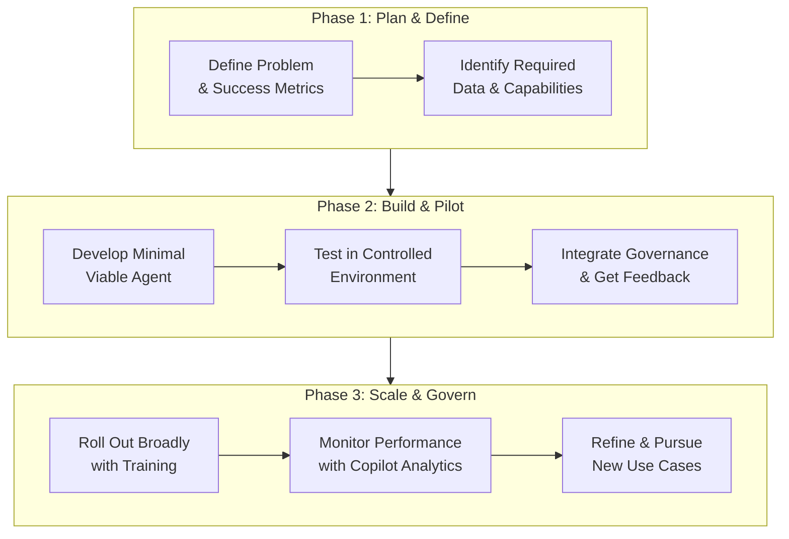

# Microsoft Security Copilot Agents: An End-to-End Guide to Building and Scaling

 practical information to help you understand and start building with Microsoft Security Copilot agents. This technology embeds AI directly into security tools, creating "AI teammates" that automate tasks and augment your team's capabilities.

Here is a end-to-end guide, from core concepts to building and scaling your own agents.

### 🤔 What Are Security Copilot Agents?

Microsoft Security Copilot agents are AI assistants designed to perform specific, routine security tasks with a degree of autonomy. They are built into the tools security teams use daily, such as Microsoft Defender, Entra, Intune, and Purview, acting as a force multiplier across your security stack.

Think of them as specialized digital colleagues. For example:
*   A **Phishing Triage Agent** in Microsoft Defender can filter threats from false positives, providing clear reasoning for each alert.
*   A **Conditional Access Optimization Agent** in Microsoft Entra can identify gaps in your security policies and suggest immediate fixes.
These agents are already delivering real results, helping SOC analysts detect malicious emails up to 550% faster and enabling identity admins to identify missing Zero Trust policies with 204% greater accuracy.

### 🗺️ The End-to-End Agent Development Journey

Building an effective agent requires thoughtful planning. The following flowchart outlines the key stages, from initial idea to full-scale deployment.



#### Phase 1: Plan & Define a Clear Objective
Start with a precise goal. A well-defined plan is the foundation of a successful agent.

*   **Articulate the Problem:** What specific, high-effort task are you automating? Avoid being too broad or too narrow. Good examples include "automating Level-1 IT support Q&A" or "qualifying leads from web inquiries". This discrete, measurable task is your **Core Unit of Work (CUoW)**.
*   **Identify Target Users:** Who will use this agent? Is it for SOC analysts, IT admins, or compliance officers?
*   **Define Success Metrics:** How will you measure value? Establish KPIs like reduced triage time, faster patch cycles, or improved detection accuracy.
*   **Map Capabilities & Context:** List the tools and data the agent needs, such as accessing Microsoft Defender alerts via a plugin or calling Microsoft Graph APIs.

#### Phase 2: Build & Pilot a Minimal Viable Agent (MVA)
With a plan in place, begin building and testing in a controlled environment.

*   **Develop the MVA:** Build a minimal version of your agent focused on the core task. You can create custom agents using a YAML manifest to define their capabilities.
*   **Integrate Governance Early:** Apply security and compliance controls from the start. Use Role-Based Access Control (RBAC) to manage who can access the agent, and leverage tools like Microsoft Purview to enforce data loss prevention policies on its outputs.
*   **Pilot with Real Users:** Test the agent with a small group of target users. Use their feedback to identify issues and improve the agent's performance and reliability.

#### Phase 3: Scale, Govern & Continuously Improve
After a successful pilot, focus on broader deployment and long-term management.

*   **Plan the Broader Rollout:** Expand the agent's availability across the organization, ensuring necessary support and training are in place.
*   **Monitor with Copilot Analytics:** Use tools like Copilot Analytics to track adoption, performance, and business impact at scale. This data helps you confirm the agent's value and justify further investment.
*   **Refine and Expand:** Continuously gather user feedback and look for new use cases. As Microsoft releases platform updates, leverage them to enhance your agents.

### 💡 Tips for Success and Best Practices

To ensure your agents are effective and secure, keep these principles in mind:

*   **Prioritize High-Impact Use Cases:** Start by identifying security operations with the biggest bottlenecks, like phishing triage or vulnerability management, where automation will deliver the most significant productivity gains.
*   **Enforce a Zero-Trust Model:** Apply strict permissions to each agent, only granting access to the systems and data it absolutely needs. Treat agents like any other identity in your system.
*   **Uphold Responsible AI Principles:** Build your agents with transparency and appropriate expectations. Ensure users can verify information sources, understand the agent's limitations, and provide feedback on its outputs.
*   **Connect to Your Entire Security Workflow:** Maximize the agent's impact by ensuring it's connected to key systems like Microsoft Defender XDR, Sentinel, and Intune. This provides the agent with comprehensive data for better threat detection and response.

### 🚀 Getting Started & Licensing

Microsoft Security Copilot is now included for all Microsoft 365 E5 customers, making it easier than ever to start using these built-in agents. If you have this license, you can access Security Copilot directly at [https://securitycopilot.microsoft.com](https://securitycopilot.microsoft.com) or through embedded experiences in various Microsoft security products.

If you don't find a pre-built agent that fits your needs, you have the flexibility to create your own. Since this capability was announced, customers have already built over 370 unique agents.

> *I hope this end-to-end guide helps you embark on your journey with Microsoft Security Copilot agents.*

Feel free to reach out if you have specific questions or need assistance building your first agent. Happy automating! 🚀


I'll create a comprehensive end-to-end guide covering all Microsoft AI Security Copilot agents across Identity, Endpoint, Cloud, and Threat Intelligence with practical implementation examples.

## 🏗️ Comprehensive AI Security Copilot Framework

### Core Architecture Components

```python
# core_copilot_framework.py
from typing import Dict, List, Any
from abc import ABC, abstractmethod
import asyncio
from azure.identity import DefaultAzureCredential
from azure.core.credentials import AzureKeyCredential
import json
import logging

class SecurityCopilotBase(ABC):
    """Base class for all Security Copilot agents"""
    
    def __init__(self, tenant_id: str, subscription_id: str):
        self.tenant_id = tenant_id
        self.subscription_id = subscription_id
        self.credential = DefaultAzureCredential()
        self.logger = logging.getLogger(self.__class__.__name__)
    
    @abstractmethod
    async def analyze_threats(self, scope: str) -> Dict[str, Any]:
        pass
    
    @abstractmethod
    async def generate_remediation(self, findings: Dict) -> List[str]:
        pass
    
    @abstractmethod
    async def execute_automation(self, actions: List[str]) -> Dict[str, Any]:
        pass
```

## 🔐 Identity Security Copilot Agent

### Complete Identity Protection Automation

```python
# identity_copilot_agent.py
import msal
import requests
from datetime import datetime, timedelta

class IdentityCopilotAgent(SecurityCopilotBase):
    """AI-powered identity security automation"""
    
    def __init__(self, tenant_id: str, subscription_id: str, app_id: str, app_secret: str):
        super().__init__(tenant_id, subscription_id)
        self.app_id = app_id
        self.app_secret = app_secret
        self.graph_scopes = ['https://graph.microsoft.com/.default']
        self.entra_scopes = ['https://graph.microsoft.com/.default']
        
    def get_graph_token(self):
        """Get access token for Microsoft Graph"""
        authority = f"https://login.microsoftonline.com/{self.tenant_id}"
        app = msal.ConfidentialClientApplication(
            self.app_id,
            client_credential=self.app_secret,
            authority=authority
        )
        result = app.acquire_token_for_client(scopes=self.graph_scopes)
        return result.get('access_token')
    
    async def analyze_identity_risks(self):
        """Comprehensive identity risk analysis"""
        token = self.get_graph_token()
        headers = {'Authorization': f'Bearer {token}'}
        
        # 1. Get risky users
        risky_users_url = "https://graph.microsoft.com/v1.0/identityProtection/riskyUsers"
        risky_users = requests.get(risky_users_url, headers=headers).json()
        
        # 2. Get risk detections
        risk_detections_url = "https://graph.microsoft.com/v1.0/identityProtection/riskDetections"
        risk_detections = requests.get(risk_detections_url, headers=headers).json()
        
        # 3. Analyze conditional access policies
        ca_policies_url = "https://graph.microsoft.com/v1.0/identity/conditionalAccess/policies"
        ca_policies = requests.get(ca_policies_url, headers=headers).json()
        
        analysis = {
            'high_risk_users': self._filter_high_risk_users(risky_users.get('value', [])),
            'recent_detections': self._filter_recent_detections(risk_detections.get('value', [])),
            'policy_gaps': self._analyze_policy_gaps(ca_policies.get('value', [])),
            'privileged_identities': await self._analyze_privileged_identities(token)
        }
        
        return analysis
    
    async def _analyze_privileged_identities(self, token: str):
        """Analyze privileged identity management"""
        headers = {'Authorization': f'Bearer {token}'}
        
        # Get directory roles
        roles_url = "https://graph.microsoft.com/v1.0/directoryRoles"
        roles = requests.get(roles_url, headers=headers).json()
        
        privileged_analysis = []
        for role in roles.get('value', []):
            if role['displayName'] in ['Global Administrator', 'Security Administrator', 'Exchange Administrator']:
                members_url = f"https://graph.microsoft.com/v1.0/directoryRoles/{role['id']}/members"
                members = requests.get(members_url, headers=headers).json()
                
                for member in members.get('value', []):
                    privileged_analysis.append({
                        'role': role['displayName'],
                        'user': member['displayName'],
                        'userPrincipalName': member['userPrincipalName'],
                        'risk_score': await self._calculate_user_risk(token, member['id'])
                    })
        
        return privileged_analysis
    
    async def generate_identity_recommendations(self, analysis: Dict) -> List[str]:
        """Generate AI-powered identity security recommendations"""
        recommendations = []
        
        # MFA recommendations
        if analysis.get('high_risk_users'):
            recommendations.extend([
                "🔐 Require MFA for all high-risk users immediately",
                "🔄 Implement conditional access policies for risky sign-ins",
                "👑 Review privileged role assignments and implement PIM"
            ])
        
        # Policy recommendations
        policy_gaps = analysis.get('policy_gaps', [])
        if 'mfa_coverage' in policy_gaps:
            recommendations.append("🛡️ Create Conditional Access policy requiring MFA for all cloud apps")
        
        if 'legacy_auth' in policy_gaps:
            recommendations.append("🚫 Block legacy authentication protocols")
        
        return recommendations
    
    async def auto_remediate_identity_risks(self, analysis: Dict):
        """Automated remediation for identity risks"""
        token = self.get_graph_token()
        actions_taken = []
        
        # Auto-confirm compromised users
        for user in analysis.get('high_risk_users', []):
            if user['riskLevel'] == 'high':
                confirm_url = f"https://graph.microsoft.com/v1.0/identityProtection/riskyUsers/confirmCompromised"
                payload = {'userIds': [user['id']]}
                response = requests.post(confirm_url, headers={'Authorization': f'Bearer {token}'}, json=payload)
                
                if response.status_code == 204:
                    actions_taken.append(f"Confirmed compromised user: {user.get('userPrincipalName', 'Unknown')}")
        
        return actions_taken
```

## 🖥️ Endpoint Security Copilot Agent

### Defender for Endpoint AI Automation

```python
# endpoint_copilot_agent.py
import aiohttp
from typing import Dict, List, Any

class EndpointCopilotAgent(SecurityCopilotBase):
    """AI-powered endpoint security automation"""
    
    def __init__(self, tenant_id: str, subscription_id: str, defender_token: str):
        super().__init__(tenant_id, subscription_id)
        self.defender_token = defender_token
        self.defender_headers = {
            'Authorization': f'Bearer {defender_token}',
            'Content-Type': 'application/json'
        }
    
    async def analyze_endpoint_security(self):
        """Comprehensive endpoint security analysis"""
        async with aiohttp.ClientSession() as session:
            # Get all devices with security recommendations
            devices_url = "https://api.securitycenter.microsoft.com/api/machines"
            async with session.get(devices_url, headers=self.defender_headers) as response:
                devices = await response.json()
            
            # Get security recommendations
            recommendations_url = "https://api.securitycenter.microsoft.com/api/recommendations"
            async with session.get(recommendations_url, headers=self.defender_headers) as response:
                recommendations = await response.json()
            
            # Get active alerts
            alerts_url = "https://api.securitycenter.microsoft.com/api/alerts"
            async with session.get(alerts_url, headers=self.defender_headers) as response:
                alerts = await response.json()
            
            analysis = {
                'vulnerable_devices': await self._analyze_vulnerable_devices(devices.get('value', [])),
                'security_baseline': await self._analyze_security_baseline(recommendations.get('value', [])),
                'active_threats': await self._analyze_active_threats(alerts.get('value', [])),
                'compliance_status': await self._analyze_compliance_status(devices.get('value', []))
            }
            
            return analysis
    
    async def generate_endpoint_hunting_queries(self, threat_indicators: List[str]):
        """Generate AI-powered advanced hunting queries"""
        queries = []
        
        for indicator in threat_indicators:
            if "powershell" in indicator.lower():
                query = """
                DeviceProcessEvents
                | where FileName =~ "powershell.exe"
                | where ProcessCommandLine contains "{}"
                | project Timestamp, DeviceName, FileName, ProcessCommandLine, InitiatingProcessFileName
                """.format(indicator)
                queries.append(query)
            
            elif "registry" in indicator.lower():
                query = """
                DeviceRegistryEvents
                | where ActionType == "RegistryValueSet"
                | where RegistryKey contains "{}"
                | project Timestamp, DeviceName, RegistryKey, RegistryValueName, RegistryValueData
                """.format(indicator)
                queries.append(query)
        
        return queries
    
    async def automated_incident_response(self, alert_data: Dict):
        """Automated incident response for endpoints"""
        actions = []
        
        # Isolate high-risk devices
        if alert_data.get('severity') in ['High', 'Medium']:
            device_id = alert_data.get('machineId')
            isolate_url = f"https://api.securitycenter.microsoft.com/api/machines/{device_id}/isolate"
            
            async with aiohttp.ClientSession() as session:
                async with session.post(isolate_url, headers=self.defender_headers, 
                                      json={"Comment": "Automated isolation due to security alert"}) as response:
                    if response.status == 201:
                        actions.append(f"Device {alert_data.get('computerDnsName')} isolated")
        
        # Run antivirus scan
        scan_url = f"https://api.securitycenter.microsoft.com/api/machines/{device_id}/runAntiVirusScan"
        async with aiohttp.ClientSession() as session:
            async with session.post(scan_url, headers=self.defender_headers,
                                  json={"Comment": "Automated AV scan"}) as response:
                if response.status == 201:
                    actions.append("Antivirus scan initiated")
        
        return actions
```

## ☁️ Cloud Security Copilot Agent

### Defender for Cloud AI Automation

```python
# cloud_copilot_agent.py
from azure.mgmt.security import SecurityCenter
from azure.mgmt.subscription import SubscriptionClient
from azure.mgmt.resource import ResourceManagementClient

class CloudCopilotAgent(SecurityCopilotBase):
    """AI-powered cloud security automation"""
    
    def __init__(self, tenant_id: str, subscription_id: str):
        super().__init__(tenant_id, subscription_id)
        self.security_client = SecurityCenter(
            credential=self.credential,
            subscription_id=subscription_id
        )
        self.resource_client = ResourceManagementClient(
            credential=self.credential,
            subscription_id=subscription_id
        )
    
    async def analyze_cloud_security_posture(self):
        """Comprehensive cloud security analysis"""
        # Get security assessments
        assessments = self.security_client.assessments.list()
        assessment_list = [item for item in assessments]
        
        # Get secure score
        secure_scores = self.security_client.secure_scores.list()
        secure_score_list = [item for item in secure_scores]
        
        # Get regulatory compliance
        compliance_results = self.security_client.regulatory_compliance_standards.list()
        compliance_list = [item for item in compliance_results]
        
        analysis = {
            'secure_score': self._calculate_current_score(secure_score_list),
            'critical_findings': self._filter_critical_findings(assessment_list),
            'compliance_gaps': self._analyze_compliance_gaps(compliance_list),
            'resource_security': await self._analyze_resource_security()
        }
        
        return analysis
    
    async def generate_cloud_remediation_scripts(self, findings: List[Dict]):
        """Generate automated remediation scripts for cloud security"""
        scripts = []
        
        for finding in findings:
            if finding['resource_type'] == 'Microsoft.Storage/storageAccounts':
                if finding['issue'] == 'https_traffic_disabled':
                    script = """
                    # Enable secure transfer for storage account
                    $storageAccount = Get-AzStorageAccount -ResourceGroupName {rg} -Name {account}
                    $storageAccount.EnableHttpsTrafficOnly = $true
                    Set-AzStorageAccount -StorageAccount $storageAccount
                    """.format(rg=finding['resource_group'], account=finding['resource_name'])
                    scripts.append(script)
            
            elif finding['resource_type'] == 'Microsoft.Compute/virtualMachines':
                if finding['issue'] == 'disk_encryption_disabled':
                    script = """
                    # Enable disk encryption
                    Set-AzVMDiskEncryptionExtension -ResourceGroupName {rg} -VMName {vm} -VolumeType All
                    """.format(rg=finding['resource_group'], vm=finding['resource_name'])
                    scripts.append(script)
        
        return scripts
    
    async def automated_cloud_remediation(self, security_issue: Dict):
        """Execute automated cloud security remediation"""
        actions_taken = []
        
        if security_issue['type'] == 'storage_secure_transfer':
            # Enable HTTPS only for storage account
            from azure.mgmt.storage import StorageManagementClient
            storage_client = StorageManagementClient(self.credential, self.subscription_id)
            
            storage_account = storage_client.storage_accounts.get_properties(
                security_issue['resource_group'],
                security_issue['account_name']
            )
            
            storage_account.enable_https_traffic_only = True
            storage_client.storage_accounts.update(
                security_issue['resource_group'],
                security_issue['account_name'],
                storage_account
            )
            actions_taken.append(f"Enabled secure transfer for {security_issue['account_name']}")
        
        return actions_taken
```

## 🎯 Unified Security Copilot Orchestrator

### Master AI Agent Coordination

```python
# security_copilot_orchestrator.py
import asyncio
from datetime import datetime
from typing import Dict, List, Any

class SecurityCopilotOrchestrator:
    """Orchestrates all security copilot agents for unified security operations"""
    
    def __init__(self, config: Dict):
        self.config = config
        self.identity_agent = IdentityCopilotAgent(
            config['tenant_id'],
            config['subscription_id'],
            config['app_id'],
            config['app_secret']
        )
        self.endpoint_agent = EndpointCopilotAgent(
            config['tenant_id'],
            config['subscription_id'],
            config['defender_token']
        )
        self.cloud_agent = CloudCopilotAgent(
            config['tenant_id'],
            config['subscription_id']
        )
        
        self.security_workflows = {
            'incident_response': self.incident_response_workflow,
            'threat_hunting': self.threat_hunting_workflow,
            'compliance_audit': self.compliance_audit_workflow,
            'vulnerability_management': self.vulnerability_management_workflow
        }
    
    async def incident_response_workflow(self, alert_data: Dict):
        """End-to-end incident response automation"""
        response_log = []
        
        # 1. Analyze the alert across all domains
        identity_analysis = await self.identity_agent.analyze_identity_risks()
        endpoint_analysis = await self.endpoint_agent.analyze_endpoint_security()
        
        # 2. Correlate findings
        correlated_threats = await self.correlate_threat_intelligence(
            identity_analysis, endpoint_analysis, alert_data
        )
        
        # 3. Execute automated response
        if correlated_threats.get('confidence_score', 0) > 0.8:
            # High confidence threat - automated response
            endpoint_actions = await self.endpoint_agent.automated_incident_response(alert_data)
            identity_actions = await self.identity_agent.auto_remediate_identity_risks(identity_analysis)
            
            response_log.extend(endpoint_actions)
            response_log.extend(identity_actions)
        
        # 4. Generate incident report
        incident_report = await self.generate_incident_report(
            alert_data, correlated_threats, response_log
        )
        
        return incident_report
    
    async def threat_hunting_workflow(self, hunt_parameters: Dict):
        """Proactive threat hunting across all security domains"""
        hunting_results = {}
        
        # Generate hunting queries based on IOCs
        iocs = hunt_parameters.get('iocs', [])
        endpoint_queries = await self.endpoint_agent.generate_endpoint_hunting_queries(iocs)
        
        # Execute hunts in parallel
        hunt_tasks = []
        for query in endpoint_queries:
            hunt_tasks.append(self.execute_advanced_hunt(query))
        
        hunting_results['endpoint_hunts'] = await asyncio.gather(*hunt_tasks)
        
        # Identity-based hunting
        identity_risks = await self.identity_agent.analyze_identity_risks()
        hunting_results['identity_anomalies'] = identity_risks.get('high_risk_users', [])
        
        return hunting_results
    
    async def compliance_audit_workflow(self, compliance_standard: str):
        """Automated compliance auditing across all domains"""
        audit_results = {}
        
        # Cloud compliance
        cloud_analysis = await self.cloud_agent.analyze_cloud_security_posture()
        audit_results['cloud_compliance'] = cloud_analysis.get('compliance_gaps', [])
        
        # Identity compliance
        identity_analysis = await self.identity_agent.analyze_identity_risks()
        audit_results['identity_compliance'] = self._audit_identity_compliance(identity_analysis)
        
        # Generate compliance report
        compliance_report = await self.generate_compliance_report(
            compliance_standard, audit_results
        )
        
        return compliance_report
    
    async def vulnerability_management_workflow(self):
        """End-to-end vulnerability management automation"""
        vm_results = {}
        
        # Get vulnerabilities from all sources
        endpoint_vulns = await self.endpoint_agent.analyze_endpoint_security()
        cloud_vulns = await self.cloud_agent.analyze_cloud_security_posture()
        
        # Prioritize based on risk
        prioritized_vulns = await self.prioritize_vulnerabilities(
            endpoint_vulns.get('vulnerable_devices', []),
            cloud_vulns.get('critical_findings', [])
        )
        
        # Generate remediation plans
        remediation_scripts = await self.cloud_agent.generate_cloud_remediation_scripts(
            prioritized_vulns.get('cloud_vulnerabilities', [])
        )
        
        vm_results['prioritized_vulnerabilities'] = prioritized_vulns
        vm_results['remediation_scripts'] = remediation_scripts
        
        return vm_results
```

## 🚀 Implementation and Deployment

### Deployment Script

```python
# deploy_copilot_agents.py
import yaml
from azure.identity import DefaultAzureCredential
from azure.mgmt.resource import ResourceManagementClient

class SecurityCopilotDeployer:
    """Deploys and configures security copilot agents"""
    
    def __init__(self, config_path: str):
        self.config = self.load_config(config_path)
        self.credential = DefaultAzureCredential()
    
    def deploy_agents(self):
        """Deploy all security copilot agents"""
        # Create resource group
        resource_client = ResourceManagementClient(
            self.credential,
            self.config['subscription_id']
        )
        
        # Deploy required Azure resources
        self.deploy_azure_resources()
        
        # Configure agents
        self.configure_identity_agent()
        self.configure_endpoint_agent()
        self.configure_cloud_agent()
        
        # Test agent connectivity
        self.test_agent_connectivity()
    
    def create_automation_playbooks(self):
        """Create automated security playbooks"""
        playbooks = {
            'phishing_response': self.create_phishing_response_playbook(),
            'ransomware_containment': self.create_ransomware_playbook(),
            'privileged_escalation': self.create_privileged_escalation_playbook()
        }
        
        return playbooks
```

### Configuration File

```yaml
# security_copilot_config.yaml
tenant_id: "your-tenant-id"
subscription_id: "your-subscription-id"
app_id: "your-app-id"
app_secret: "your-app-secret"
defender_token: "your-defender-token"

agents:
  identity:
    enabled: true
    scopes:
      - "https://graph.microsoft.com/.default"
  endpoint:
    enabled: true
    scopes:
      - "https://api.securitycenter.microsoft.com/.default"
  cloud:
    enabled: true
    scopes:
      - "https://management.azure.com/.default"

automation:
  auto_remediate: true
  confirmation_required: true
  notification_channels:
    - "teams"
    - "email"
    - "slack"

workflows:
  incident_response:
    enabled: true
    auto_isolate: true
    auto_scan: true
  threat_hunting:
    enabled: true
    schedule: "0 0 * * *"  # Daily
  compliance_audit:
    enabled: true
    standards:
      - "NIST"
      - "CIS"
      - "PCI_DSS"
```

## 📊 Monitoring and Analytics

```python
# copilot_analytics.py
from azure.monitor import MonitorClient
from datetime import datetime, timedelta

class CopilotAnalytics:
    """Monitoring and analytics for security copilot performance"""
    
    def track_agent_performance(self):
        """Track performance metrics for all agents"""
        metrics = {
            'incidents_automated': self.get_incidents_automated(),
            'time_saved': self.calculate_time_saved(),
            'false_positives_reduced': self.measure_fp_reduction(),
            'response_time_improvement': self.measure_response_improvement()
        }
        
        return metrics
    
    def generate_roi_report(self):
        """Generate business value and ROI reports"""
        roi_data = {
            'analyst_hours_saved': self.calculate_analyst_savings(),
            'incident_cost_reduction': self.calculate_cost_savings(),
            'compliance_improvement': self.measure_compliance_improvement(),
            'risk_reduction': self.measure_risk_reduction()
        }
        
        return roi_data
```

This comprehensive framework provides:

1. **Identity Security Copilot**: MFA enforcement, risky user analysis, privileged identity management
2. **Endpoint Security Copilot**: Advanced hunting, automated isolation, vulnerability management
3. **Cloud Security Copilot**: Compliance auditing, auto-remediation, security posture management
4. **Unified Orchestrator**: Coordinates all agents for end-to-end security operations

Each agent can work independently or together through the orchestrator for unified security automation. The system includes deployment scripts, configuration management, and analytics to measure effectiveness.


Thanks for reading! Microsoft Security Copilot agents are transforming how security teams operate by embedding AI directly into their workflows. This end-to-end guide should give you a solid foundation to start building and scaling your own agents.


