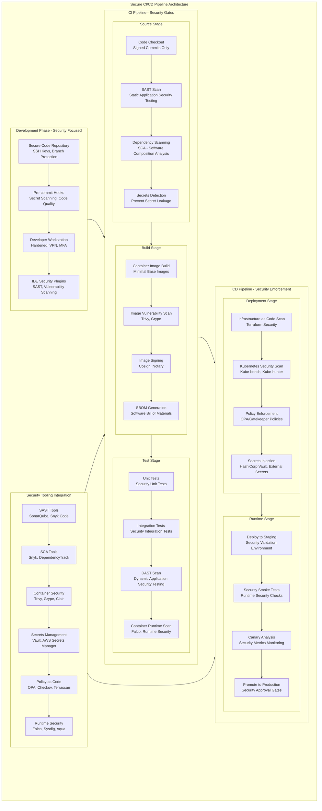
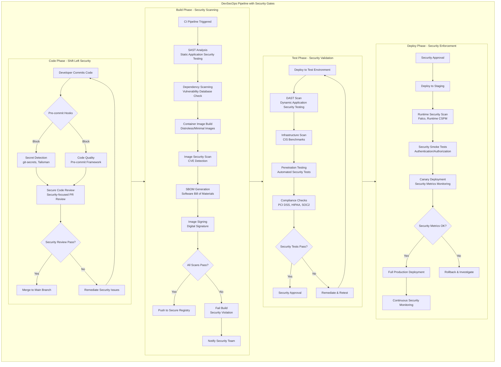
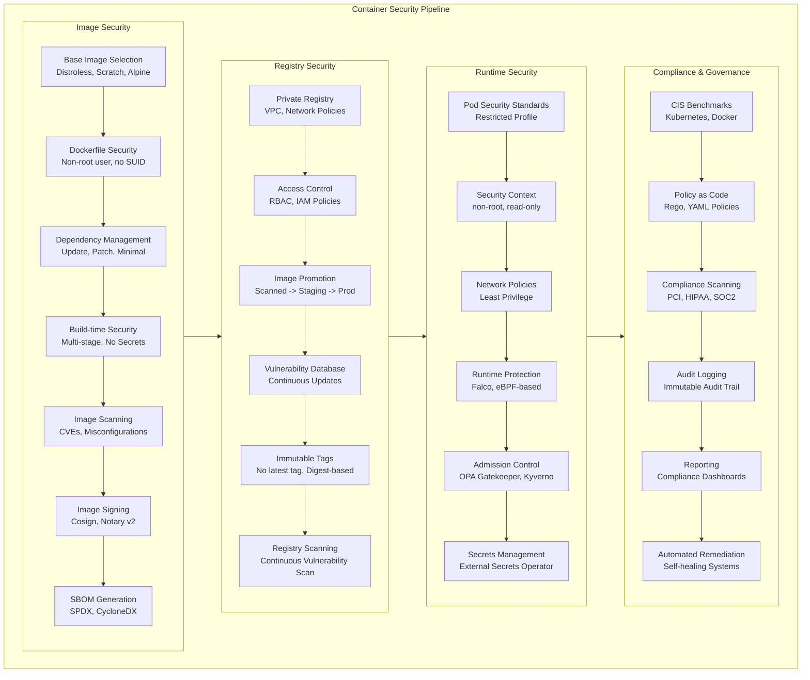
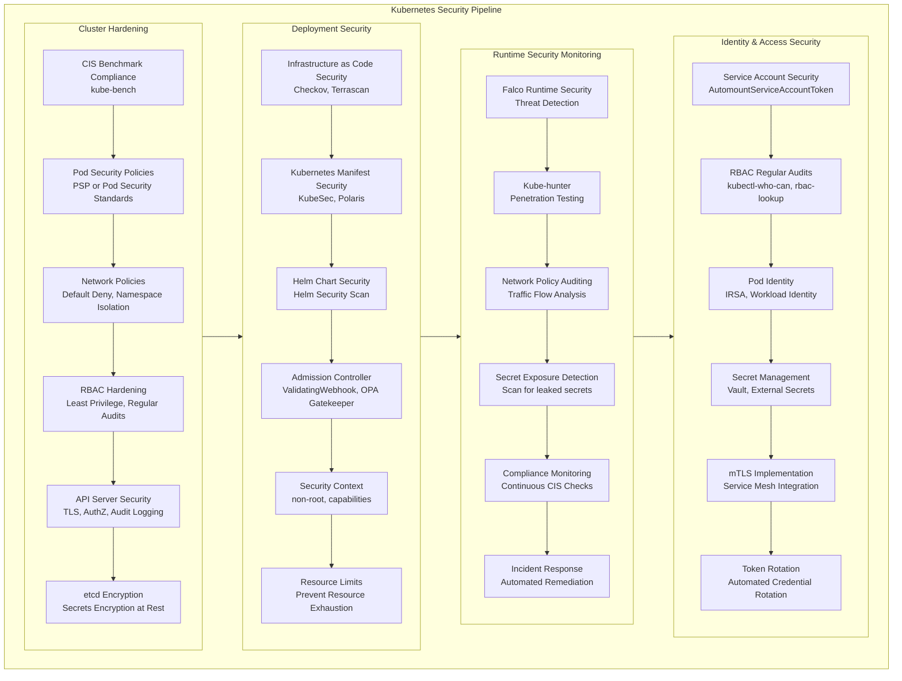
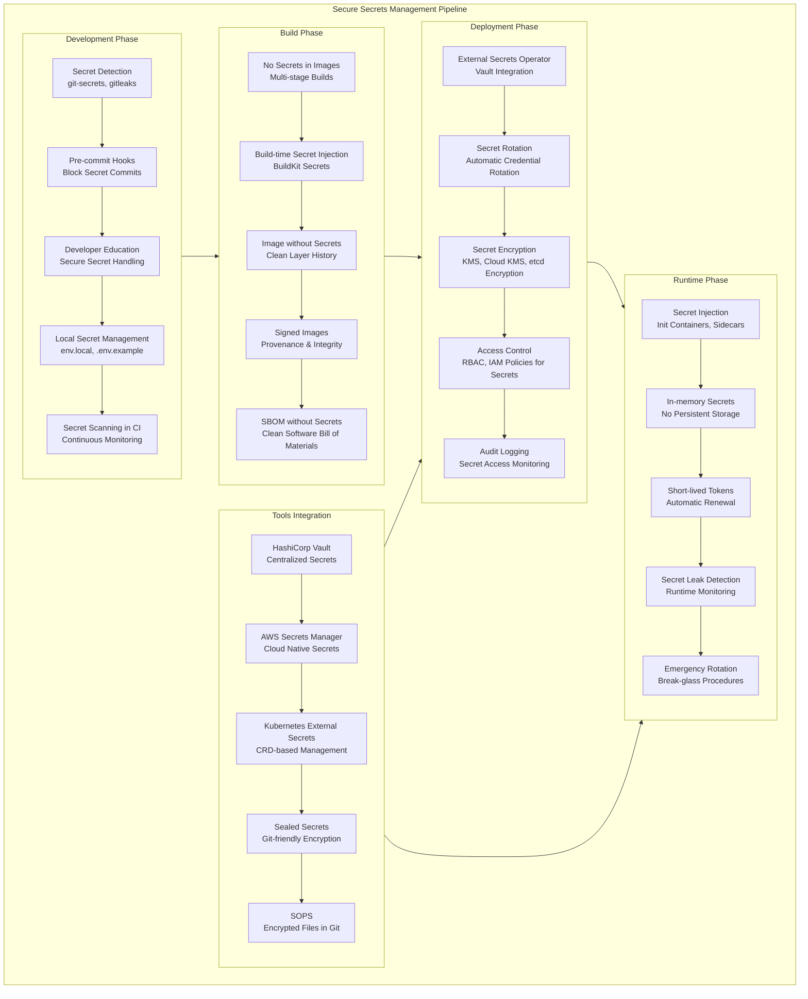
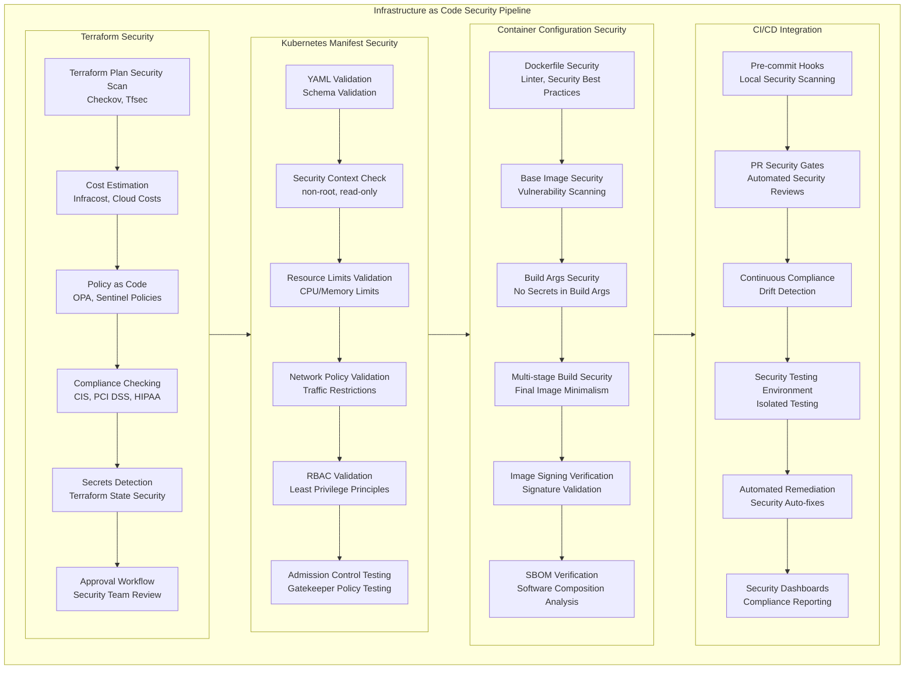
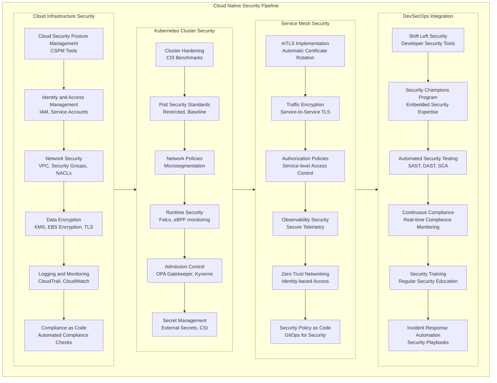
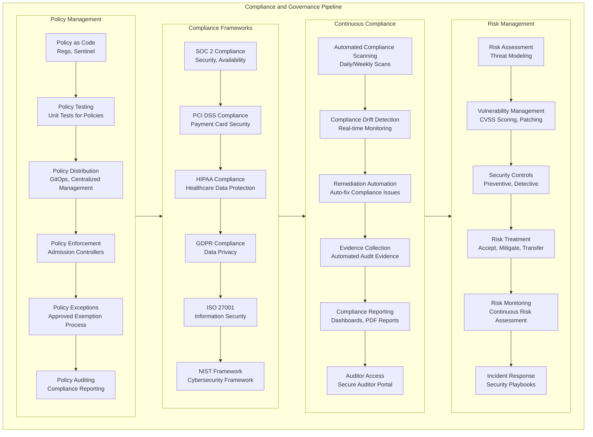
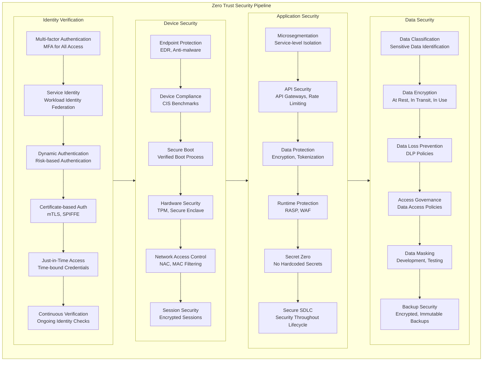
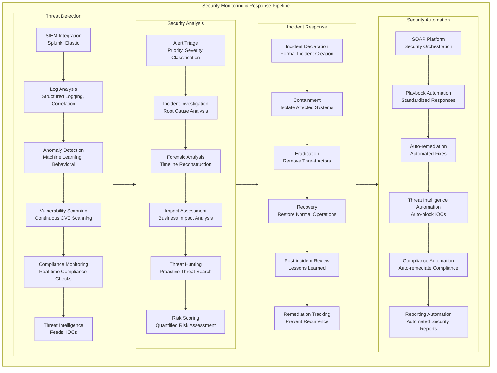

# CI/CD Pipeline Security: Comprehensive Mermaid Diagrams

## 1. Complete Secure CI/CD Pipeline Architecture

## 2. DevSecOps Pipeline with Security Gates

## 3. Container Security Pipeline

## 4. Kubernetes Security Pipeline

## 5. Secrets Management Pipeline

## 6. Infrastructure as Code Security Pipeline

## 7. Cloud Native Security Pipeline

## 8. Compliance and Governance Pipeline

## 9. Zero Trust Security Pipeline

## 10. Complete Security Monitoring Pipeline

## Key Security Principles Illustrated

These diagrams demonstrate:

1. **Shift Left Security**: Security integrated early in development
2. **Defense in Depth**: Multiple security layers
3. **Least Privilege**: Minimal required access
4. **Zero Trust**: Verify explicitly, never trust
5. **Automation**: Security as code, automated enforcement
6. **Continuous Monitoring**: Real-time security oversight
7. **Compliance Integration**: Built-in regulatory compliance
8. **Incident Readiness**: Prepared response capabilities

Each pipeline can be implemented using popular tools like:
- **SAST**: SonarQube, Snyk Code, Checkmarx
- **SCA**: Snyk, DependencyTrack, WhiteSource
- **Container Security**: Trivy, Grype, Clair
- **Secrets Management**: HashiCorp Vault, AWS Secrets Manager
- **Policy as Code**: OPA, Checkov, Terrascan
- **Runtime Security**: Falco, Sysdig, Aqua Security

* *This document provides comprehensive Mermaid diagrams for securing CI/CD pipelines, illustrating best practices and security principles for DevSecOps implementations.*
