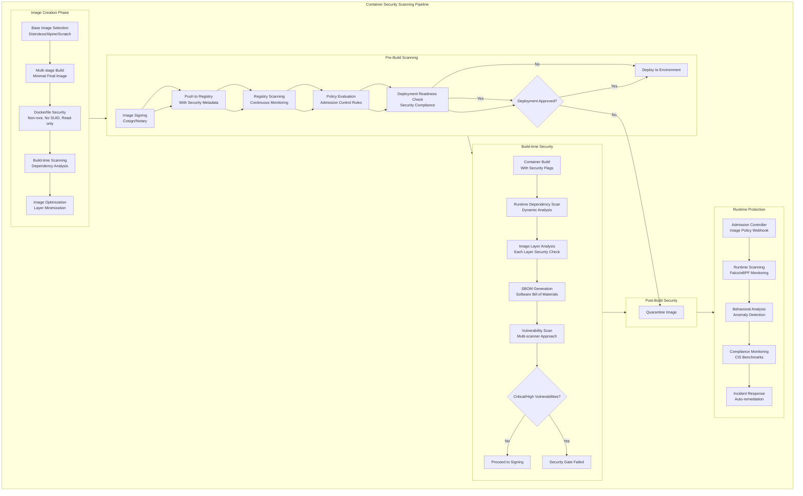
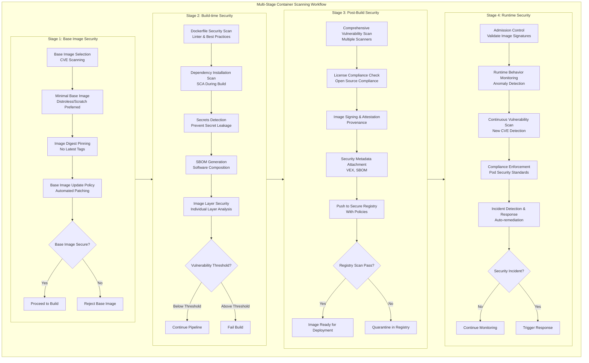
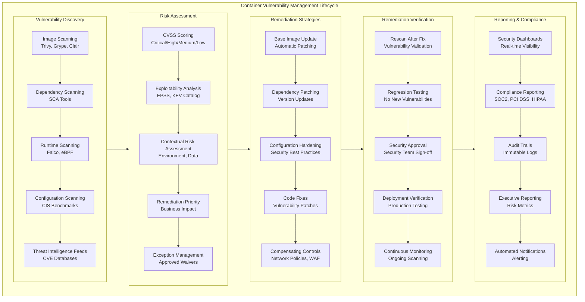
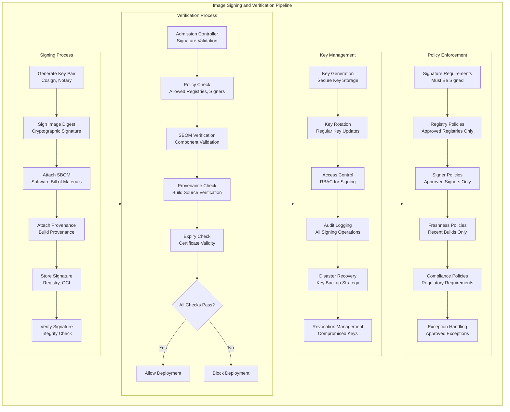
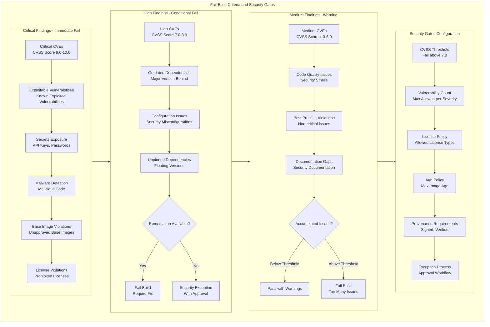
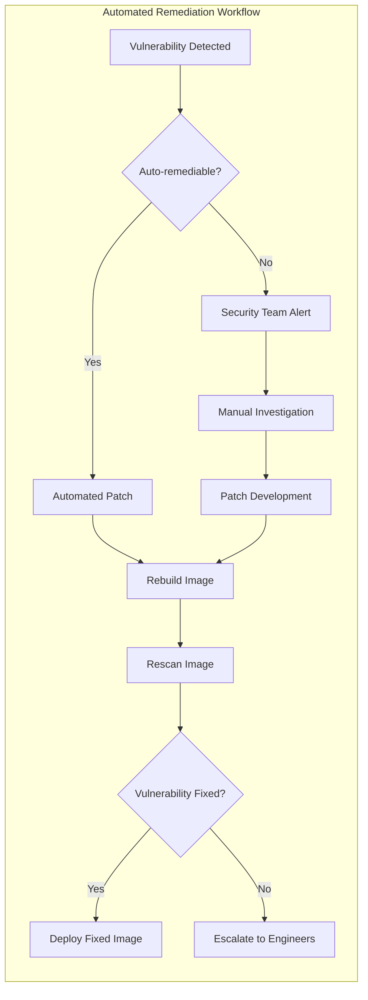

# Container Scanning in CI/CD Pipeline: Comprehensive Guide

## 1. Complete Container Security Scanning Pipeline



## 2. Multi-Stage Container Scanning Workflow



## 3. Container Vulnerability Management Lifecycle



## 4. Image Signing and Verification Pipeline



## 5. Fail-Build Criteria and Security Gates



## Detailed Explanations and Recommendations

### 1. Base Image Scanning Best Practices

**Why Scan Base Images:**
- Base images often contain known vulnerabilities
- Inherited security issues propagate to all derived images
- Early detection prevents downstream security problems

**Implementation Recommendations:**

```yaml
# Example Trivy base image scanning in CI
- name: Scan base image
  run: |
    trivy image --severity CRITICAL,HIGH \
                --exit-code 1 \
                --ignore-unfixed \
    $BASE_IMAGE
    
    # Check for approved base images
    if ! grep -q "$BASE_IMAGE" approved_base_images.txt; then
      echo "ERROR: Base image not in approved list"
      exit 1
    fi
```

**Critical Controls:**
- Maintain approved base image list
- Use minimal base images (Distroless, Alpine)
- Pin base images to specific digests, not tags
- Regular base image updates

### 2. Build Failure Criteria

**Immediate Build Failure Conditions:**

```bash
#!/bin/bash
# Container scanning failure criteria

# Critical CVEs found
if [ "$CRITICAL_CVES" -gt 0 ]; then
  echo "FAIL: Critical vulnerabilities found"
  exit 1
fi

# Secrets detected in image
if [ "$SECRETS_FOUND" -gt 0 ]; then
  echo "FAIL: Secrets detected in container image"
  exit 1
fi

# Unapproved licenses
if [ "$FORBIDDEN_LICENSES" -gt 0 ]; then
  echo "FAIL: Prohibited licenses detected"
  exit 1
fi

# Image not signed
if [ "$SIGNED" != "true" ]; then
  echo "FAIL: Image must be signed before deployment"
  exit 1
fi
```

**Configuration Example for Jenkins:**

```groovy
pipeline {
    stages {
        stage('Container Security Scan') {
            steps {
                script {
                    def scanResult = sh(
                        script: 'trivy image --exit-code 1 --severity CRITICAL,HIGH ${IMAGE}',
                        returnStatus: true
                    )
                    
                    if (scanResult != 0) {
                        error "Container security scan failed with critical vulnerabilities"
                    }
                }
            }
        }
    }
}
```

### 3. Image Signing Enforcement

**Why Image Signing is Critical:**
- Ensures image integrity and authenticity
- Prevents deployment of tampered images
- Provides non-repudiation for deployments

**Implementation with Cosign:**

```bash
#!/bin/bash
# Image signing and verification process

# Sign the image
cosign sign --key cosign.key $IMAGE_TAG

# Generate SBOM
syft $IMAGE_TAG --output spdx-json > sbom.json

# Attach SBOM
cosign attach sbom --sbom sbom.json $IMAGE_TAG

# Verify before deployment
cosign verify --key cosign.pub $IMAGE_TAG
```

**Kubernetes Admission Control:**

```yaml
apiVersion: admissionregistration.k8s.io/v1
kind: ValidatingWebhookConfiguration
metadata:
  name: image-signature-verification
webhooks:
- name: image-signature.kyverno.svc
  clientConfig:
    service:
      name: kyverno-svc
      namespace: kyverno
      path: /verify/images
  rules:
  - operations: ["CREATE", "UPDATE"]
    apiGroups: [""]
    apiVersions: ["v1"]
    resources: ["pods"]
```

### 4. Multi-Scanner Approach

**Why Use Multiple Scanners:**
- Different scanners have different vulnerability databases
- Reduces false negatives
- Provides comprehensive coverage

**Implementation Strategy:**

```yaml
# GitHub Actions example with multiple scanners
name: Container Security Scan
on: [push]

jobs:
  security-scan:
    runs-on: ubuntu-latest
    steps:
    - name: Checkout code
      uses: actions/checkout@v3

    - name: Build container
      run: docker build -t myapp:${{ github.sha }} .

    - name: Scan with Trivy
      uses: aquasecurity/trivy-action@master
      with:
        image-ref: 'myapp:${{ github.sha }}'
        format: 'sarif'
        output: 'trivy-results.sarif'
        severity: 'CRITICAL,HIGH'

    - name: Scan with Grype
      run: |
        grype myapp:${{ github.sha }} --fail-on high
        echo "Grype scan completed"

    - name: Check for critical findings
      run: |
        if grep -q '"level": "error"' trivy-results.sarif; then
          echo "Critical vulnerabilities found"
          exit 1
        fi
```

### 5. Runtime Security Integration

**Continuous Runtime Monitoring:**

```yaml
# Falco runtime security rules
- rule: Unexpected privileged container
  desc: Detect privileged containers
  condition: container and container.privileged
  output: Privileged container started (user=%user.name command=%proc.cmdline %container.info)
  priority: WARNING
  tags: [container, privilege]

- rule: Shell spawned in container
  desc: A shell was spawned by a non-shell program in a container
  condition: >
    container and proc.name = bash and
    not proc.args contains "terraform" and
    not proc.args contains "ansible"
  output: Shell spawned in container (user=%user.name container_id=%container.id container_name=%container.name shell=%proc.name parent=%proc.pname cmdline=%proc.cmdline)
  priority: NOTICE
```

### 6. Security Gates Configuration

**Configurable Security Policies:**

```yaml
# Security policy configuration
security_gates:
  vulnerabilities:
    critical: 0    # Zero tolerance for critical CVEs
    high: 5        # Maximum 5 high severity CVEs
    medium: 20     # Maximum 20 medium severity CVEs
    low: 50        # Maximum 50 low severity CVEs
  
  compliance:
    max_image_age_days: 30
    required_licenses: ["MIT", "Apache-2.0"]
    forbidden_licenses: ["GPL-3.0", "AGPL-3.0"]
  
  signing:
    required: true
    allowed_signers: ["team-security@company.com"]
  
  runtime:
    allow_privileged: false
    allow_root: false
    read_only_root_filesystem: true
```

### 7. Automated Remediation Workflow

**Self-Healing Pipeline:**



## Key Recommendations Summary

1. **Base Image Security**
   - Use minimal base images (Distroless, Scratch)
   - Regularly update base images
   - Maintain approved base image list
   - Pin to specific digests, not tags

2. **Build Failure Criteria**
   - Zero tolerance for critical CVEs
   - Fail on secrets detection
   - Enforce image signing
   - Block prohibited licenses

3. **Image Signing**
   - Sign all production images
   - Verify signatures before deployment
   - Implement key rotation policies
   - Use admission controllers for enforcement

4. **Continuous Monitoring**
   - Scan images in registry continuously
   - Monitor runtime behavior
   - Implement automated remediation
   - Maintain comprehensive audit trails

5. **Multi-Layer Security**
   - Combine multiple scanning tools
   - Implement security gates at each stage
   - Use both static and dynamic analysis
   - Integrate with runtime protection

This comprehensive container scanning approach ensures security is integrated throughout the container lifecycle, from development to runtime, with appropriate fail-safes and automated enforcement mechanisms.