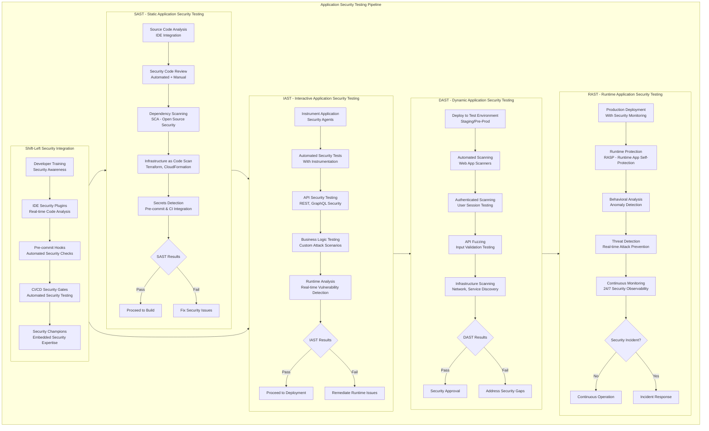
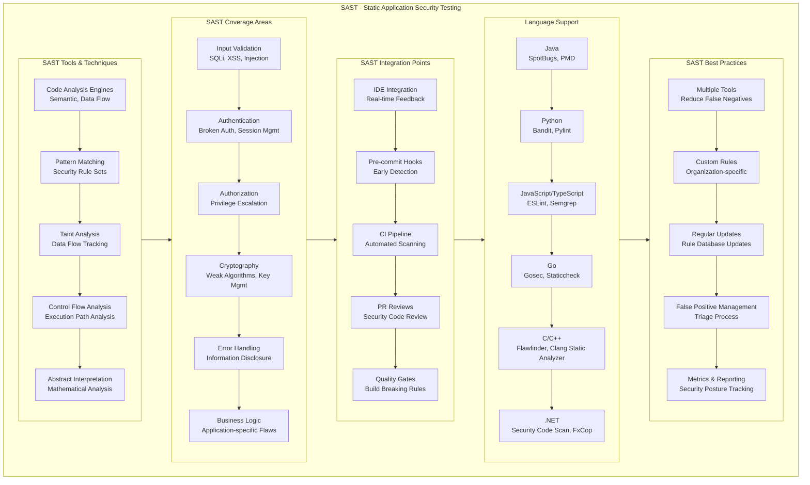
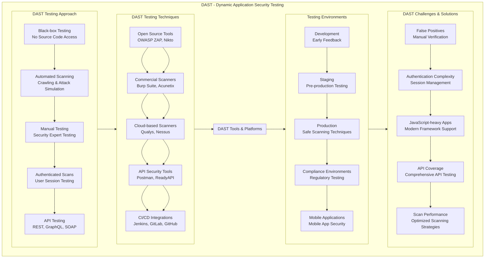
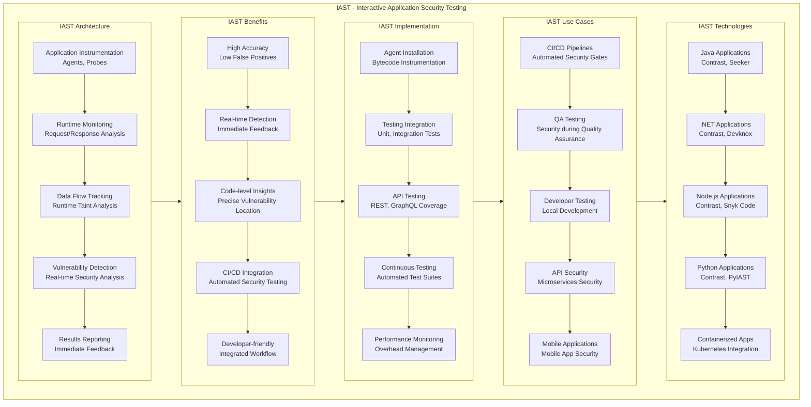
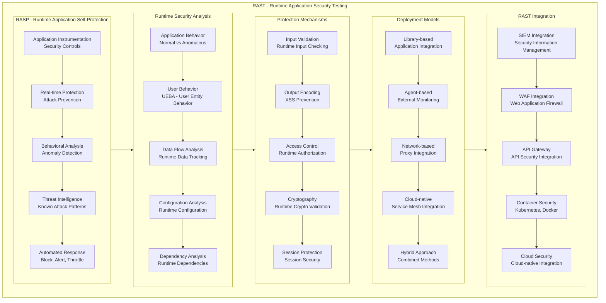
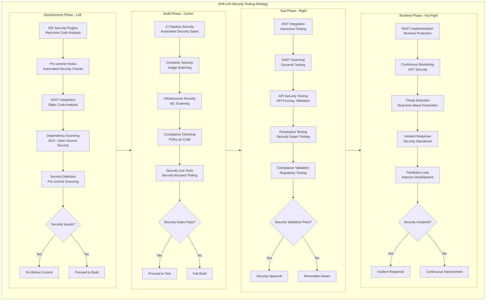
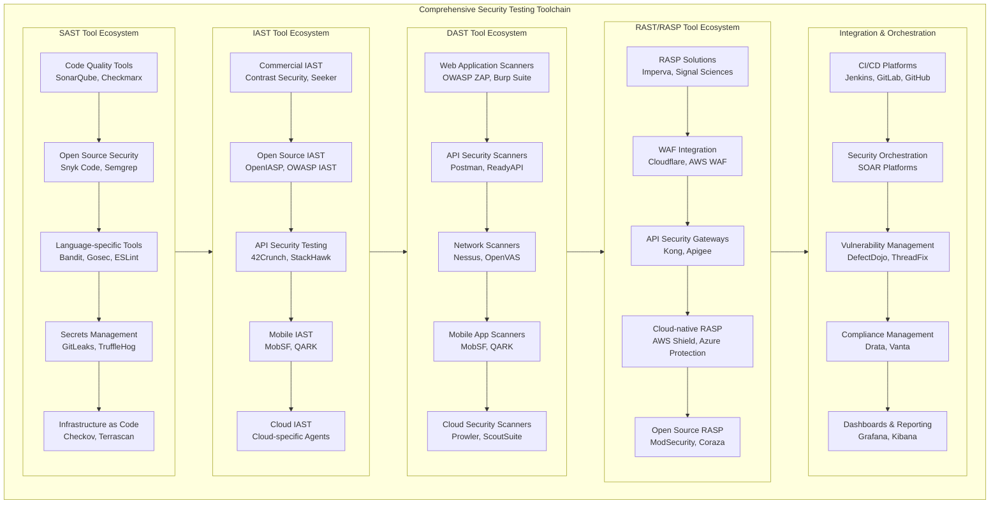
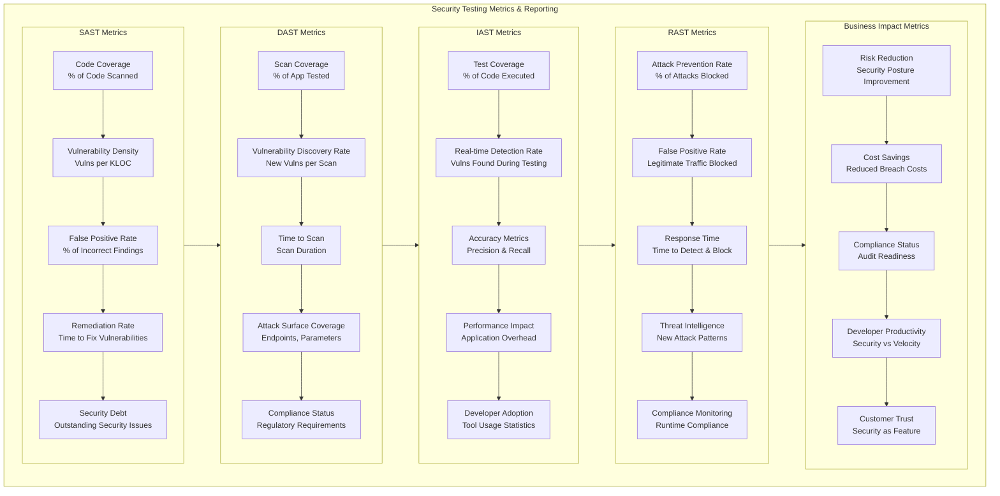

# SAST / DAST / IAST / RAST: Comprehensive Security Testing Guide

## 1. Complete Application Security Testing Pipeline



## 2. SAST (Static Application Security Testing) Deep Dive



## 3. DAST (Dynamic Application Security Testing) Deep Dive



## 4. IAST (Interactive Application Security Testing) Deep Dive



## 5. RAST (Runtime Application Security Testing) Deep Dive



## 6. Shift-Left Security Testing Strategy



## 7. Comprehensive Security Testing Toolchain



## 8. Security Testing Metrics and Reporting



## Detailed Explanations and Implementation

### 1. SAST (Static Application Security Testing)

**Definition:** SAST analyzes source code, bytecode, or binary code to identify security vulnerabilities without executing the application.

**Key Implementation Strategies:**

```yaml
# Example GitHub Actions SAST workflow
name: SAST Security Scan
on:
  push:
    branches: [ main ]
  pull_request:
    branches: [ main ]

jobs:
  sast:
    runs-on: ubuntu-latest
    steps:
    - uses: actions/checkout@v3
    
    - name: Run Semgrep SAST
      uses: returntocorp/semgrep-action@v1
      with:
        config: p/security-audit
    
    - name: Run Snyk Code SAST
      uses: snyk/actions/node@master
      env:
        SNYK_TOKEN: ${{ secrets.SNYK_TOKEN }}
      with:
        args: code test --sarif-file-output=snyk.sarif
    
    - name: Upload SARIF results
      uses: github/codeql-action/upload-sarif@v2
      with:
        sarif_file: snyk.sarif
```

**SAST Best Practices:**
- Integrate into IDE for real-time feedback
- Run in CI pipeline for every commit
- Use multiple SAST tools for better coverage
- Establish severity thresholds for build failures
- Maintain custom rules for organization-specific patterns

### 2. DAST (Dynamic Application Security Testing)

**Definition:** DAST tests running applications from the outside, simulating attacks to identify runtime vulnerabilities.

**Key Implementation Strategies:**

```yaml
# Example DAST pipeline with OWASP ZAP
name: DAST Security Scan
on:
  deployment:

jobs:
  dast:
    runs-on: ubuntu-latest
    steps:
    - name: OWASP ZAP Baseline Scan
      uses: zaproxy/action-baseline@v0.7.0
      with:
        target: 'https://example.com'
        rules_file_name: '.zap/rules.tsv'
        cmd_options: '-a'
    
    - name: OWASP ZAP API Scan
      uses: zaproxy/action-api-scan@v0.6.0
      with:
        target: 'https://api.example.com'
        openapi: 'https://api.example.com/openapi.json'
    
    - name: Generate DAST Report
      run: |
        zap-cli report -o dast-report.html -f html
        zap-cli alerts -l Medium -f table
```

**DAST Best Practices:**
- Test in staging environments that mirror production
- Use authenticated scanning for complete coverage
- Schedule regular scans in addition to CI-triggered scans
- Combine automated scanning with manual penetration testing
- Integrate with bug tracking systems for vulnerability management

### 3. IAST (Interactive Application Security Testing)

**Definition:** IAST combines SAST and DAST approaches by instrumenting applications to analyze behavior during testing.

**Key Implementation Strategies:**

```java
// Example IAST agent configuration for Java
public class SecurityAgent {
    @Instrumented
    public void processUserInput(String input) {
        // IAST monitors this method execution
        String sanitized = sanitizeInput(input);
        executeQuery(sanitized);
    }
    
    // IAST will detect SQL injection attempts
    // during test execution
}
```

```yaml
# IAST in CI/CD pipeline
- name: Deploy to Test with IAST
  run: |
    docker run -d \
      --name myapp-iast \
      -e IAST_AGENT_ENABLED=true \
      -e IAST_AGENT_KEY=${{ secrets.IAST_KEY }} \
      myapp:test
    
- name: Run Security Tests with IAST
  run: |
    mvn test -Psecurity-tests
    # IAST agent monitors test execution
    # and reports vulnerabilities in real-time

- name: Collect IAST Results
  run: |
    curl -X GET https://iast-platform/results \
      -H "Authorization: Bearer $IAST_TOKEN" \
      -o iast-results.json
```

**IAST Best Practices:**
- Integrate with existing test suites
- Focus on business logic and API testing
- Use in QA environments for comprehensive coverage
- Monitor performance impact and optimize
- Combine with SAST for complete coverage

### 4. RAST (Runtime Application Security Testing)

**Definition:** RAST focuses on monitoring and protecting applications during production operation, including RASP capabilities.

**Key Implementation Strategies:**

```yaml
# Kubernetes RASP deployment example
apiVersion: apps/v1
kind: Deployment
metadata:
  name: myapp-with-rasp
spec:
  template:
    spec:
      containers:
      - name: myapp
        image: myapp:latest
        env:
        - name: RASP_AGENT_ENABLED
          value: "true"
        - name: RASP_AGENT_KEY
          valueFrom:
            secretKeyRef:
              name: rasp-credentials
              key: agent-key
        securityContext:
          allowPrivilegeEscalation: false
          runAsNonRoot: true
---
apiVersion: v1
kind: ConfigMap
metadata:
  name: rasp-policies
data:
  security-policies.yaml: |
    policies:
      - id: "sql-injection"
        action: "block"
        confidence: "high"
      - id: "xss-attempt"
        action: "alert"
        confidence: "medium"
      - id: "path-traversal"
        action: "block"
        confidence: "high"
```

**RAST Best Practices:**
- Deploy RASP in monitoring mode initially
- Establish baseline normal behavior
- Configure blocking rules based on risk assessment
- Integrate with SIEM for centralized monitoring
- Regular review and tuning of security policies

### 5. Combined Testing Strategy Implementation

**Complete CI/CD Security Testing Pipeline:**

```yaml
# Complete security testing pipeline
name: Comprehensive Security Testing
on:
  push:
    branches: [main, develop]
  pull_request:
    branches: [main]

jobs:
  sast:
    runs-on: ubuntu-latest
    steps:
      - name: SAST Scanning
        run: |
          semgrep --config=p/security-audit .
          snyk code test --severity-threshold=high
          
  iast:
    runs-on: ubuntu-latest
    needs: sast
    steps:
      - name: Deploy with IAST
        run: ./deploy-with-iast.sh
        
      - name: Run Security Tests
        run: mvn test -Psecurity
        
      - name: Collect IAST Results
        run: ./collect-iast-results.sh
        
  dast:
    runs-on: ubuntu-latest
    needs: iast
    steps:
      - name: DAST Scanning
        run: |
          zap-baseline.py -t https://staging.example.com
          zap-api-scan.py -t https://api-staging.example.com
          
  rast:
    runs-on: ubuntu-latest
    if: github.ref == 'refs/heads/main'
    needs: dast
    steps:
      - name: Deploy to Production with RASP
        run: ./deploy-with-rasp.sh
        
      - name: Configure Runtime Protection
        run: ./configure-rast-policies.sh
```

## Key Recommendations

### 1. Shift-Left Implementation
- **SAST in IDEs**: Real-time feedback for developers
- **Pre-commit hooks**: Prevent security issues before commit
- **Security unit tests**: Test security controls during development

### 2. Comprehensive Coverage
- **Multiple tools**: Reduce false negatives through tool diversity
- **Custom rules**: Organization-specific security requirements
- **Regular updates**: Keep security databases current

### 3. Risk-Based Approach
- **Severity-based gates**: Critical/high vulnerabilities break builds
- **Context-aware scanning**: Environment-specific security rules
- **Business impact**: Prioritize based on potential damage

### 4. Continuous Improvement
- **Metrics tracking**: Measure security posture over time
- **Feedback loops**: Learn from production incidents
- **Training programs**: Continuous security education

### 5. Integration and Automation
- **CI/CD native**: Security as part of development workflow
- **Automated remediation**: Self-healing security controls
- **Centralized reporting**: Unified security dashboard

This comprehensive approach ensures security is integrated throughout the software development lifecycle, from initial code writing through production operation, providing defense in depth and continuous security assurance.
