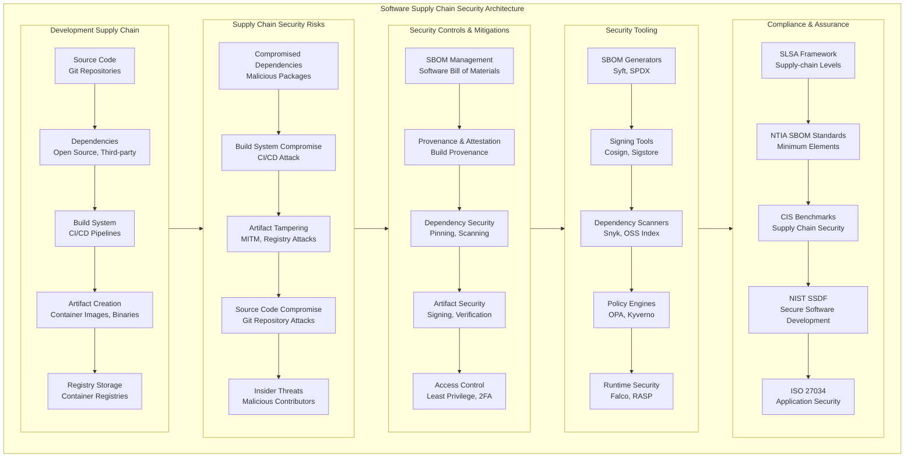
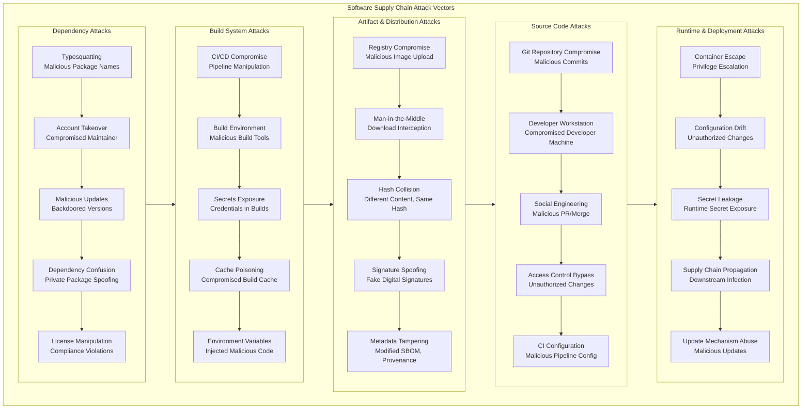
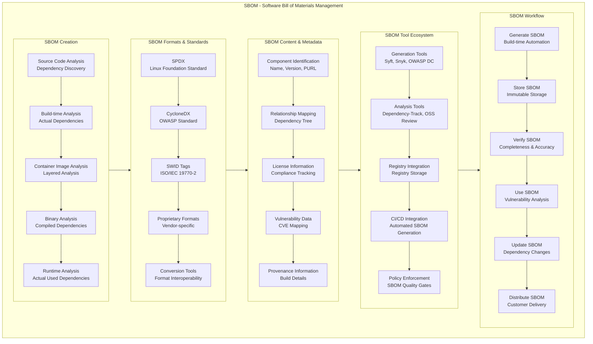
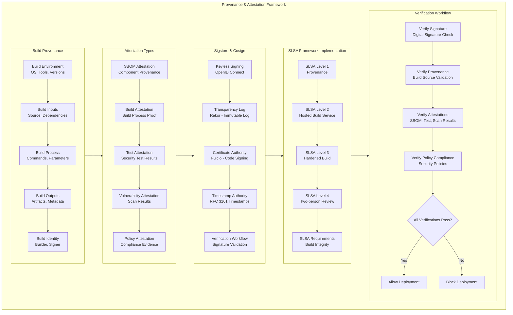
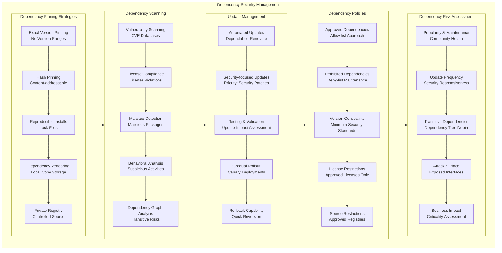
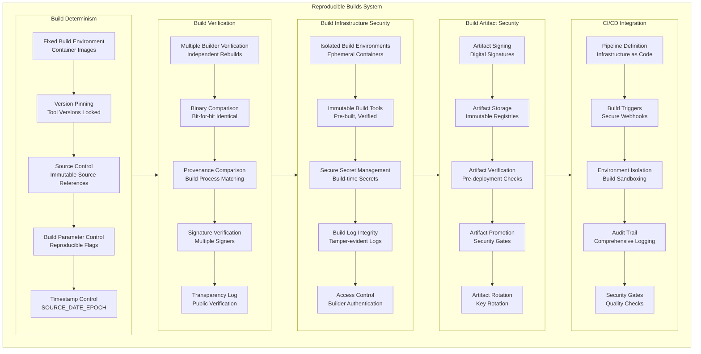
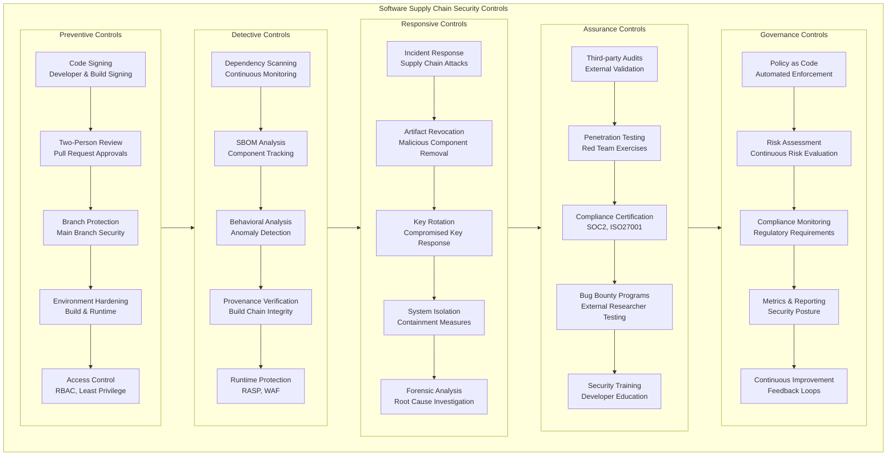
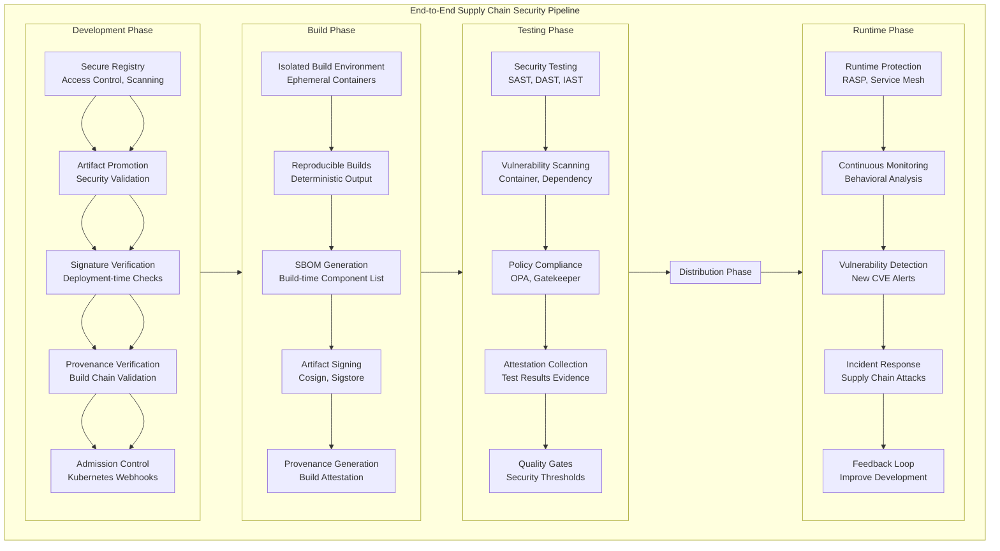

# Software Supply Chain Security: Comprehensive Guide

## 1. Complete Software Supply Chain Security Architecture



## 2. Software Supply Chain Attack Vectors



## 3. SBOM (Software Bill of Materials) Management



## 4. Provenance and Attestation Framework



## 5. Dependency Security Management



## 6. Reproducible Builds System



## 7. Software Supply Chain Security Controls



## 8. End-to-End Supply Chain Security Pipeline



## Detailed Explanations and Implementation

### 1. SBOM Implementation Best Practices

**SBOM Generation and Management:**

```bash
#!/bin/bash
# Automated SBOM generation pipeline

# Generate SBOM during build
echo "Generating SBOM for application..."
syft packages src/ -o spdx-json > sbom.spdx.json

# Generate SBOM for container image
syft myapp:latest -o cyclonedx-json > sbom.cyclonedx.json

# Attach SBOM to container image
cosign attach sbom --sbom sbom.spdx.json myapp:latest

# Verify SBOM attachment
cosign verify-attestation --type spdxjson myapp:latest

# Store SBOM in artifact repository
curl -X POST https://artifact-registry/sboms \
  -H "Authorization: Bearer $TOKEN" \
  -F "sbom=@sbom.spdx.json"
```

**SBOM Quality Requirements:**
- **Completeness**: All direct and transitive dependencies
- **Accuracy**: Correct versions and relationships
- **Timeliness**: Generated with each build
- **Accessibility**: Available to security teams and customers
- **Actionability**: Integrated with vulnerability management

### 2. Provenance and Attestation Implementation

**Build Provenance with SLSA:**

```yaml
# GitHub Actions SLSA provenance generation
name: SLSA Build with Provenance
on:
  workflow_dispatch:
  push:
    branches: [main]

jobs:
  build:
    runs-on: ubuntu-latest
    steps:
    - uses: actions/checkout@v3
    
    - name: Build container
      run: |
        docker build -t myapp:${{ github.sha }} .
        docker save myapp:${{ github.sha }} > myapp.tar
        
    - name: Generate SLSA provenance
      uses: slsa-framework/slsa-github-generator/.github/actions/generator@v1.2.0
      with:
        base64-subjects: "${{ hashFiles('myapp.tar') }}"
        upload-assets: true
        
    - name: Sign provenance
      uses: sigstore/cosign-installer@v2.6.0
      with:
        cosign-release: 'v1.11.0'
        
    - name: Sign container image
      run: |
        cosign sign --key cosign.key myapp:${{ github.sha }}
        cosign attest --key cosign.key --type slsaprovenance myapp:${{ github.sha }}
```

**Provenance Verification:**

```bash
#!/bin/bash
# Verify provenance before deployment

# Verify image signature
cosign verify --key cosign.pub myapp:latest

# Verify SLSA provenance attestation
cosign verify-attestation --key cosign.pub \
  --type slsaprovenance myapp:latest

# Verify SBOM attestation
cosign verify-attestation --key cosign.pub \
  --type spdxjson myapp:latest

# Check transparency log
cosign verify --key cosign.pub \
  --certificate-identity-regexp '.*' \
  --certificate-oidc-issuer https://token.actions.githubusercontent.com \
  myapp:latest
```

### 3. Dependency Security Implementation

**Dependency Pinning Strategy:**

```python
# requirements.txt with exact pinning
Django==4.2.1
requests==2.28.2
cryptography==39.0.1
celery==5.2.7

# requirements.in for pip-tools
Django>=4.2,<5.0
requests>=2.28,<3.0
cryptography>=39.0,<40.0
```

```yaml
# GitHub Actions dependency scanning
name: Dependency Security
on:
  schedule:
    - cron: '0 0 * * 0'  # Weekly scans
  push:
    branches: [main]

jobs:
  dependency-scan:
    runs-on: ubuntu-latest
    steps:
    - uses: actions/checkout@v3
    
    - name: Run Snyk to check for vulnerabilities
      uses: snyk/actions/python@master
      env:
        SNYK_TOKEN: ${{ secrets.SNYK_TOKEN }}
      with:
        args: --severity-threshold=high
        
    - name: OSS Index Scan
      uses: sonatype-nexus-community/scan-action@main
      with:
        path: .
        
    - name: Check licenses
      uses: fossa-contrib/fossa-action@main
      with:
        api-key: ${{ secrets.FOSSA_API_KEY }}
```

### 4. Reproducible Builds Implementation

**Dockerfile for Reproducible Builds:**

```dockerfile
# Use specific base image digest
FROM alpine:3.18@sha256:eece025e432126ce23f223450a0326fbebde39cdf496a85d8c016293fc851f65

# Pin package versions
RUN apk add --no-cache \
    python3=3.9.18-r0 \
    py3-pip=20.3.4-r1 \
    && pip3 install --no-cache-dir \
    django==4.2.1 \
    requests==2.28.2

# Set reproducible timestamp
ARG SOURCE_DATE_EPOCH
LABEL org.opencontainers.image.created=$SOURCE_DATE_EPOCH

# Use specific user ID
USER 1000:1000

# Non-root user and fixed paths
WORKDIR /app
COPY --chown=1000:1000 . .

# Fixed command
CMD ["python3", "app.py"]
```

**Build Script with Reproducibility:**

```bash
#!/bin/bash
# Reproducible build script

# Set reproducible timestamp
export SOURCE_DATE_EPOCH=$(git log -1 --pretty=%ct)

# Build with fixed parameters
docker build \
  --build-arg SOURCE_DATE_EPOCH=$SOURCE_DATE_EPOCH \
  --tag myapp:$GIT_SHA \
  .

# Generate build provenance
cat > provenance.json << EOF
{
  "builder": "docker",
  "build_timestamp": "$(date -u -d @$SOURCE_DATE_EPOCH)",
  "source": {
    "git_commit": "$GIT_SHA",
    "git_url": "$GIT_URL"
  },
  "dependencies": {
    "base_image": "alpine@sha256:eece025e432126ce23f223450a0326fbebde39cdf496a85d8c016293fc851f65"
  }
}
EOF
```

### 5. Supply Chain Policy Enforcement

**Kyverno Policies for Supply Chain Security:**

```yaml
apiVersion: kyverno.io/v1
kind: ClusterPolicy
metadata:
  name: require-sbom
spec:
  background: false
  rules:
  - name: check-sbom-attestation
    match:
      resources:
        kinds:
        - Pod
    validate:
      message: "All containers must have SBOM attestation"
      pattern:
        spec:
          containers:
          - image: "*"
            # This would require cosign verification in real implementation
            
---
apiVersion: kyverno.io/v1
kind: ClusterPolicy
metadata:
  name: block-unpinned-images
spec:
  background: false
  rules:
  - name: require-image-digest
    match:
      resources:
        kinds:
        - Pod
    validate:
      message: "Container images must be pinned by digest"
      pattern:
        spec:
          containers:
          - image: "*@sha256:*"
```

**OPA Policies for Dependency Security:**

```rego
# rego policy for dependency security
package artifactsecurity

# Deny deployment if critical vulnerabilities found
deny[msg] {
    some container in input.review.object.spec.containers
    vuln_count := vuln_data.images[container.image].critical
    vuln_count > 0
    msg := sprintf("Image %v has %d critical vulnerabilities", [container.image, vuln_count])
}

# Require SBOM for all images
deny[msg] {
    some container in input.review.object.spec.containers
    not has_sbom(container.image)
    msg := sprintf("Image %v missing SBOM attestation", [container.image])
}

has_sbom(image) {
    # Check if image has SBOM attestation
    cosign.verify_attestation(image, "spdxjson")
}
```

### 6. Continuous Monitoring and Response

**Supply Chain Monitoring Dashboard:**

```yaml
# Grafana dashboard for supply chain security
apiVersion: v1
kind: ConfigMap
metadata:
  name: supply-chain-dashboard
  labels:
    grafana_dashboard: "1"
data:
  supply-chain.json: |
    {
      "dashboard": {
        "title": "Software Supply Chain Security",
        "panels": [
          {
            "title": "SBOM Coverage",
            "type": "stat",
            "targets": [
              {
                "expr": "sum(sbom_generated) / sum(images_built) * 100",
                "legendFormat": "SBOM Coverage"
              }
            ]
          },
          {
            "title": "Critical Vulnerabilities",
            "type": "graph",
            "targets": [
              {
                "expr": "sum(vulnerabilities{severity=\"critical\"}) by (image)",
                "legendFormat": "{{image}}"
              }
            ]
          },
          {
            "title": "Provenance Verification Rate",
            "type": "stat",
            "targets": [
              {
                "expr": "sum(provenance_verified) / sum(deployments) * 100",
                "legendFormat": "Provenance Verified"
              }
            ]
          }
        ]
      }
    }
```

**Incident Response Playbook for Supply Chain Attacks:**

```yaml
# Supply chain incident response playbook
apiVersion: v1
kind: ConfigMap
metadata:
  name: supply-chain-ir-playbook
data:
  playbook.yaml: |
    stages:
      - detection:
          triggers:
            - malicious_dependency_detected
            - build_system_compromise
            - artifact_tampering_alert
          
      - containment:
          actions:
            - block_malicious_dependencies
            - revoke_compromised_artifacts
            - isolate_build_systems
          
      - eradication:
          actions:
            - identify_root_cause
            - remove_malicious_components
            - rotate_compromised_keys
          
      - recovery:
          actions:
            - rebuild_clean_artifacts
            - redeploy_verified_systems
            - update_security_controls
          
      - post_incident:
          actions:
            - conduct_root_cause_analysis
            - update_policies_procedures
            - share_lessons_learned
```

## Key Best Practices Summary

### 1. SBOM Management
- **Generate SBOMs automatically** with every build
- **Use standard formats** (SPDX, CycloneDX) for interoperability
- **Store SBOMs immutably** with corresponding artifacts
- **Verify SBOM completeness** and accuracy regularly
- **Distribute SBOMs** to customers and security teams

### 2. Provenance and Attestation
- **Implement SLSA framework** for build integrity
- **Use Sigstore** for keyless signing and verification
- **Generate build provenance** for all artifacts
- **Verify attestations** before deployment
- **Maintain transparency logs** for auditability

### 3. Dependency Security
- **Pin all dependencies** to exact versions or digests
- **Scan dependencies continuously** for vulnerabilities
- **Maintain approved dependency lists**
- **Implement automated dependency updates**
- **Monitor for dependency confusion attacks**

### 4. Reproducible Builds
- **Use fixed build environments** and tool versions
- **Control build parameters** for deterministic output
- **Verify builds independently** across multiple systems
- **Document build processes** completely
- **Test reproducibility** regularly

### 5. Policy Enforcement
- **Implement policy as code** for security requirements
- **Use admission controllers** for runtime enforcement
- **Establish security gates** in CI/CD pipelines
- **Monitor policy compliance** continuously
- **Automate security controls** wherever possible

### 6. Continuous Monitoring
- **Monitor supply chain metrics** and security posture
- **Implement runtime protection** (RASP, service mesh)
- **Establish incident response** procedures for supply chain attacks
- **Conduct regular security assessments**
- **Maintain audit trails** for all supply chain activities

This comprehensive approach to software supply chain security ensures that organizations can prevent, detect, and respond to supply chain attacks while maintaining the integrity and security of their software delivery process.

