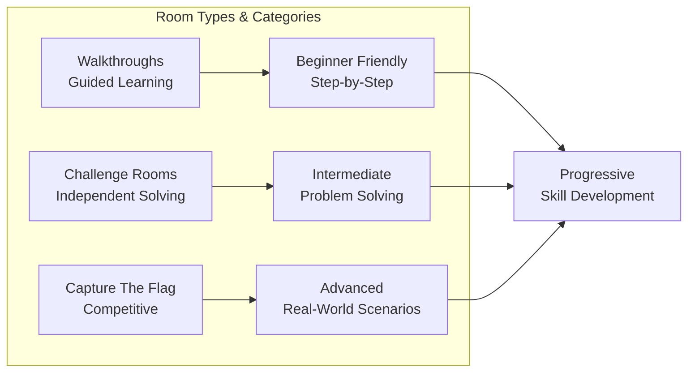
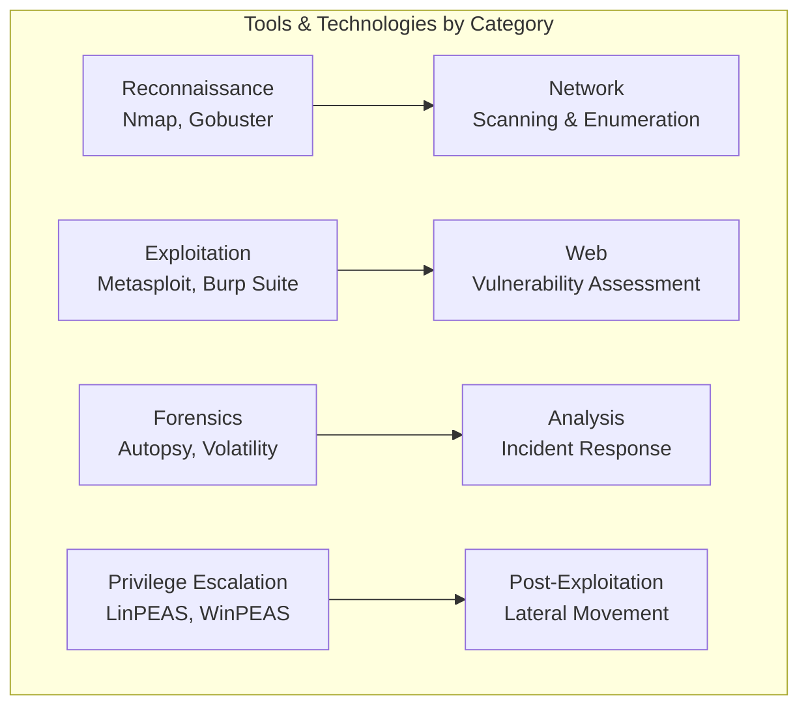

# TryHackMe.com - Cybersecurity Learning Platform

# Click here to go bottom of the page --> [TryHackMe.com - Solved rooms and labs Solutions]
## Overview about the Platform

**TryHackMe.com** is an online platform for learning and teaching cybersecurity through hands-on, interactive labs and virtual environments. It provides a gamified approach to cybersecurity education suitable for beginners to advanced practitioners.

```mermaid
flowcard TD
    subgraph PLATFORM["TryHackMe Learning Ecosystem"]
        A1["Learning Paths<br>Structured Curriculum"] --> B1["Virtual Rooms<br>Hands-on Labs"]
        A2["Skill Assessments<br>Knowledge Checks"] --> B2["Challenges<br>CTF-Style Exercises"]
        A3["Community<br>Discord & Forums"] --> B3["Career Paths<br>Role-Specific Training"]
    
        B1 --> C1["Progressive Difficulty<br>Beginner to Advanced"]
        B2 --> C2["Real-World Scenarios<br>Practical Application"]
        B3 --> C3["Industry Recognition<br>Skill Validation"]
    end
    
```

## Key Features

### 🎯 Learning Paths & Career Tracks
- **Complete Beginner** - Introduction to cybersecurity fundamentals
- **Jr. Penetration Tester** - Ethical hacking and penetration testing
- **Cyber Defense** - Blue team and defensive security
- **Security Engineer** - Security operations and engineering
- **Pre Security** - Foundational IT and security knowledge
- **SOC Level 1** - Security Operations Center training
- **Red Team** - Advanced offensive security
- **CompTIA Pentest+** - Certification preparation

### 🏠 Virtual Rooms & Labs


### 🛠️ Technical Infrastructure
- **Web-based Access** - No complex setup required
- **Built-in VPN** - Secure connection to hackable machines
- **AttackBox** - Pre-configured Kali Linux environment
- **Virtual Machines** - Vulnerable machines for practice
- **Instant Deployment** - One-click machine deployment

## Learning Methodology

### Structured Progression
```
Fundamentals → Specific Skills → Real-World Scenarios → Advanced Techniques
     ↓              ↓                 ↓                    ↓
Basic Concepts → Tool Usage → Vulnerability Exploitation → Advanced Attacks
```

### Hands-On Approach
- **Interactive Labs** - Learn by doing
- **Immediate Feedback** - Real-time result validation
- **Progressive Difficulty** - Gradual skill development
- **Practical Application** - Directly applicable skills

## Popular Learning Paths

### 🔴 Offensive Security Track
```
1. Introduction to Cyber Security
2. Pre Security Fundamentals
3. Complete Beginner Path
4. Jr. Penetration Tester
5. Red Team Path
6. Advanced Exploitation Techniques
```

### 🔵 Defensive Security Track
```
1. Cyber Defense Introduction
2. SOC Level 1 Training
3. Threat Intelligence
4. Digital Forensics
5. Incident Response
6. Security Monitoring
```

## Technical Content Coverage

### Core Cybersecurity Domains
| Domain | Topics Covered | Skill Level |
|--------|----------------|-------------|
| **Network Security** | Scanning, Enumeration, Exploitation | Beginner-Advanced |
| **Web Application Security** | OWASP Top 10, API Security | Intermediate-Advanced |
| **Cryptography** | Encryption, Hashing, Cryptanalysis | Beginner-Advanced |
| **Digital Forensics** | Memory Analysis, Disk Forensics | Intermediate-Advanced |
| **Malware Analysis** | Reverse Engineering, Static/Dynamic Analysis | Advanced |
| **Active Directory** | AD Attacks, Privilege Escalation | Intermediate-Advanced |

### Tools & Technologies Practiced


## Platform Advantages

### ✅ For Beginners
- **No prior experience required** - Starts from absolute basics
- **Guided learning** - Step-by-step instructions
- **Supportive community** - Active Discord and forums
- **Visual learning** - Diagrams and interactive elements

### ✅ For Intermediate Learners
- **Skill progression** - Clear path for advancement
- **Real-world scenarios** - Practical application of knowledge
- **Tool proficiency** - Hands-on experience with industry tools
- **Challenge variety** - Diverse problem types

### ✅ For Advanced Professionals
- **Advanced attack techniques** - Complex exploitation methods
- **Red team operations** - Simulated enterprise environments
- **Latest vulnerabilities** - Current CVEs and attack vectors
- **Skill validation** - Proof of capability through completion

## Subscription Models

### Free Tier
- **Access to** introductory rooms and learning paths
- **Limited machine access** - Queue-based system
- **Community content** - User-created rooms
- **Basic learning** - Foundational cybersecurity concepts

### Premium Subscription
- **Unlimited access** to all rooms and learning paths
- **Priority machine access** - No waiting queues
- **Ad-free experience** - Clean learning environment
- **Progress tracking** - Detailed analytics and metrics
- **Certificates** - Completion certificates for paths

## Integration with Career Development

### Skill Validation
- **Room completions** - Demonstrated practical skills
- **Rank system** - Global ranking based on performance
- **Achievements** - Badges and recognition for milestones
- **Portfolio building** - Track record of completed challenges

### Industry Recognition
- **Employer recognition** - Growing acceptance in hiring
- **Skill demonstration** - Practical proof of capability
- **Continuous learning** - Stay current with evolving threats
- **Community reputation** - Build credibility in cybersecurity circles

## Community & Collaboration

### Learning Community
- **Active Discord** - Real-time help and discussion
- **Write-ups sharing** - Solution explanations and methodologies
- **Team competitions** - Collaborative learning events
- **Mentorship opportunities** - Learn from experienced members

### Content Creation
- **Room creation** - Users can create their own challenges
- **Knowledge sharing** - Contribute to community learning
- **Peer review** - Community feedback on solutions
- **Collaborative learning** - Group study sessions

## Comparison with Alternatives

### TryHackMe vs HackTheBox
| Feature | TryHackMe | HackTheBox |
|---------|-----------|------------|
| **Beginner Friendly** | ✅ Excellent | ❌ Steep learning curve |
| **Structured Learning** | ✅ Comprehensive paths | ❌ Self-directed |
| **Guided Content** | ✅ Step-by-step | ❌ Independent solving |
| **Advanced Content** | ✅ Available | ✅ Extensive |
| **Cost** | ✅ Affordable premium | ✅ Similar pricing |

## Success Metrics

### Platform Statistics
- **500,000+** registered users
- **1000+** available rooms and challenges
- **200+** learning modules
- **50+** complete learning paths
- **Global community** from 180+ countries

### Skill Development Impact
- **80%** of users report improved job readiness
- **60%** attribute career advancement to platform skills
- **95%** satisfaction rate among premium subscribers
- **Industry recognition** from cybersecurity employers

## Getting Started Guide

### Recommended Learning Path
1. **Create free account** - Basic access to start
2. **Complete "Intro to Cyber Security"** - Foundation building
3. **Try beginner rooms** - Hands-on practice
4. **Join learning paths** - Structured progression
5. **Engage with community** - Discord and forums
6. **Consider premium** - For unlimited access

### Best Practices
- **Take notes** - Document learnings and techniques
- **Join community** - Participate in discussions
- **Practice regularly** - Consistent skill development
- **Challenge yourself** - Progress to harder rooms
- **Share knowledge** - Write-ups and teaching others

---

*TryHackMe provides a comprehensive, accessible pathway into cybersecurity with practical, hands-on learning that directly translates to real-world skills and career advancement opportunities.*

## TryHackMe.com - Solved rooms and labs Solutions

### 🔍 List of Solved Rooms and Labs

| Room/Lab Name | Category | Difficulty | Link to Solution |
|---------------|----------|------------|------------------|
| Basic Networking | Networking | Beginner | [Solution](link-to-solution) |
| Web Application Basics | Web Security | Beginner | [Solution](link-to-solution) |
| Linux Privilege Escalation | Linux | Intermediate | [Solution](link-to-solution) |
| Active Directory Attacks | Active Directory | Advanced | [Solution](link-to-solution  ) |
| Incident Response Fundamentals | Digital Forensics | Intermediate | [Solution](link-to-solution) |            
| Metasploit for Beginners | Exploitation | Beginner | [Solution](link-to-solution) |
| Cryptography Challenges | Cryptography | Intermediate | [Solution](link-to-solution) |
| Red Team Operations | Red Team | Advanced | [Solution](link-to-solution) |

*Note: Replace "link-to-solution" with actual URLs to the solutions for each room/lab.*


### 📂 How to Use These Solutions   
- **Reference Only**: Use these solutions as a guide to understand the methodologies and techniques used.
- **Practice First**: Attempt the rooms/labs on your own before consulting the solutions.
- **Learn Actively**: Take notes on new tools, commands, and strategies encountered in
    the solutions.
- **Contribute Back**: If you have improved solutions or additional insights, consider sharing them with the community.
- **Stay Updated**: Regularly check for new rooms/labs and updated solutions as the platform evolves.